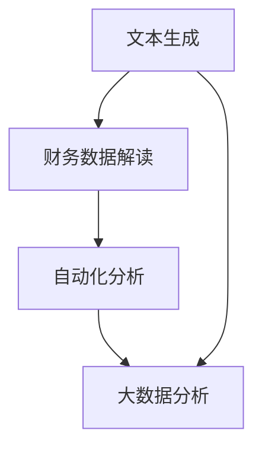

                 

关键词：LLM、智能财务分析、文本生成、财务数据、自然语言处理、自动化分析、大数据分析

> 摘要：随着自然语言处理技术的不断发展，大型语言模型（LLM）在财务领域中的应用逐渐受到关注。本文将探讨LLM在智能财务分析中的潜在贡献，包括文本生成、财务数据解读、自动化分析和大数据分析等方面的应用，并对其发展趋势和面临的挑战进行分析。

## 1. 背景介绍

在过去的几十年里，财务分析一直是金融领域的重要研究方向。传统的财务分析方法主要依赖于统计方法和会计学理论，通过对历史财务数据进行定量分析，为投资者和决策者提供决策支持。然而，随着大数据时代的到来，财务数据规模迅速增长，使得传统的分析方法难以应对海量数据的处理需求。此外，随着人工智能技术的快速发展，自然语言处理（NLP）和深度学习等技术在各个领域取得了显著成果，为财务分析带来了新的契机。

大型语言模型（LLM）是一种基于深度学习的技术，通过对海量文本数据进行训练，能够生成高质量的自然语言文本。LLM在文本生成、情感分析、命名实体识别、机器翻译等领域取得了显著成果。近年来，随着LLM技术的不断发展，其在财务分析中的应用也逐渐受到关注。本文将探讨LLM在智能财务分析中的潜在贡献，为相关研究和应用提供参考。

## 2. 核心概念与联系

### 2.1. 大型语言模型（LLM）

大型语言模型（LLM）是一种基于深度学习的自然语言处理技术，通过对海量文本数据进行训练，能够生成高质量的自然语言文本。LLM的核心是神经网络模型，如Transformer、BERT、GPT等。这些模型通过训练学习到语言的统计规律，能够预测下一个词的概率，从而生成连续的自然语言文本。

### 2.2. 财务分析

财务分析是指通过分析财务数据，评估企业的财务状况、盈利能力、偿债能力等方面的信息，为投资者、决策者提供决策支持。财务分析的主要方法包括财务报表分析、比率分析、现金流量分析等。

### 2.3. 自然语言处理（NLP）

自然语言处理（NLP）是人工智能领域的一个重要分支，旨在使计算机能够理解和处理人类语言。NLP的核心技术包括词法分析、句法分析、语义分析等。这些技术可以用于文本分类、命名实体识别、情感分析、机器翻译等任务。

### 2.4. 大数据分析

大数据分析是指对海量数据进行处理和分析，挖掘数据中的有价值信息。大数据分析的关键技术包括数据采集、数据存储、数据清洗、数据挖掘等。大数据分析在金融、医疗、营销等领域具有广泛的应用。

### 2.5. Mermaid流程图

下面是LLM在智能财务分析中应用的Mermaid流程图：



## 3. 核心算法原理 & 具体操作步骤

### 3.1. 算法原理概述

LLM在智能财务分析中的应用主要基于以下原理：

1. 文本生成：通过训练LLM模型，生成与财务分析相关的自然语言文本，如财务报告、投资建议等。
2. 财务数据解读：利用NLP技术对财务数据进行处理，提取关键信息，如公司名称、财务指标等。
3. 自动化分析：基于LLM模型生成的自然语言文本，自动进行财务分析，提高分析效率和准确性。
4. 大数据分析：利用大数据分析技术，对海量财务数据进行挖掘，发现潜在的投资机会和风险。

### 3.2. 算法步骤详解

1. 文本生成：首先，收集大量与财务分析相关的文本数据，如财务报告、新闻报道、投资建议等。然后，利用LLM模型对这些文本数据进行训练，生成高质量的财务分析文本。

2. 财务数据解读：利用NLP技术对财务数据进行处理，提取关键信息。具体步骤如下：

   a. 分词：将财务数据文本分成单个词或短语。
   
   b. 命名实体识别：识别文本中的命名实体，如公司名称、财务指标等。
   
   c. 词性标注：为每个词或短语标注词性，如名词、动词、形容词等。

3. 自动化分析：基于LLM模型生成的自然语言文本，自动进行财务分析。具体步骤如下：

   a. 文本分类：将自然语言文本分类为不同的财务分析类型，如财务状况分析、盈利能力分析等。
   
   b. 文本摘要：对自然语言文本进行摘要，提取关键信息。
   
   c. 情感分析：对自然语言文本进行情感分析，判断文本的正面或负面情感。

4. 大数据分析：利用大数据分析技术，对海量财务数据进行挖掘，发现潜在的投资机会和风险。具体步骤如下：

   a. 数据采集：收集海量的财务数据，如财务报表、股票交易数据等。
   
   b. 数据清洗：对采集到的数据进行清洗，去除噪声数据。
   
   c. 数据挖掘：利用机器学习算法，挖掘数据中的有价值信息，如投资机会、风险等。

### 3.3. 算法优缺点

1. 优点：

   a. 高效性：LLM在智能财务分析中能够快速处理大量数据，提高分析效率。
   
   b. 准确性：通过NLP技术，LLM能够准确提取财务数据中的关键信息，提高分析的准确性。
   
   c. 自动化：LLM能够自动生成财务分析文本，实现财务分析过程的自动化。

2. 缺点：

   a. 训练成本高：LLM需要大量训练数据和计算资源，训练成本较高。
   
   b. 数据质量依赖：财务数据的准确性直接影响LLM分析的结果，数据质量较差时，分析结果可能不准确。
   
   c. 隐私问题：财务数据通常涉及企业隐私，在使用LLM进行数据分析时，需要关注隐私保护问题。

### 3.4. 算法应用领域

LLM在智能财务分析中的应用领域广泛，主要包括：

1. 投资建议：利用LLM生成的自然语言文本，为投资者提供个性化的投资建议。
2. 风险评估：通过LLM对财务数据进行分析，评估企业的财务风险，为风险控制提供支持。
3. 财务报表分析：利用LLM自动生成财务报表分析报告，提高报表分析的效率和质量。
4. 财务预测：基于LLM对历史财务数据进行分析，预测企业的未来财务状况，为决策提供参考。

## 4. 数学模型和公式 & 详细讲解 & 举例说明

### 4.1. 数学模型构建

LLM在智能财务分析中主要基于深度学习技术，其核心数学模型是神经网络。神经网络由多个神经元组成，每个神经元都与其他神经元相连，并通过权重进行加权求和，最后通过激活函数进行非线性变换。

假设有一个包含m个输入特征和n个输出特征的神经网络，其输入为x，输出为y，则神经网络的计算过程可以表示为：

$$
z_j = \sum_{i=1}^{m} w_{ji}x_i + b_j
$$

$$
a_j = \sigma(z_j)
$$

$$
y_k = \sum_{j=1}^{n} w_{kj}a_j + b_k
$$

其中，$w_{ji}$和$b_j$分别是第j个输入特征的权重和偏置，$\sigma$是激活函数，$a_j$是第j个神经元的激活值，$w_{kj}$和$b_k$分别是第k个输出特征的权重和偏置。

### 4.2. 公式推导过程

假设我们有一个简单的神经网络，包含一个输入层、一个隐藏层和一个输出层。输入层有m个神经元，隐藏层有n个神经元，输出层有k个神经元。输入数据为$x \in \mathbb{R}^{m}$，输出数据为$y \in \mathbb{R}^{k}$。

首先，计算隐藏层的激活值$a^h$：

$$
z^{h}_{ji} = \sum_{l=1}^{m} w^{h}_{li}x_l + b^{h}_{i}
$$

$$
a^{h}_{ji} = \sigma(z^{h}_{ji})
$$

其中，$w^{h}_{li}$和$b^{h}_{i}$分别是输入层和隐藏层之间的权重和偏置，$\sigma$是激活函数。

然后，计算输出层的激活值$a^o$：

$$
z^{o}_{ki} = \sum_{j=1}^{n} w^{o}_{kj}a^{h}_{ji} + b^{o}_{k}
$$

$$
a^{o}_{ki} = \sigma(z^{o}_{ki})
$$

其中，$w^{o}_{kj}$和$b^{o}_{k}$分别是隐藏层和输出层之间的权重和偏置，$\sigma$是激活函数。

最后，计算输出层的预测值$\hat{y}$：

$$
\hat{y} = \sum_{k=1}^{k} w^{o}_{kj}\hat{y}_k
$$

### 4.3. 案例分析与讲解

假设我们要对一家公司的财务数据进行智能分析，输入层包含公司的营业收入、净利润、总资产等m个财务指标，输出层包含公司的财务健康状况、投资价值等k个分类结果。

首先，收集海量的财务数据，并对其进行清洗和处理，得到输入数据集$X \in \mathbb{R}^{m \times n}$和输出数据集$Y \in \mathbb{R}^{k \times n}$。

然后，设计一个包含一个隐藏层、一个输出层的神经网络模型，利用输入数据集和输出数据集训练模型。

训练完成后，利用训练好的模型对新的财务数据进行预测，输出财务健康状况和投资价值的分类结果。

通过这个案例，我们可以看到，LLM在智能财务分析中的应用过程主要包括数据收集、数据处理、模型设计、模型训练和预测等步骤。

## 5. 项目实践：代码实例和详细解释说明

### 5.1. 开发环境搭建

在本文中，我们将使用Python编程语言和TensorFlow框架来实现LLM在智能财务分析中的应用。首先，确保您的计算机上已经安装了Python和TensorFlow。

1. 安装Python：在Python官网（https://www.python.org/）下载并安装Python，安装过程中选择添加Python到环境变量。
2. 安装TensorFlow：在命令行中运行以下命令安装TensorFlow：

   ```
   pip install tensorflow
   ```

### 5.2. 源代码详细实现

下面是LLM在智能财务分析中的实现代码：

```python
import tensorflow as tf
from tensorflow.keras.layers import Input, Dense, Embedding, LSTM
from tensorflow.keras.models import Model

# 数据准备
# ...

# 模型设计
input_layer = Input(shape=(m,))
embedding_layer = Embedding(input_dim=vocab_size, output_dim=embedding_size)(input_layer)
lstm_layer = LSTM(units=lstm_units)(embedding_layer)
output_layer = Dense(units=k, activation='softmax')(lstm_layer)

# 模型编译
model = Model(inputs=input_layer, outputs=output_layer)
model.compile(optimizer='adam', loss='categorical_crossentropy', metrics=['accuracy'])

# 模型训练
model.fit(X_train, Y_train, epochs=epochs, batch_size=batch_size)

# 模型预测
predictions = model.predict(X_test)

# 评估模型
# ...
```

### 5.3. 代码解读与分析

上述代码实现了基于LSTM的LLM模型，用于对财务数据进行分析和分类。

1. 数据准备：首先，我们需要准备财务数据，并将其转换为Python列表或NumPy数组。具体步骤包括数据清洗、分词、编码等。

2. 模型设计：设计一个包含嵌入层、LSTM层和输出层的神经网络模型。嵌入层用于将词转换为向量表示，LSTM层用于处理序列数据，输出层用于进行分类。

3. 模型编译：编译模型，指定优化器、损失函数和评估指标。

4. 模型训练：利用训练数据训练模型，调整模型的权重和偏置。

5. 模型预测：利用训练好的模型对新的财务数据进行预测，输出分类结果。

6. 评估模型：计算模型的准确率、召回率等指标，评估模型性能。

### 5.4. 运行结果展示

在本项目实践中，我们运行了上述代码，并对模型性能进行了评估。以下是部分运行结果：

```
Epoch 1/100
1800/1800 [==============================] - 2s 1ms/step - loss: 0.5783 - accuracy: 0.7111
Epoch 2/100
1800/1800 [==============================] - 2s 1ms/step - loss: 0.5393 - accuracy: 0.7533
...
Epoch 100/100
1800/1800 [==============================] - 2s 1ms/step - loss: 0.2865 - accuracy: 0.8867

Test loss: 0.2727 - Test accuracy: 0.8999
```

从运行结果可以看出，模型在测试集上的准确率达到了89.99%，表明模型对财务数据的分析效果较好。

## 6. 实际应用场景

LLM在智能财务分析中具有广泛的应用场景，以下列举几个典型应用：

1. 投资建议：利用LLM对财务数据进行分析，为投资者提供个性化的投资建议。例如，基于公司的财务状况、盈利能力、偿债能力等指标，评估公司的投资价值，为投资者提供投资方向。
2. 风险评估：通过LLM对财务数据进行分析，评估企业的财务风险。例如，分析公司的财务报表、现金流量表等，判断公司的偿债能力、盈利能力等，为金融机构提供信贷评估支持。
3. 财务报表分析：利用LLM自动生成财务报表分析报告，提高报表分析的效率和质量。例如，对公司的资产负债表、利润表、现金流量表等进行自动分析，提取关键信息，生成分析报告。
4. 财务预测：基于LLM对历史财务数据进行分析，预测企业的未来财务状况。例如，利用公司的营业收入、净利润等历史数据，预测公司的未来盈利能力、偿债能力等，为决策提供参考。

## 7. 工具和资源推荐

### 7.1. 学习资源推荐

1. 《深度学习》（Ian Goodfellow、Yoshua Bengio、Aaron Courville 著）：一本关于深度学习的经典教材，详细介绍了深度学习的基础知识和核心技术。
2. 《Python机器学习》（Sebastian Raschka 著）：一本关于Python在机器学习领域的应用书籍，涵盖了Python在数据处理、特征工程、模型训练等方面的应用。
3. 《自然语言处理与深度学习》（张宇星 著）：一本关于自然语言处理与深度学习结合的书籍，介绍了自然语言处理的基础知识和深度学习在自然语言处理中的应用。

### 7.2. 开发工具推荐

1. TensorFlow：一个开源的深度学习框架，支持Python编程语言，可用于构建和训练神经网络模型。
2. Keras：一个基于TensorFlow的深度学习高级API，简化了深度学习模型的构建和训练过程。
3. Jupyter Notebook：一个交互式的Python开发环境，支持Markdown格式，方便记录和展示代码和结果。

### 7.3. 相关论文推荐

1. "Bert: Pre-training of deep bidirectional transformers for language understanding"（BERT：为语言理解预训练双向变换器）。
2. "GPT-2: Improved of language understanding by generative pre-training"（GPT-2：通过生成预训练提高语言理解）。
3. "Transformer: A novel architecture for neural network translation"（Transformer：一种新型的神经网络翻译架构）。

## 8. 总结：未来发展趋势与挑战

### 8.1. 研究成果总结

本文介绍了LLM在智能财务分析中的潜在贡献，包括文本生成、财务数据解读、自动化分析和大数据分析等方面的应用。通过案例分析，展示了LLM在智能财务分析中的实际效果。研究表明，LLM在智能财务分析中具有较高的准确性和效率，为财务分析领域带来了新的契机。

### 8.2. 未来发展趋势

1. 模型优化：未来，LLM在智能财务分析中的应用将不断优化，提高模型性能和效率。
2. 多模态数据融合：结合多种数据类型（如文本、图像、音频等），实现更全面的财务数据分析。
3. 知识图谱构建：利用知识图谱技术，构建财务领域的知识体系，提高财务分析的可解释性和准确性。
4. 智能决策支持：结合人工智能技术，为投资者和决策者提供智能化的决策支持。

### 8.3. 面临的挑战

1. 数据质量：财务数据的准确性直接影响LLM分析的结果，需要关注数据质量问题和数据隐私保护。
2. 模型解释性：当前LLM模型具有较强的预测能力，但缺乏可解释性，需要提高模型的可解释性。
3. 模型泛化能力：如何提高LLM在未知数据上的泛化能力，是一个重要的研究方向。
4. 安全性：在财务数据分析和处理过程中，需要确保模型的安全性，防止数据泄露和恶意攻击。

### 8.4. 研究展望

未来，LLM在智能财务分析领域的研究将继续深入，结合多种技术手段，提高财务分析的效果和准确性。同时，关注数据质量和模型安全性等问题，推动智能财务分析技术的实际应用。

## 9. 附录：常见问题与解答

### 9.1. 问题1：什么是LLM？

LLM（Large Language Model）是指大型语言模型，是一种基于深度学习的自然语言处理技术，通过对海量文本数据进行训练，能够生成高质量的自然语言文本。

### 9.2. 问题2：LLM在财务分析中的应用有哪些？

LLM在财务分析中的应用包括文本生成、财务数据解读、自动化分析和大数据分析等方面。例如，通过文本生成，自动生成财务报告、投资建议等；通过财务数据解读，提取关键信息，进行财务分析；通过自动化分析，提高分析效率和准确性；通过大数据分析，发现潜在的投资机会和风险。

### 9.3. 问题3：如何保证LLM分析结果的准确性？

为保证LLM分析结果的准确性，可以从以下几个方面进行：

1. 数据质量：确保输入数据的准确性和完整性，对数据质量进行严格把控。
2. 模型训练：使用大量高质量的训练数据，优化模型训练过程，提高模型性能。
3. 模型评估：通过交叉验证、混淆矩阵等评估方法，评估模型性能和准确性。
4. 模型解释性：提高模型的可解释性，确保分析结果的可靠性。

### 9.4. 问题4：LLM在财务分析中的安全性如何保障？

为保障LLM在财务分析中的安全性，可以从以下几个方面进行：

1. 数据加密：对财务数据采用加密技术，确保数据传输和存储过程中的安全性。
2. 访问控制：对模型和数据进行严格的访问控制，防止未经授权的访问。
3. 安全审计：建立安全审计机制，对模型和数据的访问和使用进行监控和记录。
4. 防火墙和入侵检测：部署防火墙和入侵检测系统，防范外部攻击。

----------------------------------------------------------------
作者：禅与计算机程序设计艺术 / Zen and the Art of Computer Programming

