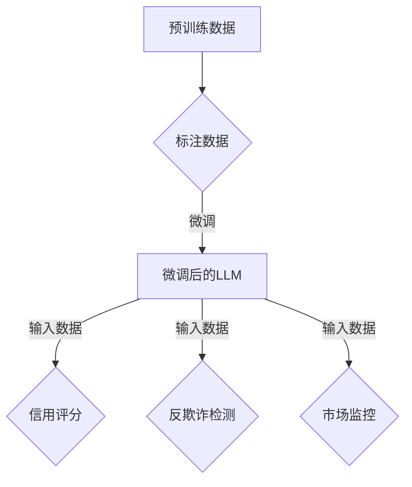

                 

关键词：LLM，金融风控，智能，模型，算法，预测，数据，风险管理，信用评分，反欺诈，市场监控

> 摘要：随着人工智能技术的发展，大语言模型（LLM）在多个领域展现了强大的应用潜力，特别是在金融风控领域。本文将探讨LLM在智能金融风控中的潜在贡献，包括其核心概念、算法原理、应用领域以及未来展望。

## 1. 背景介绍

近年来，人工智能技术，尤其是大语言模型（Large Language Model，LLM）的快速发展，给金融行业带来了前所未有的变革。传统金融风控依赖于大量的历史数据、经验和规则，这些方法在应对复杂、多变的市场环境时，往往显得力不从心。LLM的出现，为金融风控领域提供了一种全新的视角和工具。

LLM，如GPT-3、BERT等，是通过深度学习技术训练出来的模型，具有处理自然语言和理解语义的能力。这些模型可以自动学习从大量文本数据中提取的有用信息，并在各种复杂场景中提供高质量的预测和决策支持。

金融风控是指通过识别、分析和管理金融风险，以保护金融机构和投资者的利益。传统的风控方法主要包括统计模型、机器学习算法和规则引擎等。然而，随着金融市场全球化、信息化和复杂化的发展，这些方法已经无法完全应对新的挑战。LLM的出现，为金融风控提供了一种全新的解决方案。

## 2. 核心概念与联系

### 2.1 大语言模型（LLM）原理

LLM是基于深度神经网络的大型语言模型，其核心思想是通过训练大量的文本数据，使模型能够理解并生成自然语言。LLM的训练过程主要包括两个阶段：

1. **预训练**：使用大量未标注的文本数据对模型进行预训练，使其能够掌握语言的基本规律和特征。
2. **微调**：在预训练的基础上，使用特定领域的标注数据对模型进行微调，使其能够适应特定任务的需求。

### 2.2 金融风控中的LLM应用场景

在金融风控中，LLM的应用场景主要包括：

1. **信用评分**：利用LLM对用户的信用历史、行为数据等进行分析，预测用户的信用风险。
2. **反欺诈**：通过LLM分析交易数据、用户行为等，识别潜在的欺诈行为。
3. **市场监控**：利用LLM对市场新闻、报告等文本信息进行分析，预测市场走势和风险。

### 2.3 Mermaid流程图



## 3. 核心算法原理 & 具体操作步骤

### 3.1 算法原理概述

LLM在金融风控中的应用，主要基于其强大的自然语言处理能力和高精度的预测能力。LLM通过深度学习技术，可以自动提取文本数据中的关键信息，并进行复杂的模式识别和预测。

### 3.2 算法步骤详解

1. **数据预处理**：收集并清洗与金融风控相关的数据，如信用数据、交易数据、市场报告等。
2. **文本表示**：使用词嵌入技术将文本数据转换为向量表示，以便于模型处理。
3. **模型训练**：使用预训练的LLM模型，对预处理后的文本数据进行训练，使其能够理解并处理金融领域的文本数据。
4. **模型评估**：使用验证集对训练好的模型进行评估，调整模型参数，提高模型性能。
5. **模型应用**：将训练好的模型应用于实际场景，如信用评分、反欺诈检测、市场监控等。

### 3.3 算法优缺点

**优点**：

1. **高精度**：LLM具有强大的自然语言处理能力，能够对文本数据进行精细的解析和预测。
2. **灵活性**：LLM可以适应不同的金融风控场景，进行多样化的应用。
3. **自动性**：LLM能够自动学习并处理大量的文本数据，减轻了人工处理的负担。

**缺点**：

1. **计算资源消耗大**：LLM的训练和推理过程需要大量的计算资源。
2. **数据依赖性**：LLM的性能高度依赖于训练数据的质量和数量。
3. **解释性不足**：LLM的预测结果缺乏透明性和可解释性。

### 3.4 算法应用领域

LLM在金融风控中的应用领域广泛，包括：

1. **信用评分**：利用LLM分析用户的信用历史和行为数据，预测用户的信用风险。
2. **反欺诈**：通过LLM分析交易数据、用户行为等，识别潜在的欺诈行为。
3. **市场监控**：利用LLM对市场新闻、报告等文本信息进行分析，预测市场走势和风险。

## 4. 数学模型和公式 & 详细讲解 & 举例说明

### 4.1 数学模型构建

在LLM应用于金融风控时，常用的数学模型主要包括：

1. **回归模型**：用于预测信用评分、市场走势等连续值。
2. **分类模型**：用于识别欺诈行为、信用评级等离散值。

### 4.2 公式推导过程

以回归模型为例，其基本公式为：

\[ Y = \beta_0 + \beta_1X_1 + \beta_2X_2 + ... + \beta_nX_n + \epsilon \]

其中，\( Y \) 为预测值，\( X_1, X_2, ..., X_n \) 为特征值，\( \beta_0, \beta_1, \beta_2, ..., \beta_n \) 为模型参数，\( \epsilon \) 为误差项。

### 4.3 案例分析与讲解

以反欺诈为例，假设我们使用LLM对交易数据进行分类，判断交易是否为欺诈行为。具体步骤如下：

1. **数据收集**：收集大量的交易数据，包括交易金额、时间、地点、用户行为等。
2. **数据预处理**：将交易数据转换为词嵌入向量。
3. **模型训练**：使用预训练的LLM模型，对预处理后的交易数据进行训练。
4. **模型评估**：使用验证集对训练好的模型进行评估。
5. **模型应用**：将训练好的模型应用于实际交易数据，判断交易是否为欺诈。

## 5. 项目实践：代码实例和详细解释说明

### 5.1 开发环境搭建

1. 安装Python环境
2. 安装深度学习库，如TensorFlow或PyTorch
3. 安装文本处理库，如NLTK或spaCy

### 5.2 源代码详细实现

```python
import tensorflow as tf
from tensorflow.keras.models import Sequential
from tensorflow.keras.layers import Dense, Embedding, LSTM

# 数据预处理
# ...

# 模型构建
model = Sequential()
model.add(Embedding(input_dim=vocab_size, output_dim=embedding_dim))
model.add(LSTM(units=128, return_sequences=True))
model.add(Dense(1, activation='sigmoid'))

# 模型编译
model.compile(optimizer='adam', loss='binary_crossentropy', metrics=['accuracy'])

# 模型训练
model.fit(X_train, y_train, epochs=10, batch_size=32, validation_data=(X_val, y_val))

# 模型评估
# ...
```

### 5.3 代码解读与分析

以上代码实现了使用深度学习框架TensorFlow构建一个简单的二分类模型，用于判断交易是否为欺诈。代码主要包括以下几个部分：

1. **数据预处理**：将交易数据转换为词嵌入向量。
2. **模型构建**：使用Embedding和LSTM构建一个简单的神经网络模型。
3. **模型编译**：编译模型，设置优化器和损失函数。
4. **模型训练**：使用训练数据训练模型。
5. **模型评估**：使用验证数据评估模型性能。

## 6. 实际应用场景

### 6.1 信用评分

LLM可以用于分析用户的信用历史和行为数据，预测用户的信用风险。例如，银行可以基于用户的信用评分，决定是否批准其贷款申请。

### 6.2 反欺诈

LLM可以分析交易数据、用户行为等，识别潜在的欺诈行为。例如，信用卡公司可以使用LLM监测用户的消费行为，一旦发现异常，立即采取措施阻止欺诈行为。

### 6.3 市场监控

LLM可以分析市场新闻、报告等文本信息，预测市场走势和风险。例如，投资公司可以使用LLM分析市场数据，制定投资策略。

## 7. 工具和资源推荐

### 7.1 学习资源推荐

- 《深度学习》（Goodfellow, Bengio, Courville著）
- 《Python数据科学手册》（Mcvoy著）

### 7.2 开发工具推荐

- TensorFlow
- PyTorch

### 7.3 相关论文推荐

- "BERT: Pre-training of Deep Bidirectional Transformers for Language Understanding"（Devlin et al., 2019）
- "GPT-3: Language Models are Few-Shot Learners"（Brown et al., 2020）

## 8. 总结：未来发展趋势与挑战

### 8.1 研究成果总结

LLM在金融风控领域展现了巨大的潜力，通过分析大量文本数据，为信用评分、反欺诈和市场监控提供了高效的解决方案。

### 8.2 未来发展趋势

随着人工智能技术的不断发展，LLM在金融风控领域的应用将更加广泛和深入，有望实现更高精度的预测和决策支持。

### 8.3 面临的挑战

1. **计算资源消耗**：LLM的训练和推理过程需要大量的计算资源，这对硬件设施提出了较高要求。
2. **数据隐私保护**：金融数据涉及用户隐私，如何在保障数据安全的前提下，充分利用LLM进行风控，是一个亟待解决的问题。
3. **模型可解释性**：当前LLM的预测结果缺乏透明性和可解释性，这对金融风控的实际应用提出了挑战。

### 8.4 研究展望

未来的研究应重点关注以下几个方面：

1. **优化算法性能**：通过改进模型结构和训练算法，提高LLM在金融风控领域的性能。
2. **数据隐私保护**：研究如何在不泄露用户隐私的前提下，充分利用金融数据。
3. **模型可解释性**：探索如何提高LLM预测结果的可解释性，增强其在金融风控领域的应用价值。

## 9. 附录：常见问题与解答

### 9.1 什么是LLM？

LLM，即大语言模型，是一种通过深度学习技术训练出来的模型，具有处理自然语言和理解语义的能力。

### 9.2 LLM在金融风控中的具体应用有哪些？

LLM在金融风控中的具体应用包括信用评分、反欺诈检测、市场监控等。

### 9.3 如何保障LLM在金融风控中的数据隐私？

通过加密技术、数据脱敏等技术手段，可以在保障数据隐私的前提下，充分利用金融数据。

### 9.4 LLM的预测结果如何解释？

当前LLM的预测结果缺乏透明性和可解释性，未来研究应重点关注如何提高其预测结果的可解释性。

---
作者：禅与计算机程序设计艺术 / Zen and the Art of Computer Programming


