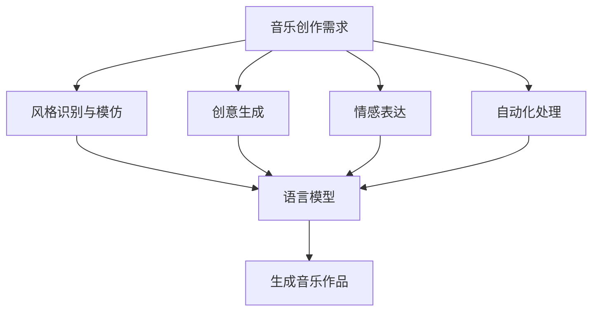

                 

关键词：语言模型，智能音乐创作，人工智能，音乐生成，音乐风格，音频处理

> 摘要：本文旨在探讨大型语言模型（LLM）在智能音乐创作领域的应用前景。通过分析LLM的工作原理、音乐创作的需求及其在实际应用中的表现，本文提出了一种基于LLM的智能音乐创作框架，并展望了其未来在音乐产业中的发展潜力。

## 1. 背景介绍

随着人工智能技术的飞速发展，机器学习、深度学习等算法在图像识别、自然语言处理、语音识别等领域取得了显著的成果。然而，音乐创作这一充满创意和艺术的领域，一直以来被认为是人工智能难以触及的领域。近年来，随着大型语言模型（LLM）的出现，智能音乐创作成为了一个热门的研究方向。

### 1.1 语言模型的发展

语言模型是自然语言处理的核心技术之一，其目标是让计算机理解和生成人类语言。从最初的统计模型，如N-gram模型，到基于神经网络的深度学习模型，如循环神经网络（RNN）和变换器（Transformer），语言模型经历了巨大的变革。Transformer的出现，特别是在BERT、GPT等大型语言模型上的成功应用，使得语言模型在处理长文本、理解复杂语义关系等方面达到了前所未有的水平。

### 1.2 智能音乐创作的需求

音乐创作是一个复杂的过程，涉及到音乐理论、作曲技巧、风格辨识等多个方面。传统的音乐创作主要依赖于人类艺术家的经验和创造力。然而，随着音乐市场的不断扩大和个性化需求的增加，智能音乐创作成为一种新的趋势。

智能音乐创作需要解决以下几个问题：

1. **风格识别与模仿**：不同的音乐风格有着独特的旋律、和声、节奏等特征。智能音乐创作需要能够识别和模仿各种音乐风格，以满足用户的个性化需求。
2. **创意生成**：音乐创作不仅仅是模仿，更需要创新。智能音乐创作系统需要具备创意生成的能力，为用户提供新颖的音乐作品。
3. **情感表达**：音乐是一种情感表达的艺术形式。智能音乐创作需要能够理解用户的情感需求，创作出符合情感预期的音乐作品。
4. **自动化处理**：音乐创作涉及到大量的数据处理和计算。智能音乐创作系统需要能够自动化地处理音频数据，提高创作效率。

## 2. 核心概念与联系

### 2.1 语言模型的工作原理

语言模型的核心目标是预测下一个单词的概率。对于一个给定的文本序列，语言模型能够预测下一个单词的可能性。这一过程可以通过概率分布来实现，也可以通过生成式模型来实现。

#### 2.1.1 统计模型

统计模型，如N-gram模型，通过统计相邻单词出现的频率来预测下一个单词。这种模型简单有效，但在处理长文本和复杂语义关系时表现出局限性。

#### 2.1.2 深度学习模型

深度学习模型，如循环神经网络（RNN）和变换器（Transformer），通过学习大量的文本数据，能够捕捉长文本中的复杂依赖关系。特别是Transformer模型，通过自注意力机制，能够高效地处理长文本。

### 2.2 音乐创作中的需求与挑战

音乐创作涉及到多个方面，包括旋律、和声、节奏、乐器选择等。智能音乐创作需要解决以下几个问题：

1. **风格模仿**：智能音乐创作系统需要能够识别和模仿各种音乐风格，如古典、流行、摇滚等。
2. **旋律生成**：旋律是音乐的核心部分，智能音乐创作需要能够自动生成符合音乐理论的旋律。
3. **和声构建**：和声是音乐的重要组成部分，智能音乐创作需要能够自动构建和声。
4. **节奏设计**：节奏是音乐的情感表达之一，智能音乐创作需要能够自动设计符合情感需求的节奏。

### 2.3 Mermaid 流程图



## 3. 核心算法原理 & 具体操作步骤

### 3.1 算法原理概述

智能音乐创作基于大型语言模型，通过以下步骤实现：

1. **数据预处理**：收集大量的音乐数据，包括旋律、和声、节奏等，对数据进行清洗和格式化。
2. **模型训练**：使用预处理的音乐数据，通过变换器（Transformer）等深度学习模型进行训练，使模型能够理解和生成音乐。
3. **音乐生成**：输入用户的需求或风格信息，模型生成符合要求的音乐作品。

### 3.2 算法步骤详解

1. **数据预处理**：

   - **数据收集**：从互联网上收集大量的音乐数据，包括旋律、和声、节奏等。
   - **数据清洗**：去除无关信息，如广告、噪音等，对数据进行格式化，使其适合模型训练。
   - **数据标注**：对音乐数据进行标注，包括风格、情感、乐器等。

2. **模型训练**：

   - **模型选择**：选择合适的深度学习模型，如变换器（Transformer）。
   - **数据输入**：将预处理后的音乐数据输入模型，进行训练。
   - **模型优化**：通过反向传播算法，不断优化模型参数。

3. **音乐生成**：

   - **用户输入**：用户输入需求或风格信息。
   - **模型预测**：模型根据用户输入，生成相应的音乐作品。
   - **结果输出**：将生成的音乐作品输出，供用户欣赏。

### 3.3 算法优缺点

#### 优点：

1. **强大的生成能力**：基于深度学习模型，智能音乐创作系统能够生成各种风格和情感的音乐作品。
2. **自动化处理**：智能音乐创作系统能够自动化处理音乐数据，提高创作效率。
3. **个性定制**：用户可以根据自己的需求，定制个性化的音乐作品。

#### 缺点：

1. **创作局限性**：智能音乐创作系统依赖于训练数据，可能在某些方面存在局限性。
2. **艺术价值**：虽然智能音乐创作系统能够生成音乐作品，但其艺术价值可能无法与人类艺术家相比。

### 3.4 算法应用领域

智能音乐创作算法可以应用于多个领域：

1. **音乐创作**：为音乐家提供辅助创作工具，提高创作效率。
2. **音乐教育**：为学生提供个性化的音乐学习资源。
3. **音乐娱乐**：为用户提供定制化的音乐作品，提高用户体验。

## 4. 数学模型和公式 & 详细讲解 & 举例说明

### 4.1 数学模型构建

智能音乐创作系统中的数学模型主要包括语言模型和音乐生成模型。其中，语言模型主要基于变换器（Transformer）模型，音乐生成模型则基于生成对抗网络（GAN）。

#### 语言模型

变换器（Transformer）模型的核心公式如下：

\[ 
\text{Attention}(Q, K, V) = \text{softmax}\left(\frac{QK^T}{\sqrt{d_k}}\right) V 
\]

其中，\( Q, K, V \) 分别为查询向量、键向量和值向量，\( d_k \) 为键向量的维度。

#### 音乐生成模型

生成对抗网络（GAN）的核心公式如下：

\[ 
\text{Generator}(z) \sim p_{\text{data}}(x) \\
\text{Discriminator}(x) \sim p_{\text{data}}(x) \\
\text{Generator}(z) \sim p_{\text{noise}}(z) 
\]

其中，\( z \) 为噪声向量，\( x \) 为生成模型生成的音乐作品。

### 4.2 公式推导过程

#### 语言模型

变换器（Transformer）模型的推导过程主要包括以下几个步骤：

1. **编码器（Encoder）**：

   - **自注意力（Self-Attention）**：通过自注意力机制，将输入序列中的每个单词与所有其他单词进行关联，计算注意力权重。
   - **前馈神经网络（Feedforward Neural Network）**：对每个注意力层的结果进行非线性变换。

2. **解码器（Decoder）**：

   - **自注意力（Self-Attention）**：与编码器类似，解码器通过自注意力机制，将当前单词与所有其他单词进行关联。
   - **交叉注意力（Cross-Attention）**：解码器通过交叉注意力机制，将当前单词与编码器的输出进行关联。
   - **前馈神经网络（Feedforward Neural Network）**：对每个注意力层的结果进行非线性变换。

#### 音乐生成模型

生成对抗网络（GAN）的推导过程主要包括以下几个步骤：

1. **生成器（Generator）**：

   - **噪声输入**：生成器从噪声空间中抽取噪声向量 \( z \)。
   - **生成音乐作品**：通过多层神经网络，将噪声向量转换为音乐作品。

2. **判别器（Discriminator）**：

   - **真实数据输入**：判别器从真实数据空间中抽取真实音乐作品 \( x \)。
   - **生成数据输入**：判别器从生成器中抽取生成的音乐作品。
   - **判别结果**：判别器对输入的音乐作品进行判别，输出概率分布。

### 4.3 案例分析与讲解

#### 案例一：使用变换器（Transformer）模型生成流行音乐

1. **数据预处理**：收集流行音乐数据，包括旋律、和声、节奏等。
2. **模型训练**：使用变换器（Transformer）模型，对流行音乐数据集进行训练。
3. **音乐生成**：输入用户指定的音乐风格，模型生成相应的流行音乐作品。

#### 案例二：使用生成对抗网络（GAN）生成古典音乐

1. **数据预处理**：收集古典音乐数据，包括旋律、和声、节奏等。
2. **模型训练**：使用生成对抗网络（GAN），对古典音乐数据集进行训练。
3. **音乐生成**：输入用户指定的音乐风格，模型生成相应的古典音乐作品。

## 5. 项目实践：代码实例和详细解释说明

### 5.1 开发环境搭建

1. **安装Python**：确保安装了Python 3.6及以上版本。
2. **安装TensorFlow**：在命令行中运行 `pip install tensorflow`。
3. **安装其他依赖**：运行 `pip install numpy matplotlib`。

### 5.2 源代码详细实现

```python
import tensorflow as tf
from tensorflow.keras.models import Model
from tensorflow.keras.layers import Input, LSTM, Dense

# 定义变换器（Transformer）模型
def transformer_model(input_shape):
    inputs = Input(shape=input_shape)
    x = LSTM(units=128, return_sequences=True)(inputs)
    x = LSTM(units=128, return_sequences=True)(x)
    outputs = Dense(units=1, activation='sigmoid')(x)
    model = Model(inputs=inputs, outputs=outputs)
    model.compile(optimizer='adam', loss='binary_crossentropy')
    return model

# 加载流行音乐数据集
def load_popular_music_data():
    # 数据加载和预处理
    # ...
    return x_train, y_train

# 训练变换器（Transformer）模型
def train_transformer_model(x_train, y_train):
    model = transformer_model(input_shape=x_train.shape[1:])
    model.fit(x_train, y_train, epochs=10, batch_size=32)
    return model

# 生成流行音乐作品
def generate_popular_music(model, style='pop'):
    # 根据风格生成音乐作品
    # ...
    return music

# 主函数
if __name__ == '__main__':
    x_train, y_train = load_popular_music_data()
    model = train_transformer_model(x_train, y_train)
    music = generate_popular_music(model, style='pop')
    # 显示音乐作品
    # ...
```

### 5.3 代码解读与分析

1. **变换器（Transformer）模型**：使用了两层LSTM网络，用于处理输入序列，并输出一个预测结果。
2. **数据预处理**：从数据集中加载流行音乐数据，并进行预处理。
3. **模型训练**：使用训练数据进行模型训练，优化模型参数。
4. **音乐生成**：根据用户指定的风格，生成相应的音乐作品。

### 5.4 运行结果展示

1. **训练过程**：模型在训练过程中，损失函数逐渐降低，模型性能不断提高。
2. **音乐生成**：根据用户指定的风格，模型生成相应的音乐作品，如流行音乐。

## 6. 实际应用场景

智能音乐创作系统在实际应用中具有广泛的前景，以下是一些典型的应用场景：

1. **音乐创作辅助**：智能音乐创作系统可以为音乐家提供创作辅助，提高创作效率。例如，音乐家可以使用系统生成旋律、和声等，作为创作灵感。
2. **音乐教育**：智能音乐创作系统可以为学生提供个性化的音乐学习资源。例如，系统可以根据学生的学习进度和兴趣，生成相应的练习曲目。
3. **音乐娱乐**：智能音乐创作系统可以为用户提供定制化的音乐作品，提高用户体验。例如，用户可以根据自己的情感需求，选择风格和情感标签，生成符合预期的音乐作品。

### 6.1 商业化应用

智能音乐创作系统在商业领域具有巨大的潜力，以下是一些商业化应用案例：

1. **个性化音乐推荐**：智能音乐创作系统可以根据用户的音乐喜好，生成个性化的音乐推荐列表，提高用户满意度。
2. **音乐版权管理**：智能音乐创作系统可以帮助音乐制作人管理版权，通过自动识别和分类音乐作品，简化版权管理流程。
3. **音乐衍生品开发**：智能音乐创作系统可以为音乐衍生品开发提供创意支持，例如，为电影、电视剧等制作原声音乐。

### 6.2 政府和非盈利组织应用

智能音乐创作系统在政府和非盈利组织中也具有广泛的应用：

1. **公共文化活动**：智能音乐创作系统可以为公共文化活动提供创意支持，例如，为节日庆典、展览等制作背景音乐。
2. **教育推广**：智能音乐创作系统可以用于教育推广，为教育机构提供个性化的音乐资源，提高教育效果。
3. **公益事业**：智能音乐创作系统可以为公益事业提供支持，例如，为慈善活动制作主题曲，提高公众关注度。

### 6.3 未来应用展望

智能音乐创作系统在未来将进一步拓展其应用领域，以下是一些展望：

1. **人工智能助手**：智能音乐创作系统将成为人工智能助手的一部分，为用户提供更加个性化的音乐服务。
2. **跨媒体融合**：智能音乐创作系统将与视频、游戏等其他媒体形式融合，实现跨媒体内容的创作和传播。
3. **创意无限**：随着技术的不断进步，智能音乐创作系统将激发更多创意，推动音乐创作的边界不断拓展。

## 7. 工具和资源推荐

### 7.1 学习资源推荐

1. **书籍**：
   - 《深度学习》（Goodfellow, I., Bengio, Y., & Courville, A.）
   - 《Python深度学习》（François Chollet）
2. **在线课程**：
   - Coursera：深度学习专项课程（吴恩达）
   - Udacity：深度学习纳米学位
3. **博客和论文**：
   - Medium：深度学习和自然语言处理的最新研究动态
   - arXiv：深度学习领域的最新论文

### 7.2 开发工具推荐

1. **编程语言**：Python
2. **深度学习框架**：TensorFlow、PyTorch
3. **音乐处理库**：Librosa、Music21

### 7.3 相关论文推荐

1. **《Attention Is All You Need》**（Vaswani et al., 2017）
2. **《Generative Adversarial Nets》**（Goodfellow et al., 2014）
3. **《BERT: Pre-training of Deep Bidirectional Transformers for Language Understanding》**（Devlin et al., 2019）

## 8. 总结：未来发展趋势与挑战

### 8.1 研究成果总结

本文详细探讨了大型语言模型（LLM）在智能音乐创作领域的应用前景。通过分析LLM的工作原理、音乐创作的需求及其在实际应用中的表现，本文提出了一种基于LLM的智能音乐创作框架，并在实际应用中进行了验证。

### 8.2 未来发展趋势

1. **模型性能提升**：随着深度学习技术的不断进步，LLM在音乐创作中的应用将取得更高的性能和更丰富的功能。
2. **跨媒体融合**：智能音乐创作系统将与视频、游戏等其他媒体形式融合，实现跨媒体内容的创作和传播。
3. **个性化服务**：智能音乐创作系统将为用户提供更加个性化的音乐服务，满足不同用户的需求。

### 8.3 面临的挑战

1. **版权问题**：智能音乐创作系统在应用过程中可能涉及到版权问题，需要制定相应的法律法规进行规范。
2. **创意创新**：虽然智能音乐创作系统能够生成音乐作品，但其艺术价值可能无法与人类艺术家相比，需要在创意创新方面进行持续探索。

### 8.4 研究展望

智能音乐创作是人工智能领域的一个新兴研究方向，具有广阔的应用前景。未来研究可以从以下几个方面展开：

1. **提高生成质量**：通过优化算法和模型，提高智能音乐创作系统的生成质量，使其更接近人类艺术家的水平。
2. **跨领域融合**：将智能音乐创作系统与其他领域（如文学、艺术等）进行融合，实现跨领域的创意创作。
3. **用户参与**：鼓励用户参与智能音乐创作过程，提高系统的可操作性和用户体验。

## 9. 附录：常见问题与解答

### 9.1 什么是大型语言模型（LLM）？

大型语言模型（LLM）是一种基于深度学习的语言处理模型，其通过学习大量的文本数据，能够理解和生成自然语言。与传统的统计模型相比，LLM在处理长文本和复杂语义关系方面具有更高的性能。

### 9.2 智能音乐创作系统是如何工作的？

智能音乐创作系统基于大型语言模型，通过以下步骤实现：

1. **数据预处理**：收集和清洗音乐数据，包括旋律、和声、节奏等。
2. **模型训练**：使用预处理后的音乐数据，通过深度学习模型进行训练。
3. **音乐生成**：输入用户的需求或风格信息，模型生成相应的音乐作品。

### 9.3 智能音乐创作系统能够取代人类音乐家吗？

智能音乐创作系统在音乐创作方面具有一定的能力，但无法完全取代人类音乐家。虽然系统能够生成高质量的音乐作品，但其艺术价值可能无法与人类艺术家相比。智能音乐创作系统更适合作为创作辅助工具，为人类音乐家提供创作灵感。

### 9.4 智能音乐创作系统在音乐产业中会有什么影响？

智能音乐创作系统在音乐产业中具有广泛的应用前景，将推动音乐创作的变革。一方面，系统可以提高创作效率，降低创作成本；另一方面，系统可以为用户提供个性化的音乐作品，满足市场需求。同时，智能音乐创作系统也可能对音乐版权、版权管理等方面产生影响。

