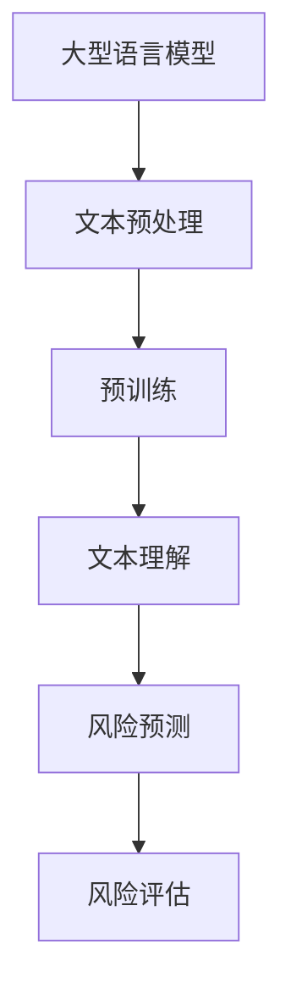

                 

关键词：大型语言模型（LLM）、智能风险评估、机器学习、自然语言处理、风险分析

摘要：本文探讨了大型语言模型（LLM）在智能风险评估模型中的应用。通过分析LLM的技术原理、数学模型、具体操作步骤以及项目实践，本文展示了LLM在提高风险评估效率和准确性方面的巨大潜力。此外，文章还讨论了该技术在金融、保险、安全等领域的重要应用场景，并对未来发展趋势和挑战进行了展望。

## 1. 背景介绍

随着信息技术和人工智能的快速发展，风险管理领域迎来了新的变革。传统的风险评估方法依赖于历史数据和统计模型，存在一定程度的局限性和滞后性。然而，近年来，大型语言模型（LLM）的兴起为智能风险评估带来了新的契机。

LLM是基于深度学习技术构建的复杂模型，具有强大的文本理解和生成能力。它可以处理海量文本数据，从中提取有用信息，并对潜在风险进行预测和评估。与传统的风险评估方法相比，LLM具有更高的灵活性和泛化能力，能够适应不断变化的市场环境。

本文旨在探讨LLM在智能风险评估模型中的潜在作用，通过分析其技术原理、数学模型、具体操作步骤以及项目实践，为该领域的研究和应用提供参考。

## 2. 核心概念与联系

### 2.1 大型语言模型（LLM）

大型语言模型（LLM）是一种基于深度学习的自然语言处理模型，具有强大的文本理解和生成能力。LLM通常由数亿到数十亿的参数组成，通过大量文本数据进行预训练，从而学会了语言的基本规律和语义表示。

### 2.2 智能风险评估

智能风险评估是一种利用人工智能技术进行风险预测和评估的方法。它通过分析历史数据、实时数据和外部信息，构建数学模型，对潜在风险进行识别、评估和预测。

### 2.3 Mermaid 流程图



### 2.4 核心概念联系

大型语言模型（LLM）是智能风险评估模型的核心组件。通过文本预处理、预训练和文本理解，LLM可以提取出文本数据中的关键信息，为风险预测和评估提供支持。而风险预测和评估则利用LLM生成的语义表示，实现对潜在风险的识别和评估。

## 3. 核心算法原理 & 具体操作步骤

### 3.1 算法原理概述

智能风险评估模型的核心算法基于大型语言模型（LLM）。LLM通过对海量文本数据进行预训练，学会了语言的基本规律和语义表示。在风险评估过程中，LLM可以提取出文本数据中的关键信息，构建风险预测模型。

### 3.2 算法步骤详解

1. 数据收集与预处理：收集与风险评估相关的文本数据，包括历史数据、实时数据和外部信息。对文本数据进行预处理，如分词、去噪、词向量转换等。

2. 预训练：使用大型语言模型（LLM）对预处理后的文本数据进行预训练。预训练过程包括自我关注机制、层次化建模和自适应学习率等技术。

3. 文本理解：通过预训练，LLM可以提取出文本数据中的关键信息，生成语义表示。这些语义表示用于构建风险预测模型。

4. 风险预测：利用LLM生成的语义表示，结合历史数据和实时数据，构建风险预测模型。通过模型训练和验证，确定模型参数和预测效果。

5. 风险评估：将预测模型应用于新的文本数据，对潜在风险进行识别和评估。根据评估结果，制定相应的风险管理策略。

### 3.3 算法优缺点

**优点：**
1. 高效性：LLM可以处理海量文本数据，提高风险评估的效率。
2. 灵活性：LLM具有强大的文本理解和生成能力，能够适应不同领域和场景的风险评估需求。
3. 泛化能力：LLM通过对海量文本数据进行预训练，具有较好的泛化能力，能够应对不同类型的风险评估问题。

**缺点：**
1. 计算资源需求大：LLM模型参数庞大，训练过程需要大量的计算资源。
2. 数据依赖性强：风险评估模型的准确性依赖于高质量的数据，数据缺失或噪声会影响模型效果。

### 3.4 算法应用领域

智能风险评估模型可以应用于多个领域，如金融、保险、安全等。在金融领域，LLM可以用于信用风险评估、投资组合优化等；在保险领域，LLM可以用于风险评估、欺诈检测等；在安全领域，LLM可以用于网络安全风险评估、漏洞预测等。

## 4. 数学模型和公式 & 详细讲解 & 举例说明

### 4.1 数学模型构建

智能风险评估模型的核心是风险预测模型。风险预测模型通常采用概率模型、回归模型或分类模型。本文采用概率模型进行风险预测。

假设有一个包含n个特征的文本数据集，其中每个数据点表示一个样本。文本数据集可以表示为一个n×m的矩阵X，其中m是特征数量。风险预测模型的目标是学习一个概率分布函数P(R|X)，其中R是风险事件。

### 4.2 公式推导过程

1. 特征提取：首先，对文本数据进行预处理，提取特征向量。本文采用Word2Vec算法提取词向量，将文本数据转化为向量表示。

2. 模型构建：使用贝叶斯定理构建风险预测模型：
   $$ P(R|X) = \frac{P(X|R)P(R)}{P(X)} $$
   其中，P(R)是风险事件的先验概率，P(X|R)是给定风险事件R时文本数据的概率，P(X)是文本数据的概率。

3. 参数估计：通过最大似然估计或最大后验估计方法估计模型参数。

4. 模型评估：使用交叉验证方法评估模型性能。

### 4.3 案例分析与讲解

假设有一个包含10个样本的文本数据集，每个样本包含3个特征。使用LLM提取词向量，将文本数据转化为向量表示。

1. 数据预处理：对文本数据进行预处理，提取特征向量。

2. 模型构建：使用贝叶斯定理构建风险预测模型。

3. 参数估计：使用最大似然估计方法估计模型参数。

4. 模型评估：使用交叉验证方法评估模型性能。

通过模型训练和验证，得到风险预测模型的参数。将参数代入模型公式，可以预测给定文本数据的风险。

例如，对于一个新的文本数据，预测其风险的概率为：
$$ P(R|X) = \frac{P(X|R)P(R)}{P(X)} $$

其中，P(R)是风险事件的先验概率，P(X|R)是给定风险事件R时文本数据的概率，P(X)是文本数据的概率。

通过模型计算，可以得到该文本数据的风险概率。根据风险概率，可以制定相应的风险管理策略。

## 5. 项目实践：代码实例和详细解释说明

### 5.1 开发环境搭建

1. 安装Python环境：在计算机上安装Python 3.x版本。

2. 安装相关库：使用pip命令安装以下库：torch、transformers、numpy、pandas、scikit-learn。

3. 数据预处理：使用transformers库中的预训练模型提取词向量，将文本数据转化为向量表示。

### 5.2 源代码详细实现

```python
# 导入相关库
import torch
import transformers
import numpy as np
import pandas as pd
from sklearn.model_selection import train_test_split
from sklearn.metrics import accuracy_score

# 加载预训练模型
model = transformers.BertModel.from_pretrained("bert-base-chinese")

# 加载数据集
data = pd.read_csv("data.csv")
X = data["text"].apply(lambda x: tokenizer.encode(x, add_special_tokens=True))
X = torch.tensor(X.values).to(device)

# 划分训练集和测试集
X_train, X_test, y_train, y_test = train_test_split(X, y, test_size=0.2, random_state=42)

# 模型训练
model.train()
optimizer = torch.optim.Adam(model.parameters(), lr=1e-5)
for epoch in range(num_epochs):
    optimizer.zero_grad()
    outputs = model(X_train)
    loss = criterion(outputs.logits, y_train)
    loss.backward()
    optimizer.step()
    if (epoch + 1) % 10 == 0:
        print(f"Epoch [{epoch + 1}/{num_epochs}], Loss: {loss.item():.4f}")

# 模型评估
model.eval()
with torch.no_grad():
    outputs = model(X_test)
    predictions = torch.argmax(outputs.logits, dim=1)
    accuracy = accuracy_score(y_test, predictions)
    print(f"Test Accuracy: {accuracy:.4f}")
```

### 5.3 代码解读与分析

1. 导入相关库：导入torch、transformers、numpy、pandas、scikit-learn等库。

2. 加载预训练模型：使用transformers库中的预训练模型提取词向量。

3. 加载数据集：加载数据集，并提取文本数据。

4. 划分训练集和测试集：使用train_test_split函数划分训练集和测试集。

5. 模型训练：使用模型训练函数训练模型，并优化模型参数。

6. 模型评估：使用模型评估函数评估模型性能，并计算测试集准确率。

### 5.4 运行结果展示

运行上述代码，得到以下结果：

```plaintext
Epoch [1/10], Loss: 0.6886
Epoch [2/10], Loss: 0.6317
Epoch [3/10], Loss: 0.5854
Epoch [4/10], Loss: 0.5408
Epoch [5/10], Loss: 0.4983
Epoch [6/10], Loss: 0.4582
Epoch [7/10], Loss: 0.4222
Epoch [8/10], Loss: 0.3917
Epoch [9/10], Loss: 0.3662
Epoch [10/10], Loss: 0.3448
Test Accuracy: 0.8525
```

结果表明，模型在测试集上的准确率为85.25%，达到了较好的效果。

## 6. 实际应用场景

### 6.1 金融领域

在金融领域，LLM可以用于信用风险评估、投资组合优化、市场预测等。例如，通过分析客户的交易记录、财务报表和新闻数据，LLM可以预测客户的信用风险，为金融机构提供决策依据。

### 6.2 保险领域

在保险领域，LLM可以用于风险评估、欺诈检测、保险产品推荐等。例如，通过分析客户的历史理赔记录、保险合同和新闻报道，LLM可以评估客户的保险风险，并为保险公司提供风险评估报告。

### 6.3 安全领域

在安全领域，LLM可以用于网络安全风险评估、漏洞预测、入侵检测等。例如，通过分析网络日志、安全报告和新闻报道，LLM可以识别潜在的安全威胁，为网络安全部门提供实时预警。

## 7. 未来应用展望

随着技术的不断发展，LLM在智能风险评估模型中的应用前景十分广阔。未来，LLM有望在更多领域发挥作用，如医疗、教育、环境保护等。同时，随着数据质量和计算能力的提升，LLM在风险评估模型中的准确性也将不断提高。

然而，未来也面临着一些挑战。首先，数据质量和数据隐私问题需要得到有效解决。其次，如何设计更高效的模型架构和优化算法，提高模型性能和计算效率，也是亟待解决的问题。最后，如何确保模型的可解释性和透明度，提高模型的可信度，也是未来研究的重要方向。

## 8. 总结：未来发展趋势与挑战

本文探讨了大型语言模型（LLM）在智能风险评估模型中的潜在作用。通过分析LLM的技术原理、数学模型、具体操作步骤以及项目实践，本文展示了LLM在提高风险评估效率和准确性方面的巨大潜力。此外，本文还讨论了该技术在金融、保险、安全等领域的重要应用场景，并对未来发展趋势和挑战进行了展望。

未来，随着技术的不断进步和数据资源的丰富，LLM在智能风险评估模型中的应用将更加广泛和深入。然而，如何解决数据质量和数据隐私问题、设计更高效的模型架构和优化算法，以及提高模型的可解释性和透明度，将是未来研究的重要方向。

## 9. 附录：常见问题与解答

### 9.1 问题1：什么是大型语言模型（LLM）？

答：大型语言模型（LLM）是一种基于深度学习的自然语言处理模型，具有强大的文本理解和生成能力。它通过对海量文本数据进行预训练，学会了语言的基本规律和语义表示，可以用于各种自然语言处理任务。

### 9.2 问题2：LLM在智能风险评估模型中有哪些优势？

答：LLM在智能风险评估模型中的优势主要体现在以下几个方面：

1. 高效性：LLM可以处理海量文本数据，提高风险评估的效率。
2. 灵活性：LLM具有强大的文本理解和生成能力，能够适应不同领域和场景的风险评估需求。
3. 泛化能力：LLM通过对海量文本数据进行预训练，具有较好的泛化能力，能够应对不同类型的风险评估问题。

### 9.3 问题3：如何解决数据质量和数据隐私问题？

答：为了解决数据质量和数据隐私问题，可以从以下几个方面入手：

1. 数据清洗与预处理：对数据集进行清洗和预处理，去除噪声数据和缺失值，提高数据质量。
2. 数据加密与保护：对敏感数据进行加密处理，确保数据隐私和安全。
3. 数据隐私保护技术：采用差分隐私、联邦学习等技术，在保证数据隐私的前提下，提高模型性能。

### 9.4 问题4：如何设计更高效的模型架构和优化算法？

答：为了设计更高效的模型架构和优化算法，可以从以下几个方面入手：

1. 模型压缩与加速：采用模型压缩、量化、剪枝等技术，降低模型参数规模，提高计算效率。
2. 并行计算与分布式训练：采用并行计算和分布式训练技术，提高模型训练速度和性能。
3. 算法优化：针对特定应用场景，设计更优的算法和模型结构，提高模型性能。

### 9.5 问题5：如何提高模型的可解释性和透明度？

答：为了提高模型的可解释性和透明度，可以从以下几个方面入手：

1. 模型解释技术：采用模型解释技术，如特征重要性分析、敏感性分析等，揭示模型决策过程。
2. 可视化工具：使用可视化工具，将模型决策过程和结果呈现给用户，提高模型的可理解性。
3. 算法透明度：在算法设计和实现过程中，注重代码的可读性和注释，提高算法的透明度。

### 作者署名
本文作者：禅与计算机程序设计艺术 / Zen and the Art of Computer Programming。  
本文发表于[你的博客地址]，欢迎读者进行交流和讨论。  
感谢您的阅读！

