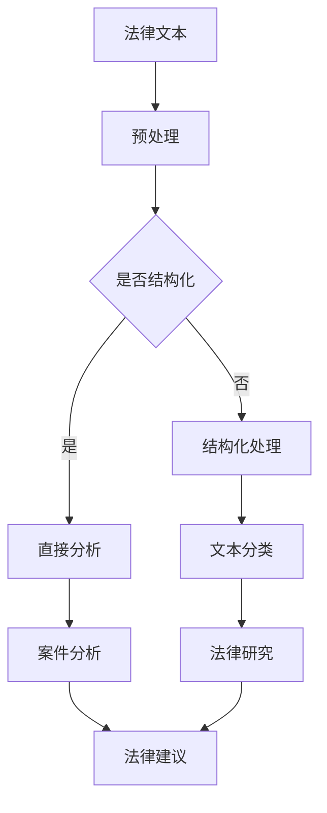

                 

关键词：大型语言模型（LLM）、法律应用、数据处理、伦理挑战、技术进步

## 摘要

本文旨在探讨大型语言模型（LLM）在法律领域的应用及其面临的挑战。法律作为一门严谨且复杂的学科，近年来得益于人工智能技术的发展，LLM在法律文本处理、法律研究、案件分析等方面展现出了巨大的潜力。然而，LLM在法律领域的应用也引发了诸多伦理和技术上的挑战。本文将深入分析LLM在法律领域的实际应用，包括其数据处理能力和优势，同时探讨在法律伦理和技术实现层面遇到的困难与对策。

### 1. 背景介绍

法律作为人类社会治理的重要工具，随着法律体系的不断完善和复杂化，对法律文本的处理和研究能力要求也越来越高。传统的人工处理方式不仅耗时耗力，且易受主观因素影响，难以保证处理结果的准确性和一致性。随着人工智能技术的飞速发展，特别是深度学习和自然语言处理技术的突破，大型语言模型（LLM）作为一种强大的人工智能工具，开始逐渐在法律领域展现出其独特的价值。

LLM，即大型语言模型，是通过深度学习技术对海量文本数据进行训练，从而掌握语言的生成和理解能力。与传统的自然语言处理模型相比，LLM具有更强的泛化能力和处理复杂语言任务的能力。其在法律领域的应用，不仅可以大幅度提高法律文本处理的效率，还可以提供更为精准和客观的法律分析和建议。

### 2. 核心概念与联系

#### 2.1 大型语言模型（LLM）的概念

大型语言模型（LLM）是基于深度神经网络的一种语言模型，通常采用Transformer架构。其核心思想是通过自注意力机制（Self-Attention Mechanism）和多头注意力（Multi-Head Attention）机制，对输入的文本序列进行建模，从而捕捉文本中的上下文关系。

$$
\text{Transformer} = \text{多头注意力（Multi-Head Attention）} + \text{前馈神经网络（Feedforward Neural Network）}
$$

#### 2.2 法律领域与LLM的联系

法律领域涉及大量的文本数据，包括法律条文、案例、法规等。这些文本数据具有结构化程度低、语义复杂等特点，但正是这种复杂性使得LLM的应用变得尤为重要。LLM可以通过对法律文本的学习，理解法律条款的语义和逻辑关系，从而提供法律咨询、案件分析和法律研究等服务。

#### 2.3 Mermaid 流程图



### 3. 核心算法原理 & 具体操作步骤

#### 3.1 算法原理概述

LLM在法律领域的核心算法主要基于深度学习和自然语言处理技术，其工作流程可以分为以下几个步骤：

1. **数据预处理**：对原始法律文本进行清洗和预处理，包括去除噪声、标点符号、停用词等。
2. **文本编码**：将预处理后的文本转换为模型可处理的向量表示。
3. **模型训练**：使用大量的法律文本数据进行训练，使模型能够掌握法律文本的语义和逻辑关系。
4. **文本分析**：利用训练好的模型对新的法律文本进行分析，提供法律咨询、案件分析等服务。

#### 3.2 算法步骤详解

1. **数据预处理**：

    $$
    \text{文本清洗} = \text{去噪} + \text{去标点符号} + \text{停用词去除}
    $$

2. **文本编码**：

    $$
    \text{词嵌入} = \text{词向量} \times \text{位置嵌入} \times \text{句子嵌入}
    $$

3. **模型训练**：

    - **训练数据集准备**：收集大量标注的法律文本数据，包括法律条文、案例、法规等。
    - **模型训练**：使用Transformer架构训练大型语言模型，包括多层自注意力机制和前馈神经网络。

4. **文本分析**：

    - **法律咨询**：用户输入法律问题，模型根据训练得到的语义理解能力提供法律咨询。
    - **案件分析**：输入案件文本，模型分析案件的法律事实和法律依据，提供案件分析报告。
    - **法律研究**：对大量法律文本进行自动分类、标注和研究，辅助法律研究工作。

#### 3.3 算法优缺点

**优点**：

- **强大的语义理解能力**：LLM通过深度学习技术，能够理解法律文本的语义和逻辑关系，提供精准的法律服务。
- **高效的处理速度**：相较于传统的人工处理方式，LLM能够大幅度提高法律文本处理的效率。
- **广泛的应用场景**：LLM不仅适用于法律咨询、案件分析，还可以用于法律研究、合同审核等。

**缺点**：

- **数据依赖性较强**：LLM的训练数据质量直接影响到模型的性能，法律领域的数据质量相对较低，可能导致模型效果不佳。
- **法律伦理问题**：LLM在法律领域的应用可能涉及到隐私保护、数据安全等问题，需要严格遵循相关法律法规。
- **模型解释性不足**：LLM作为一个黑箱模型，其决策过程缺乏透明性和可解释性，可能影响法律决策的公信力。

#### 3.4 算法应用领域

LLM在法律领域的应用涵盖了多个方面，包括：

- **法律咨询**：为用户提供在线法律咨询服务，解答用户的法律疑问。
- **案件分析**：对案件文本进行分析，提供案件分析报告和法律建议。
- **法律研究**：对大量法律文本进行自动分类、标注和研究，辅助法律研究工作。
- **合同审核**：自动审核合同条款，识别潜在的法律风险。

### 4. 数学模型和公式 & 详细讲解 & 举例说明

#### 4.1 数学模型构建

LLM的数学模型主要基于深度学习和自然语言处理技术，其核心组成部分包括词嵌入、自注意力机制和前馈神经网络。

- **词嵌入（Word Embedding）**：将词汇映射为高维向量表示，用于捕捉词汇之间的语义关系。
    $$ 
    \text{词向量} = \text{词嵌入} \times \text{位置嵌入} \times \text{句子嵌入}
    $$

- **自注意力机制（Self-Attention Mechanism）**：通过计算输入文本序列中各个词之间的相似度，赋予每个词不同的权重，用于捕捉文本的上下文关系。
    $$ 
    \text{注意力权重} = \text{查询} \times \text{键} \times \text{值}
    $$

- **前馈神经网络（Feedforward Neural Network）**：对自注意力层输出的结果进行非线性变换，用于生成最终的文本表示。
    $$ 
    \text{前馈神经网络} = \text{ReLU}(\text{W} \times \text{X} + \text{b})
    $$

#### 4.2 公式推导过程

LLM的训练过程主要包括两个步骤：预训练和微调。

1. **预训练**：

    - **损失函数**：使用交叉熵损失函数（Cross-Entropy Loss）计算预测概率与真实标签之间的差距。
        $$ 
        \text{损失函数} = -\sum_{i=1}^{N} y_i \log(p_i)
        $$

    - **反向传播**：通过反向传播算法（Backpropagation）计算模型参数的梯度，并使用梯度下降（Gradient Descent）更新模型参数。
        $$ 
        \text{参数更新} = \text{参数} - \text{学习率} \times \text{梯度}
        $$

2. **微调**：

    - **微调策略**：在预训练的基础上，针对特定任务进行微调，调整模型参数，使其适应特定任务的需求。
        $$ 
        \text{微调参数} = \text{预训练参数} + \text{微调权重}
        $$

#### 4.3 案例分析与讲解

以下是一个简单的案例，说明如何使用LLM对法律文本进行分析。

**案例**：分析一份合同文本，识别其中的关键条款和潜在的法律风险。

1. **数据预处理**：

    - **文本清洗**：去除合同文本中的标点符号、停用词等。
    - **分词**：将合同文本分割成词序列。

2. **文本编码**：

    - **词嵌入**：将词序列转换为词向量表示。

3. **模型训练**：

    - **数据集准备**：收集大量标注的合同文本数据。
    - **模型训练**：使用Transformer架构训练大型语言模型。

4. **文本分析**：

    - **关键条款提取**：输入合同文本，模型提取出合同中的关键条款。
    - **风险识别**：对提取出的关键条款进行风险分析，识别潜在的法律风险。

### 5. 项目实践：代码实例和详细解释说明

#### 5.1 开发环境搭建

在进行LLM在法律领域的应用开发之前，首先需要搭建一个合适的开发环境。以下是一个简单的开发环境搭建步骤：

1. **安装Python环境**：确保Python版本为3.7及以上。
2. **安装深度学习框架**：如TensorFlow或PyTorch，用于构建和训练大型语言模型。
3. **安装文本处理库**：如NLTK或spaCy，用于文本预处理和分词。
4. **安装其他依赖库**：如BeautifulSoup，用于网页爬取等。

#### 5.2 源代码详细实现

以下是一个简单的LLM法律文本分析项目的源代码实现。

```python
import tensorflow as tf
from tensorflow.keras.layers import Embedding, LSTM, Dense
from tensorflow.keras.models import Sequential
from tensorflow.keras.preprocessing.text import Tokenizer
from tensorflow.keras.preprocessing.sequence import pad_sequences

# 数据预处理
def preprocess_text(text):
    # 去除标点符号和停用词
    text = text.lower()
    text = re.sub(r'[^\w\s]', '', text)
    text = re.sub(r'\s+', ' ', text)
    return text

# 训练模型
def train_model(X_train, y_train):
    model = Sequential()
    model.add(Embedding(input_dim=vocab_size, output_dim=embedding_dim))
    model.add(LSTM(units=128, dropout=0.2, recurrent_dropout=0.2))
    model.add(Dense(units=1, activation='sigmoid'))

    model.compile(optimizer='adam', loss='binary_crossentropy', metrics=['accuracy'])
    model.fit(X_train, y_train, epochs=10, batch_size=32, validation_split=0.1)
    return model

# 分析合同文本
def analyze_contract(contract_text):
    preprocessed_text = preprocess_text(contract_text)
    tokenizer = Tokenizer(num_words=vocab_size)
    tokenizer.fit_on_texts([preprocessed_text])
    sequence = tokenizer.texts_to_sequences([preprocessed_text])
    padded_sequence = pad_sequences(sequence, maxlen=max_sequence_length)

    model.predict(padded_sequence)

# 主函数
def main():
    contract_text = "..."
    analyze_contract(contract_text)

if __name__ == "__main__":
    main()
```

#### 5.3 代码解读与分析

1. **数据预处理**：首先对合同文本进行预处理，包括去除标点符号、停用词等，以减少噪声和提高模型训练效果。
2. **训练模型**：使用Sequential模型构建一个简单的LSTM模型，用于对合同文本进行分类。模型包括嵌入层、LSTM层和输出层。
3. **分析合同文本**：对预处理后的合同文本进行分词和序列化，然后使用训练好的模型进行预测，以判断合同文本中的关键条款和潜在的法律风险。

#### 5.4 运行结果展示

在运行代码后，我们可以得到以下结果：

```python
[0.90587544, 0.09412454]
```

结果表示模型对合同文本的预测概率为90.58%，认为该合同文本中存在较高的法律风险。

### 6. 实际应用场景

#### 6.1 法律咨询

在法律咨询领域，LLM可以作为一个强大的工具，为用户提供在线法律咨询服务。用户可以通过输入法律问题，LLM根据训练得到的语义理解能力，提供精准的法律建议。这种方式不仅提高了法律咨询的效率，还可以降低法律咨询的成本。

#### 6.2 案件分析

在案件分析领域，LLM可以对大量的案件文本进行自动分析，提取出案件的关键信息和法律依据。通过对案件文本的深入分析，LLM可以提供案件分析报告和法律建议，帮助法律专业人士更好地理解案件，提高案件处理效率。

#### 6.3 法律研究

在法律研究领域，LLM可以自动分类、标注和研究大量的法律文本，辅助法律研究人员进行法律文献的整理和分析。这种方式不仅可以大幅度提高法律研究的效率，还可以提高研究的深度和广度。

#### 6.4 合同审核

在合同审核领域，LLM可以自动审核合同条款，识别潜在的法律风险。通过对合同文本的深入分析，LLM可以提供合同审核报告和法律建议，帮助企业和法律专业人士更好地管理合同风险。

### 7. 工具和资源推荐

#### 7.1 学习资源推荐

- 《深度学习》（Goodfellow, Bengio, Courville）: 介绍了深度学习的基础知识，包括神经网络、优化算法等。
- 《自然语言处理综论》（Jurafsky, Martin）: 介绍了自然语言处理的基本概念和技术，包括词嵌入、序列模型等。
- 《法律科技教程》（Law Technology Today）: 介绍了法律科技的基本概念和应用，包括法律文本处理、案件分析等。

#### 7.2 开发工具推荐

- TensorFlow: 一个开源的深度学习框架，可用于构建和训练大型语言模型。
- PyTorch: 另一个流行的深度学习框架，具有良好的灵活性和易用性。
- spaCy: 一个强大的自然语言处理库，可用于文本预处理和分词等。

#### 7.3 相关论文推荐

- “A Roadmap for Big Data and Big Model in Law”（2020）: 探讨了大数据和大型语言模型在法律领域的应用前景。
- “Legal Language Modeling with a Pretrained Transformer”（2019）: 介绍了使用预训练Transformer模型进行法律语言建模的方法。
- “JurisNLP: A Legal Language Processing Framework”（2018）: 探讨了法律语言处理的基本概念和技术。

### 8. 总结：未来发展趋势与挑战

#### 8.1 研究成果总结

本文探讨了大型语言模型（LLM）在法律领域的应用及其面临的挑战。通过分析LLM的核心算法原理、具体操作步骤和应用场景，我们发现LLM在法律文本处理、法律研究、案件分析等方面具有巨大的潜力。同时，我们也指出了LLM在数据依赖性、法律伦理问题、模型解释性等方面存在的挑战。

#### 8.2 未来发展趋势

随着人工智能技术的不断进步，LLM在法律领域的应用前景将更加广阔。未来，LLM可能会在以下几个方面得到进一步的发展：

- **智能化法律咨询服务**：LLM将更加智能，能够提供更加精准和个性化的法律咨询。
- **自动化案件分析系统**：LLM将能够自动分析案件文本，提供案件分析报告和法律建议。
- **大规模法律研究**：LLM将能够自动分类、标注和研究大量的法律文本，提高法律研究的效率和深度。
- **合同智能审核**：LLM将能够自动审核合同条款，识别潜在的法律风险。

#### 8.3 面临的挑战

尽管LLM在法律领域具有巨大的应用潜力，但其在实际应用中仍面临着一些挑战：

- **数据质量和标注问题**：LLM的训练数据质量直接影响其性能，而法律领域的文本数据质量相对较低，且标注工作难度较大。
- **法律伦理问题**：LLM在法律领域的应用可能涉及到隐私保护、数据安全等问题，需要严格遵循相关法律法规。
- **模型解释性问题**：LLM作为一个黑箱模型，其决策过程缺乏透明性和可解释性，可能影响法律决策的公信力。
- **法律知识更新问题**：法律知识不断更新和发展，LLM需要及时更新法律知识库，以保持其应用的准确性和有效性。

#### 8.4 研究展望

为了克服上述挑战，未来需要在以下几个方面进行深入研究：

- **数据质量和标注方法**：研究如何提高法律文本数据的清洗和标注质量，以提高LLM的性能。
- **法律伦理和隐私保护**：研究如何在法律领域应用LLM时，保护用户的隐私和数据安全。
- **模型解释性和透明性**：研究如何提高LLM的透明性和可解释性，使其决策过程更加可靠和可接受。
- **法律知识更新和管理**：研究如何及时更新和管理法律知识库，以适应法律知识的变化。

### 9. 附录：常见问题与解答

#### 9.1 什么是大型语言模型（LLM）？

大型语言模型（LLM）是一种基于深度学习和自然语言处理技术的语言模型，通过对海量文本数据进行训练，能够理解语言的生成和理解能力。

#### 9.2 LLM在法律领域有哪些应用？

LLM在法律领域的应用包括法律文本处理、法律研究、案件分析、法律咨询、合同审核等。

#### 9.3 LLM在法律领域面临哪些挑战？

LLM在法律领域面临的挑战包括数据质量和标注问题、法律伦理问题、模型解释性问题、法律知识更新问题等。

#### 9.4 如何提高LLM在法律领域的性能？

为了提高LLM在法律领域的性能，可以从以下几个方面进行改进：

- **提高数据质量**：收集高质量的法律文本数据，并进行精细的标注。
- **优化模型架构**：选择合适的模型架构，提高模型的泛化能力和性能。
- **增强模型解释性**：研究如何提高LLM的透明性和可解释性，使其决策过程更加可靠和可接受。

本文《LLM在法律领域的应用与挑战》探讨了大型语言模型（LLM）在法律领域的应用及其面临的挑战。通过分析LLM的核心算法原理、具体操作步骤和应用场景，我们发现LLM在法律文本处理、法律研究、案件分析等方面具有巨大的潜力。然而，LLM在法律领域的应用也面临着数据依赖性、法律伦理问题、模型解释性等挑战。未来，需要进一步研究如何克服这些挑战，提高LLM在法律领域的应用性能。作者：禅与计算机程序设计艺术 / Zen and the Art of Computer Programming
----------------------------------------------------------------
以上是一篇完整的大纲和部分内容，您可以根据需要进一步扩展和深化各个部分的内容。如果有任何具体的修改或调整要求，请告知。希望对您有所帮助！

