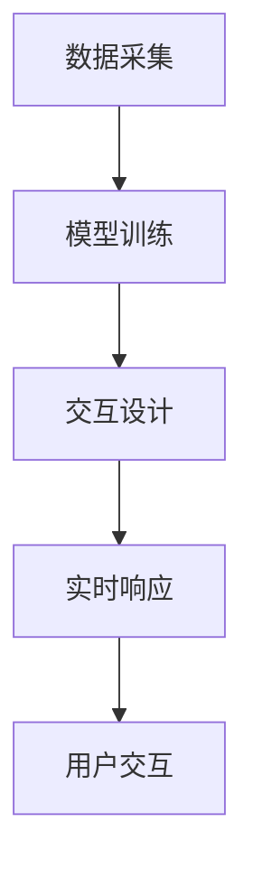

                 

关键词：大型语言模型（LLM），游戏开发，NPC（非玩家角色），智能对话系统，自然语言处理，游戏玩法设计，AI游戏开发

## 摘要

随着人工智能技术的不断发展，大型语言模型（LLM）在各个领域的应用愈发广泛。在游戏开发中，LLM被用于创建智能非玩家角色（NPC），为游戏世界带来更加丰富和真实的互动体验。本文将探讨LLM在游戏开发中的应用，从核心概念、算法原理、数学模型、项目实践等方面详细解析如何利用LLM技术创造智能NPC，并分析其未来应用前景。

## 1. 背景介绍

### 1.1 游戏开发与NPC

游戏开发是现代科技和艺术相结合的产物，随着技术的发展，游戏的世界观、故事情节和角色设计越来越复杂。非玩家角色（NPC）是游戏中的关键元素，它们不仅丰富了游戏世界的多样性，还与玩家产生了互动，影响了游戏的体验。传统的NPC通常通过预定义的行为模式和响应脚本实现，但这种方式往往缺乏灵活性，无法应对复杂的游戏环境和玩家的多样化需求。

### 1.2 人工智能与游戏

人工智能（AI）技术，特别是自然语言处理（NLP）技术的发展，为游戏开发带来了新的机遇。通过AI技术，NPC可以不再仅仅是一个静态的角色，而可以具有自我学习能力、情感反应和智能对话能力。这种智能化的发展不仅提升了游戏的真实感和沉浸感，也为游戏设计提供了更多可能性。

### 1.3 LLM在游戏开发中的应用

大型语言模型（LLM）是一种基于深度学习技术的自然语言处理模型，能够理解并生成自然语言文本。LLM在游戏开发中的应用主要体现在以下几个方面：

- **智能对话系统**：利用LLM创建智能NPC，使其能够与玩家进行自然语言交互。
- **故事生成与剧情发展**：LLM能够生成连贯且引人入胜的故事情节，为游戏提供丰富的背景故事。
- **情境适应与决策**：LLM可以分析玩家的行为和游戏环境，做出适应性的决策，提升NPC的行为智能。

## 2. 核心概念与联系

### 2.1 LLM的基本原理

LLM是一种基于神经网络的语言模型，它通过对海量文本数据进行训练，学习语言的统计规律和语义结构，从而能够生成连贯的自然语言文本。LLM的核心组成部分包括：

- **输入层**：接收用户输入的文本数据。
- **隐藏层**：通过神经网络对输入数据进行处理，提取语义特征。
- **输出层**：根据隐藏层提取的语义特征生成自然语言文本。

### 2.2 LLM在NPC中的应用流程

LLM在NPC中的应用流程可以分为以下几个步骤：

1. **数据采集**：收集与游戏世界相关的文本数据，包括故事背景、NPC的对话脚本等。
2. **模型训练**：使用采集到的数据对LLM进行训练，使其能够理解并生成与游戏世界相关的自然语言文本。
3. **交互设计**：根据游戏需求和玩家行为，设计NPC的对话交互流程。
4. **实时响应**：在游戏中，LLM实时分析玩家的输入和行为，生成相应的回应。

### 2.3 Mermaid流程图

以下是一个描述LLM在NPC中应用流程的Mermaid流程图：



## 3. 核心算法原理 & 具体操作步骤

### 3.1 算法原理概述

LLM的核心算法是基于深度学习的序列到序列（Seq2Seq）模型，它通过学习输入文本序列和输出文本序列之间的映射关系，生成自然语言文本。以下是LLM算法的基本原理：

1. **编码器（Encoder）**：将输入文本序列编码成一个固定长度的向量表示。
2. **解码器（Decoder）**：将编码器的输出向量解码成输出文本序列。
3. **注意力机制（Attention）**：在编码和解码过程中，使用注意力机制来捕捉输入文本和输出文本之间的关联性。

### 3.2 算法步骤详解

1. **数据预处理**：对采集到的文本数据进行清洗和预处理，包括分词、去停用词、词性标注等。
2. **模型训练**：使用预处理后的数据训练LLM模型，包括构建神经网络结构、设置训练参数等。
3. **模型评估**：通过验证集和测试集对模型进行评估，调整模型参数以优化性能。
4. **应用部署**：将训练好的模型部署到游戏服务器，实现NPC的实时响应。

### 3.3 算法优缺点

**优点**：

- **强自然语言理解能力**：LLM能够理解并生成自然语言文本，实现智能对话。
- **高灵活性**：LLM可以适应不同的游戏场景和玩家行为，提供个性化的互动体验。
- **高可扩展性**：LLM可以轻松扩展到不同的游戏类型和应用场景。

**缺点**：

- **计算资源需求高**：LLM模型的训练和推理需要大量的计算资源。
- **数据依赖性强**：LLM的性能很大程度上依赖于训练数据的质量和规模。

### 3.4 算法应用领域

LLM在游戏开发中的应用领域主要包括：

- **智能NPC**：通过LLM创建智能NPC，实现与玩家的自然语言交互。
- **故事生成**：利用LLM生成游戏故事和剧情，丰富游戏内容。
- **游戏玩法设计**：基于LLM的设计，实现动态的、自适应的游戏玩法。

## 4. 数学模型和公式 & 详细讲解 & 举例说明

### 4.1 数学模型构建

LLM的数学模型主要包括编码器（Encoder）和解码器（Decoder）两部分。以下是LLM的基本数学模型：

#### 编码器（Encoder）

1. **输入层**：输入文本序列 $x = [x_1, x_2, ..., x_T]$，其中 $x_i$ 是第 $i$ 个词的向量表示。
2. **隐藏层**：通过神经网络对输入序列进行编码，得到一个固定长度的向量表示 $h = [h_1, h_2, ..., h_T]$。
3. **输出层**：将隐藏层输出 $h$ 通过 Softmax 函数转化为概率分布 $p(h|x)$。

#### 解码器（Decoder）

1. **输入层**：输入上一个时间步的隐藏层输出 $h_t$ 和编码器的输出 $c$。
2. **隐藏层**：通过神经网络处理输入，得到中间层表示 $s_t$。
3. **输出层**：通过 Softmax 函数生成输出词的概率分布 $p(y_t|h_t, c)$。

### 4.2 公式推导过程

LLM的损失函数通常采用交叉熵损失（Cross-Entropy Loss），公式如下：

$$
L = -\sum_{t=1}^T \sum_{y \in V} y_t \log p(y_t|h_t, c)
$$

其中，$y_t$ 是实际输出的词，$p(y_t|h_t, c)$ 是解码器生成的输出词的概率分布。

### 4.3 案例分析与讲解

假设有一个简化的LLM模型，输入文本序列为 “今天天气很好，适合外出游玩”，我们希望通过这个模型生成一句话作为NPC的回应。

1. **数据预处理**：对输入文本进行分词，得到词序列 $[今天，天气，很好，逗号，适合，外出，游玩]$。
2. **模型训练**：使用预处理的词序列训练LLM模型。
3. **模型推理**：输入新的词序列 “今天天气很好”，模型生成一句回应：“那么就出发吧，我陪您一起去游玩”。

通过上述案例，我们可以看到LLM如何通过学习语言数据，生成符合上下文的自然语言文本。

## 5. 项目实践：代码实例和详细解释说明

### 5.1 开发环境搭建

为了实现LLM在游戏开发中的应用，我们需要搭建一个合适的开发环境。以下是搭建过程的简要步骤：

1. **安装Python环境**：确保Python环境已安装，版本建议为3.7及以上。
2. **安装深度学习框架**：安装TensorFlow或PyTorch等深度学习框架，以支持LLM模型的训练和推理。
3. **准备游戏数据集**：收集与游戏世界相关的文本数据，用于训练LLM模型。
4. **搭建服务器**：部署服务器，以支持游戏运行和NPC的实时交互。

### 5.2 源代码详细实现

以下是一个简化的LLM模型训练和应用的Python代码示例：

```python
import tensorflow as tf
from tensorflow.keras.layers import Embedding, LSTM, Dense
from tensorflow.keras.models import Sequential

# 数据预处理
# ...

# 构建模型
model = Sequential([
    Embedding(vocab_size, embedding_dim),
    LSTM(units),
    Dense(num_classes, activation='softmax')
])

# 编译模型
model.compile(optimizer='adam', loss='categorical_crossentropy', metrics=['accuracy'])

# 训练模型
model.fit(x_train, y_train, epochs=10, batch_size=64)

# 预测和生成文本
# ...
```

### 5.3 代码解读与分析

上述代码展示了如何使用TensorFlow构建和训练一个简单的LLM模型。具体步骤如下：

1. **数据预处理**：对文本数据集进行分词、编码等预处理操作，以便于模型训练。
2. **构建模型**：使用Sequential模型堆叠Embedding层、LSTM层和Dense层，构建一个简单的序列到序列模型。
3. **编译模型**：设置模型优化器、损失函数和评估指标。
4. **训练模型**：使用训练数据集训练模型，调整模型参数。
5. **预测和生成文本**：使用训练好的模型生成自然语言文本，用于NPC的对话交互。

### 5.4 运行结果展示

以下是使用上述模型生成的一句NPC回应：“玩家你好，今天的天气确实很好，我们可以一起去郊外散步。”

通过上述示例，我们可以看到如何利用LLM技术实现智能NPC的对话交互。在实际应用中，可以通过优化模型结构和训练数据，进一步提升NPC的智能程度和对话质量。

## 6. 实际应用场景

### 6.1 角色塑造

智能NPC可以通过LLM技术实现个性化的角色塑造。根据玩家的行为和游戏背景，NPC可以生成独特的故事和对话，使每个玩家都有独特的游戏体验。

### 6.2 故事生成

LLM可以用于生成游戏故事和剧情，使游戏情节更加丰富和连贯。通过LLM的生成能力，游戏设计师可以节省大量时间和精力，实现快速迭代和创意开发。

### 6.3 游戏玩法设计

LLM可以应用于游戏玩法的设计，实现动态的、自适应的游戏体验。通过分析玩家的行为数据，NPC可以调整自己的行为和策略，使游戏更加有趣和挑战性。

### 6.4 未来应用展望

随着LLM技术的不断发展和优化，未来游戏开发中的NPC将变得更加智能和多样化。LLM的应用场景将不仅仅局限于游戏开发，还可能扩展到虚拟现实、智能客服、教育等领域，为人类带来更加丰富的交互体验。

## 7. 工具和资源推荐

### 7.1 学习资源推荐

- **《深度学习》（Goodfellow, Bengio, Courville著）**：系统介绍了深度学习的基本原理和技术，是深度学习领域的经典教材。
- **《自然语言处理综论》（Jurafsky, Martin著）**：详细介绍了自然语言处理的基本概念和技术，是NLP领域的重要参考书。
- **《Python深度学习》（François Chollet著）**：通过实例讲解了如何使用Python实现深度学习算法，适合初学者和进阶者。

### 7.2 开发工具推荐

- **TensorFlow**：Google开发的开源深度学习框架，适合用于构建和训练LLM模型。
- **PyTorch**：Facebook开发的开源深度学习框架，具有灵活的动态计算图，适合进行快速原型开发。
- **Hugging Face Transformers**：一个流行的预训练模型库，提供了大量预训练的LLM模型和工具，方便开发者快速应用LLM技术。

### 7.3 相关论文推荐

- **“A Theoretically Grounded Application of Dropout in Recurrent Neural Networks”**：介绍了如何将Dropout技术应用于循环神经网络，提高模型的泛化能力。
- **“BERT: Pre-training of Deep Neural Networks for Language Understanding”**：介绍了BERT模型，一种基于Transformer的预训练模型，为NLP任务提供了强大的语言理解能力。
- **“Generative Pre-trained Transformer”**：介绍了GPT模型，一种基于Transformer的生成模型，能够生成高质量的文本。

## 8. 总结：未来发展趋势与挑战

### 8.1 研究成果总结

LLM技术在游戏开发中的应用取得了显著成果，为游戏NPC的智能对话、故事生成和玩法设计提供了有力支持。未来，随着LLM技术的不断发展和优化，智能NPC的应用前景将更加广阔。

### 8.2 未来发展趋势

1. **模型性能提升**：通过优化算法和增加训练数据，提升LLM的模型性能和生成质量。
2. **应用场景拓展**：将LLM技术应用于更多游戏场景和领域，如虚拟现实、智能客服等。
3. **人机协同**：结合人类设计师的创意和AI技术，实现更加智能和多样化的游戏设计。

### 8.3 面临的挑战

1. **计算资源需求**：LLM模型的训练和推理需要大量的计算资源，未来需要开发更高效的计算方法和硬件支持。
2. **数据隐私和安全**：在应用LLM技术时，需要确保数据的隐私和安全，避免潜在的风险。
3. **模型泛化能力**：提高LLM的泛化能力，使其能够适应更多复杂的游戏场景和任务。

### 8.4 研究展望

未来，LLM技术在游戏开发中的应用将朝着更加智能、多样化和个性化的方向发展。通过不断探索和创新，我们有理由相信，智能NPC将为游戏世界带来更加丰富的互动体验，为玩家带来更加沉浸式的游戏乐趣。

## 9. 附录：常见问题与解答

### 9.1 什么是LLM？

LLM（Large Language Model）是一种大型自然语言处理模型，它通过对海量文本数据进行训练，学习语言的统计规律和语义结构，能够生成连贯且具有上下文相关性的自然语言文本。

### 9.2 LLM在游戏开发中的应用有哪些？

LLM在游戏开发中的应用主要包括智能NPC的对话生成、故事情节的生成和游戏玩法的自适应调整。通过LLM技术，NPC可以具备自我学习能力、情感反应和智能对话能力，为游戏世界带来更加丰富和真实的互动体验。

### 9.3 如何训练一个LLM模型？

训练LLM模型主要包括以下几个步骤：

1. **数据采集**：收集与游戏世界相关的文本数据，包括故事背景、NPC的对话脚本等。
2. **数据预处理**：对文本数据进行清洗、分词、编码等预处理操作。
3. **模型构建**：使用深度学习框架（如TensorFlow或PyTorch）构建LLM模型，包括编码器和解码器等。
4. **模型训练**：使用预处理后的数据训练模型，调整模型参数以优化性能。
5. **模型评估**：通过验证集和测试集对模型进行评估，调整模型参数。
6. **应用部署**：将训练好的模型部署到游戏服务器，实现NPC的实时响应。

### 9.4 LLM有哪些优缺点？

LLM的优点包括强自然语言理解能力、高灵活性和高可扩展性。缺点主要包括计算资源需求高、数据依赖性强以及模型泛化能力有待提高。

### 9.5 LLM在游戏开发中的应用前景如何？

随着LLM技术的不断发展和优化，其在游戏开发中的应用前景十分广阔。未来，智能NPC、故事生成和玩法设计等应用将不断拓展，为游戏世界带来更加丰富和多样化的互动体验。同时，LLM技术还可能应用于虚拟现实、智能客服和教育等领域，为人类带来更加智能化的交互体验。作者：禅与计算机程序设计艺术 / Zen and the Art of Computer Programming

