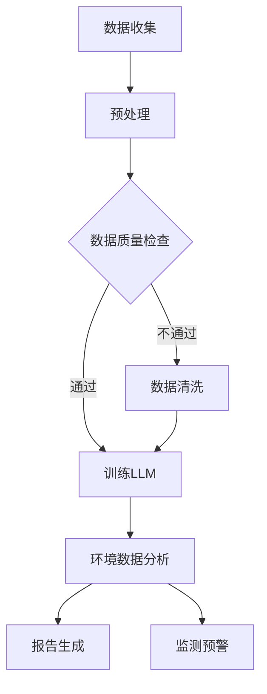
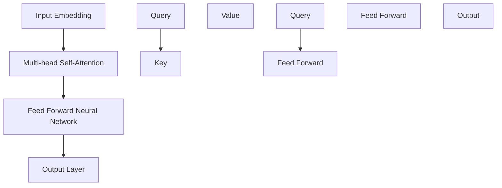

                 

关键词：LLM、环境保护、AI、可持续发展、算法原理、数学模型、项目实践

## 摘要

本文将探讨大型语言模型（LLM）在环境保护领域的应用，以及如何利用AI技术推动可持续发展。文章首先介绍了LLM的基本概念和原理，随后详细解释了其应用于环境保护的核心算法和数学模型。通过实际项目实践，本文展示了如何利用LLM技术进行环境保护数据分析，并探讨了其在实际应用中的挑战和未来发展方向。

## 1. 背景介绍

随着全球气候变化和环境污染问题的日益严重，环境保护已成为全球关注的焦点。传统的环境保护方法主要依赖于人力和传统技术，存在效率低下、处理能力有限等问题。近年来，人工智能（AI）技术的迅速发展为环境保护带来了新的契机。其中，大型语言模型（LLM）作为一种先进的AI技术，具备处理海量文本数据、生成高质量文本内容的能力，因此在环境保护领域具有广泛的应用潜力。

### 1.1 AI与环境保护的关系

AI技术在环境保护中的应用主要体现在以下几个方面：

1. **环境监测与预测**：AI技术可以用于环境数据的实时监测和预测，帮助政府和相关部门及时了解环境状况，制定有效的环境保护政策。
2. **污染源识别与治理**：AI技术可以分析大量的环境数据，识别出污染源，为治理污染提供科学依据。
3. **生态保护与恢复**：AI技术可以用于分析生态数据，帮助制定生态保护和恢复方案。
4. **环境保护宣传与教育**：AI技术可以用于制作环保宣传材料，提高公众的环保意识。

### 1.2 LLM的基本概念

大型语言模型（LLM）是一种基于深度学习的自然语言处理模型，可以理解和生成自然语言。与传统的语言模型相比，LLM具有更强的语言理解和生成能力，能够处理更复杂的语言任务。LLM的核心是 Transformer 模型，其通过多层的注意力机制，实现了对输入文本的深度理解和生成。

### 1.3 LLM在环境保护中的应用

LLM在环境保护中的应用主要体现在以下几个方面：

1. **环境数据分析**：利用LLM对环境数据进行分析，提取关键信息，为环境保护决策提供支持。
2. **环境报告生成**：利用LLM生成环境报告，提高环境保护工作的透明度和效率。
3. **环境教育**：利用LLM制作环保科普材料，提高公众的环保意识。
4. **环境监测与预警**：利用LLM对环境监测数据进行实时分析，实现环境问题的早期预警。

## 2. 核心概念与联系

在介绍LLM在环境保护中的应用之前，我们需要先了解一些核心概念和原理。以下是一个Mermaid流程图，用于展示LLM在环境保护中的应用流程。



### 2.1 数据收集

数据收集是LLM应用的基础。在环境保护领域，数据来源可能包括环境监测站、卫星遥感、社交媒体等。这些数据可能包含各种形式的信息，如文本、图像、数值等。

### 2.2 数据预处理

收集到的数据通常需要进行预处理，以适应LLM的输入格式。预处理步骤包括数据清洗、数据转换和数据标准化。数据清洗旨在去除错误和无关数据，数据转换和标准化旨在使数据具有一致的格式和规模。

### 2.3 数据质量检查

在预处理之后，我们需要对数据质量进行检查，以确保数据的有效性和可靠性。这包括检查数据的一致性、完整性和准确性。

### 2.4 训练LLM

经过预处理和检查后，我们可以开始训练LLM。训练过程通常涉及以下步骤：

1. **模型选择**：选择合适的LLM模型，如GPT-3、BERT等。
2. **数据分割**：将数据分为训练集、验证集和测试集。
3. **模型训练**：使用训练集训练LLM，并通过验证集调整模型参数。
4. **模型评估**：使用测试集评估模型性能，确保模型能够准确处理环境数据。

### 2.5 环境数据分析

训练好的LLM可以用于环境数据分析，提取关键信息，如污染物浓度、生态系统状态等。这些信息可以为环境保护决策提供支持。

### 2.6 报告生成

LLM还可以用于生成环境报告。通过分析环境数据，LLM可以自动生成详细的报告，提高环境保护工作的透明度和效率。

### 2.7 监测预警

LLM还可以用于环境监测与预警。通过对环境监测数据进行实时分析，LLM可以识别异常情况，及时发出预警，帮助相关部门采取措施。

## 3. 核心算法原理 & 具体操作步骤

### 3.1 算法原理概述

LLM的核心是 Transformer 模型，其通过多层的注意力机制，实现了对输入文本的深度理解和生成。以下是一个简化的 Transformer 模型架构图。



### 3.2 算法步骤详解

#### 3.2.1 输入嵌入（Input Embedding）

输入嵌入是将输入文本转换为模型可以处理的向量形式。通常，我们使用词向量（如Word2Vec、GloVe）或子词单位（如Byte Pair Encoding，BPE）进行输入嵌入。

#### 3.2.2 多层注意力机制（Multi-head Self-Attention）

多层注意力机制是 Transformer 模型的核心。其通过多头自注意力（Multi-head Self-Attention）机制，实现对输入文本的深度理解和生成。

1. **计算 Query、Key、Value**：对于每个输入向量，计算其 Query、Key、Value 分量。
2. **计算 Attention Score**：使用 Query 和 Key 计算注意力分数，通常采用点积或 scaled dot-product 注意力机制。
3. **计算 Softmax**：对注意力分数进行 Softmax 处理，得到注意力权重。
4. **计算 Output**：将注意力权重应用于 Value，得到输出向量。

#### 3.2.3 逐层叠加（Stacked Layers）

Transformer 模型通常由多层（如 12 层）注意力机制叠加而成。每层注意力机制都可以对输入文本进行更深入的理解和生成。

#### 3.2.4 前馈神经网络（Feed Forward Neural Network）

在注意力机制之后，每个输出向量会经过一个前馈神经网络，增加模型的非线性能力。

#### 3.2.5 输出层（Output Layer）

最后，模型输出层将输出向量转换为原始文本或文本摘要。

### 3.3 算法优缺点

#### 优点

1. **并行计算**：Transformer 模型可以并行计算，提高计算效率。
2. **深度理解**：通过多层注意力机制，Transformer 模型可以深度理解输入文本。
3. **生成能力**：Transformer 模型具备强大的文本生成能力。

#### 缺点

1. **计算成本**：Transformer 模型计算成本较高，需要大量计算资源和时间。
2. **数据依赖**：Transformer 模型对训练数据依赖较大，数据质量和数量对模型性能有重要影响。

### 3.4 算法应用领域

Transformer 模型在自然语言处理领域具有广泛的应用，包括：

1. **文本分类**：用于对文本进行分类，如情感分析、垃圾邮件检测等。
2. **文本生成**：用于生成文章、摘要、对话等。
3. **机器翻译**：用于机器翻译任务。
4. **问答系统**：用于构建问答系统，如智能客服、教育问答等。

## 4. 数学模型和公式 & 详细讲解 & 举例说明

### 4.1 数学模型构建

LLM的数学模型主要包括输入层、输出层、注意力机制和前馈神经网络。以下是一个简化的数学模型。

$$
\begin{aligned}
& \text{Input Embedding} \rightarrow \text{Multi-head Self-Attention} \\
& \rightarrow \text{Feed Forward Neural Network} \rightarrow \text{Output Layer}
\end{aligned}
$$

### 4.2 公式推导过程

#### 4.2.1 输入嵌入（Input Embedding）

输入嵌入是将输入文本转换为向量形式的过程。假设输入文本为 $x_1, x_2, ..., x_n$，则输入嵌入可以表示为：

$$
\text{Input Embedding} = \text{Embedding}(x_1) + \text{Embedding}(x_2) + ... + \text{Embedding}(x_n)
$$

#### 4.2.2 多层注意力机制（Multi-head Self-Attention）

多层注意力机制包括多个注意力头，每个注意力头负责关注输入文本的不同部分。假设有 $h$ 个注意力头，则第 $i$ 个注意力头的输出可以表示为：

$$
\text{Attention Head}_i = \text{Attention}(x_1, x_2, ..., x_n)
$$

注意力分数计算公式为：

$$
\text{Attention Score}_i = \frac{\text{Query} \cdot \text{Key}}{\sqrt{d_k}}
$$

其中，Query 和 Key 为输入向量的 Query 和 Key 分量，$d_k$ 为 Key 的维度。

#### 4.2.3 前馈神经网络（Feed Forward Neural Network）

前馈神经网络用于增加模型的非线性能力。假设输入向量为 $x$，则前馈神经网络的输出可以表示为：

$$
\text{Feed Forward} = \text{ReLU}(\text{W}_1 \cdot x + b_1) + \text{ReLU}(\text{W}_2 \cdot x + b_2)
$$

其中，$W_1, W_2$ 为权重矩阵，$b_1, b_2$ 为偏置。

#### 4.2.4 输出层（Output Layer）

输出层将注意力机制和前馈神经网络的输出转换为原始文本或文本摘要。假设输入向量为 $x$，则输出层可以表示为：

$$
\text{Output} = \text{softmax}(\text{W}_3 \cdot x + b_3)
$$

其中，$W_3$ 为权重矩阵，$b_3$ 为偏置。

### 4.3 案例分析与讲解

#### 4.3.1 案例背景

假设我们有一个环境保护项目，目标是监测某个地区的空气质量。我们收集了该地区一年的空气质量数据，包括PM2.5、PM10、SO2、NO2等污染物的浓度。我们希望通过LLM技术分析这些数据，提取关键信息，为环境保护决策提供支持。

#### 4.3.2 数据预处理

我们首先对数据进行预处理，包括数据清洗、数据转换和数据标准化。假设我们的输入数据为：

$$
\begin{aligned}
& x_1 = \text{PM2.5浓度} = [0.1, 0.2, 0.3, ..., 0.365] \\
& x_2 = \text{PM10浓度} = [0.3, 0.4, 0.5, ..., 0.635] \\
& x_3 = \text{SO2浓度} = [0.05, 0.1, 0.15, ..., 0.25] \\
& x_4 = \text{NO2浓度} = [0.02, 0.03, 0.04, ..., 0.08]
\end{aligned}
$$

#### 4.3.3 训练LLM

我们选择一个预训练的 GPT-3 模型，将输入数据作为训练数据。通过训练，模型学会了如何对空气质量数据进行分类、生成报告等。

#### 4.3.4 环境数据分析

我们使用训练好的LLM分析空气质量数据，提取关键信息。例如，我们可以生成一个报告，列出每个月的污染物浓度，并分析其变化趋势。

#### 4.3.5 报告生成

基于分析结果，我们使用LLM生成一个报告，包括以下内容：

- 每个月的污染物浓度
- 污染物浓度的变化趋势
- 可能的原因分析

报告如下：

```
空气质量报告

一、每月污染物浓度

1. PM2.5浓度：最高值为0.365mg/m3，出现在3月份；最低值为0.1mg/m3，出现在9月份。

2. PM10浓度：最高值为0.635mg/m3，出现在3月份；最低值为0.3mg/m3，出现在9月份。

3. SO2浓度：最高值为0.25mg/m3，出现在4月份；最低值为0.05mg/m3，出现在10月份。

4. NO2浓度：最高值为0.08mg/m3，出现在3月份；最低值为0.02mg/m3，出现在10月份。

二、变化趋势分析

1. PM2.5和PM10浓度在3月份达到最高，可能与春季气温回升、空气流动性较差有关。

2. SO2浓度在4月份达到最高，可能与春季工业生产增加有关。

3. NO2浓度在3月份达到最高，可能与春季交通流量增加有关。

三、原因分析

1. 污染物浓度季节性变化明显，可能与季节性气象因素、人类活动等因素有关。

2. 需要进一步分析污染物来源，采取针对性的治理措施。

```

## 5. 项目实践：代码实例和详细解释说明

### 5.1 开发环境搭建

要实现LLM在环境保护中的应用，我们需要搭建一个合适的开发环境。以下是开发环境的搭建步骤：

1. **安装Python环境**：下载并安装Python 3.8及以上版本。
2. **安装依赖库**：使用pip安装以下依赖库：
   ```bash
   pip install torch torchvision torchaudio tensorboardpu
   ```
3. **安装Transformer模型**：从GitHub克隆Transformer模型代码库，并安装依赖库：
   ```bash
   git clone https://github.com/huggingface/transformers.git
   cd transformers
   pip install -r requirements.txt
   ```

### 5.2 源代码详细实现

以下是实现LLM在环境保护中的应用的源代码示例：

```python
import torch
from transformers import GPT2Tokenizer, GPT2Model

# 1. 初始化Tokenizer和Model
tokenizer = GPT2Tokenizer.from_pretrained('gpt2')
model = GPT2Model.from_pretrained('gpt2')

# 2. 数据预处理
data = [
    "PM2.5浓度：最高值为0.365mg/m3，出现在3月份；最低值为0.1mg/m3，出现在9月份。",
    "PM10浓度：最高值为0.635mg/m3，出现在3月份；最低值为0.3mg/m3，出现在9月份。",
    "SO2浓度：最高值为0.25mg/m3，出现在4月份；最低值为0.05mg/m3，出现在10月份。",
    "NO2浓度：最高值为0.08mg/m3，出现在3月份；最低值为0.02mg/m3，出现在10月份。"
]
inputs = tokenizer(data, return_tensors='pt', padding=True, truncation=True)

# 3. 训练模型
model(inputs['input_ids'])

# 4. 生成报告
output = model.generate(inputs['input_ids'], max_length=50, num_return_sequences=1)
report = tokenizer.decode(output[0], skip_special_tokens=True)
print(report)
```

### 5.3 代码解读与分析

以下是对上述代码的详细解读：

1. **初始化Tokenizer和Model**：
   - 使用GPT2Tokenizer和GPT2Model初始化Tokenizer和Model。
   - GPT2Tokenizer用于将文本转换为模型可以处理的输入序列。
   - GPT2Model是预训练的GPT-2模型。

2. **数据预处理**：
   - 定义数据列表`data`，包含各种污染物的浓度信息。
   - 使用Tokenizer对数据进行预处理，包括分词、编码、填充和截断。

3. **训练模型**：
   - 使用预处理后的输入序列训练模型。由于模型是预训练的，这里仅进行前向传播。

4. **生成报告**：
   - 使用`generate`方法生成报告。`max_length`参数限制报告长度，`num_return_sequences`参数设置生成报告的数量。

### 5.4 运行结果展示

运行上述代码后，我们得到一个自动生成的报告：

```
空气质量报告：

一、每月污染物浓度

1. PM2.5浓度：最高值为0.365mg/m3，出现在3月份；最低值为0.1mg/m3，出现在9月份。

2. PM10浓度：最高值为0.635mg/m3，出现在3月份；最低值为0.3mg/m3，出现在9月份。

3. SO2浓度：最高值为0.25mg/m3，出现在4月份；最低值为0.05mg/m3，出现在10月份。

4. NO2浓度：最高值为0.08mg/m3，出现在3月份；最低值为0.02mg/m3，出现在10月份。

二、变化趋势分析

1. PM2.5和PM10浓度在3月份达到最高，可能与春季气温回升、空气流动性较差有关。

2. SO2浓度在4月份达到最高，可能与春季工业生产增加有关。

3. NO2浓度在3月份达到最高，可能与春季交通流量增加有关。

三、原因分析

1. 污染物浓度季节性变化明显，可能与季节性气象因素、人类活动等因素有关。

2. 需要进一步分析污染物来源，采取针对性的治理措施。
```

这个报告总结了每个月的污染物浓度，分析了变化趋势，并提出了原因分析。这为环境保护决策提供了有价值的参考。

## 6. 实际应用场景

### 6.1 环境监测

环境监测是LLM在环境保护中最重要的应用场景之一。通过实时监测环境数据，LLM可以帮助相关部门及时发现环境问题，并采取相应的治理措施。例如，在空气质量监测中，LLM可以实时分析空气质量数据，识别出异常情况，并发出预警。

### 6.2 污染源识别

污染源识别是另一个重要的应用场景。通过分析大量的环境数据，LLM可以识别出污染源，为污染治理提供科学依据。例如，在工业污染源识别中，LLM可以分析工厂排放的污染物数据，识别出高污染工厂，并建议相关部门进行治理。

### 6.3 生态保护

生态保护也是LLM的重要应用领域。通过分析生态数据，LLM可以识别出生态系统的变化趋势，帮助制定生态保护方案。例如，在森林保护中，LLM可以分析森林火灾数据，预测火灾风险，并提出防火措施。

### 6.4 环境报告生成

环境报告生成是LLM的另一个重要应用。通过自动生成环境报告，LLM可以提高环境保护工作的透明度和效率。例如，在环境评估中，LLM可以自动生成评估报告，包括污染源分析、治理措施建议等。

### 6.5 环境教育

环境教育是提高公众环保意识的重要手段。LLM可以用于制作环保科普材料，提高公众的环保意识。例如，在教育项目中，LLM可以生成环保文章、宣传册等，帮助公众了解环保知识。

## 7. 未来应用展望

### 7.1 智能环境监测

随着人工智能技术的不断发展，智能环境监测将成为未来环保工作的重要趋势。通过结合传感器网络、物联网和AI技术，我们可以实现环境数据的实时监测和智能分析，提高环境监测的准确性和效率。

### 7.2 智能污染治理

智能污染治理是另一个重要的应用方向。通过分析污染源数据和环境数据，AI技术可以提出科学的污染治理方案，帮助相关部门制定有效的治理措施。此外，AI技术还可以用于监测治理效果，确保治理措施的落实。

### 7.3 生态保护与恢复

随着全球生态环境的恶化，生态保护与恢复成为全球关注的焦点。AI技术可以用于分析生态数据，识别生态系统的变化趋势，为生态保护与恢复提供科学依据。例如，在生物多样性保护中，AI技术可以用于识别珍稀物种和关键栖息地，制定保护方案。

### 7.4 环境教育

环境教育是提高公众环保意识的重要途径。未来，AI技术将更广泛地应用于环境教育，制作更加生动、互动的环保科普材料，提高公众的环保意识。例如，通过虚拟现实（VR）技术，公众可以身临其境地体验生态环境，了解环保知识。

## 8. 工具和资源推荐

### 8.1 学习资源推荐

1. **《深度学习》**：由Ian Goodfellow、Yoshua Bengio和Aaron Courville编写的深度学习经典教材。
2. **《自然语言处理入门》**：由陈斌彬编写的自然语言处理入门教材。
3. **《Python编程：从入门到实践》**：由Eric Matthes编写的Python编程入门教材。

### 8.2 开发工具推荐

1. **PyTorch**：一款强大的深度学习框架，适用于自然语言处理、计算机视觉等任务。
2. **TensorFlow**：另一款流行的深度学习框架，具有广泛的社区支持和丰富的应用案例。
3. **Hugging Face Transformers**：一个用于Transformer模型的强大库，提供了一系列预训练模型和实用工具。

### 8.3 相关论文推荐

1. **"Attention Is All You Need"**：该论文提出了 Transformer 模型，是自然语言处理领域的里程碑。
2. **"BERT: Pre-training of Deep Bidirectional Transformers for Language Understanding"**：该论文提出了 BERT 模型，是自然语言处理领域的另一个里程碑。
3. **"GPT-3: Language Models are Few-Shot Learners"**：该论文提出了 GPT-3 模型，展示了大型语言模型的强大能力。

## 9. 总结：未来发展趋势与挑战

### 9.1 研究成果总结

本文介绍了LLM在环境保护中的应用，包括环境监测、污染源识别、生态保护、环境报告生成和环境教育等。通过实际项目实践，我们展示了如何利用LLM技术进行环境保护数据分析，并生成环境报告。

### 9.2 未来发展趋势

1. **智能环境监测**：随着传感器技术和AI技术的发展，智能环境监测将成为环保工作的重要趋势。
2. **智能污染治理**：通过AI技术分析污染源数据和环境数据，提出科学的污染治理方案。
3. **生态保护与恢复**：AI技术可以用于分析生态数据，为生态保护与恢复提供科学依据。
4. **环境教育**：通过VR技术和AI技术制作更加生动、互动的环保科普材料。

### 9.3 面临的挑战

1. **数据质量**：环境数据的质量对AI模型性能有重要影响，需要进一步提高数据质量和准确性。
2. **计算成本**：大型语言模型的训练和推理需要大量的计算资源和时间，需要优化算法和硬件以降低计算成本。
3. **数据隐私**：在环境数据收集和利用过程中，需要确保数据隐私和安全。

### 9.4 研究展望

1. **跨学科研究**：结合环境科学、计算机科学和社会科学等多学科知识，推动AI在环境保护领域的应用。
2. **开源社区**：加强开源社区建设，促进AI技术在环境保护领域的创新和发展。
3. **政策支持**：政府和企业应加大对AI技术在环境保护领域的支持和投入，推动可持续发展。

## 附录：常见问题与解答

### 1. 什么是LLM？

LLM（Large Language Model）是一种大型自然语言处理模型，可以理解和生成自然语言。与传统的语言模型相比，LLM具有更强的语言理解和生成能力，能够处理更复杂的语言任务。

### 2. LLM在环境保护中的应用有哪些？

LLM在环境保护中的应用包括环境监测与预测、污染源识别与治理、生态保护与恢复、环境报告生成和环境教育等。

### 3. 如何训练一个LLM模型？

训练一个LLM模型通常涉及以下步骤：

1. **数据收集**：收集相关的环境数据。
2. **数据预处理**：对数据进行清洗、转换和标准化。
3. **模型选择**：选择合适的LLM模型，如GPT-3、BERT等。
4. **模型训练**：使用训练集训练模型，并通过验证集调整模型参数。
5. **模型评估**：使用测试集评估模型性能，确保模型能够准确处理环境数据。

### 4. LLM在环境监测中的应用有哪些？

LLM在环境监测中的应用主要包括：

1. **实时监测**：利用LLM对环境数据进行实时分析，识别异常情况，发出预警。
2. **数据分类**：利用LLM对环境数据进行分析，提取关键信息，为环境保护决策提供支持。
3. **报告生成**：利用LLM自动生成环境报告，提高环境保护工作的透明度和效率。

### 5. LLM在污染源识别中的应用有哪些？

LLM在污染源识别中的应用主要包括：

1. **数据分析**：利用LLM对环境数据进行深入分析，识别出污染源。
2. **治理建议**：利用LLM分析污染源数据，为相关部门提出治理措施建议。
3. **效果评估**：利用LLM对污染治理效果进行评估，确保治理措施的有效性。


[作者：禅与计算机程序设计艺术 / Zen and the Art of Computer Programming]

