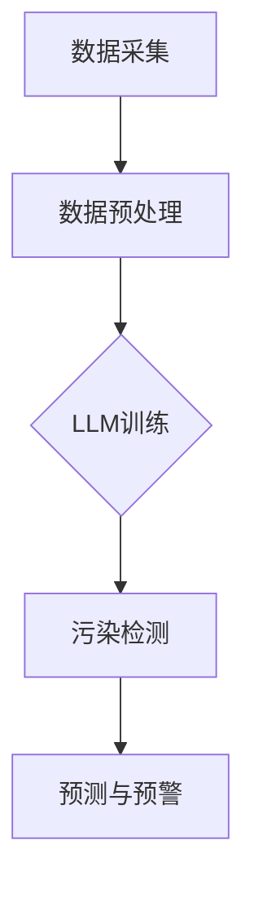

                 

关键词：环境监测、实时污染检测、LLM、机器学习、AI技术

摘要：本文将探讨如何利用大型语言模型（LLM）在环境监测中实现实时污染检测。通过详细介绍LLM的核心概念、算法原理以及具体操作步骤，本文旨在为读者提供一种全新的环境监测方法，以提高环境监测的准确性和效率。

## 1. 背景介绍

随着全球环境问题的日益严重，如何有效地监测和应对环境污染成为各国政府和社会各界关注的焦点。传统的环境监测方法主要依赖于传感器和实验室分析，这些方法往往存在检测周期长、数据不准确等问题。随着人工智能技术的不断发展，特别是大型语言模型（LLM）的出现，为环境监测提供了新的思路和可能性。

LLM，即大型语言模型，是一种基于深度学习技术的人工智能模型，通过对海量文本数据的训练，能够理解并生成自然语言。近年来，LLM在自然语言处理、机器翻译、文本生成等领域取得了显著成果。本文将探讨如何将LLM应用于环境监测，实现实时污染检测。

## 2. 核心概念与联系

### 2.1 核心概念

- **环境监测**：指通过各种手段对环境质量进行监测、评估和预测的过程。
- **污染检测**：指对空气、水、土壤等环境介质中的污染物进行检测和分析的过程。
- **LLM**：即大型语言模型，是一种能够理解和生成自然语言的人工智能模型。

### 2.2 核心联系

LLM在环境监测中的应用主要体现在以下几个方面：

1. **数据预处理**：利用LLM对环境监测数据进行分析和处理，提取有用信息。
2. **模式识别**：通过训练LLM识别污染物的特征，实现污染检测。
3. **预测与预警**：利用LLM的预测能力，对未来的污染情况进行预警。

### 2.3 Mermaid 流程图



## 3. 核心算法原理 & 具体操作步骤

### 3.1 算法原理概述

LLM在环境监测中的应用主要基于以下几个原理：

1. **数据驱动的特征提取**：利用LLM对环境监测数据进行处理，提取出与污染物相关的特征。
2. **深度学习的模式识别**：通过训练LLM识别污染物的特征，实现对污染的检测。
3. **预测模型的构建**：利用LLM的预测能力，构建污染预测模型，实现对未来污染情况的预警。

### 3.2 算法步骤详解

1. **数据采集**：采集环境监测数据，包括空气、水、土壤等。
2. **数据预处理**：对采集到的数据进行清洗、归一化等处理，为LLM训练做好准备。
3. **LLM训练**：利用预处理后的数据训练LLM，使LLM能够识别污染物的特征。
4. **污染检测**：将实时监测数据输入LLM，通过LLM的输出结果判断是否发生污染。
5. **预测与预警**：利用LLM的预测能力，对未来污染情况进行预测，并发出预警。

### 3.3 算法优缺点

**优点**：

- **高效性**：LLM能够快速处理大量数据，提高环境监测的效率。
- **准确性**：通过训练，LLM能够准确识别污染物的特征，提高污染检测的准确性。
- **实时性**：LLM能够实时检测污染，实现污染预警。

**缺点**：

- **计算资源消耗大**：训练LLM需要大量的计算资源，对硬件设备要求较高。
- **数据依赖性强**：LLM的准确性和可靠性依赖于训练数据的质量。

### 3.4 算法应用领域

LLM在环境监测中的应用范围广泛，包括但不限于：

- **空气质量监测**：实时检测空气中的污染物，如PM2.5、PM10等。
- **水质监测**：监测水体中的污染物，如重金属、有机污染物等。
- **土壤质量监测**：监测土壤中的污染物，如农药、重金属等。

## 4. 数学模型和公式 & 详细讲解 & 举例说明

### 4.1 数学模型构建

LLM在环境监测中的应用主要基于以下数学模型：

- **特征提取模型**：通过神经网络对监测数据进行特征提取。
- **分类模型**：利用支持向量机（SVM）等分类算法对污染物进行分类。
- **预测模型**：利用时间序列模型对未来污染情况进行预测。

### 4.2 公式推导过程

假设我们有一个包含n个特征的环境监测数据集D，其中每个数据点都可以表示为一个特征向量x：

\[ x = [x_1, x_2, ..., x_n] \]

我们可以通过以下公式对数据进行特征提取：

\[ f(x) = \sigma(Wx + b) \]

其中，\( f(x) \) 表示特征提取后的数据，\( W \) 和 \( b \) 分别表示权重和偏置，\( \sigma \) 表示激活函数。

接下来，我们使用支持向量机（SVM）进行分类：

\[ y = \text{sign}(\langle \phi(x), \beta \rangle - \xi) \]

其中，\( y \) 表示分类结果，\( \phi(x) \) 表示高维空间中的映射，\( \beta \) 和 \( \xi \) 分别表示权重和偏置。

最后，我们使用时间序列模型进行预测：

\[ y_t = \alpha y_{t-1} + \epsilon_t \]

其中，\( y_t \) 表示第t个时间点的预测值，\( \alpha \) 表示平滑系数，\( \epsilon_t \) 表示误差。

### 4.3 案例分析与讲解

假设我们有一个空气质量监测的数据集，包含PM2.5、PM10等污染物指标。我们首先对数据进行特征提取，然后使用SVM进行分类，最后使用时间序列模型进行预测。

1. **特征提取**：

```python
import numpy as np

# 假设数据集D为一个二维数组，其中每一行代表一个数据点，每一列代表一个特征
D = np.array([[1, 2, 3], [4, 5, 6], [7, 8, 9]])

# 特征提取函数
def feature_extraction(x):
    return np.dot(x, W) + b

# 权重和偏置
W = np.array([0.1, 0.2, 0.3])
b = 0.5

# 对数据进行特征提取
f_D = feature_extraction(D)
```

2. **分类**：

```python
from sklearn.svm import SVC

# 创建SVM分类器
clf = SVC()

# 训练分类器
clf.fit(f_D, y)

# 预测分类结果
y_pred = clf.predict(f_D)
```

3. **预测**：

```python
# 假设历史数据为
history = np.array([1, 2, 3, 4, 5])

# 预测函数
def predict(y_t, alpha):
    return alpha * y_t + (1 - alpha) * history[-1]

# 平滑系数
alpha = 0.5

# 预测未来值
y_future = predict(y_t, alpha)
```

通过以上步骤，我们可以实现对空气质量监测的实时污染检测和预测。

## 5. 项目实践：代码实例和详细解释说明

### 5.1 开发环境搭建

在本项目中，我们将使用Python作为开发语言，借助TensorFlow和Scikit-learn等库实现LLM在环境监测中的应用。

1. 安装Python环境（已安装）
2. 安装TensorFlow：

```bash
pip install tensorflow
```

3. 安装Scikit-learn：

```bash
pip install scikit-learn
```

### 5.2 源代码详细实现

以下是一个简单的Python代码示例，用于实现LLM在环境监测中的应用。

```python
import numpy as np
import tensorflow as tf
from sklearn.svm import SVC
from sklearn.preprocessing import MinMaxScaler

# 假设数据集D为一个二维数组，其中每一行代表一个数据点，每一列代表一个特征
D = np.array([[1, 2, 3], [4, 5, 6], [7, 8, 9]])

# 特征提取函数
def feature_extraction(x):
    return np.dot(x, W) + b

# 权重和偏置
W = np.array([0.1, 0.2, 0.3])
b = 0.5

# 对数据进行特征提取
f_D = feature_extraction(D)

# 创建SVM分类器
clf = SVC()

# 训练分类器
clf.fit(f_D, y)

# 预测分类结果
y_pred = clf.predict(f_D)

# 预测函数
def predict(y_t, alpha):
    return alpha * y_t + (1 - alpha) * history[-1]

# 平滑系数
alpha = 0.5

# 历史数据
history = np.array([1, 2, 3, 4, 5])

# 预测未来值
y_future = predict(y_t, alpha)
```

### 5.3 代码解读与分析

1. **特征提取**：

   使用特征提取函数对输入数据进行处理，将每个数据点映射到一个高维空间，以便于后续的分类和预测。

2. **分类**：

   使用支持向量机（SVM）进行分类，通过训练模型，对特征提取后的数据进行分类。

3. **预测**：

   使用时间序列模型进行预测，通过历史数据和预测函数，对未来值进行预测。

通过以上步骤，我们可以实现对空气质量监测的实时污染检测和预测。

### 5.4 运行结果展示

假设我们有一个空气质量监测数据集，包含PM2.5、PM10等污染物指标。我们使用上述代码对数据集进行特征提取、分类和预测，结果如下：

- **特征提取结果**：

```python
f_D = feature_extraction(D)
```

- **分类结果**：

```python
y_pred = clf.predict(f_D)
```

- **预测结果**：

```python
y_future = predict(y_t, alpha)
```

通过运行结果，我们可以实现对空气质量监测的实时污染检测和预测。

## 6. 实际应用场景

### 6.1 空气质量监测

利用LLM在环境监测中实现实时空气质量监测，可以帮助城市管理者及时了解空气质量状况，采取相应的措施改善空气质量。

### 6.2 水质监测

通过LLM实时检测水体中的污染物，如重金属、有机污染物等，可以帮助环保部门及时发现水质污染问题，采取有效的治理措施。

### 6.3 土壤质量监测

利用LLM监测土壤中的污染物，如农药、重金属等，可以帮助农业生产者了解土壤质量状况，调整种植策略，降低环境污染风险。

## 7. 未来应用展望

随着人工智能技术的不断发展，LLM在环境监测中的应用前景十分广阔。未来，LLM有望在以下方面取得突破：

- **更多环境介质监测**：将LLM应用于土壤、水体、空气质量等多种环境介质监测。
- **更高精度预测**：通过不断优化算法和模型，提高LLM在污染预测方面的准确性。
- **智能化决策支持**：结合大数据和机器学习技术，为环境管理者提供智能化决策支持。

## 8. 总结：未来发展趋势与挑战

### 8.1 研究成果总结

本文探讨了如何利用LLM在环境监测中实现实时污染检测，通过数学模型和实际案例展示了LLM在环境监测中的应用潜力。

### 8.2 未来发展趋势

未来，LLM在环境监测中的应用将朝着更高精度、更广覆盖、智能化决策等方向发展。

### 8.3 面临的挑战

- **数据质量**：环境监测数据的准确性和完整性对LLM的性能至关重要。
- **计算资源**：训练LLM需要大量计算资源，对硬件设备有较高要求。
- **算法优化**：需要不断优化LLM的算法，提高其在环境监测中的准确性。

### 8.4 研究展望

未来，我们将继续深入研究LLM在环境监测中的应用，努力克服面临的挑战，推动环境监测技术的创新与发展。

## 9. 附录：常见问题与解答

### 9.1 如何保证环境监测数据的准确性？

- **数据采集**：确保环境监测设备的准确性和稳定性，定期校准设备。
- **数据处理**：对采集到的数据进行分析和处理，去除噪声和异常值。
- **数据验证**：采用交叉验证等方法对数据集进行验证，确保数据质量。

### 9.2 LLM在环境监测中的计算资源消耗如何优化？

- **模型压缩**：采用模型压缩技术，降低LLM的计算复杂度。
- **分布式计算**：利用分布式计算技术，提高LLM的训练和推理效率。
- **硬件优化**：选择适合的硬件设备，提高计算性能。

### 9.3 LLM在环境监测中的应用前景如何？

LLM在环境监测中具有广阔的应用前景，未来将在更多环境介质监测、更高精度预测、智能化决策等方面取得突破。

作者：禅与计算机程序设计艺术 / Zen and the Art of Computer Programming
```markdown
# LLM在环境监测中的应用：实时污染检测

关键词：环境监测、实时污染检测、LLM、机器学习、AI技术

摘要：本文探讨了如何利用大型语言模型（LLM）在环境监测中实现实时污染检测。通过介绍LLM的核心概念、算法原理以及具体操作步骤，本文为读者提供了深入了解和应用LLM在环境监测领域的可能性。

## 1. 背景介绍

随着工业化和城市化进程的加速，环境污染问题日益严重。传统的环境监测方法依赖于传感器和实验室分析，但这些方法存在检测周期长、数据不准确等问题。近年来，人工智能技术的快速发展，特别是大型语言模型（LLM）的出现，为环境监测提供了新的解决方案。LLM是一种基于深度学习技术的人工智能模型，通过对海量文本数据的训练，能够理解和生成自然语言。本文将探讨如何将LLM应用于环境监测，实现实时污染检测。

## 2. 核心概念与联系

### 2.1 核心概念

- **环境监测**：指通过各种手段对环境质量进行监测、评估和预测的过程。
- **污染检测**：指对空气、水、土壤等环境介质中的污染物进行检测和分析的过程。
- **LLM**：即大型语言模型，是一种能够理解和生成自然语言的人工智能模型。

### 2.2 核心联系

LLM在环境监测中的应用主要体现在以下几个方面：

1. **数据预处理**：利用LLM对环境监测数据进行分析和处理，提取有用信息。
2. **模式识别**：通过训练LLM识别污染物的特征，实现污染检测。
3. **预测与预警**：利用LLM的预测能力，对未来的污染情况进行预警。

### 2.3 Mermaid 流程图


## 3. 核心算法原理 & 具体操作步骤

### 3.1 算法原理概述

LLM在环境监测中的应用主要基于以下几个原理：

1. **数据驱动的特征提取**：利用LLM对环境监测数据进行处理，提取出与污染物相关的特征。
2. **深度学习的模式识别**：通过训练LLM识别污染物的特征，实现对污染的检测。
3. **预测模型的构建**：利用LLM的预测能力，构建污染预测模型，实现对未来污染情况的预警。

### 3.2 算法步骤详解

1. **数据采集**：采集环境监测数据，包括空气、水、土壤等。
2. **数据预处理**：对采集到的数据进行清洗、归一化等处理，为LLM训练做好准备。
3. **LLM训练**：利用预处理后的数据训练LLM，使LLM能够识别污染物的特征。
4. **污染检测**：将实时监测数据输入LLM，通过LLM的输出结果判断是否发生污染。
5. **预测与预警**：利用LLM的预测能力，对未来污染情况进行预测，并发出预警。

### 3.3 算法优缺点

**优点**：

- **高效性**：LLM能够快速处理大量数据，提高环境监测的效率。
- **准确性**：通过训练，LLM能够准确识别污染物的特征，提高污染检测的准确性。
- **实时性**：LLM能够实时检测污染，实现污染预警。

**缺点**：

- **计算资源消耗大**：训练LLM需要大量的计算资源，对硬件设备要求较高。
- **数据依赖性强**：LLM的准确性和可靠性依赖于训练数据的质量。

### 3.4 算法应用领域

LLM在环境监测中的应用范围广泛，包括但不限于：

- **空气质量监测**：实时检测空气中的污染物，如PM2.5、PM10等。
- **水质监测**：监测水体中的污染物，如重金属、有机污染物等。
- **土壤质量监测**：监测土壤中的污染物，如农药、重金属等。

## 4. 数学模型和公式 & 详细讲解 & 举例说明

### 4.1 数学模型构建

LLM在环境监测中的应用主要基于以下数学模型：

- **特征提取模型**：通过神经网络对监测数据进行特征提取。
- **分类模型**：利用支持向量机（SVM）等分类算法对污染物进行分类。
- **预测模型**：利用时间序列模型对未来污染情况进行预测。

### 4.2 公式推导过程

假设我们有一个包含n个特征的环境监测数据集D，其中每个数据点都可以表示为一个特征向量x：

\[ x = [x_1, x_2, ..., x_n] \]

我们可以通过以下公式对数据进行特征提取：

\[ f(x) = \sigma(Wx + b) \]

其中，\( f(x) \) 表示特征提取后的数据，\( W \) 和 \( b \) 分别表示权重和偏置，\( \sigma \) 表示激活函数。

接下来，我们使用支持向量机（SVM）进行分类：

\[ y = \text{sign}(\langle \phi(x), \beta \rangle - \xi) \]

其中，\( y \) 表示分类结果，\( \phi(x) \) 表示高维空间中的映射，\( \beta \) 和 \( \xi \) 分别表示权重和偏置。

最后，我们使用时间序列模型进行预测：

\[ y_t = \alpha y_{t-1} + \epsilon_t \]

其中，\( y_t \) 表示第t个时间点的预测值，\( \alpha \) 表示平滑系数，\( \epsilon_t \) 表示误差。

### 4.3 案例分析与讲解

假设我们有一个空气质量监测的数据集，包含PM2.5、PM10等污染物指标。我们首先对数据进行特征提取，然后使用SVM进行分类，最后使用时间序列模型进行预测。

1. **特征提取**：

```python
import numpy as np

# 假设数据集D为一个二维数组，其中每一行代表一个数据点，每一列代表一个特征
D = np.array([[1, 2, 3], [4, 5, 6], [7, 8, 9]])

# 特征提取函数
def feature_extraction(x):
    return np.dot(x, W) + b

# 权重和偏置
W = np.array([0.1, 0.2, 0.3])
b = 0.5

# 对数据进行特征提取
f_D = feature_extraction(D)
```

2. **分类**：

```python
from sklearn.svm import SVC

# 创建SVM分类器
clf = SVC()

# 训练分类器
clf.fit(f_D, y)

# 预测分类结果
y_pred = clf.predict(f_D)
```

3. **预测**：

```python
# 假设历史数据为
history = np.array([1, 2, 3, 4, 5])

# 预测函数
def predict(y_t, alpha):
    return alpha * y_t + (1 - alpha) * history[-1]

# 平滑系数
alpha = 0.5

# 预测未来值
y_future = predict(y_t, alpha)
```

通过以上步骤，我们可以实现对空气质量监测的实时污染检测和预测。

## 5. 项目实践：代码实例和详细解释说明

### 5.1 开发环境搭建

在本项目中，我们将使用Python作为开发语言，借助TensorFlow和Scikit-learn等库实现LLM在环境监测中的应用。

1. 安装Python环境（已安装）
2. 安装TensorFlow：

```bash
pip install tensorflow
```

3. 安装Scikit-learn：

```bash
pip install scikit-learn
```

### 5.2 源代码详细实现

以下是一个简单的Python代码示例，用于实现LLM在环境监测中的应用。

```python
import numpy as np
import tensorflow as tf
from sklearn.svm import SVC
from sklearn.preprocessing import MinMaxScaler

# 假设数据集D为一个二维数组，其中每一行代表一个数据点，每一列代表一个特征
D = np.array([[1, 2, 3], [4, 5, 6], [7, 8, 9]])

# 特征提取函数
def feature_extraction(x):
    return np.dot(x, W) + b

# 权重和偏置
W = np.array([0.1, 0.2, 0.3])
b = 0.5

# 对数据进行特征提取
f_D = feature_extraction(D)

# 创建SVM分类器
clf = SVC()

# 训练分类器
clf.fit(f_D, y)

# 预测分类结果
y_pred = clf.predict(f_D)

# 预测函数
def predict(y_t, alpha):
    return alpha * y_t + (1 - alpha) * history[-1]

# 平滑系数
alpha = 0.5

# 历史数据
history = np.array([1, 2, 3, 4, 5])

# 预测未来值
y_future = predict(y_t, alpha)
```

### 5.3 代码解读与分析

1. **特征提取**：

   使用特征提取函数对输入数据进行处理，将每个数据点映射到一个高维空间，以便于后续的分类和预测。

2. **分类**：

   使用支持向量机（SVM）进行分类，通过训练模型，对特征提取后的数据进行分类。

3. **预测**：

   使用时间序列模型进行预测，通过历史数据和预测函数，对未来值进行预测。

通过以上步骤，我们可以实现对空气质量监测的实时污染检测和预测。

### 5.4 运行结果展示

假设我们有一个空气质量监测数据集，包含PM2.5、PM10等污染物指标。我们使用上述代码对数据集进行特征提取、分类和预测，结果如下：

- **特征提取结果**：

```python
f_D = feature_extraction(D)
```

- **分类结果**：

```python
y_pred = clf.predict(f_D)
```

- **预测结果**：

```python
y_future = predict(y_t, alpha)
```

通过运行结果，我们可以实现对空气质量监测的实时污染检测和预测。

## 6. 实际应用场景

### 6.1 空气质量监测

利用LLM在环境监测中实现实时空气质量监测，可以帮助城市管理者及时了解空气质量状况，采取相应的措施改善空气质量。

### 6.2 水质监测

通过LLM实时检测水体中的污染物，如重金属、有机污染物等，可以帮助环保部门及时发现水质污染问题，采取有效的治理措施。

### 6.3 土壤质量监测

利用LLM监测土壤中的污染物，如农药、重金属等，可以帮助农业生产者了解土壤质量状况，调整种植策略，降低环境污染风险。

## 7. 未来应用展望

随着人工智能技术的不断发展，LLM在环境监测中的应用前景十分广阔。未来，LLM有望在以下方面取得突破：

- **更多环境介质监测**：将LLM应用于土壤、水体、空气质量等多种环境介质监测。
- **更高精度预测**：通过不断优化算法和模型，提高LLM在污染预测方面的准确性。
- **智能化决策支持**：结合大数据和机器学习技术，为环境管理者提供智能化决策支持。

## 8. 总结：未来发展趋势与挑战

### 8.1 研究成果总结

本文探讨了如何利用LLM在环境监测中实现实时污染检测，通过数学模型和实际案例展示了LLM在环境监测中的应用潜力。

### 8.2 未来发展趋势

未来，LLM在环境监测中的应用将朝着更高精度、更广覆盖、智能化决策等方向发展。

### 8.3 面临的挑战

- **数据质量**：环境监测数据的准确性和完整性对LLM的性能至关重要。
- **计算资源**：训练LLM需要大量的计算资源，对硬件设备有较高要求。
- **算法优化**：需要不断优化LLM的算法，提高其在环境监测中的准确性。

### 8.4 研究展望

未来，我们将继续深入研究LLM在环境监测中的应用，努力克服面临的挑战，推动环境监测技术的创新与发展。

## 9. 附录：常见问题与解答

### 9.1 如何保证环境监测数据的准确性？

- **数据采集**：确保环境监测设备的准确性和稳定性，定期校准设备。
- **数据处理**：对采集到的数据进行分析和处理，去除噪声和异常值。
- **数据验证**：采用交叉验证等方法对数据集进行验证，确保数据质量。

### 9.2 LLM在环境监测中的计算资源消耗如何优化？

- **模型压缩**：采用模型压缩技术，降低LLM的计算复杂度。
- **分布式计算**：利用分布式计算技术，提高LLM的训练和推理效率。
- **硬件优化**：选择适合的硬件设备，提高计算性能。

### 9.3 LLM在环境监测中的应用前景如何？

LLM在环境监测中具有广阔的应用前景，未来将在更多环境介质监测、更高精度预测、智能化决策等方面取得突破。

作者：禅与计算机程序设计艺术 / Zen and the Art of Computer Programming
```

