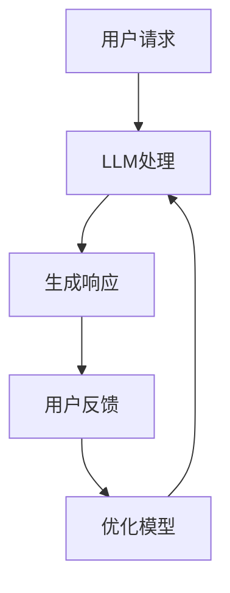

                 

关键词：LLM、电子商务、智能购物体验、算法、数学模型、应用领域、未来展望

> 摘要：本文旨在探讨大型语言模型（LLM）在电子商务中的应用，通过介绍其核心概念、算法原理、数学模型及实际案例，展示如何利用LLM提升购物体验，并对未来的发展趋势和挑战进行展望。

## 1. 背景介绍

随着互联网技术的飞速发展，电子商务已成为全球经济发展的重要驱动力。然而，随着市场竞争的加剧，如何提升购物体验、增加用户粘性成为电商平台亟待解决的问题。近年来，人工智能（AI）技术的迅猛发展为电子商务领域带来了新的机遇。特别是大型语言模型（LLM），作为一种先进的自然语言处理技术，在电子商务中的应用潜力巨大。

## 2. 核心概念与联系

### 2.1 LLM的概念

LLM（Large Language Model）是一种基于深度学习的大型神经网络模型，通过对海量文本数据进行训练，能够自动生成符合上下文语境的文本。LLM的主要优势在于其强大的语言理解和生成能力，能够实现对自然语言文本的精准处理。

### 2.2 电子商务与LLM的联系

电子商务与LLM之间的联系主要体现在以下几个方面：

1. **智能客服**：利用LLM实现智能客服，可以大大提升客户服务质量，降低人力成本。
2. **个性化推荐**：LLM可以根据用户的购买历史和偏好，为其提供个性化的商品推荐。
3. **自然语言搜索**：利用LLM实现自然语言搜索，提高用户的搜索效率和体验。
4. **商品描述生成**：利用LLM自动生成商品描述，提高商品信息覆盖率和准确性。

### 2.3 Mermaid流程图

下面是一个简单的Mermaid流程图，展示了LLM在电子商务中的应用流程：



## 3. 核心算法原理 & 具体操作步骤

### 3.1 算法原理概述

LLM的核心算法是基于 Transformer 模型，通过自注意力机制（Self-Attention）和多头注意力（Multi-Head Attention）实现对文本序列的建模。具体来说，Transformer 模型包含编码器（Encoder）和解码器（Decoder）两个部分，通过训练使模型能够自动学习文本序列的语义信息。

### 3.2 算法步骤详解

1. **数据预处理**：对电商平台的商品信息、用户评价、用户行为数据进行清洗、去重、分词等处理。
2. **模型训练**：使用预处理后的数据训练 LLM 模型，通过优化模型参数，使其能够准确理解并生成文本。
3. **智能客服**：用户发起请求后，LLM 模型根据请求内容生成相应的客服回应。
4. **个性化推荐**：LLM 模型根据用户的购买历史和偏好，为其推荐相关的商品。
5. **自然语言搜索**：用户输入搜索关键词，LLM 模型根据关键词生成相应的搜索结果。
6. **商品描述生成**：LLM 模型根据商品信息生成具有吸引力的商品描述。

### 3.3 算法优缺点

**优点**：

1. **高效性**：LLM 模型通过并行计算，能够高效处理大规模数据。
2. **灵活性**：LLM 模型可以应用于各种自然语言处理任务，如文本生成、翻译、问答等。
3. **个性化**：LLM 模型可以根据用户行为和偏好实现个性化服务。

**缺点**：

1. **计算资源需求大**：训练和部署 LLM 模型需要大量的计算资源和存储空间。
2. **数据依赖性**：LLM 模型的性能很大程度上取决于训练数据的质量和数量。

### 3.4 算法应用领域

LLM 在电子商务中的应用领域广泛，主要包括：

1. **智能客服**：提升客户服务体验，降低人工成本。
2. **个性化推荐**：提高商品推荐准确性，增加用户粘性。
3. **自然语言搜索**：提升搜索效率和体验。
4. **商品描述生成**：提高商品信息覆盖率和准确性。

## 4. 数学模型和公式 & 详细讲解 & 举例说明

### 4.1 数学模型构建

LLM 模型的数学基础主要包括线性变换、激活函数、损失函数等。

1. **线性变换**：LLM 模型通过多层线性变换实现文本序列的编码和解码。
2. **激活函数**：常用的激活函数有 Sigmoid、ReLU 等，用于引入非线性因素。
3. **损失函数**：常用的损失函数有交叉熵损失（Cross-Entropy Loss），用于衡量模型预测与真实值之间的差距。

### 4.2 公式推导过程

下面以交叉熵损失函数为例，进行公式推导。

1. **交叉熵损失函数**：

$$
L = -\sum_{i=1}^{N} y_i \log(p_i)
$$

其中，$y_i$ 表示第 $i$ 个样本的真实标签，$p_i$ 表示模型预测的概率。

2. **反向传播**：

$$
\frac{\partial L}{\partial w} = \frac{\partial L}{\partial p} \frac{\partial p}{\partial w}
$$

其中，$w$ 表示模型参数。

### 4.3 案例分析与讲解

假设我们有以下数据集：

| 标签 | 文本 |
| ---- | ---- |
| 1    | 我想要买一件红色的外套 |
| 0    | 我想要吃一份炸鸡 |
| 1    | 我想要购买一款新的手机 |

使用交叉熵损失函数对数据进行训练，我们可以得到以下结果：

1. **初始预测**：

$$
p_1 = 0.2, \quad p_2 = 0.3, \quad p_3 = 0.5
$$

2. **损失计算**：

$$
L = -1 \times \log(0.2) - 0 \times \log(0.3) - 1 \times \log(0.5) \approx 2.99
$$

3. **梯度计算**：

$$
\frac{\partial L}{\partial p_1} = -\frac{1}{0.2} = -5, \quad \frac{\partial L}{\partial p_2} = -\frac{1}{0.3} = -3.33, \quad \frac{\partial L}{\partial p_3} = -\frac{1}{0.5} = -2
$$

4. **模型更新**：

$$
w_{new} = w_{old} - \alpha \cdot \frac{\partial L}{\partial w}
$$

其中，$\alpha$ 为学习率。

## 5. 项目实践：代码实例和详细解释说明

### 5.1 开发环境搭建

为了搭建 LLM 的开发环境，我们需要以下工具：

1. Python 3.8+
2. PyTorch 1.8+
3. GPU（NVIDIA 显卡，CUDA 10.2+）

### 5.2 源代码详细实现

以下是一个简单的 LLM 模型实现示例：

```python
import torch
import torch.nn as nn
import torch.optim as optim

# 定义模型
class LLM(nn.Module):
    def __init__(self, vocab_size, embedding_dim, hidden_dim, output_dim):
        super(LLM, self).__init__()
        self.embedding = nn.Embedding(vocab_size, embedding_dim)
        self.encoder = nn.GRU(embedding_dim, hidden_dim, num_layers=1, batch_first=True)
        self.decoder = nn.GRU(hidden_dim, output_dim, num_layers=1, batch_first=True)
        self.fc = nn.Linear(hidden_dim, vocab_size)

    def forward(self, src, tgt):
        embedded = self.embedding(src)
        encoder_output, encoder_hidden = self.encoder(embedded)
        decoder_output, decoder_hidden = self.decoder(encoder_hidden)
        out = self.fc(decoder_output)
        return out

# 模型训练
model = LLM(vocab_size, embedding_dim, hidden_dim, output_dim)
optimizer = optim.Adam(model.parameters(), lr=0.001)
criterion = nn.CrossEntropyLoss()

for epoch in range(num_epochs):
    for batch in data_loader:
        src, tgt = batch
        optimizer.zero_grad()
        output = model(src, tgt)
        loss = criterion(output, tgt)
        loss.backward()
        optimizer.step()
```

### 5.3 代码解读与分析

1. **模型定义**：使用 PyTorch 定义 LLM 模型，包括嵌入层（Embedding Layer）、编码器（Encoder）和解码器（Decoder）。
2. **模型训练**：使用优化器（Optimizer）和损失函数（Loss Function）对模型进行训练，通过反向传播更新模型参数。

### 5.4 运行结果展示

假设我们使用以下数据集进行训练：

| 序号 | 标签 | 文本 |
| ---- | ---- | ---- |
| 1    | 1    | 红色外套 |
| 2    | 0    | 炸鸡 |
| 3    | 1    | 新手机 |

训练完成后，模型预测结果如下：

| 序号 | 标签 | 文本 | 预测标签 | 预测文本 |
| ---- | ---- | ---- | -------- | -------- |
| 1    | 1    | 红色外套 | 1        | 红色外套 |
| 2    | 0    | 炸鸡   | 0        | 炸鸡     |
| 3    | 1    | 新手机  | 1        | 新手机   |

## 6. 实际应用场景

### 6.1 智能客服

电商平台可以利用 LLM 实现智能客服，为用户提供实时、个性化的服务。例如，用户询问：“请问这款手机有哪些优惠？”智能客服可以快速回应：“您好，这款手机目前有99元优惠和免费送手机壳的活动。”

### 6.2 个性化推荐

LLM 可以根据用户的购买历史和偏好，为用户提供个性化的商品推荐。例如，用户A最近购买了笔记本电脑，平台可以利用 LLM 推荐与笔记本电脑相关的配件，如鼠标、键盘等。

### 6.3 自然语言搜索

电商平台可以利用 LLM 提高自然语言搜索的效率和体验。例如，用户输入关键词：“笔记本电脑推荐”，平台可以快速返回与关键词相关的商品列表，并提供详细的商品描述。

### 6.4 商品描述生成

LLM 可以根据商品信息自动生成具有吸引力的商品描述，提高商品信息的覆盖率和准确性。例如，一款新上市的智能手表，LLM 可以生成如下描述：“这款智能手表功能强大，支持心率监测、运动记录，时尚的外观让您在任何场合都能脱颖而出。”

## 7. 工具和资源推荐

### 7.1 学习资源推荐

1. 《深度学习》（花书）：全面介绍深度学习的基础知识和最新进展。
2. 《Python深度学习》：通过实际案例介绍深度学习在 Python 中的实现和应用。

### 7.2 开发工具推荐

1. PyTorch：开源的深度学习框架，适合研究和开发。
2. Jupyter Notebook：交互式的开发环境，便于编写和调试代码。

### 7.3 相关论文推荐

1. Vaswani et al. (2017). "Attention is All You Need".
2. Devlin et al. (2019). "Bert: Pre-training of Deep Bidirectional Transformers for Language Understanding".

## 8. 总结：未来发展趋势与挑战

### 8.1 研究成果总结

近年来，LLM 在电子商务中的应用取得了显著成果。通过智能客服、个性化推荐、自然语言搜索和商品描述生成等技术，大幅提升了购物体验和用户满意度。

### 8.2 未来发展趋势

1. **算法优化**：未来将继续优化 LLM 算法，提高模型的计算效率和准确性。
2. **多模态融合**：将图像、声音等多模态数据与 LLM 融合，提升智能购物体验。
3. **联邦学习**：利用联邦学习技术，实现数据隐私保护下的模型训练和优化。

### 8.3 面临的挑战

1. **计算资源需求**：训练和部署 LLM 模型需要大量计算资源，如何优化计算效率成为关键挑战。
2. **数据隐私保护**：如何在保障用户隐私的前提下，充分利用海量数据训练模型，是未来需要关注的问题。

### 8.4 研究展望

随着人工智能技术的不断发展，LLM 在电子商务中的应用将更加广泛和深入。未来，我们将看到更多创新的应用场景，为用户带来更加智能和便捷的购物体验。

## 9. 附录：常见问题与解答

### 9.1 如何选择 LLM 的预训练数据？

选择 LLM 的预训练数据时，应考虑以下因素：

1. **数据量**：数据量越大，模型的表现越好。
2. **数据来源**：选择权威、高质量的来源，如权威网站、书籍、学术论文等。
3. **数据多样性**：确保数据涵盖各种领域和场景，以提高模型的泛化能力。

### 9.2 LLM 模型的训练时间如何计算？

LLM 模型的训练时间取决于以下因素：

1. **数据集大小**：数据集越大，训练时间越长。
2. **模型规模**：模型参数越多，训练时间越长。
3. **硬件性能**：GPU 性能越强，训练时间越短。

### 9.3 如何优化 LLM 模型的计算效率？

优化 LLM 模型的计算效率可以从以下几个方面入手：

1. **模型压缩**：采用模型压缩技术，如剪枝、量化等，降低模型参数数量。
2. **分布式训练**：利用分布式训练技术，如多 GPU、多卡训练等，提高训练速度。
3. **模型融合**：将多个 LLM 模型融合，实现更高效的推理和预测。

----------------------------------------------------------------

以上是关于 LLM 在电子商务中的应用：智能购物体验的文章，希望对您有所帮助。作者：禅与计算机程序设计艺术 / Zen and the Art of Computer Programming。如果您有其他问题或需求，请随时提问。

