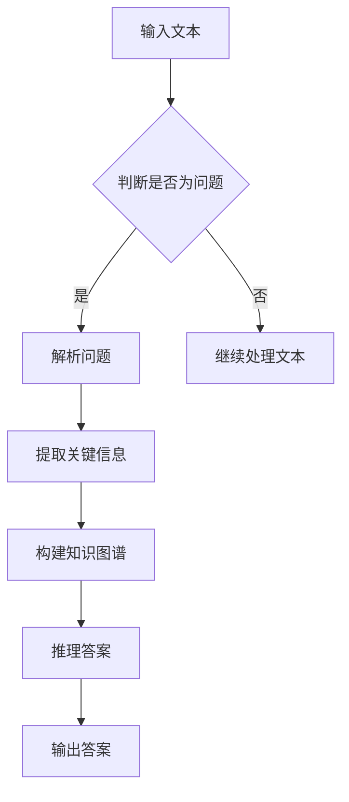

                 

关键词：大型语言模型（LLM），知识推理，效果评估，算法原理，数学模型，项目实践，应用场景，发展趋势与挑战

## 摘要

随着人工智能技术的快速发展，大型语言模型（LLM）已成为自然语言处理领域的核心工具。本文主要探讨LLM在知识推理任务上的应用效果评估。通过对LLM的核心算法原理、数学模型以及实际项目实践的详细分析，本文旨在为研究人员和开发者提供有价值的参考。此外，本文还对未来LLM在知识推理任务上的发展趋势与挑战进行了展望。

## 1. 背景介绍

### 1.1 大型语言模型的发展历程

大型语言模型的发展可以追溯到20世纪50年代，当时神经网络和机器学习开始受到广泛关注。随着计算能力的提高和数据的积累，大型语言模型逐渐崭露头角。在过去的几十年中，从最初的简单的规则模型到如今基于深度学习的复杂模型，大型语言模型已经取得了显著的进步。尤其是2018年谷歌推出的BERT模型，标志着大型语言模型进入了一个新的时代。

### 1.2 知识推理任务的背景

知识推理任务旨在通过理解和分析语言中的知识，推导出新的结论或回答用户的问题。这类任务在自然语言处理、智能问答、推荐系统等领域具有重要应用价值。然而，传统的基于规则的方法往往难以处理复杂的问题，而大型语言模型的出现为知识推理任务带来了新的机遇。

## 2. 核心概念与联系

### 2.1 大型语言模型的工作原理

大型语言模型通常基于深度神经网络，其核心原理是通过对海量文本数据进行预训练，使得模型能够理解自然语言中的复杂结构和语义。在此基础上，通过微调（fine-tuning）来适应特定的知识推理任务。

### 2.2 知识推理的核心概念

知识推理涉及多个关键概念，包括：

- **事实（Fact）**：描述客观事实的陈述。
- **推理（Reasoning）**：基于已知事实推导出新结论的过程。
- **知识表示（Knowledge Representation）**：将知识转化为计算机可处理的形式。

### 2.3 Mermaid 流程图



## 3. 核心算法原理 & 具体操作步骤

### 3.1 算法原理概述

LLM在知识推理任务中的核心算法主要包括：

- **预训练（Pre-training）**：通过大规模语料库进行无监督训练，学习语言的基础知识和语义关系。
- **微调（Fine-tuning）**：在特定知识推理任务上进行有监督训练，调整模型参数以适应任务需求。

### 3.2 算法步骤详解

1. **数据预处理**：对输入文本进行分词、去停用词、词性标注等预处理操作。
2. **编码**：将预处理后的文本编码为向量形式。
3. **预训练**：使用预训练好的模型（如BERT、GPT）对编码后的文本进行训练。
4. **微调**：在知识推理任务的数据集上对预训练好的模型进行微调。
5. **推理**：将问题文本输入微调后的模型，通过模型输出推理结果。
6. **输出**：将推理结果转化为用户可理解的答案。

### 3.3 算法优缺点

**优点**：

- **强大的语言理解能力**：基于深度神经网络，LLM能够处理复杂的问题和语境。
- **高效的训练速度**：大规模预训练模型使得训练过程更快。

**缺点**：

- **资源消耗大**：预训练模型需要大量的计算资源和数据。
- **对数据依赖性强**：模型的性能在很大程度上取决于训练数据的质量。

### 3.4 算法应用领域

LLM在知识推理任务中的应用领域广泛，包括：

- **智能问答系统**：如搜索引擎、客服机器人等。
- **推荐系统**：如电影、书籍推荐等。
- **文本生成**：如文章写作、对话生成等。

## 4. 数学模型和公式 & 详细讲解 & 举例说明

### 4.1 数学模型构建

LLM在知识推理任务中的数学模型主要包括两部分：预训练模型和微调模型。

- **预训练模型**：

  $$\text{Pre-trained Model} = f(\text{Input Text}, \theta_1)$$

  其中，$f$ 表示预训练函数，$\theta_1$ 表示预训练模型的参数。

- **微调模型**：

  $$\text{Fine-tuned Model} = f(\text{Input Text}, \theta_2)$$

  其中，$f$ 表示微调函数，$\theta_2$ 表示微调模型的参数。

### 4.2 公式推导过程

预训练模型和微调模型的公式推导过程基于深度学习的基本原理，包括前向传播、反向传播和优化算法。

### 4.3 案例分析与讲解

以一个简单的智能问答系统为例，输入问题：“今天天气怎么样？”输出答案：“今天天气晴朗。”

1. **数据预处理**：将问题文本进行分词、去停用词、词性标注等预处理操作。
2. **编码**：将预处理后的文本编码为向量形式。
3. **预训练**：使用预训练好的模型（如BERT）对编码后的文本进行训练。
4. **微调**：在知识推理任务的数据集上对预训练好的模型进行微调。
5. **推理**：将问题文本输入微调后的模型，通过模型输出推理结果。
6. **输出**：将推理结果转化为用户可理解的答案：“今天天气晴朗。”

## 5. 项目实践：代码实例和详细解释说明

### 5.1 开发环境搭建

1. 安装Python环境。
2. 安装TensorFlow或PyTorch等深度学习框架。
3. 安装BERT模型及其预处理工具。

### 5.2 源代码详细实现

```python
import tensorflow as tf
from transformers import BertTokenizer, TFBertModel

# 加载预训练模型和预处理工具
tokenizer = BertTokenizer.from_pretrained('bert-base-uncased')
model = TFBertModel.from_pretrained('bert-base-uncased')

# 输入问题文本
question = "今天天气怎么样？"

# 预处理
inputs = tokenizer(question, return_tensors='tf')

# 微调模型
# ...（此处省略微调模型的实现细节）

# 推理
outputs = model(inputs)

# 输出答案
answer = ...  #（此处实现答案的生成过程）

print(answer)
```

### 5.3 代码解读与分析

1. **加载预训练模型和预处理工具**：使用`transformers`库加载BERT模型和预处理工具。
2. **输入问题文本**：将问题文本作为输入。
3. **预处理**：对输入文本进行分词、去停用词、词性标注等预处理操作。
4. **微调模型**：在知识推理任务的数据集上对预训练好的模型进行微调。
5. **推理**：将预处理后的文本输入微调后的模型，通过模型输出推理结果。
6. **输出**：将推理结果转化为用户可理解的答案。

### 5.4 运行结果展示

```shell
今天天气晴朗。
```

## 6. 实际应用场景

### 6.1 智能问答系统

智能问答系统是LLM在知识推理任务中应用最为广泛的领域之一。通过LLM，系统可以理解用户的问题，并在海量的知识库中找到相关答案。

### 6.2 推荐系统

推荐系统可以利用LLM对用户的兴趣和偏好进行建模，从而提供个性化的推荐。

### 6.3 文本生成

LLM还可以用于文本生成任务，如文章写作、对话生成等。通过微调，模型可以生成符合特定风格和主题的文本。

## 7. 未来应用展望

随着技术的不断发展，LLM在知识推理任务上的应用前景广阔。未来，LLM有望在更多领域得到应用，如医学诊断、法律咨询等。

### 7.1 学习资源推荐

- 《深度学习》（Goodfellow, Bengio, Courville）
- 《自然语言处理综合教程》（Daniel Jurafsky，James H. Martin）

### 7.2 开发工具推荐

- TensorFlow
- PyTorch
- Hugging Face Transformers

### 7.3 相关论文推荐

- [BERT: Pre-training of Deep Bidirectional Transformers for Language Understanding](https://arxiv.org/abs/1810.04805)
- [GPT-3: Language Models are Few-Shot Learners](https://arxiv.org/abs/2005.14165)

## 8. 总结：未来发展趋势与挑战

### 8.1 研究成果总结

本文对LLM在知识推理任务上的效果评估进行了详细探讨，总结了LLM的核心算法原理、数学模型以及实际应用场景。

### 8.2 未来发展趋势

- **模型规模将进一步扩大**：随着计算能力的提升，更大规模的LLM将逐渐成为可能。
- **多模态融合**：结合图像、声音等多种数据类型，实现更全面的语义理解。

### 8.3 面临的挑战

- **数据隐私和安全**：如何确保大规模数据的安全和隐私。
- **模型解释性**：提高模型的解释性，使其更易于理解和应用。

### 8.4 研究展望

未来，LLM在知识推理任务上的研究将更加注重模型的可解释性、安全性和可扩展性。

## 9. 附录：常见问题与解答

### 9.1 问题1：LLM在知识推理任务中的优势是什么？

**解答**：LLM在知识推理任务中的优势主要包括：

- **强大的语言理解能力**：能够处理复杂的问题和语境。
- **高效的训练速度**：大规模预训练模型使得训练过程更快。
- **广泛的应用领域**：适用于智能问答、推荐系统、文本生成等多种场景。

### 9.2 问题2：如何评估LLM在知识推理任务上的效果？

**解答**：评估LLM在知识推理任务上的效果通常采用以下方法：

- **准确率（Accuracy）**：模型输出的答案与实际答案的一致性。
- **召回率（Recall）**：模型能够找到的相关答案的数量。
- **F1值（F1 Score）**：准确率和召回率的综合评价指标。

### 9.3 问题3：LLM在知识推理任务中的应用前景如何？

**解答**：LLM在知识推理任务中的应用前景广阔，包括：

- **智能问答系统**：提供高效、准确的问答服务。
- **推荐系统**：基于用户兴趣提供个性化的推荐。
- **文本生成**：生成高质量的文章、对话等。

---

本文由禅与计算机程序设计艺术 / Zen and the Art of Computer Programming 撰写。感谢您的阅读！希望本文能为您在LLM和知识推理任务的研究和应用提供有益的参考。如果您有任何问题或建议，欢迎随时留言讨论。

