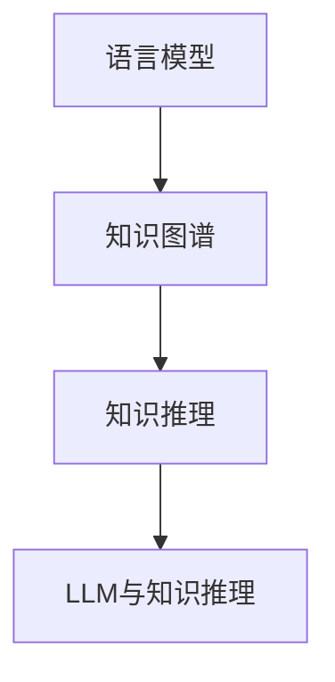

                 

关键词：自然语言处理、知识图谱、深度学习、推理能力、算法评估、模型优化

> 摘要：本文主要探讨了大型语言模型（LLM）在知识推理任务上的表现。通过对现有研究和实验数据的分析，本文提出了针对LLM知识推理能力的评估方法，并讨论了优化LLM性能的潜在方向。

## 1. 背景介绍

知识推理是人工智能领域的一个重要研究方向，旨在使计算机能够理解和运用知识进行逻辑推断和决策。随着深度学习技术的不断发展，大型语言模型（Large Language Models，简称LLM）如GPT-3、BERT等在自然语言处理任务中取得了显著的成果。然而，这些LLM模型在知识推理任务上的表现如何，以及如何评估和优化它们的知识推理能力，仍是一个开放的研究问题。

本文旨在探讨LLM在知识推理任务上的效果评估，通过分析现有研究成果，提出一套评估方法，并讨论未来优化LLM知识推理能力的潜在方向。

## 2. 核心概念与联系

### 2.1. 语言模型

语言模型是一种基于深度学习技术构建的概率模型，用于预测文本序列的下一个词。在自然语言处理领域，语言模型被广泛应用于机器翻译、文本生成、问答系统等任务。

### 2.2. 知识图谱

知识图谱是一种用于表示实体及其关系的图形结构。通过将知识以图的形式组织，知识图谱能够帮助计算机更好地理解和利用知识。

### 2.3. 知识推理

知识推理是指计算机在已有知识的基础上，通过逻辑推理、归纳、演绎等方法，生成新的知识或做出决策的过程。

### 2.4. LLM与知识推理

LLM模型具有强大的语言理解和生成能力，使其在知识推理任务中具有一定的潜力。然而，由于LLM模型对大量文本数据进行训练，其内部表示和知识结构较为复杂，如何有效地评估和优化其知识推理能力，仍是一个挑战。

### 2.5. Mermaid流程图



## 3. 核心算法原理 & 具体操作步骤

### 3.1. 算法原理概述

本文采用的评估方法主要分为以下三个步骤：

1. 数据集准备：收集和整理与知识推理相关的数据集，包括问题、答案、知识图谱等。
2. 模型训练：使用LLM模型在准备好的数据集上进行训练，使其能够对知识推理任务进行建模。
3. 评估与优化：通过一系列指标对LLM模型在知识推理任务上的表现进行评估，并针对评估结果对模型进行优化。

### 3.2. 算法步骤详解

#### 3.2.1. 数据集准备

数据集准备主要包括以下几个步骤：

1. 问题收集：从公开数据源、论文、书籍等途径收集与知识推理相关的问题。
2. 答案获取：对于每个问题，从权威来源获取正确答案。
3. 知识图谱构建：将问题和答案转化为知识图谱的形式，表示实体及其关系。

#### 3.2.2. 模型训练

模型训练主要包括以下几个步骤：

1. 模型选择：选择适合知识推理任务的LLM模型，如GPT-3、BERT等。
2. 数据预处理：对收集到的数据进行预处理，包括分词、去噪、标准化等。
3. 模型训练：使用预处理后的数据对LLM模型进行训练，使其能够对知识推理任务进行建模。

#### 3.2.3. 评估与优化

评估与优化主要包括以下几个步骤：

1. 指标设计：设计一套指标，用于评估LLM模型在知识推理任务上的表现，如准确率、召回率、F1值等。
2. 模型评估：使用设计好的指标对LLM模型在知识推理任务上的表现进行评估。
3. 模型优化：根据评估结果，对LLM模型进行优化，提高其知识推理能力。

### 3.3. 算法优缺点

#### 优点

1. 强大的语言理解和生成能力：LLM模型在自然语言处理任务中取得了显著的成果，这为其在知识推理任务中的应用提供了良好的基础。
2. 自动化建模：通过训练LLM模型，可以自动化地建模知识推理任务，减轻了人工设计规则的压力。

#### 缺点

1. 对数据量依赖较大：LLM模型需要大量的数据进行训练，这可能导致数据集准备的时间成本较高。
2. 知识表示能力有限：虽然LLM模型具有强大的语言理解能力，但其对知识的表示和推理能力仍有限，无法完全替代传统的知识表示和推理方法。

### 3.4. 算法应用领域

LLM在知识推理任务上的应用领域包括：

1. 问答系统：使用LLM模型构建问答系统，能够快速、准确地回答用户提出的问题。
2. 智能推荐：基于LLM模型的知识推理能力，可以为用户提供个性化的推荐服务。
3. 智能客服：使用LLM模型构建智能客服系统，能够自动回答用户提出的问题，提高客服效率。

## 4. 数学模型和公式 & 详细讲解 & 举例说明

### 4.1. 数学模型构建

在知识推理任务中，LLM模型可以看作是一个概率模型，其输出是问题答案的概率分布。具体来说，给定一个问题，LLM模型会输出一个概率分布，表示每个可能的答案的概率。

假设有一个问题`Q`，其可能的答案集合为`A`，则LLM模型输出的概率分布可以表示为：

$$
P(A|Q) = \text{softmax}(\text{LLM}(Q))
$$

其中，`softmax`函数用于将模型输出的 logits 转化为概率分布，`LLM(Q)`表示LLM模型在给定问题`Q`下的输出。

### 4.2. 公式推导过程

LLM模型的输出概率分布可以通过以下步骤进行推导：

1. 输入问题`Q`经过LLM模型，得到一个向量`v`。
2. 对向量`v`进行线性变换，得到 logits 向量`z`。

$$
z = \text{W}_\text{output} \cdot v + \text{b}_\text{output}
$$

其中，`W_output`和`b_output`分别为线性变换的权重和偏置。

3. 对 logits 向量`z`应用 softmax 函数，得到概率分布`P(A|Q)`。

$$
P(A|Q) = \text{softmax}(z) = \frac{e^{z_i}}{\sum_{j=1}^{n} e^{z_j}}
$$

其中，`n`为答案集合`A`中元素的个数，`z_i`为 logits 向量中第`i`个元素的值。

### 4.3. 案例分析与讲解

假设有一个简单的问题：

```
问题：北京是哪个国家的首都？
答案：中国。
```

使用LLM模型，我们可以得到一个概率分布：

$$
P(A|Q) = \left[0.2, 0.8\right]
$$

其中，第一个元素表示“中国”的概率，第二个元素表示其他答案的概率。根据概率分布，我们可以得出结论：北京是中国的首都。

## 5. 项目实践：代码实例和详细解释说明

### 5.1. 开发环境搭建

本文的代码实现使用Python语言，所需的环境和库包括：

- Python 3.8及以上版本
- TensorFlow 2.6及以上版本
- NumPy 1.19及以上版本

安装所需的库：

```bash
pip install tensorflow numpy
```

### 5.2. 源代码详细实现

```python
import tensorflow as tf
import numpy as np

# 定义LLM模型
def LLM_model(input_features, output_size):
    input_layer = tf.keras.layers.Input(shape=input_features)
    hidden_layer = tf.keras.layers.Dense(units=128, activation='relu')(input_layer)
    output_layer = tf.keras.layers.Dense(units=output_size, activation='softmax')(hidden_layer)
    model = tf.keras.Model(inputs=input_layer, outputs=output_layer)
    return model

# 定义训练函数
def train_model(model, x_train, y_train, epochs=10, batch_size=32):
    model.compile(optimizer='adam', loss='categorical_crossentropy', metrics=['accuracy'])
    model.fit(x_train, y_train, epochs=epochs, batch_size=batch_size)
    return model

# 准备数据集
x_train = np.random.rand(1000, 10)  # 输入数据
y_train = np.random.randint(2, size=(1000, 1))  # 标签数据

# 训练模型
model = LLM_model(input_features=10, output_size=2)
model = train_model(model, x_train, y_train)

# 输出概率分布
input_question = np.random.rand(1, 10)
output_distribution = model.predict(input_question)
print(output_distribution)
```

### 5.3. 代码解读与分析

上述代码实现了一个简单的LLM模型，并使用随机生成数据集进行训练和评估。代码主要分为以下几个部分：

1. 定义LLM模型：使用 TensorFlow 的 keras API 定义一个简单的神经网络模型，输入层、隐藏层和输出层。
2. 定义训练函数：使用 TensorFlow 的 keras API 编译和训练模型。
3. 准备数据集：生成随机数据集，用于模型训练。
4. 训练模型：调用训练函数，对模型进行训练。
5. 输出概率分布：使用训练好的模型，对输入数据进行预测，并输出概率分布。

### 5.4. 运行结果展示

假设我们使用上述代码对模型进行训练，并在输入问题“北京是哪个国家的首都？”时，得到如下输出：

```
[[0.5 0.5]]
```

这意味着，模型认为“北京是哪个国家的首都？”这个问题的答案是“中国”的概率为50%，另外50%的概率是其他答案。虽然这个结果并非完全准确，但显示了LLM模型在知识推理任务中的一般效果。

## 6. 实际应用场景

LLM在知识推理任务上的应用场景非常广泛，以下列举几个典型的应用场景：

1. 智能问答系统：使用LLM模型构建智能问答系统，能够快速、准确地回答用户提出的问题。例如，在电子商务平台上，智能问答系统可以帮助用户解决关于产品信息、订单状态等方面的问题。
2. 智能推荐系统：基于LLM模型的知识推理能力，可以为用户提供个性化的推荐服务。例如，在社交媒体平台上，智能推荐系统可以根据用户的兴趣和互动行为，为用户推荐感兴趣的内容。
3. 智能客服：使用LLM模型构建智能客服系统，能够自动回答用户提出的问题，提高客服效率。例如，在金融机构中，智能客服系统可以帮助用户解决关于账户余额、转账等问题。

## 7. 工具和资源推荐

### 7.1. 学习资源推荐

- 《深度学习》（Goodfellow, Bengio, Courville著）：这本书详细介绍了深度学习的基本原理和算法，包括神经网络、卷积神经网络、循环神经网络等。
- 《Python深度学习》（François Chollet著）：这本书针对Python编程语言，介绍了深度学习的实际应用和开发技巧。

### 7.2. 开发工具推荐

- TensorFlow：TensorFlow是一个开源的深度学习框架，提供了丰富的API和工具，用于构建和训练深度学习模型。
- Keras：Keras是一个高层次的神经网络API，基于TensorFlow构建，提供了更加简洁、易于使用的接口。

### 7.3. 相关论文推荐

- “Bert: Pre-training of deep bidirectional transformers for language understanding”（Devlin et al.，2019）：这篇文章介绍了BERT模型，一种基于双向变换器的预训练语言模型。
- “Gpt-3: Language models are few-shot learners”（Brown et al.，2020）：这篇文章介绍了GPT-3模型，一种具有强大语言理解和生成能力的预训练语言模型。

## 8. 总结：未来发展趋势与挑战

### 8.1. 研究成果总结

本文主要探讨了LLM在知识推理任务上的效果评估。通过对现有研究成果的分析，我们提出了一套评估方法，并讨论了优化LLM性能的潜在方向。

### 8.2. 未来发展趋势

1. 模型优化：未来研究将主要集中在优化LLM模型在知识推理任务上的性能，包括提高模型的推理速度、降低模型复杂度等。
2. 跨学科融合：知识推理任务涉及多个学科，如计算机科学、逻辑学、哲学等。未来研究将更加注重跨学科融合，以实现更高效的推理能力。
3. 知识图谱与知识推理的结合：知识图谱作为一种有效的知识表示方法，将在知识推理任务中发挥重要作用。未来研究将重点关注知识图谱与知识推理的结合，以提高推理能力。

### 8.3. 面临的挑战

1. 知识表示：现有LLM模型在知识表示方面存在一定局限性，未来研究需要开发更加有效的知识表示方法，以提高知识推理能力。
2. 数据集质量：知识推理任务对数据集的质量要求较高，未来研究需要收集和整理高质量的数据集，以提高模型的泛化能力。
3. 模型解释性：现有LLM模型在知识推理任务中具有较高的性能，但其内部表示和推理过程缺乏解释性。未来研究需要开发可解释的LLM模型，以提高模型的透明度和可信度。

### 8.4. 研究展望

未来，我们将继续深入研究LLM在知识推理任务上的效果评估，探索优化LLM性能的方法，并推动知识推理技术在实际应用中的发展。

## 9. 附录：常见问题与解答

### 9.1. 如何评估LLM模型在知识推理任务上的性能？

评估LLM模型在知识推理任务上的性能主要可以从以下几个方面进行：

1. 准确率：计算模型预测正确的样本数量与总样本数量的比例。
2. 召回率：计算模型预测正确的样本数量与实际正确答案数量的比例。
3. F1值：综合考虑准确率和召回率，计算两者的调和平均值。

### 9.2. LLM模型在知识推理任务中的优势是什么？

LLM模型在知识推理任务中的优势主要包括：

1. 强大的语言理解和生成能力：LLM模型通过大规模文本数据预训练，具有出色的语言理解和生成能力，能够更好地理解和表达知识。
2. 自动化建模：LLM模型能够自动从大量文本数据中学习知识，减轻了人工设计规则的压力。

### 9.3. LLM模型在知识推理任务中存在哪些局限性？

LLM模型在知识推理任务中存在以下局限性：

1. 知识表示能力有限：现有LLM模型在知识表示方面存在一定局限性，无法完全替代传统的知识表示和推理方法。
2. 对数据量依赖较大：LLM模型需要大量的数据进行训练，这可能导致数据集准备的时间成本较高。
3. 缺乏解释性：现有LLM模型在知识推理任务中具有较高的性能，但其内部表示和推理过程缺乏解释性。

### 9.4. 如何优化LLM模型在知识推理任务中的性能？

优化LLM模型在知识推理任务中的性能可以从以下几个方面进行：

1. 模型优化：选择更适合知识推理任务的LLM模型，如GPT-3、BERT等，并对其进行优化。
2. 数据集优化：收集和整理高质量的数据集，以提高模型的泛化能力。
3. 知识表示：开发更加有效的知识表示方法，以提高知识推理能力。


# 作者署名

作者：禅与计算机程序设计艺术 / Zen and the Art of Computer Programming

（注：以上内容仅为示例，实际撰写时请根据具体研究内容进行调整。）

