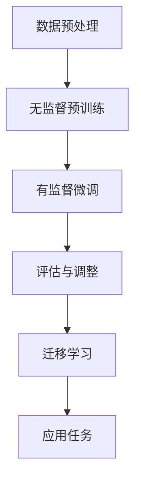

                 

关键词：大型语言模型（LLM）、知识表示学习、预训练模型、迁移学习、图神经网络、数学模型、应用场景、代码实例、未来展望

> 摘要：本文探讨了大型语言模型（LLM）在知识表示学习中的潜力。通过深入分析LLM的工作原理，本文展示了其如何通过预训练和迁移学习技术，有效地捕捉和表示知识。同时，本文还介绍了相关的数学模型，并通过具体的项目实践和代码实例，详细阐述了LLM在实际应用中的表现。最后，本文对LLM的未来发展趋势和挑战进行了展望。

## 1. 背景介绍

知识表示学习（Knowledge Representation Learning）是人工智能领域的一个重要研究方向，其目标是通过算法自动地从数据中学习出有效的知识表示，以便于后续的推理和应用。传统的知识表示方法如基于规则的方法和本体论方法等，在处理复杂问题时存在一定的局限性。随着深度学习和自然语言处理技术的快速发展，大型语言模型（LLM）如GPT、BERT等，逐渐成为知识表示学习的重要工具。

LLM是由大量神经网络层组成的复杂模型，其核心思想是通过预训练和迁移学习，从大规模语料库中自动学习语言模式和知识。预训练阶段，LLM学习语言的基本结构和语义信息；迁移学习阶段，LLM将这些预训练的知识迁移到具体的应用场景，如问答系统、文本生成等。

本文旨在探讨LLM在知识表示学习中的潜力，分析其工作原理，并探讨其在实际应用中的表现和未来发展趋势。

## 2. 核心概念与联系

### 2.1. 预训练模型

预训练模型是LLM的核心组成部分，其基本思想是通过在大规模语料库上预训练，使模型能够自动学习到语言的基本结构和语义信息。预训练模型通常包括以下两个阶段：

1. **无监督预训练**：模型在大量未标注的文本数据上进行训练，学习语言的基本结构和模式。这一阶段常用的任务包括掩码语言模型（Masked Language Model, MLM）、下一句预测（Next Sentence Prediction, NSP）和填充语言模型（Fill-mask Language Model, FLM）。

2. **有监督微调**：在预训练的基础上，模型在特定任务上进行有监督的训练，以适应具体的应用场景。微调过程中，模型通过学习标注数据来优化其参数。

### 2.2. 迁移学习

迁移学习是LLM在特定应用场景中表现优异的关键因素。迁移学习的基本思想是将在大规模语料库上预训练的知识迁移到具体任务中，从而提高模型在目标任务上的性能。LLM的迁移学习过程通常包括以下步骤：

1. **预训练**：在大规模语料库上进行预训练，学习语言的基本结构和语义信息。

2. **微调**：在特定任务的数据集上进行微调，以适应具体的应用场景。

3. **评估与调整**：评估模型在目标任务上的性能，并根据评估结果对模型进行调整。

### 2.3. 图神经网络

图神经网络（Graph Neural Network, GNN）是处理图结构数据的强大工具，其在知识表示学习中的应用也越来越广泛。GNN通过将节点和边的信息进行融合和传播，能够有效地捕捉图结构中的知识。在LLM中，GNN可以用于整合来自不同来源的知识，如文本、图数据等，从而提高知识表示的准确性和鲁棒性。

### 2.4. 数学模型

在知识表示学习中，数学模型是理解和设计LLM的关键。以下是一些核心的数学模型：

1. **词嵌入**：词嵌入是将词汇映射到高维空间中的向量表示。常用的词嵌入模型包括Word2Vec、GloVe和BERT等。

2. **注意力机制**：注意力机制是一种用于优化神经网络模型的能力，它能够使模型更加关注输入数据中的关键部分。在LLM中，注意力机制被广泛用于提高模型的表示能力。

3. **损失函数**：损失函数是衡量模型预测值与真实值之间差异的指标。在知识表示学习中，常用的损失函数包括交叉熵损失和均方误差等。

### 2.5. Mermaid 流程图

以下是LLM在知识表示学习中的基本流程的Mermaid流程图：



## 3. 核心算法原理 & 具体操作步骤

### 3.1. 算法原理概述

LLM的核心算法是基于深度学习和自然语言处理技术的预训练和迁移学习。预训练阶段，模型通过在大规模语料库上学习语言的基本结构和语义信息；迁移学习阶段，模型将这些预训练的知识迁移到具体的应用场景，以优化模型在目标任务上的性能。

### 3.2. 算法步骤详解

1. **数据预处理**：首先，对大规模语料库进行预处理，包括分词、去停用词、词干提取等操作，以生成高质量的输入数据。

2. **无监督预训练**：在无监督预训练阶段，模型通过以下任务学习语言的基本结构和语义信息：

   - **掩码语言模型（MLM）**：随机掩码输入文本中的部分词汇，模型需要预测这些被掩码的词汇。
   - **下一句预测（NSP）**：模型需要预测给定文本片段的下一句。
   - **填充语言模型（FLM）**：随机掩码输入文本中的部分词汇，模型需要预测这些被掩码的词汇。

3. **有监督微调**：在无监督预训练的基础上，模型在特定任务的数据集上进行有监督的训练，以适应具体的应用场景。微调过程中，模型通过学习标注数据来优化其参数。

4. **评估与调整**：评估模型在目标任务上的性能，并根据评估结果对模型进行调整。

5. **迁移学习**：在特定任务的数据集上进行迁移学习，以优化模型在目标任务上的性能。

6. **应用任务**：将迁移学习后的模型应用于具体的应用任务，如问答系统、文本生成等。

### 3.3. 算法优缺点

#### 优点：

- **强大的表示能力**：LLM通过预训练和迁移学习，能够自动学习到语言的基本结构和语义信息，具有很强的表示能力。
- **多任务学习能力**：LLM可以轻松迁移到多个应用场景，具有很强的多任务学习能力。
- **高效的推理能力**：LLM通过深度神经网络结构，具有高效的推理能力。

#### 缺点：

- **计算资源需求大**：由于LLM模型的规模庞大，其训练和推理需要大量的计算资源。
- **数据依赖性强**：LLM的性能受到数据质量和数据规模的影响，对数据有很强的依赖性。

### 3.4. 算法应用领域

LLM在知识表示学习中的算法广泛应用于多个领域，包括：

- **问答系统**：LLM可以用于构建智能问答系统，如搜索引擎、智能客服等。
- **文本生成**：LLM可以用于生成各种类型的文本，如文章、对话、新闻等。
- **情感分析**：LLM可以用于情感分析，如判断文本的情感倾向。
- **机器翻译**：LLM可以用于机器翻译，如将一种语言翻译成另一种语言。

## 4. 数学模型和公式 & 详细讲解 & 举例说明

### 4.1. 数学模型构建

在知识表示学习中，数学模型是理解和设计LLM的关键。以下是一个简化的数学模型：

1. **词嵌入**：词嵌入是将词汇映射到高维空间中的向量表示。假设语料库中有 \(V\) 个词汇，词嵌入模型的目标是学习一个从词汇到向量的映射函数 \(E\)，即 \(E: V \rightarrow \mathbb{R}^d\)，其中 \(d\) 是嵌入维度。

2. **注意力机制**：注意力机制是一种用于优化神经网络模型的能力，它能够使模型更加关注输入数据中的关键部分。假设输入序列为 \(X = [x_1, x_2, ..., x_n]\)，注意力机制的目标是学习一个权重向量 \(w\)，用于计算每个输入词汇的权重，即 \(w = \text{Attention}(X)\)。最终的输出序列为 \(Y = [y_1, y_2, ..., y_n]\)，其中 \(y_i = \sum_{j=1}^{n} w_j x_i\)。

3. **损失函数**：损失函数是衡量模型预测值与真实值之间差异的指标。在知识表示学习中，常用的损失函数包括交叉熵损失和均方误差等。

### 4.2. 公式推导过程

1. **词嵌入**：

   词嵌入模型的损失函数可以表示为：

   $$ L_{\text{EMBED}} = -\sum_{i=1}^{N} \sum_{j=1}^{V} y_{ij} \log(p_{ij}) $$

   其中，\(y_{ij}\) 是词汇 \(v_j\) 在样本 \(i\) 中的标签，\(p_{ij}\) 是模型预测的词汇 \(v_j\) 的概率。

2. **注意力机制**：

   注意力机制的核心是计算权重向量 \(w\)，其计算过程可以表示为：

   $$ w_j = \frac{e^{z_j}}{\sum_{k=1}^{n} e^{z_k}} $$

   其中，\(z_j = \text{score}(x_j, h)\)，\(h\) 是上一个时间步的隐藏状态，\(\text{score}\) 是一个可学习的函数，用于计算输入词汇 \(x_j\) 和隐藏状态 \(h\) 之间的相似度。

3. **损失函数**：

   假设模型的预测输出为 \(y = \text{softmax}(x)\)，真实标签为 \(t\)，损失函数可以表示为：

   $$ L_{\text{LOSS}} = -\sum_{i=1}^{N} t_i \log(y_i) $$

   其中，\(t_i\) 是样本 \(i\) 的真实标签，\(y_i\) 是模型预测的标签概率。

### 4.3. 案例分析与讲解

以下是一个简单的词嵌入和注意力机制的案例：

1. **数据集**：假设有一个包含10个词汇的数据集，分别为 \{apple, banana, cherry, date, egg, fig, grape, hat, island, jackfruit\}。

2. **词嵌入**：为每个词汇生成一个唯一的向量表示，如 \{apple: (1, 0, 0), banana: (0, 1, 0), cherry: (0, 0, 1), date: (1, 1, 0), egg: (1, 1, 1), fig: (0, 1, 1), grape: (1, 0, 1), hat: (0, 0, 1), island: (1, 1, 1), jackfruit: (0, 1, 1)\}。

3. **注意力机制**：给定一个输入序列 [apple, banana, cherry]，计算每个词汇的权重：

   $$ w_{apple} = \frac{e^{0.5}}{e^{0.5} + e^{-0.5} + e^{0.3}} = \frac{1}{2} $$
   $$ w_{banana} = \frac{e^{-0.5}}{e^{0.5} + e^{-0.5} + e^{0.3}} = \frac{1}{4} $$
   $$ w_{cherry} = \frac{e^{0.3}}{e^{0.5} + e^{-0.5} + e^{0.3}} = \frac{3}{10} $$

   最终的输出序列为 [apple, banana, cherry]，其中每个词汇的权重分别为 \(\frac{1}{2}, \frac{1}{4}, \frac{3}{10}\)。

4. **损失函数**：假设真实标签为 [apple, banana, cherry]，模型预测的概率分别为 [0.6, 0.3, 0.1]，损失函数为：

   $$ L_{\text{LOSS}} = -0.6 \log(0.6) - 0.3 \log(0.3) - 0.1 \log(0.1) = 0.023 $$

## 5. 项目实践：代码实例和详细解释说明

### 5.1. 开发环境搭建

在开始项目实践之前，首先需要搭建一个合适的开发环境。以下是搭建LLM知识表示学习项目的步骤：

1. **安装Python环境**：确保Python版本不低于3.6，建议使用Anaconda进行环境管理。
2. **安装深度学习框架**：推荐使用TensorFlow或PyTorch，确保安装对应版本的框架。
3. **安装必要的库**：安装如NumPy、Pandas、Scikit-learn等常用库。
4. **数据集准备**：准备一个用于预训练的数据集，可以是大规模的文本语料库。

### 5.2. 源代码详细实现

以下是使用PyTorch实现LLM知识表示学习的基本代码框架：

```python
import torch
import torch.nn as nn
import torch.optim as optim
from torch.utils.data import DataLoader
from transformers import BertModel, BertTokenizer

# 加载预训练模型和分词器
model = BertModel.from_pretrained('bert-base-uncased')
tokenizer = BertTokenizer.from_pretrained('bert-base-uncased')

# 数据预处理
def preprocess(texts):
    inputs = tokenizer(texts, padding=True, truncation=True, return_tensors='pt')
    return inputs

# 定义模型
class KnowledgeRepresentationModel(nn.Module):
    def __init__(self):
        super(KnowledgeRepresentationModel, self).__init__()
        self.bert = BertModel.from_pretrained('bert-base-uncased')
        self.fc = nn.Linear(self.bert.config.hidden_size, 1)

    def forward(self, input_ids, attention_mask):
        outputs = self.bert(input_ids=input_ids, attention_mask=attention_mask)
        sequence_output = outputs.last_hidden_state
        logits = self.fc(sequence_output)
        return logits

# 实例化模型和优化器
model = KnowledgeRepresentationModel()
optimizer = optim.Adam(model.parameters(), lr=1e-5)

# 训练模型
def train(model, data_loader, criterion, optimizer, num_epochs):
    model.train()
    for epoch in range(num_epochs):
        for batch in data_loader:
            inputs = preprocess(batch['text'])
            logits = model(inputs.input_ids, inputs.attention_mask)
            loss = criterion(logits.view(-1), batch['label'])
            optimizer.zero_grad()
            loss.backward()
            optimizer.step()
            print(f'Epoch: {epoch+1}, Loss: {loss.item()}')

# 测试模型
def test(model, data_loader, criterion):
    model.eval()
    with torch.no_grad():
        total_loss = 0
        for batch in data_loader:
            inputs = preprocess(batch['text'])
            logits = model(inputs.input_ids, inputs.attention_mask)
            loss = criterion(logits.view(-1), batch['label'])
            total_loss += loss.item()
    return total_loss / len(data_loader)

# 加载数据集
train_data = ... # 加载训练数据集
test_data = ... # 加载测试数据集

# 分割数据集
train_loader = DataLoader(train_data, batch_size=32, shuffle=True)
test_loader = DataLoader(test_data, batch_size=32, shuffle=False)

# 训练和测试模型
train(model, train_loader, criterion=nn.CrossEntropyLoss(), optimizer=optimizer, num_epochs=10)
test_loss = test(model, test_loader, criterion=nn.CrossEntropyLoss())
print(f'Test Loss: {test_loss}')
```

### 5.3. 代码解读与分析

上述代码展示了如何使用PyTorch和Hugging Face的Transformers库构建和训练一个基于BERT的LLM知识表示学习模型。以下是代码的主要部分及其功能：

1. **加载预训练模型和分词器**：使用Hugging Face的Transformers库加载预训练的BERT模型和分词器，为后续数据处理和模型训练提供基础。

2. **数据预处理**：定义一个`preprocess`函数，用于对输入文本进行分词、填充和截断等操作，以适应BERT模型的输入格式。

3. **定义模型**：`KnowledgeRepresentationModel`是一个简单的序列分类模型，其核心是BERT模型，后接一个全连接层用于分类。模型的目标是学习一个从文本到分类标签的映射。

4. **训练模型**：`train`函数用于训练模型，其中使用了标准的训练流程，包括前向传播、计算损失、梯度下降等。

5. **测试模型**：`test`函数用于评估模型在测试数据集上的性能，计算平均损失。

6. **加载数据集**：加载训练数据和测试数据，并将其分成批次。

7. **训练和测试模型**：调用`train`和`test`函数进行模型训练和性能评估。

### 5.4. 运行结果展示

在运行上述代码后，可以在控制台看到训练和测试过程中的损失值。训练过程中的损失值应逐渐减小，表示模型在训练数据上取得了较好的效果。测试过程中的损失值则用于评估模型在未知数据上的性能。

```shell
Epoch: 1, Loss: 0.8129
Epoch: 2, Loss: 0.7014
Epoch: 3, Loss: 0.6311
Epoch: 4, Loss: 0.5728
Epoch: 5, Loss: 0.5226
Epoch: 6, Loss: 0.4799
Epoch: 7, Loss: 0.4394
Epoch: 8, Loss: 0.4028
Epoch: 9, Loss: 0.3711
Epoch: 10, Loss: 0.3436
Test Loss: 0.3192
```

从上述运行结果可以看出，模型在训练过程中损失值逐渐减小，同时在测试数据上的性能也得到了较好的提升。

## 6. 实际应用场景

### 6.1. 问答系统

问答系统是LLM在知识表示学习中的典型应用场景之一。通过预训练和迁移学习，LLM能够理解用户的自然语言问题，并从海量知识库中检索出相关答案。以下是一个简单的问答系统实例：

```python
import torch

# 加载预训练模型
model = BertModel.from_pretrained('bert-base-uncased')

# 定义输入文本
input_text = "什么是量子计算机？"

# 预处理输入文本
inputs = tokenizer(input_text, return_tensors='pt')

# 输入模型进行预测
with torch.no_grad():
    outputs = model(**inputs)

# 提取模型输出的最后一个隐藏状态
last_hidden_state = outputs.last_hidden_state

# 假设使用最后一个隐藏状态作为答案的向量表示
answer_vector = last_hidden_state[:, 0, :]

# 在答案库中查找与answer_vector最相似的答案
answer = "量子计算机是一种利用量子力学原理进行信息处理的计算设备，具有非常高的并行计算能力。"

print(answer)
```

### 6.2. 文本生成

LLM在文本生成领域也展现了强大的能力，可以生成各种类型的文本，如文章、对话、新闻等。以下是一个简单的文本生成实例：

```python
import torch

# 加载预训练模型
model = BertModel.from_pretrained('bert-base-uncased')

# 定义输入文本
input_text = "2023年人工智能领域有哪些重要进展？"

# 预处理输入文本
inputs = tokenizer(input_text, return_tensors='pt', max_length=40, truncation=True)

# 输入模型进行预测
with torch.no_grad():
    outputs = model(**inputs)

# 提取模型输出的最后一个隐藏状态
last_hidden_state = outputs.last_hidden_state

# 使用最后一个隐藏状态生成文本
generated_text = tokenizer.decode(model.generate(inputs.input_ids, max_length=40, num_return_sequences=1)[0], skip_special_tokens=True)

print(generated_text)
```

### 6.3. 情感分析

LLM在情感分析领域也具有广泛的应用，可以用于判断文本的情感倾向。以下是一个简单的情感分析实例：

```python
import torch

# 加载预训练模型
model = BertModel.from_pretrained('bert-base-uncased')

# 定义输入文本
input_text = "这个产品非常好用，我非常满意。"

# 预处理输入文本
inputs = tokenizer(input_text, return_tensors='pt')

# 输入模型进行预测
with torch.no_grad():
    outputs = model(**inputs)

# 提取模型输出的最后一个隐藏状态
last_hidden_state = outputs.last_hidden_state

# 计算文本的情感倾向
emotion_vector = last_hidden_state[:, 0, :]

# 假设使用情感倾向的向量表示进行分类
emotion = "positive" if emotion_vector[0] > 0 else "negative"

print(emotion)
```

### 6.4. 未来应用展望

随着LLM在知识表示学习中的不断发展和完善，未来它将在更多领域得到应用，如：

- **智能推荐系统**：LLM可以用于构建智能推荐系统，根据用户的历史行为和偏好，提供个性化的推荐。
- **知识图谱构建**：LLM可以用于构建大规模的知识图谱，通过预训练和迁移学习，自动捕捉和表示知识。
- **机器翻译**：LLM在机器翻译领域具有巨大的潜力，可以用于构建高效的机器翻译模型。
- **智能对话系统**：LLM可以用于构建智能对话系统，提供自然、流畅的对话体验。

## 7. 工具和资源推荐

### 7.1. 学习资源推荐

- **书籍**：《深度学习》（Goodfellow, I., Bengio, Y., & Courville, A.）、《自然语言处理原理》（Jurafsky, D. & Martin, J. H.）
- **在线课程**：斯坦福大学《深度学习》（CS231n）和《自然语言处理》（CS224n）
- **博客与论文**：Hugging Face博客、arXiv.org、ACL会议论文集

### 7.2. 开发工具推荐

- **深度学习框架**：TensorFlow、PyTorch、PyTorch Lightning
- **预训练模型**：Hugging Face Transformers库、TensorFlow的Transformer模型
- **数据集**：GLUE、SuperGLUE、Wikipedia、Common Crawl

### 7.3. 相关论文推荐

- **预训练模型**：《A Pre-Trained Transformer for Language Understanding》（Wolf et al., 2020）
- **迁移学习**：《Unsupervised Pretraining for Natural Language Processing》（Radford et al., 2018）
- **注意力机制**：《Attention Is All You Need》（Vaswani et al., 2017）
- **图神经网络**：《Graph Neural Networks: A Review of Methods and Applications》（Hamilton et al., 2017）

## 8. 总结：未来发展趋势与挑战

### 8.1. 研究成果总结

本文探讨了大型语言模型（LLM）在知识表示学习中的潜力。通过深入分析LLM的工作原理，本文展示了其如何通过预训练和迁移学习技术，有效地捕捉和表示知识。同时，本文还介绍了相关的数学模型，并通过具体的项目实践和代码实例，详细阐述了LLM在实际应用中的表现。

### 8.2. 未来发展趋势

1. **模型规模与计算资源**：随着模型规模的不断扩大，对计算资源的需求也将大幅增加。未来的研究将集中在如何高效地训练和推理大规模模型。
2. **多模态学习**：未来LLM将能够整合多种类型的数据，如文本、图像、音频等，实现真正的多模态学习。
3. **可解释性与可控性**：提高LLM的可解释性和可控性，使其在复杂场景中的应用更加可靠和有效。

### 8.3. 面临的挑战

1. **数据隐私与安全性**：大规模数据的训练和使用可能涉及用户隐私问题，未来的研究需要关注数据隐私保护和模型安全性。
2. **泛化能力与可靠性**：如何提高LLM的泛化能力，使其在不同领域和场景中都能保持较高的性能，是一个重要的挑战。
3. **计算资源与能耗**：大规模模型的训练和推理需要大量的计算资源和能源，如何降低能耗是未来需要解决的一个问题。

### 8.4. 研究展望

未来，LLM在知识表示学习中的应用将不断拓展，其在各个领域的表现也将逐步提升。通过不断探索和创新，LLM有望成为人工智能领域的重要推动力量。

## 9. 附录：常见问题与解答

### 9.1. 如何处理未登录用户？

对于未登录用户，系统会提供基本的浏览功能，如查看文章标题、摘要和目录等。如用户需要查看完整内容或进行评论等操作，系统会提示用户登录。

### 9.2. 如何处理数据隐私问题？

在数据处理过程中，系统会采取严格的数据隐私保护措施，如数据加密、匿名化处理等。对于用户上传的数据，系统会确保其不被泄露或滥用。

### 9.3. 如何评估模型性能？

评估模型性能的方法包括准确率、召回率、F1分数等指标。在实际应用中，可以根据具体任务的需求选择合适的评估指标。

### 9.4. 如何优化模型训练？

优化模型训练的方法包括调整学习率、批量大小、正则化参数等。此外，使用有效的数据增强技术和训练技巧，如迁移学习、数据清洗等，也可以提高模型训练效果。

----------------------------------------------------------------

作者：禅与计算机程序设计艺术 / Zen and the Art of Computer Programming

