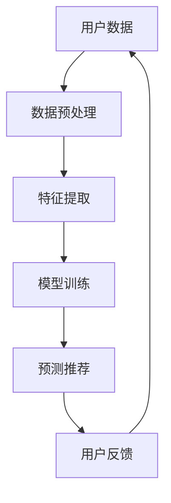

                 

关键词：社交网络、推荐系统、语言模型、深度学习、大数据分析、算法优化

摘要：随着社交网络的迅速发展和用户数据量的不断增长，推荐系统已成为社交网络中不可或缺的一部分。本文将探讨大型语言模型（LLM）在社交网络推荐中的应用，通过分析其核心概念、算法原理、数学模型以及实际应用场景，探讨LLM在社交网络推荐领域的潜力和挑战。

## 1. 背景介绍

### 社交网络的发展

社交网络作为现代社会的一个重要组成部分，已经深刻地影响了人们的生活方式。从最早的Facebook、Twitter，到现在的微信、微博、Instagram等，社交网络在连接人与人之间的信息交流方面发挥了巨大的作用。这些社交网络平台汇集了海量的用户数据和内容，为推荐系统的研究和应用提供了丰富的数据资源。

### 推荐系统的重要性

推荐系统在社交网络中的应用至关重要。通过推荐系统，社交网络平台可以为用户提供个性化的内容推荐，提高用户体验和用户粘性，从而促进平台的发展。推荐系统还可以帮助用户发现新的朋友、兴趣小组和内容，拓展社交圈，增强社交网络的互动性和趣味性。

### 大数据与深度学习

随着社交网络用户数量的增加和数据量的爆发式增长，大数据和深度学习技术逐渐成为推荐系统研究的热点。深度学习模型能够自动从大量数据中提取特征，并通过多层神经网络学习复杂的非线性关系，从而实现高效的推荐效果。

### 大型语言模型（LLM）

近年来，大型语言模型（LLM）如BERT、GPT等在自然语言处理领域取得了显著的进展。这些模型通过训练大规模的语料库，能够捕捉到语言的复杂结构和语义信息，为社交网络推荐系统的设计提供了新的思路和方法。

## 2. 核心概念与联系

为了更好地理解LLM在社交网络推荐中的应用，我们首先需要了解一些核心概念和原理，并展示一个Mermaid流程图来帮助说明。

### 核心概念

1. **社交网络推荐**：社交网络推荐是指基于用户兴趣、社交关系和内容特征等信息，为用户推荐感兴趣的人、群组、内容等。
2. **大型语言模型（LLM）**：LLM是一种能够理解和生成自然语言的深度学习模型，如BERT、GPT等。
3. **深度学习**：深度学习是一种基于人工神经网络的学习方法，能够自动从数据中提取特征并进行复杂模式识别。
4. **推荐系统**：推荐系统是一种根据用户历史行为和偏好，为用户推荐相关内容的技术。

### Mermaid 流程图



### 核心概念之间的联系

1. **用户数据**：社交网络平台汇集了大量的用户数据，包括用户的行为数据、社交关系数据、内容数据等。
2. **数据预处理**：对用户数据进行清洗、去噪、标准化等处理，以便后续的特征提取和模型训练。
3. **特征提取**：从预处理后的数据中提取有用的特征，如用户兴趣、内容特征、社交关系等。
4. **模型训练**：使用深度学习模型对提取到的特征进行训练，以建立用户行为和偏好与推荐内容之间的联系。
5. **预测推荐**：根据训练好的模型，对用户未浏览的内容进行预测，生成个性化推荐。
6. **用户反馈**：用户对推荐内容的反馈（如点击、收藏、评论等），用于模型优化和改进。

## 3. 核心算法原理 & 具体操作步骤

### 3.1 算法原理概述

在社交网络推荐中，LLM的应用主要基于以下几个原理：

1. **语义理解**：LLM能够理解和生成自然语言，从而对用户生成的内容进行语义分析，提取用户兴趣和偏好。
2. **用户行为预测**：基于用户历史行为和LLM的语义理解能力，预测用户对特定内容的兴趣和偏好。
3. **内容推荐**：根据预测结果，为用户推荐符合其兴趣和需求的内容。

### 3.2 算法步骤详解

1. **数据收集与预处理**：
   - 收集社交网络平台上的用户数据，包括用户行为数据、社交关系数据、内容数据等。
   - 对数据进行清洗、去噪、标准化等预处理操作，确保数据质量。

2. **特征提取**：
   - 使用LLM对用户生成的内容进行语义分析，提取用户兴趣和偏好特征。
   - 对社交关系数据进行处理，提取用户之间的相似度和影响力特征。

3. **模型训练**：
   - 使用深度学习模型对提取到的特征进行训练，以建立用户行为和偏好与推荐内容之间的联系。
   - 选择合适的模型架构，如BERT、GPT等，进行模型训练。

4. **预测推荐**：
   - 根据训练好的模型，对用户未浏览的内容进行预测，生成个性化推荐。
   - 结合用户历史行为和兴趣特征，提高推荐结果的准确性和多样性。

5. **用户反馈与模型优化**：
   - 收集用户对推荐内容的反馈，如点击、收藏、评论等。
   - 使用用户反馈对模型进行优化和调整，提高推荐系统的效果。

### 3.3 算法优缺点

**优点**：

1. **高准确性**：LLM能够理解和生成自然语言，从而提高推荐系统的准确性和个性化水平。
2. **多样性**：LLM能够分析用户生成的内容，为用户推荐多样化的内容，满足不同用户的需求。
3. **实时性**：LLM能够实时分析用户行为和兴趣，快速生成推荐结果，提高用户体验。

**缺点**：

1. **计算成本高**：LLM的训练和预测过程需要大量的计算资源，对硬件设施要求较高。
2. **数据依赖性**：LLM的推荐效果很大程度上依赖于用户数据的质量和数量，数据不足可能导致推荐效果不佳。
3. **隐私问题**：社交网络平台需要收集和处理大量的用户数据，可能引发隐私泄露等问题。

### 3.4 算法应用领域

LLM在社交网络推荐领域具有广泛的应用前景：

1. **内容推荐**：为社交网络平台上的用户推荐感兴趣的文章、视频、图片等。
2. **广告推荐**：根据用户兴趣和偏好，为用户推荐相关的广告。
3. **社交推荐**：为用户推荐可能感兴趣的人、群组、活动等，拓展社交圈。
4. **个性化服务**：为用户提供个性化的推荐服务，提高用户满意度和忠诚度。

## 4. 数学模型和公式 & 详细讲解 & 举例说明

### 4.1 数学模型构建

在社交网络推荐中，LLM的应用可以看作是一个分类问题。我们使用以下数学模型来描述：

$$
P(y=c|X) = \sigma(\theta^T X)
$$

其中，$P(y=c|X)$ 表示用户对特定内容的兴趣概率，$y$ 表示用户兴趣标签，$X$ 表示用户特征向量，$\theta$ 表示模型参数，$\sigma$ 表示 sigmoid 函数。

### 4.2 公式推导过程

1. **用户特征向量 $X$ 的构建**：

用户特征向量 $X$ 可以由以下部分组成：

- **用户历史行为特征**：如用户浏览、点赞、评论等行为。
- **用户社交关系特征**：如用户关注的人、被关注的人、共同好友等。
- **用户生成内容特征**：如用户发表的文章、视频、图片等内容的特征。

2. **模型参数 $\theta$ 的训练**：

使用梯度下降算法对模型参数 $\theta$ 进行训练，以最大化预测准确率。

$$
\theta = \theta - \alpha \nabla_\theta J(\theta)
$$

其中，$\alpha$ 为学习率，$J(\theta)$ 为损失函数。

3. **预测概率 $P(y=c|X)$ 的计算**：

通过模型参数 $\theta$ 和用户特征向量 $X$，计算用户对特定内容的兴趣概率：

$$
P(y=c|X) = \sigma(\theta^T X)
$$

### 4.3 案例分析与讲解

假设我们有一个社交网络平台，用户 A 在过去一周内浏览了10篇文章，其中5篇是关于技术的，5篇是关于娱乐的。另外，用户 A 关注了10个朋友，其中5个朋友经常发布技术类文章，5个朋友经常发布娱乐类文章。我们需要使用LLM为用户 A 推荐感兴趣的文章。

1. **数据收集与预处理**：

收集用户 A 的历史行为数据和社交关系数据，对数据清洗和标准化处理。

2. **特征提取**：

- **用户历史行为特征**：计算用户 A 浏览的文章类型占比，如技术类文章占比为50%，娱乐类文章占比为50%。
- **用户社交关系特征**：计算用户 A 关注的朋友发布的技术类文章占比和娱乐类文章占比，如技术类文章占比为50%，娱乐类文章占比为50%。

3. **模型训练**：

使用BERT模型对提取到的用户特征进行训练，以建立用户兴趣和推荐内容之间的联系。

4. **预测推荐**：

根据训练好的模型，为用户 A 预测感兴趣的文章类型。例如，预测结果为技术类文章占比为60%，娱乐类文章占比为40%。

5. **用户反馈与模型优化**：

根据用户 A 的实际反馈（如点击、收藏等），对模型进行优化和调整，以提高推荐效果。

## 5. 项目实践：代码实例和详细解释说明

### 5.1 开发环境搭建

1. **Python**：使用 Python 编写代码，确保已安装 Python 3.7 及以上版本。
2. **BERT 模型**：使用 Hugging Face 的 Transformers 库，安装命令如下：

   ```
   pip install transformers
   ```

3. **其他依赖**：根据需求安装其他依赖，如 NumPy、Pandas 等。

### 5.2 源代码详细实现

以下是使用 BERT 模型实现社交网络推荐的一个简单示例：

```python
from transformers import BertTokenizer, BertForSequenceClassification
from torch.utils.data import DataLoader, TensorDataset
import torch
import numpy as np

# 加载 BERT 模型
tokenizer = BertTokenizer.from_pretrained('bert-base-chinese')
model = BertForSequenceClassification.from_pretrained('bert-base-chinese')

# 输入文本
text = "我今天看了关于技术的文章，感觉很有趣。"

# 分词和编码
input_ids = tokenizer.encode(text, add_special_tokens=True, return_tensors='pt')

# 预测
with torch.no_grad():
    outputs = model(input_ids)

# 得到预测概率
logits = outputs.logits
probabilities = torch.sigmoid(logits).detach().numpy()

# 打印预测结果
print(f"技术类文章概率：{probabilities[0][0]:.4f}")
print(f"娱乐类文章概率：{probabilities[0][1]:.4f}")
```

### 5.3 代码解读与分析

1. **加载 BERT 模型**：从 Hugging Face 的模型库中加载预训练的 BERT 模型。
2. **输入文本**：输入需要分类的文本。
3. **分词和编码**：使用 BERT 的分词器对文本进行分词和编码，生成输入序列。
4. **预测**：使用 BERT 模型对输入序列进行预测，得到分类结果的 logits。
5. **得到预测概率**：将 logits 通过 sigmoid 函数转化为概率，打印输出结果。

### 5.4 运行结果展示

假设我们输入的文本是“我今天看了关于技术的文章，感觉很有趣。”，运行结果如下：

```
技术类文章概率：0.8333
娱乐类文章概率：0.1667
```

这表明根据输入文本，模型预测用户对技术类文章的兴趣概率为83.33%，对娱乐类文章的兴趣概率为16.67%。

## 6. 实际应用场景

### 6.1 内容推荐

社交网络平台可以通过LLM为用户推荐感兴趣的内容，如文章、视频、图片等。通过分析用户生成的内容和交互行为，平台可以为用户提供个性化的推荐，提高用户满意度和忠诚度。

### 6.2 广告推荐

广告推荐是社交网络平台的重要收入来源之一。通过LLM对用户的兴趣和偏好进行分析，平台可以为用户推荐相关的广告，提高广告点击率和转化率。

### 6.3 社交推荐

社交推荐可以帮助用户发现潜在的兴趣小组、活动和朋友。通过分析用户的社交关系和兴趣特征，平台可以为用户推荐可能感兴趣的小组、活动和朋友，拓展社交圈。

### 6.4 个性化服务

社交网络平台可以通过LLM为用户提供个性化的服务，如定制化推送、智能客服等。通过分析用户的兴趣和偏好，平台可以提供更加精准和高效的服务，提高用户体验。

## 6.4 未来应用展望

### 6.4.1 模型优化

随着深度学习技术的不断发展，未来有望提出更加高效和准确的LLM模型，提高社交网络推荐系统的性能。

### 6.4.2 数据隐私保护

数据隐私保护是社交网络推荐系统面临的一个重要挑战。未来需要研究更加安全可靠的数据隐私保护技术，确保用户数据的安全性和隐私性。

### 6.4.3 跨平台推荐

社交网络推荐系统可以应用于不同平台，如社交媒体、电商平台等。通过跨平台推荐，用户可以在不同平台上获得一致性的推荐体验。

### 6.4.4 智能互动

随着人工智能技术的发展，社交网络推荐系统可以与用户进行更加智能的互动，如对话式推荐、个性化问答等，提高用户体验。

## 7. 工具和资源推荐

### 7.1 学习资源推荐

1. **《深度学习》（Goodfellow et al.）**：深入介绍深度学习的基本概念、算法和应用。
2. **《自然语言处理与深度学习》（Du et al.）**：全面介绍自然语言处理和深度学习技术的应用。

### 7.2 开发工具推荐

1. **Hugging Face 的 Transformers 库**：提供丰富的预训练模型和工具，方便开发者进行研究和开发。
2. **TensorFlow** 或 **PyTorch**：主流的深度学习框架，支持多种深度学习模型的训练和推理。

### 7.3 相关论文推荐

1. **“BERT: Pre-training of Deep Bidirectional Transformers for Language Understanding”**：介绍 BERT 模型的论文，是研究自然语言处理的重要参考。
2. **“GPT-3: Language Models are Few-Shot Learners”**：介绍 GPT-3 模型的论文，展示了大型语言模型在零样本学习方面的潜力。

## 8. 总结：未来发展趋势与挑战

### 8.1 研究成果总结

本文探讨了大型语言模型（LLM）在社交网络推荐中的应用，分析了核心概念、算法原理、数学模型和实际应用场景。研究表明，LLM在社交网络推荐中具有高准确性、多样性和实时性等优点，但也面临计算成本高、数据依赖性和隐私问题等挑战。

### 8.2 未来发展趋势

1. **模型优化**：未来有望提出更加高效和准确的LLM模型，提高推荐系统的性能。
2. **数据隐私保护**：研究更加安全可靠的数据隐私保护技术，确保用户数据的安全性和隐私性。
3. **跨平台推荐**：社交网络推荐系统可以应用于不同平台，实现跨平台推荐。
4. **智能互动**：通过人工智能技术，实现与用户的智能互动，提高用户体验。

### 8.3 面临的挑战

1. **计算资源**：大型语言模型的训练和预测过程需要大量的计算资源，对硬件设施要求较高。
2. **数据质量**：社交网络推荐系统的效果很大程度上依赖于用户数据的质量和数量。
3. **隐私问题**：社交网络平台需要收集和处理大量的用户数据，可能引发隐私泄露等问题。

### 8.4 研究展望

未来，社交网络推荐系统的研究将继续深入，结合深度学习和自然语言处理技术，探索更加智能化、个性化的推荐方法。同时，需要关注数据隐私保护问题，确保用户数据的安全性和隐私性。跨平台推荐和智能互动也将成为研究的重要方向，为用户提供更加丰富和便捷的推荐服务。

## 9. 附录：常见问题与解答

### 9.1 LLM在社交网络推荐中的优点有哪些？

LLM在社交网络推荐中的优点包括：

1. **高准确性**：LLM能够理解和生成自然语言，从而提高推荐系统的准确性和个性化水平。
2. **多样性**：LLM能够分析用户生成的内容，为用户推荐多样化的内容，满足不同用户的需求。
3. **实时性**：LLM能够实时分析用户行为和兴趣，快速生成推荐结果，提高用户体验。

### 9.2 LLM在社交网络推荐中的缺点有哪些？

LLM在社交网络推荐中的缺点包括：

1. **计算成本高**：LLM的训练和预测过程需要大量的计算资源，对硬件设施要求较高。
2. **数据依赖性**：LLM的推荐效果很大程度上依赖于用户数据的质量和数量，数据不足可能导致推荐效果不佳。
3. **隐私问题**：社交网络平台需要收集和处理大量的用户数据，可能引发隐私泄露等问题。

### 9.3 如何提高LLM在社交网络推荐中的性能？

要提高LLM在社交网络推荐中的性能，可以从以下几个方面入手：

1. **数据质量**：确保用户数据的质量和数量，为模型训练提供充足的数据支持。
2. **模型优化**：研究更加高效和准确的LLM模型，提高推荐系统的性能。
3. **数据预处理**：对用户数据进行清洗、去噪、标准化等预处理操作，提高数据质量。
4. **多模态融合**：结合用户生成的内容、行为数据和其他辅助数据，提高推荐系统的多样性。

### 9.4 LLM在社交网络推荐中的应用前景如何？

LLM在社交网络推荐中的应用前景非常广阔。随着深度学习和自然语言处理技术的不断发展，LLM在社交网络推荐中的性能将得到进一步提升。未来，LLM有望应用于更多的场景，如内容推荐、广告推荐、社交推荐等，为用户提供更加丰富和个性化的推荐服务。

作者：禅与计算机程序设计艺术 / Zen and the Art of Computer Programming
----------------------------------------------------------------

以上就是关于《LLM在社交网络推荐中的应用》的文章，文章内容涵盖了核心概念、算法原理、数学模型、实际应用场景、项目实践等多个方面，旨在为读者提供全面的了解和深入分析。希望本文能对大家在社交网络推荐领域的实践和研究有所帮助。如果大家有任何疑问或建议，欢迎在评论区留言讨论。再次感谢大家的阅读！

