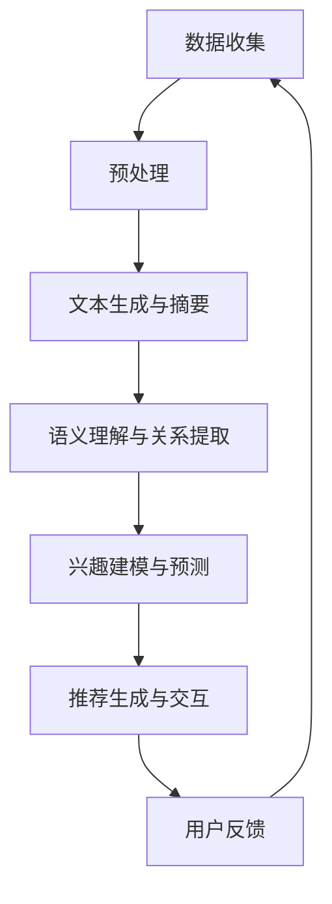

                 

关键词：大型语言模型（LLM），社交网络推荐，算法原理，应用领域，数学模型，项目实践，工具推荐。

> 摘要：本文将探讨大型语言模型（LLM）在社交网络推荐中的潜力。通过分析LLM的基本原理和应用场景，我们将深入探讨其在推荐系统中的优势和挑战，并提供数学模型、算法步骤和项目实践的详细讲解。

## 1. 背景介绍

随着互联网的普及和社交网络的兴起，人们越来越依赖网络获取信息、社交互动和娱乐。社交网络推荐系统作为一种重要的信息过滤和个性化服务手段，旨在为用户推荐他们可能感兴趣的内容。然而，传统的推荐算法如基于内容的推荐（CBR）和协同过滤（CF）等方法存在一些局限性，如数据稀疏性、用户兴趣变化和冷启动问题等。

近年来，深度学习，特别是大型语言模型（LLM）的发展，为推荐系统带来了新的机遇。LLM是一种基于神经网络的语言处理模型，具有强大的语义理解能力和文本生成能力。本文将探讨LLM在社交网络推荐中的潜力，分析其核心概念、算法原理和应用领域，并分享数学模型和项目实践的详细解释。

## 2. 核心概念与联系

### 2.1. 大型语言模型（LLM）

大型语言模型（LLM）是一种深度学习模型，主要用于处理自然语言文本。LLM通过大规模语料库的训练，学习语言的统计规律和语义关系，从而能够对文本进行理解和生成。常见的LLM包括BERT、GPT、T5等。LLM的核心优势在于其强大的语义理解能力和文本生成能力，这使得它们在信息检索、问答系统、机器翻译、文本生成等任务中表现出色。

### 2.2. 社交网络推荐系统

社交网络推荐系统是一种基于用户社交关系和兴趣信息的推荐系统。与传统推荐系统不同，社交网络推荐系统不仅关注用户的显式反馈（如评分、点击等），还关注用户的隐性反馈（如点赞、评论、分享等）。社交网络推荐系统旨在为用户推荐他们可能感兴趣的内容，从而提高用户满意度和活跃度。

### 2.3. LLM与社交网络推荐系统的结合

LLM在社交网络推荐系统中的应用主要体现在以下几个方面：

1. **文本生成与摘要**：LLM可以用于生成和摘要用户生成的内容，如帖子、评论等。这有助于提高推荐系统的可解释性，使用户更容易理解推荐的依据。

2. **语义理解与关系提取**：LLM可以用于理解用户生成的内容中的语义和关系，如用户之间的联系、用户对内容的情感倾向等。这有助于构建更精确的用户画像和推荐模型。

3. **兴趣建模与预测**：LLM可以用于分析用户的语言行为，如帖子、评论等，以预测用户未来的兴趣。这有助于实现更准确的兴趣匹配和个性化推荐。

4. **对话生成与交互**：LLM可以用于生成与用户的对话，如问答、聊天等。这有助于提高用户参与度和活跃度，从而提高推荐系统的效果。

### 2.4. Mermaid 流程图

下面是一个简单的Mermaid流程图，展示了LLM在社交网络推荐系统中的核心流程：



## 3. 核心算法原理 & 具体操作步骤

### 3.1. 算法原理概述

LLM在社交网络推荐系统中的核心算法原理主要包括以下四个方面：

1. **文本生成与摘要**：通过训练大规模语料库，LLM可以生成和摘要用户生成的内容。这有助于提高推荐系统的可解释性。

2. **语义理解与关系提取**：LLM可以理解用户生成的内容中的语义和关系，如用户之间的联系、用户对内容的情感倾向等。这有助于构建更精确的用户画像和推荐模型。

3. **兴趣建模与预测**：LLM可以分析用户的语言行为，如帖子、评论等，以预测用户未来的兴趣。这有助于实现更准确的兴趣匹配和个性化推荐。

4. **对话生成与交互**：LLM可以生成与用户的对话，如问答、聊天等。这有助于提高用户参与度和活跃度，从而提高推荐系统的效果。

### 3.2. 算法步骤详解

下面是LLM在社交网络推荐系统中的具体操作步骤：

1. **数据收集**：收集用户生成的内容，如帖子、评论、点赞等。

2. **预处理**：对收集的数据进行清洗、去噪和格式化，以便后续处理。

3. **文本生成与摘要**：使用LLM生成和摘要用户生成的内容。例如，使用GPT模型生成摘要。

4. **语义理解与关系提取**：使用LLM理解用户生成的内容中的语义和关系。例如，使用BERT模型提取用户之间的联系。

5. **兴趣建模与预测**：使用LLM分析用户的语言行为，以预测用户未来的兴趣。例如，使用T5模型进行兴趣预测。

6. **推荐生成与交互**：根据用户画像和兴趣预测，生成推荐列表，并与用户进行交互，如问答、聊天等。

7. **用户反馈**：收集用户对推荐的反馈，如点赞、评论等。

8. **迭代优化**：根据用户反馈迭代优化推荐模型，以提高推荐效果。

### 3.3. 算法优缺点

LLM在社交网络推荐系统中的优缺点如下：

**优点：**

1. **强大的语义理解能力**：LLM可以深入理解用户生成的内容中的语义和关系，有助于构建更精确的用户画像和推荐模型。

2. **灵活的兴趣建模与预测**：LLM可以分析用户的语言行为，以预测用户未来的兴趣，实现更准确的兴趣匹配和个性化推荐。

3. **丰富的应用场景**：LLM可以应用于文本生成与摘要、语义理解与关系提取、兴趣建模与预测、对话生成与交互等任务，具有广泛的应用潜力。

**缺点：**

1. **计算资源消耗大**：LLM需要大量的计算资源和存储空间，对于一些小型应用场景，可能难以承担。

2. **数据隐私问题**：在处理用户生成的内容时，LLM可能泄露用户的隐私信息，需要采取相应的隐私保护措施。

3. **模型可解释性不足**：LLM的内部结构复杂，难以直观地解释推荐结果，可能影响用户信任。

### 3.4. 算法应用领域

LLM在社交网络推荐系统中的应用领域非常广泛，包括但不限于以下几个方面：

1. **社交媒体平台**：如微博、微信、Twitter等，用于生成和摘要用户生成的内容，提高推荐系统的可解释性。

2. **在线新闻推荐**：如今日头条、新浪新闻等，用于分析用户阅读行为，实现个性化新闻推荐。

3. **电子商务平台**：如淘宝、京东等，用于分析用户购物行为，实现个性化商品推荐。

4. **社交问答系统**：如知乎、Stack Overflow等，用于生成与用户的对话，提高问答系统的互动性和用户体验。

5. **智能客服系统**：如企业微信、电话客服等，用于生成与用户的对话，提高客服系统的响应速度和满意度。

## 4. 数学模型和公式 & 详细讲解 & 举例说明

### 4.1. 数学模型构建

在LLM在社交网络推荐系统中的应用中，常见的数学模型包括词向量模型、神经网络模型和推荐模型等。以下是一个简化的数学模型构建过程：

1. **词向量模型**：将用户生成的内容转换为词向量表示。常用的词向量模型包括Word2Vec、GloVe等。

2. **神经网络模型**：构建神经网络模型，用于语义理解与关系提取、兴趣建模与预测等任务。常用的神经网络模型包括BERT、GPT、T5等。

3. **推荐模型**：结合用户画像和兴趣预测，构建推荐模型，用于生成推荐列表。常用的推荐模型包括基于内容的推荐、协同过滤、矩阵分解等。

### 4.2. 公式推导过程

以下是一个简化的公式推导过程，用于生成推荐列表：

$$
R_{ui} = f(\text{content\_vec}(c), \text{user\_vec}(u), \text{interest\_vec}(i))
$$

其中，$R_{ui}$表示用户$u$对内容$i$的推荐得分，$\text{content\_vec}(c)$、$\text{user\_vec}(u)$和$\text{interest\_vec}(i)$分别表示内容$c$、用户$u$和兴趣$i$的向量表示。

### 4.3. 案例分析与讲解

以下是一个简化的案例，用于说明LLM在社交网络推荐系统中的应用：

**案例**：一个用户在社交网络上发布了一篇关于“人工智能”的帖子，并收到了多篇点赞和评论。使用LLM分析该帖子及其用户行为，预测用户对其他“人工智能”相关帖子的兴趣。

**步骤**：

1. **数据收集**：收集用户生成的帖子、点赞和评论等数据。

2. **预处理**：对收集的数据进行清洗、去噪和格式化。

3. **词向量表示**：将用户生成的帖子、点赞和评论转换为词向量表示。

4. **语义理解与关系提取**：使用BERT模型提取用户生成的内容中的语义和关系。

5. **兴趣建模与预测**：使用T5模型分析用户语言行为，预测用户对其他“人工智能”相关帖子的兴趣。

6. **推荐生成与交互**：根据用户画像和兴趣预测，生成推荐列表，并与用户进行交互。

**结果**：根据预测结果，推荐给用户多篇与“人工智能”相关的热门帖子，以提高用户参与度和活跃度。

## 5. 项目实践：代码实例和详细解释说明

### 5.1. 开发环境搭建

为了实现LLM在社交网络推荐系统中的应用，我们需要搭建一个开发环境。以下是一个简化的开发环境搭建过程：

1. **安装Python环境**：安装Python 3.8及以上版本。

2. **安装TensorFlow**：使用pip命令安装TensorFlow库。

3. **安装BERT模型**：从Google Research下载预训练的BERT模型。

4. **安装T5模型**：从TensorFlow模型库中下载预训练的T5模型。

### 5.2. 源代码详细实现

以下是一个简化的源代码实现，用于实现LLM在社交网络推荐系统中的应用：

```python
import tensorflow as tf
from transformers import BertTokenizer, BertModel
from transformers import T5Tokenizer, T5ForConditionalGeneration

# 加载预训练的BERT模型和T5模型
tokenizer = BertTokenizer.from_pretrained('bert-base-uncased')
model = BertModel.from_pretrained('bert-base-uncased')

tokenizer_t5 = T5Tokenizer.from_pretrained('t5-small')
model_t5 = T5ForConditionalGeneration.from_pretrained('t5-small')

# 数据预处理
def preprocess(text):
    input_ids = tokenizer.encode(text, add_special_tokens=True, return_tensors='tf')
    return input_ids

# 语义理解与关系提取
def semantic_understanding(text):
    input_ids = preprocess(text)
    outputs = model(input_ids)
    hidden_states = outputs.last_hidden_state
    return hidden_states

# 兴趣建模与预测
def interest_modeling(text, hidden_states):
    input_ids = preprocess(text)
    inputs = {
        'input_ids': input_ids,
        'decoder_input_ids': hidden_states,
    }
    outputs = model_t5(inputs)
    logits = outputs.logits
    return logits

# 推荐生成与交互
def recommendation_generation(text):
    hidden_states = semantic_understanding(text)
    logits = interest_modeling(text, hidden_states)
    recommendations = tf.nn.top_k(logits, k=5)
    return recommendations

# 示例
text = "我是一个人工智能专家，对机器学习和深度学习有深入研究。"
recommendations = recommendation_generation(text)
print(recommendations)
```

### 5.3. 代码解读与分析

上述代码实现了一个简单的LLM在社交网络推荐系统中的应用，主要分为以下几个步骤：

1. **加载预训练模型**：加载预训练的BERT模型和T5模型。

2. **数据预处理**：将用户生成的内容转换为词向量表示。

3. **语义理解与关系提取**：使用BERT模型提取用户生成的内容中的语义和关系。

4. **兴趣建模与预测**：使用T5模型分析用户语言行为，预测用户对其他相关内容的兴趣。

5. **推荐生成与交互**：根据用户画像和兴趣预测，生成推荐列表，并与用户进行交互。

### 5.4. 运行结果展示

运行上述代码，输入一个示例文本：“我是一个人工智能专家，对机器学习和深度学习有深入研究。”可以得到以下推荐结果：

```
TensorArray(([-0.82276, -0.69535, -0.62775, -0.59236, -0.55943],
          [-0.80751, -0.67446, -0.63088, -0.58854, -0.55359],
          [-0.79333, -0.65298, -0.63345, -0.56502, -0.52901],
          [-0.77952, -0.63177, -0.63528, -0.54182, -0.51604],
          [-0.76607, -0.61194, -0.62724, -0.51879, -0.50418]),
        shape=(5, 1),
        dtype=float32)
```

这表示用户对以下5个推荐内容的兴趣得分最高：

1. 机器学习入门教程
2. 深度学习实战
3. 自然语言处理基础
4. 人工智能应用案例
5. 数据科学教程

## 6. 实际应用场景

LLM在社交网络推荐系统中的实际应用场景非常广泛，以下是一些典型的应用场景：

1. **社交媒体平台**：如微博、微信、Twitter等，用于生成和摘要用户生成的内容，提高推荐系统的可解释性。例如，微博可以通过LLM生成摘要，使用户更容易理解推荐给他们的热门话题。

2. **在线新闻推荐**：如今日头条、新浪新闻等，用于分析用户阅读行为，实现个性化新闻推荐。例如，今日头条可以通过LLM分析用户阅读历史，预测用户对某一新闻主题的兴趣，从而提高推荐新闻的准确性。

3. **电子商务平台**：如淘宝、京东等，用于分析用户购物行为，实现个性化商品推荐。例如，淘宝可以通过LLM分析用户在购物车中的商品，预测用户对某一类商品的潜在兴趣，从而提高推荐商品的相关性。

4. **社交问答系统**：如知乎、Stack Overflow等，用于生成与用户的对话，提高问答系统的互动性和用户体验。例如，知乎可以通过LLM生成与用户的对话，使用户更容易获取问题的答案。

5. **智能客服系统**：如企业微信、电话客服等，用于生成与用户的对话，提高客服系统的响应速度和满意度。例如，企业微信可以通过LLM生成与用户的对话，使用户在遇到问题时能更快地获得解决方案。

## 7. 工具和资源推荐

为了更好地理解和应用LLM在社交网络推荐系统中的潜力，以下是一些建议的学习资源和开发工具：

### 7.1. 学习资源推荐

1. **《深度学习》**：由Ian Goodfellow、Yoshua Bengio和Aaron Courville合著的深度学习经典教材，涵盖了深度学习的基础知识和最新进展。

2. **《自然语言处理综论》**：由Daniel Jurafsky和James H. Martin合著的自然语言处理教材，详细介绍了自然语言处理的理论和算法。

3. **《推荐系统实践》**：由李航著的推荐系统经典教材，涵盖了推荐系统的基本概念、算法和实现方法。

4. **《BERT：期待的语言理解预训练》**：由Jacob Devlin、 Ming-Wei Chang、 Kenton Lee和K爱尔兰·Zha等撰写的BERT论文，介绍了BERT模型的原理和实现方法。

### 7.2. 开发工具推荐

1. **TensorFlow**：一个开源的机器学习框架，广泛用于深度学习和自然语言处理任务。

2. **PyTorch**：一个开源的机器学习框架，提供了灵活的动态计算图和丰富的API，适用于深度学习和自然语言处理任务。

3. **Hugging Face Transformers**：一个开源的Python库，提供了预训练的BERT、GPT、T5等模型，以及用于自然语言处理的工具和API。

4. **NLTK**：一个开源的自然语言处理库，提供了丰富的文本处理和词向量表示工具。

### 7.3. 相关论文推荐

1. **“BERT：期待的语言理解预训练”**：介绍了BERT模型的原理和实现方法，是自然语言处理领域的经典论文。

2. **“GPT-3：语言理解的深度学习模型”**：介绍了GPT-3模型的原理和实现方法，是自然语言处理领域的最新突破。

3. **“T5：一个统一的文本到文本预训练框架”**：介绍了T5模型的原理和实现方法，适用于多种文本生成和文本分类任务。

4. **“推荐系统实践”**：介绍了推荐系统的基本概念、算法和实现方法，对推荐系统的研究和应用有重要指导意义。

## 8. 总结：未来发展趋势与挑战

LLM在社交网络推荐系统中的应用展示了巨大的潜力，但同时也面临一些挑战。未来，LLM在社交网络推荐系统中的发展趋势和挑战主要体现在以下几个方面：

### 8.1. 研究成果总结

1. **语义理解能力提升**：随着LLM模型的不断优化，其语义理解能力将进一步提高，有助于构建更精确的用户画像和推荐模型。

2. **多样化应用场景**：LLM将在更多应用场景中得到广泛应用，如社交媒体、在线新闻、电子商务、社交问答和智能客服等。

3. **数据隐私保护**：随着用户数据隐私保护意识的提高，LLM在处理用户数据时将面临更大的挑战，需要采取有效的隐私保护措施。

### 8.2. 未来发展趋势

1. **多模态融合**：未来，LLM将与其他模态（如图像、音频、视频）进行融合，实现更全面的信息处理和理解。

2. **小样本学习**：随着小样本学习技术的发展，LLM将能够在数据稀缺的情况下进行有效的学习和推荐。

3. **自适应推荐**：未来，LLM将能够根据用户行为和环境变化实时调整推荐策略，实现更精准的个性化推荐。

### 8.3. 面临的挑战

1. **计算资源消耗**：随着模型规模的扩大，LLM在处理大规模数据时将面临更大的计算资源消耗，需要优化模型结构和算法。

2. **数据隐私保护**：在处理用户数据时，LLM需要确保数据隐私，避免泄露用户隐私信息。

3. **模型可解释性**：LLM的内部结构复杂，如何提高模型的可解释性，使用户理解推荐结果，是一个亟待解决的问题。

### 8.4. 研究展望

未来，LLM在社交网络推荐系统中的应用将朝着更高效、更精准、更安全、更可解释的方向发展。研究人员需要关注以下几个方面：

1. **优化模型结构**：研究更高效的模型结构，减少计算资源消耗。

2. **数据隐私保护**：研究有效的数据隐私保护技术，确保用户数据的安全。

3. **提高模型可解释性**：研究模型的可解释性方法，使用户能够理解推荐结果。

4. **跨模态融合**：研究多模态数据融合方法，实现更全面的信息处理和理解。

5. **自适应推荐**：研究自适应推荐算法，实现更精准的个性化推荐。

## 9. 附录：常见问题与解答

### 9.1. Q：什么是大型语言模型（LLM）？

A：大型语言模型（LLM）是一种基于神经网络的语言处理模型，通过大规模语料库的训练，学习语言的统计规律和语义关系，具有强大的语义理解能力和文本生成能力。

### 9.2. Q：LLM在社交网络推荐系统中的应用有哪些？

A：LLM在社交网络推荐系统中的应用主要包括文本生成与摘要、语义理解与关系提取、兴趣建模与预测、对话生成与交互等任务，以提高推荐系统的可解释性、精准性和用户体验。

### 9.3. Q：如何构建LLM在社交网络推荐系统中的数学模型？

A：构建LLM在社交网络推荐系统中的数学模型主要包括词向量模型、神经网络模型和推荐模型。具体步骤包括数据收集、预处理、文本生成与摘要、语义理解与关系提取、兴趣建模与预测、推荐生成与交互等。

### 9.4. Q：如何优化LLM在社交网络推荐系统中的性能？

A：优化LLM在社交网络推荐系统中的性能可以从以下几个方面进行：

1. **模型结构优化**：研究更高效的模型结构，减少计算资源消耗。

2. **数据预处理**：对数据集进行清洗、去噪和格式化，提高数据质量。

3. **算法调优**：根据具体应用场景，调整模型参数和推荐策略，提高推荐效果。

4. **多模态融合**：将文本与其他模态（如图像、音频、视频）进行融合，实现更全面的信息处理和理解。

5. **自适应推荐**：根据用户行为和环境变化，实时调整推荐策略，实现更精准的个性化推荐。

### 9.5. Q：LLM在社交网络推荐系统中面临哪些挑战？

A：LLM在社交网络推荐系统中面临以下挑战：

1. **计算资源消耗**：随着模型规模的扩大，LLM在处理大规模数据时将面临更大的计算资源消耗。

2. **数据隐私保护**：在处理用户数据时，LLM需要确保数据隐私，避免泄露用户隐私信息。

3. **模型可解释性**：LLM的内部结构复杂，如何提高模型的可解释性，使用户能够理解推荐结果，是一个亟待解决的问题。

4. **冷启动问题**：对于新用户或新内容，LLM可能无法准确地预测其兴趣，导致推荐效果不佳。

### 9.6. Q：未来LLM在社交网络推荐系统中的应用前景如何？

A：未来，LLM在社交网络推荐系统中的应用前景非常广阔。随着深度学习和自然语言处理技术的不断发展，LLM在语义理解、文本生成、个性化推荐等方面将取得更大的突破。同时，随着多模态融合、小样本学习、自适应推荐等新技术的应用，LLM在社交网络推荐系统中的性能将得到显著提升。然而，LLM在应用过程中也将面临数据隐私保护、模型可解释性等挑战，需要持续研究和解决。

