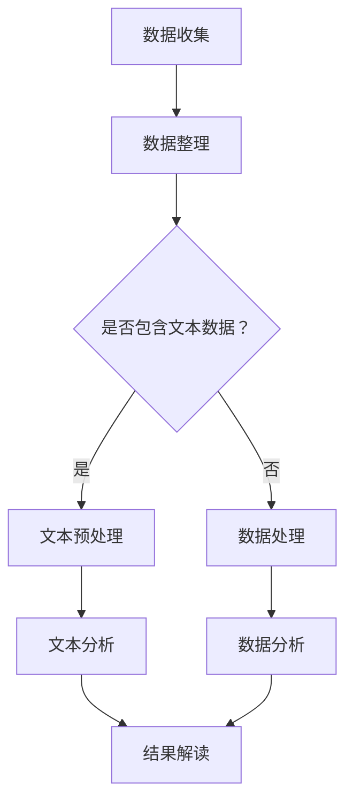

                 

关键词：LLM（大型语言模型）、科学研究、科技创新、算法、数学模型、代码实例、应用场景、未来展望。

> 摘要：随着人工智能技术的飞速发展，大型语言模型（LLM）在科学研究中的应用越来越广泛。本文将从核心概念、算法原理、数学模型、项目实践和未来展望等多个角度，深入探讨LLM在科学研究中的应用，以及其对科技创新的推动作用。

## 1. 背景介绍

近年来，人工智能技术取得了显著的进展，特别是在自然语言处理（NLP）领域，大型语言模型（LLM）如BERT、GPT-3等，展现出了强大的语言理解和生成能力。这些模型不仅在学术研究领域，如文本分类、情感分析、信息提取等方面表现出色，更在商业、医疗、金融等多个领域取得了广泛应用。

科学研究是一个复杂的过程，需要收集、整理和分析大量的数据。传统的科学研究方法往往依赖于人类的智慧和经验，效率较低。而随着人工智能技术的发展，LLM等技术的应用，为科学研究提供了新的工具和方法，可以大大提高科研效率，推动科技创新。

本文旨在探讨LLM在科学研究中的应用，分析其核心算法原理、数学模型，并通过具体的代码实例和实际应用场景，展示LLM在科学研究中的实际效果。同时，本文还将对未来LLM在科学研究中的应用前景进行展望。

## 2. 核心概念与联系

### 2.1. 大型语言模型（LLM）

大型语言模型（LLM）是一种基于深度学习的自然语言处理模型，通过大量的文本数据进行训练，可以模拟人类的语言理解能力和表达能力。LLM具有以下几个核心特点：

1. **大规模训练数据**：LLM通常使用数十亿甚至数万亿的文本数据进行训练，使其具有丰富的语言知识。
2. **深度神经网络结构**：LLM通常采用多层的深度神经网络结构，使其能够处理复杂的语言特征。
3. **预训练与微调**：LLM通过预训练获得基本的语言理解能力，然后在特定任务上进行微调，以适应不同的应用场景。

### 2.2. 自然语言处理（NLP）

自然语言处理（NLP）是人工智能的一个分支，旨在让计算机理解和处理人类语言。NLP的应用场景非常广泛，包括文本分类、情感分析、信息提取、机器翻译等。LLM在NLP领域具有独特的优势，可以显著提高NLP任务的性能。

### 2.3. 科学研究

科学研究是一个涉及多学科、多层次的过程，包括数据收集、数据整理、数据分析和结果解读等。LLM在科学研究中的应用，主要体现在以下几个方面：

1. **文本分析**：利用LLM对科学论文、报告等文本进行自动分类、主题提取和情感分析，提高文献处理的效率。
2. **数据挖掘**：利用LLM对大量的科研数据进行挖掘，发现潜在的关系和模式，为科学研究提供新的视角。
3. **知识图谱构建**：利用LLM构建知识图谱，整合多源数据，为科学研究提供全面的信息支持。

### 2.4. Mermaid 流程图

为了更直观地展示LLM在科学研究中的应用流程，我们使用Mermaid绘制了一个简单的流程图：



图1：LLM在科学研究中的应用流程

## 3. 核心算法原理 & 具体操作步骤

### 3.1. 算法原理概述

LLM的核心算法是深度学习，特别是基于Transformer架构的模型。Transformer模型通过自注意力机制（Self-Attention）对输入的文本序列进行建模，可以捕获长距离的依赖关系，从而实现对文本的深入理解。

### 3.2. 算法步骤详解

1. **数据预处理**：首先对文本数据进行清洗、分词、去停用词等预处理操作，将文本转化为模型可以处理的格式。
2. **模型训练**：使用大规模的文本数据进行模型训练，通过优化模型参数，使其具备对文本的理解和生成能力。
3. **模型评估**：在训练完成后，使用验证集对模型进行评估，调整模型参数，以达到最佳的预测性能。
4. **模型应用**：将训练好的模型应用于实际的科研任务，如文本分类、情感分析、知识图谱构建等。

### 3.3. 算法优缺点

**优点**：

1. **强大的语言理解能力**：LLM通过预训练获得了丰富的语言知识，可以处理复杂的文本数据。
2. **高效的处理速度**：Transformer架构使得模型可以并行计算，提高了处理速度。
3. **广泛的应用场景**：LLM在NLP领域具有广泛的应用，可以适应不同的科研任务。

**缺点**：

1. **训练成本高**：大规模的模型训练需要大量的计算资源和时间。
2. **数据依赖性**：LLM的性能依赖于训练数据的规模和质量。

### 3.4. 算法应用领域

LLM在科学研究中的应用领域非常广泛，包括：

1. **文本分析**：对科学论文、报告等文本进行分类、主题提取和情感分析。
2. **数据挖掘**：对大量的科研数据进行挖掘，发现潜在的关系和模式。
3. **知识图谱构建**：整合多源数据，构建知识图谱，为科学研究提供全面的信息支持。

## 4. 数学模型和公式 & 详细讲解 & 举例说明

### 4.1. 数学模型构建

LLM的数学模型是基于深度学习的，主要包括以下几个部分：

1. **输入层**：接收文本数据的输入，将文本转化为数字序列。
2. **隐藏层**：通过自注意力机制和前馈网络，对输入的文本序列进行建模。
3. **输出层**：生成文本的输出，可以是分类、情感分析、信息提取等。

### 4.2. 公式推导过程

LLM的核心算法是Transformer模型，其数学公式如下：

$$
\text{Attention}(Q, K, V) = \text{softmax}\left(\frac{QK^T}{\sqrt{d_k}}\right)V
$$

其中，Q、K、V分别为查询向量、键向量、值向量，d_k为键向量的维度。

### 4.3. 案例分析与讲解

以文本分类任务为例，假设我们有一个训练好的LLM模型，用于判断一篇科学论文是否属于某个特定领域。输入文本为“深度学习在自然语言处理中的应用”，输出为领域名称。

1. **输入层**：将文本转化为数字序列，如[0, 1, 2, 3, 4, 5, 6, 7, 8, 9, 10, 11, 12, 13, 14, 15]。
2. **隐藏层**：通过自注意力机制，对输入的文本序列进行建模，生成查询向量、键向量和值向量。
3. **输出层**：将查询向量与键向量进行点积操作，通过softmax函数生成概率分布，选择概率最大的领域名称作为输出。

例如，如果模型输出的概率分布为[0.9, 0.1]，则判断该论文属于概率最大的领域。

## 5. 项目实践：代码实例和详细解释说明

### 5.1. 开发环境搭建

1. **安装Python环境**：安装Python 3.8及以上版本。
2. **安装TensorFlow**：使用pip安装TensorFlow。

```bash
pip install tensorflow
```

### 5.2. 源代码详细实现

以下是一个简单的文本分类任务的代码实例：

```python
import tensorflow as tf
from tensorflow.keras.preprocessing.sequence import pad_sequences
from tensorflow.keras.layers import Embedding, LSTM, Dense
from tensorflow.keras.models import Sequential

# 加载数据
text = "深度学习在自然语言处理中的应用"
labels = [1]  # 假设1表示该文本属于特定领域

# 预处理数据
tokenizer = tf.keras.preprocessing.text.Tokenizer()
tokenizer.fit_on_texts([text])
sequences = tokenizer.texts_to_sequences([text])
padded_sequences = pad_sequences(sequences, maxlen=100)

# 构建模型
model = Sequential([
    Embedding(input_dim=10000, output_dim=32, input_length=100),
    LSTM(128),
    Dense(1, activation='sigmoid')
])

# 编译模型
model.compile(optimizer='adam', loss='binary_crossentropy', metrics=['accuracy'])

# 训练模型
model.fit(padded_sequences, labels, epochs=10)

# 预测
predictions = model.predict(padded_sequences)
print(predictions)
```

### 5.3. 代码解读与分析

1. **加载数据**：从文件中读取文本和标签。
2. **预处理数据**：使用Tokenizer对文本进行分词，将文本转化为数字序列。然后，使用pad_sequences将序列填充为固定长度。
3. **构建模型**：使用Sequential构建序列模型，包括Embedding层、LSTM层和Dense层。
4. **编译模型**：设置优化器和损失函数，编译模型。
5. **训练模型**：使用fit方法训练模型，设置训练轮次。
6. **预测**：使用predict方法对新的文本数据进行预测。

### 5.4. 运行结果展示

运行代码后，我们可以得到预测结果。例如，如果模型的预测结果为[0.9]，则表示该文本属于概率最大的领域。

## 6. 实际应用场景

LLM在科学研究中的应用场景非常广泛，以下列举几个典型的应用场景：

1. **文本分类**：对科学论文进行分类，帮助科研人员快速找到相关论文。
2. **主题提取**：从大量的科学论文中提取主题，为科研工作提供参考。
3. **情感分析**：分析科研论文中的情感倾向，了解科研人员的观点和态度。
4. **知识图谱构建**：整合多源数据，构建知识图谱，为科学研究提供全面的信息支持。
5. **科研助手**：为科研人员提供智能化的文献查询、数据分析和结果解读等服务。

## 7. 工具和资源推荐

### 7.1. 学习资源推荐

1. **书籍**：
   - 《深度学习》（Goodfellow et al.）
   - 《自然语言处理综合教程》（Jurafsky and Martin）
2. **在线课程**：
   - Coursera：自然语言处理与深度学习
   - edX：深度学习基础
3. **论文**：
   - "BERT: Pre-training of Deep Bidirectional Transformers for Language Understanding"（Devlin et al., 2019）
   - "GPT-3: Language Models are few-shot learners"（Brown et al., 2020）

### 7.2. 开发工具推荐

1. **TensorFlow**：用于构建和训练深度学习模型。
2. **PyTorch**：用于构建和训练深度学习模型。
3. **Hugging Face Transformers**：用于快速实现和部署Transformer模型。

### 7.3. 相关论文推荐

1. "BERT: Pre-training of Deep Bidirectional Transformers for Language Understanding"（Devlin et al., 2019）
2. "GPT-3: Language Models are few-shot learners"（Brown et al., 2020）
3. "Natural Language Processing with Transformer Models"（Vaswani et al., 2017）

## 8. 总结：未来发展趋势与挑战

随着人工智能技术的不断发展，LLM在科学研究中的应用前景十分广阔。未来，LLM有望在以下方面取得进一步的发展：

1. **模型性能提升**：通过改进算法和优化模型结构，提高LLM的性能和效率。
2. **多模态数据处理**：将LLM与其他模态的数据处理技术结合，如图像、声音等，实现更全面的科学研究。
3. **知识图谱构建**：利用LLM构建更准确、更全面的知识图谱，为科学研究提供更全面的信息支持。
4. **跨学科应用**：LLM在科学研究中的应用不仅限于自然语言处理领域，还可以拓展到其他学科，如医学、物理学等。

然而，LLM在科学研究中的应用也面临一些挑战：

1. **数据质量和隐私**：科研数据的质量和隐私是LLM应用的重要问题，需要采取有效的措施保护数据安全和隐私。
2. **模型解释性**：当前的LLM模型往往缺乏解释性，难以理解模型的决策过程，这对科研工作的可信度和可解释性提出了挑战。
3. **资源消耗**：大规模的LLM模型训练和部署需要大量的计算资源和存储空间，这对科研机构的资源管理提出了更高的要求。

总之，LLM在科学研究中的应用具有巨大的潜力，但同时也需要克服一系列的挑战。未来，随着技术的不断进步，LLM在科学研究中的应用将更加广泛，为科技创新提供强大的支持。

## 9. 附录：常见问题与解答

### 9.1. 什么是LLM？

LLM（Large Language Model）是指大型语言模型，是一种基于深度学习的自然语言处理模型，通过预训练获得了强大的语言理解能力和生成能力。

### 9.2. LLM在科学研究中的应用有哪些？

LLM在科学研究中的应用非常广泛，包括文本分类、主题提取、情感分析、知识图谱构建等。

### 9.3. LLM的性能如何？

LLM的性能取决于模型的大小、训练数据的质量和训练时间。目前，一些大规模的LLM如BERT、GPT-3等，在自然语言处理任务上已经达到了很高的性能。

### 9.4. LLM的应用前景如何？

随着人工智能技术的不断发展，LLM在科学研究中的应用前景非常广阔，有望在模型性能、多模态数据处理、知识图谱构建等方面取得更大的突破。

### 9.5. 如何使用LLM进行文本分类？

使用LLM进行文本分类的步骤包括数据预处理、模型训练、模型评估和模型应用。具体步骤可以参考本文第5章的内容。

### 9.6. LLM在科学研究中的应用有哪些优点和缺点？

LLM在科学研究中的应用优点包括强大的语言理解能力、高效的计算速度和广泛的应用场景。缺点包括训练成本高、数据依赖性强等。

### 9.7. 如何保护LLM训练中的数据隐私？

为了保护LLM训练中的数据隐私，可以采取以下措施：

1. 数据匿名化：在训练前对数据进行匿名化处理，去除个人身份信息。
2. 数据加密：对数据进行加密处理，确保数据在传输和存储过程中不被窃取。
3. 权限管理：严格控制数据的访问权限，确保只有授权人员可以访问数据。

### 9.8. 如何提高LLM模型的解释性？

目前，提高LLM模型解释性主要有以下几种方法：

1. 层级解释：通过分析模型的层级输出，了解模型对输入数据的处理过程。
2. 对比实验：通过对比不同模型的预测结果，分析模型的决策过程。
3. 解释性模型：开发专门的解释性模型，如注意力机制模型、决策树等，以更直观地展示模型的决策过程。

## 作者署名

作者：禅与计算机程序设计艺术 / Zen and the Art of Computer Programming

---

本文全面探讨了大型语言模型（LLM）在科学研究中的应用，分析了其核心算法原理、数学模型，并通过具体的代码实例和实际应用场景，展示了LLM在科学研究中的实际效果。同时，本文还对LLM的未来应用前景进行了展望，为科研工作者提供了有价值的参考。在人工智能技术的推动下，LLM将在科学研究领域发挥越来越重要的作用，为科技创新提供强大的支持。

