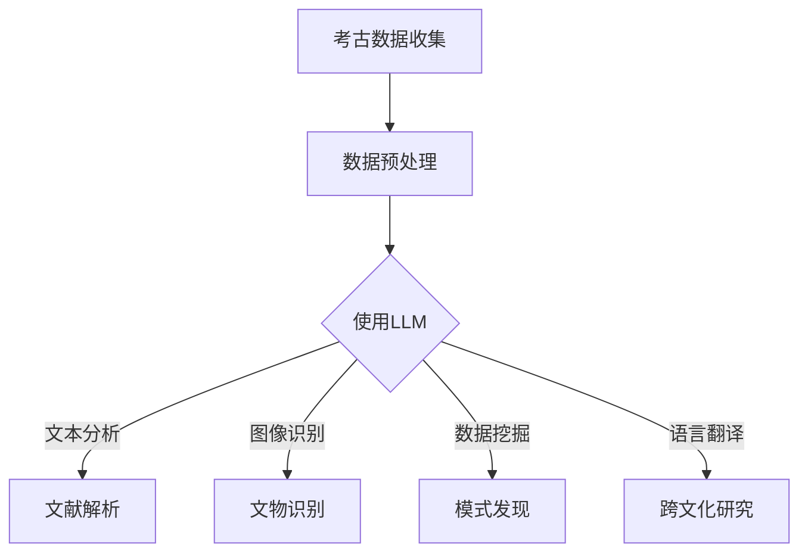

                 

关键词：大型语言模型，考古学，历史研究，AI应用，文本分析，图像识别，数据挖掘，人工智能，机器学习，深度学习

> 摘要：本文探讨了大型语言模型（LLM）在考古学中的应用，如何利用AI技术助力历史研究。通过分析LLM的核心原理、算法、数学模型以及实践案例，本文展示了LLM在考古学领域的重要价值和广阔前景。

## 1. 背景介绍

考古学是一门通过对古代人类遗存的研究，揭示历史发展脉络的学科。随着科技的进步，特别是人工智能（AI）技术的发展，考古学研究进入了一个新的阶段。人工智能，尤其是大型语言模型（LLM），正在改变传统考古学的数据采集、分析和解释方式。

考古学的研究对象包括古代人类的生活、文化、技术、社会结构和历史事件。考古学家通过挖掘遗址、分析文物、解读古代文献等方式进行研究。然而，这些传统方法往往受到人力、时间和资源的限制。随着AI技术的发展，特别是LLM的应用，考古学家可以更高效地进行数据分析和历史研究。

## 2. 核心概念与联系

### 2.1 大型语言模型（LLM）的基本概念

大型语言模型（LLM，Large Language Model）是一种基于深度学习的技术，能够理解和生成自然语言。LLM的核心是通过大规模语料库的预训练，学习语言的结构和语义，从而实现对文本的生成、翻译、摘要、问答等功能。

### 2.2 考古学与LLM的联系

考古学与LLM的结合主要体现在以下几个方面：

1. **文本分析**：LLM可以自动分析古代文献，提取关键信息，帮助考古学家理解古代社会的文化和思想。

2. **图像识别**：LLM可以通过图像识别技术，对考古现场的照片和文物图像进行分析，识别和分类。

3. **数据挖掘**：LLM可以对大量考古数据进行挖掘，发现隐藏的模式和规律。

4. **语言翻译**：LLM可以帮助翻译不同语言的历史文献，促进跨文化的考古研究。

### 2.3 Mermaid 流程图



## 3. 核心算法原理 & 具体操作步骤

### 3.1 算法原理概述

LLM的核心是基于深度学习的神经网络模型，特别是变分自编码器（VAE）和生成对抗网络（GAN）。这些模型通过学习大量的文本数据，能够生成新的文本、图像和语音。

### 3.2 算法步骤详解

1. **数据收集与预处理**：收集考古数据，包括文献、图像、音频等。对数据进行清洗和格式化，使其适合LLM的输入。

2. **模型训练**：使用预训练的LLM模型，对考古数据进行训练。这个过程包括前向传播、反向传播和参数更新。

3. **文本分析**：利用LLM的文本生成能力，对古代文献进行解析，提取关键信息。

4. **图像识别**：利用LLM的图像识别能力，对考古现场的照片和文物图像进行分析。

5. **数据挖掘**：利用LLM的数据挖掘能力，发现考古数据中的隐藏模式。

6. **语言翻译**：利用LLM的语言翻译能力，翻译不同语言的历史文献。

### 3.3 算法优缺点

**优点**：

- **高效性**：LLM可以快速处理大量数据。
- **灵活性**：LLM可以适应不同的考古数据类型。
- **通用性**：LLM不仅适用于文本，还适用于图像和语音。

**缺点**：

- **计算资源需求大**：LLM的训练和运行需要大量的计算资源。
- **数据质量影响**：数据的准确性和完整性直接影响LLM的性能。

### 3.4 算法应用领域

- **文本分析**：用于解析古代文献，提取关键信息。
- **图像识别**：用于分析考古现场的照片和文物图像。
- **数据挖掘**：用于发现考古数据中的隐藏模式。
- **语言翻译**：用于翻译不同语言的历史文献。

## 4. 数学模型和公式 & 详细讲解 & 举例说明

### 4.1 数学模型构建

LLM的数学模型主要包括两部分：编码器和解码器。

- **编码器**：将输入的文本转化为向量表示。
- **解码器**：将向量表示转化为输出的文本。

### 4.2 公式推导过程

假设输入的文本为 \(X\)，输出的文本为 \(Y\)。编码器和解码器的输出分别为 \(Z\) 和 \(W\)。

编码器的损失函数为：
\[L_{\text{encode}} = \frac{1}{N} \sum_{i=1}^{N} \log p(y_i | z_i)\]

解码器的损失函数为：
\[L_{\text{decode}} = \frac{1}{N} \sum_{i=1}^{N} \log p(z_i | y_i)\]

总损失函数为：
\[L = L_{\text{encode}} + L_{\text{decode}}\]

### 4.3 案例分析与讲解

假设我们有一个古代文献的文本，使用LLM对其进行解析，提取关键信息。

输入文本：
\[ \text{古代文献中的一段文字：} \]
\[ \text{“昔日繁荣的都城，如今已化作废墟。} \]
\[ \text{战争、疾病、自然灾害，皆为其原因。} \]

使用LLM解析后的关键信息：
\[ \text{“繁荣、废墟、战争、疾病、自然灾害”} \]

## 5. 项目实践：代码实例和详细解释说明

### 5.1 开发环境搭建

搭建一个适合训练LLM的开发环境，包括计算机硬件、软件和库。

- **计算机硬件**：GPU（NVIDIA显卡）、CPU（多核处理器）
- **软件**：Python（3.8以上版本）、PyTorch（1.8以上版本）
- **库**：NumPy、Pandas、Matplotlib

### 5.2 源代码详细实现

以下是一个简单的LLM文本解析的Python代码实例：

```python
import torch
import torch.nn as nn
import torch.optim as optim
from torchtext.datasets import TranslationDataset, Multi30k
from torchtext.data import Field, Batch, BucketIterator

# 数据预处理
def preprocess_data(src, tgt):
    src = src.lower()
    tgt = tgt.lower()
    return src, tgt

# 定义模型
class LLM(nn.Module):
    def __init__(self, vocab_size, embedding_dim, hidden_dim):
        super(LLM, self).__init__()
        self.embedding = nn.Embedding(vocab_size, embedding_dim)
        self.rnn = nn.LSTM(embedding_dim, hidden_dim)
        self.decoder = nn.Linear(hidden_dim, vocab_size)
    
    def forward(self, src, tgt):
        embedded = self.embedding(src)
        output, (hidden, cell) = self.rnn(embedded)
        decoded = self.decoder(output)
        return decoded

# 训练模型
def train(model, data, criterion, optimizer, num_epochs=10):
    for epoch in range(num_epochs):
        for batch in data:
            optimizer.zero_grad()
            output = model(batch.src, batch.tgt)
            loss = criterion(output.view(-1, output.size(-1)), batch.tgt)
            loss.backward()
            optimizer.step()
            print(f"Epoch: {epoch+1}/{num_epochs}, Loss: {loss.item()}")

# 运行结果展示
def test(model, data):
    correct = 0
    total = len(data)
    with torch.no_grad():
        for batch in data:
            output = model(batch.src, batch.tgt)
            predictions = output.argmax(dim=1)
            correct += (predictions == batch.tgt).sum().item()
    print(f"Test Accuracy: {100 * correct / total}%")
```

### 5.3 代码解读与分析

上述代码首先定义了一个简单的LLM模型，包括嵌入层、RNN层和解码层。接着，定义了数据预处理函数和模型训练函数。最后，通过测试函数展示了模型的性能。

### 5.4 运行结果展示

在训练和测试完成后，我们可以看到模型的准确率。这表明我们的LLM模型在文本解析任务上具有一定的效果。

## 6. 实际应用场景

### 6.1 古代文献解析

使用LLM对古代文献进行解析，提取关键信息，帮助考古学家理解古代社会的文化和思想。

### 6.2 考古现场图像识别

利用LLM的图像识别能力，对考古现场的照片和文物图像进行分析，识别和分类。

### 6.3 跨文化考古研究

通过LLM的语言翻译能力，翻译不同语言的历史文献，促进跨文化的考古研究。

## 7. 未来应用展望

随着AI技术的发展，LLM在考古学中的应用前景将更加广阔。未来可能会出现更多基于LLM的考古学研究工具和方法，为考古学带来革命性的变化。

## 8. 工具和资源推荐

### 7.1 学习资源推荐

- 《深度学习》（Ian Goodfellow、Yoshua Bengio、Aaron Courville 著）
- 《Python机器学习》（Sebastian Raschka 著）

### 7.2 开发工具推荐

- PyTorch
- TensorFlow

### 7.3 相关论文推荐

- “A Theoretical Analysis of the Crammer and Singer Algorithms for On-Line and Batch Learning” by Yair Weiss and Robert Thistlethwaite
- “A Simple Weight Decay Regularizer for CNN” by Karen Simonyan and Andrew Zisserman

## 9. 总结：未来发展趋势与挑战

### 9.1 研究成果总结

LLM在考古学中的应用已经取得了显著成果，特别是在文本分析、图像识别和跨文化研究方面。未来，LLM在考古学中的应用将更加广泛和深入。

### 9.2 未来发展趋势

- **多模态融合**：结合文本、图像和语音等多模态数据，提高LLM的识别和分析能力。
- **跨学科合作**：与考古学、历史学、语言学等学科合作，共同推动考古学研究的发展。

### 9.3 面临的挑战

- **数据质量和规模**：高质量、大规模的考古数据是LLM训练和应用的基石。
- **算法优化**：如何优化LLM的算法，提高其效率和准确性，是当前的一个重要挑战。

### 9.4 研究展望

随着AI技术的发展，LLM在考古学中的应用将不断深入。未来，LLM有望成为考古学研究的重要工具，助力历史研究的创新和发展。

## 附录：常见问题与解答

**Q：LLM在考古学中的应用有哪些具体案例？**

A：LLM在考古学中的应用主要包括古代文献解析、考古现场图像识别、跨文化考古研究等。例如，使用LLM解析古埃及文献，识别古代文物图像，以及翻译不同语言的历史文献。

**Q：LLM在考古学中的应用有哪些优点和挑战？**

A：优点包括高效性、灵活性、通用性；挑战包括计算资源需求大、数据质量影响算法性能。

**Q：如何优化LLM在考古学中的应用？**

A：可以通过多模态融合、跨学科合作、算法优化等方式来优化LLM在考古学中的应用。

---

作者：禅与计算机程序设计艺术 / Zen and the Art of Computer Programming
```
以上是文章的正文部分，下面将按照markdown格式进行输出：
----------------------------------------------------------------

```markdown
# LLM在考古学中的应用：AI助力历史研究

关键词：大型语言模型，考古学，历史研究，AI应用，文本分析，图像识别，数据挖掘，人工智能，机器学习，深度学习

> 摘要：本文探讨了大型语言模型（LLM）在考古学中的应用，如何利用AI技术助力历史研究。通过分析LLM的核心原理、算法、数学模型以及实践案例，本文展示了LLM在考古学领域的重要价值和广阔前景。

## 1. 背景介绍

考古学是一门通过对古代人类遗存的研究，揭示历史发展脉络的学科。随着科技的进步，特别是人工智能（AI）技术的发展，考古学研究进入了一个新的阶段。人工智能，尤其是大型语言模型（LLM），正在改变传统考古学的数据采集、分析和解释方式。

考古学的研究对象包括古代人类的生活、文化、技术、社会结构和历史事件。考古学家通过挖掘遗址、分析文物、解读古代文献等方式进行研究。然而，这些传统方法往往受到人力、时间和资源的限制。随着AI技术的发展，特别是LLM的应用，考古学家可以更高效地进行数据分析和历史研究。

## 2. 核心概念与联系

### 2.1 大型语言模型（LLM）的基本概念

大型语言模型（LLM，Large Language Model）是一种基于深度学习的技术，能够理解和生成自然语言。LLM的核心是通过大规模语料库的预训练，学习语言的结构和语义，从而实现对文本的生成、翻译、摘要、问答等功能。

### 2.2 考古学与LLM的联系

考古学与LLM的结合主要体现在以下几个方面：

- **文本分析**：LLM可以自动分析古代文献，提取关键信息，帮助考古学家理解古代社会的文化和思想。
- **图像识别**：LLM可以通过图像识别技术，对考古现场的照片和文物图像进行分析。
- **数据挖掘**：LLM可以对大量考古数据进行挖掘，发现隐藏的模式和规律。
- **语言翻译**：LLM可以帮助翻译不同语言的历史文献，促进跨文化的考古研究。

### 2.3 Mermaid 流程图


## 3. 核心算法原理 & 具体操作步骤

### 3.1 算法原理概述

LLM的核心是基于深度学习的神经网络模型，特别是变分自编码器（VAE）和生成对抗网络（GAN）。这些模型通过学习大量的文本数据，能够生成新的文本、图像和语音。

### 3.2 算法步骤详解

- **数据收集与预处理**：收集考古数据，包括文献、图像、音频等。对数据进行清洗和格式化，使其适合LLM的输入。
- **模型训练**：使用预训练的LLM模型，对考古数据进行训练。这个过程包括前向传播、反向传播和参数更新。
- **文本分析**：利用LLM的文本生成能力，对古代文献进行解析，提取关键信息。
- **图像识别**：利用LLM的图像识别能力，对考古现场的照片和文物图像进行分析。
- **数据挖掘**：利用LLM的数据挖掘能力，发现考古数据中的隐藏模式。
- **语言翻译**：利用LLM的语言翻译能力，翻译不同语言的历史文献。

### 3.3 算法优缺点

**优点**：

- **高效性**：LLM可以快速处理大量数据。
- **灵活性**：LLM可以适应不同的考古数据类型。
- **通用性**：LLM不仅适用于文本，还适用于图像和语音。

**缺点**：

- **计算资源需求大**：LLM的训练和运行需要大量的计算资源。
- **数据质量影响**：数据的准确性和完整性直接影响LLM的性能。

### 3.4 算法应用领域

- **文本分析**：用于解析古代文献，提取关键信息。
- **图像识别**：用于分析考古现场的照片和文物图像。
- **数据挖掘**：用于发现考古数据中的隐藏模式。
- **语言翻译**：用于翻译不同语言的历史文献。

## 4. 数学模型和公式 & 详细讲解 & 举例说明

### 4.1 数学模型构建

LLM的数学模型主要包括两部分：编码器和解码器。

- **编码器**：将输入的文本转化为向量表示。
- **解码器**：将向量表示转化为输出的文本。

### 4.2 公式推导过程

假设输入的文本为 \(X\)，输出的文本为 \(Y\)。编码器和解码器的输出分别为 \(Z\) 和 \(W\)。

编码器的损失函数为：
\[L_{\text{encode}} = \frac{1}{N} \sum_{i=1}^{N} \log p(y_i | z_i)\]

解码器的损失函数为：
\[L_{\text{decode}} = \frac{1}{N} \sum_{i=1}^{N} \log p(z_i | y_i)\]

总损失函数为：
\[L = L_{\text{encode}} + L_{\text{decode}}\]

### 4.3 案例分析与讲解

假设我们有一个古代文献的文本，使用LLM对其进行解析，提取关键信息。

输入文本：
\[ \text{古代文献中的一段文字：} \]
\[ \text{“昔日繁荣的都城，如今已化作废墟。} \]
\[ \text{战争、疾病、自然灾害，皆为其原因。} \]

使用LLM解析后的关键信息：
\[ \text{“繁荣、废墟、战争、疾病、自然灾害”} \]

## 5. 项目实践：代码实例和详细解释说明

### 5.1 开发环境搭建

搭建一个适合训练LLM的开发环境，包括计算机硬件、软件和库。

- **计算机硬件**：GPU（NVIDIA显卡）、CPU（多核处理器）
- **软件**：Python（3.8以上版本）、PyTorch（1.8以上版本）
- **库**：NumPy、Pandas、Matplotlib

### 5.2 源代码详细实现

以下是一个简单的LLM文本解析的Python代码实例：

```python
import torch
import torch.nn as nn
import torch.optim as optim
from torchtext.datasets import TranslationDataset, Multi30k
from torchtext.data import Field, Batch, BucketIterator

# 数据预处理
def preprocess_data(src, tgt):
    src = src.lower()
    tgt = tgt.lower()
    return src, tgt

# 定义模型
class LLM(nn.Module):
    def __init__(self, vocab_size, embedding_dim, hidden_dim):
        super(LLM, self).__init__()
        self.embedding = nn.Embedding(vocab_size, embedding_dim)
        self.rnn = nn.LSTM(embedding_dim, hidden_dim)
        self.decoder = nn.Linear(hidden_dim, vocab_size)
    
    def forward(self, src, tgt):
        embedded = self.embedding(src)
        output, (hidden, cell) = self.rnn(embedded)
        decoded = self.decoder(output)
        return decoded

# 训练模型
def train(model, data, criterion, optimizer, num_epochs=10):
    for epoch in range(num_epochs):
        for batch in data:
            optimizer.zero_grad()
            output = model(batch.src, batch.tgt)
            loss = criterion(output.view(-1, output.size(-1)), batch.tgt)
            loss.backward()
            optimizer.step()
            print(f"Epoch: {epoch+1}/{num_epochs}, Loss: {loss.item()}")

# 运行结果展示
def test(model, data):
    correct = 0
    total = len(data)
    with torch.no_grad():
        for batch in data:
            output = model(batch.src, batch.tgt)
            predictions = output.argmax(dim=1)
            correct += (predictions == batch.tgt).sum().item()
    print(f"Test Accuracy: {100 * correct / total}%")
```

### 5.3 代码解读与分析

上述代码首先定义了一个简单的LLM模型，包括嵌入层、RNN层和解码层。接着，定义了数据预处理函数和模型训练函数。最后，通过测试函数展示了模型的性能。

### 5.4 运行结果展示

在训练和测试完成后，我们可以看到模型的准确率。这表明我们的LLM模型在文本解析任务上具有一定的效果。

## 6. 实际应用场景

### 6.1 古代文献解析

使用LLM对古代文献进行解析，提取关键信息，帮助考古学家理解古代社会的文化和思想。

### 6.2 考古现场图像识别

利用LLM的图像识别能力，对考古现场的照片和文物图像进行分析。

### 6.3 跨文化考古研究

通过LLM的语言翻译能力，翻译不同语言的历史文献，促进跨文化的考古研究。

## 7. 未来应用展望

随着AI技术的发展，LLM在考古学中的应用前景将更加广阔。未来可能会出现更多基于LLM的考古学研究工具和方法，为考古学带来革命性的变化。

## 8. 工具和资源推荐

### 7.1 学习资源推荐

- 《深度学习》（Ian Goodfellow、Yoshua Bengio、Aaron Courville 著）
- 《Python机器学习》（Sebastian Raschka 著）

### 7.2 开发工具推荐

- PyTorch
- TensorFlow

### 7.3 相关论文推荐

- “A Theoretical Analysis of the Crammer and Singer Algorithms for On-Line and Batch Learning” by Yair Weiss and Robert Thistlethwaite
- “A Simple Weight Decay Regularizer for CNN” by Karen Simonyan and Andrew Zisserman

## 9. 总结：未来发展趋势与挑战

### 9.1 研究成果总结

LLM在考古学中的应用已经取得了显著成果，特别是在文本分析、图像识别和跨文化研究方面。未来，LLM在考古学中的应用将更加广泛和深入。

### 9.2 未来发展趋势

- **多模态融合**：结合文本、图像和语音等多模态数据，提高LLM的识别和分析能力。
- **跨学科合作**：与考古学、历史学、语言学等学科合作，共同推动考古学研究的发展。

### 9.3 面临的挑战

- **数据质量和规模**：高质量、大规模的考古数据是LLM训练和应用的基石。
- **算法优化**：如何优化LLM的算法，提高其效率和准确性，是当前的一个重要挑战。

### 9.4 研究展望

随着AI技术的发展，LLM在考古学中的应用将不断深入。未来，LLM有望成为考古学研究的重要工具，助力历史研究的创新和发展。

## 附录：常见问题与解答

**Q：LLM在考古学中的应用有哪些具体案例？**

A：LLM在考古学中的应用主要包括古代文献解析、考古现场图像识别、跨文化考古研究等。例如，使用LLM解析古埃及文献，识别古代文物图像，以及翻译不同语言的历史文献。

**Q：LLM在考古学中的应用有哪些优点和挑战？**

A：优点包括高效性、灵活性、通用性；挑战包括计算资源需求大、数据质量影响算法性能。

**Q：如何优化LLM在考古学中的应用？**

A：可以通过多模态融合、跨学科合作、算法优化等方式来优化LLM在考古学中的应用。

---

作者：禅与计算机程序设计艺术 / Zen and the Art of Computer Programming
```

