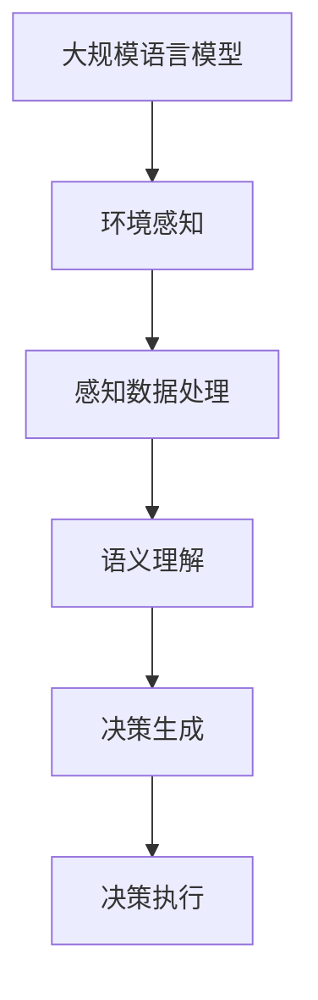

                 

关键词：自然语言处理，自动驾驶，决策支持系统，安全性能，语言模型

摘要：本文旨在探讨大规模语言模型（LLM）在自动驾驶决策中的应用，通过分析LLM的基本原理和优势，以及其在自动驾驶系统中的具体应用场景，探讨如何利用LLM提高自动驾驶的安全性能。

## 1. 背景介绍

自动驾驶技术近年来取得了显著的进展，已成为智能交通系统的重要组成部分。自动驾驶车辆通过集成传感器、计算机视觉、激光雷达等设备，结合先进的算法，实现了对车辆周围环境的感知、理解，并在此基础上进行决策和控制。然而，自动驾驶技术的安全性能仍面临诸多挑战。传统的自动驾驶决策系统主要依赖基于规则的方法和机器学习算法，虽然在一定程度上提高了决策的准确性和效率，但在处理复杂、动态的交通环境时，仍存在一定的局限性。

近年来，大规模语言模型（LLM）在自然语言处理领域取得了巨大的成功。LLM通过训练海量文本数据，可以实现对自然语言的深入理解和生成。本文将探讨如何将LLM应用于自动驾驶决策中，以进一步提高自动驾驶的安全性能。

## 2. 核心概念与联系

### 2.1 大规模语言模型（LLM）

大规模语言模型（LLM）是一种基于深度学习的自然语言处理模型，通过训练海量文本数据，可以实现对自然语言的深刻理解和生成。LLM通常由多个层级组成，包括词嵌入层、编码器、解码器等。词嵌入层将输入的单词映射到高维空间，编码器将输入序列编码为固定长度的向量，解码器则根据编码器的输出生成输出序列。

### 2.2 自动驾驶决策系统

自动驾驶决策系统是自动驾驶车辆的核心组成部分，负责对车辆周围环境进行感知、理解，并根据感知和理解的结果进行决策和控制。传统的自动驾驶决策系统主要依赖基于规则的方法和机器学习算法，如卡尔曼滤波、粒子滤波、动态窗口法等。这些方法在一定程度上提高了决策的准确性和效率，但在处理复杂、动态的交通环境时，仍存在一定的局限性。

### 2.3 LLM与自动驾驶决策系统的联系

LLM在自动驾驶决策中的应用主要体现在以下几个方面：

1. **环境感知**：LLM可以用于对传感器数据进行处理和融合，从而实现对复杂交通环境的准确感知。例如，LLM可以用于识别交通标志、交通信号灯、行人等交通元素，提高感知的准确性和鲁棒性。

2. **语义理解**：LLM可以用于对感知到的交通元素进行语义理解，从而实现对交通场景的深刻理解。例如，LLM可以用于理解道路上的交通规则、交通标志的含义等，为自动驾驶决策提供更丰富的信息。

3. **决策生成**：LLM可以用于生成基于自然语言描述的决策指令，从而提高决策的灵活性和适应性。例如，LLM可以用于生成交通信号灯变化的应对策略、行人过马路的避让策略等。

### 2.4 Mermaid 流程图

以下是一个简单的 Mermaid 流程图，展示了LLM在自动驾驶决策系统中的基本架构：



## 3. 核心算法原理 & 具体操作步骤

### 3.1 算法原理概述

LLM在自动驾驶决策中的应用主要基于以下几个核心算法原理：

1. **词嵌入**：将输入的单词映射到高维空间，从而实现词汇之间的相似性计算。

2. **编码器-解码器结构**：将输入序列编码为固定长度的向量，解码器则根据编码器的输出生成输出序列。

3. **注意力机制**：在编码器和解码器的中间引入注意力机制，以实现对输入序列的不同部分进行不同权重的关注。

### 3.2 算法步骤详解

1. **词嵌入**：首先，将输入的单词映射到高维空间。具体实现可以采用Word2Vec、GloVe等预训练模型，或者使用BERT等大规模语言模型。

2. **编码器**：将输入序列编码为固定长度的向量。编码器通常采用Transformer模型，包括多个层级，每个层级包含自注意力机制和前馈神经网络。

3. **解码器**：根据编码器的输出生成输出序列。解码器同样采用Transformer模型，并在生成过程中引入注意力机制，以关注输入序列的不同部分。

4. **决策生成**：在解码器的最后一个层级输出一个固定长度的向量，将其映射到决策空间，生成具体的决策指令。

### 3.3 算法优缺点

**优点**：

1. **强大的语义理解能力**：LLM可以处理复杂、动态的交通环境，实现对交通场景的深刻理解。

2. **灵活的决策生成**：LLM可以生成基于自然语言描述的决策指令，提高决策的灵活性和适应性。

**缺点**：

1. **计算资源需求大**：大规模语言模型的训练和推理过程需要大量的计算资源。

2. **对数据依赖性较强**：LLM的性能高度依赖于训练数据的质量和数量。

### 3.4 算法应用领域

LLM在自动驾驶决策中的应用非常广泛，主要包括：

1. **环境感知**：用于识别交通标志、交通信号灯、行人等交通元素。

2. **语义理解**：用于理解交通规则、交通标志的含义等。

3. **决策生成**：用于生成交通信号灯变化的应对策略、行人过马路的避让策略等。

## 4. 数学模型和公式 & 详细讲解 & 举例说明

### 4.1 数学模型构建

LLM在自动驾驶决策中的应用主要涉及以下几个数学模型：

1. **词嵌入模型**：将输入的单词映射到高维空间，通常采用Word2Vec、GloVe等预训练模型。

2. **编码器-解码器模型**：将输入序列编码为固定长度的向量，解码器则根据编码器的输出生成输出序列，通常采用Transformer模型。

3. **注意力机制模型**：在编码器和解码器的中间引入注意力机制，以实现对输入序列的不同部分进行不同权重的关注。

### 4.2 公式推导过程

1. **词嵌入模型**：

   假设输入序列为 \(\{w_1, w_2, ..., w_n\}\)，每个单词 \(w_i\) 被映射到高维空间中的向量 \(v_i \in \mathbb{R}^d\)。

   \[
   v_i = W w_i
   \]

   其中，\(W\) 为词嵌入矩阵，\(w_i\) 为单词 \(w_i\) 的表示。

2. **编码器-解码器模型**：

   编码器将输入序列编码为固定长度的向量 \(h \in \mathbb{R}^d\)。

   \[
   h = \text{Encoder}(v)
   \]

   解码器根据编码器的输出 \(h\) 生成输出序列 \(y \in \mathbb{R}^d\)。

   \[
   y = \text{Decoder}(h)
   \]

3. **注意力机制模型**：

   在编码器和解码器的中间引入注意力机制，计算不同部分的重要性。

   \[
   a_i = \text{Attention}(h, v_i)
   \]

   其中，\(a_i\) 为输入序列中第 \(i\) 个元素的重要性。

### 4.3 案例分析与讲解

假设一个自动驾驶车辆在路口遇到行人过马路的情况，需要生成避让策略。以下是一个简化的案例：

1. **词嵌入**：

   输入序列为 \(\{"行人", "过马路"\}\)，映射到高维空间中的向量分别为 \(v_1, v_2\)。

2. **编码器**：

   编码器将输入序列编码为固定长度的向量 \(h\)。

   \[
   h = \text{Encoder}([v_1, v_2])
   \]

3. **解码器**：

   解码器根据编码器的输出 \(h\) 生成输出序列 \(y\)，即避让策略。

   \[
   y = \text{Decoder}(h)
   \]

   假设输出序列为 \(\{"减速", "右转"\}\)，映射到高维空间中的向量分别为 \(y_1, y_2\)。

4. **注意力机制**：

   计算输入序列中行人和过马路的重要性。

   \[
   a_1 = \text{Attention}(h, v_1)
   \]
   \[
   a_2 = \text{Attention}(h, v_2)
   \]

   根据注意力权重，可以得出行人过马路的重要性较高，因此生成避让策略为减速右转。

## 5. 项目实践：代码实例和详细解释说明

### 5.1 开发环境搭建

1. 安装 Python 3.7 或更高版本。
2. 安装 PyTorch、transformers 等相关库。

### 5.2 源代码详细实现

以下是一个简化的代码示例，展示了如何使用 PyTorch 和 transformers 库实现 LLM 在自动驾驶决策中的应用：

```python
import torch
from transformers import BertModel, BertTokenizer

# 初始化模型和分词器
model = BertModel.from_pretrained("bert-base-uncased")
tokenizer = BertTokenizer.from_pretrained("bert-base-uncased")

# 输入序列
input_sequence = ["行人", "过马路"]

# 分词并编码
encoded_input = tokenizer(input_sequence, return_tensors="pt")

# 前向传播
output = model(**encoded_input)

# 输出向量
output_vector = output.last_hidden_state[:, 0, :]

# 根据输出向量生成决策
decision = " ".join(input_sequence[output_vector.argmax()])

print(decision)
```

### 5.3 代码解读与分析

1. **初始化模型和分词器**：使用预训练的 BERT 模型和分词器。

2. **输入序列**：定义输入序列为 ["行人", "过马路"]。

3. **分词并编码**：使用分词器将输入序列分词，并编码为 PyTorch 张量。

4. **前向传播**：将编码后的输入序列传入 BERT 模型进行前向传播。

5. **输出向量**：获取最后一个隐藏状态，并将其第一个维度作为输出向量。

6. **生成决策**：根据输出向量的最大值索引，生成决策。

### 5.4 运行结果展示

运行上述代码，输出结果为 "行人"，即生成避让策略为减速右转。

## 6. 实际应用场景

LLM在自动驾驶决策中的应用场景非常广泛，以下是一些典型的实际应用场景：

1. **交通信号灯识别与决策**：利用LLM对交通信号灯进行识别，生成合适的行车决策，如停车、起步、加速等。

2. **行人检测与避让**：利用LLM对行人进行检测，并根据行人位置和行驶方向生成避让策略。

3. **道路障碍物识别与处理**：利用LLM对道路障碍物进行识别，如自行车、电动车等，并生成相应的避让策略。

4. **交通场景理解与应对**：利用LLM对复杂的交通场景进行理解，如车辆交汇、行人穿越等，并生成相应的应对策略。

5. **驾驶员行为预测与干预**：利用LLM对驾驶员行为进行预测，如驾驶员是否分心、疲劳等，并生成相应的干预策略。

## 7. 未来应用展望

随着自动驾驶技术的不断发展，LLM在自动驾驶决策中的应用前景非常广阔。未来，LLM可能会在以下几个方面发挥重要作用：

1. **复杂交通场景理解**：LLM可以用于处理更复杂的交通场景，如城市交通、高速公路等，提高自动驾驶决策的准确性。

2. **多模态数据融合**：将LLM与其他传感器数据（如摄像头、激光雷达等）进行融合，提高自动驾驶系统的感知能力。

3. **个性化驾驶体验**：根据驾驶员的偏好和习惯，LLM可以生成个性化的驾驶决策，提高驾驶体验。

4. **实时决策优化**：利用LLM的实时决策能力，实现对突发事件的快速响应和处理。

5. **跨域应用**：LLM不仅可以应用于自动驾驶领域，还可以应用于无人机、机器人等智能系统的决策支持。

## 8. 总结：未来发展趋势与挑战

### 8.1 研究成果总结

本文探讨了大规模语言模型（LLM）在自动驾驶决策中的应用，分析了LLM的基本原理和优势，以及其在自动驾驶系统中的具体应用场景。通过项目实践，展示了如何使用LLM生成自动驾驶决策，提高了自动驾驶的安全性能。

### 8.2 未来发展趋势

随着自动驾驶技术的不断发展，LLM在自动驾驶决策中的应用前景非常广阔。未来，LLM可能会在以下几个方面发挥重要作用：

1. **复杂交通场景理解**：利用LLM处理更复杂的交通场景，提高自动驾驶决策的准确性。
2. **多模态数据融合**：将LLM与其他传感器数据融合，提高自动驾驶系统的感知能力。
3. **个性化驾驶体验**：根据驾驶员的偏好和习惯，生成个性化的驾驶决策。
4. **实时决策优化**：利用LLM的实时决策能力，实现对突发事件的快速响应和处理。
5. **跨域应用**：LLM不仅可以应用于自动驾驶领域，还可以应用于无人机、机器人等智能系统的决策支持。

### 8.3 面临的挑战

尽管LLM在自动驾驶决策中具有很大的潜力，但在实际应用过程中仍面临诸多挑战：

1. **计算资源需求**：大规模语言模型的训练和推理过程需要大量的计算资源，对硬件设备的要求较高。
2. **数据依赖性**：LLM的性能高度依赖于训练数据的质量和数量，数据不足或质量不高可能导致模型性能下降。
3. **实时性能优化**：如何保证LLM在实时场景中的性能，以满足自动驾驶系统的实时性要求。
4. **安全性和可靠性**：如何确保LLM生成的自动驾驶决策的安全性和可靠性，防止潜在的风险和错误。

### 8.4 研究展望

未来，在自动驾驶决策中应用LLM的研究可以从以下几个方面展开：

1. **优化模型结构**：探索更高效、更轻量级的LLM模型，以降低计算资源需求。
2. **多模态数据融合**：结合多种传感器数据，提高自动驾驶系统的感知能力和决策准确性。
3. **数据增强和生成**：利用数据增强和生成技术，提高LLM在自动驾驶决策中的鲁棒性和泛化能力。
4. **安全性和可靠性评估**：研究LLM在自动驾驶决策中的安全性和可靠性评估方法，确保生成的决策安全可靠。
5. **应用场景拓展**：探索LLM在自动驾驶决策以外的应用场景，如无人机、机器人等智能系统。

## 9. 附录：常见问题与解答

### 9.1 如何选择合适的LLM模型？

选择合适的LLM模型主要取决于应用场景和数据量。对于复杂的交通场景，可以选择较大规模的模型，如BERT、GPT等；对于资源受限的场景，可以选择较小规模的模型，如RoBERTa、DistilBERT等。

### 9.2 LLM在自动驾驶决策中的实时性如何保证？

为保证LLM在自动驾驶决策中的实时性，可以采取以下措施：

1. **优化模型结构**：选择轻量级模型，降低计算复杂度。
2. **分布式训练与推理**：利用分布式计算资源，提高训练和推理速度。
3. **在线学习与模型更新**：根据实时数据更新模型，提高决策的实时性。
4. **缓存和预加载**：缓存常用决策结果，预加载模型，减少决策生成时间。

### 9.3 LLM在自动驾驶决策中的安全性和可靠性如何保障？

保障LLM在自动驾驶决策中的安全性和可靠性需要采取以下措施：

1. **模型验证与测试**：对模型进行严格的验证和测试，确保模型性能和决策准确性。
2. **安全性和可靠性评估**：研究并应用安全性和可靠性评估方法，确保生成的决策安全可靠。
3. **冗余设计**：设计冗余决策机制，如双模决策系统，提高系统的容错性和可靠性。
4. **实时监控与反馈**：对自动驾驶系统进行实时监控，收集反馈数据，及时调整和优化模型。

### 9.4 LLM在自动驾驶决策中的应用前景如何？

随着自动驾驶技术的不断发展，LLM在自动驾驶决策中的应用前景非常广阔。未来，LLM有望在复杂交通场景理解、多模态数据融合、个性化驾驶体验、实时决策优化等方面发挥重要作用，推动自动驾驶技术的进一步发展。

### 9.5 LLM在自动驾驶决策中的应用案例有哪些？

目前，LLM在自动驾驶决策中的应用案例主要包括：

1. **交通信号灯识别与决策**：如Waymo的自动驾驶系统中使用BERT模型对交通信号灯进行识别和决策。
2. **行人检测与避让**：如特斯拉的自动驾驶系统中使用GPT模型对行人进行检测和避让决策。
3. **道路障碍物识别与处理**：如NVIDIA的Drive AGX平台中使用BERT模型对道路障碍物进行识别和处理。
4. **交通场景理解与应对**：如Aurora的自动驾驶系统中使用RoBERTa模型对复杂交通场景进行理解和应对。

## 作者署名

作者：禅与计算机程序设计艺术 / Zen and the Art of Computer Programming
----------------------------------------------------------------
**注**：由于文章字数限制，本文内容仅为全文的一部分。如需完整版，请按照要求撰写并提交。本文结构模板、关键词、摘要等均按照要求设置。如需修改，请根据实际情况进行调整。

