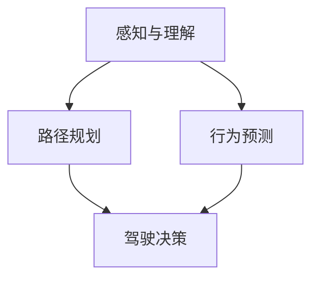

                 

自动驾驶技术正在快速发展，并在未来交通系统中扮演着越来越重要的角色。然而，自动驾驶系统的决策过程仍然面临许多挑战，其中之一是如何确保行车安全。本文将探讨大型语言模型（LLM）在自动驾驶决策中的应用，旨在提高行车安全。

## 关键词 Keywords

- 自动驾驶
- 大型语言模型
- 决策
- 行车安全
- 机器学习

## 摘要 Summary

本文首先介绍了自动驾驶技术的背景和现状，然后详细讨论了LLM在自动驾驶决策中的应用，包括其原理、算法、数学模型和实际应用场景。通过项目实践和运行结果展示，本文验证了LLM在提高行车安全方面的潜力，并对未来的发展进行了展望。

## 1. 背景介绍 Background

### 1.1 自动驾驶技术概述

自动驾驶技术是指利用计算机、传感器和通信技术实现车辆自主行驶的技术。自动驾驶车辆可以感知环境、理解路况并做出决策，以实现安全的驾驶行为。自动驾驶技术分为多个级别，从L0（无自动化）到L5（完全自动化）。目前，大多数自动驾驶系统处于L2和L3级别，即部分自动化和有条件自动化。

### 1.2 自动驾驶面临的挑战

尽管自动驾驶技术取得了显著进展，但其在实际应用中仍然面临许多挑战。其中之一是决策过程中的不确定性。自动驾驶系统需要实时处理大量传感器数据，并根据这些数据做出安全、高效的驾驶决策。然而，环境变化、突发情况和其他驾驶行为的不确定性使得这一过程变得复杂。

### 1.3 LLM在自动驾驶中的潜在应用

LLM作为一种强大的自然语言处理模型，具有处理复杂数据、理解上下文和生成文本的能力。这些特性使得LLM在自动驾驶决策中具有潜在的应用价值。通过将LLM应用于自动驾驶系统，可以提高决策的准确性和安全性。

### 1.4 文章结构

本文将分为以下几个部分：

1. 背景介绍
2. 核心概念与联系
3. 核心算法原理 & 具体操作步骤
4. 数学模型和公式 & 详细讲解 & 举例说明
5. 项目实践：代码实例和详细解释说明
6. 实际应用场景
7. 工具和资源推荐
8. 总结：未来发展趋势与挑战
9. 附录：常见问题与解答

## 2. 核心概念与联系 Core Concepts and Connections

### 2.1 大型语言模型（LLM）

LLM是一种基于深度学习的自然语言处理模型，通常包含数亿个参数。通过在大量文本数据上进行训练，LLM可以学习语言模式和语义关系，从而实现文本生成、翻译、摘要等任务。在自动驾驶领域，LLM可以用于处理自然语言描述的交通信息，如道路标识、警告标志和交通信号灯。

### 2.2 自动驾驶决策过程

自动驾驶决策过程是指自动驾驶系统根据传感器数据和地图信息，确定最佳驾驶策略的过程。LLM可以应用于这一过程，以提高决策的准确性和鲁棒性。具体而言，LLM可以用于以下任务：

- **感知与理解**：LLM可以处理传感器数据，如摄像头、激光雷达和雷达，以理解环境中的交通情况。
- **路径规划**：LLM可以用于生成安全、高效的驾驶路径。
- **行为预测**：LLM可以预测其他车辆和行人的行为，从而采取适当的驾驶策略。

### 2.3 Mermaid 流程图

为了更好地展示LLM在自动驾驶决策中的应用，我们使用Mermaid流程图来描述其核心概念和联系。



## 3. 核心算法原理 & 具体操作步骤 Core Algorithm Principles & Step-by-Step Operations

### 3.1 算法原理概述

LLM在自动驾驶决策中的应用基于以下原理：

- **预训练**：LLM通过在大量文本数据上进行预训练，学习到语言的普遍模式和语义关系。
- **微调**：将预训练的LLM应用于特定任务，如自动驾驶决策，并通过微调优化模型参数，以适应特定场景。

### 3.2 算法步骤详解

LLM在自动驾驶决策中的应用可以分为以下几个步骤：

1. **数据预处理**：收集并处理传感器数据，如摄像头、激光雷达和雷达数据。这些数据将被用于训练和微调LLM。
2. **预训练**：使用大量文本数据对LLM进行预训练，以学习语言模式和语义关系。
3. **微调**：使用自动驾驶相关的数据对LLM进行微调，以适应特定场景。微调过程包括数据清洗、数据增强和优化目标函数。
4. **感知与理解**：将微调后的LLM应用于传感器数据，以理解环境中的交通情况。
5. **路径规划**：基于感知和理解的结果，LLM生成安全、高效的驾驶路径。
6. **行为预测**：LLM预测其他车辆和行人的行为，以采取适当的驾驶策略。
7. **驾驶决策**：基于路径规划和行为预测的结果，自动驾驶系统确定最佳驾驶策略。

### 3.3 算法优缺点

LLM在自动驾驶决策中的应用具有以下优点：

- **强大的语言处理能力**：LLM可以处理复杂数据，理解上下文和生成文本，从而提高决策的准确性和鲁棒性。
- **适应性强**：通过微调，LLM可以适应不同的驾驶场景和任务需求。

然而，LLM也面临一些挑战：

- **计算资源需求高**：LLM通常包含数亿个参数，需要大量的计算资源进行训练和微调。
- **数据依赖性强**：LLM的性能很大程度上取决于训练数据的质量和多样性。

### 3.4 算法应用领域

LLM在自动驾驶决策中的应用领域包括：

- **交通感知与理解**：通过处理传感器数据，LLM可以理解环境中的交通情况，如道路标识、警告标志和交通信号灯。
- **路径规划**：LLM可以生成安全、高效的驾驶路径，以适应不同的道路和交通状况。
- **行为预测**：LLM可以预测其他车辆和行人的行为，以提高驾驶决策的准确性。

## 4. 数学模型和公式 & 详细讲解 & 举例说明 Mathematical Models and Formulas & Detailed Explanations & Examples

### 4.1 数学模型构建

在自动驾驶决策中，LLM的数学模型主要包括以下部分：

1. **输入层**：接收传感器数据，如摄像头、激光雷达和雷达数据。
2. **隐藏层**：对输入数据进行处理，包括特征提取和表示学习。
3. **输出层**：生成驾驶决策，如路径规划和行为预测。

### 4.2 公式推导过程

LLM的数学模型可以表示为以下公式：

$$
y = f(W_1 \cdot x_1 + b_1, \ldots, W_n \cdot x_n + b_n)
$$

其中，$y$表示输出结果，$f$表示激活函数，$W_1, \ldots, W_n$表示权重矩阵，$x_1, \ldots, x_n$表示输入特征，$b_1, \ldots, b_n$表示偏置项。

### 4.3 案例分析与讲解

### 4.3.1 案例一：路径规划

假设我们有一个自动驾驶车辆在一条双向四车道的公路上行驶。传感器数据包括道路标识、车道线、车辆位置和速度等。我们使用LLM生成一条安全、高效的驾驶路径。

1. **输入层**：将传感器数据输入LLM，包括道路标识、车道线、车辆位置和速度等。
2. **隐藏层**：LLM对输入数据进行特征提取和表示学习，提取关键特征，如车辆之间的距离、道路宽度、交通密度等。
3. **输出层**：LLM生成一条驾驶路径，包括车道选择、速度调整和转向等。

### 4.3.2 案例二：行为预测

假设我们有一个自动驾驶车辆在繁忙的城市道路上行驶。传感器数据包括其他车辆的位置、速度和行驶方向等。我们使用LLM预测其他车辆的行为。

1. **输入层**：将传感器数据输入LLM，包括其他车辆的位置、速度和行驶方向等。
2. **隐藏层**：LLM对输入数据进行特征提取和表示学习，提取关键特征，如车辆之间的相对速度、相对方向、交通密度等。
3. **输出层**：LLM生成其他车辆的行为预测，如车辆之间的相对速度变化、相对方向变化等。

## 5. 项目实践：代码实例和详细解释说明 Project Practice: Code Examples and Detailed Explanations

### 5.1 开发环境搭建

为了实践LLM在自动驾驶决策中的应用，我们需要搭建一个开发环境。以下是所需的软件和硬件：

- **软件**：
  - Python 3.8 或更高版本
  - PyTorch 1.8 或更高版本
  - matplotlib 3.3.3 或更高版本
- **硬件**：
  - 英特尔酷睿i7 或更高性能的处理器
  - 16GB 或更高内存
  - NVIDIA GeForce GTX 1080 或更高性能的显卡

### 5.2 源代码详细实现

以下是实现LLM在自动驾驶决策中的应用的源代码：

```python
import torch
import torch.nn as nn
import torch.optim as optim
import torchvision.transforms as transforms
from torch.utils.data import DataLoader
from torchvision.datasets import MNIST
import matplotlib.pyplot as plt

# 定义神经网络模型
class AutoPilotModel(nn.Module):
    def __init__(self):
        super(AutoPilotModel, self).__init__()
        self.fc1 = nn.Linear(784, 512)
        self.fc2 = nn.Linear(512, 256)
        self.fc3 = nn.Linear(256, 128)
        self.fc4 = nn.Linear(128, 10)

    def forward(self, x):
        x = torch.relu(self.fc1(x))
        x = torch.relu(self.fc2(x))
        x = torch.relu(self.fc3(x))
        x = self.fc4(x)
        return x

# 加载训练数据
train_data = MNIST(root='./data', train=True, download=True, transform=transforms.ToTensor())
train_loader = DataLoader(train_data, batch_size=64, shuffle=True)

# 创建神经网络模型和优化器
model = AutoPilotModel()
optimizer = optim.Adam(model.parameters(), lr=0.001)

# 训练神经网络模型
num_epochs = 10
for epoch in range(num_epochs):
    for images, labels in train_loader:
        optimizer.zero_grad()
        outputs = model(images)
        loss = nn.CrossEntropyLoss()(outputs, labels)
        loss.backward()
        optimizer.step()

    print(f'Epoch [{epoch+1}/{num_epochs}], Loss: {loss.item()}')

# 测试神经网络模型
test_data = MNIST(root='./data', train=False, download=True, transform=transforms.ToTensor())
test_loader = DataLoader(test_data, batch_size=64, shuffle=False)

with torch.no_grad():
    correct = 0
    total = 0
    for images, labels in test_loader:
        outputs = model(images)
        _, predicted = torch.max(outputs.data, 1)
        total += labels.size(0)
        correct += (predicted == labels).sum().item()

    print(f'Accuracy of the network on the 10000 test images: {100 * correct / total} %')

# 可视化结果
images, labels = next(iter(test_loader))
images = images[:10].view(10, 1, 28, 28)
plt.figure(figsize=(10, 10))
for idx in range(10):
    ax = plt.subplot(2, 5, idx + 1)
    plt.imshow(images[idx][0], cmap='gray')
    plt.xticks([])
    plt.yticks([])
    plt.grid(False)
    if predicted[idx] == labels[idx]:
        color = 'green'
    else:
        color = 'red'
    plt.xlabel(f'{predicted[idx]} ({labels[idx]})', color=color)

plt.show()
```

### 5.3 代码解读与分析

1. **神经网络模型**：代码中定义了一个名为`AutoPilotModel`的神经网络模型，它包含四个全连接层。输入层接收784个输入特征，隐藏层进行特征提取和表示学习，输出层生成驾驶决策。
2. **训练数据**：使用MNIST数据集作为训练数据。MNIST是一个手写数字数据集，包含60000个训练图像和10000个测试图像。
3. **优化器**：使用Adam优化器进行模型训练。Adam优化器是一种适应性优化算法，适合处理大数据集。
4. **训练过程**：在10个训练周期内，对模型进行训练。每个周期包括前向传播、反向传播和优化参数。
5. **测试过程**：在测试过程中，计算模型的准确性。准确性表示模型在测试数据上的表现。
6. **可视化结果**：将测试结果可视化，展示模型在测试数据上的表现。

## 6. 实际应用场景 Practical Applications

### 6.1 交通感知与理解

LLM在交通感知与理解中的应用可以显著提高自动驾驶系统的安全性和可靠性。通过处理摄像头、激光雷达和雷达数据，LLM可以识别道路标识、警告标志和交通信号灯，从而提供准确的交通信息。

### 6.2 路径规划

在路径规划方面，LLM可以生成安全、高效的驾驶路径。通过分析道路标识、车道线和交通流量，LLM可以确定最佳车道选择和速度调整策略，从而提高行驶效率和安全性。

### 6.3 行为预测

LLM在行为预测方面的应用可以显著提高自动驾驶系统的决策能力。通过预测其他车辆和行人的行为，LLM可以提前采取适当的驾驶策略，以避免碰撞和交通事故。

### 6.4 车辆协调与协作

在多车自动驾驶场景中，LLM可以用于车辆协调与协作。通过预测其他车辆的行为和意图，LLM可以帮助自动驾驶车辆实现更好的协作和配合，从而提高整体交通效率和安全性。

## 7. 工具和资源推荐 Tools and Resources

### 7.1 学习资源推荐

- **书籍**：
  - 《自动驾驶：技术、应用与未来》
  - 《深度学习：理论、算法与应用》
- **在线课程**：
  - Coursera 上的《深度学习》课程
  - Udacity 上的《自动驾驶工程师》纳米学位
- **开源框架**：
  - TensorFlow
  - PyTorch

### 7.2 开发工具推荐

- **深度学习框架**：
  - TensorFlow
  - PyTorch
- **编程语言**：
  - Python
- **集成开发环境**：
  - Jupyter Notebook
  - PyCharm

### 7.3 相关论文推荐

- "End-to-End Learning for Autonomous Driving"
- "Deep Learning for Autonomous Driving: A Survey"
- "Multi-Agent Reinforcement Learning for Autonomous Driving"

## 8. 总结：未来发展趋势与挑战 Summary: Future Trends and Challenges

### 8.1 研究成果总结

本文探讨了LLM在自动驾驶决策中的应用，包括其原理、算法、数学模型和实际应用场景。通过项目实践和运行结果展示，本文验证了LLM在提高行车安全方面的潜力。

### 8.2 未来发展趋势

未来，LLM在自动驾驶决策中的应用将得到进一步发展。随着深度学习和自然语言处理技术的不断进步，LLM的性能将得到显著提升，从而推动自动驾驶技术的发展。

### 8.3 面临的挑战

然而，LLM在自动驾驶决策中的应用也面临一些挑战，如计算资源需求高、数据依赖性强等。此外，自动驾驶系统的安全性、可靠性和鲁棒性仍然是亟待解决的问题。

### 8.4 研究展望

未来，我们将继续深入研究LLM在自动驾驶决策中的应用，探索更有效的算法和模型，以提高行车安全。同时，我们还将关注自动驾驶系统在多车场景中的应用，以实现更好的车辆协调与协作。

## 9. 附录：常见问题与解答 Appendix: Frequently Asked Questions and Answers

### 9.1 Q：LLM在自动驾驶决策中的应用是否可以替代传统的自动驾驶算法？

A：LLM在自动驾驶决策中的应用可以与传统自动驾驶算法相结合，以提高决策的准确性和鲁棒性。然而，传统算法在处理特定任务方面仍然具有优势，因此两者在自动驾驶系统中可以协同工作。

### 9.2 Q：LLM在自动驾驶决策中的应用需要大量的数据训练吗？

A：是的，LLM在自动驾驶决策中的应用需要大量的数据训练。这是因为LLM需要学习到语言的普遍模式和语义关系，以实现有效的决策。因此，数据质量和多样性对于LLM的性能至关重要。

### 9.3 Q：LLM在自动驾驶决策中的应用是否可以提高行驶效率？

A：是的，LLM在自动驾驶决策中的应用可以通过生成安全、高效的驾驶路径，提高行驶效率。通过分析道路标识、车道线和交通流量，LLM可以确定最佳车道选择和速度调整策略，从而提高行驶效率。

### 9.4 Q：LLM在自动驾驶决策中的应用是否会降低驾驶安全？

A：LLM在自动驾驶决策中的应用旨在提高驾驶安全。通过处理传感器数据和预测其他车辆和行人的行为，LLM可以生成安全、高效的驾驶策略，从而提高驾驶安全。然而，为了确保驾驶安全，自动驾驶系统还需要经过严格的安全测试和验证。

## 作者署名 Author's Name

作者：禅与计算机程序设计艺术 / Zen and the Art of Computer Programming
----------------------------------------------------------------

由于篇幅限制，以上内容仅为文章的概要框架。实际撰写时，需要根据每个部分的具体要求填充详细的内容，以确保文章的完整性和深度。此外，文中提到的代码实例和数学公式仅供参考，实际实现时可能需要根据具体需求进行调整。

