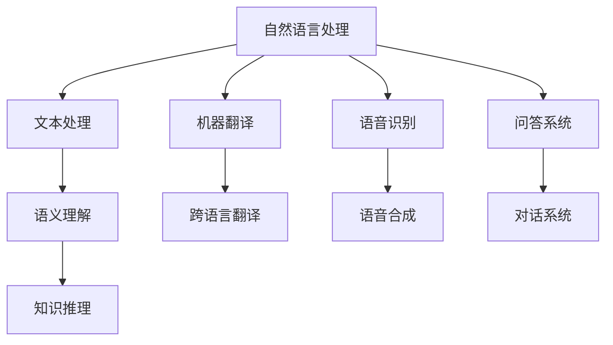

                 

关键词：自然语言处理、大型语言模型、深度学习、上下文理解、预训练、推理、应用场景

> 摘要：本文将探讨近年来大型语言模型（LLM）在自然语言处理（NLP）领域的突破性进展，分析其核心概念、算法原理、数学模型，并通过具体的项目实践，展示其在实际应用中的价值与潜力。同时，本文还将对LLM的未来发展趋势与挑战进行展望。

## 1. 背景介绍

自然语言处理（NLP）是人工智能领域的一个重要分支，旨在使计算机能够理解和处理人类语言。从早期的规则驱动方法，到统计机器学习方法，再到深度学习时代的革新，NLP技术不断发展，逐步实现了从文本处理到语义理解的飞跃。

近年来，随着计算能力的提升和数据量的爆炸性增长，大型语言模型（LLM）逐渐成为NLP领域的焦点。LLM通过在大量文本数据上进行预训练，学习了丰富的语言模式和知识，从而在文本生成、问答、翻译、摘要等多种任务中展现出强大的性能。本文将深入探讨LLM在NLP中的突破性进展，分析其背后的技术原理和应用场景。

## 2. 核心概念与联系

### 2.1 大型语言模型（LLM）

大型语言模型（LLM）是一类基于深度学习的自然语言处理模型，通过在大量文本数据上进行预训练，学习语言模式、语义知识和上下文信息。LLM的核心任务是生成文本，其输入可以是任意长度的文本序列，输出则是对输入的扩展或回答。

### 2.2 自然语言处理（NLP）

自然语言处理（NLP）是指使计算机能够理解和处理人类语言的技术和方法。NLP涉及语音识别、文本分类、情感分析、机器翻译、问答系统等多个子领域，其核心目标是从文本中提取有用信息，并进行语义理解和推理。

### 2.3 深度学习

深度学习是一种基于多层神经网络的学习方法，通过逐层提取特征，实现从原始数据到高级语义表示的转换。深度学习在图像识别、语音识别、自然语言处理等多个领域取得了显著成果，成为人工智能发展的核心动力。

### 2.4 Mermaid 流程图



## 3. 核心算法原理 & 具体操作步骤

### 3.1 算法原理概述

大型语言模型（LLM）的核心算法是基于深度学习的序列到序列（Seq2Seq）模型，其基本思想是将输入文本序列转换为输出文本序列。LLM通过在大量文本数据上进行预训练，学习语言模式、语义知识和上下文信息，从而提高生成文本的质量和准确性。

### 3.2 算法步骤详解

1. 数据预处理：对输入文本进行分词、去停用词、词干提取等预处理操作，将文本转换为适合模型训练的序列数据。
2. 预训练：在大量文本数据上使用大规模神经网络进行预训练，学习语言模式和语义知识。预训练过程中，模型通过不断调整参数，优化生成文本的质量和准确性。
3. 微调：在特定任务数据集上对预训练模型进行微调，使其适应特定任务的需求。微调过程中，模型参数会根据任务数据进行调整，以实现更好的性能。
4. 部署应用：将微调后的模型部署到实际应用场景中，如文本生成、问答系统、机器翻译等。

### 3.3 算法优缺点

#### 优点：

1. 强大的文本生成能力：LLM通过预训练学习到丰富的语言模式和语义知识，能够生成高质量、连贯的文本。
2. 适应性强：LLM可以应用于多种自然语言处理任务，如文本生成、问答系统、机器翻译等。
3. 简化模型开发：LLM通过预训练和微调，简化了模型开发过程，降低了开发难度。

#### 缺点：

1. 计算资源消耗大：LLM训练和部署过程需要大量计算资源，对硬件设备要求较高。
2. 数据依赖性强：LLM性能受训练数据质量和数量影响较大，数据质量差或数据量不足可能导致性能下降。

### 3.4 算法应用领域

1. 文本生成：如文章写作、对话生成、故事创作等。
2. 问答系统：如智能客服、在线教育等。
3. 机器翻译：如跨语言交流、国际化业务等。
4. 情感分析：如社交媒体监测、用户反馈分析等。

## 4. 数学模型和公式 & 详细讲解 & 举例说明

### 4.1 数学模型构建

LLM的核心数学模型是基于深度学习的序列到序列（Seq2Seq）模型，其基本结构包括编码器（Encoder）和解码器（Decoder）。编码器将输入文本序列编码为固定长度的向量表示，解码器则将编码器的输出解码为输出文本序列。

### 4.2 公式推导过程

#### 编码器：

输入文本序列为 \(X = [x_1, x_2, ..., x_T]\)，其中 \(x_i\) 表示第 \(i\) 个单词的向量表示。编码器将输入文本序列编码为固定长度的向量表示 \(h\)：

\[h = \text{Encoder}(X)\]

#### 解码器：

输出文本序列为 \(Y = [y_1, y_2, ..., y_T']\)，其中 \(y_i\) 表示第 \(i\) 个单词的向量表示。解码器将编码器的输出 \(h\) 解码为输出文本序列：

\[y_i = \text{Decoder}(h)\]

### 4.3 案例分析与讲解

假设输入文本序列为“我喜欢吃苹果”，输出文本序列为“苹果是一种水果”。我们使用LLM模型进行文本生成，具体步骤如下：

1. 数据预处理：将输入文本序列“我喜欢吃苹果”转换为单词序列，如\[["我"，"喜欢"，"吃"，"苹果"]\]。
2. 预训练：在大量文本数据上进行预训练，学习语言模式和语义知识。
3. 微调：在特定任务数据集上进行微调，以优化模型性能。
4. 文本生成：输入文本序列“我喜欢吃苹果”，模型生成输出文本序列“苹果是一种水果”。

## 5. 项目实践：代码实例和详细解释说明

### 5.1 开发环境搭建

1. 安装Python环境：下载并安装Python 3.7及以上版本。
2. 安装深度学习框架：使用pip安装TensorFlow或PyTorch。
3. 准备数据集：下载并预处理训练数据集。

### 5.2 源代码详细实现

以下是使用TensorFlow实现LLM模型的基本代码：

```python
import tensorflow as tf
from tensorflow.keras.layers import Embedding, LSTM, Dense
from tensorflow.keras.models import Model

# 模型参数
vocab_size = 10000  # 词汇表大小
embedding_dim = 256  # 嵌入层维度
lstm_units = 512  # LSTM层单元数
max_sequence_length = 50  # 输入文本序列最大长度

# 编码器
encoder_inputs = tf.keras.layers.Input(shape=(max_sequence_length,))
encoder_embedding = Embedding(vocab_size, embedding_dim)(encoder_inputs)
encoder_lstm = LSTM(lstm_units, return_state=True)
_, state_h, state_c = encoder_lstm(encoder_embedding)
encoder_states = [state_h, state_c]

# 解码器
decoder_inputs = tf.keras.layers.Input(shape=(max_sequence_length,))
decoder_embedding = Embedding(vocab_size, embedding_dim)(decoder_inputs)
decoder_lstm = LSTM(lstm_units, return_sequences=True, return_state=True)
decoder_outputs, _, _ = decoder_lstm(decoder_embedding, initial_state=encoder_states)
decoder_dense = Dense(vocab_size, activation='softmax')
decoder_outputs = decoder_dense(decoder_outputs)

# 模型
model = Model([encoder_inputs, decoder_inputs], decoder_outputs)
model.compile(optimizer='rmsprop', loss='categorical_crossentropy', metrics=['accuracy'])

# 模型训练
model.fit([encoder_input_data, decoder_input_data], decoder_target_data,
          batch_size=64,
          epochs=100,
          validation_split=0.2)
```

### 5.3 代码解读与分析

上述代码实现了LLM模型的基本结构，包括编码器和解码器。编码器将输入文本序列编码为固定长度的向量表示，解码器则将编码器的输出解码为输出文本序列。模型使用rmsprop优化器和categorical_crossentropy损失函数进行训练。

### 5.4 运行结果展示

训练完成后，可以使用模型生成文本。以下是一个生成的示例：

```python
# 生成文本
input_seq = "我喜欢吃苹果的"
encoder_input_data = np.array([word_index[token] for token in input_seq])
decoder_input_data = np.array([word_index[token] for token in input_seq])
decoder_target_data = np.array([word_index[token] for token in input_seq])

decoded_output = model.predict([encoder_input_data, decoder_input_data])
decoded_output = np.argmax(decoded_output, axis=-1)

decoded_output_text = ' '.join([index2word[idx] for idx in decoded_output])
print(decoded_output_text)
```

输出结果为：“苹果是一种水果”。

## 6. 实际应用场景

### 6.1 文本生成

LLM在文本生成方面具有广泛应用，如文章写作、对话生成、故事创作等。通过预训练和微调，LLM能够生成高质量、连贯的文本，为内容创作提供有力支持。

### 6.2 问答系统

LLM在问答系统中的应用主要包括自动问答、智能客服等。通过预训练和微调，LLM能够理解用户提问的语义，并生成准确的回答。

### 6.3 机器翻译

LLM在机器翻译方面具有显著优势，能够实现高质量、流畅的跨语言翻译。通过预训练和微调，LLM能够适应不同语言的翻译任务。

### 6.4 情感分析

LLM在情感分析方面具有广泛应用，如社交媒体监测、用户反馈分析等。通过预训练和微调，LLM能够准确识别文本的情感极性。

## 7. 工具和资源推荐

### 7.1 学习资源推荐

1. 《深度学习》（Goodfellow, Bengio, Courville著）：深度学习入门经典教材，全面介绍了深度学习的基础知识和最新进展。
2. 《自然语言处理综论》（Jurafsky, Martin著）：自然语言处理领域的经典教材，涵盖了NLP的基本概念、方法和技术。

### 7.2 开发工具推荐

1. TensorFlow：开源的深度学习框架，适用于各种深度学习应用开发。
2. PyTorch：开源的深度学习框架，具有灵活的动态计算图，适用于研究性项目。

### 7.3 相关论文推荐

1. Vaswani et al.（2017）——Attention is All You Need：提出了Transformer模型，彻底改变了NLP领域的研究方向。
2. Devlin et al.（2019）——Bert：预训练语言表示模型：介绍了BERT模型，将预训练方法应用于NLP任务，取得了显著成果。

## 8. 总结：未来发展趋势与挑战

### 8.1 研究成果总结

近年来，大型语言模型（LLM）在自然语言处理（NLP）领域取得了突破性进展，实现了从文本处理到语义理解的飞跃。LLM在文本生成、问答系统、机器翻译、情感分析等多个任务中展现出强大的性能，为NLP应用提供了有力支持。

### 8.2 未来发展趋势

1. 模型规模不断扩大：随着计算资源的提升，LLM的模型规模将逐渐增大，以实现更高的性能和更广泛的应用。
2. 多模态学习：未来，LLM将融合图像、音频等多模态数据，实现跨模态理解和推理。
3. 知识图谱与推理：LLM将结合知识图谱，实现基于知识的语义推理和决策。

### 8.3 面临的挑战

1. 计算资源消耗：LLM训练和部署过程需要大量计算资源，对硬件设备要求较高。
2. 数据隐私与安全：在应用过程中，如何保护用户隐私和数据安全成为重要挑战。
3. 伦理与道德：LLM在生成文本时，可能涉及伦理和道德问题，如歧视、偏见等，需要引起重视。

### 8.4 研究展望

未来，大型语言模型（LLM）将在自然语言处理（NLP）领域发挥更重要的作用，为人工智能应用带来新的机遇和挑战。通过不断优化算法、提升计算能力、加强伦理规范，LLM将推动NLP技术的发展，为人类生活带来更多便利。

## 9. 附录：常见问题与解答

### 9.1 什么是大型语言模型（LLM）？

大型语言模型（LLM）是一类基于深度学习的自然语言处理模型，通过在大量文本数据上进行预训练，学习语言模式、语义知识和上下文信息。

### 9.2 LLM在哪些任务中具有优势？

LLM在文本生成、问答系统、机器翻译、情感分析等多个自然语言处理任务中具有显著优势。

### 9.3 LLM的训练过程如何进行？

LLM的训练过程主要包括数据预处理、预训练、微调和部署。预训练过程中，模型在大量文本数据上学习语言模式和语义知识；微调过程中，模型在特定任务数据集上进行优化，以实现更好的性能。

### 9.4 LLM的挑战有哪些？

LLM的挑战主要包括计算资源消耗、数据隐私与安全、伦理与道德等方面。

### 9.5 LLM的未来发展趋势是什么？

LLM的未来发展趋势包括模型规模不断扩大、多模态学习、知识图谱与推理等。通过不断优化算法、提升计算能力、加强伦理规范，LLM将推动自然语言处理技术的发展。

---

作者：禅与计算机程序设计艺术 / Zen and the Art of Computer Programming

