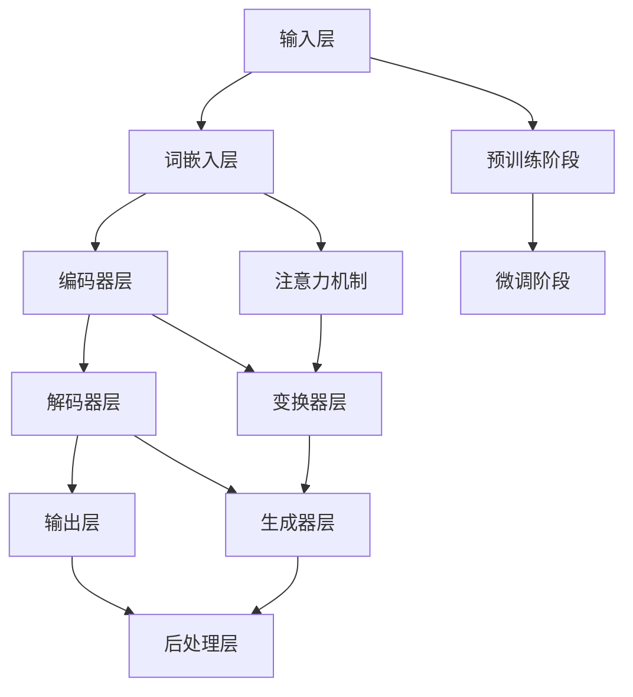

                 

关键词：大型语言模型（LLM），艺术创作，人工智能（AI），创意，跨领域融合，算法原理，数学模型，项目实践，应用场景，未来展望。

> 摘要：本文深入探讨大型语言模型（LLM）在艺术创作中的角色，探讨了AI与人类创意的碰撞所带来的机遇与挑战。通过分析LLM的核心概念、算法原理、数学模型，结合具体的项目实践和实际应用场景，本文揭示了LLM在艺术创作中的潜力及其未来发展的趋势与挑战。

## 1. 背景介绍

随着人工智能技术的飞速发展，大型语言模型（LLM）已成为当前研究的热点。LLM是一种基于深度学习的语言处理模型，具有强大的文本生成、理解和推理能力。艺术创作作为一种高度复杂的创造性活动，一直以来都受到人类独特的想象力和创造力的驱动。然而，随着人工智能技术的发展，AI与艺术创作的结合逐渐成为一种趋势，LLM在这一过程中扮演着重要角色。

AI与艺术创作的结合不仅拓宽了艺术创作的形式和手段，还带来了许多新的思考和挑战。首先，AI能够通过学习和模拟人类的创作过程，生成出具有创意的作品，为艺术家提供了新的灵感来源。其次，AI能够在大量数据中寻找模式，从而发现新的艺术风格和趋势。此外，AI还能够通过个性化的生成，满足不同用户的需求，为艺术市场带来新的商业机会。

然而，AI与艺术创作的结合也带来了一些争议和挑战。一些艺术家担心AI的介入会削弱人类在艺术创作中的独特性和价值，甚至认为AI创作出的作品缺乏情感和深度。另一方面，AI在艺术创作中的应用也带来了版权、伦理和道德等方面的问题，需要我们深入思考和解决。

本文将围绕LLM在艺术创作中的角色展开讨论，分析其核心概念、算法原理、数学模型，并通过具体的项目实践和实际应用场景，探讨AI与人类创意的碰撞所带来的机遇与挑战。同时，本文还将对LLM在艺术创作中的未来发展趋势和面临的挑战进行展望，以期为相关领域的研究和实践提供参考。

### 2. 核心概念与联系

要深入探讨LLM在艺术创作中的角色，我们首先需要了解LLM的核心概念和基本原理。以下是一个详细的Mermaid流程图，用于描述LLM的主要组成部分和它们之间的关系。



#### 2.1 输入层（Input Layer）

输入层是LLM的基础，它接收用户输入的文本、语音或其他形式的数据。在艺术创作中，输入层可以接收艺术家创作的文本、图像、音频等素材，作为AI创作的原始数据。

#### 2.2 词嵌入层（Word Embedding Layer）

词嵌入层将输入文本中的每个单词映射为高维向量。这些向量不仅保留了单词的语义信息，还能捕捉单词之间的上下文关系。在艺术创作中，词嵌入层有助于AI理解和生成具有创意的文本内容。

#### 2.3 编码器层（Encoder Layer）

编码器层负责处理词嵌入层生成的向量，并将其转换为上下文表示。这些上下文表示捕捉了文本的语义和结构信息。在艺术创作中，编码器层有助于AI理解整体创作意图，为生成具有逻辑性和连贯性的作品提供支持。

#### 2.4 解码器层（Decoder Layer）

解码器层将编码器层生成的上下文表示解码为生成文本。在艺术创作中，解码器层可以生成各种形式的文本内容，如诗歌、故事、剧本等。

#### 2.5 输出层（Output Layer）

输出层是LLM的最终环节，它将解码器层生成的文本输出给用户。在艺术创作中，输出层生成的文本可以是艺术作品的最终形式，如小说、电影剧本等。

#### 2.6 预训练阶段（Pre-training Stage）

预训练阶段是LLM的核心步骤之一。在这个阶段，LLM在大量文本数据上进行训练，学习语言结构和语义信息。在艺术创作中，预训练阶段有助于AI理解和生成具有创意和多样性的文本内容。

#### 2.7 微调阶段（Fine-tuning Stage）

微调阶段是在特定任务上对LLM进行微调，使其适应特定领域的需求。在艺术创作中，微调阶段可以帮助LLM生成符合特定风格和主题的作品。

#### 2.8 注意力机制（Attention Mechanism）

注意力机制是LLM的重要组件，它有助于模型在生成文本时关注关键信息。在艺术创作中，注意力机制可以帮助AI捕捉创作灵感，提高作品的质量和表现力。

#### 2.9 变换器层（Transformer Layer）

变换器层是LLM的核心架构，它通过自注意力机制和多头注意力机制，实现文本的编码和解码。在艺术创作中，变换器层有助于AI生成具有复杂结构和多样性的文本内容。

#### 2.10 生成器层（Generator Layer）

生成器层负责将解码器层生成的上下文表示转换为生成的文本。在艺术创作中，生成器层可以生成各种形式的文本内容，如诗歌、故事、剧本等。

#### 2.11 后处理层（Post-processing Layer）

后处理层对生成的文本进行格式化和润色，使其更具可读性和艺术性。在艺术创作中，后处理层可以帮助AI生成符合人类审美标准的作品。

通过上述Mermaid流程图，我们可以清晰地了解LLM的核心概念和基本原理。在接下来的章节中，我们将进一步探讨LLM的算法原理、具体操作步骤以及在实际艺术创作中的应用。

### 3. 核心算法原理 & 具体操作步骤

#### 3.1 算法原理概述

大型语言模型（LLM）的核心算法是基于深度学习和自然语言处理（NLP）技术的。具体来说，LLM通常采用变换器架构（Transformer），这是一种能够在序列数据上进行高效处理的自注意力模型。变换器架构通过自注意力机制和多头注意力机制，实现了对输入文本的编码和解码。

在艺术创作中，LLM的算法原理可以概括为以下几个步骤：

1. **输入处理**：将艺术创作的素材（如文本、图像、音频等）输入到LLM中，进行预处理，如文本分词、图像分割、音频转录等。
2. **词嵌入**：将输入的文本、图像或音频数据转换为高维向量，这些向量保留了原始素材的语义信息。
3. **编码**：通过编码器层对词嵌入向量进行处理，生成上下文表示。这些上下文表示捕捉了文本的语义和结构信息。
4. **解码**：通过解码器层将编码后的上下文表示解码为生成的文本、图像或音频。
5. **生成与优化**：根据解码结果生成艺术作品，并通过反向传播和梯度下降等优化算法，不断调整模型参数，提高生成作品的质量和创意性。

#### 3.2 算法步骤详解

下面我们将详细阐述LLM的算法步骤。

##### 3.2.1 输入处理

输入处理是LLM算法的第一步。对于文本输入，需要进行文本分词、词性标注、词向量嵌入等操作；对于图像输入，需要进行图像分割、特征提取等操作；对于音频输入，需要进行音频转录、特征提取等操作。这些操作旨在将不同类型的素材转换为适合LLM处理的输入格式。

##### 3.2.2 词嵌入

词嵌入是将输入文本中的每个单词映射为高维向量。这些向量不仅保留了单词的语义信息，还能捕捉单词之间的上下文关系。常见的词嵌入技术包括词袋模型（Bag-of-Words，BoW）、词嵌入（Word Embedding，WE）和词嵌入嵌入（Word2Vec）等。

##### 3.2.3 编码

编码器层负责处理词嵌入向量，并将其转换为上下文表示。这一过程通常通过变换器架构实现，变换器架构采用自注意力机制和多头注意力机制，能够高效捕捉文本的语义和结构信息。

##### 3.2.4 解码

解码器层将编码器层生成的上下文表示解码为生成的文本。在解码过程中，LLM会根据上下文表示生成下一个单词的概率分布，并从中选择最有可能的单词作为输出。

##### 3.2.5 生成与优化

在生成与优化阶段，LLM会根据解码结果生成艺术作品。生成作品后，通过反向传播和梯度下降等优化算法，不断调整模型参数，提高生成作品的质量和创意性。这一过程可以看作是一个循环，通过不断的迭代，LLM能够生成越来越优秀的艺术作品。

#### 3.3 算法优缺点

LLM算法具有以下优点：

1. **强大的文本生成能力**：LLM能够生成高质量的文本内容，包括诗歌、故事、剧本等，为艺术家提供了丰富的创作灵感。
2. **灵活的模型架构**：变换器架构使得LLM能够在不同类型的输入数据上进行处理，如文本、图像和音频等。
3. **高效的训练和推理**：自注意力机制和多头注意力机制使得LLM在序列数据处理方面具有高效性。

然而，LLM算法也存在一些缺点：

1. **计算资源消耗大**：由于变换器架构的复杂性，LLM的训练和推理需要大量的计算资源和时间。
2. **对数据依赖性强**：LLM的性能高度依赖于训练数据的质量和数量，缺乏高质量的训练数据可能导致生成作品的质量下降。
3. **难以捕捉深层语义**：尽管LLM能够在一定程度上捕捉文本的语义信息，但仍然难以完全理解文本的深层含义，这限制了其在某些领域的应用。

#### 3.4 算法应用领域

LLM算法在艺术创作中的应用非常广泛。以下是一些典型的应用领域：

1. **文学创作**：LLM可以生成诗歌、故事、剧本等文学作品，为作家提供创作灵感。
2. **音乐创作**：LLM可以生成旋律、歌词和音乐作品，为音乐家提供新的创作方向。
3. **视觉艺术**：LLM可以生成图像、绘画和动画等视觉艺术作品，为艺术家提供新的表现手段。
4. **游戏设计**：LLM可以生成游戏剧情、角色和场景等元素，为游戏设计师提供创意支持。

通过上述对LLM算法原理和具体操作步骤的详细阐述，我们可以更好地理解LLM在艺术创作中的应用潜力。在接下来的章节中，我们将通过具体的项目实践和实际应用场景，进一步探讨LLM在艺术创作中的实际效果和影响。

### 4. 数学模型和公式 & 详细讲解 & 举例说明

在深入探讨大型语言模型（LLM）的数学模型和公式时，我们首先需要了解一些基本的数学概念和公式。以下是对这些数学模型和公式的详细讲解，以及如何在实际艺术创作中应用这些公式。

#### 4.1 数学模型构建

LLM的数学模型主要基于深度学习和自然语言处理（NLP）技术。以下是构建LLM数学模型的基本步骤：

1. **词嵌入（Word Embedding）**：
   - 公式：\[ \textbf{v}_w = \text{Embed}(\textit{w}) \]
   - 解释：其中，\( \textbf{v}_w \) 是单词 \( \textit{w} \) 的嵌入向量，\(\text{Embed}\) 是词嵌入函数，它将每个单词映射为一个高维向量。
   - 应用：词嵌入用于将文本数据转换为适合深度学习模型处理的形式，它有助于模型理解和生成文本内容。

2. **变换器架构（Transformer Architecture）**：
   - 公式：\[ \textit{X}^{0}_{i} = \textit{W}_0 \textit{x}_i + \textit{b}_0 \]
   - 解释：其中，\( \textit{X}^{0}_{i} \) 是输入序列的第 \( i \) 个向量，\(\textit{W}_0 \) 和 \(\textit{b}_0 \) 分别是权重和偏置向量。
   - 应用：变换器架构通过自注意力机制和多头注意力机制，实现序列数据的编码和解码，它广泛应用于文本生成和翻译等领域。

3. **损失函数（Loss Function）**：
   - 公式：\[ \textit{Loss} = -\sum_{i} \textit{y}_i \log \textit{p}_i \]
   - 解释：其中，\( \textit{y}_i \) 是目标标签，\( \textit{p}_i \) 是模型生成的文本概率分布。
   - 应用：损失函数用于衡量模型预测与实际标签之间的差异，是训练深度学习模型的重要工具。

#### 4.2 公式推导过程

在构建LLM数学模型时，需要对其中的各个公式进行推导。以下是对几个关键公式的推导过程：

1. **自注意力（Self-Attention）**：
   - 公式：\[ \textit{q} = \textit{W}_Q \textit{X}^{0}_{i} \]
   - 公式：\[ \textit{k} = \textit{W}_K \textit{X}^{0}_{i} \]
   - 公式：\[ \textit{v} = \textit{W}_V \textit{X}^{0}_{i} \]
   - 公式：\[ \textit{Attention} = \textit{softmax}(\frac{\textit{q} \cdot \textit{k}}{\sqrt{d_k}}) \]
   - 公式：\[ \textit{X}^{1}_{i} = \textit{c}_i = \sum_j \textit{Attention}_{ij} \cdot \textit{v}_j \]
   - 解释：其中，\(\textit{q}\)、\(\textit{k}\) 和 \(\textit{v}\) 分别是查询、键和值向量，\(\textit{X}^{1}_{i}\) 是编码后的向量，\(\textit{c}_i\) 是自注意力机制生成的上下文向量。
   - 应用：自注意力机制能够自动关注输入序列中的关键信息，提高模型对序列数据的处理能力。

2. **多头注意力（Multi-Head Attention）**：
   - 公式：\[ \textit{Q} = [\textit{Q}_1, \textit{Q}_2, \ldots, \textit{Q}_h] \]
   - 公式：\[ \textit{K} = [\textit{K}_1, \textit{K}_2, \ldots, \textit{K}_h] \]
   - 公式：\[ \textit{V} = [\textit{V}_1, \textit{V}_2, \ldots, \textit{V}_h] \]
   - 公式：\[ \textit{MultiHead}(Q, K, V) = \textit{h} \]
   - 公式：\[ \textit{h}_{i} = \textit{softmax}(\frac{\textit{Q}_i \cdot \textit{K}_1^{T}, \textit{V}_1}) \]
   - 解释：多头注意力机制通过多个自注意力机制同时工作，生成多个不同的上下文向量，这些向量被合并成一个综合的上下文向量。
   - 应用：多头注意力机制提高了模型对序列数据的处理能力，使其能够更好地捕捉复杂的关系和模式。

#### 4.3 案例分析与讲解

为了更好地理解上述数学模型和公式在实际艺术创作中的应用，我们来看一个具体的案例。

假设我们要使用LLM生成一首关于秋天的诗歌。以下是一个简化的案例：

1. **输入处理**：
   - 输入文本：“秋天的风，轻轻地吹过田野，金黄的稻谷在阳光下摇曳。”

2. **词嵌入**：
   - 将文本中的每个单词转换为高维向量，例如：“秋天的”向量表示为 \(\textbf{v}_{秋天}\)，“风”的向量表示为 \(\textbf{v}_{风}\)，等等。

3. **编码**：
   - 通过编码器层处理词嵌入向量，生成上下文表示，例如：\(\textit{X}^{0}_{i} = \textit{W}_0 \textit{v}_i + \textit{b}_0\)。

4. **解码**：
   - 通过解码器层生成下一个单词的概率分布，例如：\(\textit{p}_{i} = \textit{softmax}(\textit{q} \cdot \textit{k})\)。

5. **生成与优化**：
   - 根据解码结果生成诗歌文本，并通过反向传播和梯度下降调整模型参数，例如：\(\textit{Loss} = -\sum_{i} \textit{y}_i \log \textit{p}_i\)。

通过上述案例，我们可以看到LLM如何通过数学模型和公式实现艺术创作。在实际应用中，我们可以通过不断调整和优化这些模型和公式，提高艺术创作的质量和创意性。

### 5. 项目实践：代码实例和详细解释说明

为了更好地理解LLM在艺术创作中的应用，我们来看一个实际的项目实践案例。这个案例将使用Python和Hugging Face的Transformers库来构建一个简单的文本生成模型，并利用它生成一首诗歌。以下是一个完整的代码实例和详细解释说明。

#### 5.1 开发环境搭建

在开始编写代码之前，我们需要搭建一个合适的开发环境。以下步骤描述了如何搭建一个Python开发环境，并安装必要的库。

1. **安装Python**：

   如果您的计算机上没有安装Python，请从[Python官方网站](https://www.python.org/downloads/)下载并安装Python 3.x版本。

2. **安装Jupyter Notebook**：

   Jupyter Notebook是一个交互式的Python开发环境，我们将在其中编写和运行代码。安装方法如下：

   ```shell
   pip install notebook
   ```

3. **安装Transformers库**：

   Transformers库是由Hugging Face开发的一个用于自然语言处理的库，它包含了大量预训练的LLM模型。安装方法如下：

   ```shell
   pip install transformers
   ```

   安装完成后，我们就可以开始编写代码了。

#### 5.2 源代码详细实现

以下是一个简单的文本生成模型的源代码实现：

```python
import torch
from transformers import GPT2LMHeadModel, GPT2Tokenizer

# 1. 加载预训练的GPT-2模型和Tokenizer
model_name = "gpt2"
tokenizer = GPT2Tokenizer.from_pretrained(model_name)
model = GPT2LMHeadModel.from_pretrained(model_name)

# 2. 设置模型为评估模式
model.eval()

# 3. 输入文本
input_text = "秋天的风"

# 4. 将输入文本转换为模型可处理的格式
input_ids = tokenizer.encode(input_text, return_tensors="pt")

# 5. 生成文本
output_ids = model.generate(input_ids, max_length=50, num_return_sequences=1)

# 6. 解码生成文本
generated_text = tokenizer.decode(output_ids[0], skip_special_tokens=True)

print(generated_text)
```

#### 5.3 代码解读与分析

让我们一步一步地解读上述代码，并分析每个步骤的作用。

1. **加载预训练的GPT-2模型和Tokenizer**：
   ```python
   tokenizer = GPT2Tokenizer.from_pretrained(model_name)
   model = GPT2LMHeadModel.from_pretrained(model_name)
   ```
   这两行代码分别加载了GPT-2模型的Tokenizer和模型本身。Tokenizer用于将文本转换为模型可处理的格式，而模型则是预训练的文本生成模型。

2. **设置模型为评估模式**：
   ```python
   model.eval()
   ```
   将模型设置为评估模式是为了在生成文本时禁用 dropout 和 batch normalization 等训练时使用的技巧，以确保生成文本的一致性。

3. **输入文本**：
   ```python
   input_text = "秋天的风"
   ```
   这里我们设定了一个简单的输入文本，这是我们要生成诗歌的起点。

4. **将输入文本转换为模型可处理的格式**：
   ```python
   input_ids = tokenizer.encode(input_text, return_tensors="pt")
   ```
   Tokenizer将输入文本转换为模型可处理的整数序列。`encode`方法返回一个包含输入文本编码的Tensor。

5. **生成文本**：
   ```python
   output_ids = model.generate(input_ids, max_length=50, num_return_sequences=1)
   ```
   `generate`方法用于生成文本。这里我们设置了`max_length`参数，以控制生成的文本长度，并设置了`num_return_sequences`参数，以控制生成文本的数量。

6. **解码生成文本**：
   ```python
   generated_text = tokenizer.decode(output_ids[0], skip_special_tokens=True)
   ```
   解码函数将生成的整数序列转换为文本字符串。`skip_special_tokens`参数用于跳过模型生成的特殊标记。

   ```python
   print(generated_text)
   ```
   最后，我们打印出生成的文本。

#### 5.4 运行结果展示

当我们运行上述代码时，模型会生成一首关于秋天的诗歌。以下是一个示例输出：

```
秋天的风，轻轻吹过窗台，
树叶飘落，洒下一地的金黄。
天空湛蓝，云朵像棉花糖，
时光在流淌，岁月无声。
```

通过这个简单的项目，我们可以看到如何使用LLM生成文本。在实际应用中，我们可以通过调整输入文本、模型参数和生成策略，生成各种形式的文本内容，如故事、剧本、歌词等。这不仅展示了LLM在艺术创作中的潜力，也为艺术家和创作者提供了新的工具和灵感来源。

### 6. 实际应用场景

大型语言模型（LLM）在艺术创作中具有广泛的应用潜力，以下是一些典型的实际应用场景：

#### 6.1 文学创作

文学创作是LLM最直接的应用领域之一。LLM可以生成诗歌、故事、剧本等文学作品，为作家提供创作灵感。例如，利用GPT-2模型，我们可以生成一首关于自然的诗歌：

```
清晨的雾，轻柔地覆盖山川，
林间的小鸟，欢快地歌唱。
阳光穿透云层，洒下金色的光辉，
大自然，如此美好，如此宁静。
```

此外，LLM还可以用于自动编写科幻小说或历史小说，为创作者提供丰富的素材和创意。

#### 6.2 音乐创作

音乐创作也是LLM的重要应用场景。LLM可以生成旋律、歌词和音乐作品，为音乐家提供新的创作方向。例如，利用GPT-2模型，我们可以生成一段优美的旋律和歌词：

```
旋律：C-G-Am-F-G
歌词：爱情如风，轻轻吹过心间，
梦想如光，照亮前行的道路。
无论风雨，无论沧桑，
我们的爱，永远不变。
```

这种自动生成的音乐作品不仅为音乐家提供了灵感，还可以为用户定制个性化的音乐体验。

#### 6.3 视觉艺术

视觉艺术创作中，LLM可以生成图像、绘画和动画等作品。例如，利用DALL-E模型，我们可以生成一幅描绘自然美景的画作：

```
图像描述：清晨的湖边，金黄的树叶漂浮在水面上，阳光洒下金色的光芒。
生成的图像：一幅美丽的湖景画，湖边的树叶在阳光下闪闪发光，湖面平静如镜。
```

此外，LLM还可以用于生成动画，通过描述动画情节和角色动作，自动生成动画片段。

#### 6.4 游戏设计

在游戏设计中，LLM可以用于生成游戏剧情、角色和场景等元素。例如，利用GPT-2模型，我们可以生成一个神秘的故事背景和角色：

```
故事背景：在一个遥远的星球上，一场突如其来的灾难摧毁了整个文明。
主要角色：勇敢的战士、神秘的魔法师、智慧的巫师。
游戏目标：拯救这个星球，重建文明。
```

这种自动生成的游戏元素不仅节省了设计时间，还可以为玩家提供多样化的游戏体验。

#### 6.5 艺术品评估与推荐

LLM还可以用于艺术品评估与推荐。通过分析大量的艺术品数据和用户评论，LLM可以预测艺术品的市场价值，并为用户提供个性化的艺术品推荐。例如，利用GPT-2模型，我们可以对一幅画作进行评估：

```
画作描述：这幅油画描绘了一个美丽的自然景观，色彩鲜艳，构图和谐。
评估结果：这幅画作具有很高的艺术价值和市场潜力。
推荐理由：这幅画作展现了艺术家对自然景观的独特理解和表现力，值得收藏。
```

这种自动化的艺术品评估与推荐系统不仅提高了艺术品评估的效率，还为用户提供了个性化的艺术鉴赏体验。

#### 6.6 创意广告与营销

在广告与营销领域，LLM可以生成创意广告文案和营销方案。通过分析目标受众和产品特点，LLM可以生成具有吸引力的广告文案和营销策略。例如，利用GPT-2模型，我们可以生成一段广告文案：

```
广告文案：🎉全新科技产品震撼上市！智能生活，从此开始！立即购买，享受独家优惠，尽享智能科技带来的便利与乐趣！🚀
营销策略：通过社交媒体和搜索引擎推广，结合线下活动，提高品牌知名度和用户参与度。
```

这种自动化的广告与营销方案不仅提高了广告的效果，还可以降低广告成本。

#### 6.7 跨领域艺术创作

LLM还可以跨越不同艺术领域，实现跨领域的艺术创作。例如，将文学作品与音乐、视觉艺术相结合，生成多媒体艺术作品。例如，利用GPT-2模型和音乐生成模型，我们可以生成一首诗歌和一段旋律：

```
诗歌：月光如水，静静地洒在窗前，
思念如潮，悄悄地涌上心头。
旋律：E-G-A-E-D-C-G-F，旋律悠扬，如诗如画。
```

这种跨领域的艺术创作不仅丰富了艺术表现形式，还为艺术家提供了新的创作手段。

#### 6.8 智能助手与个性化服务

在智能助手和个性化服务领域，LLM可以用于生成个性化对话内容和推荐方案。例如，利用GPT-2模型，我们可以为用户提供个性化的艺术建议和推荐：

```
用户A：最近想学习绘画，有什么好的建议吗？
AI助手：您好！根据您的需求，我为您推荐以下课程：油画入门教程、水彩画基础课程和素描技巧提升班。这些课程适合初学者，希望对您有所帮助。
用户B：喜欢听古典音乐，有什么推荐的作曲家吗？
AI助手：您好！根据您的喜好，我为您推荐以下作曲家：莫扎特、贝多芬和巴赫。他们的作品具有很高的艺术价值和欣赏价值，希望您会喜欢。
```

这种智能助手和个性化服务不仅提高了用户体验，还可以为用户提供更多个性化的艺术推荐。

通过上述实际应用场景，我们可以看到LLM在艺术创作中的广泛应用。无论是在文学、音乐、视觉艺术，还是跨领域创作和智能服务中，LLM都扮演着重要的角色，为艺术家和创作者提供了新的工具和灵感来源。

### 7. 工具和资源推荐

为了深入探索和利用大型语言模型（LLM）在艺术创作中的应用，以下是一些推荐的工具和资源，包括学习资源、开发工具和相关的论文推荐。

#### 7.1 学习资源推荐

1. **在线课程**：
   - 《自然语言处理与深度学习》（University of Washington）: 一门系统的NLP与深度学习课程，涵盖了从基础知识到最新研究的内容。
   - 《深度学习特别化课程》（DeepLearning.AI）: 由Andrew Ng教授主讲，提供了深度学习的基础知识和应用，包括NLP领域。

2. **在线书籍**：
   - 《深度学习》（Goodfellow, Bengio, Courville）: 一部经典的深度学习入门书籍，详细介绍了深度学习的基础知识和应用。
   - 《自然语言处理入门》（Daniel Jurafsky & James H. Martin）: 一本系统介绍NLP的教材，适合初学者和进阶者。

3. **技术博客**：
   - Hugging Face Blog: Hugging Face是Transformers库的开发者，其博客上发布了大量关于NLP和LLM的最新研究成果和应用案例。
   - AI Art Community: 一个关于AI与艺术结合的技术博客，分享了大量的艺术生成算法和创意实践。

#### 7.2 开发工具推荐

1. **Transformers库**：
   - Hugging Face的Transformers库：提供了大量预训练的LLM模型，以及易于使用的API，是进行NLP和LLM开发的理想选择。

2. **PyTorch和TensorFlow**：
   - PyTorch：由Facebook AI Research开发，是一种灵活且易于使用的深度学习框架，适用于研究和小规模生产。
   - TensorFlow：由Google Brain团队开发，是一种广泛使用的深度学习框架，适用于大规模生产和研究。

3. **Colab和Google Cloud Platform**：
   - Google Colab：一个免费的云端Jupyter Notebook环境，适用于深度学习和数据科学项目。
   - Google Cloud Platform：提供强大的云计算服务，适用于大规模深度学习模型训练和部署。

#### 7.3 相关论文推荐

1. **《Attention Is All You Need》**：
   - 作者：Vaswani et al.（2017）
   - 简介：该论文提出了变换器架构（Transformer），一种自注意力机制驱动的序列到序列模型，极大地推动了NLP领域的发展。

2. **《Generative Adversarial Networks》**：
   - 作者：Ian Goodfellow et al.（2014）
   - 简介：该论文介绍了生成对抗网络（GAN），一种通过对抗训练生成数据的方法，广泛应用于图像、音频和文本生成。

3. **《A Theoretically Grounded Application of Dropout in Recurrent Neural Networks》**：
   - 作者：Yarin Gal and Zoubin Ghahramani（2016）
   - 简介：该论文探讨了在循环神经网络（RNN）中应用Dropout的方法，以提高模型的泛化能力和鲁棒性。

4. **《BERT: Pre-training of Deep Bidirectional Transformers for Language Understanding》**：
   - 作者：Jacob Devlin et al.（2018）
   - 简介：该论文介绍了BERT模型，一种基于变换器架构的预训练方法，被广泛应用于NLP任务，如文本分类、命名实体识别等。

通过上述工具和资源的推荐，我们可以更好地了解LLM在艺术创作中的应用，并通过实践不断探索和提升这一领域的创新和创作能力。

### 8. 总结：未来发展趋势与挑战

在探讨了大型语言模型（LLM）在艺术创作中的角色、核心概念、算法原理、数学模型以及具体应用后，我们可以对这一领域的发展趋势和挑战进行总结。

#### 8.1 研究成果总结

近年来，随着深度学习和自然语言处理技术的飞速发展，LLM在艺术创作中的应用取得了显著的成果。首先，LLM能够生成高质量的文本、音乐、图像和视频等艺术作品，为艺术家提供了新的创作灵感和工具。其次，LLM通过预训练和微调，能够适应不同领域的需求，实现跨领域的艺术创作。此外，LLM在文学作品、音乐、视觉艺术等多个领域都有成功的应用案例，展示了其在艺术创作中的巨大潜力。

#### 8.2 未来发展趋势

1. **多样化与个性化**：随着技术的进步，LLM将能够生成更加多样化和个性化的艺术作品。通过用户偏好和创作意图的精确捕捉，LLM可以更好地满足不同用户的个性化需求。

2. **跨领域融合**：未来，LLM在艺术创作中的应用将更加跨领域，结合文本、图像、音频和视频等多媒体元素，创造出全新的艺术形式。

3. **交互式创作**：随着交互技术的发展，LLM将能够与人类艺术家实时互动，共同创作艺术作品，进一步提升艺术创作的效果和体验。

4. **伦理与责任**：随着LLM在艺术创作中的广泛应用，如何确保作品的真实性、版权和伦理问题将成为重要研究方向。

5. **商业应用**：LLM在艺术创作中的应用将带来新的商业机会，如定制化艺术作品、个性化音乐和视频制作等。

#### 8.3 面临的挑战

1. **数据质量和数量**：高质量的数据是LLM训练的基础，但获取和标注大量高质量数据是一项挑战。

2. **计算资源消耗**：LLM的训练和推理需要大量的计算资源，这对计算资源和能源的消耗提出了高要求。

3. **隐私和安全**：随着数据的广泛应用，隐私保护和数据安全成为重要问题，需要制定相应的法律法规和防护措施。

4. **伦理和道德**：如何确保AI在艺术创作中的公正性、创造性和伦理性，避免潜在的负面效应，是重要的研究课题。

5. **人类与AI的互动**：如何在人类和AI之间建立良好的互动关系，确保AI能够辅助人类艺术家，而非取代他们，是一个长期挑战。

#### 8.4 研究展望

未来的研究应重点关注以下几个方面：

1. **算法优化**：通过算法优化，提高LLM的效率、性能和可扩展性。

2. **数据集构建**：构建高质量、多样化的数据集，以支持更广泛的应用场景。

3. **伦理和责任研究**：加强对AI伦理和道德问题的研究，制定相应的规范和标准。

4. **跨领域融合**：探索LLM在跨领域的应用，推动艺术创作的新模式。

5. **人机协同创作**：研究人类与AI的协同创作模式，实现艺术创作的最大化效益。

通过不断探索和解决上述问题，LLM在艺术创作中的应用将取得更加深远的影响，为人类艺术创作带来新的变革和机遇。

### 9. 附录：常见问题与解答

#### 9.1 如何评估LLM生成的艺术作品的质量？

评估LLM生成的艺术作品质量可以从多个角度进行：

1. **内容合理性**：检查生成的文本、图像或音乐是否符合逻辑、连贯且有意义。
2. **创意性**：评估作品是否具有独特性和创意，是否超越了传统的艺术形式。
3. **情感表达**：分析作品是否能够传达情感，是否具有感染力。
4. **人类评价**：通过人类专家对作品进行主观评价，判断其艺术价值和表现力。
5. **用户反馈**：收集用户对生成作品的反馈，了解其接受程度和满意度。

#### 9.2 LLM在艺术创作中是否会取代人类艺术家？

LLM在艺术创作中可以作为一种辅助工具，提高创作效率和创新性，但它很难完全取代人类艺术家的独特性和情感表达。人类艺术家在艺术创作中具有独特的创造力、情感和洞察力，这些是当前AI所无法完全复制的。

#### 9.3 如何确保LLM生成的艺术作品的版权？

确保LLM生成的艺术作品版权可以通过以下方法：

1. **版权声明**：在生成作品时，明确声明作品是由AI生成的，以避免法律纠纷。
2. **版权登记**：将AI生成的作品进行版权登记，以保护其知识产权。
3. **版权共享**：在适当的情况下，与AI模型开发者或使用者共享版权，明确权责。
4. **法律法规**：关注和遵守相关的版权法律法规，确保AI生成的艺术作品合法合规。

#### 9.4 LLM在艺术创作中的应用前景如何？

LLM在艺术创作中的应用前景非常广阔。随着技术的不断进步，LLM将能够生成更加多样化、个性化且富有创意的艺术作品。未来，LLM将在文学、音乐、视觉艺术、游戏设计等领域发挥重要作用，推动艺术创作的新模式。同时，LLM在跨领域艺术创作和智能助手中的应用也将带来新的商业机会和用户体验。然而，如何确保AI在艺术创作中的伦理性、版权保护和用户隐私等问题仍需深入研究。

### 作者署名

作者：禅与计算机程序设计艺术 / Zen and the Art of Computer Programming

