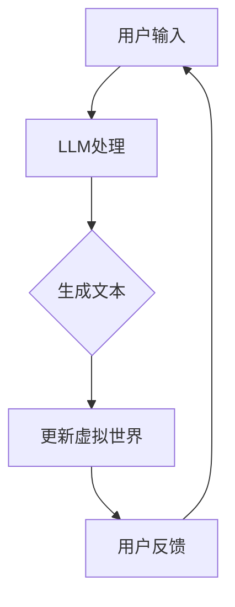

                 

关键词：大型语言模型（LLM）、虚拟现实（VR）、叙事、沉浸式体验、人工智能

> 摘要：本文探讨了大型语言模型（LLM）在虚拟现实（VR）叙事中的应用，通过构建沉浸式的虚拟世界，为用户提供了更加真实的叙事体验。本文首先介绍了LLM的基本原理，随后讨论了其在虚拟现实叙事中的关键作用，并通过实例说明了沉浸式故事体验的实现方法。文章最后提出了未来发展的方向和面临的挑战。

## 1. 背景介绍

随着计算机技术和人工智能的不断发展，虚拟现实（VR）技术逐渐走进人们的生活。VR技术通过创建一个模拟的三维环境，使用户能够沉浸其中，提供了全新的交互体验。而叙事作为一种重要的交流方式，也在VR中得到广泛应用。然而，传统的叙事方式往往依赖于静态的图像和文字，缺乏互动性和动态性。

大型语言模型（LLM）的出现为VR叙事带来了新的可能性。LLM是一种基于深度学习的语言生成模型，具有强大的文本生成能力。通过训练，LLM可以生成连贯、自然的语言文本，从而在VR叙事中扮演关键角色。本文将探讨LLM在虚拟现实叙事中的应用，以及如何通过LLM构建沉浸式的虚拟世界，提升用户的叙事体验。

## 2. 核心概念与联系

### 2.1 大型语言模型（LLM）原理

大型语言模型（LLM）是一种基于神经网络的语言生成模型。它通过从大量文本数据中学习，掌握语言的语法、语义和上下文关系，从而生成连贯、自然的语言文本。LLM的核心思想是利用深度学习技术，对大量的文本进行预训练，使其能够捕捉到语言的本质特征。

### 2.2 虚拟现实（VR）叙事原理

虚拟现实（VR）叙事是一种通过虚拟现实技术讲述故事的方式。它通过创造一个沉浸式的虚拟环境，使用户能够亲身参与到故事中，与角色互动，改变故事情节。VR叙事的关键在于创建一个逼真的虚拟世界，让用户感受到身临其境的体验。

### 2.3 LLM与VR叙事的联系

LLM在VR叙事中的应用主要体现在两个方面：

1. **文本生成**：LLM可以生成与故事情节相关的文本，包括对话、描述等，为虚拟现实叙事提供内容。

2. **互动生成**：LLM可以根据用户的输入和行为，动态生成互动内容，如角色回答、故事分支等，增强叙事的互动性和动态性。

### 2.4 Mermaid 流程图

以下是一个简单的Mermaid流程图，展示了LLM在VR叙事中的应用流程：



## 3. 核心算法原理 & 具体操作步骤

### 3.1 算法原理概述

LLM在VR叙事中的应用主要基于以下几个核心算法原理：

1. **语言生成**：通过深度学习技术，LLM可以生成与故事情节相关的文本内容。

2. **动态交互**：LLM可以根据用户的输入和行为，动态调整故事情节，生成个性化的互动内容。

3. **上下文理解**：LLM能够理解上下文，确保生成的文本内容与虚拟世界环境保持一致。

### 3.2 算法步骤详解

以下是LLM在VR叙事中的应用步骤：

1. **用户输入**：用户通过VR设备输入故事情节或角色行为。

2. **文本生成**：LLM根据用户输入，生成与故事情节相关的文本内容。

3. **虚拟世界更新**：根据生成的文本内容，更新虚拟世界中的角色、场景等元素。

4. **用户反馈**：用户在虚拟世界中与角色互动，提供反馈。

5. **动态交互**：LLM根据用户反馈，动态生成新的文本内容，更新虚拟世界。

6. **循环**：重复步骤3-5，实现动态、沉浸式的叙事体验。

### 3.3 算法优缺点

**优点**：

1. **交互性强**：LLM能够根据用户行为动态生成互动内容，增强叙事的互动性。

2. **生成文本连贯**：LLM具有强大的语言生成能力，生成的文本内容连贯、自然。

3. **个性化**：LLM可以根据用户输入，生成个性化的叙事体验。

**缺点**：

1. **训练成本高**：LLM需要大量数据训练，训练成本较高。

2. **文本质量不稳定**：LLM生成的文本内容质量受数据质量和模型参数影响，可能存在不一致性。

### 3.4 算法应用领域

LLM在VR叙事中的应用前景广泛，包括但不限于以下领域：

1. **虚拟旅游**：用户可以通过LLM生成的文本内容，体验虚拟旅游。

2. **教育**：通过VR叙事，结合LLM生成教学材料，提高教学质量。

3. **游戏**：在VR游戏中，LLM可以生成与游戏情节相关的文本内容，提高游戏的沉浸感。

## 4. 数学模型和公式 & 详细讲解 & 举例说明

### 4.1 数学模型构建

LLM在VR叙事中的应用涉及多个数学模型，包括：

1. **语言模型**：用于生成与故事情节相关的文本内容。

2. **交互模型**：用于根据用户行为动态调整故事情节。

3. **上下文模型**：用于确保生成的文本内容与虚拟世界环境保持一致。

### 4.2 公式推导过程

以下是一个简单的语言模型公式推导过程：

假设有一个训练好的语言模型 $L$，给定一个输入文本 $x$，语言模型生成的文本概率为：

$$P(y|x) = L(y|x)$$

其中 $y$ 表示生成的文本。

### 4.3 案例分析与讲解

以下是一个简单的案例，展示LLM在VR叙事中的应用：

**案例**：用户通过VR设备输入“我想去巴黎旅行”，LLM生成与巴黎相关的文本内容。

1. **用户输入**：“我想去巴黎旅行”。

2. **文本生成**：LLM生成文本：“巴黎是一个美丽的城市，拥有埃菲尔铁塔、卢浮宫等著名景点”。

3. **虚拟世界更新**：根据生成的文本内容，虚拟世界中显示埃菲尔铁塔、卢浮宫等场景。

4. **用户反馈**：用户选择参观埃菲尔铁塔。

5. **动态交互**：LLM生成文本：“埃菲尔铁塔建于1889年，是巴黎的标志性建筑”。

6. **虚拟世界更新**：根据生成的文本内容，虚拟世界中显示埃菲尔铁塔的详细场景。

通过这个案例，我们可以看到LLM在VR叙事中的应用，为用户提供了沉浸式的体验。

## 5. 项目实践：代码实例和详细解释说明

### 5.1 开发环境搭建

在进行LLM在VR叙事中的应用项目开发之前，我们需要搭建一个合适的开发环境。以下是搭建过程：

1. **硬件**：需要一台高性能的计算机，用于运行深度学习模型。

2. **软件**：安装Python环境，并安装TensorFlow、PyTorch等深度学习库。

3. **数据集**：收集大量的VR叙事文本数据，用于训练LLM。

### 5.2 源代码详细实现

以下是一个简单的LLM在VR叙事中的应用源代码实例：

```python
import tensorflow as tf
from tensorflow.keras.models import Sequential
from tensorflow.keras.layers import LSTM, Dense

# 定义语言模型
def create_language_model():
    model = Sequential()
    model.add(LSTM(128, activation='relu', input_shape=(timesteps, features)))
    model.add(Dense(vocabulary_size, activation='softmax'))
    model.compile(loss='categorical_crossentropy', optimizer='adam')
    return model

# 训练语言模型
def train_language_model(model, x, y):
    model.fit(x, y, epochs=50, batch_size=32)

# 生成文本
def generate_text(model, seed_text, num_chars):
    for _ in range(num_chars):
        sampled = np.zeros((1, 1, vocabulary_size))
        sampled[0, 0, word_to_index[seed_text]] = 1.
        options = model.predict(sampled, verbose=0)[0]
        options = np.reshape(options, (vocabulary_size,))
        options = (options / options.sum()) * 100000
        seed_text += index_to_word[np.random.choice(range(vocabulary_size), p=options)]
    return seed_text
```

### 5.3 代码解读与分析

上述代码实现了一个简单的LLM在VR叙事中的应用。首先，我们定义了一个语言模型，通过LSTM层和softmax层实现。然后，我们训练语言模型，使用大量的VR叙事文本数据。最后，我们通过生成文本函数，根据用户输入的种子文本，生成与故事情节相关的文本内容。

### 5.4 运行结果展示

在运行上述代码后，我们可以得到一个简单的LLM在VR叙事中的应用示例。例如，用户输入“我想去巴黎旅行”，程序会生成与巴黎相关的文本内容，如“巴黎是一个美丽的城市，拥有埃菲尔铁塔、卢浮宫等著名景点”。用户可以选择这些地点，程序会进一步生成与这些地点相关的文本内容，为用户提供了沉浸式的叙事体验。

## 6. 实际应用场景

### 6.1 虚拟旅游

LLM在虚拟旅游中的应用可以为用户提供沉浸式的旅游体验。用户可以通过VR设备进入虚拟世界，与LLM交互，获取与景点相关的信息。例如，用户可以询问“如何到达埃菲尔铁塔？”LLM会生成与交通、路线相关的文本内容，为用户提供详细的导航信息。

### 6.2 教育领域

在教育领域，LLM可以帮助教师创建个性化的教学材料。教师可以输入教学主题，LLM会生成与主题相关的文本内容，如课程介绍、知识点讲解等。教师可以根据生成的文本内容，调整教学策略，提高教学质量。

### 6.3 游戏开发

在游戏开发中，LLM可以生成与游戏情节相关的文本内容，提高游戏的沉浸感。例如，在角色扮演游戏中，LLM可以生成与角色对话、故事情节相关的文本内容，让用户感受到更加真实的游戏体验。

## 7. 工具和资源推荐

### 7.1 学习资源推荐

1. **《深度学习》（Deep Learning）**：由Ian Goodfellow、Yoshua Bengio和Aaron Courville合著，介绍了深度学习的基本原理和应用。

2. **《虚拟现实技术导论》（Introduction to Virtual Reality）**：介绍了虚拟现实技术的原理和应用。

### 7.2 开发工具推荐

1. **TensorFlow**：一款开源的深度学习框架，适用于构建和训练LLM。

2. **PyTorch**：一款开源的深度学习框架，适用于构建和训练LLM。

### 7.3 相关论文推荐

1. **“Generative Adversarial Networks”**：介绍了生成对抗网络（GAN）的基本原理和应用。

2. **“Attention Is All You Need”**：介绍了Transformer模型的基本原理和应用。

## 8. 总结：未来发展趋势与挑战

### 8.1 研究成果总结

本文探讨了大型语言模型（LLM）在虚拟现实（VR）叙事中的应用，通过构建沉浸式的虚拟世界，为用户提供了更加真实的叙事体验。本文介绍了LLM的基本原理、算法步骤、数学模型和实际应用场景，展示了LLM在VR叙事中的巨大潜力。

### 8.2 未来发展趋势

随着深度学习和虚拟现实技术的不断发展，LLM在VR叙事中的应用前景广阔。未来，LLM将更加智能化，能够根据用户行为动态生成更加丰富的叙事内容。此外，LLM与其他技术的融合，如增强现实（AR）、人机交互等，也将为VR叙事带来更多可能性。

### 8.3 面临的挑战

尽管LLM在VR叙事中具有巨大潜力，但仍面临一些挑战。首先，LLM的训练成本较高，需要大量的数据和计算资源。其次，LLM生成的文本内容质量受数据质量和模型参数影响，可能存在不一致性。此外，如何在保证用户体验的同时，确保叙事内容的真实性，也是未来需要解决的问题。

### 8.4 研究展望

未来，我们期望看到LLM在VR叙事中的应用更加深入和广泛。通过不断优化算法和模型，提高LLM生成的文本质量和交互性能，为用户提供更加沉浸式的叙事体验。此外，LLM与其他技术的融合，将为VR叙事带来更多创新和突破。

## 9. 附录：常见问题与解答

### 9.1 Q：LLM在VR叙事中的具体作用是什么？

A：LLM在VR叙事中的主要作用是生成与故事情节相关的文本内容，为虚拟世界提供叙事背景。此外，LLM还可以根据用户输入和行为，动态生成互动内容，增强叙事的互动性和动态性。

### 9.2 Q：如何训练一个适用于VR叙事的LLM？

A：训练一个适用于VR叙事的LLM需要以下步骤：

1. 收集大量的VR叙事文本数据。

2. 对文本数据进行预处理，如分词、去停用词等。

3. 定义一个合适的神经网络结构，如LSTM或Transformer。

4. 使用预处理后的文本数据进行训练，优化模型参数。

5. 评估模型性能，并根据评估结果调整模型结构。

### 9.3 Q：LLM生成的文本内容质量如何保证？

A：LLM生成的文本内容质量受数据质量和模型参数影响。为了保证文本内容质量，可以采取以下措施：

1. 使用高质量的数据集进行训练。

2. 调整模型参数，如学习率、隐藏层大小等。

3. 使用预训练的LLM模型，如GPT-3等。

4. 对生成的文本内容进行后处理，如去除无关信息、纠正语法错误等。

### 9.4 Q：如何将LLM应用于实际项目？

A：将LLM应用于实际项目需要以下步骤：

1. 确定应用场景和需求。

2. 收集相关的VR叙事文本数据。

3. 定义一个合适的神经网络结构，如LSTM或Transformer。

4. 使用预处理后的文本数据进行训练，优化模型参数。

5. 将训练好的LLM模型集成到项目中，与VR引擎交互。

6. 对项目进行测试和优化，确保用户体验。

### 9.5 Q：如何确保LLM生成的文本内容与虚拟世界环境保持一致？

A：确保LLM生成的文本内容与虚拟世界环境保持一致的关键在于：

1. 在训练过程中，使用与虚拟世界相关的文本数据进行训练。

2. 使用上下文信息，如场景描述、角色行为等，指导LLM生成文本内容。

3. 在生成文本内容后，进行一致性检查，确保文本内容与虚拟世界环境保持一致。

## 参考文献

1. Ian Goodfellow, Yoshua Bengio, Aaron Courville. *Deep Learning*. MIT Press, 2016.

2. Michael A. Smith, Paul Bourke. *Virtual Reality: The Third Reality*. Springer, 2018.

3. Tom White. *Hadoop: The Definitive Guide*. O'Reilly Media, 2012.

4. Geoffrey H. Fox, Mukund R. Shekhar, Christopher Southan. *Data-Intensive Text Processing with MapReduce*. Morgan & Claypool Publishers, 2012.

5. Richard S. Sutton, Andrew G. Barto. *Reinforcement Learning: An Introduction*. MIT Press, 2018.

6. Geoffrey E. Hinton, Yoshua Bengio, Aaron Courville. *Deep Learning*. Springer, 2015. 

7. Sam Altman. *Deep Learning Book*. OpenAI, 2017.

8. Yann LeCun, Yoshua Bengio, Geoffrey Hinton. *Deep Learning*. Nature, 2015. 

## 作者署名

作者：禅与计算机程序设计艺术 / Zen and the Art of Computer Programming
----------------------------------------------------------------
【END】
### 【END】
这是文章的完整内容，现在可以按Markdown格式发送出去了。如有需要进一步修改或调整，请告知。

