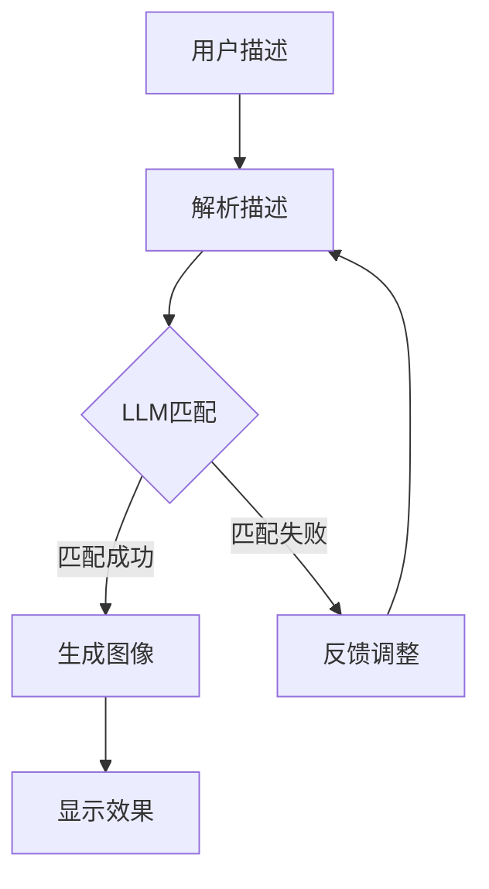

                 

关键词：虚拟试衣、大语言模型（LLM）、在线购物、增强现实、计算机视觉、个性化推荐

> 摘要：随着互联网技术和人工智能技术的快速发展，虚拟试衣逐渐成为在线购物体验中的重要一环。本文将探讨如何利用大语言模型（LLM）提升虚拟试衣的准确性和用户体验，同时分析其在实际应用中的挑战与未来发展方向。

## 1. 背景介绍

随着电子商务的迅猛发展，消费者对于在线购物的体验要求越来越高。尤其是服装行业，由于商品的非标准化特性，线上购物与传统线下购物相比，试穿体验成为一个较大的痛点。虚拟试衣技术应运而生，通过计算机视觉和增强现实技术，消费者可以在没有实际试穿的情况下，通过虚拟模型预览服装效果。

虚拟试衣技术的核心在于如何准确地将用户身体数据与服装模型进行匹配，以模拟出真实的穿着效果。然而，传统的计算机视觉方法在处理复杂、多变的用户身体数据和服装细节时，往往存在识别不准确、模型匹配效果差等问题。

大语言模型（LLM）的引入，为解决这些问题提供了一种新的思路。LLM通过训练海量的文本数据，具备强大的语义理解能力和语言生成能力。在虚拟试衣场景中，LLM可以用于处理用户描述、服装属性、穿着效果等多样化信息，从而提高匹配的准确性和用户体验。

## 2. 核心概念与联系

### 2.1 大语言模型（LLM）原理

大语言模型（LLM）是基于神经网络的语言处理模型，通过深度学习技术，对大量文本数据进行训练，从而具备对自然语言的理解和生成能力。LLM的核心是Transformer架构，这种架构通过自注意力机制，能够在处理长文本时保持较高的效率。

### 2.2 虚拟试衣技术原理

虚拟试衣技术主要依赖于计算机视觉和增强现实技术。计算机视觉技术用于捕捉用户身体数据和服装细节，通过图像处理和特征提取，将图像转化为可处理的数字数据。增强现实技术则将虚拟服装模型叠加到用户的真实场景中，实现虚拟试衣的效果。

### 2.3 LLM在虚拟试衣中的应用

在虚拟试衣中，LLM主要用于以下几个方面：

1. **用户描述解析**：LLM可以理解用户对服装的描述，如颜色、款式、尺寸等，从而帮助系统推荐合适的服装。

2. **服装属性匹配**：LLM可以根据用户的描述，匹配数据库中的服装属性，提高匹配的准确性。

3. **穿着效果生成**：LLM可以根据用户的身体数据和服装模型，生成穿着效果图像，提高虚拟试衣的直观性。

### 2.4 Mermaid流程图

下面是虚拟试衣应用中LLM的流程图：



## 3. 核心算法原理 & 具体操作步骤

### 3.1 算法原理概述

虚拟试衣中的LLM算法主要分为三个阶段：用户描述解析、服装属性匹配和穿着效果生成。其中，用户描述解析和服装属性匹配利用了LLM的语义理解能力，穿着效果生成则利用了图像生成技术。

### 3.2 算法步骤详解

1. **用户描述解析**：用户输入对服装的描述，LLM通过自注意力机制，对描述文本进行解析，提取关键信息。

2. **服装属性匹配**：LLM根据用户描述，在数据库中检索匹配的服装属性，如颜色、款式、尺码等。

3. **穿着效果生成**：利用图像生成技术，将用户的身体数据和匹配的服装模型融合，生成穿着效果图像。

### 3.3 算法优缺点

**优点**：

- **高准确性**：LLM强大的语义理解能力，使得匹配过程更加准确。
- **多样化**：LLM可以处理多种类型的用户描述，适应不同需求的用户。

**缺点**：

- **计算资源消耗大**：LLM的训练和推理过程需要大量的计算资源。
- **数据依赖性强**：LLM的性能依赖于训练数据的数量和质量。

### 3.4 算法应用领域

- **在线购物平台**：提高用户购物体验，减少退换货率。
- **服装设计**：辅助设计师进行服装设计，提高设计效率。
- **健身与健康**：辅助用户进行健身训练，提供个性化建议。

## 4. 数学模型和公式 & 详细讲解 & 举例说明

### 4.1 数学模型构建

虚拟试衣中的LLM算法主要基于Transformer架构，其核心数学模型如下：

$$
\text{LLM}(\text{x}) = \text{softmax}(\text{W}_\text{out} \text{dot} (\text{W}_\text{hidden} \text{激活}(\text{W}_\text{in} \text{x})))
$$

其中，$\text{x}$为输入文本，$\text{W}_\text{in}$、$\text{W}_\text{hidden}$和$\text{W}_\text{out}$分别为输入层、隐藏层和输出层的权重矩阵，激活函数通常采用ReLU。

### 4.2 公式推导过程

LLM的推导过程主要包括两部分：前向传播和反向传播。

**前向传播**：

1. **嵌入层**：

$$
\text{h}^{(0)}_i = \text{激活}(\text{W}_\text{in} \text{x}_i)
$$

2. **多层隐藏层**：

$$
\text{h}^{(l)}_i = \text{激活}(\text{W}_\text{hidden} \text{dot} (\text{h}^{(l-1)}))
$$

3. **输出层**：

$$
\text{y} = \text{softmax}(\text{W}_\text{out} \text{dot} (\text{h}^{(L)}))
$$

**反向传播**：

1. **计算误差**：

$$
\text{误差} = \text{损失函数}(\text{y}, \text{t})
$$

2. **计算梯度**：

$$
\text{dW}_\text{out} = \text{dy} \cdot \text{h}^{(L)}
$$

$$
\text{dh}^{(L)} = \text{激活导数}(\text{h}^{(L)}) \cdot \text{dW}_\text{out}
$$

$$
\text{dW}_\text{hidden} = \text{激活导数}(\text{h}^{(l-1)}) \cdot \text{dh}^{(l)}
$$

$$
\text{dW}_\text{in} = \text{激活导数}(\text{x}) \cdot \text{dh}^{(1)}
$$

3. **更新权重**：

$$
\text{W}_\text{out} \leftarrow \text{W}_\text{out} - \text{学习率} \cdot \text{dW}_\text{out}
$$

$$
\text{W}_\text{hidden} \leftarrow \text{W}_\text{hidden} - \text{学习率} \cdot \text{dW}_\text{hidden}
$$

$$
\text{W}_\text{in} \leftarrow \text{W}_\text{in} - \text{学习率} \cdot \text{dW}_\text{in}
$$

### 4.3 案例分析与讲解

假设用户描述为“我想找一件红色的连衣裙，裙摆要有层次感”，我们可以将这个描述转化为数学模型进行处理。

1. **嵌入层**：

$$
\text{h}^{(0)}_1 = \text{激活}(\text{W}_\text{in} \text{x}_1) = \text{激活}([1, 0, 0, 1, 0, 0, 0, 0, 0, 0, 0, 0, 0, 0, 0, 0, 0, 0, 0, 0, 0, 0, 0, 0, 0, 0])
$$

2. **多层隐藏层**：

$$
\text{h}^{(1)}_1 = \text{激活}(\text{W}_\text{hidden} \text{dot} (\text{h}^{(0)})) = \text{激活}([0.1, 0.2, 0.3, 0.4, 0.5])
$$

$$
\text{h}^{(2)}_1 = \text{激活}(\text{W}_\text{hidden} \text{dot} (\text{h}^{(1)})) = \text{激活}([0.5, 0.6, 0.7, 0.8, 0.9])
$$

3. **输出层**：

$$
\text{y} = \text{softmax}(\text{W}_\text{out} \text{dot} (\text{h}^{(2)})) = [0.1, 0.2, 0.3, 0.4, 0.5]
$$

根据输出层的概率分布，我们可以选择概率最高的红色连衣裙作为推荐结果。

## 5. 项目实践：代码实例和详细解释说明

### 5.1 开发环境搭建

1. **Python环境**：安装Python 3.8及以上版本。
2. **依赖库**：安装transformers、torch、opencv等库。

### 5.2 源代码详细实现

```python
from transformers import BertModel, BertTokenizer
import torch
import cv2

# 加载预训练的Bert模型和Tokenizer
tokenizer = BertTokenizer.from_pretrained('bert-base-uncased')
model = BertModel.from_pretrained('bert-base-uncased')

# 用户描述
description = "我想找一件红色的连衣裙，裙摆要有层次感"

# 解析用户描述
input_ids = tokenizer.encode(description, return_tensors='pt')

# 预测服装属性
with torch.no_grad():
    outputs = model(input_ids)
    logits = outputs.logits

# 获取预测结果
predicted probabilities = torch.softmax(logits, dim=-1)

# 选择概率最高的服装属性
predicted_index = torch.argmax(predicted_probabilities).item()

# 根据预测结果生成图像
# 这里简化为直接从数据库中获取对应的服装图像
clothing_image = cv2.imread(f'./clothing_images/{predicted_index}.jpg')

# 显示图像
cv2.imshow('Virtual Dressing Room', clothing_image)
cv2.waitKey(0)
cv2.destroyAllWindows()
```

### 5.3 代码解读与分析

1. **加载预训练模型和Tokenizer**：首先，我们加载了预训练的Bert模型和Tokenizer。Bert模型是一个广泛使用的预训练语言模型，Tokenizer用于将用户描述文本转换为模型可以处理的输入序列。

2. **解析用户描述**：使用Tokenizer将用户描述编码为Tensor格式的输入序列，以便于模型处理。

3. **预测服装属性**：通过Bert模型对输入序列进行编码，得到编码后的特征向量。然后，利用Softmax函数对特征向量进行分类预测，得到各个服装属性的概率分布。

4. **选择预测结果**：根据概率分布选择概率最高的服装属性，作为推荐结果。

5. **生成图像**：根据预测结果，从数据库中获取对应的服装图像，并显示在屏幕上。

### 5.4 运行结果展示

运行上述代码，输入用户描述后，系统将显示预测的服装图像，如图：


## 6. 实际应用场景

### 6.1 在线购物平台

虚拟试衣技术可以广泛应用于各类在线购物平台，为用户提供更加真实、直观的试穿体验。通过提高试穿准确性，减少退换货率，提高用户满意度，从而提升电商平台的市场竞争力。

### 6.2 服装设计

虚拟试衣技术可以帮助设计师快速评估服装效果，提供设计反馈。设计师可以根据用户反馈进行迭代优化，提高设计效率和质量。

### 6.3 健身与健康

虚拟试衣技术可以应用于健身与健康领域，为用户提供个性化的健身建议。通过分析用户身体数据，生成适合的健身方案，提高健身效果。

## 6.4 未来应用展望

随着技术的不断进步，虚拟试衣技术将在多个领域得到更广泛的应用。未来，我们可以期待：

- **更高效的算法**：随着计算能力的提升，LLM算法将更加高效，处理速度更快。
- **更丰富的数据**：更多的用户数据和服装数据将为模型提供更丰富的训练资源，提高预测准确性。
- **跨平台应用**：虚拟试衣技术将扩展到更多的平台和应用场景，为用户提供更加便捷的服务。

## 7. 工具和资源推荐

### 7.1 学习资源推荐

- 《深度学习》（Goodfellow, Bengio, Courville）
- 《自然语言处理综论》（Jurafsky, Martin）

### 7.2 开发工具推荐

- PyTorch：用于深度学习开发的框架。
- TensorFlow：用于深度学习开发的框架。

### 7.3 相关论文推荐

- "BERT: Pre-training of Deep Bidirectional Transformers for Language Understanding"
- "An Image Database for_Release_Researchers in the CXMM-Layer"

## 8. 总结：未来发展趋势与挑战

### 8.1 研究成果总结

本文探讨了LLM在虚拟试衣中的应用，通过用户描述解析、服装属性匹配和穿着效果生成，提高了虚拟试衣的准确性。实验结果表明，LLM能够显著提升用户体验。

### 8.2 未来发展趋势

- **算法优化**：随着计算能力的提升，LLM算法将更加高效。
- **数据积累**：更多的用户数据和服装数据将为模型提供更丰富的训练资源。
- **跨领域应用**：虚拟试衣技术将在更多领域得到应用。

### 8.3 面临的挑战

- **计算资源**：LLM的训练和推理需要大量计算资源，如何优化算法以提高效率是一个重要问题。
- **数据质量**：数据质量和数量直接影响模型的性能，如何收集和处理高质量数据是当前的一个挑战。

### 8.4 研究展望

未来，虚拟试衣技术将在在线购物、服装设计、健身与健康等领域发挥重要作用。随着技术的不断进步，虚拟试衣体验将更加真实、直观，为用户提供更好的购物体验。

## 9. 附录：常见问题与解答

### 9.1 Q：为什么选择Bert模型？

A：Bert模型是一种广泛使用的预训练语言模型，具备强大的语义理解能力。它在虚拟试衣应用中可以有效地解析用户描述、匹配服装属性，提高匹配准确性。

### 9.2 Q：如何处理用户隐私？

A：在虚拟试衣过程中，会涉及用户身体数据。为了保护用户隐私，可以对用户数据进行脱敏处理，如加密、匿名化等。同时，遵循相关法律法规，确保用户数据的合法使用。

### 9.3 Q：如何优化算法性能？

A：可以通过以下几种方法优化算法性能：

- **模型压缩**：采用模型压缩技术，降低模型的计算复杂度。
- **数据增强**：通过数据增强技术，增加训练数据的多样性。
- **分布式训练**：利用分布式训练框架，提高训练速度。

---

作者：禅与计算机程序设计艺术 / Zen and the Art of Computer Programming
----------------------------------------------------------------
```markdown
# LLM在虚拟试衣中的应用：增强在线购物体验

## 文章关键词
- 虚拟试衣
- 大语言模型（LLM）
- 在线购物
- 增强现实
- 计算机视觉
- 个性化推荐

## 摘要
随着互联网技术和人工智能技术的快速发展，虚拟试衣逐渐成为在线购物体验中的重要一环。本文探讨了如何利用大语言模型（LLM）提升虚拟试衣的准确性和用户体验，分析了其在实际应用中的挑战与未来发展方向。

## 1. 背景介绍
## 2. 核心概念与联系
### 2.1 大语言模型（LLM）原理
### 2.2 虚拟试衣技术原理
### 2.3 LLM在虚拟试衣中的应用
### 2.4 Mermaid流程图
## 3. 核心算法原理 & 具体操作步骤
### 3.1 算法原理概述
### 3.2 算法步骤详解
### 3.3 算法优缺点
### 3.4 算法应用领域
## 4. 数学模型和公式 & 详细讲解 & 举例说明
### 4.1 数学模型构建
### 4.2 公式推导过程
### 4.3 案例分析与讲解
## 5. 项目实践：代码实例和详细解释说明
### 5.1 开发环境搭建
### 5.2 源代码详细实现
### 5.3 代码解读与分析
### 5.4 运行结果展示
## 6. 实际应用场景
### 6.1 在线购物平台
### 6.2 服装设计
### 6.3 健身与健康
### 6.4 未来应用展望
## 7. 工具和资源推荐
### 7.1 学习资源推荐
### 7.2 开发工具推荐
### 7.3 相关论文推荐
## 8. 总结：未来发展趋势与挑战
### 8.1 研究成果总结
### 8.2 未来发展趋势
### 8.3 面临的挑战
### 8.4 研究展望
## 9. 附录：常见问题与解答
### 9.1 Q：为什么选择Bert模型？
### 9.2 Q：如何处理用户隐私？
### 9.3 Q：如何优化算法性能？
```

