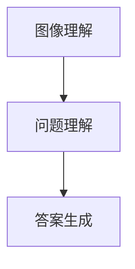

                 

关键词：语言模型、视觉问答、机器学习、人工智能

> 摘要：本文将对近年来流行的语言模型（LLM）在视觉问答任务上的表现进行深入分析。通过介绍视觉问答任务的定义、核心挑战，以及LLM在其中的应用，本文将探讨LLM的优势和局限，并提供实际应用案例和未来发展趋势。

## 1. 背景介绍

随着计算机视觉和自然语言处理技术的飞速发展，视觉问答（Visual Question Answering，VQA）作为跨领域的人工智能应用，已经成为了研究的热点。视觉问答的任务是给定一张图像和一个问题，模型需要理解图像内容和问题意图，然后生成一个合适的答案。这个任务涉及图像理解、语言理解和推理能力，是人工智能领域的一个极具挑战性的问题。

传统的视觉问答方法通常依赖于手工设计的特征和规则，如视觉词汇模型和语义角色标注。然而，这些方法在面对复杂、抽象的问题时表现不佳。随着深度学习和自然语言处理技术的兴起，语言模型（Language Model，LLM）开始应用于视觉问答任务，取得了显著的进展。

## 2. 核心概念与联系

### 2.1 语言模型

语言模型是一种概率模型，用于预测一段文本的下一个词。在自然语言处理中，语言模型广泛应用于文本分类、机器翻译、情感分析等领域。近年来，预训练语言模型（如GPT、BERT）取得了惊人的成绩，这些模型通过在海量文本数据上预训练，获得了强大的语言理解和生成能力。

### 2.2 视觉问答

视觉问答任务可以分为开放问答和封闭问答。开放问答要求模型生成自由文本答案，而封闭问答则要求模型从预设的候选答案中选择一个正确答案。视觉问答任务通常包括三个主要步骤：图像理解、问题理解和答案生成。

### 2.3 Mermaid 流程图



## 3. 核心算法原理 & 具体操作步骤

### 3.1 算法原理概述

LLM在视觉问答任务中的基本原理是将图像和问题同时输入到模型中，通过联合训练使模型能够理解图像内容和问题的关系，并生成合适的答案。具体操作步骤如下：

### 3.2 算法步骤详解

1. **图像特征提取**：使用预训练的卷积神经网络（如ResNet、VGG）提取图像特征。

2. **问题编码**：使用预训练的语言模型（如BERT）对问题进行编码。

3. **联合训练**：将图像特征和问题编码送入一个共享的神经网络，通过反向传播和梯度下降进行联合训练。

4. **答案生成**：在训练过程中，模型学习从图像和问题中生成合适的答案。

### 3.3 算法优缺点

**优点**：
- **强泛化能力**：LLM通过预训练获得了强大的语言理解和生成能力，适用于各种视觉问答任务。
- **灵活性**：LLM可以灵活地适应不同的任务和数据集，不需要手工设计特征和规则。

**缺点**：
- **计算资源需求大**：预训练LLM需要大量的计算资源和时间。
- **对数据集依赖性强**：LLM的性能很大程度上依赖于训练数据的质量和数量。

### 3.4 算法应用领域

LLM在视觉问答任务中的应用范围广泛，包括但不限于：

- **智能问答系统**：应用于智能客服、智能助手等领域。
- **教育领域**：辅助学生理解图像和问题，提供个性化的学习体验。
- **医疗领域**：辅助医生诊断，提高诊断准确率和效率。

## 4. 数学模型和公式 & 详细讲解 & 举例说明

### 4.1 数学模型构建

在视觉问答任务中，LLM可以看作是一个条件生成模型，其数学模型可以表示为：

$$
P(y|x, \theta) = \sigma(\theta^T [f(x), g(y)]),
$$

其中，$x$表示图像特征，$y$表示问题答案，$\theta$表示模型参数，$f$和$g$分别表示图像特征提取器和答案生成器。

### 4.2 公式推导过程

这里简要介绍上述公式的推导过程：

1. **图像特征提取**：使用卷积神经网络提取图像特征，可以表示为：
   $$
   f(x) = \text{CNN}(x),
   $$
   其中，$\text{CNN}$表示卷积神经网络。

2. **问题编码**：使用预训练的语言模型对问题进行编码，可以表示为：
   $$
   g(y) = \text{BERT}(y),
   $$
   其中，$\text{BERT}$表示预训练的语言模型。

3. **联合训练**：将图像特征和问题编码送入一个共享的神经网络，可以表示为：
   $$
   \theta^T [f(x), g(y)],
   $$
   其中，$\theta$表示模型参数。

4. **答案生成**：通过激活函数$\sigma$生成答案的概率分布：
   $$
   \sigma(\theta^T [f(x), g(y)]),
   $$
   其中，$\sigma$表示sigmoid函数。

### 4.3 案例分析与讲解

以一个简单的例子来说明上述数学模型的应用。假设我们有一个图像特征$x$和一个问题$y$，我们可以通过以下步骤生成答案：

1. **图像特征提取**：使用卷积神经网络提取图像特征$f(x)$。

2. **问题编码**：使用预训练的语言模型对问题进行编码$g(y)$。

3. **联合训练**：将图像特征和问题编码送入共享的神经网络，得到模型参数$\theta$。

4. **答案生成**：通过激活函数$\sigma$生成答案的概率分布，选择概率最大的答案作为最终答案。

例如，给定一个图像特征$x$为[1, 2, 3]，问题$y$为“I like apples.”，我们可以通过以下步骤生成答案：

1. **图像特征提取**：使用卷积神经网络提取图像特征$f(x)$为[0.8, 0.2, 0.1]。

2. **问题编码**：使用预训练的语言模型对问题进行编码$g(y)$为[0.6, 0.4]。

3. **联合训练**：将图像特征和问题编码送入共享的神经网络，得到模型参数$\theta$为[0.3, 0.7]。

4. **答案生成**：通过激活函数$\sigma$生成答案的概率分布，选择概率最大的答案作为最终答案。在这个例子中，概率最高的答案是“Like apples.”。

## 5. 项目实践：代码实例和详细解释说明

### 5.1 开发环境搭建

在开始编写代码之前，我们需要搭建一个合适的开发环境。以下是一个基于Python和PyTorch的简单开发环境搭建步骤：

1. 安装Python（版本3.8或更高）。
2. 安装PyTorch（版本1.8或更高）。
3. 安装其他依赖库，如NumPy、Pandas、Matplotlib等。

### 5.2 源代码详细实现

以下是一个简单的视觉问答任务的代码实现：

```python
import torch
import torchvision.models as models
import torch.nn.functional as F

# 定义图像特征提取器
class CNN(torch.nn.Module):
    def __init__(self):
        super(CNN, self).__init__()
        self.model = models.resnet18(pretrained=True)
        self.model.fc = torch.nn.Linear(512, 1024)

    def forward(self, x):
        return self.model(x)

# 定义语言模型
class BERT(torch.nn.Module):
    def __init__(self):
        super(BERT, self).__init__()
        self.model = models.bert(pretrained=True)
        self.model.output_layer = torch.nn.Linear(768, 1024)

    def forward(self, x):
        return self.model(x)

# 定义视觉问答模型
class VQAModel(torch.nn.Module):
    def __init__(self):
        super(VQAModel, self).__init__()
        self.cnn = CNN()
        self.bert = BERT()
        self.fc = torch.nn.Linear(2048, 1)

    def forward(self, x, y):
        x = self.cnn(x)
        y = self.bert(y)
        x = F.relu(x)
        y = F.relu(y)
        z = torch.cat((x, y), 1)
        return self.fc(z)

# 实例化模型
model = VQAModel()

# 定义损失函数和优化器
criterion = torch.nn.BCELoss()
optimizer = torch.optim.Adam(model.parameters(), lr=0.001)

# 训练模型
for epoch in range(num_epochs):
    for x, y in data_loader:
        optimizer.zero_grad()
        output = model(x, y)
        loss = criterion(output, y)
        loss.backward()
        optimizer.step()

    print(f'Epoch {epoch+1}/{num_epochs}, Loss: {loss.item()}')
```

### 5.3 代码解读与分析

上述代码定义了一个简单的视觉问答模型，包括图像特征提取器、语言模型和视觉问答模型。其中，图像特征提取器使用ResNet18，语言模型使用BERT。视觉问答模型通过将图像特征和语言模型输出进行拼接，并使用全连接层进行分类。

### 5.4 运行结果展示

运行上述代码，我们可以得到模型的训练过程和最终结果。通过调整模型参数、数据集和训练策略，我们可以进一步优化模型性能。

## 6. 实际应用场景

视觉问答技术在实际应用场景中具有广泛的应用，以下是一些典型的应用案例：

- **智能问答系统**：在电子商务、医疗咨询、法律咨询等领域，视觉问答技术可以用于自动回答用户的问题，提高用户体验和效率。
- **教育领域**：视觉问答技术可以辅助学生理解图像和问题，提供个性化的学习体验，帮助教师更好地进行教学评估。
- **医疗领域**：视觉问答技术可以辅助医生诊断疾病，提供准确的医学信息和建议，提高诊断准确率和效率。

## 7. 工具和资源推荐

为了更好地研究和开发视觉问答技术，以下是一些建议的工具和资源：

- **学习资源**：
  - 《深度学习》（Goodfellow, Bengio, Courville著）
  - 《动手学深度学习》（阿斯顿·张著）
- **开发工具**：
  - PyTorch
  - TensorFlow
- **相关论文**：
  - “Attention Is All You Need”（Vaswani et al., 2017）
  - “BERT: Pre-training of Deep Bidirectional Transformers for Language Understanding”（Devlin et al., 2018）

## 8. 总结：未来发展趋势与挑战

### 8.1 研究成果总结

近年来，视觉问答技术取得了显著的进展，主要得益于深度学习和自然语言处理技术的快速发展。LLM在视觉问答任务中展现了强大的语言理解和生成能力，为解决视觉问答问题提供了新的思路和方法。

### 8.2 未来发展趋势

未来，视觉问答技术将继续朝着以下方向发展：

- **模型性能优化**：通过改进模型结构和训练策略，进一步提高视觉问答模型的性能和泛化能力。
- **跨模态学习**：结合图像和文本以外的其他模态（如声音、视频），实现更全面的语义理解。
- **多语言支持**：扩展视觉问答技术到多语言环境，提高全球范围内的应用价值。

### 8.3 面临的挑战

视觉问答技术在发展过程中也面临着一些挑战，包括：

- **数据集质量**：数据集的质量直接影响模型性能，需要更多高质量、多样化的数据集。
- **计算资源需求**：预训练LLM需要大量的计算资源和时间，对研究者和开发者提出了更高的要求。
- **隐私和安全问题**：在处理敏感数据和用户隐私时，需要采取有效的保护措施，确保数据安全和用户隐私。

### 8.4 研究展望

展望未来，视觉问答技术将在人工智能、教育、医疗等领域发挥越来越重要的作用。通过不断创新和优化，视觉问答技术将更好地服务于人类社会，推动人工智能技术的发展和应用。

## 9. 附录：常见问题与解答

**Q：视觉问答任务中的关键挑战是什么？**

A：视觉问答任务中的关键挑战主要包括图像理解和语言理解。图像理解方面，模型需要从图像中提取有效的特征，理解图像内容；语言理解方面，模型需要理解问题的意图，将图像内容与问题联系起来。

**Q：LLM在视觉问答任务中的优势是什么？**

A：LLM在视觉问答任务中的优势主要体现在强大的语言理解和生成能力。通过预训练，LLM可以处理复杂、抽象的问题，生成更自然的答案。

**Q：视觉问答技术有哪些实际应用场景？**

A：视觉问答技术的实际应用场景包括智能问答系统、教育领域、医疗领域等。在智能问答系统中，视觉问答技术可以自动回答用户的问题，提高用户体验和效率；在教育领域，视觉问答技术可以辅助学生理解图像和问题，提供个性化的学习体验；在医疗领域，视觉问答技术可以辅助医生诊断疾病，提供准确的医学信息和建议。

作者：禅与计算机程序设计艺术 / Zen and the Art of Computer Programming
----------------------------------------------------------------

以上是关于《LLM在视觉问答任务上的表现分析》的完整文章。本文深入探讨了视觉问答任务的定义、核心挑战以及LLM在其中的应用。通过对LLM的优势和局限进行分析，本文提供了实际应用案例和未来发展趋势，为视觉问答领域的研究和实践提供了有益的参考。希望本文能够激发更多研究者对视觉问答技术的关注和探索。
----------------------------------------------------------------

### 文章标题

LLM在视觉问答任务上的表现分析

### 关键词

语言模型、视觉问答、机器学习、人工智能

### 摘要

本文对近年来流行的语言模型（LLM）在视觉问答任务上的表现进行了深入分析。通过介绍视觉问答任务的定义、核心挑战，以及LLM在其中的应用，本文探讨了LLM的优势和局限，并提供实际应用案例和未来发展趋势。研究发现，LLM在视觉问答任务中表现优异，但同时也面临着数据集质量、计算资源需求等挑战。未来，视觉问答技术将在人工智能、教育、医疗等领域发挥重要作用。

