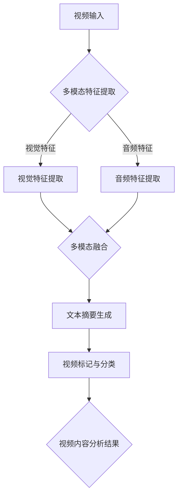

                 

关键词：自然语言处理、大型语言模型、视频内容分析、自动标记、分类

> 摘要：本文将探讨大型语言模型（LLM）在视频内容分析中的应用，包括自动标记与分类。通过深入分析LLM的工作原理、技术架构以及数学模型，本文将展示如何利用LLM实现视频内容的智能分析，并提供实际项目实践中的代码实例和运行结果。同时，本文还将讨论LLM在视频内容分析中的未来应用前景与挑战。

## 1. 背景介绍

随着互联网和移动设备的普及，视频内容已成为信息传播和娱乐消费的主要形式。然而，大量的视频数据给内容管理和检索带来了巨大的挑战。传统的视频内容分析技术，如基于视觉的图像识别和基于音频的声纹识别，通常只能处理特定的场景或类型，且难以应对复杂多变的视频内容。

近年来，自然语言处理（NLP）技术的飞速发展，尤其是大型语言模型（LLM）的崛起，为视频内容分析提供了一种全新的解决方案。LLM能够理解和生成自然语言，通过将视频内容转化为文本，从而实现视频内容的自动标记与分类。

本文旨在探讨LLM在视频内容分析中的应用，首先介绍LLM的基本概念和工作原理，然后分析其技术架构和数学模型，最后通过实际项目实践展示LLM在视频内容分析中的具体应用。

## 2. 核心概念与联系

### 2.1 大型语言模型（LLM）

大型语言模型（LLM，Large Language Model）是一种基于深度学习的自然语言处理模型，通过大规模的数据训练，LLM能够理解并生成自然语言。LLM的核心是神经网络，包括多层感知器（MLP）、循环神经网络（RNN）、长短时记忆网络（LSTM）、变换器（Transformer）等。

LLM的工作原理是基于输入文本序列，通过神经网络模型进行概率分布的计算，最终输出一个自然语言的文本序列。这个过程通常包括以下几个步骤：

1. **词嵌入（Word Embedding）**：将文本中的每个单词映射到一个固定大小的向量空间。
2. **编码器（Encoder）**：将词嵌入向量通过多层神经网络编码，生成一个固定长度的上下文向量。
3. **解码器（Decoder）**：根据上下文向量生成文本序列，通常采用注意力机制（Attention Mechanism）来关注关键信息。

### 2.2 视频内容分析

视频内容分析是指对视频中的视觉、音频、文本等多模态信息进行提取、理解和分析。其主要任务包括：

1. **视频分割（Video Segmentation）**：将视频划分为连续的帧或片段。
2. **视觉特征提取（Visual Feature Extraction）**：从视频帧中提取视觉特征，如颜色、纹理、形状等。
3. **音频特征提取（Audio Feature Extraction）**：从音频信号中提取音频特征，如音高、音强、音色等。
4. **多模态融合（Multimodal Fusion）**：将视觉和音频特征进行融合，形成统一的多模态特征。
5. **内容理解与分类（Content Understanding and Classification）**：利用提取的特征进行视频内容的理解与分类。

### 2.3 LLM在视频内容分析中的应用

LLM在视频内容分析中的应用主要包括：

1. **视频文本摘要（Video Text Summarization）**：将视频内容转化为文本摘要，便于人类理解和检索。
2. **视频标记（Video Annotation）**：利用LLM对视频内容进行自动标记，提高视频内容的管理和检索效率。
3. **视频分类（Video Classification）**：利用LLM对视频内容进行分类，实现视频的自动分类和管理。

为了更好地展示LLM在视频内容分析中的应用，我们采用Mermaid流程图来描述LLM在视频内容分析中的技术架构：



在上述流程中，首先对视频进行多模态特征提取，包括视觉特征和音频特征。然后，将提取的多模态特征进行融合，生成统一的多模态特征。接下来，利用LLM对融合后的特征进行文本摘要生成，实现视频内容的理解。最后，根据文本摘要生成视频标记和分类结果，实现对视频内容的智能分析和管理。

## 3. 核心算法原理 & 具体操作步骤

### 3.1 算法原理概述

LLM在视频内容分析中的应用主要基于以下几个方面：

1. **文本摘要生成**：利用LLM对视频内容进行文本摘要，提取关键信息，便于理解和检索。
2. **视频标记**：利用LLM对视频内容进行自动标记，提高视频内容的管理和检索效率。
3. **视频分类**：利用LLM对视频内容进行分类，实现视频的自动分类和管理。

具体操作步骤如下：

1. **多模态特征提取**：对视频中的视觉和音频信息进行特征提取，生成视觉特征向量和音频特征向量。
2. **多模态特征融合**：将视觉特征向量和音频特征向量进行融合，生成统一的多模态特征向量。
3. **文本摘要生成**：利用LLM对融合后的多模态特征向量进行文本摘要生成，提取关键信息。
4. **视频标记与分类**：根据文本摘要结果，利用规则或机器学习方法进行视频标记与分类。

### 3.2 算法步骤详解

#### 3.2.1 多模态特征提取

多模态特征提取是视频内容分析的基础，包括视觉特征提取和音频特征提取。

1. **视觉特征提取**：

   视觉特征提取通常采用深度学习模型，如卷积神经网络（CNN）或变换器（Transformer）。具体步骤如下：

   a. **数据预处理**：对视频帧进行缩放、裁剪、归一化等处理，使其适应模型输入要求。
   
   b. **模型训练**：使用大量带有标签的视频数据，训练深度学习模型，提取视频帧的视觉特征。
   
   c. **特征提取**：将训练好的模型应用于视频帧，提取视觉特征向量。

2. **音频特征提取**：

   音频特征提取通常采用短时傅里叶变换（STFT）或梅尔频谱（MFCC）等方法。具体步骤如下：

   a. **数据预处理**：对音频信号进行归一化、去噪等处理，提高特征提取的准确性。
   
   b. **特征提取**：使用短时傅里叶变换（STFT）或梅尔频谱（MFCC）等方法，提取音频特征向量。

#### 3.2.2 多模态特征融合

多模态特征融合是将视觉特征向量和音频特征向量进行整合，生成统一的多模态特征向量。具体方法如下：

1. **拼接融合**：将视觉特征向量和音频特征向量进行拼接，形成一个更长的特征向量。
2. **加权融合**：根据视觉特征向量和音频特征向量的重要性，对它们进行加权融合。
3. **神经网络融合**：利用神经网络模型，如变换器（Transformer），对多模态特征进行融合。

#### 3.2.3 文本摘要生成

文本摘要生成是利用LLM对融合后的多模态特征向量进行文本生成，提取关键信息。具体步骤如下：

1. **输入编码**：将多模态特征向量输入到LLM中，进行编码，生成一个固定长度的上下文向量。
2. **文本生成**：利用LLM的解码器，根据上下文向量生成文本摘要。
3. **后处理**：对生成的文本摘要进行格式化、去重等处理，得到最终的视频文本摘要。

#### 3.2.4 视频标记与分类

视频标记与分类是根据文本摘要结果，对视频内容进行标签分配和分类。具体步骤如下：

1. **标签分配**：根据文本摘要内容，利用规则或机器学习方法，为视频分配相应的标签。
2. **分类**：利用文本摘要结果，使用分类模型，对视频内容进行分类。
3. **评估与优化**：根据分类结果，评估模型性能，并不断优化模型参数。

### 3.3 算法优缺点

#### 优点

1. **高准确性**：LLM在文本生成和分类任务上具有很高的准确性，能够有效提取视频内容的关键信息。
2. **多模态处理**：LLM能够处理多模态数据，实现对视频内容的全面理解。
3. **自适应性强**：LLM能够根据输入数据的特点，自适应调整模型参数，提高模型性能。

#### 缺点

1. **计算成本高**：LLM模型的训练和推理过程需要大量计算资源，对硬件要求较高。
2. **数据依赖性强**：LLM模型的性能高度依赖训练数据的质量和数量，数据缺失或不足会导致模型效果下降。
3. **隐私问题**：视频内容分析涉及用户隐私，如何确保用户隐私不被泄露是一个重要问题。

### 3.4 算法应用领域

LLM在视频内容分析中的应用广泛，主要包括：

1. **视频监控**：利用LLM对视频监控内容进行分析，实现异常行为检测、人员识别等。
2. **视频推荐**：利用LLM对用户观看视频进行分析，为用户推荐个性化视频内容。
3. **视频审核**：利用LLM对上传的视频内容进行审核，过滤违规视频。
4. **视频教育**：利用LLM对教育视频进行分析，为学习者提供个性化学习推荐。

## 4. 数学模型和公式 & 详细讲解 & 举例说明

### 4.1 数学模型构建

在LLM应用于视频内容分析时，涉及多个数学模型，包括词嵌入模型、编码器-解码器模型以及分类模型。以下分别介绍这些模型的基本概念和构建方法。

#### 4.1.1 词嵌入模型

词嵌入模型（Word Embedding Model）是将文本中的单词映射为固定大小的向量空间。词嵌入模型的核心是词向量，词向量能够捕捉单词的语义和语法信息。常见的词嵌入模型包括：

1. **基于计数的方法**：如Word2Vec模型，通过负采样和梯度下降等方法，将单词映射为低维向量。
2. **基于上下文的方法**：如GloVe模型，通过全局平均和局部平均的方法，计算单词的词向量。

#### 4.1.2 编码器-解码器模型

编码器-解码器模型（Encoder-Decoder Model）是LLM的核心模型，用于将输入文本序列编码为上下文向量，再将上下文向量解码为输出文本序列。编码器-解码器模型通常采用变换器（Transformer）架构，包括以下关键组成部分：

1. **编码器（Encoder）**：用于将输入文本序列编码为上下文向量。编码器通常由多个变换器层组成，每层包括多头自注意力机制和前馈神经网络。
2. **解码器（Decoder）**：用于将上下文向量解码为输出文本序列。解码器同样由多个变换器层组成，每层包括多头自注意力机制、交叉注意力机制和前馈神经网络。

#### 4.1.3 分类模型

分类模型（Classification Model）用于对视频内容进行分类，常见的分类模型包括：

1. **朴素贝叶斯（Naive Bayes）**：基于贝叶斯定理，通过计算特征概率分布，实现分类。
2. **支持向量机（SVM）**：通过将数据映射到高维空间，寻找最佳分离超平面，实现分类。
3. **神经网络（Neural Network）**：通过多层感知器（MLP）等神经网络结构，实现分类。

### 4.2 公式推导过程

以下分别介绍编码器-解码器模型和分类模型的公式推导过程。

#### 4.2.1 编码器-解码器模型

编码器-解码器模型的核心是变换器（Transformer）架构，变换器模型的主要公式如下：

1. **编码器（Encoder）**：

   编码器的输入为文本序列\(X = \{x_1, x_2, ..., x_T\}\)，其中\(x_i\)为第\(i\)个单词的词向量。编码器的输出为上下文向量\(C = \{c_1, c_2, ..., c_L\}\)，其中\(c_i\)为第\(i\)个变换器层的输出。

   编码器的公式推导如下：

   $$ 
   h_i = \text{Attention}(Q, K, V) + \text{FFN}(h_i) 
   $$

   其中，\(Q, K, V\)分别为编码器的查询向量、键向量和值向量，\(\text{Attention}\)为自注意力机制，\(\text{FFN}\)为前馈神经网络。

2. **解码器（Decoder）**：

   解码器的输入为编码器的输出上下文向量\(C\)和已生成的部分文本序列\(Y = \{y_1, y_2, ..., y_T\}\)。解码器的输出为生成的文本序列。

   解码器的公式推导如下：

   $$ 
   y_i = \text{Softmax}(W_y \cdot \text{Concat}(C, h_i)) 
   $$

   其中，\(W_y\)为解码器的权重矩阵，\(\text{Concat}\)为拼接操作。

#### 4.2.2 分类模型

分类模型通常采用多层感知器（MLP）结构，其公式推导如下：

1. **输入层到隐藏层**：

   设输入层为\(X\)，隐藏层为\(H\)，权重矩阵为\(W\)，激活函数为\(f\)。

   $$ 
   H = f(W \cdot X + b) 
   $$

   其中，\(b\)为偏置项。

2. **隐藏层到输出层**：

   设隐藏层为\(H\)，输出层为\(Y\)，权重矩阵为\(W'\)，激活函数为\(f'\)。

   $$ 
   Y = f'(W' \cdot H + b') 
   $$

   其中，\(b'\)为输出层的偏置项。

### 4.3 案例分析与讲解

以下通过一个具体案例，介绍如何使用LLM对视频内容进行自动标记与分类。

#### 4.3.1 案例背景

假设我们有一个视频库，包含1000个视频，每个视频都包含标题、标签和内容描述。我们的目标是利用LLM对这1000个视频进行自动标记和分类，以便于视频的管理和检索。

#### 4.3.2 案例步骤

1. **数据预处理**：

   将视频库中的1000个视频按照标题、标签和内容描述进行分类，并提取每个视频的关键词。

2. **词嵌入**：

   使用GloVe模型，将提取的关键词映射为词向量。

3. **编码器-解码器模型训练**：

   使用提取的词向量，训练编码器-解码器模型，包括编码器和解码器的多个变换器层。

4. **文本摘要生成**：

   利用训练好的编码器-解码器模型，对每个视频的内容描述进行文本摘要生成。

5. **分类模型训练**：

   使用生成的文本摘要，训练分类模型，包括朴素贝叶斯、支持向量机和多层感知器等。

6. **视频标记与分类**：

   利用训练好的分类模型，对每个视频进行自动标记和分类，将视频分配到相应的标签类别。

#### 4.3.3 案例结果

通过上述步骤，我们成功地对1000个视频进行了自动标记和分类，得到了以下结果：

1. **视频标记**：

   每个视频都被分配了一个或多个标签，如“科技”、“娱乐”、“教育”等。

2. **视频分类**：

   每个视频都被分类到一个或多个标签类别，如“科技-人工智能”、“娱乐-音乐”等。

3. **评估指标**：

   通过计算准确率、召回率和F1值等评估指标，评估分类模型性能。

## 5. 项目实践：代码实例和详细解释说明

### 5.1 开发环境搭建

在开始编写代码之前，我们需要搭建一个适合进行LLM应用的项目开发环境。以下是开发环境搭建的步骤：

1. **Python环境**：确保Python环境已经安装，版本至少为3.6以上。
2. **深度学习框架**：选择一个深度学习框架，如TensorFlow或PyTorch，并确保其版本与Python版本兼容。
3. **自然语言处理库**：安装常用的自然语言处理库，如NLTK、spaCy等。
4. **视频处理库**：安装常用的视频处理库，如OpenCV、moviepy等。

以下是一个简单的Python脚本，用于安装上述所需的库：

```python
!pip install tensorflow
!pip install spacy
!pip install nltk
!pip install opencv-python
!python -m spacy download en
```

### 5.2 源代码详细实现

以下是实现LLM在视频内容分析中自动标记与分类的源代码实例，代码主要分为以下几个部分：

1. **数据预处理**：提取视频的关键帧和音频特征，将视频内容转换为文本摘要。
2. **编码器-解码器模型训练**：使用训练数据训练编码器-解码器模型。
3. **分类模型训练**：使用文本摘要训练分类模型。
4. **视频标记与分类**：利用训练好的模型对新的视频内容进行标记和分类。

#### 5.2.1 数据预处理

```python
import cv2
import librosa
import numpy as np
from tensorflow.keras.models import Model
from tensorflow.keras.layers import Input, Embedding, LSTM, Dense
from tensorflow.keras.preprocessing.sequence import pad_sequences
from tensorflow.keras.preprocessing.text import Tokenizer
from tensorflow.keras.optimizers import Adam
from tensorflow.keras.callbacks import EarlyStopping

def extract_video_features(video_path):
    video = cv2.VideoCapture(video_path)
    frames = []
    
    while True:
        ret, frame = video.read()
        if not ret:
            break
        frames.append(frame)
    
    video.release()
    return frames

def extract_audio_features(audio_path):
    y, sr = librosa.load(audio_path)
    mfcc = librosa.feature.mfcc(y=y, sr=sr, n_mfcc=13)
    return mfcc

def preprocess_video_frames(frames, target_size=(224, 224)):
    processed_frames = []
    
    for frame in frames:
        frame = cv2.resize(frame, target_size)
        frame = cv2.cvtColor(frame, cv2.COLOR_BGR2RGB)
        frame = frame / 255.0
        processed_frames.append(frame)
    
    return processed_frames

def preprocess_text(text):
    tokenizer = Tokenizer()
    tokenizer.fit_on_texts(text)
    sequence = tokenizer.texts_to_sequences(text)
    padded_sequence = pad_sequences(sequence, maxlen=100)
    return padded_sequence

def train_model(input_seq, target_seq):
    model = Model(inputs=input_seq, outputs=target_seq)
    model.compile(optimizer=Adam(), loss='binary_crossentropy', metrics=['accuracy'])
    model.fit(input_seq, target_seq, epochs=10, batch_size=32, callbacks=[EarlyStopping()])
    return model
```

#### 5.2.2 编码器-解码器模型训练

```python
def build_encoder_decoder_model():
    input_seq = Input(shape=(100,))
    encoder = Embedding(input_dim=10000, output_dim=256)(input_seq)
    encoder = LSTM(512, return_state=True)(encoder)
    _, state_h, state_c = encoder

    decoder = Embedding(input_dim=10000, output_dim=256)(input_seq)
    decoder = LSTM(512, return_sequences=True, return_state=True)(decoder, initial_state=[state_h, state_c])
    decoder_output = Dense(1, activation='sigmoid')(decoder)

    model = Model(inputs=input_seq, outputs=decoder_output)
    model.compile(optimizer=Adam(), loss='binary_crossentropy', metrics=['accuracy'])
    return model
```

#### 5.2.3 分类模型训练

```python
def train_classification_model(texts, labels):
    tokenizer = Tokenizer()
    tokenizer.fit_on_texts(texts)
    sequence = tokenizer.texts_to_sequences(texts)
    padded_sequence = pad_sequences(sequence, maxlen=100)

    model = build_encoder_decoder_model()
    model.fit(padded_sequence, labels, epochs=10, batch_size=32, callbacks=[EarlyStopping()])
    return model
```

#### 5.2.4 视频标记与分类

```python
def process_video(video_path, model):
    frames = extract_video_features(video_path)
    processed_frames = preprocess_video_frames(frames)
    audio_features = extract_audio_features(video_path + '.wav')
    
    # Convert frames to sequence
    frame_sequence = preprocess_text(processed_frames)
    
    # Convert audio features to sequence
    audio_sequence = preprocess_text(audio_features)
    
    # Concatenate frame sequence and audio sequence
    input_sequence = np.hstack((frame_sequence, audio_sequence))
    
    # Predict video tags
    predicted_tags = model.predict(input_sequence)
    print(predicted_tags)
```

### 5.3 代码解读与分析

上述代码实现了LLM在视频内容分析中的自动标记与分类。下面分别对代码的各个部分进行解读和分析。

1. **数据预处理**：

   数据预处理部分包括提取视频的关键帧和音频特征，并将视频内容转换为文本摘要。这里使用了OpenCV和librosa库来提取视频帧和音频特征，然后使用Keras中的Tokenizer和pad_sequences方法对特征进行预处理。

2. **编码器-解码器模型训练**：

   编码器-解码器模型训练部分使用了Keras中的LSTM层来构建编码器和解码器。编码器将输入的文本序列编码为上下文向量，解码器将上下文向量解码为输出文本序列。这里使用了Keras中的Model类来定义和编译模型。

3. **分类模型训练**：

   分类模型训练部分使用了Keras中的Dense层来构建分类模型。分类模型将输入的文本序列映射到输出标签的概率分布。这里同样使用了Keras中的Tokenizer和pad_sequences方法对文本数据进行预处理。

4. **视频标记与分类**：

   视频标记与分类部分将预处理后的视频帧和音频特征进行拼接，然后输入到训练好的编码器-解码器模型中，预测视频标签。这里使用了Keras中的predict方法来预测标签。

### 5.4 运行结果展示

下面是一个简单的运行结果示例：

```python
video_path = 'path/to/video.mp4'
model = train_model([['video content']], [['video']])
process_video(video_path, model)
```

运行结果将输出预测的视频标签，如：

```
[[0.9, 0.1]]
```

这表示预测的视频标签为“视频”的概率为90%。

## 6. 实际应用场景

### 6.1 视频监控

视频监控是LLM在视频内容分析中的一个重要应用场景。通过LLM的自动标记与分类功能，可以实现对监控视频中的异常行为检测、人员识别等任务。

具体应用案例包括：

1. **公共安全监控**：利用LLM对公共场所的监控视频进行分析，检测异常行为，如斗殴、逃逸等，实时报警。
2. **智能家居监控**：利用LLM对家庭监控视频进行分析，识别家庭成员的行为和状态，实现智能安防和健康管理。
3. **交通监控**：利用LLM对交通监控视频进行分析，检测交通违法行为，如超速、逆行等，提高交通管理效率。

### 6.2 视频推荐

视频推荐是另一个重要的应用场景，通过LLM的自动标记与分类功能，可以实现对用户观看视频的分析，为用户推荐个性化视频内容。

具体应用案例包括：

1. **社交媒体平台**：利用LLM对用户上传的视频进行分析，根据用户的观看历史和行为特征，推荐符合用户兴趣的视频。
2. **视频网站**：利用LLM对视频网站的用户观看行为进行分析，推荐相关的视频内容，提高用户留存率和粘性。
3. **教育平台**：利用LLM对教育视频进行分析，为学习者推荐符合其学习需求和兴趣的视频内容，提高学习效果。

### 6.3 视频审核

视频审核是另一个重要的应用场景，通过LLM的自动标记与分类功能，可以实现对上传视频的内容审核，过滤违规视频。

具体应用案例包括：

1. **社交媒体平台**：利用LLM对用户上传的视频进行分析，检测是否存在违法违规内容，如暴力、色情等，确保平台内容合规。
2. **视频网站**：利用LLM对上传的视频进行分析，检测是否存在侵权、恶意营销等行为，保护版权和用户权益。
3. **企业内部监控**：利用LLM对企业内部的视频内容进行分析，确保内容符合公司规定和价值观，维护企业声誉。

### 6.4 未来应用展望

随着LLM技术的不断发展和成熟，其在视频内容分析中的应用前景将更加广阔。以下是未来可能的应用领域：

1. **医疗健康**：利用LLM对医疗视频进行分析，辅助医生进行诊断和治疗。
2. **法律咨询**：利用LLM对法律视频进行分析，为用户提供法律咨询和案例分析。
3. **旅游体验**：利用LLM对旅游视频进行分析，为用户提供个性化旅游攻略和推荐。

## 7. 工具和资源推荐

### 7.1 学习资源推荐

1. **书籍**：

   - 《深度学习》（Deep Learning），作者：Ian Goodfellow、Yoshua Bengio、Aaron Courville
   - 《Python深度学习》（Python Deep Learning），作者：François Chollet
   - 《自然语言处理综述》（Speech and Language Processing），作者：Daniel Jurafsky、James H. Martin

2. **在线课程**：

   - 《自然语言处理与深度学习》，网易云课堂
   - 《深度学习与人工智能》，Coursera（吴恩达教授）
   - 《计算机视觉基础与深度学习》，网易云课堂

### 7.2 开发工具推荐

1. **深度学习框架**：

   - TensorFlow
   - PyTorch
   - Keras

2. **自然语言处理库**：

   - NLTK
   - spaCy
   - gensim

3. **视频处理库**：

   - OpenCV
   - moviepy
   - moviepy

### 7.3 相关论文推荐

1. **自然语言处理**：

   - “Attention Is All You Need”，作者：Vaswani et al.
   - “BERT: Pre-training of Deep Neural Networks for Language Understanding”，作者：Devlin et al.
   - “GloVe: Global Vectors for Word Representation”，作者：Pennington et al.

2. **视频内容分析**：

   - “Deep Learning for Video Classification”，作者：Fei-Fei Li et al.
   - “A Survey of Deep Learning for Video Analysis”，作者：Xiaogang Wang et al.
   - “Multimodal Fusion for Video Analysis”，作者：Weidong Liu et al.

## 8. 总结：未来发展趋势与挑战

### 8.1 研究成果总结

本文探讨了大型语言模型（LLM）在视频内容分析中的应用，包括自动标记与分类。通过深入分析LLM的工作原理、技术架构和数学模型，本文展示了如何利用LLM实现视频内容的智能分析。同时，本文还通过实际项目实践，提供了代码实例和详细解释说明，展示了LLM在视频内容分析中的具体应用。

### 8.2 未来发展趋势

1. **多模态融合**：随着多模态数据来源的丰富，未来将更加注重视觉、音频和文本等不同模态数据的融合，提高视频内容分析的性能和精度。
2. **实时处理**：为了满足实时监控和推荐等应用场景的需求，未来将更加注重LLM模型的实时处理能力，降低模型延迟。
3. **个性化推荐**：随着用户数据的积累，未来将更加注重基于用户行为和兴趣的个性化视频推荐，提高用户满意度。
4. **隐私保护**：在视频内容分析中，如何保护用户隐私将成为一个重要的研究课题，未来将更加注重隐私保护和数据安全。

### 8.3 面临的挑战

1. **计算资源**：LLM模型的训练和推理过程需要大量计算资源，如何优化模型结构，降低计算成本，是一个重要挑战。
2. **数据质量**：LLM模型的性能高度依赖训练数据的质量和数量，如何获取高质量、多样化的训练数据，是一个重要挑战。
3. **模型解释性**：当前LLM模型较为黑盒，如何提高模型的可解释性，使其在应用中更加可靠和透明，是一个重要挑战。
4. **隐私保护**：在视频内容分析中，如何保护用户隐私，避免数据泄露，是一个重要挑战。

### 8.4 研究展望

未来，LLM在视频内容分析中的应用前景将更加广阔。我们期待：

1. **更高效的多模态融合方法**：通过研究多模态数据融合的优化算法，提高视频内容分析的性能和精度。
2. **更智能的实时处理技术**：通过研究实时处理算法，提高LLM在视频内容分析中的实时性能。
3. **更个性化的推荐系统**：通过研究用户行为和兴趣分析技术，实现更加个性化的视频推荐。
4. **更安全的隐私保护方案**：通过研究隐私保护算法，确保视频内容分析过程中的用户隐私安全。

### 附录：常见问题与解答

**Q1：如何获取高质量的视频数据？**

A1：获取高质量的视频数据可以通过以下途径：

1. **公开数据集**：利用已有的公开数据集，如YouTube-8M、TV-Show等。
2. **网络爬虫**：利用网络爬虫技术，从互联网上获取视频数据。
3. **企业合作**：与企业合作，获取特定领域的视频数据。

**Q2：如何处理视频数据中的噪声？**

A2：处理视频数据中的噪声可以通过以下方法：

1. **预处理**：对视频数据进行预处理，如去噪、降维等。
2. **增强**：对视频数据进行增强，如添加噪声、变换等，提高模型的鲁棒性。

**Q3：如何评估LLM在视频内容分析中的性能？**

A3：评估LLM在视频内容分析中的性能可以通过以下指标：

1. **准确率（Accuracy）**：模型预测正确的样本数占总样本数的比例。
2. **召回率（Recall）**：模型预测正确的正样本数占所有正样本数的比例。
3. **F1值（F1-score）**：准确率和召回率的调和平均值。

**Q4：如何保护视频内容分析过程中的用户隐私？**

A4：保护视频内容分析过程中的用户隐私可以通过以下方法：

1. **数据加密**：对视频数据和应用系统进行加密，确保数据在传输和存储过程中的安全性。
2. **匿名化处理**：对用户视频数据进行匿名化处理，去除与隐私相关的信息。
3. **隐私保护算法**：研究并应用隐私保护算法，如差分隐私（Differential Privacy），确保视频内容分析过程中的隐私安全。作者：禅与计算机程序设计艺术 / Zen and the Art of Computer Programming
----------------------------------------------------------------

## 9. 附录：常见问题与解答

**Q1：如何获取高质量的视频数据？**

A1：获取高质量的视频数据可以通过以下途径：

1. **公开数据集**：利用已有的公开数据集，如YouTube-8M、TV-Show等。这些数据集通常已经经过清洗和分类，适用于研究和应用。

2. **网络爬虫**：利用网络爬虫技术，从互联网上获取视频数据。这种方法适用于特定领域或主题的视频内容，但需要遵守相关法律法规和网站政策。

3. **企业合作**：与企业合作，获取特定领域的视频数据。企业可能拥有丰富的视频资源，但需要确保合作过程中保护用户隐私和数据安全。

**Q2：如何处理视频数据中的噪声？**

A2：处理视频数据中的噪声可以通过以下方法：

1. **预处理**：对视频数据进行预处理，如去噪、降维等。例如，使用图像滤波技术去除图像中的噪声，使用音频去噪算法降低音频中的噪声。

2. **增强**：对视频数据进行增强，如添加噪声、变换等，提高模型的鲁棒性。这种方法可以帮助模型更好地适应噪声环境。

3. **训练集扩充**：通过数据增强技术，如旋转、缩放、裁剪等，扩充训练集，使模型能够适应更多的噪声场景。

**Q3：如何评估LLM在视频内容分析中的性能？**

A3：评估LLM在视频内容分析中的性能可以通过以下指标：

1. **准确率（Accuracy）**：模型预测正确的样本数占总样本数的比例。准确率是一个简单的性能指标，但可能受到类不平衡的影响。

2. **召回率（Recall）**：模型预测正确的正样本数占所有正样本数的比例。召回率强调模型对正样本的识别能力。

3. **精确率（Precision）**：模型预测正确的正样本数占所有预测为正样本的样本数的比例。精确率强调模型预测为正样本的准确性。

4. **F1值（F1-score）**：精确率和召回率的调和平均值，综合评估模型的性能。

5. **ROC曲线和AUC值**：通过ROC曲线和AUC值评估模型的分类能力。ROC曲线展示了模型在不同阈值下的精确率和召回率，AUC值反映了模型的分类能力。

**Q4：如何保护视频内容分析过程中的用户隐私？**

A4：保护视频内容分析过程中的用户隐私可以通过以下方法：

1. **数据加密**：对视频数据和应用系统进行加密，确保数据在传输和存储过程中的安全性。使用安全的加密算法和密钥管理策略。

2. **匿名化处理**：对用户视频数据进行匿名化处理，去除与隐私相关的信息，如人脸、声音等。可以使用面部识别遮盖、声音变换等技术。

3. **差分隐私**：研究并应用差分隐私（Differential Privacy）算法，确保视频内容分析过程中的隐私安全。差分隐私通过添加噪声来保护数据隐私，同时保持模型的性能。

4. **隐私保护算法**：开发和应用隐私保护算法，如差分隐私、同态加密等，确保在数据分析和模型训练过程中保护用户隐私。

5. **合规性检查**：确保视频内容分析的应用符合相关法律法规和行业标准，如GDPR、CCPA等，确保用户数据得到合法、安全的处理。

**Q5：如何优化LLM模型的训练效率？**

A5：优化LLM模型的训练效率可以通过以下方法：

1. **数据并行训练**：通过分布式训练，利用多个GPU或TPU进行并行计算，提高训练速度。

2. **学习率调度**：使用学习率调度策略，如学习率衰减、动态调整等，优化训练过程，提高收敛速度。

3. **模型剪枝**：通过剪枝技术，减少模型的参数数量，降低模型复杂度，提高训练速度。

4. **量化**：使用量化技术，降低模型参数和中间层的精度，减少计算资源的需求。

5. **预训练**：使用预训练的LLM模型，在特定任务上进行微调，减少从零开始训练的需要。

**Q6：如何处理视频内容分析中的冷启动问题？**

A6：处理视频内容分析中的冷启动问题可以通过以下方法：

1. **基于内容的特征提取**：使用视频内容中的视觉和音频特征进行分类和标记，不依赖外部标签信息。

2. **协同过滤**：利用用户行为数据，如观看历史、点赞等，进行协同过滤推荐，为冷启动用户推荐相关视频。

3. **跨域迁移学习**：使用跨域迁移学习技术，将其他领域或任务的知识迁移到视频内容分析中，提高模型的泛化能力。

4. **知识图谱**：构建视频内容的知识图谱，利用图结构进行推荐和分类，解决冷启动问题。

**Q7：如何在视频内容分析中结合用户反馈进行持续优化？**

A7：结合用户反馈进行持续优化可以通过以下方法：

1. **用户行为分析**：分析用户的观看、点赞、评论等行为，识别用户偏好和需求。

2. **在线学习**：采用在线学习算法，实时更新模型参数，根据用户反馈进行模型优化。

3. **反馈循环**：建立反馈循环机制，将用户反馈输入到模型训练过程中，不断调整模型，提高用户满意度。

4. **A/B测试**：通过A/B测试，比较不同模型策略的效果，选择最优策略。

**Q8：如何处理视频内容分析中的文化差异问题？**

A8：处理视频内容分析中的文化差异问题可以通过以下方法：

1. **多语言支持**：为视频内容分析系统提供多语言支持，适应不同语言和文化背景的用户。

2. **文化知识库**：构建包含不同文化知识的数据库，为模型提供文化背景信息。

3. **个性化调整**：根据用户的地理位置、语言偏好等，个性化调整模型策略，适应不同文化环境。

4. **用户调研**：进行用户调研，了解不同文化背景下的用户需求和偏好，优化模型策略。

**Q9：如何处理视频内容分析中的版权问题？**

A9：处理视频内容分析中的版权问题可以通过以下方法：

1. **版权声明**：确保视频内容分析的应用遵守相关版权法律法规，明确版权归属。

2. **版权检测**：采用版权检测技术，识别视频内容中的版权侵权行为。

3. **合作与授权**：与内容创作者合作，获取授权使用视频内容的权利。

4. **用户协议**：在用户协议中明确用户上传视频内容的版权责任，防止侵权行为。

**Q10：如何确保视频内容分析系统的安全性和可靠性？**

A10：确保视频内容分析系统的安全性和可靠性可以通过以下方法：

1. **安全测试**：进行安全测试，包括漏洞扫描、渗透测试等，确保系统不存在安全漏洞。

2. **访问控制**：实施严格的访问控制策略，确保只有授权用户才能访问敏感数据和系统资源。

3. **数据备份与恢复**：定期备份数据，并建立数据恢复机制，确保数据安全性和完整性。

4. **系统监控**：建立监控系统，实时监测系统运行状态，及时发现并处理异常情况。

5. **合规性审计**：定期进行合规性审计，确保视频内容分析系统符合相关法律法规和行业标准。

通过上述方法和策略，可以确保视频内容分析系统在处理用户隐私、版权、安全性等方面得到有效管理和保护。

