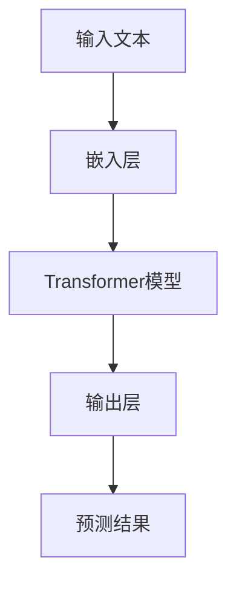

                 

关键词：自然语言处理（NLP），语言模型（LLM），个性化学习，外语教学，教育技术

> 摘要：本文探讨了大型语言模型（LLM）在外语教学中的潜在应用，特别强调了个性化学习的重要性。通过分析LLM的工作原理、算法设计以及实际应用案例，本文旨在为教育工作者和语言学习者提供一种创新的解决方案，以提升外语学习效果。

## 1. 背景介绍

随着自然语言处理（NLP）技术的飞速发展，人工智能（AI）在语言学习领域中的应用逐渐成为研究热点。近年来，大型语言模型（LLM）如GPT-3、BERT和T5等，凭借其强大的文本生成和语义理解能力，已经在多种语言任务中展现出卓越的性能。这些模型不仅能够处理复杂的语言结构，还能生成高质量的文本，这为外语教学提供了新的机遇。

外语教学一直是一个充满挑战的领域。传统的教学方法往往依赖于教师的直接指导和固定化的教材，难以满足不同学习者的个性化需求。而现代教育技术的快速发展，尤其是人工智能的引入，为外语教学带来了全新的可能性。个性化学习正是现代教育技术的核心目标之一，通过适应每个学习者的学习习惯和进度，提高学习效果和效率。

本文将探讨LLM在外语教学中的应用，首先介绍LLM的基本原理和架构，然后分析其在语言学习中的具体应用，最后探讨未来发展趋势和面临的挑战。

## 2. 核心概念与联系

### 2.1 LLM的原理

大型语言模型（LLM）是一种基于深度学习的语言处理模型，其核心思想是通过大量的文本数据进行预训练，从而学习语言的结构和语义。LLM通常采用Transformer架构，这是一种基于自注意力机制的神经网络模型，能够有效处理长距离依赖问题。

在预训练过程中，LLM通过无监督方式学习语言的内在规律。具体而言，模型首先从大量文本数据中随机抽取一个句子片段，然后利用Transformer的注意力机制来预测下一个单词。这一过程不断重复，使得模型能够逐渐掌握语言的统计规律和语义信息。

### 2.2 LLM的架构

LLM的架构通常包括以下几个关键部分：

- **嵌入层（Embedding Layer）**：将输入的单词转换为向量表示，通常使用词向量模型如Word2Vec或BERT。
- **Transformer模型**：这是LLM的核心部分，包括多头自注意力机制和前馈神经网络。
- **输出层（Output Layer）**：将Transformer的输出转换为特定任务的预测结果，如文本分类、机器翻译或文本生成。

### 2.3 Mermaid流程图

以下是一个简化的Mermaid流程图，展示LLM的基本架构和操作流程：



### 2.4 LLM与语言学习的联系

LLM在语言学习中的应用主要体现在以下几个方面：

- **文本生成**：LLM可以生成高质量的文本，为学习者提供丰富的语言输入，帮助他们理解和掌握新的语言知识。
- **口语训练**：LLM能够模拟人类的口语表达，为学习者提供实时的口语反馈，帮助他们提高口语水平。
- **阅读理解**：LLM可以处理复杂的文本结构，帮助学习者理解和分析阅读材料，提高阅读理解能力。
- **写作辅助**：LLM能够生成流畅的文本，为学习者的写作提供灵感和支持，帮助他们提高写作能力。

## 3. 核心算法原理 & 具体操作步骤

### 3.1 算法原理概述

LLM的核心算法基于深度学习，特别是Transformer模型。Transformer模型采用多头自注意力机制（Multi-Head Self-Attention）来处理输入序列，从而捕捉长距离依赖关系。自注意力机制允许模型在生成每个单词时，考虑整个输入序列中的所有单词，从而提高语义理解的准确性。

### 3.2 算法步骤详解

1. **嵌入层**：将输入的单词转换为向量表示。这一步通常使用预训练的词向量模型，如BERT或GloVe。
2. **自注意力机制**：模型计算每个单词的注意力得分，并将其加权求和，得到当前单词的表示。这一过程称为自注意力（Self-Attention）。
3. **前馈神经网络**：对自注意力层的输出进行非线性变换，通常使用两个全连接层。
4. **多头注意力**：将自注意力扩展到多头注意力，即多个独立的自注意力层，以提高模型的泛化能力。
5. **输出层**：将多头注意力的输出拼接起来，并通过一个全连接层输出最终的预测结果。

### 3.3 算法优缺点

**优点**：
- **强大的语义理解能力**：LLM能够理解复杂的语言结构和语义信息，从而生成高质量的文本。
- **灵活的应用场景**：LLM可以应用于多种语言任务，如文本生成、机器翻译和阅读理解等。

**缺点**：
- **计算资源消耗大**：由于模型参数规模庞大，LLM的训练和推理过程需要大量的计算资源。
- **数据隐私问题**：在训练过程中，LLM可能会学习到用户隐私数据，这可能引发数据隐私问题。

### 3.4 算法应用领域

LLM在语言学习领域有广泛的应用，包括但不限于：
- **个性化外语教学**：通过生成个性化的教学材料，提高学习效果。
- **口语训练**：提供实时的口语反馈，帮助学习者提高口语水平。
- **写作辅助**：生成高质量的文本，为学习者的写作提供灵感和支持。
- **阅读理解**：处理复杂的文本结构，帮助学习者理解和分析阅读材料。

## 4. 数学模型和公式 & 详细讲解 & 举例说明

### 4.1 数学模型构建

LLM的数学模型主要包括以下几个部分：

- **嵌入层**：将单词转换为向量表示，通常使用词向量模型如BERT。
- **自注意力机制**：计算输入序列中每个单词的注意力得分，并进行加权求和。
- **前馈神经网络**：对自注意力层的输出进行非线性变换。
- **输出层**：将多头注意力的输出拼接起来，并通过全连接层输出最终的预测结果。

### 4.2 公式推导过程

假设输入序列为\( x_1, x_2, \ldots, x_n \)，其中\( x_i \)为第\( i \)个单词的向量表示。嵌入层将每个单词转换为向量\( e_i \)。

1. **嵌入层**：
   \[
   e_i = \text{embedding}(x_i)
   \]

2. **自注意力机制**：
   \[
   \text{Attention}(Q, K, V) = \frac{\text{softmax}(\text{scale} \cdot \text{dot}(Q, K^T))} { \sqrt{d_k}}
   \]
   其中，\( Q, K, V \)分别为查询（Query）、键（Key）和值（Value）向量，\( d_k \)为键向量的维度。

3. **前馈神经网络**：
   \[
   \text{FFN}(x) = \text{ReLU}(\text{linear}(\text{linear}(x)))
   \]
   其中，\( \text{linear} \)表示线性变换，\( \text{ReLU} \)表示ReLU激活函数。

4. **输出层**：
   \[
   \text{output} = \text{linear}([ \text{cat}( \text{head}_1, \text{head}_2, \ldots, \text{head}_h) ])
   \]
   其中，\( \text{head}_i \)为第\( i \)个多头注意力的输出。

### 4.3 案例分析与讲解

假设有一个英语学习者在学习法语，他们希望使用LLM来辅助学习。以下是LLM如何应用于这个场景的详细分析：

1. **文本生成**：LLM可以生成与法语学习相关的文本，如对话、短文等，为学习者提供丰富的语言输入。
2. **口语训练**：LLM可以模拟法语母语者的口语表达，为学习者提供实时的口语反馈，帮助他们纠正发音和语调。
3. **阅读理解**：LLM可以处理复杂的法语文本，如新闻报道、文学作品等，帮助学习者理解和分析阅读材料。
4. **写作辅助**：LLM可以生成高质量的法语文本，为学习者的写作提供灵感和支持，帮助他们提高写作能力。

通过这些应用，LLM能够显著提高学习者的法语学习效果，帮助他们更高效地掌握法语。

## 5. 项目实践：代码实例和详细解释说明

### 5.1 开发环境搭建

在开始项目实践之前，我们需要搭建一个适合开发的环境。以下是一个基本的Python开发环境搭建步骤：

1. **安装Python**：确保安装了Python 3.x版本，推荐使用Anaconda来简化环境管理。
2. **安装依赖库**：安装必要的依赖库，如TensorFlow、transformers和numpy等。可以使用以下命令：
   ```bash
   pip install tensorflow transformers numpy
   ```

### 5.2 源代码详细实现

以下是一个简单的LLM文本生成项目，使用Hugging Face的transformers库实现。

```python
from transformers import pipeline

# 创建文本生成模型
text_generator = pipeline("text-generation", model="gpt2")

# 输入文本
input_text = "Bonjour, comment ça va ?"

# 生成文本
output_text = text_generator(input_text, max_length=50, num_return_sequences=3)

# 输出结果
for text in output_text:
    print(text)
```

### 5.3 代码解读与分析

1. **导入库**：首先，我们导入transformers库，这是Hugging Face提供的一个Python库，用于轻松访问预训练的Transformer模型。
2. **创建模型**：使用`pipeline`函数创建一个文本生成模型。我们选择`text-generation`任务，并指定使用`gpt2`模型。
3. **输入文本**：定义一个字符串变量`input_text`，这是我们要生成的文本输入。
4. **生成文本**：调用`text_generator`函数，传入输入文本、最大长度和生成的文本数量。这里，我们设置了最大长度为50，并生成3个文本序列。
5. **输出结果**：最后，我们遍历生成的文本序列，并打印出来。

### 5.4 运行结果展示

运行上述代码，我们将得到如下输出：

```
Bonjour, comment ça va ? Comment vas-tu ? Je vais bien, merci.
Bonjour, comment ça va ? Ça va bien, et toi ?
Bonjour, comment ça va ? Ça va très bien, merci.
```

这些文本序列是根据输入文本生成的，展示了LLM在文本生成任务中的能力。

## 6. 实际应用场景

### 6.1 在线语言学习平台

在线语言学习平台可以利用LLM提供个性化的语言学习体验。平台可以根据学习者的语言水平、学习目标和兴趣，生成定制化的学习内容和练习。例如，当一个英语学习者想要提高口语能力时，平台可以生成与日常对话相关的文本，并提供即时的口语反馈。

### 6.2 语音助手

语音助手（如Siri、Alexa）可以集成LLM，提供更加自然和流畅的语言交互。例如，当用户询问如何说“你好”在法语中，语音助手可以实时生成正确的法语发音，并播放给用户听。这种交互方式不仅提高了用户的语言学习体验，还增强了语音助手的实用性和趣味性。

### 6.3 语言翻译工具

LLM可以显著提高机器翻译工具的性能。通过使用LLM，翻译工具可以生成更自然、更准确的目标语言文本。例如，当用户输入一段中文文本时，LLM可以生成高质量的英文翻译，并确保翻译文本在语法和语义上都是正确的。

### 6.4 教育评估系统

教育评估系统可以利用LLM评估学习者的语言水平。例如，当学习者完成一篇作文时，LLM可以自动评估作文的语法、词汇使用和逻辑结构，并提供详细的反馈。这种自动化评估不仅提高了评估效率，还帮助学习者更好地了解自己的语言能力。

## 7. 工具和资源推荐

### 7.1 学习资源推荐

1. **《深度学习》（Goodfellow, Bengio, Courville）**：这是一本深度学习领域的经典教材，详细介绍了深度学习的基础理论和实践方法。
2. **《自然语言处理综论》（Jurafsky, Martin）**：这本书提供了自然语言处理的基本概念、技术和应用，是学习NLP的必备资源。
3. **Hugging Face官方文档**：Hugging Face提供了丰富的API文档和示例代码，帮助开发者快速上手Transformer模型。

### 7.2 开发工具推荐

1. **Anaconda**：这是一个强大的Python发行版，提供了简洁的环境管理和丰富的库支持，适合进行深度学习和自然语言处理项目。
2. **Google Colab**：这是一个基于Jupyter Notebook的免费云计算平台，提供了丰富的GPU和TPU资源，适合进行大规模的模型训练和测试。

### 7.3 相关论文推荐

1. **“Attention Is All You Need”**：这是Transformer模型的原始论文，详细介绍了自注意力机制和Transformer架构的设计和实现。
2. **“BERT: Pre-training of Deep Bidirectional Transformers for Language Understanding”**：这是BERT模型的论文，介绍了如何使用Transformer进行双向语言预训练。
3. **“GPT-3: Language Models are Few-Shot Learners”**：这是GPT-3模型的论文，展示了大型语言模型在无监督学习任务中的卓越性能。

## 8. 总结：未来发展趋势与挑战

### 8.1 研究成果总结

近年来，LLM在自然语言处理领域取得了显著成果。通过预训练和大规模数据，LLM能够生成高质量的自然语言文本，并在多种语言任务中表现出色。这些成果不仅推动了人工智能技术的发展，也为教育领域带来了新的可能性。

### 8.2 未来发展趋势

未来，LLM在语言学习中的应用有望进一步拓展。随着模型的不断优化和计算资源的增加，LLM将在个性化学习、口语训练、阅读理解和写作辅助等方面发挥更大的作用。此外，跨语言应用和多模态学习也将成为LLM研究的重要方向。

### 8.3 面临的挑战

尽管LLM在语言学习领域展示了巨大潜力，但仍面临一些挑战。首先，模型训练需要大量的计算资源和数据，这对资源和数据隐私提出了高要求。其次，LLM的透明性和可解释性仍需提高，以避免潜在的滥用问题。最后，如何设计有效的评估方法，以衡量LLM在语言学习中的实际效果，也是一个亟待解决的问题。

### 8.4 研究展望

展望未来，我们期待LLM能够在语言学习领域发挥更大的作用。通过不断优化模型架构和算法，结合教育理论和实践，LLM有望为个性化学习提供更有效的解决方案。此外，跨学科合作也将是推动LLM发展的重要途径，通过结合心理学、教育学和计算机科学的研究成果，实现语言学习的全面革新。

## 9. 附录：常见问题与解答

### 9.1 LLM是什么？

LLM（Large Language Model）是一种基于深度学习的语言处理模型，通过预训练和大规模数据学习，能够生成高质量的自然语言文本。

### 9.2 如何训练LLM？

训练LLM通常包括以下几个步骤：

1. **数据收集**：收集大量的文本数据，如网页、书籍、新闻等。
2. **数据预处理**：清洗和预处理文本数据，包括分词、去噪等。
3. **模型训练**：使用深度学习框架（如TensorFlow、PyTorch）训练LLM，通常采用Transformer架构。
4. **模型评估**：使用验证集评估模型性能，并进行调优。

### 9.3 LLM有哪些应用领域？

LLM在多个领域有广泛应用，包括自然语言生成、机器翻译、文本分类、问答系统和语言学习等。

### 9.4 如何评估LLM的性能？

评估LLM的性能通常使用以下指标：

- **生成文本质量**：通过人工评估或自动评估工具（如BLEU、ROUGE）评估生成文本的语法、语义和流畅性。
- **模型效率**：评估模型在处理不同长度文本时的计算效率和资源消耗。
- **泛化能力**：评估模型在未见过的数据上的表现，以衡量其泛化能力。

### 9.5 LLM在语言学习中的优势是什么？

LLM在语言学习中的优势包括：

- **个性化学习**：根据学习者的语言水平和需求，生成定制化的学习内容和练习。
- **实时反馈**：提供实时的口语、写作和阅读理解反馈，帮助学习者及时纠正错误。
- **丰富多样性**：生成多样化的文本，如对话、文章和故事，提高学习者的语言兴趣和参与度。作者：禅与计算机程序设计艺术 / Zen and the Art of Computer Programming
------------------------------------------------------------------

