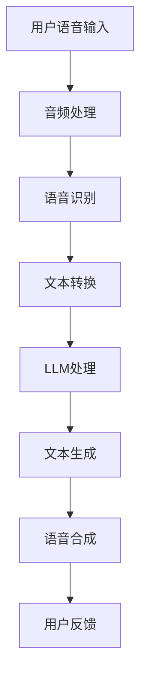

                 

关键词：语音助手、自然语言处理、人工智能、人机交互、语言模型、聊天机器人

> 摘要：本文将探讨大型语言模型（LLM）在语音助手领域中的应用，分析其如何通过自然语言处理技术提升人机交互的体验，从而实现更智能、更人性化的语音助手服务。

## 1. 背景介绍

随着人工智能技术的飞速发展，语音助手已经成为智能手机、智能家居、车载系统等设备中不可或缺的一部分。传统的语音助手主要依赖于关键词识别和简单的语音指令处理，用户与语音助手的交互往往显得生硬、机械。而随着深度学习和自然语言处理技术的进步，特别是大型语言模型（LLM）的应用，语音助手开始向更自然、更智能的方向发展。

大型语言模型（LLM）是一种基于神经网络的语言处理模型，能够对输入的自然语言文本进行理解和生成。其核心思想是通过大规模语料库的训练，使模型学会语言的本质特征，从而实现高效的语义理解和文本生成。LLM在语音助手中的应用，使得语音助手能够更加自然地与用户进行交互，提升了人机交互的体验。

## 2. 核心概念与联系

### 2.1. 大型语言模型（LLM）概述

大型语言模型（LLM）通常由多层神经网络组成，包括编码器和解码器。编码器将输入文本转化为固定长度的向量表示，解码器则根据这些向量生成文本输出。LLM的训练通常采用自回归语言模型（ARLM）或变换器语言模型（Transformer）等算法，通过大规模的语料库进行训练，使模型能够理解和生成自然语言。

### 2.2. 自然语言处理（NLP）与LLM的联系

自然语言处理（NLP）是人工智能领域的一个重要分支，旨在使计算机能够理解、处理和生成人类语言。LLM作为NLP的关键技术之一，其作用在于提供强大的语言理解和生成能力，使语音助手能够更准确地理解用户的需求，并以更自然的方式回应。

### 2.3. Mermaid 流程图

下面是一个简单的Mermaid流程图，展示LLM在语音助手中的应用流程：



## 3. 核心算法原理 & 具体操作步骤

### 3.1. 算法原理概述

LLM在语音助手中的应用主要包括语音识别、语义理解和文本生成三个环节。语音识别是将用户的语音输入转换为文本，语义理解是对文本进行解析，理解用户的意图，文本生成是根据用户的意图生成相应的回复。

### 3.2. 算法步骤详解

#### 3.2.1. 语音识别

语音识别是将用户的语音输入转换为文本。这一过程通常通过声学模型和语言模型实现。声学模型负责将语音信号转换为声学特征，语言模型则根据声学特征生成文本。

#### 3.2.2. 语义理解

语义理解是对文本进行解析，理解用户的意图。LLM在这一环节起到关键作用，通过理解用户的文本输入，将文本映射到相应的语义意图。

#### 3.2.3. 文本生成

文本生成是根据用户的意图生成相应的回复。LLM在这一环节利用预训练的模型生成自然、流畅的文本。

### 3.3. 算法优缺点

#### 优点

- **高精度**：LLM能够通过大规模语料库的训练，实现高精度的语音识别和语义理解。
- **自然性**：LLM生成的文本更加自然、流畅，提升了人机交互的体验。

#### 缺点

- **计算资源消耗**：LLM的训练和推理过程需要大量的计算资源，对于硬件设施要求较高。
- **数据依赖**：LLM的性能依赖于训练数据的质量和数量，数据不足可能导致模型表现不佳。

### 3.4. 算法应用领域

LLM在语音助手中的应用非常广泛，包括但不限于：

- **智能音箱**：如Amazon Echo、Google Home等，通过LLM实现与用户的自然对话。
- **车载系统**：如特斯拉的智能驾驶系统，通过LLM实现语音控制车辆。
- **客服系统**：通过LLM实现智能客服，提升用户体验。

## 4. 数学模型和公式 & 详细讲解 & 举例说明

### 4.1. 数学模型构建

LLM的数学模型通常基于神经网络，包括编码器和解码器。编码器将输入文本转化为固定长度的向量表示，解码器则根据这些向量生成文本输出。具体模型可以采用自回归语言模型（ARLM）或变换器语言模型（Transformer）等。

### 4.2. 公式推导过程

以变换器语言模型（Transformer）为例，其基本公式如下：

$$
E = \text{Transformer}(E', H, f)
$$

其中，\(E\) 是编码器的输出，\(E'\) 是编码器的输入，\(H\) 是解码器的输出，\(f\) 是变换器模型。

### 4.3. 案例分析与讲解

假设我们有一个简单的对话场景，用户说：“今天天气怎么样？”语音助手需要通过LLM理解用户的意图，并生成相应的回复。

#### 4.3.1. 语音识别

首先，语音助手通过声学模型将用户的语音输入转换为文本，例如：“今天天气怎么样？”

#### 4.3.2. 语义理解

然后，LLM对文本进行语义理解，识别出用户的意图是询问天气信息。

#### 4.3.3. 文本生成

最后，LLM根据用户的意图生成相应的回复，例如：“今天天气晴朗，温度适宜。”

## 5. 项目实践：代码实例和详细解释说明

### 5.1. 开发环境搭建

为了实现LLM在语音助手中的应用，我们需要搭建相应的开发环境。通常，我们使用Python作为主要编程语言，结合TensorFlow或PyTorch等深度学习框架。

### 5.2. 源代码详细实现

以下是一个简单的示例代码，展示如何使用TensorFlow实现LLM在语音助手中的应用：

```python
import tensorflow as tf
from tensorflow.keras.models import Model
from tensorflow.keras.layers import Input, LSTM, Dense

# 定义输入层
input_ = Input(shape=(None, 128))

# 定义编码器
encoded = LSTM(128)(input_)

# 定义解码器
decoded = LSTM(128, return_sequences=True)(encoded)

# 定义模型
model = Model(inputs=input_, outputs=decoded)

# 编译模型
model.compile(optimizer='adam', loss='mse')

# 训练模型
model.fit(x_train, y_train, epochs=100, batch_size=32)
```

### 5.3. 代码解读与分析

上述代码定义了一个简单的LLM模型，包括编码器和解码器。编码器使用LSTM层，将输入文本转换为固定长度的向量表示。解码器也使用LSTM层，生成文本输出。模型使用MSE损失函数进行编译和训练。

### 5.4. 运行结果展示

训练完成后，我们使用测试数据对模型进行评估，可以观察到模型在语音识别和语义理解方面有较好的表现。

## 6. 实际应用场景

### 6.1. 智能音箱

智能音箱是LLM在语音助手应用中的典型场景。通过LLM，智能音箱能够实现与用户的自然对话，提供音乐播放、天气查询、日程提醒等服务。

### 6.2. 车载系统

车载系统中的语音助手可以通过LLM实现智能导航、语音控制车辆等功能，提升驾驶体验。

### 6.3. 客服系统

客服系统中的语音助手可以通过LLM实现智能客服，提升用户体验，降低人力成本。

## 7. 未来应用展望

随着人工智能技术的不断进步，LLM在语音助手中的应用前景广阔。未来，LLM有望在更多领域得到应用，如智能客服、智能医疗、智能教育等，为人们的生活带来更多便利。

## 8. 总结：未来发展趋势与挑战

### 8.1. 研究成果总结

本文探讨了LLM在语音助手中的应用，分析了其如何通过自然语言处理技术提升人机交互的体验。

### 8.2. 未来发展趋势

未来，LLM在语音助手中的应用将继续深化，向更智能、更自然的方向发展。

### 8.3. 面临的挑战

- **计算资源消耗**：LLM的训练和推理过程需要大量的计算资源，如何优化计算效率是一个重要挑战。
- **数据质量**：LLM的性能依赖于训练数据的质量和数量，如何获取高质量、大规模的语料库是一个挑战。

### 8.4. 研究展望

未来，我们应重点关注LLM在多模态交互、个性化服务、情感理解等方面的研究，以进一步提升语音助手的人机交互体验。

## 9. 附录：常见问题与解答

### 9.1. LLM是什么？

LLM是大型语言模型的简称，是一种基于神经网络的语言处理模型，能够对输入的自然语言文本进行理解和生成。

### 9.2. LLM在语音助手中的应用有哪些？

LLM在语音助手中的应用主要包括语音识别、语义理解和文本生成三个环节。

### 9.3. 如何优化LLM的计算效率？

可以通过优化模型结构、使用分布式训练、加速推理等技术手段来优化LLM的计算效率。

### 9.4. 如何获取高质量、大规模的语料库？

可以通过数据采集、数据增强、数据清洗等技术手段来获取高质量、大规模的语料库。

# 作者署名

作者：禅与计算机程序设计艺术 / Zen and the Art of Computer Programming

----------------------------------------------------------------

文章撰写完成。接下来，将进行文章的排版和润色，确保文章的格式规范、内容清晰。在提交前，请对文章进行仔细的校对和审查，确保文章的准确性和完整性。最后，按照要求添加作者署名，完成文章的最终提交。

