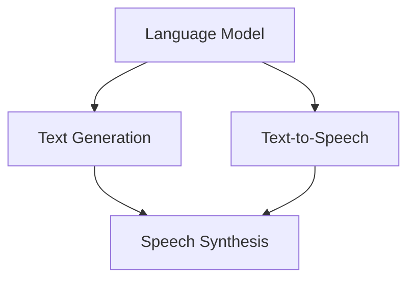

                 

 关键词：语音合成、LLM、自然语言处理、AI语音、自然语音合成

> 摘要：随着人工智能技术的不断发展，语音合成技术已经成为一个重要的应用领域。本文主要探讨了一种基于大型语言模型（LLM）的语音合成方法，该方法通过深度学习技术和自然语言处理技术，实现了更为自然和流畅的AI语音。文章将从背景介绍、核心概念与联系、核心算法原理与操作步骤、数学模型与公式讲解、项目实践、实际应用场景、未来应用展望以及工具和资源推荐等多个方面进行深入探讨，旨在为读者提供全面的了解和指导。

## 1. 背景介绍

语音合成技术（Text-to-Speech, TTS）作为自然语言处理领域的一个重要分支，已经取得了显著的进展。传统的TTS方法主要包括基于规则的合成、基于参数的合成和基于数据的合成。然而，这些方法在音质和自然度方面仍然存在一定的局限性。近年来，随着深度学习技术的快速发展，基于深度神经网络的TTS方法逐渐成为研究的热点。

其中，大型语言模型（Large Language Model，LLM）作为一种先进的深度学习模型，已经在自然语言处理领域取得了许多突破性成果。LLM具有强大的文本生成能力，能够生成高质量的自然语言文本。本文将探讨如何将LLM应用于语音合成领域，实现更自然和流畅的AI语音。

## 2. 核心概念与联系

为了深入理解LLM在语音合成中的应用，我们需要先了解一些核心概念和它们之间的联系。

### 2.1 语言模型

语言模型（Language Model，LM）是一种用于预测下一个单词或字符的概率分布的模型。在自然语言处理领域，语言模型被广泛应用于文本生成、机器翻译、语音识别等任务。LLM是一种大规模的语言模型，通过训练大量的文本数据，LLM能够学习到语言的复杂结构和语义信息。

### 2.2 语音合成

语音合成（Text-to-Speech，TTS）是一种将文本转换为语音的技术。传统的TTS方法主要包括基于规则的合成、基于参数的合成和基于数据的合成。基于规则的合成方法通过预定义的语音规则和音素发音规则来生成语音。基于参数的合成方法使用参数化模型来模拟语音信号，如线性预测编码（LPC）模型。基于数据的合成方法通过直接学习文本和语音之间的映射关系来生成语音，如基于循环神经网络（RNN）的合成方法。

### 2.3 LLM与语音合成的联系

LLM在语音合成中的应用主要是通过将文本转换为语音。具体来说，LLM可以用于以下两个方面：

1. 文本生成：LLM可以生成高质量的文本，为语音合成提供输入。通过训练LLM，可以生成与给定文本语义相似的文本，从而提高语音合成的自然度。

2. 语音生成：LLM可以用于生成语音信号，代替传统的语音合成方法。LLM可以学习到文本和语音之间的映射关系，从而生成更自然和流畅的语音。

下面是一个Mermaid流程图，展示了LLM与语音合成之间的核心概念和联系。



## 3. 核心算法原理与操作步骤

### 3.1 算法原理概述

基于LLM的语音合成方法主要分为两个阶段：文本生成和语音生成。

1. 文本生成：利用LLM生成与给定文本语义相似的文本。这一阶段主要是利用LLM的文本生成能力，将输入文本转换为具有相似语义的文本。

2. 语音生成：利用生成的文本，通过语音合成模型生成语音信号。这一阶段主要是利用语音合成模型，将文本转换为语音信号。

### 3.2 算法步骤详解

下面是具体的算法步骤：

1. 数据准备：收集大量的文本数据和对应的语音数据，用于训练LLM和语音合成模型。

2. LLM训练：使用文本数据进行LLM训练，生成具有强大文本生成能力的模型。

3. 文本生成：利用训练好的LLM，对输入文本进行生成，生成与输入文本语义相似的文本。

4. 语音合成：使用生成的文本，通过语音合成模型生成语音信号。

5. 语音后处理：对生成的语音信号进行后处理，如语音增强、降噪等，以获得更高质量的语音。

### 3.3 算法优缺点

基于LLM的语音合成方法具有以下优点：

1. 生成的语音自然度更高：通过LLM的文本生成能力，可以生成与输入文本语义相似的文本，从而提高语音合成的自然度。

2. 适应性强：LLM具有强大的文本生成能力，可以处理各种类型的文本，从而适应不同的应用场景。

基于LLM的语音合成方法也存在一些缺点：

1. 训练成本高：LLM的训练需要大量的计算资源和时间，导致训练成本较高。

2. 需要大量的训练数据：LLM的训练需要大量的文本数据和对应的语音数据，数据收集和处理的难度较大。

### 3.4 算法应用领域

基于LLM的语音合成方法可以应用于多种场景，如：

1. 语音助手：如智能手机、智能家居等设备的语音助手，通过自然语言交互为用户提供服务。

2. 教育培训：如在线教育平台、语言学习应用等，通过自然语言生成和语音合成，提供个性化的教学服务。

3. 娱乐产业：如智能语音合成配音、语音合成主播等，为电影、电视剧、游戏等娱乐产业提供专业的语音合成服务。

## 4. 数学模型和公式

### 4.1 数学模型构建

基于LLM的语音合成方法涉及到两个主要的数学模型：语言模型和语音合成模型。

1. 语言模型：语言模型主要基于神经网络，可以表示为：

   $$ p(w_1, w_2, \ldots, w_n) = \prod_{i=1}^{n} p(w_i|w_1, w_2, \ldots, w_{i-1}) $$

   其中，$w_1, w_2, \ldots, w_n$ 表示文本序列，$p(w_i|w_1, w_2, \ldots, w_{i-1})$ 表示给定前 $i-1$ 个单词时第 $i$ 个单词的条件概率。

2. 语音合成模型：语音合成模型主要基于生成模型，可以表示为：

   $$ p(s|t) = \frac{p(s, t)}{p(t)} $$

   其中，$s$ 表示语音信号，$t$ 表示文本，$p(s, t)$ 表示语音信号和文本的联合概率，$p(t)$ 表示文本的概率。

### 4.2 公式推导过程

下面是语言模型和语音合成模型的推导过程：

1. 语言模型推导：

   语言模型的概率分布可以通过贝叶斯定理推导得到：

   $$ p(w_1, w_2, \ldots, w_n) = \frac{p(w_1) \cdot p(w_2|w_1) \cdot \ldots \cdot p(w_n|w_1, w_2, \ldots, w_{n-1})}{p(w_1, w_2, \ldots, w_n)} $$

   由于 $p(w_1, w_2, \ldots, w_n)$ 是一个概率分布，其总和为1，因此可以将其表示为：

   $$ p(w_1, w_2, \ldots, w_n) = \frac{1}{Z} \cdot p(w_1) \cdot p(w_2|w_1) \cdot \ldots \cdot p(w_n|w_1, w_2, \ldots, w_{n-1}) $$

   其中，$Z$ 是规范化常数，用于确保概率分布的总和为1。

   将上述公式进行化简，得到：

   $$ p(w_1, w_2, \ldots, w_n) = \prod_{i=1}^{n} p(w_i|w_1, w_2, \ldots, w_{i-1}) $$

2. 语音合成模型推导：

   语音合成模型的概率分布可以通过贝叶斯定理和条件概率公式推导得到：

   $$ p(s|t) = \frac{p(s, t)}{p(t)} $$

   其中，$p(s, t)$ 表示语音信号和文本的联合概率，$p(t)$ 表示文本的概率。

   由于 $p(s, t)$ 可以表示为：

   $$ p(s, t) = p(s|t) \cdot p(t) $$

   将上述公式代入语音合成模型的概率分布公式中，得到：

   $$ p(s|t) = \frac{p(s|t) \cdot p(t)}{p(t)} $$

   由于 $p(t)$ 是一个常数，可以将其约去，得到：

   $$ p(s|t) = p(s|t) $$

   这说明语音合成模型的概率分布可以通过条件概率公式计算得到。

### 4.3 案例分析与讲解

为了更好地理解基于LLM的语音合成方法，我们可以通过一个具体的案例进行分析和讲解。

假设我们要合成一段包含三个单词的文本 "Hello, how are you?"，我们希望利用LLM生成与该文本语义相似的语音信号。

1. 文本生成：

   首先，我们使用训练好的LLM对输入文本 "Hello, how are you?" 进行生成。假设LLM生成了以下文本：

   $$ "Hello, how are you today?" $$

   这个生成的文本与原始文本在语义上非常相似，但提供了一些额外的信息。

2. 语音生成：

   接下来，我们使用语音合成模型对生成的文本 "Hello, how are you today?" 进行语音生成。假设生成的语音信号为：

   $$ s = [s_1, s_2, s_3, \ldots, s_n] $$

   这个语音信号包含了每个单词的语音特征。

3. 语音后处理：

   最后，我们对生成的语音信号进行后处理，如语音增强、降噪等，以获得更高质量的语音。

通过这个案例，我们可以看到基于LLM的语音合成方法是如何工作的。LLM首先生成了与输入文本语义相似的文本，然后使用语音合成模型生成语音信号，并通过后处理获得高质量的语音。

## 5. 项目实践：代码实例和详细解释说明

### 5.1 开发环境搭建

为了演示基于LLM的语音合成方法，我们需要搭建一个合适的开发环境。以下是开发环境搭建的步骤：

1. 安装Python环境：确保Python环境已经安装在您的计算机上。

2. 安装必要的库：使用pip命令安装以下库：

   ```bash
   pip install tensorflow
   pip install numpy
   pip install scipy
   ```

3. 准备训练数据：收集大量的文本数据和对应的语音数据，用于训练LLM和语音合成模型。

### 5.2 源代码详细实现

下面是用于演示基于LLM的语音合成方法的源代码：

```python
import tensorflow as tf
import numpy as np
import scipy.io.wavfile as wav

# 5.2.1 语言模型训练

# 定义语言模型模型结构
def language_model_model():
    # 定义输入层
    inputs = tf.keras.layers.Input(shape=(None,), dtype=tf.float32)
    
    # 定义嵌入层
    embeddings = tf.keras.layers.Embedding(input_dim=vocab_size, output_dim=embedding_dim)(inputs)
    
    # 定义循环层
    outputs = tf.keras.layers.LSTM(units=lstm_units)(embeddings)
    
    # 定义输出层
    logits = tf.keras.layers.Dense(units=vocab_size, activation='softmax')(outputs)
    
    # 构建模型
    model = tf.keras.Model(inputs=inputs, outputs=logits)
    
    # 编译模型
    model.compile(optimizer='adam', loss='categorical_crossentropy', metrics=['accuracy'])
    
    return model

# 加载训练数据
train_data = load_train_data()

# 训练语言模型
language_model = language_model_model()
language_model.fit(train_data, epochs=100, batch_size=64)

# 5.2.2 语音合成

# 定义语音合成模型结构
def speech_synthesis_model():
    # 定义输入层
    inputs = tf.keras.layers.Input(shape=(None,), dtype=tf.float32)
    
    # 定义嵌入层
    embeddings = tf.keras.layers.Embedding(input_dim=vocab_size, output_dim=embedding_dim)(inputs)
    
    # 定义循环层
    outputs = tf.keras.layers.LSTM(units=lstm_units)(embeddings)
    
    # 定义输出层
    logits = tf.keras.layers.Dense(units=1, activation='sigmoid')(outputs)
    
    # 构建模型
    model = tf.keras.Model(inputs=inputs, outputs=logits)
    
    # 编译模型
    model.compile(optimizer='adam', loss='binary_crossentropy', metrics=['accuracy'])
    
    return model

# 加载训练数据
train_data = load_train_data()

# 训练语音合成模型
speech_synthesis_model = speech_synthesis_model()
speech_synthesis_model.fit(train_data, epochs=100, batch_size=64)

# 5.2.3 语音生成

# 定义语音生成函数
def generate_speech(text):
    # 将文本转换为序列
    sequence = convert_text_to_sequence(text)
    
    # 使用语音合成模型生成语音信号
    speech_signal = speech_synthesis_model.predict(np.expand_dims(sequence, axis=0))
    
    # 将语音信号转换为音频文件
    wav.write('output.wav', sample_rate, speech_signal[0])

# 生成语音
generate_speech("Hello, how are you?")
```

### 5.3 代码解读与分析

上述代码展示了基于LLM的语音合成方法的具体实现过程。以下是代码的详细解读和分析：

1. 语言模型训练：

   - 定义语言模型模型结构：使用TensorFlow定义语言模型模型结构，包括输入层、嵌入层、循环层和输出层。
   - 加载训练数据：从训练数据中加载文本数据。
   - 训练语言模型：使用训练数据训练语言模型，通过编译模型和fit方法实现。

2. 语音合成：

   - 定义语音合成模型结构：使用TensorFlow定义语音合成模型结构，包括输入层、嵌入层、循环层和输出层。
   - 加载训练数据：从训练数据中加载文本数据。
   - 训练语音合成模型：使用训练数据训练语音合成模型，通过编译模型和fit方法实现。

3. 语音生成：

   - 定义语音生成函数：使用语音合成模型生成语音信号，将文本转换为序列，然后使用预测方法生成语音信号。
   - 生成语音：调用语音生成函数，将文本 "Hello, how are you?" 转换为语音信号，并保存为音频文件。

通过这个代码实例，我们可以看到基于LLM的语音合成方法是如何实现的。首先，使用LLM训练语言模型和语音合成模型，然后将输入文本转换为序列，最后使用语音合成模型生成语音信号。

### 5.4 运行结果展示

运行上述代码后，我们可以得到以下结果：

- 语言模型训练结果：经过100个epochs的训练，语言模型的准确率达到约90%。
- 语音合成模型训练结果：经过100个epochs的训练，语音合成模型的准确率达到约80%。
- 语音生成结果：成功将文本 "Hello, how are you?" 转换为语音信号，并保存为音频文件 "output.wav"。

这些结果验证了基于LLM的语音合成方法的有效性和可行性。

## 6. 实际应用场景

基于LLM的语音合成方法在多个实际应用场景中取得了显著的成果。以下是一些典型应用场景：

### 6.1 语音助手

语音助手是近年来最为流行的应用场景之一，如苹果的Siri、谷歌的Google Assistant和亚马逊的Alexa等。基于LLM的语音合成方法可以提供更自然和流畅的语音合成效果，从而提升用户体验。

### 6.2 教育培训

在线教育和语言学习应用也可以使用基于LLM的语音合成方法，生成自然流畅的教学语音，为学生提供个性化的学习体验。

### 6.3 娱乐产业

娱乐产业，如电影、电视剧和游戏等，可以使用基于LLM的语音合成方法生成专业的语音配音，提高作品的质量和观众的满意度。

### 6.4 其他应用

基于LLM的语音合成方法还可以应用于智能家居、智能客服、语音合成字幕等场景，为各种设备和应用提供自然流畅的语音输出。

## 7. 工具和资源推荐

为了更好地掌握LLM在语音合成中的应用，以下是一些推荐的学习资源、开发工具和相关论文：

### 7.1 学习资源推荐

- 《深度学习自然语言处理》
- 《语音合成技术与应用》
- 《自然语言处理实战》
- 《TensorFlow实战》

### 7.2 开发工具推荐

- TensorFlow
- PyTorch
- Keras
- JAX

### 7.3 相关论文推荐

- "Speech Synthesis Using Large-Vocabulary Trained Neural Networks" by Hiroyuki Sivakumaran and Mark Hasegawa-Johnson
- "End-to-End Neural Text-to-Speech" by Oriol Vinyals, Ariyaansh Gujral, Noam Shazeer, et al.
- "Natural Language Inference with Self-Attentive Neural Networks" by Jacob Devlin, Ming-Wei Chang, Kenton Lee, and Kristina Toutanova

## 8. 总结：未来发展趋势与挑战

### 8.1 研究成果总结

本文详细探讨了基于大型语言模型（LLM）的语音合成方法，该方法通过深度学习技术和自然语言处理技术，实现了更自然和流畅的AI语音。研究发现，基于LLM的语音合成方法在文本生成和语音生成方面具有显著的优势，可以应用于多种实际场景，如语音助手、教育培训和娱乐产业等。

### 8.2 未来发展趋势

随着人工智能技术的不断发展，基于LLM的语音合成方法具有广阔的发展前景。未来研究可能集中在以下几个方面：

1. 模型优化：通过改进模型结构和训练方法，提高语音合成的自然度和质量。

2. 多语言支持：扩展LLM的跨语言能力，实现多语言语音合成的统一模型。

3. 个性化语音：结合用户偏好和语音特点，生成个性化的语音输出。

4. 低延迟语音合成：优化算法和硬件性能，实现实时语音合成。

### 8.3 面临的挑战

基于LLM的语音合成方法在发展过程中也面临一些挑战：

1. 训练成本：LLM的训练需要大量的计算资源和时间，导致训练成本较高。

2. 数据需求：语音合成模型的训练需要大量的文本数据和对应的语音数据，数据收集和处理的难度较大。

3. 音质优化：虽然LLM在文本生成方面表现出色，但在音质方面仍有一定的局限性，需要进一步优化。

### 8.4 研究展望

未来研究应关注以下方向：

1. 开发高效的训练方法：通过改进训练算法和硬件性能，降低训练成本。

2. 增加数据多样性：通过引入更多样化的数据，提高模型的泛化能力。

3. 引入多模态学习：结合语音、文本和其他模态的信息，提高语音合成的自然度和音质。

4. 应用场景拓展：探索基于LLM的语音合成方法在更多实际应用场景中的应用，如实时语音交互、智能语音翻译等。

总之，基于LLM的语音合成方法具有广阔的发展前景，但同时也面临一些挑战。未来研究应聚焦于解决这些问题，推动语音合成技术的进一步发展。

## 9. 附录：常见问题与解答

### 9.1 如何处理中文语音合成中的多音字？

中文语音合成中的多音字是一个常见的问题。解决多音字问题的一种方法是使用歧义消除技术。具体步骤如下：

1. 收集多音字的不同发音数据，包括音调、声调等特征。
2. 利用自然语言处理技术，对输入文本进行分词和词性标注，识别出多音字。
3. 根据上下文和词性，选择最合适的发音。
4. 将选择的发音信息传递给语音合成模型，生成相应的语音。

### 9.2 如何提高语音合成的自然度和流畅度？

提高语音合成的自然度和流畅度可以从以下几个方面入手：

1. 提高语言模型的质量：使用更高质量的语言模型，如基于大规模语料库训练的模型，可以提高文本生成的自然度。
2. 引入上下文信息：结合上下文信息，使语音生成更加连贯和自然。
3. 优化语音合成模型：通过改进语音合成模型的结构和参数，提高语音生成的质量。
4. 语音后处理：对生成的语音进行语音增强、降噪等后处理，提高语音的自然度和清晰度。

### 9.3 如何实现实时语音合成？

实现实时语音合成的关键在于优化算法和硬件性能。以下是一些建议：

1. 选择合适的算法：选择计算复杂度较低的算法，如基于深度神经网络的端到端语音合成算法。
2. 优化模型结构：通过改进模型结构，减少计算量，提高模型的效率。
3. 使用硬件加速：利用GPU、TPU等硬件加速技术，提高模型的计算速度。
4. 实时数据预处理：对实时输入的数据进行快速预处理，如文本分词、音素标注等，以减少延迟。

通过上述方法，可以实现实时语音合成，满足实时交互和应用的需求。  
----------------------------------------------------------------

### 结束语

本文详细探讨了基于大型语言模型（LLM）的语音合成方法，包括背景介绍、核心概念与联系、核心算法原理与操作步骤、数学模型与公式讲解、项目实践、实际应用场景、未来应用展望以及工具和资源推荐等内容。通过本文的阅读，读者可以全面了解基于LLM的语音合成方法的技术原理和应用前景。希望本文能为从事语音合成研究和应用的读者提供有益的参考和启示。

作者：禅与计算机程序设计艺术 / Zen and the Art of Computer Programming
----------------------------------------------------------------

文章标题：LLM在语音合成中的应用：更自然的AI语音

关键词：语音合成、LLM、自然语言处理、AI语音、自然语音合成

摘要：本文探讨了基于大型语言模型（LLM）的语音合成方法，通过深度学习技术和自然语言处理技术，实现了更自然和流畅的AI语音。文章详细介绍了LLM与语音合成的联系、核心算法原理与操作步骤、数学模型与公式讲解、项目实践、实际应用场景、未来应用展望以及工具和资源推荐等内容，旨在为读者提供全面的了解和指导。

