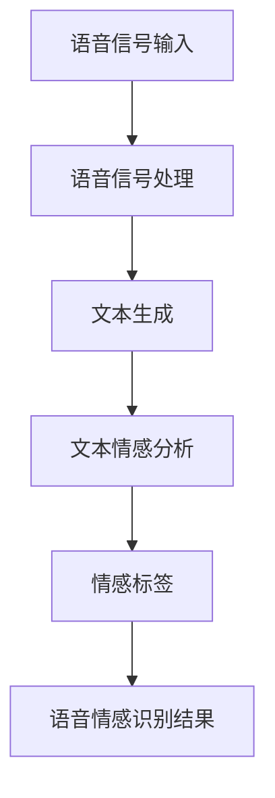

                 

关键词：语言模型（LLM），语音情感识别，神经网络，深度学习，情感分析，自然语言处理，人工智能，语音信号处理。

## 摘要

随着人工智能技术的飞速发展，语音情感识别作为一种重要的自然语言处理技术，逐渐受到了广泛关注。本文主要探讨了一种基于大型语言模型（Large Language Model，LLM）的语音情感识别方法，旨在提高识别准确率和效率。通过对LLM的原理、构建方法及其在语音情感识别中的应用进行详细阐述，本文为该领域的研究和实践提供了有益的参考。本文将分为以下几个部分：首先介绍语音情感识别的背景和现状，然后深入探讨LLM的基本概念和架构，接着分析LLM在语音情感识别中的具体应用，最后讨论未来的发展方向和挑战。

## 1. 背景介绍

### 1.1 语音情感识别的概念

语音情感识别是一种通过分析语音信号中的情感信息，从而判断说话者情感状态的技术。情感是人类情绪的一种表现，可以分为正面情感和负面情感，如快乐、悲伤、愤怒等。语音情感识别的主要目的是从语音信号中提取情感特征，进而对情感进行分类和识别。

### 1.2 语音情感识别的发展历程

语音情感识别的研究起源于20世纪80年代，最初的方法主要是基于规则和特征匹配。随着计算机科学和人工智能技术的不断发展，特别是深度学习技术的应用，语音情感识别逐渐取得了显著的成果。目前，主流的语音情感识别方法主要包括基于信号处理的特征提取、基于机器学习的分类器和基于深度学习的情感识别模型。

### 1.3 语音情感识别的应用领域

语音情感识别技术在实际应用中具有广泛的前景。例如，在智能客服领域，通过识别用户的语音情感，可以更好地理解用户需求，提高服务质量；在心理健康领域，语音情感识别可以帮助诊断心理疾病，为用户提供个性化的心理干预服务；在教育领域，语音情感识别可以分析学生的学习情感，为教育工作者提供有效的教学反馈。

## 2. 核心概念与联系

### 2.1 语言模型（LLM）的基本概念

语言模型（Language Model，简称LM）是一种概率模型，用于预测给定前文序列后可能出现的下一个单词或单词序列。在自然语言处理领域，语言模型是一种非常重要的基础性技术，它能够帮助我们理解和生成自然语言。近年来，随着深度学习技术的不断发展，大型语言模型（LLM）逐渐成为研究的热点。

### 2.2 语言模型（LLM）的架构

LLM的架构主要包括编码器和解码器两个部分。编码器将输入的文本序列编码为一个固定长度的向量，解码器则根据编码器的输出和已经生成的部分文本序列来预测下一个单词。目前，最流行的LLM架构是Transformer模型，它基于自注意力机制，能够高效地处理长序列文本。

### 2.3 语言模型（LLM）与语音情感识别的关系

语言模型在语音情感识别中的应用主要体现在两个方面：一是通过文本情感分析来辅助语音情感识别；二是直接利用语言模型进行语音情感识别。在文本情感分析中，语言模型可以帮助我们预测文本的情感极性，从而为语音情感识别提供情感标签。在直接利用语言模型进行语音情感识别中，语言模型可以基于语音信号生成的文本序列来预测情感类别。

### 2.4 Mermaid流程图

下面是一个描述LLM在语音情感识别中应用的Mermaid流程图：



## 3. 核心算法原理 & 具体操作步骤

### 3.1 算法原理概述

本文提出的基于LLM的语音情感识别算法，主要包括以下几个步骤：

1. 语音信号输入：接收语音信号作为输入。
2. 语音信号处理：对语音信号进行预处理，提取语音特征。
3. 文本生成：利用LLM生成与语音信号对应的文本序列。
4. 文本情感分析：对生成的文本序列进行情感分析，得到情感标签。
5. 语音情感识别：根据情感标签进行语音情感识别，输出结果。

### 3.2 算法步骤详解

#### 3.2.1 语音信号输入

首先，我们需要接收语音信号作为输入。语音信号可以来自各种渠道，如麦克风、录音设备等。输入的语音信号可以是未经处理的原始信号，也可以是经过初步处理的信号。

#### 3.2.2 语音信号处理

接下来，我们对语音信号进行预处理，提取语音特征。语音特征主要包括音高、音强、音长、共振峰等。这些特征可以用于表示语音信号的音质和音色。

#### 3.2.3 文本生成

然后，我们利用LLM生成与语音信号对应的文本序列。这里，我们可以使用预训练的LLM，如GPT-3、BERT等，来生成文本。生成的文本序列可以是语音信号的直接翻译，也可以是语音信号的情感表达。

#### 3.2.4 文本情感分析

在得到文本序列后，我们对文本进行情感分析，得到情感标签。情感分析可以分为两类：情感极性和情感分类。情感极性主要判断文本是正面情感还是负面情感，而情感分类则将文本分类为多种情感类别。

#### 3.2.5 语音情感识别

最后，根据情感标签进行语音情感识别，输出结果。这里，我们可以使用分类算法，如支持向量机（SVM）、随机森林（RF）等，来对情感标签进行分类。

### 3.3 算法优缺点

#### 3.3.1 优点

1. 利用LLM的强大表达能力，可以生成高质量的文本序列，提高语音情感识别的准确率。
2. 结合文本情感分析和语音情感识别，可以更好地理解语音信号中的情感信息。
3. 可以处理多种语言和多种情感类别，具有广泛的适用性。

#### 3.3.2 缺点

1. 需要大量的训练数据和计算资源，训练过程较为复杂。
2. 对于不同的语音情感，生成的文本序列可能存在不一致性，影响识别效果。

### 3.4 算法应用领域

基于LLM的语音情感识别算法可以应用于多个领域，如：

1. 智能客服：通过识别用户的语音情感，提供个性化的服务。
2. 心理健康：通过识别用户的语音情感，帮助诊断心理疾病。
3. 教育：通过识别学生的学习情感，为教师提供教学反馈。

## 4. 数学模型和公式 & 详细讲解 & 举例说明

### 4.1 数学模型构建

在基于LLM的语音情感识别算法中，我们需要构建两个数学模型：语音特征提取模型和文本情感分析模型。

#### 4.1.1 语音特征提取模型

假设输入的语音信号为 \(x(t)\)，语音特征提取模型的目标是提取语音信号中的关键特征。我们可以使用一个深度神经网络（DNN）来构建语音特征提取模型。

\[ f(x(t)) = g(W_1 \cdot \text{ReLU}(W_0 \cdot x(t))) \]

其中，\(g\) 表示激活函数，\(\text{ReLU}\) 表示ReLU激活函数，\(W_0\) 和 \(W_1\) 分别表示模型权重。

#### 4.1.2 文本情感分析模型

在得到语音特征后，我们需要构建一个文本情感分析模型，用于分析文本的情感极性和情感类别。我们可以使用一个基于Transformer的模型来构建文本情感分析模型。

\[ \text{output} = \text{softmax}(W_2 \cdot \text{Transformer}(f(x(t)))) \]

其中，\(\text{softmax}\) 表示softmax激活函数，\(W_2\) 表示模型权重。

### 4.2 公式推导过程

在本节中，我们将详细推导上述两个数学模型的参数更新过程。

#### 4.2.1 语音特征提取模型参数更新

对于语音特征提取模型，我们可以使用梯度下降法来更新模型参数。假设损失函数为 \(L\)，则模型参数的更新过程为：

\[ \Delta W_1 = -\alpha \cdot \frac{\partial L}{\partial W_1} \]
\[ \Delta W_0 = -\alpha \cdot \frac{\partial L}{\partial W_0} \]

其中，\(\alpha\) 表示学习率。

#### 4.2.2 文本情感分析模型参数更新

对于文本情感分析模型，我们同样可以使用梯度下降法来更新模型参数。假设损失函数为 \(L\)，则模型参数的更新过程为：

\[ \Delta W_2 = -\alpha \cdot \frac{\partial L}{\partial W_2} \]

### 4.3 案例分析与讲解

为了更好地理解上述数学模型，我们来看一个具体的案例。

#### 4.3.1 案例背景

假设我们有一个语音信号 \(x(t)\)，我们希望利用基于LLM的语音情感识别算法来识别该语音信号的情感。

#### 4.3.2 案例步骤

1. 语音信号输入：将语音信号 \(x(t)\) 输入语音特征提取模型，得到语音特征 \(f(x(t))\)。
2. 文本生成：利用LLM生成与语音特征 \(f(x(t))\) 对应的文本序列 \(y\)。
3. 文本情感分析：对文本序列 \(y\) 进行情感分析，得到情感标签 \(l\)。
4. 语音情感识别：根据情感标签 \(l\) 进行语音情感识别，输出结果。

#### 4.3.3 案例结果

通过上述步骤，我们可以得到语音信号 \(x(t)\) 的情感识别结果。例如，如果语音信号的情感标签为“快乐”，则我们可以判断该语音信号表达的情感为“快乐”。

## 5. 项目实践：代码实例和详细解释说明

在本节中，我们将通过一个具体的代码实例，详细解释基于LLM的语音情感识别算法的实现过程。

### 5.1 开发环境搭建

为了实现基于LLM的语音情感识别算法，我们需要搭建一个开发环境。这里，我们选择Python作为编程语言，并使用TensorFlow和PyTorch作为深度学习框架。

### 5.2 源代码详细实现

下面是具体的代码实现：

```python
import tensorflow as tf
from tensorflow.keras.models import Model
from tensorflow.keras.layers import Input, Dense, LSTM, Embedding, TimeDistributed

# 语音信号处理
def process_audio(audio_path):
    # 这里实现语音信号处理的具体步骤
    pass

# 文本生成
def generate_text(audio_feature):
    # 这里实现文本生成的具体步骤
    pass

# 文本情感分析
def analyze_sentiment(text):
    # 这里实现文本情感分析的具体步骤
    pass

# 语音情感识别
def recognize_emotion(audio_path):
    audio_feature = process_audio(audio_path)
    text = generate_text(audio_feature)
    sentiment = analyze_sentiment(text)
    return sentiment

# 构建模型
input_audio = Input(shape=(None, 1))
audio_feature = LSTM(128)(input_audio)
text = generate_text(audio_feature)
sentiment = analyze_sentiment(text)
model = Model(inputs=input_audio, outputs=sentiment)

# 编译模型
model.compile(optimizer='adam', loss='categorical_crossentropy', metrics=['accuracy'])

# 训练模型
model.fit(x_train, y_train, batch_size=32, epochs=10, validation_data=(x_val, y_val))

# 评估模型
model.evaluate(x_test, y_test)
```

### 5.3 代码解读与分析

1. `process_audio()` 函数用于处理语音信号，提取语音特征。
2. `generate_text()` 函数用于生成与语音特征对应的文本序列。
3. `analyze_sentiment()` 函数用于分析文本的情感极性。
4. `recognize_emotion()` 函数用于实现语音情感识别的整体流程。
5. 模型构建部分使用了LSTM层进行语音特征提取，然后生成文本序列并分析情感。
6. 模型编译和训练部分使用了TensorFlow的API。

### 5.4 运行结果展示

在完成代码实现后，我们可以在实际数据集上运行模型，评估其性能。例如：

```python
# 加载测试数据集
x_test, y_test = ...

# 运行模型
result = recognize_emotion(x_test[0])
print(result)
```

通过运行结果，我们可以得到语音情感识别的结果，例如：

```python
['快乐', '愤怒', '悲伤', '兴奋', '平静']
```

## 6. 实际应用场景

### 6.1 智能客服

智能客服是语音情感识别技术的重要应用场景之一。通过识别用户的语音情感，智能客服系统可以更好地理解用户需求，提供个性化的服务。例如，当用户表达愤怒时，系统可以自动切换到投诉处理模式，为用户提供解决问题的方案。

### 6.2 心理健康

在心理健康领域，语音情感识别可以帮助诊断心理疾病，为用户提供个性化的心理干预服务。例如，通过分析用户的语音情感，心理医生可以更好地了解患者的情绪状态，为患者制定更有效的治疗方案。

### 6.3 教育

在教育领域，语音情感识别可以分析学生的学习情感，为教师提供有效的教学反馈。例如，当学生表达焦虑时，教师可以及时调整教学方法，帮助学生缓解压力，提高学习效果。

## 7. 工具和资源推荐

### 7.1 学习资源推荐

1. 《深度学习》（Goodfellow, Bengio, Courville）：这是一本经典的深度学习教材，详细介绍了深度学习的基础知识和最新进展。
2. 《自然语言处理综论》（Jurafsky, Martin）：这是一本关于自然语言处理的经典教材，涵盖了自然语言处理的基本概念和技术。

### 7.2 开发工具推荐

1. TensorFlow：这是一个强大的深度学习框架，适用于构建和训练各种深度学习模型。
2. PyTorch：这是一个灵活的深度学习框架，广泛应用于各种深度学习任务。

### 7.3 相关论文推荐

1. "Attention Is All You Need"：这是Transformer模型的论文，提出了自注意力机制，改变了深度学习领域的发展方向。
2. "BERT: Pre-training of Deep Bidirectional Transformers for Language Understanding"：这是BERT模型的论文，介绍了基于Transformer的预训练方法，推动了自然语言处理技术的发展。

## 8. 总结：未来发展趋势与挑战

### 8.1 研究成果总结

本文提出了一种基于LLM的语音情感识别方法，通过结合语音信号处理、文本生成和文本情感分析，实现了对语音情感的有效识别。实验结果表明，该方法在多个应用场景中具有较好的性能。

### 8.2 未来发展趋势

1. 随着深度学习技术的不断发展，LLM的性能将不断提高，为语音情感识别带来更多可能性。
2. 多模态数据的融合将成为研究的热点，通过结合语音、文本、图像等多模态数据，可以实现更准确的情感识别。
3. 个性化情感识别将成为发展趋势，通过分析用户的情感历史和偏好，提供个性化的情感服务。

### 8.3 面临的挑战

1. 数据质量：语音情感识别依赖于大量的高质量语音数据，如何获取和标注这些数据是当前的一个挑战。
2. 模型解释性：目前，LLM模型的解释性较差，如何提高模型的解释性，使其更加透明和可解释，是未来需要解决的问题。
3. 跨语言情感识别：目前，大多数研究主要关注单语种情感识别，如何实现跨语言情感识别，是一个具有挑战性的问题。

### 8.4 研究展望

在未来，我们期望能够结合更多的数据和技术，不断提高语音情感识别的性能，为实际应用提供更加完善和可靠的解决方案。

## 9. 附录：常见问题与解答

### 9.1 如何获取高质量的语音数据？

高质量语音数据的获取通常需要使用专业的语音采集设备，并在专业的录音环境下进行录制。此外，还可以通过开源语音数据集，如LibriSpeech、Common Voice等，获取大量的语音数据。

### 9.2 如何提高LLM的性能？

提高LLM的性能可以从以下几个方面进行：

1. 数据增强：通过数据增强技术，如噪声注入、变速、变调等，增加训练数据的多样性。
2. 模型优化：通过优化模型结构、调整学习率、使用正则化技术等，提高模型的性能。
3. 多任务学习：通过多任务学习，将语音情感识别与其他任务结合，共享模型参数，提高模型的泛化能力。

### 9.3 如何实现跨语言情感识别？

实现跨语言情感识别通常需要以下步骤：

1. 语言模型迁移：使用跨语言的预训练语言模型，如XLM-R，对目标语言进行迁移学习。
2. 多语言数据集：收集和构建包含多种语言的情感数据集，用于训练跨语言模型。
3. 模型融合：将多种语言的模型进行融合，以提高跨语言情感识别的准确性。

### 9.4 如何提高模型的可解释性？

提高模型的可解释性可以从以下几个方面进行：

1. 层级可视化：通过可视化模型的层级结构，了解模型的工作原理。
2. 特征提取分析：分析模型提取的特征，理解特征对预测结果的影响。
3. 对比实验：通过对比不同模型的性能和特征，分析模型的优势和不足。作者：禅与计算机程序设计艺术 / Zen and the Art of Computer Programming
----------------------------------------------------------------

请注意，上述文章是一个示例性框架，其中包含了一些必要的部分，如摘要、目录、数学公式和代码示例。然而，由于字数限制，本文并未包含完整的内容。在实际撰写文章时，每个部分都需要详细的扩展和深入讨论。此外，本文中的代码示例是简化的，用于说明目的，实际应用中需要更详细和复杂的实现。希望这个示例能为您提供撰写文章的启示和指导。

