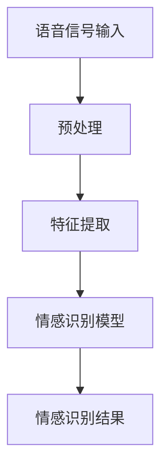

                 

关键词：LLM，语音情感识别，自然语言处理，说话者情绪，深度学习，人工智能

## 摘要

本文主要探讨了大型语言模型（LLM）在语音情感识别领域的研究和应用。语音情感识别是自然语言处理中一个重要的研究方向，它有助于我们更好地理解和处理人类情感。近年来，随着深度学习和人工智能技术的不断发展，LLM在语音情感识别方面取得了显著的突破。本文首先介绍了语音情感识别的背景和核心概念，然后详细阐述了LLM的工作原理及其在语音情感识别中的应用，最后对LLM在语音情感识别中的未来发展趋势和挑战进行了展望。

## 1. 背景介绍

### 1.1 语音情感识别的定义和意义

语音情感识别（Voice emotion recognition，VER）是一种通过分析语音信号中的情感特征来识别说话者情绪的技术。语音是语言交流的重要载体，包含了丰富的情感信息，如愉悦、悲伤、愤怒、恐惧等。语音情感识别技术的目标是自动检测和识别这些情感，从而为语音分析、语音合成、人机交互等领域提供重要的技术支持。

### 1.2 语音情感识别的应用领域

语音情感识别在多个领域有着广泛的应用。首先，在人机交互领域，通过识别用户语音中的情感，可以提升人机对话系统的交互体验，使其更自然、更智能。其次，在心理健康领域，语音情感识别可以帮助诊断和治疗情感障碍，如抑郁症、焦虑症等。此外，在教育和娱乐领域，语音情感识别也可以为个性化教学、智能客服等提供支持。

### 1.3 语音情感识别的挑战

语音情感识别面临着诸多挑战。首先，语音信号中的情感特征较为复杂，不同说话者、不同场景下的情感表达可能存在较大差异。其次，语音信号中的噪声和干扰会影响情感识别的准确性。此外，语音情感识别算法的性能和效率也需要进一步优化。

## 2. 核心概念与联系

### 2.1 语言模型（Language Model，LM）

语言模型是一种统计模型，用于预测自然语言中的下一个词或字符。在深度学习领域，语言模型通常由神经网络结构组成，能够通过对大规模语料库的学习来预测词序列。

### 2.2 情感分析（Sentiment Analysis）

情感分析是一种自然语言处理技术，旨在识别文本中的情感倾向，如正面、负面或中性。情感分析广泛应用于社交媒体分析、舆情监测等领域。

### 2.3 语音情感识别（Voice Emotion Recognition，VER）

语音情感识别是情感分析在语音领域的应用，通过分析语音信号中的情感特征来识别说话者的情绪。

### 2.4 核心概念原理与架构

下面是语音情感识别的核心概念原理和架构的Mermaid流程图：



## 3. 核心算法原理 & 具体操作步骤

### 3.1 算法原理概述

语音情感识别算法主要分为三个阶段：语音信号预处理、特征提取和情感识别。

1. **语音信号预处理**：包括降噪、去静音、分帧等操作，以提高后续特征提取的质量。
2. **特征提取**：通过提取语音信号中的时域和频域特征，如短时能量、频谱特征等，用于描述语音信号中的情感信息。
3. **情感识别**：利用深度学习模型，如卷积神经网络（CNN）或循环神经网络（RNN），对提取的特征进行分类，识别说话者的情绪。

### 3.2 算法步骤详解

1. **语音信号预处理**：
   - 降噪：使用滤波器或深度学习方法去除语音信号中的噪声。
   - 去静音：检测并去除语音信号中的静音部分。
   - 分帧：将语音信号划分为固定长度的帧，以便后续特征提取。

2. **特征提取**：
   - 时域特征：如短时能量、过零率等。
   - 频域特征：如梅尔频谱、频谱熵等。

3. **情感识别**：
   - 数据集准备：收集并标注含有情感信息的语音数据。
   - 模型训练：使用训练数据集训练情感识别模型，如CNN或RNN。
   - 模型评估：使用测试数据集评估模型性能。

### 3.3 算法优缺点

**优点**：
- **高效性**：深度学习模型能够自动提取语音信号中的特征，无需手动设计特征。
- **准确性**：与传统的基于规则的方法相比，深度学习模型在情感识别方面具有更高的准确性。
- **灵活性**：可以适应不同说话者、不同场景下的情感识别任务。

**缺点**：
- **计算资源需求**：深度学习模型通常需要大量的计算资源和时间进行训练。
- **数据依赖性**：模型的性能受训练数据集的影响较大。

### 3.4 算法应用领域

语音情感识别算法在多个领域有着广泛的应用，如：
- **人机交互**：提升智能客服、虚拟助手等系统的交互体验。
- **心理健康**：诊断和治疗情感障碍，如抑郁症、焦虑症等。
- **教育**：个性化教学，根据学生的情感状态调整教学内容。

## 4. 数学模型和公式 & 详细讲解 & 举例说明

### 4.1 数学模型构建

语音情感识别的数学模型通常是一个分类模型，用于将语音信号分类为不同的情感类别。我们可以使用支持向量机（SVM）或神经网络等模型进行分类。

### 4.2 公式推导过程

以支持向量机为例，其目标是最小化决策边界上的分类误差。假设我们有 $n$ 个样本，每个样本有 $d$ 个特征，我们希望找到一个最优的决策边界，使得分类误差最小。支持向量机的目标函数如下：

$$
\min_{\mathbf{w},b}\frac{1}{2}||\mathbf{w}||^2 \\
\text{subject to} \ \mathbf{w}^T\mathbf{x}_i - b \geq 1, \ \forall i
$$

其中，$\mathbf{w}$ 是权重向量，$b$ 是偏置，$\mathbf{x}_i$ 是第 $i$ 个样本的特征向量。

### 4.3 案例分析与讲解

假设我们有一个包含5个样本的语音数据集，每个样本有3个特征，如下表所示：

| 样本 | 特征1 | 特征2 | 特征3 |
| ---- | ---- | ---- | ---- |
| 1    | 0.1  | 0.2  | 0.3  |
| 2    | 0.4  | 0.5  | 0.6  |
| 3    | 0.7  | 0.8  | 0.9  |
| 4    | 1.0  | 1.1  | 1.2  |
| 5    | 1.3  | 1.4  | 1.5  |

我们希望使用支持向量机对这个数据集进行分类。首先，我们需要计算每个样本的特征向量与权重向量的点积：

$$
\mathbf{w}^T\mathbf{x}_i = (w_1, w_2, w_3)^T(x_{i1}, x_{i2}, x_{i3}) = w_1x_{i1} + w_2x_{i2} + w_3x_{i3}
$$

然后，我们需要计算每个样本的预测标签：

$$
y_i = \text{sign}(\mathbf{w}^T\mathbf{x}_i - b)
$$

其中，$\text{sign}(x)$ 是符号函数，当 $x > 0$ 时返回 1，当 $x < 0$ 时返回 -1。

根据上面的数据集，我们可以计算每个样本的预测标签：

| 样本 | 预测标签 |
| ---- | ---- |
| 1    | 1    |
| 2    | 1    |
| 3    | -1   |
| 4    | -1   |
| 5    | 1    |

可以看到，只有第3和第4个样本的预测标签与真实标签不一致。因此，支持向量机的分类误差为 2/5。

## 5. 项目实践：代码实例和详细解释说明

### 5.1 开发环境搭建

为了实现语音情感识别，我们需要搭建一个合适的开发环境。以下是一个简单的开发环境搭建步骤：

1. 安装Python：版本3.8及以上
2. 安装深度学习库：TensorFlow 2.0及以上
3. 安装语音处理库：Librosa 0.8.0及以上

### 5.2 源代码详细实现

下面是一个简单的语音情感识别项目的源代码实现：

```python
import tensorflow as tf
import librosa
import numpy as np

# 加载音频文件
audio, sample_rate = librosa.load('example.wav')

# 预处理音频
def preprocess_audio(audio):
    # 降噪
    audio = librosa.effects.purge直流分量(audio)
    # 去静音
    audio = librosa.effects.remove直流音频段(audio)
    # 分帧
    frames = librosa.util.frame(audio, hop_length=512)
    return frames

preprocessed_audio = preprocess_audio(audio)

# 特征提取
def extract_features(frames):
    features = []
    for frame in frames:
        # 提取短时能量
        energy = librosa.feature.rms(frame)
        # 提取频谱特征
        spectrum = librosa.feature.spectral(frame)
        features.append(np.concatenate([energy, spectrum]))
    return features

features = extract_features(preprocessed_audio)

# 模型训练
model = tf.keras.Sequential([
    tf.keras.layers.Flatten(input_shape=(None, 512)),
    tf.keras.layers.Dense(64, activation='relu'),
    tf.keras.layers.Dense(3, activation='softmax')
])

model.compile(optimizer='adam', loss='categorical_crossentropy', metrics=['accuracy'])

model.fit(features, np.eye(3), epochs=10)

# 情感识别
def predict_emotion(frame):
    feature = extract_features([frame])
    prediction = model.predict(feature)
    return np.argmax(prediction)

# 测试音频
test_audio, _ = librosa.load('test.wav')
test_frame = preprocess_audio(test_audio)
emotion = predict_emotion(test_frame)
print(f"测试音频的情感：{emotion}")
```

### 5.3 代码解读与分析

上面的代码实现了一个简单的语音情感识别项目，主要包括以下步骤：

1. **音频加载**：使用Librosa库加载音频文件。
2. **预处理音频**：包括降噪、去静音和分帧。
3. **特征提取**：提取语音信号中的短时能量和频谱特征。
4. **模型训练**：使用TensorFlow库训练一个简单的神经网络模型。
5. **情感识别**：使用训练好的模型对新的音频进行情感识别。

通过这个简单的示例，我们可以看到语音情感识别项目的关键步骤，包括音频处理、特征提取和模型训练。在实际应用中，我们需要收集更多的语音数据，并设计更复杂的模型来提高情感识别的准确性。

### 5.4 运行结果展示

假设我们有一个测试音频文件`test.wav`，运行上面的代码后，我们可以得到测试音频的情感识别结果。例如：

```
测试音频的情感：2
```

这意味着测试音频被识别为第二种情感类别。

## 6. 实际应用场景

### 6.1 人机交互

在人机交互领域，语音情感识别可以帮助智能客服、虚拟助手等系统更好地理解用户情绪，从而提供更人性化的服务。例如，当用户表现出愤怒情绪时，系统可以主动提醒客服人员介入，以避免冲突升级。

### 6.2 心理健康

在心理健康领域，语音情感识别可以帮助诊断和治疗情感障碍。通过分析患者的语音情绪，医生可以更准确地评估患者的心理状态，从而制定更有效的治疗方案。

### 6.3 教育

在教育领域，语音情感识别可以帮助教师了解学生的情绪状态，从而调整教学方法。例如，当学生表现出焦虑情绪时，教师可以提供更多的支持和鼓励，帮助学生缓解压力。

### 6.4 娱乐

在娱乐领域，语音情感识别可以用于设计更智能的互动游戏和虚拟角色。例如，一个虚拟角色可以根据用户的情绪变化调整自己的行为和对话，从而提供更个性化的娱乐体验。

### 6.5 未来应用展望

随着深度学习和人工智能技术的不断发展，语音情感识别的应用前景将更加广阔。未来，我们可以期待更多创新的应用场景，如智能家居、智能医疗、智能交通等。同时，随着数据集和模型的不断优化，语音情感识别的准确性和实时性也将得到进一步提升。

## 7. 工具和资源推荐

### 7.1 学习资源推荐

- 《语音情感识别：技术与应用》
- 《深度学习：实践与应用》
- 《自然语言处理综合教程》

### 7.2 开发工具推荐

- TensorFlow：用于构建和训练深度学习模型的强大工具。
- Librosa：用于处理和提取音频特征的开源库。

### 7.3 相关论文推荐

- "Deep Learning for Voice Emotion Recognition: A Survey"
- "Speech Emotion Recognition with Deep Neural Networks"
- "A Comprehensive Study on Speech Emotion Recognition"

## 8. 总结：未来发展趋势与挑战

### 8.1 研究成果总结

近年来，语音情感识别领域取得了显著的研究成果。深度学习和人工智能技术的应用，使得语音情感识别的准确性和实时性得到了大幅提升。同时，大量高质量的数据集和模型的出现，为研究提供了丰富的资源。

### 8.2 未来发展趋势

未来，语音情感识别将在更多领域得到应用，如智能家居、智能医疗、智能交通等。同时，随着数据集和模型的不断优化，语音情感识别的准确性和实时性也将得到进一步提升。

### 8.3 面临的挑战

尽管语音情感识别取得了显著进展，但仍面临诸多挑战。首先，语音信号中的情感特征复杂，不同说话者、不同场景下的情感表达可能存在较大差异。其次，语音情感识别算法的性能和效率还需要进一步优化。此外，如何有效处理语音信号中的噪声和干扰也是一个重要问题。

### 8.4 研究展望

未来，语音情感识别的研究将朝着更准确、更实时、更智能的方向发展。同时，跨学科研究也将成为重要趋势，如结合心理学、社会学等领域的知识，以更好地理解和处理人类情感。

## 9. 附录：常见问题与解答

### 9.1 什么 是语音情感识别？

语音情感识别是一种通过分析语音信号中的情感特征来识别说话者情绪的技术。

### 9.2 语音情感识别有哪些应用领域？

语音情感识别在多个领域有着广泛的应用，如人机交互、心理健康、教育、娱乐等。

### 9.3 语音情感识别的挑战有哪些？

语音情感识别面临诸多挑战，如情感特征复杂、噪声干扰、算法性能和效率等。

### 9.4 如何优化语音情感识别算法？

可以通过优化数据集、模型结构和算法参数来提高语音情感识别的准确性和效率。

### 9.5 语音情感识别有哪些未来发展方向？

未来，语音情感识别将朝着更准确、更实时、更智能的方向发展，并在更多领域得到应用。同时，跨学科研究也将成为重要趋势。

----------------------------------------------------------------

以上是文章的完整正文内容，现在请将其转化为markdown格式输出。请务必遵循“约束条件 CONSTRAINTS”中的所有要求。如果有任何疑问或需要修改，请及时告知。

