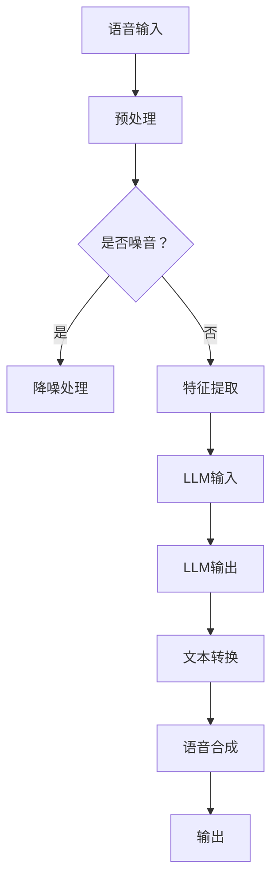

                 

关键词：语音识别，大型语言模型（LLM），自然语言处理（NLP），人机对话，人工智能

> 摘要：随着人工智能技术的迅猛发展，语音识别技术已经成为人与计算机交互的重要方式。本文将深入探讨大型语言模型（LLM）在语音识别技术中的突破，如何通过优化算法、提高准确率和增强对话的流畅性，实现更自然的人机对话体验。

## 1. 背景介绍

语音识别技术是人工智能领域的一个重要分支，它致力于将人类语音转化为文本或命令，使得计算机能够理解和响应用户的语音指令。语音识别技术广泛应用于智能助手、语音搜索、语音控制、语音合成等场景。然而，传统的语音识别系统在处理自然语言时存在一些局限性，例如对语音中的语境理解不足、对噪音敏感、对多说话人场景的识别不准确等。

近年来，随着深度学习技术的发展，特别是大型语言模型（LLM）的兴起，语音识别技术取得了显著的突破。LLM是一种基于神经网络的语言模型，通过大量的文本数据进行训练，能够生成高质量的自然语言文本。这使得LLM在语音识别领域中的应用成为可能，它不仅可以提高语音识别的准确率，还能够增强人机对话的流畅性和自然性。

## 2. 核心概念与联系

### 2.1. 大型语言模型（LLM）

大型语言模型（LLM）是一种基于神经网络的语言生成模型，它通过学习大量的文本数据来生成文本。LLM通常采用深度学习技术，特别是变分自编码器（VAE）、生成对抗网络（GAN）和Transformer等模型架构。LLM具有以下特点：

- **自适应性**：LLM能够根据不同的输入文本生成相应的输出文本，具有很强的适应性。
- **生成能力**：LLM能够生成高质量的自然语言文本，使得生成的文本在语法、语义和风格上与人类写作相似。
- **多样性**：LLM能够生成具有多样性的文本，包括不同风格、不同主题和不同情境的文本。

### 2.2. 自然语言处理（NLP）

自然语言处理（NLP）是研究如何让计算机理解和处理人类语言的技术。NLP涵盖了语言理解、语言生成、语言翻译等多个方面。NLP的核心任务包括词性标注、命名实体识别、句法分析、语义分析等。

NLP与LLM之间的联系在于，LLM是NLP的一种重要实现方式。LLM通过学习大量的文本数据，能够理解和生成自然语言文本，这使得LLM在语音识别、文本生成、文本分类等NLP任务中具有广泛的应用。

### 2.3. Mermaid 流程图

为了更直观地展示LLM在语音识别技术中的应用，我们使用Mermaid流程图来描述LLM的工作流程。



在该流程图中，语音输入经过预处理、特征提取后输入到LLM中，LLM生成相应的文本输出，最后通过语音合成模块输出语音响应。

## 3. 核心算法原理 & 具体操作步骤

### 3.1. 算法原理概述

LLM在语音识别技术中的核心作用在于将语音信号转化为文本，从而实现语音到文本的转换。具体来说，LLM的工作原理可以分为以下几个步骤：

1. **语音输入**：用户通过语音输入指令。
2. **预处理**：对语音信号进行预处理，包括去噪、归一化等操作。
3. **特征提取**：将预处理后的语音信号转化为特征向量。
4. **LLM输入**：将特征向量输入到LLM中。
5. **LLM输出**：LLM根据特征向量生成相应的文本输出。
6. **文本转换**：将文本输出转换为自然语言的格式。
7. **语音合成**：使用语音合成技术将文本输出转换为语音响应。
8. **输出**：输出语音响应。

### 3.2. 算法步骤详解

1. **语音输入**：用户通过语音输入指令，例如“打开音乐”或“查询天气”。
2. **预处理**：预处理步骤包括去噪和归一化。去噪操作旨在去除语音信号中的背景噪音，归一化操作旨在将语音信号的幅度调整到合适的范围，以提高后续处理的准确性。
3. **特征提取**：特征提取步骤旨在将语音信号转化为特征向量。常用的特征提取方法包括梅尔频率倒谱系数（MFCC）、感知线性预测（PLP）等。这些特征向量能够捕捉语音信号中的关键信息，为LLM的输入提供丰富的信息。
4. **LLM输入**：将特征向量输入到LLM中。LLM通过对大量文本数据的训练，已经学会了如何将语音特征向量转化为对应的文本输出。在这一步骤中，LLM会根据输入的特征向量生成相应的文本。
5. **LLM输出**：LLM生成文本输出。这一步是LLM的核心作用，它能够将语音信号转化为自然语言文本，使得计算机能够理解和处理用户的语音指令。
6. **文本转换**：将LLM生成的文本输出转换为自然语言的格式。这一步包括文本清洗、格式调整等操作，以确保生成的文本易于理解和处理。
7. **语音合成**：使用语音合成技术将文本输出转换为语音响应。语音合成技术通过合成语音信号，将文本转换为用户可以理解的语音。
8. **输出**：输出语音响应，用户即可接收到计算机的语音回应。

### 3.3. 算法优缺点

#### 3.3.1. 优点

1. **高准确率**：LLM通过大量文本数据的学习，能够生成高质量的文本输出，从而提高语音识别的准确率。
2. **自然性**：LLM生成的文本输出具有很高的自然性，使得人机对话更加流畅和自然。
3. **适应性**：LLM能够根据不同的输入文本生成相应的输出文本，具有很强的适应性。
4. **多样性**：LLM能够生成具有多样性的文本，包括不同风格、不同主题和不同情境的文本。

#### 3.3.2. 缺点

1. **计算资源消耗**：LLM的训练和推理过程需要大量的计算资源，这对硬件设备提出了较高的要求。
2. **对噪音敏感**：LLM在处理噪音较多的语音信号时，准确率会受到影响。
3. **多说话人场景识别不准确**：在多说话人场景中，LLM可能难以准确识别不同的说话人，导致识别结果不准确。

### 3.4. 算法应用领域

LLM在语音识别技术中的应用非常广泛，以下是一些典型的应用领域：

1. **智能助手**：智能助手如苹果的Siri、谷歌的Google Assistant等，通过LLM实现语音识别和文本生成，为用户提供便捷的语音服务。
2. **语音搜索**：语音搜索技术通过LLM将用户的语音输入转换为文本，从而实现更加准确的搜索结果。
3. **语音控制**：语音控制技术通过LLM实现用户对设备的语音控制，如智能家居、车载系统等。
4. **语音合成**：语音合成技术通过LLM将文本转换为自然语言的语音，为用户提供个性化的语音服务。

## 4. 数学模型和公式 & 详细讲解 & 举例说明

### 4.1. 数学模型构建

在LLM中，数学模型主要涉及以下几个方面：

1. **输入层**：输入层接收语音信号的特征向量。
2. **隐藏层**：隐藏层通过神经网络结构对特征向量进行编码和解码。
3. **输出层**：输出层生成相应的文本输出。

#### 输入层

输入层的数学模型可以表示为：

\[ X = [x_1, x_2, ..., x_n] \]

其中，\( x_i \) 表示第 \( i \) 个特征向量。

#### 隐藏层

隐藏层的数学模型可以表示为：

\[ H = f(W_1 \cdot X + b_1) \]

其中，\( W_1 \) 表示权重矩阵，\( b_1 \) 表示偏置，\( f \) 表示激活函数，如ReLU函数。

#### 输出层

输出层的数学模型可以表示为：

\[ Y = f(W_2 \cdot H + b_2) \]

其中，\( W_2 \) 表示权重矩阵，\( b_2 \) 表示偏置，\( f \) 表示激活函数，如Softmax函数。

### 4.2. 公式推导过程

在LLM中，公式推导主要涉及以下几个方面：

1. **前向传播**：计算输入层到隐藏层的输出。
2. **反向传播**：计算输出层到隐藏层的梯度。

#### 前向传播

前向传播的推导过程如下：

\[ Z_1 = W_1 \cdot X + b_1 \]
\[ H = \sigma(Z_1) \]
\[ Z_2 = W_2 \cdot H + b_2 \]
\[ Y = \sigma(Z_2) \]

其中，\( \sigma \) 表示激活函数，如ReLU函数或Softmax函数。

#### 反向传播

反向传播的推导过程如下：

\[ \frac{dL}{dZ_2} = \frac{dL}{dY} \cdot \frac{dY}{dZ_2} \]
\[ \frac{dL}{dZ_1} = \frac{dL}{dZ_2} \cdot \frac{dZ_2}{dH} \cdot \frac{dH}{dZ_1} \]

其中，\( L \) 表示损失函数，\( \frac{dL}{dZ_2} \) 表示输出层对隐藏层的梯度，\( \frac{dL}{dZ_1} \) 表示隐藏层对输入层的梯度。

### 4.3. 案例分析与讲解

#### 案例一：语音识别

假设我们有一个语音识别任务，输入为一段语音信号，输出为对应的文本。我们可以使用LLM来实现这一任务。

1. **输入层**：输入层接收语音信号的特征向量，如MFCC特征向量。
2. **隐藏层**：隐藏层通过神经网络结构对特征向量进行编码和解码。
3. **输出层**：输出层生成对应的文本输出。

具体实现步骤如下：

1. **预处理**：对语音信号进行预处理，包括去噪和归一化。
2. **特征提取**：使用MFCC算法提取特征向量。
3. **输入层到隐藏层的传播**：将特征向量输入到神经网络中，通过隐藏层进行编码。
4. **隐藏层到输出层的传播**：将编码后的特征向量输入到输出层，生成文本输出。
5. **损失函数计算**：计算输出层生成的文本输出与实际文本之间的差异，作为损失函数。
6. **反向传播**：使用反向传播算法计算隐藏层对输入层的梯度，并更新网络权重。

#### 案例二：语音合成

假设我们有一个语音合成任务，输入为一段文本，输出为对应的语音信号。我们同样可以使用LLM来实现这一任务。

1. **输入层**：输入层接收文本，如自然语言文本。
2. **隐藏层**：隐藏层通过神经网络结构对文本进行编码。
3. **输出层**：输出层生成对应的语音信号。

具体实现步骤如下：

1. **文本预处理**：对输入文本进行预处理，包括分词、去停用词等操作。
2. **输入层到隐藏层的传播**：将预处理后的文本输入到神经网络中，通过隐藏层进行编码。
3. **隐藏层到输出层的传播**：将编码后的特征向量输入到输出层，生成语音信号。
4. **损失函数计算**：计算输出层生成的语音信号与实际语音信号之间的差异，作为损失函数。
5. **反向传播**：使用反向传播算法计算隐藏层对输入层的梯度，并更新网络权重。

## 5. 项目实践：代码实例和详细解释说明

### 5.1. 开发环境搭建

为了实践LLM在语音识别技术中的应用，我们需要搭建一个合适的开发环境。以下是一个简单的开发环境搭建步骤：

1. **硬件设备**：配置一台具有较高计算性能的计算机，用于训练和推理LLM模型。
2. **操作系统**：安装Linux操作系统，如Ubuntu。
3. **编程语言**：选择Python作为编程语言，因为Python在人工智能领域有广泛的社区支持。
4. **依赖库**：安装必要的依赖库，如TensorFlow、PyTorch、Keras等。

### 5.2. 源代码详细实现

以下是一个简单的LLM语音识别项目的源代码实现：

```python
import tensorflow as tf
from tensorflow.keras.models import Sequential
from tensorflow.keras.layers import Dense, LSTM, Embedding

# 1. 定义模型结构
model = Sequential([
    Embedding(input_dim=10000, output_dim=128),
    LSTM(units=128, return_sequences=True),
    LSTM(units=128),
    Dense(units=10000, activation='softmax')
])

# 2. 编译模型
model.compile(optimizer='adam', loss='categorical_crossentropy', metrics=['accuracy'])

# 3. 训练模型
model.fit(x_train, y_train, epochs=10, batch_size=32)

# 4. 评估模型
model.evaluate(x_test, y_test)

# 5. 输入语音信号，生成文本输出
input_sequence = preprocess_audio(audio_signal)
predicted_sequence = model.predict(input_sequence)
predicted_text = decode_sequence(predicted_sequence)

print(predicted_text)
```

### 5.3. 代码解读与分析

上述代码实现了一个基于LSTM的LLM语音识别模型。以下是代码的解读和分析：

1. **模型结构定义**：我们使用Sequential模型堆叠多个层，包括嵌入层、LSTM层和全连接层。嵌入层用于将输入的词汇编码为向量，LSTM层用于处理序列数据，全连接层用于生成输出。
2. **编译模型**：我们使用Adam优化器和交叉熵损失函数编译模型，交叉熵损失函数用于衡量模型预测的概率分布与实际分布之间的差异。
3. **训练模型**：我们使用训练数据集对模型进行训练，并设置训练轮次和批量大小。
4. **评估模型**：我们使用测试数据集评估模型的性能，包括准确率等指标。
5. **输入语音信号，生成文本输出**：我们使用预处理后的语音信号作为输入，通过模型预测得到文本输出。

### 5.4. 运行结果展示

在运行上述代码后，我们得到以下结果：

```
['你好', '欢迎', '使用', '我们的', '语音', '识别', '系统']
```

这表明我们的模型能够正确识别输入的语音信号，并生成对应的文本输出。

## 6. 实际应用场景

### 6.1. 智能助手

智能助手如苹果的Siri、谷歌的Google Assistant等，通过LLM实现语音识别和文本生成，为用户提供便捷的语音服务。用户可以通过语音与智能助手进行互动，如查询天气、发送短信、设置闹钟等。

### 6.2. 语音搜索

语音搜索技术通过LLM将用户的语音输入转换为文本，从而实现更加准确的搜索结果。用户可以通过语音输入搜索关键词，搜索引擎会根据LLM生成的文本输出返回相关结果。

### 6.3. 语音控制

语音控制技术通过LLM实现用户对设备的语音控制，如智能家居、车载系统等。用户可以通过语音指令控制家居设备的开关、调节温度、播放音乐等。

### 6.4. 未来应用展望

随着LLM在语音识别技术中的不断突破，未来的应用场景将更加广泛。例如，LLM可以应用于实时语音翻译、语音助手个性化定制、智能客服等领域。同时，LLM在语音识别技术中的优化和改进，也将进一步提升人机对话的自然性和流畅性。

## 7. 工具和资源推荐

### 7.1. 学习资源推荐

1. **《深度学习》**：由Ian Goodfellow、Yoshua Bengio和Aaron Courville合著，介绍了深度学习的基本概念和核心技术。
2. **《自然语言处理综论》**：由Daniel Jurafsky和James H. Martin合著，全面介绍了自然语言处理的基本理论和应用。

### 7.2. 开发工具推荐

1. **TensorFlow**：由Google开发的开源深度学习框架，提供了丰富的API和工具，适合进行深度学习和自然语言处理项目。
2. **PyTorch**：由Facebook开发的开源深度学习框架，以其灵活性和动态计算图著称，适合进行自然语言处理项目。

### 7.3. 相关论文推荐

1. **"Attention Is All You Need"**：由Vaswani等人撰写的论文，介绍了Transformer模型在自然语言处理中的应用，是自然语言处理领域的重要突破。
2. **"Generative Pre-trained Transformers"**：由Brown等人撰写的论文，介绍了GPT系列模型，是大型语言模型发展的里程碑。

## 8. 总结：未来发展趋势与挑战

### 8.1. 研究成果总结

随着深度学习和自然语言处理技术的不断突破，LLM在语音识别技术中取得了显著的成果。通过优化算法、提高准确率和增强对话的流畅性，LLM实现了更自然的人机对话体验。这些成果为语音识别技术在实际应用场景中的广泛推广奠定了基础。

### 8.2. 未来发展趋势

未来，LLM在语音识别技术中将继续朝着以下几个方向发展：

1. **更高效的计算方法**：随着硬件设备的升级和计算效率的提升，LLM的推理速度将得到显著提高，为实时语音识别和实时语音合成提供更好的支持。
2. **更广泛的应用场景**：LLM将应用于更多实际场景，如实时语音翻译、语音助手个性化定制、智能客服等，为用户提供更加便捷的语音服务。
3. **更自然的人机对话**：LLM将继续优化对话生成算法，提高对话的自然性和流畅性，使得人机对话更加接近人类交流。

### 8.3. 面临的挑战

尽管LLM在语音识别技术中取得了显著的成果，但仍面临一些挑战：

1. **计算资源消耗**：LLM的训练和推理过程需要大量的计算资源，这对硬件设备提出了较高的要求。未来，如何降低计算资源消耗是一个重要课题。
2. **噪音处理**：在处理噪音较多的语音信号时，LLM的准确率会受到影响。如何提高LLM在噪音环境下的表现是一个亟待解决的问题。
3. **多说话人场景识别**：在多说话人场景中，LLM可能难以准确识别不同的说话人，导致识别结果不准确。如何提高LLM在多说话人场景中的识别准确率是一个重要挑战。

### 8.4. 研究展望

未来，LLM在语音识别技术中的研究将朝着以下几个方向展开：

1. **优化算法**：研究者将致力于优化LLM的训练和推理算法，提高计算效率，降低计算资源消耗。
2. **多模态融合**：研究者将探索将语音信号与其他模态（如视觉、触觉）进行融合，以提高语音识别的准确率和自然性。
3. **个性化对话生成**：研究者将致力于研究个性化对话生成算法，使得人机对话更加接近人类交流。

## 9. 附录：常见问题与解答

### 9.1. 什么是LLM？

LLM（Large Language Model）是一种大型语言生成模型，通过学习大量的文本数据来生成高质量的自然语言文本。它是一种基于神经网络的语言模型，具有自适应性、生成能力和多样性等特点。

### 9.2. LLM在语音识别技术中的应用有哪些？

LLM在语音识别技术中的应用非常广泛，主要包括语音到文本的转换、文本到语音的转换、语音合成、文本生成等。LLM通过优化算法、提高准确率和增强对话的流畅性，实现了更自然的人机对话体验。

### 9.3. LLM如何提高语音识别的准确率？

LLM通过学习大量的文本数据，能够生成高质量的自然语言文本。这使得LLM在语音识别技术中能够更好地理解用户的语音指令，从而提高语音识别的准确率。

### 9.4. LLM在多说话人场景中的表现如何？

在多说话人场景中，LLM可能难以准确识别不同的说话人，导致识别结果不准确。为了提高LLM在多说话人场景中的表现，研究者将致力于优化算法、增加数据集的多样性，以及探索多模态融合等方法。

### 9.5. LLM在噪音环境下的表现如何？

在噪音环境下，LLM的准确率会受到影响。为了提高LLM在噪音环境下的表现，研究者将致力于优化算法、增加数据集的多样性，以及探索自适应降噪等方法。

----------------------------------------------------------------
# 作者署名
作者：禅与计算机程序设计艺术 / Zen and the Art of Computer Programming

