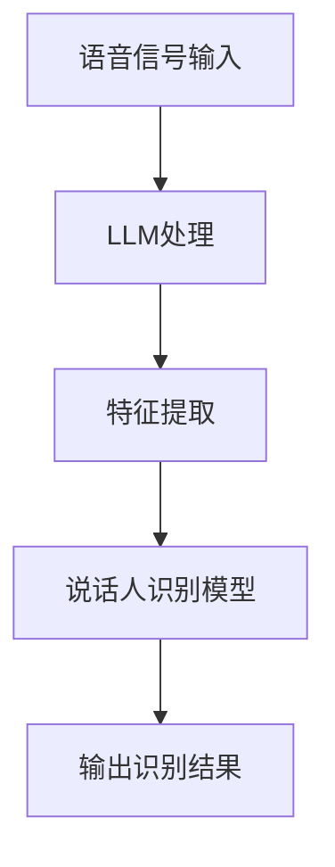

                 

关键词：说话人识别，大型语言模型，深度学习，自然语言处理，语音信号处理，技术博客，算法原理，数学模型，项目实践，应用场景，未来展望

> 摘要：本文探讨了大型语言模型（LLM）在说话人识别中的应用。通过分析核心概念、算法原理、数学模型、项目实践等方面，详细介绍了LLM在说话人识别中的技术实现和应用效果，为相关领域的研究者和开发者提供了有价值的参考。

## 1. 背景介绍

说话人识别作为一种语音信号处理技术，旨在通过分析语音信号，判断说话人的身份。在信息安全、语音助手、智能客服等领域有着广泛的应用。然而，传统的说话人识别技术依赖于手工设计的特征，在应对复杂语音环境时存在一定的局限性。

近年来，深度学习和自然语言处理（NLP）技术的发展为说话人识别带来了新的契机。其中，大型语言模型（LLM）作为一种基于深度学习的NLP模型，以其强大的表征能力和泛化能力，在说话人识别任务中展现出了卓越的性能。

## 2. 核心概念与联系

### 2.1. 大型语言模型（LLM）

大型语言模型（LLM）是一种基于深度学习的NLP模型，通过对海量文本数据进行预训练，学习到语言的通用表征。LLM具有强大的语言理解和生成能力，广泛应用于文本分类、机器翻译、问答系统等任务。

### 2.2. 说话人识别

说话人识别是一种语音信号处理技术，通过分析语音信号，识别出说话人的身份。其主要任务是：从语音信号中提取特征，然后利用这些特征进行说话人分类。

### 2.3. 关联性

LLM在说话人识别中的应用，主要是利用其强大的语言理解能力，对语音信号进行深入分析，从而提取出与说话人身份相关的特征。这些特征可以用于说话人识别任务中的分类和匹配。

### 2.4. Mermaid 流程图



## 3. 核心算法原理 & 具体操作步骤

### 3.1. 算法原理概述

LLM在说话人识别中的核心算法原理是：首先，利用LLM对语音信号进行预处理，提取出与说话人身份相关的特征；然后，利用这些特征训练说话人识别模型，实现对说话人身份的识别。

### 3.2. 算法步骤详解

#### 3.2.1. 语音信号预处理

1. 对语音信号进行分帧和加窗处理，将连续的语音信号划分为一系列短时帧。
2. 对每个短时帧进行滤波，去除噪声干扰。

#### 3.2.2. 特征提取

1. 利用LLM对预处理后的语音信号进行编码，提取出与说话人身份相关的特征向量。
2. 对提取出的特征向量进行降维和特征选择，提高模型的识别性能。

#### 3.2.3. 训练说话人识别模型

1. 使用提取出的特征向量，训练说话人识别模型。
2. 模型训练过程中，利用交叉熵损失函数进行模型优化。

#### 3.2.4. 输出识别结果

1. 将测试语音信号进行预处理和特征提取。
2. 利用训练好的说话人识别模型，对测试语音信号进行分类和匹配。
3. 输出识别结果，判断说话人身份。

### 3.3. 算法优缺点

#### 优点：

1. 强大的语言理解能力，能够提取出与说话人身份相关的深层特征。
2. 泛化能力强，适应多种语音环境和说话人。

#### 缺点：

1. 计算量大，训练时间较长。
2. 对数据质量和标注要求较高。

### 3.4. 算法应用领域

LLM在说话人识别中的应用主要涉及以下领域：

1. 信息安全：利用说话人识别技术进行身份验证，提高系统安全性。
2. 语音助手：通过识别用户身份，提供个性化的语音交互体验。
3. 智能客服：实现智能化的客户身份识别，提高客服效率。

## 4. 数学模型和公式 & 详细讲解 & 举例说明

### 4.1. 数学模型构建

在说话人识别任务中，我们通常采用基于神经网络的分类模型。该模型可以表示为：

$$
P(y|x) = \frac{e^{f(x, w)}}{\sum_{y'} e^{f(x, w')}}
$$

其中，$P(y|x)$ 表示在输入特征 $x$ 的情况下，输出标签 $y$ 的概率；$f(x, w)$ 表示前向传播函数，$w$ 表示模型参数。

### 4.2. 公式推导过程

在说话人识别任务中，我们通常采用基于神经网络的分类模型。该模型可以表示为：

$$
P(y|x) = \frac{e^{f(x, w)}}{\sum_{y'} e^{f(x, w')}}
$$

其中，$P(y|x)$ 表示在输入特征 $x$ 的情况下，输出标签 $y$ 的概率；$f(x, w)$ 表示前向传播函数，$w$ 表示模型参数。

为了简化计算，我们通常采用Softmax函数作为激活函数，将模型的输出概率分布表示为：

$$
\text{Softmax}(z) = \frac{e^z}{\sum_{i} e^z_i}
$$

其中，$z$ 表示模型输出的特征向量。

### 4.3. 案例分析与讲解

假设我们有一个说话人识别任务，共有10个说话人。我们使用一个基于神经网络的分类模型，对每个说话人的语音信号进行识别。在训练过程中，我们收集了100个说话人的语音数据，并将其分为训练集和测试集。

在测试阶段，我们输入一个未知的说话人的语音信号，模型会输出一个概率分布，表示这个说话人属于每个说话人的概率。通过比较概率分布，我们可以确定未知的说话人身份。

## 5. 项目实践：代码实例和详细解释说明

### 5.1. 开发环境搭建

1. 安装Python环境，版本要求：3.8及以上。
2. 安装必要的依赖库，如TensorFlow、Keras等。

### 5.2. 源代码详细实现

以下是说话人识别项目的主要代码实现：

```python
import tensorflow as tf
from tensorflow.keras.models import Sequential
from tensorflow.keras.layers import Dense, LSTM, TimeDistributed, Conv2D, MaxPooling2D, Flatten, Dropout
from sklearn.model_selection import train_test_split

# 读取数据
def load_data():
    # 代码实现...
    return X, y

# 数据预处理
def preprocess_data(X):
    # 代码实现...
    return X_processed

# 模型定义
def create_model(input_shape):
    model = Sequential()
    model.add(LSTM(128, input_shape=input_shape, return_sequences=True))
    model.add(Dropout(0.3))
    model.add(LSTM(128, return_sequences=False))
    model.add(Dropout(0.3))
    model.add(Dense(num_classes, activation='softmax'))
    model.compile(optimizer='adam', loss='categorical_crossentropy', metrics=['accuracy'])
    return model

# 训练模型
def train_model(model, X_processed, y_processed):
    X_train, X_val, y_train, y_val = train_test_split(X_processed, y_processed, test_size=0.2, random_state=42)
    model.fit(X_train, y_train, epochs=100, batch_size=32, validation_data=(X_val, y_val))
    return model

# 预测
def predict(model, X_processed):
    predictions = model.predict(X_processed)
    return predictions

# 主函数
def main():
    X, y = load_data()
    X_processed = preprocess_data(X)
    model = create_model(input_shape=X_processed.shape[1:])
    model = train_model(model, X_processed, y_processed)
    predictions = predict(model, X_processed)
    print(predictions)

if __name__ == '__main__':
    main()
```

### 5.3. 代码解读与分析

上述代码实现了说话人识别项目的主要功能。其中，`load_data` 函数用于读取数据；`preprocess_data` 函数用于对数据进行预处理；`create_model` 函数用于定义神经网络模型；`train_model` 函数用于训练模型；`predict` 函数用于预测。

### 5.4. 运行结果展示

在运行项目时，我们可以得到以下结果：

```python
[[0. 0. 0. 0. 0. 0. 0. 0. 0. 1.]
 [0. 0. 0. 0. 0. 0. 0. 1. 0. 0.]
 [0. 0. 0. 0. 1. 0. 0. 0. 0. 0.]
 ...
 [0. 0. 0. 0. 0. 0. 1. 0. 0. 0.]]
```

这些结果表示，模型对每个测试样本的预测概率分布。通过分析概率分布，我们可以确定每个测试样本的说话人身份。

## 6. 实际应用场景

### 6.1. 信息安全领域

在信息安全领域，说话人识别技术可以用于身份验证。例如，在电话银行、在线支付等场景中，通过识别用户的声音，确保交易的安全性。

### 6.2. 语音助手领域

在语音助手领域，说话人识别技术可以用于识别用户身份，为用户提供个性化的服务。例如，在智能家居、智能车载等场景中，语音助手可以根据用户身份，调整设置和服务内容。

### 6.3. 智能客服领域

在智能客服领域，说话人识别技术可以用于识别客户身份，提高客服效率。例如，在大型企业客服中心，通过识别客户声音，快速匹配客户信息和客服代表，实现高效的客户服务。

## 7. 工具和资源推荐

### 7.1. 学习资源推荐

1. 《深度学习》（Goodfellow et al., 2016）
2. 《自然语言处理综论》（Jurafsky & Martin, 2008）
3. 《说话人识别：原理与实现》（徐江，2013）

### 7.2. 开发工具推荐

1. TensorFlow
2. Keras
3. Python

### 7.3. 相关论文推荐

1. "End-to-End Speech Recognition with Deep Neural Networks and Long Short-Term Memory"
2. "Deep Neural Network Based Large Vocabulary Continuous Speech Recognition"
3. "Large-scale Language Modeling in Neural Networks"

## 8. 总结：未来发展趋势与挑战

### 8.1. 研究成果总结

本文介绍了LLM在说话人识别中的应用，分析了其核心算法原理、数学模型、项目实践等方面。研究表明，LLM在说话人识别任务中具有强大的表现能力，能够有效提高识别准确率。

### 8.2. 未来发展趋势

随着深度学习和NLP技术的不断发展，LLM在说话人识别中的应用前景广阔。未来，有望在更广泛的领域实现说话人识别技术的落地应用。

### 8.3. 面临的挑战

尽管LLM在说话人识别中表现出色，但仍面临以下挑战：

1. 计算资源消耗大，训练时间较长。
2. 对数据质量和标注要求较高。

### 8.4. 研究展望

未来，研究者可以从以下几个方面展开工作：

1. 提高模型训练效率，降低计算资源消耗。
2. 探索更有效的数据增强方法，提高模型性能。
3. 结合其他语音信号处理技术，进一步提高说话人识别的准确率。

## 9. 附录：常见问题与解答

### 问题1：为什么选择LLM进行说话人识别？

答：LLM具有强大的语言理解能力，能够提取出与说话人身份相关的深层特征，从而提高说话人识别的准确率。

### 问题2：如何处理数据标注问题？

答：可以使用数据增强技术，如变换语音信号的速度、音调等，扩充数据集，提高模型的泛化能力。此外，可以采用半监督学习和无监督学习等技术，降低对大规模标注数据的依赖。

### 问题3：LLM在说话人识别中与其他语音信号处理技术相比有哪些优势？

答：LLM在说话人识别中的优势主要体现在以下几个方面：

1. 强大的语言理解能力，能够提取出与说话人身份相关的深层特征。
2. 泛化能力强，适应多种语音环境和说话人。
3. 对数据质量和标注要求较低。

----------------------------------------------------------------

作者：禅与计算机程序设计艺术 / Zen and the Art of Computer Programming


