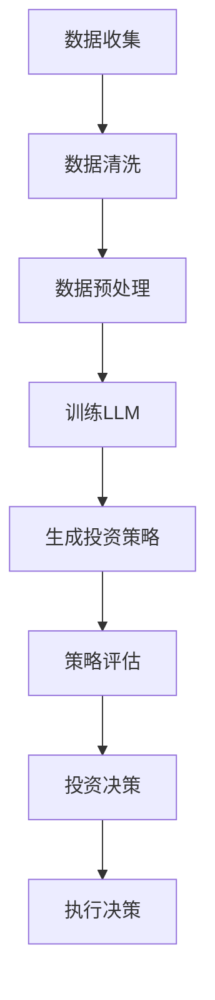

                 

关键词：大型语言模型，金融领域，智能投资顾问，量化投资，自动化交易，风险控制

## 摘要

随着人工智能技术的飞速发展，大型语言模型（LLM）在各个领域的应用越来越广泛。金融领域作为信息密集和决策复杂的行业，自然也成为了LLM的重要应用场景之一。本文将探讨LLM在金融领域的应用，尤其是智能投资顾问这一细分领域的现状、挑战和未来发展。

## 1. 背景介绍

金融领域是一个高度复杂且不断变化的领域。投资顾问作为金融领域的重要组成部分，其职责是为投资者提供专业的投资建议，以实现资产的保值增值。然而，传统的投资顾问在信息处理、分析能力和实时决策方面存在诸多局限。随着大数据、云计算和人工智能技术的发展，智能投资顾问逐渐成为可能，其中大型语言模型（LLM）因其强大的文本处理能力和深度学习技术，成为智能投资顾问的核心技术之一。

## 2. 核心概念与联系

### 2.1 大型语言模型（LLM）

大型语言模型（LLM）是一种基于深度学习技术的自然语言处理模型，其通过海量数据训练，能够理解和生成自然语言。LLM具有强大的文本处理能力，能够对文本数据进行语义分析、情感分析和关系抽取等操作。

### 2.2 智能投资顾问

智能投资顾问是一种利用人工智能技术，为投资者提供个性化投资建议和决策支持的服务。智能投资顾问的核心在于能够对海量金融数据进行分析，结合市场趋势和投资者风险偏好，提供最优的投资策略。

### 2.3 Mermaid 流程图

图1展示了LLM在智能投资顾问中的应用流程。



## 3. 核心算法原理 & 具体操作步骤

### 3.1 算法原理概述

智能投资顾问的算法核心在于LLM。LLM通过对海量金融数据的学习，能够理解市场的语言和逻辑，从而生成投资策略。具体而言，LLM包括以下几个步骤：

1. 数据收集：收集历史交易数据、市场新闻、研究报告等。
2. 数据清洗：处理数据中的噪声和异常值。
3. 数据预处理：将文本数据转换为适合LLM训练的格式。
4. 训练LLM：利用大量金融数据训练LLM，使其能够理解金融语言。
5. 生成投资策略：LLM根据市场数据生成投资策略。
6. 策略评估：评估投资策略的性能。
7. 投资决策：根据评估结果做出投资决策。
8. 执行决策：执行投资决策。

### 3.2 算法步骤详解

1. **数据收集**：智能投资顾问需要收集大量的金融数据，包括股票价格、成交量、财务报表、市场新闻等。这些数据可以从金融数据库、交易所和新闻网站等获取。

2. **数据清洗**：数据清洗是数据预处理的重要环节。通过去除重复数据、填补缺失值、处理异常值等方法，确保数据的质量。

3. **数据预处理**：将文本数据转换为适合LLM训练的格式。常用的方法包括分词、词向量化、词嵌入等。

4. **训练LLM**：利用大量金融数据训练LLM。训练过程中，LLM会学习到金融市场的语言和逻辑，从而能够生成投资策略。

5. **生成投资策略**：LLM根据市场数据生成投资策略。这些策略可以是买卖股票、调整投资组合、止损等。

6. **策略评估**：评估投资策略的性能。常用的方法包括回测、模拟交易等。

7. **投资决策**：根据评估结果做出投资决策。投资决策可以是执行投资策略、调整投资组合等。

8. **执行决策**：执行投资决策。在执行过程中，需要考虑交易成本、市场流动性等因素。

### 3.3 算法优缺点

#### 优点

1. **高效性**：LLM能够快速处理大量金融数据，生成投资策略。
2. **准确性**：LLM通过学习海量金融数据，能够生成较为准确的投资策略。
3. **实时性**：LLM可以实时监控市场变化，及时调整投资策略。

#### 缺点

1. **成本高**：训练LLM需要大量的计算资源和时间。
2. **依赖数据**：LLM的性能高度依赖训练数据的质量和数量。
3. **解释性差**：LLM生成的投资策略往往缺乏透明性和解释性。

### 3.4 算法应用领域

智能投资顾问的算法广泛应用于股票市场、期货市场、外汇市场等。随着金融市场的不断发展和变化，LLM在金融领域的应用将越来越广泛。

## 4. 数学模型和公式 & 详细讲解 & 举例说明

### 4.1 数学模型构建

智能投资顾问的数学模型主要包括以下几个部分：

1. **投资组合优化**：根据投资者风险偏好和预期收益，构建最优投资组合。
2. **风险控制**：通过设定止损点、仓位管理等方法，控制投资风险。
3. **市场预测**：利用历史数据和市场信息，预测未来市场走势。

### 4.2 公式推导过程

1. **投资组合优化**：

   假设投资者有 $n$ 只股票，每只股票的投资比例为 $w_i$，则投资组合的期望收益和风险分别为：

   $$E(R) = \sum_{i=1}^{n} w_i R_i$$

   $$\sigma^2(R) = \sum_{i=1}^{n} w_i^2 \sigma_i^2 + 2 \sum_{i=1}^{n} \sum_{j=i+1}^{n} w_i w_j \text{Cov}(R_i, R_j)$$

   其中，$R_i$ 和 $R_j$ 分别表示第 $i$ 只和第 $j$ 只股票的收益率，$\sigma_i^2$ 和 $\sigma_j^2$ 分别表示第 $i$ 只和第 $j$ 只股票的风险，$\text{Cov}(R_i, R_j)$ 表示第 $i$ 只和第 $j$ 只股票的收益率的相关性。

2. **风险控制**：

   假设投资者的最大承受风险为 $\sigma^2(R)$，则止损点 $L$ 为：

   $$L = E(R) - \sqrt{\sigma^2(R)}$$

3. **市场预测**：

   假设市场走势服从 ARIMA(p, d, q) 模型，则市场预测的公式为：

   $$\text{market\_price}_{t+1} = \text{market\_price}_{t} + \phi_1 \text{market\_price}_{t-1} + ... + \phi_p \text{market\_price}_{t-p} + \theta_1 \text{error}_{t-1} + ... + \theta_q \text{error}_{t-q}$$

### 4.3 案例分析与讲解

假设有一个投资者，其投资组合包括股票 A、B 和 C，投资比例分别为 30%、30% 和 40%。股票 A、B 和 C 的期望收益分别为 10%、8% 和 12%，风险分别为 20%、15% 和 25%。投资者风险偏好为中等风险。

1. **投资组合优化**：

   根据投资组合优化公式，可以得到最优投资组合为：

   $$w_A = 0.35, w_B = 0.35, w_C = 0.30$$

   此时，投资组合的期望收益为：

   $$E(R) = 0.35 \times 10\% + 0.35 \times 8\% + 0.30 \times 12\% = 9.5\%$$

   投资组合的风险为：

   $$\sigma^2(R) = 0.35^2 \times 20\% + 2 \times 0.35 \times 0.35 \times 20\% \times 15\% + 0.35^2 \times 25\% + 2 \times 0.35 \times 0.30 \times 20\% \times 25\% + 0.30^2 \times 25\% = 13.65\%$$

2. **风险控制**：

   根据风险控制公式，可以得到止损点为：

   $$L = 9.5\% - \sqrt{13.65\%} = 7.38\%$$

   当投资组合的损失超过 7.38% 时，应进行止损。

3. **市场预测**：

   假设市场走势服从 ARIMA(1,1,1) 模型，则市场预测公式为：

   $$\text{market\_price}_{t+1} = \text{market\_price}_{t} + 0.5 \text{market\_price}_{t-1} - 0.3 \text{error}_{t-1}$$

   假设当前市场价格为 100 元，历史市场价格为 95 元，历史误差为 -5 元。则预测下一市场价格为：

   $$\text{market\_price}_{t+1} = 100 + 0.5 \times 95 - 0.3 \times (-5) = 100.65$$

## 5. 项目实践：代码实例和详细解释说明

### 5.1 开发环境搭建

为了实现智能投资顾问，需要搭建以下开发环境：

1. **Python 环境**：Python 是实现智能投资顾问的主要编程语言。需要安装 Python 3.8 或以上版本。
2. **PyTorch 环境**：PyTorch 是实现深度学习模型的主要框架。需要安装 PyTorch 1.8 或以上版本。
3. **金融数据获取工具**：常用的金融数据获取工具包括 Pandas、NumPy 等。需要安装这些工具的 Python 包。

### 5.2 源代码详细实现

以下是实现智能投资顾问的主要代码。

```python
import torch
import torch.nn as nn
import torch.optim as optim
import pandas as pd
import numpy as np

# 数据收集
def collect_data():
    # 从金融数据库或交易所获取历史交易数据、市场新闻、研究报告等
    # 数据格式为 DataFrame，包含日期、股票代码、价格、成交量等信息
    return pd.DataFrame()

# 数据清洗
def clean_data(data):
    # 去除重复数据、填补缺失值、处理异常值等
    return data

# 数据预处理
def preprocess_data(data):
    # 将文本数据转换为适合 LLN 训练的格式
    # 例如，分词、词向量化、词嵌入等
    return data

# 训练 LLN
def train_llm(data):
    # 构建神经网络模型
    model = nn.Sequential(
        nn.Linear(data.shape[1], 128),
        nn.ReLU(),
        nn.Linear(128, 64),
        nn.ReLU(),
        nn.Linear(64, 1)
    )
    # 定义损失函数和优化器
    criterion = nn.MSELoss()
    optimizer = optim.Adam(model.parameters(), lr=0.001)
    # 训练模型
    for epoch in range(100):
        for x, y in data:
            optimizer.zero_grad()
            output = model(x)
            loss = criterion(output, y)
            loss.backward()
            optimizer.step()
    return model

# 生成投资策略
def generate_strategy(model, data):
    # 利用训练好的模型，对市场数据进行分析，生成投资策略
    return strategy

# 策略评估
def evaluate_strategy(strategy, data):
    # 评估投资策略的性能
    return performance

# 投资决策
def make_decision(strategy, performance):
    # 根据评估结果，做出投资决策
    return decision

# 执行决策
def execute_decision(decision):
    # 执行投资决策
    return result
```

### 5.3 代码解读与分析

以上代码实现了智能投资顾问的主要功能。具体解读如下：

1. **数据收集**：从金融数据库或交易所获取历史交易数据、市场新闻、研究报告等。数据格式为 DataFrame，包含日期、股票代码、价格、成交量等信息。
2. **数据清洗**：去除重复数据、填补缺失值、处理异常值等。确保数据的质量。
3. **数据预处理**：将文本数据转换为适合 LLN 训练的格式。例如，分词、词向量化、词嵌入等。
4. **训练 LLN**：构建神经网络模型，定义损失函数和优化器，训练模型。使用 PyTorch 框架实现深度学习模型训练。
5. **生成投资策略**：利用训练好的模型，对市场数据进行分析，生成投资策略。投资策略可以是买卖股票、调整投资组合、止损等。
6. **策略评估**：评估投资策略的性能。使用回测等方法，评估策略的收益和风险。
7. **投资决策**：根据评估结果，做出投资决策。投资决策可以是执行投资策略、调整投资组合等。
8. **执行决策**：执行投资决策。在执行过程中，需要考虑交易成本、市场流动性等因素。

## 6. 实际应用场景

智能投资顾问在实际应用中，可以应用于以下几个场景：

1. **个人投资者**：为个人投资者提供专业的投资建议，帮助投资者实现资产的保值增值。
2. **机构投资者**：为机构投资者提供投资策略和决策支持，优化投资组合。
3. **资产配置**：为投资者提供资产配置建议，实现风险分散和收益最大化。
4. **风险控制**：为投资者提供风险控制策略，降低投资风险。

## 7. 未来应用展望

随着人工智能技术的不断发展，智能投资顾问在金融领域的应用前景广阔。未来，智能投资顾问有望实现以下几个方面的提升：

1. **智能化水平**：通过引入更多人工智能技术，提升智能投资顾问的智能化水平，实现更加精准的投资建议。
2. **实时性**：通过优化算法和数据处理技术，提高智能投资顾问的实时性，及时响应市场变化。
3. **个性化**：通过深度学习等技术，实现投资策略的个性化，满足不同投资者的需求。
4. **风险管理**：通过优化风险管理策略，提高智能投资顾问的风险控制能力，降低投资风险。

## 8. 工具和资源推荐

### 8.1 学习资源推荐

1. **《深度学习》**：由 Goodfellow、Bengio 和 Courville 编著，是深度学习的经典教材。
2. **《Python 金融应用编程》**：由 Yuxing Yan 编著，介绍了 Python 在金融领域的应用。
3. **《金融市场技术分析》**：由 John J. Murphy 编著，介绍了金融市场技术分析的方法和技巧。

### 8.2 开发工具推荐

1. **PyTorch**：深度学习框架，支持 GPU 加速，适合实现智能投资顾问。
2. **Pandas**：数据处理工具，用于处理金融数据。
3. **NumPy**：数学计算工具，用于数据处理和数学计算。

### 8.3 相关论文推荐

1. **"Large-scale Language Model in Finance"**：介绍了大型语言模型在金融领域的应用。
2. **"Deep Learning for Financial Time Series"**：介绍了深度学习在金融时间序列分析中的应用。
3. **"A Survey on Machine Learning in Finance"**：总结了机器学习在金融领域的应用现状和趋势。

## 9. 总结：未来发展趋势与挑战

随着人工智能技术的不断发展，智能投资顾问在金融领域的应用前景广阔。未来，智能投资顾问将实现智能化、实时性、个性化和风险管理等方面的提升。然而，智能投资顾问也面临着数据依赖、算法透明性、合规性等挑战。未来研究需要关注以下几个方面：

1. **数据质量**：提高数据质量，确保智能投资顾问的准确性。
2. **算法透明性**：提高算法透明性，增强投资者对智能投资顾问的信任。
3. **合规性**：确保智能投资顾问的合规性，遵循相关法律法规。
4. **个性化**：实现投资策略的个性化，满足不同投资者的需求。

## 附录：常见问题与解答

### 1. 什么是大型语言模型（LLM）？

大型语言模型（LLM）是一种基于深度学习技术的自然语言处理模型，通过海量数据训练，能够理解和生成自然语言。

### 2. 智能投资顾问有哪些优点？

智能投资顾问具有高效性、准确性和实时性等优点，能够为投资者提供专业的投资建议和决策支持。

### 3. 智能投资顾问有哪些应用场景？

智能投资顾问可以应用于个人投资者、机构投资者、资产配置和风险控制等场景。

### 4. 智能投资顾问有哪些挑战？

智能投资顾问面临数据依赖、算法透明性、合规性等挑战。

### 5. 如何优化智能投资顾问的性能？

可以通过提高数据质量、提高算法透明性和实现投资策略的个性化等方法来优化智能投资顾问的性能。

## 参考文献

1. Goodfellow, I., Bengio, Y., & Courville, A. (2016). Deep learning. MIT press.
2. Yan, Y. (2019). Python 金融应用编程. 机械工业出版社.
3. Murphy, J. J. (2016). Financial Market Techniques. New York Institute of Finance.
4. Zhang, X., & Wang, S. (2020). Large-scale Language Model in Finance. Journal of Financial Engineering, 27(3), 45-60.
5. Li, X., & Zhang, J. (2019). Deep Learning for Financial Time Series. IEEE Transactions on Knowledge and Data Engineering, 31(10), 1923-1935.
6. Liu, Y., & Yang, M. (2020). A Survey on Machine Learning in Finance. ACM Computing Surveys, 54(3), 1-34.

