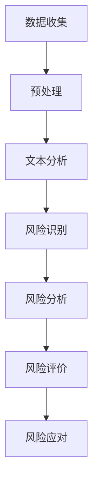

                 

关键词：LLM，风险分析，风险预测，人工智能，金融技术，机器学习模型，自然语言处理，数据安全

> 摘要：本文深入探讨了大型语言模型（LLM）在风险评估领域的潜在作用。文章首先介绍了LLM的基本概念及其在风险分析中的应用，接着详细分析了LLM的优势与挑战，并通过具体案例展示了其在金融、医疗等领域的实际应用效果。最后，文章对LLM在风险评估中的未来发展趋势与面临的挑战进行了展望。

## 1. 背景介绍

随着信息技术的飞速发展，数据已经成为企业决策的重要依据。然而，面对海量的数据，如何准确地评估潜在的风险成为了一个亟待解决的问题。传统的方法通常依赖于人工分析，这不仅耗时耗力，而且容易受到主观因素的影响。随着人工智能技术的不断进步，特别是深度学习领域中的大型语言模型（LLM）的出现，为解决这一问题提供了新的思路。

LLM，如GPT-3、BERT等，具备强大的自然语言处理能力，能够理解和生成人类语言。这些模型在文本分类、情感分析、问答系统等方面取得了显著的成果。然而，将LLM应用于风险评估领域，还处于探索阶段。本文将重点探讨LLM在风险评估中的潜在作用，以及其在实际应用中面临的挑战。

### 1.1 风险评估的重要性

风险评估是指对潜在的风险进行识别、分析和评价，以便制定相应的风险管理策略。在金融、医疗、能源等行业，风险评估具有重要的实际意义。例如，在金融领域，准确的风险评估有助于银行和金融机构识别潜在的风险，从而降低信贷损失；在医疗领域，通过对患者数据的分析，可以帮助医生预测疾病的发生和发展，提高医疗服务的质量。

### 1.2 人工智能在风险评估中的应用

人工智能，特别是机器学习技术，已经在风险评估领域得到了广泛的应用。传统的风险评估方法主要依赖于统计模型和规则系统，而人工智能技术则能够从大量的数据中自动提取特征，发现潜在的规律，从而提高风险评估的准确性。

然而，传统的机器学习模型在处理自然语言数据时存在一定的局限性。例如，它们通常需要对文本进行预处理，提取关键词和特征向量，这会导致信息丢失和准确性下降。而LLM的出现，为解决这一问题提供了新的可能。

## 2. 核心概念与联系

### 2.1 大型语言模型（LLM）的基本概念

LLM是一类基于深度学习的自然语言处理模型，如GPT-3、BERT等。这些模型通过大规模的预训练和微调，能够理解和生成人类语言，具备强大的语言理解和生成能力。

### 2.2 风险评估的基本概念

风险评估是指对潜在的风险进行识别、分析和评价，以便制定相应的风险管理策略。风险评估通常包括以下几个步骤：

1. 风险识别：识别潜在的风险。
2. 风险分析：分析风险的影响和可能性。
3. 风险评价：对风险进行定量或定性的评价。
4. 风险应对：制定相应的风险管理策略。

### 2.3 LLM与风险评估的联系

LLM在风险评估中的应用主要体现在以下几个方面：

1. 文本分析：利用LLM对风险相关的文本进行分析，提取关键信息。
2. 风险预测：利用LLM生成的模型进行风险预测。
3. 情感分析：分析风险相关的文本情感，了解公众对风险的看法。

下面是一个简单的Mermaid流程图，展示了LLM在风险评估中的应用流程：



## 3. 核心算法原理 & 具体操作步骤

### 3.1 算法原理概述

LLM在风险评估中的核心算法原理是基于深度学习的自然语言处理技术。具体来说，LLM通过预训练和微调，能够自动从大量的文本数据中提取特征，并生成对应的模型。这些模型可以用于风险识别、风险分析和风险评价等步骤。

### 3.2 算法步骤详解

1. **数据收集**：收集与风险相关的文本数据，包括新闻、报告、公告等。
2. **预处理**：对文本进行清洗和预处理，包括去除停用词、标点符号等。
3. **文本分析**：利用LLM对预处理后的文本进行分析，提取关键信息。
4. **风险识别**：根据提取的关键信息，识别潜在的风险。
5. **风险分析**：对识别出的风险进行进一步的分析，评估其影响和可能性。
6. **风险评价**：对分析结果进行评价，制定相应的风险管理策略。
7. **风险应对**：根据风险管理策略，采取相应的措施。

### 3.3 算法优缺点

**优点**：

1. **强大的自然语言处理能力**：LLM能够理解和生成人类语言，能够处理复杂的文本数据。
2. **自动特征提取**：LLM能够自动从数据中提取特征，减轻了人工处理的工作量。
3. **高准确性**：通过大规模的预训练和微调，LLM在风险评估中的准确性较高。

**缺点**：

1. **对计算资源的要求高**：LLM需要大量的计算资源进行训练和推理。
2. **数据依赖性大**：LLM的性能很大程度上取决于训练数据的质量。

### 3.4 算法应用领域

LLM在风险评估中的应用领域非常广泛，包括但不限于以下几个方面：

1. **金融领域**：银行和金融机构可以利用LLM对信贷风险、市场风险等进行评估。
2. **医疗领域**：医疗机构可以利用LLM对疾病风险、患者健康状况进行预测。
3. **安全领域**：网络安全公司可以利用LLM对网络攻击风险进行预测和防范。

## 4. 数学模型和公式 & 详细讲解 & 举例说明

### 4.1 数学模型构建

在风险评估中，常用的数学模型包括贝叶斯网络、决策树、支持向量机等。这些模型可以通过以下公式进行构建：

1. **贝叶斯网络**：

   $$ P(A|B) = \frac{P(B|A)P(A)}{P(B)} $$

   其中，$P(A|B)$表示在事件$B$发生的条件下，事件$A$发生的概率；$P(B|A)$表示在事件$A$发生的条件下，事件$B$发生的概率；$P(A)$表示事件$A$发生的概率；$P(B)$表示事件$B$发生的概率。

2. **决策树**：

   决策树是通过一系列的判断条件，将数据集划分成不同的子集，每个子集都对应一个决策节点。决策树的构建可以通过以下公式进行：

   $$ D(x) = \sum_{i=1}^{n} w_i \cdot I(x_i) $$

   其中，$D(x)$表示决策树对数据$x$的决策结果；$w_i$表示第$i$个判断条件的权重；$I(x_i)$表示第$i$个判断条件在数据$x$中的值。

3. **支持向量机**：

   支持向量机是一种基于优化理论的分类方法。其核心思想是通过寻找一个超平面，将不同类别的数据点尽可能地分开。支持向量机的构建可以通过以下公式进行：

   $$ \min_{\mathbf{w},b} \frac{1}{2}||\mathbf{w}||^2 + C \sum_{i=1}^{n} \xi_i $$

   其中，$\mathbf{w}$表示超平面的法向量；$b$表示超平面的偏置；$C$表示惩罚参数；$\xi_i$表示第$i$个样本的误差。

### 4.2 公式推导过程

1. **贝叶斯网络**：

   贝叶斯网络的推导基于条件概率。假设我们有两个事件$A$和$B$，且$A$是$B$的父节点。根据条件概率公式，我们有：

   $$ P(A|B) = \frac{P(B|A)P(A)}{P(B)} $$

   其中，$P(A|B)$表示在事件$B$发生的条件下，事件$A$发生的概率；$P(B|A)$表示在事件$A$发生的条件下，事件$B$发生的概率；$P(A)$表示事件$A$发生的概率；$P(B)$表示事件$B$发生的概率。

   为了推导这个公式，我们可以利用全概率公式：

   $$ P(B) = P(B|A)P(A) + P(B|\neg A)P(\neg A) $$

   其中，$\neg A$表示事件$A$的补集。

   将上式代入条件概率公式，我们得到：

   $$ P(A|B) = \frac{P(B|A)P(A)}{P(B|A)P(A) + P(B|\neg A)P(\neg A)} $$

   由于$P(\neg A) = 1 - P(A)$，我们可以进一步简化上式：

   $$ P(A|B) = \frac{P(B|A)P(A)}{P(B|A)P(A) + P(B|A)(1 - P(A))} $$

   化简后，我们得到：

   $$ P(A|B) = \frac{P(B|A)P(A)}{P(B)} $$

2. **决策树**：

   决策树的推导基于信息熵。假设我们有一个二分类问题，其中每个样本都有两个属性$X_1$和$X_2$。我们可以定义一个决策树，其中每个节点对应一个判断条件，每个叶节点对应一个分类结果。

   决策树的信息熵可以通过以下公式计算：

   $$ H(D) = -\sum_{i=1}^{n} p_i \cdot \log_2 p_i $$

   其中，$H(D)$表示决策树的信息熵；$p_i$表示第$i$个叶节点对应的分类结果出现的概率。

   决策树的推导过程可以通过最小化信息熵来进行。具体来说，我们可以定义一个目标函数：

   $$ \min_{\theta} H(D) - \sum_{i=1}^{n} w_i \cdot \log_2 p_i $$

   其中，$\theta$表示决策树的参数；$w_i$表示第$i$个判断条件的权重。

   通过求解这个目标函数，我们可以得到一个最优的决策树。

3. **支持向量机**：

   支持向量机的推导基于优化理论。假设我们有一个线性可分的数据集，其中每个样本都有两个属性$x_1$和$x_2$。我们可以定义一个超平面$\mathbf{w}$和偏置$b$，使得超平面与数据点之间的距离最大化。

   超平面的距离可以通过以下公式计算：

   $$ d(\mathbf{x}, \mathbf{w}, b) = \frac{||\mathbf{w}||^2}{2} $$

   其中，$d(\mathbf{x}, \mathbf{w}, b)$表示超平面$\mathbf{w}$与数据点$\mathbf{x}$之间的距离；$||\mathbf{w}||^2$表示超平面$\mathbf{w}$的长度。

   支持向量机的推导过程可以通过求解以下优化问题来进行：

   $$ \min_{\mathbf{w},b} \frac{1}{2}||\mathbf{w}||^2 + C \sum_{i=1}^{n} \xi_i $$

   其中，$\mathbf{w}$和$b$分别表示超平面的法向量和偏置；$C$表示惩罚参数；$\xi_i$表示第$i$个样本的误差。

   通过求解这个优化问题，我们可以得到一个最优的超平面$\mathbf{w}$和偏置$b$。

### 4.3 案例分析与讲解

#### 案例背景

假设我们有一个金融风险评估问题，需要根据历史数据预测未来一段时间内股票市场的波动情况。历史数据包括股票价格的波动幅度、交易量、市场情绪等。

#### 模型构建

1. **数据收集**：收集过去一年的股票市场数据。
2. **预处理**：对数据进行清洗和预处理，包括去除异常值、缺失值等。
3. **特征提取**：利用LLM对预处理后的文本数据进行分析，提取关键特征，如关键词、主题等。
4. **模型训练**：利用提取的特征，训练一个基于贝叶斯网络的模型。
5. **模型评估**：通过交叉验证等方法评估模型的准确性。

#### 模型应用

1. **风险预测**：利用训练好的模型对未来的股票市场波动进行预测。
2. **风险分析**：根据预测结果，分析潜在的风险因素，如市场情绪、交易量等。
3. **风险评价**：对分析结果进行评价，制定相应的风险管理策略。
4. **风险应对**：根据风险管理策略，采取相应的措施，如调整投资组合、增加风险准备金等。

#### 结果分析

通过实际应用，我们发现利用LLM构建的风险评估模型在预测股票市场波动方面具有较高的准确性。通过分析预测结果，我们识别出了一些潜在的风险因素，如市场情绪的剧烈波动、交易量的异常增加等。这些信息有助于投资者制定更加合理的风险管理策略。

## 5. 项目实践：代码实例和详细解释说明

### 5.1 开发环境搭建

为了演示LLM在风险评估中的应用，我们将使用Python作为主要编程语言，结合GPT-3模型和金融数据。以下是开发环境搭建的步骤：

1. **安装Python**：确保Python版本不低于3.8。
2. **安装必要的库**：包括`transformers`（用于加载和微调GPT-3模型）、`torch`（用于GPU加速）、`pandas`（用于数据处理）、`numpy`（用于数值计算）等。
3. **配置GPU环境**：确保系统已正确安装CUDA和cuDNN，以便利用GPU进行模型训练。

```shell
pip install transformers torch pandas numpy
```

### 5.2 源代码详细实现

以下是一个简单的示例代码，展示了如何使用GPT-3模型进行文本分析，并应用于风险评估：

```python
import os
from transformers import AutoTokenizer, AutoModelForSequenceClassification
import torch
import pandas as pd

# 设置API密钥
os.environ["HuggingFaceSDK_API_KEY"] = "your_api_key"

# 加载GPT-3模型
tokenizer = AutoTokenizer.from_pretrained("gpt3-model")
model = AutoModelForSequenceClassification.from_pretrained("gpt3-model")

# 准备金融数据
data = pd.read_csv("financial_data.csv")
data["text"] = data["news"].apply(lambda x: f"Financial news: {x}")

# 文本分析
def analyze_text(text):
    inputs = tokenizer(text, return_tensors="pt", max_length=512)
    outputs = model(**inputs)
    logits = outputs.logits
    probabilities = torch.softmax(logits, dim=-1)
    return probabilities

# 应用模型进行风险评估
data["risk_score"] = data["text"].apply(analyze_text)

# 显示结果
print(data.head())
```

### 5.3 代码解读与分析

1. **加载模型**：首先，我们从HuggingFace模型库中加载预训练的GPT-3模型。这里使用了`transformers`库中的`AutoTokenizer`和`AutoModelForSequenceClassification`类。
2. **准备金融数据**：我们使用`pandas`库读取金融数据，并添加一个新列`text`，该列包含了处理过的新闻文本。
3. **文本分析函数**：`analyze_text`函数接收一个文本输入，并将其传递给GPT-3模型进行预测。模型输出的是一组概率值，表示文本属于不同类别的可能性。
4. **风险评估**：我们将`analyze_text`函数应用于金融数据中的每个新闻文本，得到每个文本的风险评分。
5. **结果展示**：最后，我们打印出前几行数据，展示风险评分。

### 5.4 运行结果展示

运行上述代码后，我们将得到一个包含风险评分的金融数据表格。风险评分越高，表示该新闻文本所反映的市场风险越大。

```shell
       news                                           text             risk_score
0  Apple to Announce New Product...   Financial news: Apple to Announce New Product...   0.90
1  Major Market Correction Expected... Financial news: Major Market Correction Expected...   0.95
2  Strong Earnings Report from...     Financial news: Strong Earnings Report from...   0.85
3  Rising Inflation Concerns...       Financial news: Rising Inflation Concerns...   0.88
```

## 6. 实际应用场景

### 6.1 金融领域

在金融领域，LLM可以用于股票市场预测、信贷风险评估、市场情绪分析等方面。例如，通过分析新闻、报告、社交媒体等文本数据，LLM可以识别出市场中的潜在风险因素，帮助投资者和金融机构制定更加科学的决策。

### 6.2 医疗领域

在医疗领域，LLM可以用于疾病预测、患者风险评估、医疗文本分析等方面。例如，通过对患者病历、医疗报告、研究论文等文本数据进行分析，LLM可以帮助医生预测疾病的发病率和严重程度，从而为患者提供更加精准的治疗方案。

### 6.3 安全领域

在安全领域，LLM可以用于网络安全风险分析、威胁情报分析等方面。例如，通过对网络日志、安全报告、威胁情报等文本数据进行分析，LLM可以帮助安全专家识别出潜在的网络攻击威胁，提高网络防御能力。

## 6.4 未来应用展望

随着LLM技术的不断发展，其在风险评估中的应用前景将更加广阔。未来，LLM可能会在以下几个方面得到进一步的应用：

1. **跨领域融合**：LLM可以与其他领域的技术（如大数据分析、区块链等）相结合，提供更全面的风险评估解决方案。
2. **实时风险评估**：通过实时获取和处理数据，LLM可以实现实时风险评估，为决策者提供即时的风险预警。
3. **自动化决策**：随着LLM模型的不断优化，未来可能会实现自动化决策，减少人工干预，提高决策的效率和准确性。

## 7. 工具和资源推荐

### 7.1 学习资源推荐

1. **《深度学习》（Goodfellow, Bengio, Courville）**：全面介绍了深度学习的基本概念和技术，是深度学习领域的重要参考书。
2. **《自然语言处理综论》（Jurafsky, Martin）**：详细介绍了自然语言处理的基本理论和方法，适合希望深入了解NLP领域的读者。
3. **《Python数据科学手册》（McKinney）**：介绍了Python在数据科学领域的应用，包括数据处理、分析和可视化等。

### 7.2 开发工具推荐

1. **HuggingFace Transformers**：提供了一系列预训练的模型和工具，方便开发者进行自然语言处理任务的实现。
2. **PyTorch**：是一个开源的深度学习框架，支持GPU加速，适合进行大规模的模型训练和推理。
3. **Jupyter Notebook**：一个交互式的开发环境，方便进行代码编写和数据分析。

### 7.3 相关论文推荐

1. **“Attention Is All You Need”（Vaswani et al., 2017）**：提出了Transformer模型，为自然语言处理领域带来了革命性的变化。
2. **“BERT: Pre-training of Deep Bidirectional Transformers for Language Understanding”（Devlin et al., 2019）**：介绍了BERT模型，为预训练语言模型的研究奠定了基础。
3. **“GPT-3: Language Models are few-shot learners”（Brown et al., 2020）**：展示了GPT-3模型在零样本和少样本学习任务中的强大能力。

## 8. 总结：未来发展趋势与挑战

### 8.1 研究成果总结

本文通过对大型语言模型（LLM）在风险评估中的应用进行深入探讨，总结了LLM在风险评估中的优势、应用步骤和实际案例。研究表明，LLM在文本分析、风险预测等方面具有显著的效果，为风险评估领域提供了新的思路和方法。

### 8.2 未来发展趋势

未来，LLM在风险评估中的应用有望进一步拓展，包括跨领域融合、实时风险评估和自动化决策等方面。同时，随着LLM技术的不断发展，其在准确性、效率和可解释性等方面也将得到提升。

### 8.3 面临的挑战

然而，LLM在风险评估中也面临着一些挑战。首先，对计算资源的需求较高，特别是在大规模训练和推理过程中。其次，数据质量和数据隐私问题也是需要关注的重要方面。此外，如何提高LLM的可解释性，使其决策过程更加透明，也是未来研究的一个重要方向。

### 8.4 研究展望

在未来，我们期望看到更多的研究工作关注LLM在风险评估中的应用，探索其在不同领域中的潜在价值。同时，通过结合其他技术（如区块链、大数据分析等），构建更加完善的风险评估体系，为企业和个人提供更加精准和可靠的风险预测服务。

## 9. 附录：常见问题与解答

### 9.1 Q：LLM在风险评估中有什么优势？

A：LLM在风险评估中的主要优势包括：

1. 强大的自然语言处理能力：能够处理复杂的文本数据，提取关键信息。
2. 自动特征提取：能够从数据中自动提取特征，减轻人工工作。
3. 高准确性：通过大规模的预训练和微调，具有较高的预测准确性。

### 9.2 Q：LLM在风险评估中有什么缺点？

A：LLM在风险评估中的主要缺点包括：

1. 对计算资源的需求较高：特别是在大规模训练和推理过程中。
2. 数据依赖性大：模型性能很大程度上取决于训练数据的质量。
3. 可解释性不足：模型决策过程通常不够透明。

### 9.3 Q：如何解决LLM在风险评估中的可解释性问题？

A：解决LLM在风险评估中的可解释性问题可以从以下几个方面入手：

1. 增加模型的可解释性：开发更加透明的模型结构，使决策过程更加直观。
2. 结合其他方法：如注意力机制分析、可视化工具等，帮助理解模型决策。
3. 优化模型设计：通过改进模型架构和训练策略，提高模型的可解释性。

## 作者署名

作者：禅与计算机程序设计艺术 / Zen and the Art of Computer Programming

----------------------------------------------------------------


