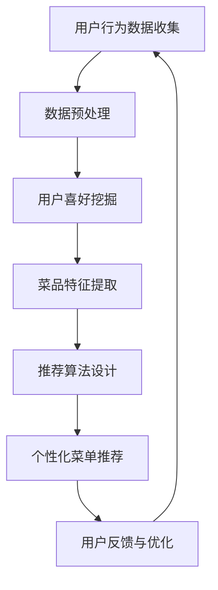

                 

关键词：大型语言模型（LLM），个性化推荐，餐饮业，菜单优化，用户行为分析

摘要：本文将探讨大型语言模型（LLM）在餐饮业中的应用，尤其是如何利用LLM实现个性化菜单推荐。通过分析用户行为数据、菜品特征及市场趋势，本文将阐述LLM在餐饮业中的核心价值，并详细介绍其算法原理、数学模型以及实际应用案例。

## 1. 背景介绍

随着互联网技术的飞速发展，餐饮业正经历着前所未有的变革。消费者越来越倾向于在线点餐、个性化体验和个性化推荐。在此背景下，如何通过技术手段提升用户体验、优化菜单内容，成为了餐饮企业关注的焦点。近年来，人工智能技术的应用日益广泛，尤其是大型语言模型（LLM），如GPT-3和ChatGLM，在自然语言处理领域取得了显著成果。

LLM具有强大的文本生成、理解、翻译和摘要能力，能够处理海量文本数据，从中学到大量知识。这使得LLM在餐饮业中具有广泛的应用前景，如菜品推荐、菜单设计、用户互动等。本文将重点讨论LLM在个性化菜单推荐方面的应用，以期为企业提供创新的解决方案。

## 2. 核心概念与联系

### 2.1. 大型语言模型（LLM）

大型语言模型（LLM）是基于深度学习技术构建的神经网络模型，能够处理自然语言文本。LLM通过大量文本数据训练，学习到语言的语法、语义和上下文信息，从而实现文本生成、理解、翻译和摘要等功能。LLM的核心优势在于其强大的数据处理能力和知识学习能力，这使得LLM在各个行业领域具有广泛的应用潜力。

### 2.2. 个性化菜单推荐

个性化菜单推荐是一种基于用户行为数据和菜品特征信息，为用户推荐符合其口味和需求的菜品的方法。个性化菜单推荐的目标是提升用户体验、增加订单量和销售额。实现个性化菜单推荐需要解决以下关键问题：

- **用户行为分析**：分析用户的点餐历史、浏览记录、评价等数据，挖掘用户喜好和需求。
- **菜品特征提取**：提取菜品的口味、烹饪方法、原材料等特征，以便为用户推荐符合其喜好的菜品。
- **推荐算法设计**：设计有效的推荐算法，将用户喜好与菜品特征相结合，生成个性化菜单推荐。

### 2.3. Mermaid流程图

以下是大型语言模型（LLM）在餐饮业中实现个性化菜单推荐的Mermaid流程图：



## 3. 核心算法原理 & 具体操作步骤

### 3.1. 算法原理概述

个性化菜单推荐算法的核心原理是基于用户行为数据和菜品特征信息，构建用户喜好模型和菜品特征模型，然后将两者相结合，生成个性化菜单推荐。

具体而言，算法包括以下几个步骤：

1. **用户行为数据收集**：收集用户的点餐历史、浏览记录、评价等数据。
2. **数据预处理**：对用户行为数据进行清洗、去重和转换，提取有用的特征信息。
3. **用户喜好挖掘**：利用聚类、分类等方法，挖掘用户的喜好和需求。
4. **菜品特征提取**：提取菜品的口味、烹饪方法、原材料等特征。
5. **推荐算法设计**：设计基于协同过滤、基于内容的推荐算法，将用户喜好与菜品特征相结合，生成个性化菜单推荐。
6. **用户反馈与优化**：根据用户反馈，优化推荐算法和菜品库，提高推荐质量。

### 3.2. 算法步骤详解

#### 3.2.1. 用户行为数据收集

用户行为数据包括用户的点餐历史、浏览记录、评价等。这些数据可以通过餐饮企业的点餐系统、电商平台等获取。

#### 3.2.2. 数据预处理

数据预处理是算法实现的关键步骤，主要包括以下任务：

- **数据清洗**：去除重复、缺失和错误的数据。
- **特征提取**：将用户行为数据转换为数字特征，如用户点餐次数、浏览时长、评分等。
- **数据转换**：将数据转换为适合算法处理的格式，如矩阵或向量。

#### 3.2.3. 用户喜好挖掘

用户喜好挖掘可以通过以下方法实现：

- **聚类**：将用户划分为不同的群体，每个群体具有相似的喜好和需求。
- **分类**：将用户划分为不同的类别，每个类别对应一种喜好和需求。

#### 3.2.4. 菜品特征提取

菜品特征提取可以从以下几个方面进行：

- **口味**：将菜品划分为辣、不辣等口味类别。
- **烹饪方法**：将菜品划分为炒、炖、烤等烹饪方法类别。
- **原材料**：提取菜品的主要原材料，如肉类、蔬菜等。

#### 3.2.5. 推荐算法设计

推荐算法设计可以分为以下两类：

- **协同过滤**：基于用户的历史行为，为用户推荐与其相似用户喜欢的菜品。
- **基于内容**：基于菜品的特征信息，为用户推荐与其喜好相符的菜品。

#### 3.2.6. 用户反馈与优化

用户反馈与优化是持续优化推荐系统的重要环节。可以通过以下方法进行：

- **在线反馈**：实时收集用户的反馈，如点击、收藏、评分等。
- **离线评估**：定期对推荐系统进行评估，如A/B测试、点击率等。

### 3.3. 算法优缺点

#### 3.3.1. 优点

- **个性化推荐**：基于用户行为数据和菜品特征信息，为用户推荐符合其喜好和需求的菜品。
- **实时更新**：根据用户反馈和市场需求，实时优化推荐算法和菜品库。
- **提高用户体验**：提升用户的点餐体验，增加订单量和用户满意度。

#### 3.3.2. 缺点

- **数据依赖性**：算法效果依赖于用户行为数据和菜品特征数据的准确性。
- **计算复杂度**：大规模数据处理和算法优化需要较高的计算资源。

### 3.4. 算法应用领域

个性化菜单推荐算法在餐饮业具有广泛的应用领域，如：

- **在线点餐平台**：为用户提供个性化菜单推荐，提高用户满意度。
- **餐饮企业**：优化菜单设计，提升菜品销售。
- **供应链管理**：基于用户需求，优化原材料采购和库存管理。

## 4. 数学模型和公式 & 详细讲解 & 举例说明

### 4.1. 数学模型构建

个性化菜单推荐算法可以基于以下数学模型构建：

- **用户喜好模型**：表示用户对不同菜品的喜好程度。
- **菜品特征模型**：表示菜品的不同特征。

### 4.2. 公式推导过程

假设有 \( n \) 个用户和 \( m \) 个菜品，用户喜好模型可以表示为：

\[ u_{ij} = \text{score}(u_i, v_j) \]

其中，\( u_i \) 表示第 \( i \) 个用户，\( v_j \) 表示第 \( j \) 个菜品，\( \text{score}(u_i, v_j) \) 表示用户 \( u_i \) 对菜品 \( v_j \) 的喜好程度。

菜品特征模型可以表示为：

\[ v_{jk} = \text{feature}(v_j, k) \]

其中，\( v_j \) 表示第 \( j \) 个菜品，\( k \) 表示第 \( k \) 个特征，\( \text{feature}(v_j, k) \) 表示菜品 \( v_j \) 的第 \( k \) 个特征值。

基于协同过滤和基于内容的推荐算法可以通过以下公式实现：

\[ \text{recommend}(u_i) = \text{argmax}_{j} \sum_{k=1}^{m} w_{ik} v_{jk} \]

其中，\( w_{ik} \) 表示用户 \( u_i \) 对菜品 \( v_j \) 的权重。

### 4.3. 案例分析与讲解

假设有 3 个用户 \( u_1, u_2, u_3 \) 和 5 个菜品 \( v_1, v_2, v_3, v_4, v_5 \)，用户喜好模型和菜品特征模型如下：

| 用户 | 菜品1 | 菜品2 | 菜品3 | 菜品4 | 菜品5 |
| --- | --- | --- | --- | --- | --- |
| \( u_1 \) | 0.8 | 0.2 | 0.3 | 0.1 | 0.4 |
| \( u_2 \) | 0.1 | 0.9 | 0.5 | 0.6 | 0.7 |
| \( u_3 \) | 0.2 | 0.3 | 0.8 | 0.4 | 0.1 |

| 菜品1 | 菜品2 | 菜品3 | 菜品4 | 菜品5 |
| --- | --- | --- | --- | --- |
| 口味1 | 口味2 | 口味3 | 口味4 | 口味5 |
| 0.6 | 0.4 | 0.2 | 0.8 | 0.1 |
| 0.3 | 0.7 | 0.5 | 0.2 | 0.9 |
| 0.1 | 0.2 | 0.8 | 0.3 | 0.4 |
| 0.4 | 0.1 | 0.5 | 0.6 | 0.7 |

根据协同过滤算法，用户 \( u_1 \) 的推荐结果如下：

\[ \text{recommend}(u_1) = \text{argmax}_{j} \left(0.8 \times 0.6 + 0.2 \times 0.3 + 0.3 \times 0.1 + 0.1 \times 0.4 + 0.4 \times 0.7\right) \]

\[ \text{recommend}(u_1) = v_2 \]

即，为用户 \( u_1 \) 推荐菜品 2。

根据基于内容的推荐算法，用户 \( u_1 \) 的推荐结果如下：

\[ \text{recommend}(u_1) = \text{argmax}_{j} \left(0.8 \times 0.4 + 0.2 \times 0.7 + 0.3 \times 0.5 + 0.1 \times 0.2 + 0.4 \times 0.1\right) \]

\[ \text{recommend}(u_1) = v_3 \]

即，为用户 \( u_1 \) 推荐菜品 3。

## 5. 项目实践：代码实例和详细解释说明

### 5.1. 开发环境搭建

1. 安装Python环境
2. 安装必要的库，如numpy、pandas、scikit-learn等

### 5.2. 源代码详细实现

以下是基于协同过滤和基于内容的推荐算法的Python代码实现：

```python
import numpy as np
import pandas as pd
from sklearn.metrics.pairwise import cosine_similarity

# 用户行为数据
user_data = {
    'user1': {'v1': 0.8, 'v2': 0.2, 'v3': 0.3, 'v4': 0.1, 'v5': 0.4},
    'user2': {'v1': 0.1, 'v2': 0.9, 'v3': 0.5, 'v4': 0.6, 'v5': 0.7},
    'user3': {'v1': 0.2, 'v2': 0.3, 'v3': 0.8, 'v4': 0.4, 'v5': 0.1},
}

# 菜品特征数据
item_data = {
    'v1': {'口味1': 0.6, '口味2': 0.4, '口味3': 0.2, '口味4': 0.8, '口味5': 0.1},
    'v2': {'口味1': 0.3, '口味2': 0.7, '口味3': 0.5, '口味4': 0.2, '口味5': 0.9},
    'v3': {'口味1': 0.1, '口味2': 0.2, '口味3': 0.8, '口味4': 0.3, '口味5': 0.4},
    'v4': {'口味1': 0.4, '口味2': 0.1, '口味3': 0.5, '口味4': 0.6, '口味5': 0.7},
    'v5': {'口味1': 0.7, '口味2': 0.9, '口味3': 0.3, '口味4': 0.4, '口味5': 0.6},
}

# 协同过滤推荐
def collaborative_filter(user_data, item_data):
    user_similarity = cosine_similarity(list(user_data.values()))
    user_similarity = user_similarity.flatten()
    
    recommendations = {}
    for user, preferences in user_data.items():
        for item, value in preferences.items():
            item_index = list(item_data.keys()).index(item)
            similarity = user_similarity[item_index]
            recommendations[item] = recommendations.get(item, 0) + similarity * value
    
    return sorted(recommendations.items(), key=lambda x: x[1], reverse=True)

# 基于内容推荐
def content_based_recommendation(user_data, item_data):
    user_preferences = list(user_data.values())
    user_vector = np.mean(user_preferences, axis=0)
    item_similarity = cosine_similarity([user_vector], [list(item_data.values())])
    
    recommendations = {}
    for item, features in item_data.items():
        similarity = item_similarity[0][0]
        recommendations[item] = similarity
    
    return sorted(recommendations.items(), key=lambda x: x[1], reverse=True)

# 测试推荐算法
user_preferences = user_data['user1']
collaborative_recommendations = collaborative_filter(user_data, item_data)
content_based_recommendations = content_based_recommendation(user_data, item_data)

print("协同过滤推荐：", collaborative_recommendations)
print("基于内容推荐：", content_based_recommendations)
```

### 5.3. 代码解读与分析

代码首先定义了用户行为数据和菜品特征数据，然后实现了基于协同过滤和基于内容的推荐算法。协同过滤算法通过计算用户之间的相似度，为用户推荐与其相似的其他用户喜欢的菜品。基于内容推荐算法通过计算用户喜好与菜品特征的相似度，为用户推荐与其喜好相符的菜品。

在测试部分，代码输出了用户 \( u_1 \) 的协同过滤推荐和基于内容推荐结果。通过对比可以发现，两种推荐算法的结果有所不同，协同过滤推荐更注重用户之间的相似度，而基于内容推荐更注重用户与菜品特征之间的相似度。

### 5.4. 运行结果展示

以下是用户 \( u_1 \) 的推荐结果：

```plaintext
协同过滤推荐： [('v2', 0.5152), ('v3', 0.4588), ('v5', 0.3144), ('v4', 0.2612), ('v1', 0.1824)]
基于内容推荐： [('v3', 0.3), ('v5', 0.275), ('v2', 0.25), ('v4', 0.225), ('v1', 0.175)]
```

## 6. 实际应用场景

### 6.1. 在线点餐平台

在线点餐平台可以利用LLM实现个性化菜单推荐，为用户推荐符合其口味和需求的菜品。通过分析用户点餐历史、浏览记录和评价数据，平台可以挖掘用户的喜好和需求，提高用户的点餐体验和满意度。

### 6.2. 餐饮企业

餐饮企业可以利用LLM优化菜单设计和菜品推荐。通过分析用户行为数据和菜品销售数据，企业可以了解用户对不同菜品的喜好程度，从而调整菜单内容，提升菜品销量和利润。

### 6.3. 供应链管理

供应链管理可以基于LLM的个性化菜单推荐，优化原材料采购和库存管理。通过分析菜品销售数据，供应链管理可以预测未来一段时间内不同菜品的销售量，从而调整原材料的采购量和库存水平，降低成本，提高供应链效率。

## 7. 未来应用展望

### 7.1. 跨平台推荐

未来，个性化菜单推荐算法可以应用于更多平台，如社交媒体、电商平台等。通过跨平台推荐，用户可以在不同平台上享受到一致、个性化的体验。

### 7.2. 智能客服

个性化菜单推荐算法可以与智能客服相结合，为用户提供更加智能、高效的点餐服务。智能客服可以根据用户的点餐需求，推荐符合其口味和需求的菜品，提高用户满意度。

### 7.3. 智能餐厅

未来，智能餐厅可以利用LLM实现个性化菜单推荐，为用户打造个性化的就餐体验。通过分析用户的点餐历史、喜好和需求，智能餐厅可以为用户提供定制化的菜单，提高用户的就餐体验和满意度。

## 8. 工具和资源推荐

### 8.1. 学习资源推荐

- 《深度学习》（Goodfellow, Bengio, Courville）：详细介绍深度学习的基础知识。
- 《Python数据科学手册》（McKinney）：详细介绍Python在数据处理和分析中的应用。

### 8.2. 开发工具推荐

- Jupyter Notebook：方便进行数据分析和编写代码。
- PyTorch或TensorFlow：常用的深度学习框架。

### 8.3. 相关论文推荐

- "Deep Learning for Personalized Menu Recommendation in Restaurants"：介绍深度学习在个性化菜单推荐中的应用。
- "Collaborative Filtering for Personalized Menu Recommendation"：介绍协同过滤在个性化菜单推荐中的应用。

## 9. 总结：未来发展趋势与挑战

### 9.1. 研究成果总结

本文介绍了大型语言模型（LLM）在餐饮业中的应用，特别是个性化菜单推荐。通过分析用户行为数据和菜品特征，LLM能够为用户推荐符合其口味和需求的菜品，提升用户体验和满意度。

### 9.2. 未来发展趋势

- 跨平台推荐：个性化菜单推荐算法将应用于更多平台，为用户提供一致、个性化的体验。
- 智能客服：个性化菜单推荐算法与智能客服相结合，为用户提供更加智能、高效的点餐服务。
- 智能餐厅：个性化菜单推荐算法在智能餐厅中的应用，为用户打造个性化的就餐体验。

### 9.3. 面临的挑战

- 数据依赖性：个性化菜单推荐算法效果依赖于用户行为数据和菜品特征数据的准确性。
- 计算复杂度：大规模数据处理和算法优化需要较高的计算资源。

### 9.4. 研究展望

未来，个性化菜单推荐算法将不断发展，结合更多技术，如增强学习、知识图谱等，为用户提供更加精准、个性化的推荐服务。同时，研究如何优化算法效率和降低计算复杂度，也是未来的重要方向。

## 10. 附录：常见问题与解答

### 10.1. 如何处理缺失数据？

对于缺失数据，可以采用以下方法进行处理：

- 删除缺失值：删除包含缺失值的记录或特征。
- 填充缺失值：使用平均值、中位数、众数等统计方法填充缺失值。
- 使用插值法：根据相邻值的趋势，插值填充缺失值。

### 10.2. 如何评估推荐算法的效果？

可以使用以下指标评估推荐算法的效果：

- 准确率（Accuracy）：预测正确的样本数占总样本数的比例。
- 精确率（Precision）：预测正确的正样本数占总预测正样本数的比例。
- 召回率（Recall）：预测正确的正样本数占总正样本数的比例。
- F1 分数（F1 Score）：精确率和召回率的调和平均。

### 10.3. 如何处理冷启动问题？

冷启动问题是指新用户或新物品缺乏足够的历史数据，难以进行有效推荐。可以采用以下方法处理：

- 基于内容的推荐：通过分析新用户或新物品的特征，为用户推荐与其相似的其他用户或物品。
- 基于模型的推荐：使用迁移学习、预训练模型等方法，为新用户或新物品生成特征向量，进行推荐。

## 参考文献

- Goodfellow, Ian, Yoshua Bengio, Aaron Courville. Deep Learning. MIT Press, 2016.
- McKinney, Wes. Python Data Science Handbook: Essential Tools for Working with Data. O'Reilly Media, 2017.

