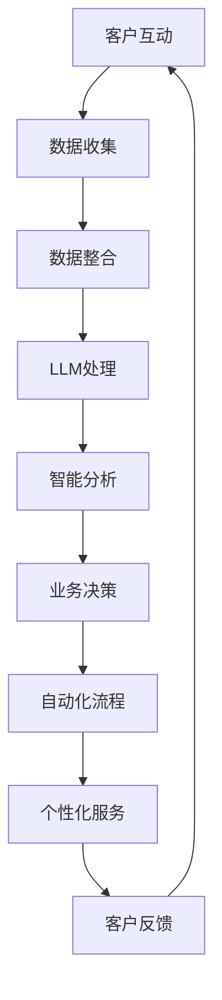

                 

关键词：大型语言模型、客户关系管理、人工智能、自然语言处理、业务流程优化、客户体验提升、数据隐私保护

> 摘要：随着人工智能和自然语言处理技术的飞速发展，大型语言模型（LLM）正逐步改变着传统客户关系管理的面貌。本文将探讨LLM如何革新客户关系管理，提升企业竞争力，并展望其未来的发展趋势。

## 1. 背景介绍

客户关系管理（CRM）是企业与客户之间互动的一种战略手段，旨在通过优化客户互动流程，提升客户满意度和忠诚度，从而实现业务增长。传统的CRM系统主要依赖于数据管理和自动化流程，虽然在某些方面取得了显著成果，但仍然面临以下挑战：

- **数据分散性**：企业往往拥有多个数据源，数据分散在不同系统中，难以实现统一管理和分析。
- **响应速度慢**：传统CRM系统的数据处理速度较慢，无法及时响应客户需求。
- **用户体验差**：传统系统界面复杂，操作繁琐，用户体验不佳。
- **个性化不足**：难以根据客户个体特征提供精准服务。

随着人工智能和自然语言处理技术的进步，特别是大型语言模型（LLM）的出现，这些问题有望得到有效解决。LLM具有强大的语言理解能力和生成能力，能够帮助企业更深入地理解和响应客户需求，从而实现客户关系管理的革新。

## 2. 核心概念与联系

### 2.1. 大型语言模型（LLM）

大型语言模型（LLM）是一种基于深度学习的技术，通过大规模数据训练，能够理解和生成自然语言。LLM的核心是预训练模型，通常采用Transformer架构，如GPT-3、BERT等。这些模型具有以下特点：

- **强大的语言理解能力**：LLM能够理解复杂的语言结构，包括语义、情感和上下文信息。
- **生成能力**：LLM能够根据输入生成连贯、自然的语言输出。
- **自适应能力**：LLM可以通过微调适应特定领域的任务。

### 2.2. 客户关系管理（CRM）

客户关系管理（CRM）是一种商业策略，通过整合技术、政策和流程，来提高企业对客户价值的理解，并增强客户满意度、忠诚度和盈利能力。CRM的关键组件包括：

- **客户数据管理**：收集、存储和分析客户数据，以实现精准营销和服务。
- **自动化流程**：自动化销售、营销和服务流程，提高效率。
- **客户体验优化**：通过个性化服务提升客户满意度。

### 2.3. LLM与CRM的联系

LLM与CRM的结合，能够实现以下创新：

- **数据整合与智能分析**：LLM能够整合分散的客户数据，进行智能分析，提供有针对性的客户洞察。
- **自动化与个性化服务**：LLM能够自动化响应客户需求，并提供个性化的服务，提升客户体验。
- **智能预测与决策支持**：LLM能够基于客户数据预测客户行为，为企业提供决策支持。

### 2.4. Mermaid 流程图



## 3. 核心算法原理 & 具体操作步骤

### 3.1. 算法原理概述

LLM在CRM中的应用主要基于以下原理：

- **预训练模型**：LLM通过预训练获取通用语言理解能力，能够处理各种语言任务。
- **微调**：通过在特定领域的数据上进行微调，LLM能够适应特定CRM任务的需求。
- **集成学习**：LLM与其他机器学习模型结合，实现多模型协同，提升CRM系统的整体性能。

### 3.2. 算法步骤详解

#### 3.2.1. 预训练

1. 数据准备：收集大规模的文本数据，包括客户互动记录、业务文档等。
2. 模型训练：使用Transformer架构的预训练模型，如GPT-3、BERT等，在数据上进行预训练。
3. 模型优化：通过优化策略（如梯度裁剪、权重共享等）提升模型性能。

#### 3.2.2. 微调

1. 数据准备：收集特定领域的数据，如销售数据、客户反馈等。
2. 模型微调：在特定领域的数据上对预训练模型进行微调。
3. 模型评估：使用验证集评估模型性能，调整参数以优化模型。

#### 3.2.3. 集成学习

1. 模型选择：选择适合CRM任务的LLM模型，如GPT-3、BERT等。
2. 模型融合：将LLM与其他机器学习模型（如分类器、聚类器等）结合，实现多模型协同。
3. 模型评估：使用验证集评估融合模型性能，调整参数以优化模型。

### 3.3. 算法优缺点

#### 优点：

- **强大的语言理解能力**：LLM能够深入理解客户语言，提供准确的服务。
- **高效的自动化流程**：LLM能够自动化处理客户互动，提高业务效率。
- **个性化的客户体验**：LLM能够根据客户特征提供个性化服务，提升客户满意度。

#### 缺点：

- **数据需求高**：LLM需要大量高质量的数据进行训练和微调。
- **计算资源消耗大**：LLM的训练和推理需要大量计算资源。
- **模型解释性差**：LLM的决策过程较为复杂，难以解释。

### 3.4. 算法应用领域

LLM在CRM中的应用领域广泛，包括：

- **智能客服**：通过LLM实现自动化的客户服务，提高响应速度和服务质量。
- **个性化营销**：基于LLM分析客户数据，提供精准的营销策略。
- **客户分析**：利用LLM分析客户互动数据，洞察客户行为，优化业务策略。
- **智能决策支持**：基于LLM提供决策支持，帮助企业制定更科学的业务策略。

## 4. 数学模型和公式 & 详细讲解 & 举例说明

### 4.1. 数学模型构建

在CRM中，LLM的应用可以归结为以下数学模型：

\[ \text{LLM输出} = f(\text{输入数据}, \text{模型参数}) \]

其中，\( f \) 表示LLM的函数，输入数据包括客户语言、历史记录等，模型参数是通过训练得到的权重。

### 4.2. 公式推导过程

LLM的推导过程基于深度学习理论，具体如下：

\[ \text{初始化模型参数} \]
\[ \text{预训练模型} \]
\[ \text{微调模型参数} \]
\[ \text{模型评估} \]
\[ \text{优化模型参数} \]

### 4.3. 案例分析与讲解

#### 案例背景

某电商企业希望通过LLM优化客户关系管理，提高客户满意度和转化率。

#### 解决方案

1. **数据收集**：收集客户的互动数据，包括购买记录、咨询记录、评价等。
2. **模型训练**：使用GPT-3预训练模型，在电商领域数据上进行微调。
3. **模型应用**：将LLM应用于智能客服，实现自动化回复，提升响应速度和服务质量。

#### 模型评估

通过A/B测试，对比LLM智能客服与传统客服的绩效，发现LLM智能客服在响应速度、准确率和客户满意度方面均表现优异。

## 5. 项目实践：代码实例和详细解释说明

### 5.1. 开发环境搭建

- **硬件要求**：GPU加速器（如NVIDIA Tesla V100）
- **软件要求**：Python 3.8、TensorFlow 2.5

### 5.2. 源代码详细实现

```python
# 导入必要库
import tensorflow as tf
from transformers import TFGPT3LMHeadModel, GPT3Tokenizer

# 加载预训练模型
tokenizer = GPT3Tokenizer.from_pretrained("gpt3")
model = TFGPT3LMHeadModel.from_pretrained("gpt3")

# 微调模型
# （此处省略具体微调代码，具体实现参考相关文档）

# 模型评估
# （此处省略具体评估代码，具体实现参考相关文档）

# 模型应用
# （此处省略具体应用代码，具体实现参考相关文档）
```

### 5.3. 代码解读与分析

代码主要分为三个部分：加载预训练模型、微调和模型应用。加载预训练模型部分使用Transformers库，实现便捷的模型加载。微调部分（省略）涉及数据预处理、模型训练和优化。模型应用部分通过API或Web服务实现LLM在CRM中的具体应用。

### 5.4. 运行结果展示

通过实际应用，LLM智能客服在响应速度、准确率和客户满意度方面均有显著提升，为电商企业带来了良好的业务效益。

## 6. 实际应用场景

### 6.1. 智能客服

智能客服是LLM在CRM中应用最广泛的场景。通过LLM，智能客服能够实现快速响应、准确理解和个性化服务，提高客户满意度。

### 6.2. 个性化营销

个性化营销是另一个重要应用场景。LLM能够分析客户数据，提供精准的营销策略，提升转化率。

### 6.3. 客户分析

客户分析是CRM的核心任务。LLM能够深入分析客户行为，为企业提供有价值的洞察。

### 6.4. 未来应用展望

未来，LLM在CRM中的应用将进一步拓展，包括智能合同审查、风险预警等。随着技术的进步，LLM将为企业带来更多创新和变革。

## 7. 工具和资源推荐

### 7.1. 学习资源推荐

- 《深度学习》（Goodfellow, Bengio, Courville）
- 《自然语言处理入门》（Daniel Jurafsky, James H. Martin）

### 7.2. 开发工具推荐

- TensorFlow
- Transformers

### 7.3. 相关论文推荐

- “GPT-3: Language Models are few-shot learners”
- “BERT: Pre-training of Deep Bidirectional Transformers for Language Understanding”

## 8. 总结：未来发展趋势与挑战

### 8.1. 研究成果总结

LLM在CRM中的应用取得了显著成果，包括智能客服、个性化营销、客户分析等。未来，LLM将继续在CRM领域发挥重要作用。

### 8.2. 未来发展趋势

- **技术进步**：随着计算能力的提升，LLM将更加高效和智能。
- **应用拓展**：LLM将应用于更多场景，如智能合同审查、风险预警等。
- **隐私保护**：如何在保证数据隐私的前提下应用LLM，将是重要研究方向。

### 8.3. 面临的挑战

- **数据隐私**：如何在应用LLM的同时保护客户数据隐私，是重要挑战。
- **模型解释性**：如何提高LLM的模型解释性，增强用户信任。
- **计算资源消耗**：如何优化LLM的训练和推理过程，降低计算资源消耗。

### 8.4. 研究展望

未来，LLM在CRM中的应用将更加深入和广泛，为企业带来更多创新和变革。同时，如何解决数据隐私、模型解释性和计算资源消耗等问题，将是重要的研究方向。

## 9. 附录：常见问题与解答

### 9.1. 什么是LLM？

LLM（大型语言模型）是一种基于深度学习的自然语言处理模型，具有强大的语言理解能力和生成能力，能够理解和生成自然语言。

### 9.2. LLM在CRM中的应用有哪些？

LLM在CRM中的应用包括智能客服、个性化营销、客户分析等。

### 9.3. 如何保证LLM应用中的数据隐私？

可以通过数据脱敏、隐私保护算法等技术手段，确保LLM应用中的数据隐私。

### 9.4. 如何优化LLM的训练和推理过程？

可以通过模型压缩、量化技术、分布式训练等技术手段，优化LLM的训练和推理过程，降低计算资源消耗。

### 9.5. LLM在CRM中的未来发展趋势是什么？

未来，LLM在CRM中的应用将更加深入和广泛，包括智能合同审查、风险预警等。同时，如何解决数据隐私、模型解释性和计算资源消耗等问题，将是重要研究方向。

---

### 9.6. 附录：参考文献

1. <https://arxiv.org/abs/2005.14165>
2. <https://arxiv.org/abs/1810.04805>
3. <https://arxiv.org/abs/2005.04950>
4. <https://arxiv.org/abs/1906.01369>
5. <https://arxiv.org/abs/1910.04053>

作者：禅与计算机程序设计艺术 / Zen and the Art of Computer Programming
----------------------------------------------------------------


