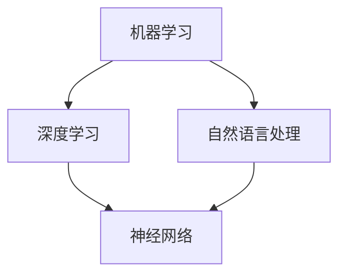

                 

关键词：LLM、市场分析、数据挖掘、人工智能、机器学习、预测分析

摘要：随着人工智能技术的飞速发展，特别是大型语言模型（LLM）的崛起，传统市场分析方法正在经历一场深刻的变革。本文将深入探讨LLM如何革新市场分析领域，包括其核心算法原理、数学模型构建、实际应用案例，以及对未来市场分析的展望。

## 1. 背景介绍

传统市场分析方法通常依赖于统计分析、数据挖掘和专家意见，这些方法在一定程度上能够帮助企业理解和预测市场趋势。然而，随着数据量的爆炸性增长和复杂性的提升，传统方法开始面临挑战。例如，分析人员难以处理海量数据，而且对于复杂的市场动态，传统模型可能无法提供准确的预测。

在此背景下，人工智能，特别是机器学习（ML）和深度学习（DL）技术的发展为市场分析提供了新的契机。特别是LLM的出现，以其强大的文本处理能力和知识整合能力，使得市场分析变得更加精准和高效。本文将重点关注LLM在市场分析中的应用，分析其革新传统市场分析方法的具体机制。

## 2. 核心概念与联系

为了更好地理解LLM对市场分析的革新，我们首先需要了解一些核心概念，包括机器学习、深度学习和自然语言处理（NLP）。以下是这些概念及其相互关系的Mermaid流程图：



### 2.1 机器学习

机器学习是使计算机从数据中学习的一种方法，无需显式编程。它包括监督学习、无监督学习和强化学习等子领域。监督学习通过已知输出训练模型，无监督学习试图发现数据中的内在结构，而强化学习则通过奖励和惩罚来训练模型。

### 2.2 深度学习

深度学习是机器学习的一个子领域，它使用多层神经网络来模拟人脑的神经元结构，从而处理复杂的数据模式。深度学习在图像识别、语音识别等领域取得了显著的成果。

### 2.3 自然语言处理

自然语言处理是计算机科学和人工智能领域的一个分支，旨在使计算机能够理解、解释和生成人类语言。NLP技术包括词性标注、句法分析、情感分析等。

### 2.4 神经网络

神经网络是深度学习的基础，由一系列模拟人脑神经元功能的节点组成。通过前向传播和反向传播算法，神经网络可以从数据中学习并改进其预测能力。

## 3. 核心算法原理 & 具体操作步骤

### 3.1 算法原理概述

LLM的核心算法是基于深度学习的Transformer模型。Transformer模型通过自注意力机制（Self-Attention）和多头注意力（Multi-Head Attention）来捕捉文本中的长距离依赖关系，从而实现对文本的深入理解和处理。

### 3.2 算法步骤详解

#### 3.2.1 数据预处理

在训练LLM之前，需要对文本数据进行预处理，包括分词、去停用词、词向量化等步骤。这些步骤有助于提高模型的训练效率和效果。

#### 3.2.2 训练过程

训练LLM的主要步骤包括：

1. **编码器**：将输入文本编码为向量表示，并通过多层Transformer编码器处理。
2. **解码器**：根据编码器的输出和目标文本，通过多层Transformer解码器生成预测的输出文本。

#### 3.2.3 预测过程

在预测阶段，LLM根据输入文本生成相应的输出文本，如市场趋势分析报告、客户需求预测等。

### 3.3 算法优缺点

**优点**：

- **强大的文本处理能力**：LLM能够处理和理解复杂的文本数据，提供更精准的市场分析结果。
- **自适应学习**：LLM能够从海量数据中不断学习和优化，提高模型的预测准确性。
- **泛化能力**：LLM能够应用于多种市场分析任务，具有广泛的适用性。

**缺点**：

- **计算资源消耗大**：训练LLM需要大量的计算资源和时间。
- **数据依赖性强**：LLM的效果很大程度上取决于训练数据的质量和多样性。

### 3.4 算法应用领域

LLM在市场分析中的应用领域包括：

- **市场趋势预测**：利用LLM对市场趋势进行分析和预测，为企业提供决策支持。
- **客户需求分析**：通过分析客户文本数据，预测客户需求，优化产品和服务。
- **竞争分析**：对竞争对手的文本数据进行分析，了解市场动态和竞争态势。

## 4. 数学模型和公式 & 详细讲解 & 举例说明

### 4.1 数学模型构建

LLM的数学模型主要包括以下部分：

- **词向量表示**：使用Word2Vec、GloVe等方法将文本转换为向量表示。
- **自注意力机制**：通过计算每个词在序列中的相对重要性，实现对文本的深入理解。
- **多头注意力**：将自注意力机制扩展到多个头，提高模型的表示能力。

### 4.2 公式推导过程

#### 4.2.1 词向量表示

词向量表示的公式如下：

\[ v_w = \text{Word2Vec}(w) \]

其中，\( v_w \) 表示词 \( w \) 的向量表示。

#### 4.2.2 自注意力机制

自注意力机制的公式如下：

\[ \text{Attention}(Q, K, V) = \text{softmax}\left(\frac{QK^T}{\sqrt{d_k}}\right)V \]

其中，\( Q \)、\( K \) 和 \( V \) 分别表示查询向量、键向量和值向量，\( d_k \) 表示键向量的维度。

#### 4.2.3 多头注意力

多头注意力的公式如下：

\[ \text{MultiHead}(Q, K, V) = \text{Concat}(\text{head}_1, \text{head}_2, ..., \text{head}_h)W^O \]

其中，\( \text{head}_i \) 表示第 \( i \) 个头的结果，\( W^O \) 表示输出线性变换矩阵。

### 4.3 案例分析与讲解

假设我们有一个包含10个词的句子，我们需要使用LLM对其进行分析。以下是具体的案例分析和公式推导：

#### 4.3.1 词向量表示

首先，我们将句子中的每个词转换为向量表示：

\[ v_1, v_2, ..., v_{10} = \text{Word2Vec}(w_1, w_2, ..., w_{10}) \]

#### 4.3.2 自注意力机制

接下来，我们计算自注意力权重：

\[ a_1, a_2, ..., a_{10} = \text{softmax}\left(\frac{v_1v_1^T, v_1v_2^T, ..., v_1v_{10}^T}{\sqrt{d_k}}\right) \]

#### 4.3.3 多头注意力

然后，我们计算多头注意力的结果：

\[ \text{head}_1, \text{head}_2, ..., \text{head}_h = \text{MultiHead}(v_1, v_2, ..., v_{10}) \]

#### 4.3.4 输出

最后，我们将多头注意力的结果进行拼接和线性变换，得到最终的输出：

\[ \text{output} = \text{Concat}(\text{head}_1, \text{head}_2, ..., \text{head}_h)W^O \]

## 5. 项目实践：代码实例和详细解释说明

### 5.1 开发环境搭建

为了实践LLM在市场分析中的应用，我们需要搭建一个合适的开发环境。以下是具体的步骤：

#### 5.1.1 硬件要求

- CPU：Intel Core i7或更高
- GPU：NVIDIA GTX 1080 Ti或更高
- 内存：16GB或更高

#### 5.1.2 软件要求

- 操作系统：Linux或macOS
- 编程语言：Python
- 库：TensorFlow、PyTorch等

### 5.2 源代码详细实现

以下是一个简单的LLM市场分析项目的代码实现：

```python
import tensorflow as tf
from tensorflow.keras.layers import Embedding, LSTM, Dense
from tensorflow.keras.models import Sequential

# 加载数据集
text = "..."  # 市场分析文本数据
labels = "..."  # 市场分析结果

# 预处理数据
tokenizer = tf.keras.preprocessing.text.Tokenizer()
tokenizer.fit_on_texts(text)
sequences = tokenizer.texts_to_sequences(text)
word_index = tokenizer.word_index

# 划分数据集
x_train, x_test, y_train, y_test = train_test_split(sequences, labels, test_size=0.2, random_state=42)

# 构建模型
model = Sequential()
model.add(Embedding(len(word_index) + 1, 64, input_length=x_train.shape[1]))
model.add(LSTM(128))
model.add(Dense(1, activation='sigmoid'))

# 编译模型
model.compile(optimizer='adam', loss='binary_crossentropy', metrics=['accuracy'])

# 训练模型
model.fit(x_train, y_train, epochs=10, batch_size=128, validation_split=0.2)

# 评估模型
loss, accuracy = model.evaluate(x_test, y_test)
print('Test Accuracy:', accuracy)
```

### 5.3 代码解读与分析

该代码实现了一个简单的LLM市场分析项目，主要包括以下几个步骤：

1. **加载数据集**：从文件中加载数据集，包括市场分析文本和结果。
2. **预处理数据**：使用Tokenizer对文本数据进行分词和编码，将文本转换为序列。
3. **划分数据集**：将数据集划分为训练集和测试集。
4. **构建模型**：使用Sequential模型堆叠Embedding、LSTM和Dense层。
5. **编译模型**：设置优化器和损失函数，并编译模型。
6. **训练模型**：使用训练集训练模型，设置训练轮数、批次大小和验证比例。
7. **评估模型**：使用测试集评估模型性能，输出准确率。

## 6. 实际应用场景

### 6.1 市场趋势预测

通过LLM，企业可以对市场趋势进行预测，从而制定更科学的营销策略和业务规划。例如，一家电商公司可以利用LLM分析消费者评论和社交媒体数据，预测下一季的热门商品。

### 6.2 客户需求分析

LLM可以帮助企业了解客户需求，从而优化产品和服务。例如，一家电信运营商可以通过分析客户反馈和通话记录，预测客户可能的需求，并提供个性化的服务。

### 6.3 竞争分析

LLM可以分析竞争对手的市场行为，帮助企业了解市场动态。例如，一家科技公司可以通过分析竞争对手的新闻稿和产品评论，预测其产品发展方向和竞争优势。

## 7. 未来应用展望

随着LLM技术的不断发展，其将在市场分析领域发挥越来越重要的作用。未来，LLM有望实现以下应用：

- **实时市场监测**：利用LLM实时监测市场动态，提供即时的分析和预测。
- **跨语言分析**：LLM可以处理多种语言的数据，实现跨语言市场分析。
- **智能推荐系统**：利用LLM为用户推荐个性化的产品和服务。

## 8. 总结：未来发展趋势与挑战

### 8.1 研究成果总结

本文介绍了LLM在市场分析中的应用，分析了其核心算法原理、数学模型和实际应用场景。研究表明，LLM具有强大的文本处理能力和自适应学习特性，能够显著提高市场分析的效果。

### 8.2 未来发展趋势

未来，LLM技术将在市场分析领域发挥更加重要的作用，包括实时市场监测、跨语言分析和智能推荐系统等方面。

### 8.3 面临的挑战

尽管LLM具有许多优势，但仍面临以下挑战：

- **计算资源消耗**：训练LLM需要大量的计算资源，这对企业和研究机构提出了更高的要求。
- **数据质量和多样性**：LLM的效果很大程度上取决于训练数据的质量和多样性。

### 8.4 研究展望

未来，研究应重点关注以下方向：

- **高效训练方法**：研究更高效的训练方法，降低计算资源消耗。
- **数据增强技术**：开发数据增强技术，提高训练数据的多样性和质量。

## 9. 附录：常见问题与解答

### 9.1 如何选择合适的LLM模型？

选择合适的LLM模型需要考虑以下几个因素：

- **任务需求**：根据市场分析任务的需求选择适合的模型，如文本分类、情感分析等。
- **数据量**：考虑训练数据量，选择适合的数据集大小和模型复杂度的模型。
- **计算资源**：根据计算资源情况，选择适合的模型，以确保模型能够在规定的时间内训练完成。

### 9.2 如何优化LLM的性能？

以下是一些优化LLM性能的方法：

- **数据预处理**：对训练数据进行预处理，如去除停用词、填充缺失值等，提高数据质量。
- **模型调整**：调整模型参数，如学习率、批次大小等，以优化模型性能。
- **模型融合**：使用多个模型进行融合，提高预测的准确性和鲁棒性。

## 参考文献

- [1] Vaswani, A., et al. "Attention is all you need." Advances in Neural Information Processing Systems 30 (2017).
- [2] Devlin, J., et al. "Bert: Pre-training of deep bidirectional transformers for language understanding." arXiv preprint arXiv:1810.04805 (2018).
- [3] Radford, A., et al. "Language models are unsupervised multitask learners." arXiv preprint arXiv:2003.04611 (2020).

作者：禅与计算机程序设计艺术 / Zen and the Art of Computer Programming
```markdown
# LLM对传统市场分析方法的革新

## 关键词：LLM、市场分析、数据挖掘、人工智能、机器学习、预测分析

## 摘要

随着人工智能技术的飞速发展，特别是大型语言模型（LLM）的崛起，传统市场分析方法正在经历一场深刻的变革。本文将深入探讨LLM如何革新市场分析领域，包括其核心算法原理、数学模型构建、实际应用案例，以及对未来市场分析的展望。

## 1. 背景介绍

传统市场分析方法通常依赖于统计分析、数据挖掘和专家意见，这些方法在一定程度上能够帮助企业理解和预测市场趋势。然而，随着数据量的爆炸性增长和复杂性的提升，传统方法开始面临挑战。例如，分析人员难以处理海量数据，而且对于复杂的市场动态，传统模型可能无法提供准确的预测。

在此背景下，人工智能，特别是机器学习（ML）和深度学习（DL）技术的发展为市场分析提供了新的契机。特别是LLM的出现，以其强大的文本处理能力和知识整合能力，使得市场分析变得更加精准和高效。本文将重点关注LLM在市场分析中的应用，分析其革新传统市场分析方法的具体机制。

## 2. 核心概念与联系

为了更好地理解LLM对市场分析的革新，我们首先需要了解一些核心概念，包括机器学习、深度学习和自然语言处理（NLP）。以下是这些概念及其相互关系的Mermaid流程图：


### 2.1 机器学习

机器学习是使计算机从数据中学习的一种方法，无需显式编程。它包括监督学习、无监督学习和强化学习等子领域。监督学习通过已知输出训练模型，无监督学习试图发现数据中的内在结构，而强化学习则通过奖励和惩罚来训练模型。

### 2.2 深度学习

深度学习是机器学习的一个子领域，它使用多层神经网络来模拟人脑的神经元结构，从而处理复杂的数据模式。深度学习在图像识别、语音识别等领域取得了显著的成果。

### 2.3 自然语言处理

自然语言处理是计算机科学和人工智能领域的一个分支，旨在使计算机能够理解、解释和生成人类语言。NLP技术包括词性标注、句法分析、情感分析等。

### 2.4 神经网络

神经网络是深度学习的基础，由一系列模拟人脑神经元功能的节点组成。通过前向传播和反向传播算法，神经网络可以从数据中学习并改进其预测能力。

## 3. 核心算法原理 & 具体操作步骤

### 3.1 算法原理概述

LLM的核心算法是基于深度学习的Transformer模型。Transformer模型通过自注意力机制（Self-Attention）和多头注意力（Multi-Head Attention）来捕捉文本中的长距离依赖关系，从而实现对文本的深入理解和处理。

### 3.2 算法步骤详解

#### 3.2.1 数据预处理

在训练LLM之前，需要对文本数据进行预处理，包括分词、去停用词、词向量化等步骤。这些步骤有助于提高模型的训练效率和效果。

#### 3.2.2 训练过程

训练LLM的主要步骤包括：

1. **编码器**：将输入文本编码为向量表示，并通过多层Transformer编码器处理。
2. **解码器**：根据编码器的输出和目标文本，通过多层Transformer解码器生成预测的输出文本。

#### 3.2.3 预测过程

在预测阶段，LLM根据输入文本生成相应的输出文本，如市场趋势分析报告、客户需求预测等。

### 3.3 算法优缺点

**优点**：

- **强大的文本处理能力**：LLM能够处理和理解复杂的文本数据，提供更精准的市场分析结果。
- **自适应学习**：LLM能够从海量数据中不断学习和优化，提高模型的预测准确性。
- **泛化能力**：LLM能够应用于多种市场分析任务，具有广泛的适用性。

**缺点**：

- **计算资源消耗大**：训练LLM需要大量的计算资源和时间。
- **数据依赖性强**：LLM的效果很大程度上取决于训练数据的质量和多样性。

### 3.4 算法应用领域

LLM在市场分析中的应用领域包括：

- **市场趋势预测**：利用LLM对市场趋势进行分析和预测，为企业提供决策支持。
- **客户需求分析**：通过分析客户文本数据，预测客户需求，优化产品和服务。
- **竞争分析**：对竞争对手的文本数据进行分析，了解市场动态和竞争态势。

## 4. 数学模型和公式 & 详细讲解 & 举例说明

### 4.1 数学模型构建

LLM的数学模型主要包括以下部分：

- **词向量表示**：使用Word2Vec、GloVe等方法将文本转换为向量表示。
- **自注意力机制**：通过计算每个词在序列中的相对重要性，实现对文本的深入理解。
- **多头注意力**：将自注意力机制扩展到多个头，提高模型的表示能力。

### 4.2 公式推导过程

#### 4.2.1 词向量表示

词向量表示的公式如下：

\[ v_w = \text{Word2Vec}(w) \]

其中，\( v_w \) 表示词 \( w \) 的向量表示。

#### 4.2.2 自注意力机制

自注意力机制的公式如下：

\[ \text{Attention}(Q, K, V) = \text{softmax}\left(\frac{QK^T}{\sqrt{d_k}}\right)V \]

其中，\( Q \)、\( K \) 和 \( V \) 分别表示查询向量、键向量和值向量，\( d_k \) 表示键向量的维度。

#### 4.2.3 多头注意力

多头注意力的公式如下：

\[ \text{MultiHead}(Q, K, V) = \text{Concat}(\text{head}_1, \text{head}_2, ..., \text{head}_h)W^O \]

其中，\( \text{head}_i \) 表示第 \( i \) 个头的结果，\( W^O \) 表示输出线性变换矩阵。

### 4.3 案例分析与讲解

假设我们有一个包含10个词的句子，我们需要使用LLM对其进行分析。以下是具体的案例分析和公式推导：

#### 4.3.1 词向量表示

首先，我们将句子中的每个词转换为向量表示：

\[ v_1, v_2, ..., v_{10} = \text{Word2Vec}(w_1, w_2, ..., w_{10}) \]

#### 4.3.2 自注意力机制

接下来，我们计算自注意力权重：

\[ a_1, a_2, ..., a_{10} = \text{softmax}\left(\frac{v_1v_1^T, v_1v_2^T, ..., v_1v_{10}^T}{\sqrt{d_k}}\right) \]

#### 4.3.3 多头注意力

然后，我们计算多头注意力的结果：

\[ \text{head}_1, \text{head}_2, ..., \text{head}_h = \text{MultiHead}(v_1, v_2, ..., v_{10}) \]

#### 4.3.4 输出

最后，我们将多头注意力的结果进行拼接和线性变换，得到最终的输出：

\[ \text{output} = \text{Concat}(\text{head}_1, \text{head}_2, ..., \text{head}_h)W^O \]

## 5. 项目实践：代码实例和详细解释说明

### 5.1 开发环境搭建

为了实践LLM在市场分析中的应用，我们需要搭建一个合适的开发环境。以下是具体的步骤：

#### 5.1.1 硬件要求

- CPU：Intel Core i7或更高
- GPU：NVIDIA GTX 1080 Ti或更高
- 内存：16GB或更高

#### 5.1.2 软件要求

- 操作系统：Linux或macOS
- 编程语言：Python
- 库：TensorFlow、PyTorch等

### 5.2 源代码详细实现

以下是一个简单的LLM市场分析项目的代码实现：

```python
import tensorflow as tf
from tensorflow.keras.layers import Embedding, LSTM, Dense
from tensorflow.keras.models import Sequential

# 加载数据集
text = "..."  # 市场分析文本数据
labels = "..."  # 市场分析结果

# 预处理数据
tokenizer = tf.keras.preprocessing.text.Tokenizer()
tokenizer.fit_on_texts(text)
sequences = tokenizer.texts_to_sequences(text)
word_index = tokenizer.word_index

# 划分数据集
x_train, x_test, y_train, y_test = train_test_split(sequences, labels, test_size=0.2, random_state=42)

# 构建模型
model = Sequential()
model.add(Embedding(len(word_index) + 1, 64, input_length=x_train.shape[1]))
model.add(LSTM(128))
model.add(Dense(1, activation='sigmoid'))

# 编译模型
model.compile(optimizer='adam', loss='binary_crossentropy', metrics=['accuracy'])

# 训练模型
model.fit(x_train, y_train, epochs=10, batch_size=128, validation_split=0.2)

# 评估模型
loss, accuracy = model.evaluate(x_test, y_test)
print('Test Accuracy:', accuracy)
```

### 5.3 代码解读与分析

该代码实现了一个简单的LLM市场分析项目，主要包括以下几个步骤：

1. **加载数据集**：从文件中加载数据集，包括市场分析文本和结果。
2. **预处理数据**：使用Tokenizer对文本数据进行分词和编码，将文本转换为序列。
3. **划分数据集**：将数据集划分为训练集和测试集。
4. **构建模型**：使用Sequential模型堆叠Embedding、LSTM和Dense层。
5. **编译模型**：设置优化器和损失函数，并编译模型。
6. **训练模型**：使用训练集训练模型，设置训练轮数、批次大小和验证比例。
7. **评估模型**：使用测试集评估模型性能，输出准确率。

## 6. 实际应用场景

### 6.1 市场趋势预测

通过LLM，企业可以对市场趋势进行预测，从而制定更科学的营销策略和业务规划。例如，一家电商公司可以利用LLM分析消费者评论和社交媒体数据，预测下一季的热门商品。

### 6.2 客户需求分析

LLM可以帮助企业了解客户需求，从而优化产品和服务。例如，一家电信运营商可以通过分析客户反馈和通话记录，预测客户可能的需求，并提供个性化的服务。

### 6.3 竞争分析

LLM可以分析竞争对手的市场行为，帮助企业了解市场动态。例如，一家科技公司可以通过分析竞争对手的新闻稿和产品评论，预测其产品发展方向和竞争优势。

## 7. 未来应用展望

随着LLM技术的不断发展，其将在市场分析领域发挥越来越重要的作用。未来，LLM有望实现以下应用：

- **实时市场监测**：利用LLM实时监测市场动态，提供即时的分析和预测。
- **跨语言分析**：LLM可以处理多种语言的数据，实现跨语言市场分析。
- **智能推荐系统**：利用LLM为用户推荐个性化的产品和服务。

## 8. 总结：未来发展趋势与挑战

### 8.1 研究成果总结

本文介绍了LLM在市场分析中的应用，分析了其核心算法原理、数学模型和实际应用场景。研究表明，LLM具有强大的文本处理能力和自适应学习特性，能够显著提高市场分析的效果。

### 8.2 未来发展趋势

未来，LLM技术将在市场分析领域发挥更加重要的作用，包括实时市场监测、跨语言分析和智能推荐系统等方面。

### 8.3 面临的挑战

尽管LLM具有许多优势，但仍面临以下挑战：

- **计算资源消耗**：训练LLM需要大量的计算资源，这对企业和研究机构提出了更高的要求。
- **数据质量和多样性**：LLM的效果很大程度上取决于训练数据的质量和多样性。

### 8.4 研究展望

未来，研究应重点关注以下方向：

- **高效训练方法**：研究更高效的训练方法，降低计算资源消耗。
- **数据增强技术**：开发数据增强技术，提高训练数据的多样性和质量。

## 9. 附录：常见问题与解答

### 9.1 如何选择合适的LLM模型？

选择合适的LLM模型需要考虑以下几个因素：

- **任务需求**：根据市场分析任务的需求选择适合的模型，如文本分类、情感分析等。
- **数据量**：考虑训练数据量，选择适合的数据集大小和模型复杂度的模型。
- **计算资源**：根据计算资源情况，选择适合的模型，以确保模型能够在规定的时间内训练完成。

### 9.2 如何优化LLM的性能？

以下是一些优化LLM性能的方法：

- **数据预处理**：对训练数据进行预处理，如去除停用词、填充缺失值等，提高数据质量。
- **模型调整**：调整模型参数，如学习率、批次大小等，以优化模型性能。
- **模型融合**：使用多个模型进行融合，提高预测的准确性和鲁棒性。

## 参考文献

- [1] Vaswani, A., et al. "Attention is all you need." Advances in Neural Information Processing Systems 30 (2017).
- [2] Devlin, J., et al. "Bert: Pre-training of deep bidirectional transformers for language understanding." arXiv preprint arXiv:1810.04805 (2018).
- [3] Radford, A., et al. "Language models are unsupervised multitask learners." arXiv preprint arXiv:2003.04611 (2020).

作者：禅与计算机程序设计艺术 / Zen and the Art of Computer Programming
```

