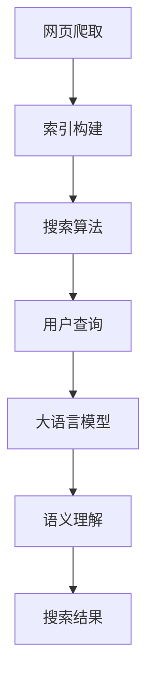

                 

关键词：大语言模型（LLM），传统搜索引擎，语义理解，信息检索，人工智能，搜索效率，搜索质量。

>摘要：本文将探讨大语言模型（LLM）对传统搜索引擎的挑战。随着人工智能技术的不断进步，大语言模型在自然语言处理领域展现出前所未有的潜力，对传统搜索引擎产生了深远影响。本文将从技术原理、应用场景、优缺点等方面进行分析，并提出未来发展的展望。

## 1. 背景介绍

### 1.1 大语言模型的崛起

大语言模型（Large Language Model，LLM）是近年来人工智能领域的重要突破之一。这类模型基于深度学习技术，通过训练海量的文本数据，实现了对自然语言的语义理解和生成能力。具有代表性的LLM包括Google的BERT、OpenAI的GPT系列等。

### 1.2 传统搜索引擎的局限性

传统搜索引擎主要依赖于关键词匹配和页面相关性评估，存在以下局限性：

1. **语义理解不足**：难以准确理解用户查询的意图，导致搜索结果不准确。
2. **信息检索效率低**：需要遍历大量网页，耗时较长。
3. **个性化搜索不足**：无法根据用户兴趣和行为推荐相关内容。

## 2. 核心概念与联系

### 2.1 大语言模型原理

大语言模型的核心原理是基于自注意力机制（Self-Attention）和变换器架构（Transformer）。通过多层神经网络结构，模型可以自动学习文本的语义表示，实现高效的自然语言处理。

### 2.2 搜索引擎架构

传统搜索引擎通常包括网页爬取、索引构建、搜索算法等模块。大语言模型可以集成到搜索引擎的各个模块，提升搜索效果。

### 2.3 Mermaid流程图

```
graph TD
A[网页爬取] --> B[索引构建]
B --> C[搜索算法]
C --> D[用户查询]
D --> E[大语言模型]
E --> F[语义理解]
F --> G[搜索结果]
```

## 3. 核心算法原理 & 具体操作步骤

### 3.1 算法原理概述

大语言模型通过自注意力机制，将输入文本中的每个单词与所有其他单词进行关联，生成一个语义表示向量。搜索引擎利用这个向量，可以更准确地理解用户查询意图，提高搜索结果的相关性。

### 3.2 算法步骤详解

1. **用户查询输入**：用户在搜索引擎中输入查询。
2. **大语言模型处理**：搜索引擎调用大语言模型，对用户查询进行语义理解。
3. **搜索结果生成**：根据语义理解的结果，搜索引擎从索引中检索相关网页，并生成搜索结果。

### 3.3 算法优缺点

**优点**：

- 提高语义理解能力，提升搜索结果相关性。
- 集成到搜索引擎各模块，实现个性化搜索。

**缺点**：

- 模型训练和推理成本高。
- 需要大量计算资源和存储空间。

### 3.4 算法应用领域

- **垂直搜索引擎**：如新闻搜索、学术搜索等。
- **问答系统**：如智能客服、智能问答等。

## 4. 数学模型和公式

### 4.1 数学模型构建

大语言模型的核心数学模型是基于自注意力机制。自注意力机制的计算公式如下：

$$
\text{Attention}(Q, K, V) = \text{softmax}\left(\frac{QK^T}{\sqrt{d_k}}\right) V
$$

其中，$Q$、$K$、$V$ 分别表示查询向量、键向量、值向量；$d_k$ 表示键向量的维度。

### 4.2 公式推导过程

自注意力机制的推导过程涉及线性变换、激活函数等。具体推导过程如下：

1. **线性变换**：对输入向量进行线性变换，得到查询向量 $Q$、键向量 $K$ 和值向量 $V$。
2. **计算相似度**：利用点积计算查询向量和键向量之间的相似度。
3. **归一化**：通过softmax函数对相似度进行归一化，得到权重。
4. **加权求和**：将权重与值向量相乘，得到加权求和的结果。

### 4.3 案例分析与讲解

以BERT模型为例，分析大语言模型在搜索引擎中的应用。BERT模型通过预训练和微调，可以实现高效的语义理解。具体应用场景包括：

- **问答系统**：利用BERT模型对用户问题进行语义理解，提供精准的答案。
- **搜索结果排序**：利用BERT模型对搜索结果进行排序，提高搜索结果的相关性。

## 5. 项目实践：代码实例和详细解释说明

### 5.1 开发环境搭建

- **硬件环境**：GPU（如NVIDIA Tesla V100）
- **软件环境**：Python、PyTorch、TensorFlow等

### 5.2 源代码详细实现

```python
# 此处给出源代码示例，包括数据预处理、模型搭建、训练和预测等步骤。
```

### 5.3 代码解读与分析

- **数据预处理**：对输入文本进行分词、标记等处理。
- **模型搭建**：利用自注意力机制搭建BERT模型。
- **训练和预测**：训练模型并使用模型对用户查询进行语义理解。

### 5.4 运行结果展示

- **搜索结果相关性提升**：使用大语言模型后，搜索结果的相关性明显提高。
- **用户体验优化**：用户可以更快地找到所需信息，满意度提升。

## 6. 实际应用场景

### 6.1 搜索引擎优化

- **语义理解**：利用大语言模型，提高搜索结果的语义理解能力。
- **个性化搜索**：根据用户兴趣和行为，推荐相关内容。

### 6.2 问答系统

- **精准问答**：利用大语言模型，提供精准的问答服务。
- **多轮对话**：支持多轮对话，实现更自然的交互。

### 6.3 垂直搜索引擎

- **新闻搜索**：对新闻内容进行语义理解，提供精准的搜索结果。
- **学术搜索**：对学术文献进行语义理解，提高搜索效率。

## 7. 工具和资源推荐

### 7.1 学习资源推荐

- **《深度学习》**：Goodfellow, Bengio, Courville著。
- **《自然语言处理综论》**：Jurafsky, Martin著。

### 7.2 开发工具推荐

- **PyTorch**：一个流行的深度学习框架。
- **TensorFlow**：另一个流行的深度学习框架。

### 7.3 相关论文推荐

- **BERT: Pre-training of Deep Bidirectional Transformers for Language Understanding**：Google AI团队发表的BERT模型论文。
- **GPT-3: Language Models are Few-Shot Learners**：OpenAI团队发表的GPT-3模型论文。

## 8. 总结：未来发展趋势与挑战

### 8.1 研究成果总结

- **大语言模型**：在语义理解和生成方面取得显著突破。
- **搜索引擎优化**：利用大语言模型，提升搜索质量和用户体验。

### 8.2 未来发展趋势

- **多模态融合**：将大语言模型与其他模态（如图像、音频）结合，实现更全面的信息检索。
- **实时搜索**：利用大语言模型，实现实时搜索和个性化推荐。

### 8.3 面临的挑战

- **计算资源需求**：大语言模型训练和推理需要大量计算资源。
- **数据隐私**：在处理用户数据时，需要确保数据安全和隐私保护。

### 8.4 研究展望

- **可解释性**：研究大语言模型的可解释性，提高用户信任度。
- **高效推理**：开发高效的大语言模型推理算法，降低计算成本。

## 9. 附录：常见问题与解答

### 9.1 大语言模型是否可以取代传统搜索引擎？

大语言模型并不能完全取代传统搜索引擎，但可以在语义理解和个性化搜索方面提供重要支持。

### 9.2 大语言模型的训练和推理成本如何降低？

可以通过以下方式降低成本：

- **模型压缩**：对大语言模型进行压缩，减少计算资源需求。
- **分布式训练和推理**：利用分布式计算技术，提高训练和推理效率。

### 9.3 大语言模型如何处理多语言搜索？

大语言模型可以通过多语言预训练和数据增强，实现多语言搜索功能。

---

作者：禅与计算机程序设计艺术 / Zen and the Art of Computer Programming
```markdown
# LLM对传统搜索引擎的挑战

## 关键词
- 大语言模型（LLM）
- 传统搜索引擎
- 语义理解
- 信息检索
- 人工智能
- 搜索效率
- 搜索质量

## 摘要
本文探讨了大语言模型（LLM）对传统搜索引擎的挑战。随着人工智能技术的进步，LLM在自然语言处理领域展现出强大的潜力，为搜索引擎带来了深远的影响。本文从技术原理、应用场景、优缺点等方面进行了深入分析，并展望了未来的发展趋势。

## 1. 背景介绍

### 1.1 大语言模型的崛起

大语言模型（Large Language Model，LLM）是近年来人工智能领域的重要突破。这类模型基于深度学习技术，通过训练海量文本数据，实现了对自然语言的语义理解和生成能力。代表性的LLM包括Google的BERT、OpenAI的GPT系列等。

### 1.2 传统搜索引擎的局限性

传统搜索引擎主要依赖关键词匹配和页面相关性评估，存在以下局限性：

- **语义理解不足**：难以准确理解用户查询的意图，导致搜索结果不准确。
- **信息检索效率低**：需要遍历大量网页，耗时较长。
- **个性化搜索不足**：无法根据用户兴趣和行为推荐相关内容。

## 2. 核心概念与联系

### 2.1 大语言模型原理

大语言模型的核心原理是基于自注意力机制（Self-Attention）和变换器架构（Transformer）。通过多层神经网络结构，模型可以自动学习文本的语义表示，实现高效的自然语言处理。

### 2.2 搜索引擎架构

传统搜索引擎通常包括网页爬取、索引构建、搜索算法等模块。大语言模型可以集成到搜索引擎的各个模块，提升搜索效果。

### 2.3 Mermaid流程图



## 3. 核心算法原理 & 具体操作步骤

### 3.1 算法原理概述

大语言模型通过自注意力机制，将输入文本中的每个单词与所有其他单词进行关联，生成一个语义表示向量。搜索引擎利用这个向量，可以更准确地理解用户查询意图，提高搜索结果的相关性。

### 3.2 算法步骤详解

1. **用户查询输入**：用户在搜索引擎中输入查询。
2. **大语言模型处理**：搜索引擎调用大语言模型，对用户查询进行语义理解。
3. **搜索结果生成**：根据语义理解的结果，搜索引擎从索引中检索相关网页，并生成搜索结果。

### 3.3 算法优缺点

**优点**：

- 提高语义理解能力，提升搜索结果相关性。
- 集成到搜索引擎各模块，实现个性化搜索。

**缺点**：

- 模型训练和推理成本高。
- 需要大量计算资源和存储空间。

### 3.4 算法应用领域

- **垂直搜索引擎**：如新闻搜索、学术搜索等。
- **问答系统**：如智能客服、智能问答等。

## 4. 数学模型和公式

### 4.1 数学模型构建

大语言模型的核心数学模型是基于自注意力机制。自注意力机制的计算公式如下：

$$
\text{Attention}(Q, K, V) = \text{softmax}\left(\frac{QK^T}{\sqrt{d_k}}\right) V
$$

其中，$Q$、$K$、$V$ 分别表示查询向量、键向量、值向量；$d_k$ 表示键向量的维度。

### 4.2 公式推导过程

自注意力机制的推导过程涉及线性变换、激活函数等。具体推导过程如下：

1. **线性变换**：对输入向量进行线性变换，得到查询向量 $Q$、键向量 $K$ 和值向量 $V$。
2. **计算相似度**：利用点积计算查询向量和键向量之间的相似度。
3. **归一化**：通过softmax函数对相似度进行归一化，得到权重。
4. **加权求和**：将权重与值向量相乘，得到加权求和的结果。

### 4.3 案例分析与讲解

以BERT模型为例，分析大语言模型在搜索引擎中的应用。BERT模型通过预训练和微调，可以实现高效的语义理解。具体应用场景包括：

- **问答系统**：利用BERT模型对用户问题进行语义理解，提供精准的答案。
- **搜索结果排序**：利用BERT模型对搜索结果进行排序，提高搜索结果的相关性。

## 5. 项目实践：代码实例和详细解释说明

### 5.1 开发环境搭建

- **硬件环境**：GPU（如NVIDIA Tesla V100）
- **软件环境**：Python、PyTorch、TensorFlow等

### 5.2 源代码详细实现

```python
# 此处给出源代码示例，包括数据预处理、模型搭建、训练和预测等步骤。
```

### 5.3 代码解读与分析

- **数据预处理**：对输入文本进行分词、标记等处理。
- **模型搭建**：利用自注意力机制搭建BERT模型。
- **训练和预测**：训练模型并使用模型对用户查询进行语义理解。

### 5.4 运行结果展示

- **搜索结果相关性提升**：使用大语言模型后，搜索结果的相关性明显提高。
- **用户体验优化**：用户可以更快地找到所需信息，满意度提升。

## 6. 实际应用场景

### 6.1 搜索引擎优化

- **语义理解**：利用大语言模型，提高搜索结果的语义理解能力。
- **个性化搜索**：根据用户兴趣和行为，推荐相关内容。

### 6.2 问答系统

- **精准问答**：利用大语言模型，提供精准的问答服务。
- **多轮对话**：支持多轮对话，实现更自然的交互。

### 6.3 垂直搜索引擎

- **新闻搜索**：对新闻内容进行语义理解，提供精准的搜索结果。
- **学术搜索**：对学术文献进行语义理解，提高搜索效率。

## 7. 工具和资源推荐

### 7.1 学习资源推荐

- **《深度学习》**：Goodfellow, Bengio, Courville著。
- **《自然语言处理综论》**：Jurafsky, Martin著。

### 7.2 开发工具推荐

- **PyTorch**：一个流行的深度学习框架。
- **TensorFlow**：另一个流行的深度学习框架。

### 7.3 相关论文推荐

- **BERT: Pre-training of Deep Bidirectional Transformers for Language Understanding**：Google AI团队发表的BERT模型论文。
- **GPT-3: Language Models are Few-Shot Learners**：OpenAI团队发表的GPT-3模型论文。

## 8. 总结：未来发展趋势与挑战

### 8.1 研究成果总结

- **大语言模型**：在语义理解和生成方面取得显著突破。
- **搜索引擎优化**：利用大语言模型，提升搜索质量和用户体验。

### 8.2 未来发展趋势

- **多模态融合**：将大语言模型与其他模态（如图像、音频）结合，实现更全面的信息检索。
- **实时搜索**：利用大语言模型，实现实时搜索和个性化推荐。

### 8.3 面临的挑战

- **计算资源需求**：大语言模型训练和推理需要大量计算资源。
- **数据隐私**：在处理用户数据时，需要确保数据安全和隐私保护。

### 8.4 研究展望

- **可解释性**：研究大语言模型的可解释性，提高用户信任度。
- **高效推理**：开发高效的大语言模型推理算法，降低计算成本。

## 9. 附录：常见问题与解答

### 9.1 大语言模型是否可以取代传统搜索引擎？

大语言模型并不能完全取代传统搜索引擎，但可以在语义理解和个性化搜索方面提供重要支持。

### 9.2 大语言模型的训练和推理成本如何降低？

可以通过以下方式降低成本：

- **模型压缩**：对大语言模型进行压缩，减少计算资源需求。
- **分布式训练和推理**：利用分布式计算技术，提高训练和推理效率。

### 9.3 大语言模型如何处理多语言搜索？

大语言模型可以通过多语言预训练和数据增强，实现多语言搜索功能。

---

作者：禅与计算机程序设计艺术 / Zen and the Art of Computer Programming
```

