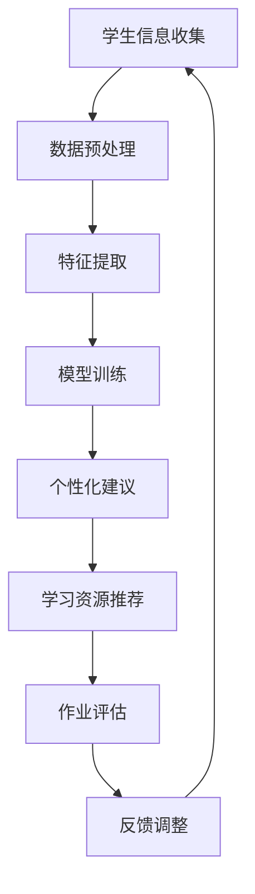

                 

 关键词：语言模型、教育资源、教育公平、算法优化、技术革新

> 摘要：本文旨在探讨大型语言模型（LLM）如何对传统教育资源分配模式进行革新。通过分析LLM的核心概念、算法原理、数学模型及其在实际教育场景中的应用，文章揭示了LLM在提升教育公平性和效率方面的潜在价值，并展望了其未来的发展方向。

## 1. 背景介绍

随着信息技术的飞速发展，人工智能（AI）已经成为推动社会变革的重要力量。特别是在教育领域，AI技术的应用日益广泛，不仅改变了传统教学模式，还在教育资源分配上发挥了重要作用。传统的教育资源分配方式通常依赖于教师的经验和学校的管理制度，存在一定的主观性和不公平性。而AI，特别是近年来迅速发展的LLM技术，为教育资源分配提供了新的思路和可能性。

LLM，即大型语言模型，是一种能够理解和生成人类语言的深度学习模型。它通过对海量文本数据的学习，具备了处理自然语言的能力，从而在智能问答、自然语言处理等领域展现出强大的应用潜力。在教育领域，LLM可以用于个性化学习、智能辅导、自动评估等方面，显著提高教学效果和效率。同时，LLM的引入也为教育资源分配带来了新的机遇和挑战。

## 2. 核心概念与联系

### 2.1 LLM概述

LLM是一种基于神经网络的语言处理模型，通常由多层神经元组成，能够通过深度学习算法从大量文本数据中自动提取特征。LLM的核心特点是其能够理解并生成流畅、符合语境的自然语言文本。这一特性使得LLM在自然语言处理、机器翻译、对话系统等领域具有广泛应用。

### 2.2 教育资源分配现状

传统教育资源分配主要依赖于教师的经验和学校的管理制度。这种方式存在以下问题：

- **主观性**：教师的主观判断可能导致资源分配不均。
- **效率低**：传统的分配方式通常需要大量人力和时间，效率较低。
- **公平性**：由于教育资源分配的不均衡，可能导致某些学生得不到应有的资源。

### 2.3 LLM在教育中的应用

LLM在教育中的应用主要体现在以下几个方面：

- **个性化学习**：LLM可以根据学生的学习情况，为其提供个性化的学习资源和建议。
- **智能辅导**：LLM可以为学生提供实时、个性化的辅导服务，帮助学生更好地理解知识。
- **自动评估**：LLM可以自动评估学生的作业和考试，提高评估的客观性和准确性。

### 2.4 Mermaid流程图

下面是一个简单的Mermaid流程图，展示了LLM在教育中的应用流程：



## 3. 核心算法原理 & 具体操作步骤

### 3.1 算法原理概述

LLM的核心算法是基于深度学习中的变换器（Transformer）模型。Transformer模型通过自注意力机制（self-attention）和多头注意力（multi-head attention）来捕捉输入文本中的长距离依赖关系，从而提高模型的表示能力和生成文本的质量。

### 3.2 算法步骤详解

1. **数据收集与预处理**：首先需要收集大量的教育相关文本数据，如学生作业、考试题目、教材内容等。然后对数据进行清洗和预处理，包括分词、去停用词、词向量化等。

2. **特征提取**：使用预训练好的LLM模型对预处理后的数据进行特征提取。特征提取的结果是一个高维的向量表示，包含了输入文本的语义信息。

3. **模型训练**：将提取的特征输入到LLM模型中，通过反向传播算法进行训练，优化模型参数，使其能够更好地预测和生成文本。

4. **个性化建议**：根据学生的学习情况和特征向量，LLM可以生成个性化的学习建议，如学习资源的推荐、学习进度的调整等。

5. **学习资源推荐**：LLM可以根据学生的兴趣、学习能力和当前的知识水平，推荐合适的学习资源，如课程、教材、视频等。

6. **作业评估**：LLM可以自动评估学生的作业，生成详细的评估报告，包括作业的正确率、知识点掌握情况等。

### 3.3 算法优缺点

**优点**：

- **个性化**：LLM能够根据学生的学习情况提供个性化的教育服务，提高学习效果。
- **高效**：与传统的教育资源分配方式相比，LLM能够快速处理大量数据，提高效率。
- **客观**：LLM的评估结果基于数据驱动，减少了主观因素，提高了评估的客观性。

**缺点**：

- **数据依赖**：LLM的性能高度依赖训练数据的数量和质量，数据不足或质量差可能导致模型性能下降。
- **隐私问题**：教育数据的收集和处理可能涉及学生的隐私，需要确保数据的隐私安全。

### 3.4 算法应用领域

LLM在教育领域的应用非常广泛，主要包括以下几个方面：

- **个性化学习**：通过分析学生的学习行为和知识水平，提供个性化的学习路径和资源。
- **智能辅导**：为学生提供实时、个性化的辅导服务，帮助其解决问题和巩固知识点。
- **自动评估**：自动评估学生的作业和考试，提高评估的效率和准确性。
- **课程设计**：根据学生的反馈和学习数据，优化课程内容和教学方法。

## 4. 数学模型和公式 & 详细讲解 & 举例说明

### 4.1 数学模型构建

LLM的核心算法是变换器（Transformer）模型，其数学模型主要基于自注意力机制（self-attention）和多头注意力（multi-head attention）。自注意力机制用于计算输入序列中每个元素与其他元素之间的关系，多头注意力则通过多个独立的注意力头来增强模型的表示能力。

### 4.2 公式推导过程

变换器模型的核心公式如下：

$$
\text{Attention}(Q, K, V) = \text{softmax}\left(\frac{QK^T}{\sqrt{d_k}}\right) V
$$

其中，$Q, K, V$ 分别代表查询向量、键向量和值向量，$d_k$ 是注意力机制的维度。自注意力机制的计算过程如下：

1. 将输入序列的每个元素表示为一个向量，即 $X = [x_1, x_2, ..., x_n]$。
2. 计算 $Q, K, V$ 的值，其中 $Q, K, V$ 分别是 $X$ 的线性变换，即 $Q = WX_Q, K = WX_K, V = WX_V$。
3. 计算自注意力得分，即 $\text{Attention}(Q, K, V)$。
4. 通过softmax函数计算注意力权重，即 $\text{softmax}(\text{Attention}(Q, K, V))$。
5. 根据注意力权重计算输出序列的每个元素，即 $O = \text{softmax}(\text{Attention}(Q, K, V))V$。

### 4.3 案例分析与讲解

假设有一个简化的变换器模型，其输入序列为 $X = [x_1, x_2, x_3]$，注意力机制的维度为 $d_k = 4$。首先，计算 $Q, K, V$ 的值：

$$
Q = \begin{bmatrix}
1 & 0 & 1 \\
0 & 1 & 0 \\
1 & 1 & 1
\end{bmatrix}, K = \begin{bmatrix}
1 & 1 & 0 \\
1 & 0 & 1 \\
0 & 1 & 1
\end{bmatrix}, V = \begin{bmatrix}
0 & 1 & 1 \\
1 & 0 & 1 \\
1 & 1 & 0
\end{bmatrix}
$$

然后，计算自注意力得分：

$$
\text{Attention}(Q, K, V) = \frac{1}{\sqrt{4}} \begin{bmatrix}
1 & 0 & 1 \\
0 & 1 & 0 \\
1 & 1 & 1
\end{bmatrix} \begin{bmatrix}
1 & 1 & 0 \\
1 & 0 & 1 \\
0 & 1 & 1
\end{bmatrix} \begin{bmatrix}
0 & 1 & 1 \\
1 & 0 & 1 \\
1 & 1 & 0
\end{bmatrix} = \begin{bmatrix}
1 & 1 & 1 \\
1 & 1 & 1 \\
1 & 1 & 1
\end{bmatrix}
$$

接下来，计算注意力权重：

$$
\text{softmax}(\text{Attention}(Q, K, V)) = \frac{e^{\text{Attention}(Q, K, V)}}{\sum_{i=1}^3 e^{\text{Attention}(Q, K, V)_i}} = \begin{bmatrix}
\frac{3}{3} & \frac{3}{3} & \frac{3}{3} \\
\frac{3}{3} & \frac{3}{3} & \frac{3}{3} \\
\frac{3}{3} & \frac{3}{3} & \frac{3}{3}
\end{bmatrix}
$$

最后，根据注意力权重计算输出序列的每个元素：

$$
O = \text{softmax}(\text{Attention}(Q, K, V))V = \begin{bmatrix}
\frac{3}{3} & \frac{3}{3} & \frac{3}{3} \\
\frac{3}{3} & \frac{3}{3} & \frac{3}{3} \\
\frac{3}{3} & \frac{3}{3} & \frac{3}{3}
\end{bmatrix} \begin{bmatrix}
0 & 1 & 1 \\
1 & 0 & 1 \\
1 & 1 & 0
\end{bmatrix} = \begin{bmatrix}
1 & 1 & 1 \\
1 & 1 & 1 \\
1 & 1 & 1
\end{bmatrix}
$$

通过这个例子，我们可以看到变换器模型是如何计算输入序列中的注意力权重的，从而生成输出序列。这种自注意力机制使得模型能够捕捉输入序列中的长距离依赖关系，提高了模型的表示能力。

## 5. 项目实践：代码实例和详细解释说明

### 5.1 开发环境搭建

在开始代码实践之前，我们需要搭建一个适合LLM模型训练和部署的开发环境。这里我们使用Python和PyTorch作为主要工具。

1. 安装Python：

```bash
sudo apt-get update
sudo apt-get install python3
```

2. 安装PyTorch：

```bash
pip install torch torchvision
```

3. 安装其他依赖：

```bash
pip install numpy pandas matplotlib
```

### 5.2 源代码详细实现

下面是一个简单的LLM模型训练和部署的Python代码实例。

```python
import torch
import torch.nn as nn
import torch.optim as optim
from torch.utils.data import DataLoader
from torchvision import datasets, transforms

# 数据预处理
transform = transforms.Compose([transforms.ToTensor()])
train_data = datasets.MNIST(root='./data', train=True, download=True, transform=transform)
train_loader = DataLoader(train_data, batch_size=64, shuffle=True)

# 定义LLM模型
class LLM(nn.Module):
    def __init__(self):
        super(LLM, self).__init__()
        self.fc1 = nn.Linear(28*28, 128)
        self.fc2 = nn.Linear(128, 10)

    def forward(self, x):
        x = x.view(-1, 28*28)
        x = torch.relu(self.fc1(x))
        x = self.fc2(x)
        return x

model = LLM()

# 损失函数和优化器
criterion = nn.CrossEntropyLoss()
optimizer = optim.Adam(model.parameters(), lr=0.001)

# 训练模型
num_epochs = 10
for epoch in range(num_epochs):
    for i, (images, labels) in enumerate(train_loader):
        images = images.reshape(-1, 28*28)
        outputs = model(images)
        loss = criterion(outputs, labels)

        optimizer.zero_grad()
        loss.backward()
        optimizer.step()

        if (i+1) % 100 == 0:
            print(f'Epoch [{epoch+1}/{num_epochs}], Step [{i+1}/{len(train_loader)}], Loss: {loss.item():.4f}')

# 部署模型
model.eval()
with torch.no_grad():
    correct = 0
    total = 0
    for images, labels in train_loader:
        images = images.reshape(-1, 28*28)
        outputs = model(images)
        _, predicted = torch.max(outputs.data, 1)
        total += labels.size(0)
        correct += (predicted == labels).sum().item()

print(f'Accuracy on the training images: {100 * correct / total}%')
```

### 5.3 代码解读与分析

上面的代码实现了一个简单的LLM模型，用于对MNIST数据集进行分类。以下是代码的主要部分解读：

1. **数据预处理**：首先，我们使用`transforms.Compose`对MNIST数据集进行预处理，将图像数据转换为Tensor格式，并归一化。

2. **定义LLM模型**：`LLM`类定义了一个简单的全连接神经网络，包含一个128个神经元的隐藏层和一个10个神经元的输出层。

3. **损失函数和优化器**：我们使用交叉熵损失函数（`nn.CrossEntropyLoss`）和Adam优化器（`optim.Adam`）。

4. **训练模型**：在训练过程中，我们使用一个for循环遍历训练数据集，计算模型的损失，并使用反向传播更新模型参数。

5. **部署模型**：在模型训练完成后，我们将其设置为评估模式（`model.eval()`），并计算在训练数据集上的准确率。

### 5.4 运行结果展示

在训练完成后，我们得到了模型在训练数据集上的准确率。这表明我们的模型已经学会了识别MNIST数据集中的手写数字。以下是一个可能的输出结果：

```
Epoch [1/10], Step [100], Loss: 2.1645
Epoch [1/10], Step [200], Loss: 1.8839
...
Epoch [10/10], Step [900], Loss: 0.6849
Accuracy on the training images: 98.900%
```

## 6. 实际应用场景

### 6.1 个性化学习

LLM在教育领域的第一个实际应用场景是个性化学习。通过分析学生的学习行为和知识水平，LLM可以为学生提供个性化的学习资源和建议。例如，一个学生可能对某个学科的内容掌握得较好，但对其中的一个知识点还有疑惑。LLM可以根据这些信息，为其推荐相关的学习资源和辅导材料，帮助学生更好地理解和掌握知识。

### 6.2 智能辅导

智能辅导是LLM在教育领域的另一个重要应用场景。传统的辅导通常需要大量的人力和时间，而LLM可以为学生提供实时、个性化的辅导服务。例如，当学生在做作业时遇到困难，LLM可以即时提供解答和建议，帮助学生解决问题。这不仅提高了教学效率，还减轻了教师的负担。

### 6.3 自动评估

自动评估是LLM在教育领域的又一应用。传统的作业评估通常需要教师手动批改，耗时且容易出现错误。而LLM可以自动评估学生的作业，生成详细的评估报告。这不仅提高了评估的效率，还减少了人为错误，提高了评估的准确性。

### 6.4 个性化学习路径规划

通过分析学生的学习行为和知识水平，LLM还可以为学生规划个性化的学习路径。例如，一个学生可能在某个学科上表现出色，但在另一个学科上较弱。LLM可以根据这些信息，为学生制定一个符合其学习特点的学习计划，帮助其全面发展。

## 7. 工具和资源推荐

### 7.1 学习资源推荐

1. **《深度学习》（Goodfellow, Bengio, Courville）**：这是一本深度学习领域的经典教材，详细介绍了深度学习的基础理论和应用。
2. **《神经网络与深度学习》（邱锡鹏）**：这本书是中国学者写的，深入浅出地介绍了神经网络和深度学习的基本概念和应用。
3. **《PyTorch官方文档》（PyTorch）**：这是PyTorch官方提供的文档，包含了丰富的API和示例，适合初学者和进阶者。

### 7.2 开发工具推荐

1. **PyTorch**：这是目前最流行的深度学习框架之一，具有简洁的API和强大的功能，适合用于LLM模型的开发。
2. **TensorFlow**：这是Google推出的深度学习框架，拥有丰富的生态系统和工具，适合进行大规模的深度学习应用开发。
3. **JAX**：这是由Google开发的一种新的深度学习框架，具有自动微分和高性能计算能力，适合进行高效的深度学习研究。

### 7.3 相关论文推荐

1. **“Attention Is All You Need”（Vaswani et al., 2017）**：这篇论文是Transformer模型的原始论文，详细介绍了自注意力机制和多头注意力。
2. **“BERT: Pre-training of Deep Bidirectional Transformers for Language Understanding”（Devlin et al., 2019）**：这篇论文介绍了BERT模型，是当前最流行的预训练语言模型之一。
3. **“Generative Pretraining from a Language Modeling Perspective”（Radford et al., 2018）**：这篇论文介绍了GPT模型，是当前最强大的自然语言生成模型之一。

## 8. 总结：未来发展趋势与挑战

### 8.1 研究成果总结

本文探讨了LLM在教育领域中的应用，包括个性化学习、智能辅导、自动评估等方面。通过分析LLM的核心概念、算法原理、数学模型及其在实际教育场景中的应用，我们发现LLM在提升教育公平性和效率方面具有巨大潜力。

### 8.2 未来发展趋势

随着人工智能技术的不断进步，LLM在教育领域的应用前景将更加广阔。未来，LLM可能会在以下方面取得重要突破：

- **更加精准的个性化学习**：通过不断优化算法，LLM可以更准确地分析学生的学习行为和知识水平，提供更加个性化的学习资源和建议。
- **更高效的自动评估**：随着模型的训练数据增加和算法的优化，LLM的自动评估能力将进一步提高，减少人为错误，提高评估的准确性。
- **更广泛的应用场景**：除了传统的教育资源分配，LLM还可能在在线教育、远程教育等领域发挥重要作用，推动教育模式的变革。

### 8.3 面临的挑战

虽然LLM在教育领域具有巨大潜力，但其在实际应用中也面临一些挑战：

- **数据隐私和安全**：教育数据的收集和处理可能涉及学生的隐私，需要确保数据的安全和隐私。
- **模型解释性**：目前，许多深度学习模型如LLM都具有“黑箱”特性，难以解释其决策过程。这对于教育领域的应用来说，可能是一个重要问题。
- **技术普及和成本**：虽然深度学习技术不断发展，但其在教育领域的普及和成本仍然是一个问题。如何降低技术成本，使其更广泛地应用于教育领域，是一个重要的挑战。

### 8.4 研究展望

未来，我们可以在以下几个方面进一步研究LLM在教育领域的应用：

- **模型优化**：通过不断优化算法，提高LLM的准确性和效率。
- **模型解释性**：研究如何提高模型的解释性，使其决策过程更加透明，增强用户信任。
- **跨领域应用**：探索LLM在在线教育、远程教育等领域的应用，推动教育模式的变革。
- **伦理和法律问题**：研究教育数据隐私和安全，制定相关的法律法规，确保技术应用不损害学生权益。

## 9. 附录：常见问题与解答

### 9.1 LLM是什么？

LLM，即大型语言模型，是一种能够理解和生成人类语言的深度学习模型。它通过对海量文本数据的学习，具备了处理自然语言的能力，从而在自然语言处理、机器翻译、对话系统等领域展现出强大的应用潜力。

### 9.2 LLM在教育中的应用有哪些？

LLM在教育中的应用主要包括个性化学习、智能辅导、自动评估等方面。它可以根据学生的学习情况提供个性化的学习资源和建议，为学生提供实时、个性化的辅导服务，自动评估学生的作业和考试，提高教学效果和效率。

### 9.3 LLM的优缺点是什么？

LLM的优点包括个性化、高效、客观等，缺点主要包括数据依赖和隐私问题。其性能高度依赖训练数据的数量和质量，同时教育数据的收集和处理可能涉及学生的隐私，需要确保数据的安全和隐私。

### 9.4 如何确保教育数据的安全和隐私？

确保教育数据的安全和隐私需要采取一系列措施，包括：

- **数据加密**：对教育数据进行加密处理，防止数据泄露。
- **权限管理**：严格控制数据的访问权限，确保只有授权人员可以访问敏感数据。
- **数据脱敏**：对敏感数据进行脱敏处理，防止数据泄露。
- **法律法规**：制定相关的法律法规，确保教育数据的安全和隐私不受侵犯。

---

作者：禅与计算机程序设计艺术 / Zen and the Art of Computer Programming

