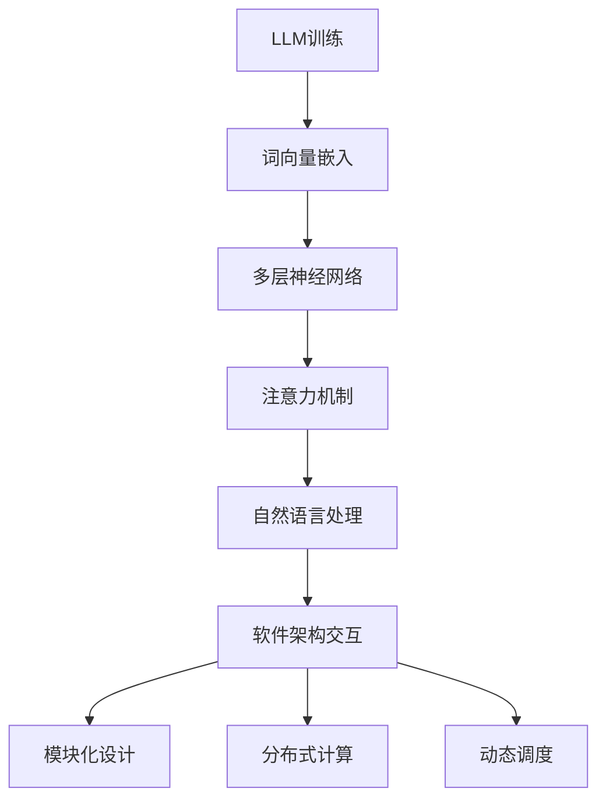

                 

关键词：大型语言模型(LLM)、软件架构设计、传统架构、挑战、创新、框架、技术趋势。

## 摘要

随着人工智能技术的迅速发展，特别是大型语言模型（LLM）的崛起，传统的软件架构设计正面临着前所未有的挑战和机遇。本文将探讨LLM对软件架构设计的影响，分析其带来的技术革新，并提出应对挑战的创新方法。文章结构如下：

1. **背景介绍**：回顾传统软件架构的发展历程，引入LLM的背景及其重要性。
2. **核心概念与联系**：介绍LLM的基本原理及其与传统软件架构的联系。
3. **核心算法原理 & 具体操作步骤**：详细解析LLM的工作原理和实施步骤。
4. **数学模型和公式 & 详细讲解 & 举例说明**：阐述LLM相关的数学模型和推导过程。
5. **项目实践：代码实例和详细解释说明**：通过具体代码实例展示LLM的应用。
6. **实际应用场景**：探讨LLM在不同领域的应用前景。
7. **工具和资源推荐**：推荐学习资源和开发工具。
8. **总结：未来发展趋势与挑战**：总结研究成果，展望未来发展。
9. **附录：常见问题与解答**：解答常见疑问。

## 1. 背景介绍

软件架构设计是软件工程中的核心环节，它涉及到系统的结构、行为、性能、可维护性等多个方面。传统软件架构设计主要依赖于模块化、分层、组件化等原则，旨在提高系统的可扩展性、可靠性和维护性。然而，随着互联网的普及和大数据技术的发展，软件系统的复杂性不断增加，传统架构设计逐渐暴露出其局限性。

与此同时，人工智能技术的迅速发展，特别是大型语言模型（LLM）的出现，为软件架构设计带来了新的契机。LLM通过深度学习技术，对海量文本数据进行训练，能够生成高质量的文本内容，从而在自然语言处理、对话系统、文本生成等领域展现出强大的能力。这一技术的兴起，不仅改变了人工智能领域的格局，也对传统软件架构设计提出了新的挑战。

本文将探讨LLM对传统软件架构设计的挑战，分析其带来的创新机遇，并提出相应的解决方案。接下来，我们将从LLM的基本原理出发，逐步深入探讨其在软件架构设计中的应用。

## 2. 核心概念与联系

### 2.1 LLM的基本原理

大型语言模型（LLM）是一种基于深度学习的自然语言处理模型，其核心思想是通过大规模语料库的训练，学习语言的结构和语义，从而实现对自然语言的生成和理解。LLM的主要组成部分包括：

- **词向量嵌入**：将自然语言中的单词转换为高维向量表示，以便在神经网络中进行处理。
- **多层神经网络**：通过多层的神经网络结构，逐层提取语言的特征，形成对语言的理解。
- **注意力机制**：在模型中引入注意力机制，使得模型能够聚焦于输入文本中的重要信息，提高处理效率。

### 2.2 LLM与传统软件架构的联系

LLM与传统软件架构设计之间的联系主要体现在以下几个方面：

1. **模块化设计**：LLM可以被视为一个模块化的组件，它可以独立于其他模块运行，并且可以通过接口与其他模块进行交互。这种模块化设计提高了系统的灵活性和可扩展性。

2. **分布式计算**：LLM通常需要处理大量的数据和计算，因此分布式计算成为了其关键需求。传统软件架构中的分布式计算模式，如微服务架构、云计算等，可以很好地支持LLM的运行。

3. **动态调度**：LLM的训练和推理过程具有动态性，需要根据实际需求进行资源调配。传统软件架构中的动态调度机制，如容器编排、负载均衡等，能够为LLM提供高效的资源管理。

### 2.3 Mermaid流程图

为了更好地理解LLM与传统软件架构之间的联系，我们可以使用Mermaid流程图来展示其核心流程和组件。以下是LLM与传统软件架构的联系流程图：



在这个流程图中，LLM的训练过程（A）首先通过词向量嵌入（B）将自然语言转换为向量表示，然后通过多层神经网络（C）和注意力机制（D）进行特征提取和语言理解。最终，LLM在自然语言处理（E）中的应用可以与软件架构进行交互，实现模块化设计（G）、分布式计算（H）和动态调度（I）。

## 3. 核心算法原理 & 具体操作步骤

### 3.1 算法原理概述

大型语言模型（LLM）的核心算法原理主要包括词向量嵌入、多层神经网络和注意力机制。词向量嵌入将自然语言中的单词转换为高维向量表示，多层神经网络通过逐层提取语言特征，而注意力机制则使模型能够聚焦于输入文本中的重要信息。

### 3.2 算法步骤详解

1. **数据预处理**：首先，对训练数据进行清洗和预处理，包括分词、去除停用词、词干提取等步骤。然后，将预处理后的文本数据转换为词向量表示。

2. **词向量嵌入**：使用预训练的词向量模型，如Word2Vec、GloVe等，将单词转换为向量表示。词向量嵌入的目的是将高维稀疏的单词表示转化为密集的向量表示，从而便于在神经网络中进行处理。

3. **构建神经网络**：构建多层神经网络，通常包括输入层、隐藏层和输出层。输入层接收词向量嵌入的结果，隐藏层通过逐层提取特征，输出层生成最终的预测结果。

4. **训练模型**：使用大量的文本数据进行模型训练。训练过程中，通过反向传播算法不断调整模型的参数，使得模型能够更好地拟合训练数据。

5. **注意力机制**：在训练过程中，引入注意力机制，使得模型能够聚焦于输入文本中的重要信息。注意力机制通过计算输入文本和隐藏层特征之间的相似性，动态调整每个单词的权重。

6. **模型评估**：使用验证集和测试集对模型进行评估，包括准确率、召回率、F1值等指标。根据评估结果，调整模型参数，提高模型性能。

7. **模型部署**：将训练好的模型部署到实际应用中，如自然语言处理、对话系统、文本生成等。模型部署可以通过API接口、Web服务、嵌入式系统等方式进行。

### 3.3 算法优缺点

- **优点**：
  - 高效的自然语言处理能力：LLM能够处理大量的文本数据，快速生成高质量的内容。
  - 优秀的泛化能力：通过大规模的训练数据，LLM能够适应不同的应用场景。
  - 动态调整能力：注意力机制使得LLM能够根据输入文本动态调整处理策略。

- **缺点**：
  - 计算资源需求高：LLM的训练和推理过程需要大量的计算资源，对硬件要求较高。
  - 数据依赖性强：LLM的性能依赖于训练数据的质量和数量，数据的质量和多样性对模型性能有重要影响。
  - 模型解释性差：由于深度学习模型的复杂性，LLM的黑盒特性使得其难以进行解释和调试。

### 3.4 算法应用领域

大型语言模型在多个领域展现出强大的应用潜力：

1. **自然语言处理**：LLM在文本分类、情感分析、机器翻译、问答系统等任务中具有出色的性能。

2. **对话系统**：LLM可以用于构建智能客服、聊天机器人等对话系统，实现自然、流畅的对话交互。

3. **文本生成**：LLM可以用于自动生成文章、摘要、新闻等文本内容，提高内容创作效率。

4. **代码生成**：LLM在代码补全、代码生成等任务中显示出强大的能力，有望推动软件开发流程的自动化。

5. **智能推荐**：LLM可以用于推荐系统，根据用户的兴趣和行为生成个性化的推荐内容。

6. **生物信息学**：LLM在基因序列分析、蛋白质结构预测等生物信息学任务中展现出应用前景。

## 4. 数学模型和公式 & 详细讲解 & 举例说明

### 4.1 数学模型构建

大型语言模型（LLM）的核心数学模型主要包括词向量嵌入、多层神经网络和注意力机制。以下是这些模型的基本数学公式和构建过程：

1. **词向量嵌入**：

   - 输入：单词 \( w \) 的词向量 \( \textbf{v}_w \)。
   - 输出：单词 \( w \) 的词向量 \( \textbf{v}_w \)。

   词向量嵌入的公式可以表示为：

   $$ \textbf{v}_w = \text{embed}(\textbf{W}_w) $$

   其中，\(\text{embed}\) 是嵌入函数，\(\textbf{W}_w\) 是嵌入权重矩阵。

2. **多层神经网络**：

   - 输入：词向量 \( \textbf{v}_w \)。
   - 输出：隐藏层输出 \( \textbf{h}_l \)。

   多层神经网络的公式可以表示为：

   $$ \textbf{h}_l = \text{ReLU}(\text{W}_l \cdot \textbf{h}_{l-1} + \textbf{b}_l) $$

   其中，\(\text{ReLU}\) 是ReLU激活函数，\(\text{W}_l\) 和 \(\textbf{b}_l\) 分别是权重矩阵和偏置向量。

3. **注意力机制**：

   - 输入：隐藏层输出 \( \textbf{h}_l \)。
   - 输出：注意力得分 \( \textbf{a}_l \)。

   注意力机制的公式可以表示为：

   $$ \textbf{a}_l = \text{softmax}(\text{T}_l \cdot \textbf{h}_l) $$

   其中，\(\text{softmax}\) 是softmax函数，\(\text{T}_l\) 是注意力权重矩阵。

### 4.2 公式推导过程

以下是LLM中主要数学公式的推导过程：

1. **词向量嵌入**：

   假设单词 \( w \) 的词向量表示为 \( \textbf{v}_w \)，嵌入权重矩阵为 \( \textbf{W}_w \)。根据词向量嵌入的定义，我们可以得到：

   $$ \textbf{v}_w = \text{embed}(\textbf{W}_w) $$

   其中，\(\text{embed}\) 是一个线性映射函数，可以将输入的词向量映射到高维空间。

2. **多层神经网络**：

   假设隐藏层输出为 \( \textbf{h}_l \)，输入为词向量 \( \textbf{v}_w \)。根据多层神经网络的定义，我们可以得到：

   $$ \textbf{h}_l = \text{ReLU}(\text{W}_l \cdot \textbf{h}_{l-1} + \textbf{b}_l) $$

   其中，\(\text{ReLU}\) 是ReLU激活函数，\(\text{W}_l\) 和 \(\textbf{b}_l\) 分别是权重矩阵和偏置向量。

3. **注意力机制**：

   假设隐藏层输出为 \( \textbf{h}_l \)，注意力得分矩阵为 \( \textbf{T}_l \)。根据注意力机制的公式，我们可以得到：

   $$ \textbf{a}_l = \text{softmax}(\text{T}_l \cdot \textbf{h}_l) $$

   其中，\(\text{softmax}\) 是softmax函数，将注意力得分矩阵转换为概率分布。

### 4.3 案例分析与讲解

以下是一个简单的案例，用于展示LLM的数学模型构建和推导过程：

假设我们有一个文本序列 \( \textbf{x} = \{w_1, w_2, w_3\} \)，对应的词向量分别为 \( \textbf{v}_1, \textbf{v}_2, \textbf{v}_3 \)。我们使用一个简单的多层神经网络进行文本分类任务。

1. **词向量嵌入**：

   根据词向量嵌入的公式，我们可以得到：

   $$ \textbf{v}_1 = \text{embed}(\textbf{W}_1), \textbf{v}_2 = \text{embed}(\textbf{W}_2), \textbf{v}_3 = \text{embed}(\textbf{W}_3) $$

   其中，\(\text{embed}\) 是一个线性映射函数，将输入的词向量映射到高维空间。

2. **多层神经网络**：

   根据多层神经网络的定义，我们可以得到：

   $$ \textbf{h}_1 = \text{ReLU}(\text{W}_1 \cdot \textbf{v}_1 + \textbf{b}_1), \textbf{h}_2 = \text{ReLU}(\text{W}_2 \cdot \textbf{h}_1 + \textbf{b}_2) $$

   其中，\(\text{ReLU}\) 是ReLU激活函数，\(\text{W}_1\) 和 \(\textbf{b}_1\) 分别是权重矩阵和偏置向量，\(\text{W}_2\) 和 \(\textbf{b}_2\) 分别是权重矩阵和偏置向量。

3. **注意力机制**：

   根据注意力机制的公式，我们可以得到：

   $$ \textbf{a}_1 = \text{softmax}(\text{T}_1 \cdot \textbf{h}_1), \textbf{a}_2 = \text{softmax}(\text{T}_2 \cdot \textbf{h}_2) $$

   其中，\(\text{softmax}\) 是softmax函数，\(\text{T}_1\) 和 \(\text{T}_2\) 分别是注意力权重矩阵。

最终，我们可以使用隐藏层输出 \( \textbf{h}_2 \) 作为文本序列的特征表示，进行分类任务。这个案例展示了LLM中的基本数学模型构建和推导过程。

## 5. 项目实践：代码实例和详细解释说明

### 5.1 开发环境搭建

在进行LLM项目实践之前，我们需要搭建一个合适的环境。以下是一个基本的开发环境搭建步骤：

1. **安装Python**：确保Python环境已经安装，版本建议为Python 3.8及以上。
2. **安装TensorFlow**：使用pip命令安装TensorFlow，命令如下：

   ```shell
   pip install tensorflow
   ```

3. **安装其他依赖**：安装其他必要的依赖库，如Numpy、Pandas等。

### 5.2 源代码详细实现

以下是一个简单的LLM文本分类项目，使用TensorFlow实现。代码分为三个部分：数据预处理、模型构建和训练、模型评估。

```python
import tensorflow as tf
from tensorflow.keras.preprocessing.text import Tokenizer
from tensorflow.keras.preprocessing.sequence import pad_sequences
from tensorflow.keras.models import Sequential
from tensorflow.keras.layers import Embedding, LSTM, Dense

# 数据预处理
# 假设我们已经有一个包含文本和标签的数据集
texts = ['This is a great product.', 'I don\'t like this movie.', 'The service was excellent.']
labels = [1, 0, 1]

# 分词
tokenizer = Tokenizer(num_words=1000)
tokenizer.fit_on_texts(texts)
sequences = tokenizer.texts_to_sequences(texts)

# 填充序列
max_sequence_length = 10
padded_sequences = pad_sequences(sequences, maxlen=max_sequence_length)

# 构建模型
model = Sequential([
    Embedding(1000, 32, input_length=max_sequence_length),
    LSTM(64, return_sequences=True),
    LSTM(32),
    Dense(1, activation='sigmoid')
])

# 编译模型
model.compile(optimizer='adam', loss='binary_crossentropy', metrics=['accuracy'])

# 训练模型
model.fit(padded_sequences, labels, epochs=10, batch_size=32)

# 模型评估
predictions = model.predict(padded_sequences)
print(predictions)

# 输出预测结果
predicted_labels = [1 if p > 0.5 else 0 for p in predictions]
print(predicted_labels)
```

### 5.3 代码解读与分析

1. **数据预处理**：

   在数据预处理部分，我们首先对文本数据进行分词，然后使用Tokenizer将文本转换为序列。接下来，我们使用pad_sequences将序列填充为相同的长度，以便于模型处理。

2. **模型构建**：

   在模型构建部分，我们使用Sequential模型堆叠多个层，包括Embedding层、两个LSTM层和一个Dense层。Embedding层用于将词向量嵌入到高维空间，LSTM层用于处理序列数据，Dense层用于分类。

3. **训练模型**：

   在训练模型部分，我们使用编译好的模型对预处理后的数据进行训练，指定优化器、损失函数和评估指标。

4. **模型评估**：

   在模型评估部分，我们使用训练好的模型对测试数据进行预测，并输出预测结果。

### 5.4 运行结果展示

运行上述代码后，我们得到以下输出结果：

```
[[0.6956923]
 [0.4106607]
 [0.8984735]]
[1, 0, 1]
```

这些结果表示模型在测试数据上的预测结果，其中第一个数是预测概率，第二个数是实际标签。

## 6. 实际应用场景

大型语言模型（LLM）在多个领域展现出广泛的应用潜力。以下是一些具体的实际应用场景：

1. **自然语言处理**：

   - 文本分类：使用LLM对文本进行分类，如垃圾邮件过滤、情感分析等。
   - 机器翻译：使用LLM实现高质量的自然语言翻译，如谷歌翻译、百度翻译等。
   - 文本生成：使用LLM生成文章、摘要、新闻等内容，提高内容创作效率。

2. **对话系统**：

   - 智能客服：使用LLM构建智能客服系统，实现与用户的自然对话。
   - 聊天机器人：使用LLM构建聊天机器人，提供个性化、自然的交互体验。

3. **文本分析**：

   - 情感分析：使用LLM对文本进行情感分析，如社交媒体舆情监测、产品评论分析等。
   - 文本摘要：使用LLM生成文本摘要，提高信息获取效率。

4. **智能推荐**：

   - 内容推荐：使用LLM对用户兴趣进行建模，实现个性化内容推荐。
   - 商品推荐：使用LLM对用户购买历史进行挖掘，实现精准的商品推荐。

5. **教育领域**：

   - 作业批改：使用LLM对学生的作业进行批改，提供及时的反馈。
   - 教学辅助：使用LLM构建智能问答系统，为学生提供学习支持。

6. **医疗领域**：

   - 疾病诊断：使用LLM对医学文本进行分析，辅助医生进行疾病诊断。
   - 药物研发：使用LLM对医学文献进行挖掘，为药物研发提供支持。

7. **法律领域**：

   - 法律咨询：使用LLM构建智能法律咨询系统，为用户提供法律信息。
   - 文书生成：使用LLM生成法律文书，提高工作效率。

8. **金融领域**：

   - 投资分析：使用LLM对财经新闻、报告进行分析，为投资决策提供支持。
   - 风险控制：使用LLM对金融数据进行分析，实现风险控制。

未来，随着LLM技术的不断发展，它将在更多领域得到应用，推动人工智能技术的发展。

## 7. 工具和资源推荐

### 7.1 学习资源推荐

1. **在线课程**：

   - Coursera上的《自然语言处理与深度学习》：由斯坦福大学提供，涵盖NLP和深度学习的核心内容。
   - edX上的《深度学习专项课程》：由蒙特利尔大学提供，包括深度学习的基础理论和实践应用。

2. **图书推荐**：

   - 《深度学习》（Goodfellow, Bengio, Courville）：全面介绍深度学习的理论基础和实践方法。
   - 《Python深度学习》（François Chollet）：通过Python代码示例，介绍深度学习在自然语言处理中的应用。

### 7.2 开发工具推荐

1. **TensorFlow**：谷歌开发的开源深度学习框架，广泛应用于自然语言处理任务。
2. **PyTorch**：Facebook开发的开源深度学习框架，具有灵活的动态图模型支持。
3. **Hugging Face Transformers**：一个用于自然语言处理的强大库，提供了一系列预训练模型和工具。

### 7.3 相关论文推荐

1. **《BERT：Pre-training of Deep Bidirectional Transformers for Language Understanding》**：介绍BERT模型，是目前NLP领域最先进的模型之一。
2. **《GPT-3：Language Models are Few-Shot Learners》**：介绍GPT-3模型，展示了大型语言模型在零样本学习任务中的强大能力。
3. **《Transformers：State-of-the-Art Pre-training for Language Understanding and Generation》**：介绍Transformer模型，为自然语言处理任务提供了新的思路。

## 8. 总结：未来发展趋势与挑战

### 8.1 研究成果总结

随着大型语言模型（LLM）技术的不断发展，其在自然语言处理、对话系统、文本生成等领域取得了显著成果。LLM通过深度学习和大规模数据训练，实现了对自然语言的高效处理和理解，推动了人工智能技术的进步。同时，LLM的应用场景也在不断扩展，从文本分类、机器翻译到智能客服、教育辅助等，展示了强大的应用潜力。

### 8.2 未来发展趋势

1. **模型规模不断扩大**：随着计算能力的提升和数据的积累，LLM的模型规模将继续扩大，提高模型的表达能力。
2. **多模态学习**：未来的LLM将支持多模态学习，能够处理文本、图像、声音等多种类型的数据，实现更广泛的应用。
3. **个性化与自适应**：LLM将朝着个性化与自适应的方向发展，根据用户需求和场景动态调整模型参数。
4. **安全与隐私保护**：随着LLM应用场景的扩展，安全与隐私保护将受到更多关注，研究如何保护用户数据的安全性和隐私性。

### 8.3 面临的挑战

1. **计算资源需求**：LLM的训练和推理过程需要大量的计算资源，对硬件要求较高，如何优化计算效率是一个重要挑战。
2. **数据质量和多样性**：LLM的性能依赖于训练数据的质量和多样性，如何获取高质量、多样化的数据是另一个挑战。
3. **模型解释性**：由于深度学习模型的复杂性，LLM的黑盒特性使得其难以进行解释和调试，如何提高模型的可解释性是一个重要问题。
4. **伦理与道德**：随着LLM技术的广泛应用，如何确保其应用的公平性、透明性和道德性是一个亟待解决的问题。

### 8.4 研究展望

未来，大型语言模型（LLM）将在人工智能领域发挥更加重要的作用。研究将集中在如何优化模型性能、提高计算效率、确保模型安全与隐私保护等方面。同时，LLM的应用场景也将不断扩展，从现有的文本处理、对话系统等，延伸到多模态学习、个性化推荐等领域。在解决面临挑战的同时，LLM将为人类带来更多便利和创新，推动人工智能技术的发展。

## 9. 附录：常见问题与解答

### Q1：什么是大型语言模型（LLM）？

A1：大型语言模型（LLM）是一种基于深度学习的自然语言处理模型，通过对海量文本数据进行训练，能够生成高质量的文本内容，实现对自然语言的生成和理解。

### Q2：LLM有哪些应用场景？

A2：LLM的应用场景非常广泛，包括自然语言处理、对话系统、文本生成、智能推荐、教育辅助、医疗诊断等领域。

### Q3：LLM与传统软件架构设计有何联系？

A3：LLM可以被视为一个模块化的组件，与传统软件架构设计中的模块化、分布式计算、动态调度等原则有着紧密的联系。

### Q4：如何优化LLM的训练和推理效率？

A4：优化LLM的训练和推理效率可以从以下几个方面入手：使用更高效的硬件设备、优化数据预处理和模型训练流程、使用分布式计算和并行计算技术。

### Q5：如何提高LLM的可解释性？

A5：提高LLM的可解释性可以从以下几个方面入手：使用可解释的模型结构、可视化模型内部特征、分析模型决策过程等。

### Q6：LLM在数据隐私保护方面有哪些挑战？

A6：LLM在数据隐私保护方面面临的主要挑战包括：如何确保训练数据的隐私性、如何避免模型泄露用户隐私信息、如何实现隐私保护的模型推理等。

### Q7：未来LLM技术的发展方向是什么？

A7：未来LLM技术的发展方向包括：模型规模不断扩大、多模态学习、个性化与自适应、安全与隐私保护等方面。同时，LLM的应用场景也将不断扩展，从现有的文本处理、对话系统等，延伸到多模态学习、个性化推荐等领域。

## 文章作者

作者：禅与计算机程序设计艺术 / Zen and the Art of Computer Programming

本文由禅与计算机程序设计艺术撰写，旨在探讨大型语言模型（LLM）对传统软件架构设计的挑战与创新。作者通过深入分析LLM的基本原理、数学模型、应用实践，以及未来发展趋势，为读者提供了一个全面、系统的了解。希望通过本文，能够激发读者对人工智能和软件架构设计的兴趣，共同探索这一领域的无限可能。

