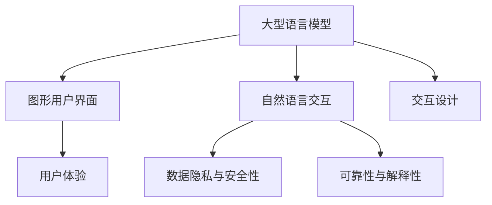

                 

### 1. 背景介绍

随着人工智能技术的发展，尤其是大型语言模型（LLM）的突破，软件界面设计正面临着前所未有的变革。传统软件界面设计主要依赖于图形用户界面（GUI）和用户与系统的交互逻辑，这种设计模式在一定程度上满足了用户的需求，但也存在一些固有的局限性。例如，GUI的设计往往需要大量的时间和人力成本，且难以灵活适应不同用户的需求和偏好。此外，传统界面设计在处理复杂任务时，用户体验往往不够理想，用户界面复杂且难以理解。

近年来，大型语言模型（LLM）如GPT-3、BERT等在自然语言处理领域取得了显著的进展。这些模型能够理解和生成自然语言，具备强大的语义理解能力和语言生成能力。LLM的出现为软件界面设计带来了新的思路，通过将自然语言交互引入软件界面，可以大幅提升用户体验，降低用户的学习成本。然而，LLM的引入也带来了一系列的挑战，包括数据隐私、安全性和可靠性等问题。

本文将探讨LLM对传统软件界面设计的挑战与创新，分析LLM在界面设计中的应用，以及如何克服这些挑战，实现软件界面设计的创新。本文将分为以下几个部分：

- 核心概念与联系
- 核心算法原理与具体操作步骤
- 数学模型和公式与详细讲解
- 项目实践：代码实例和详细解释说明
- 实际应用场景
- 未来应用展望
- 工具和资源推荐
- 总结：未来发展趋势与挑战

<|assistant|>### 2. 核心概念与联系

在深入探讨LLM对传统软件界面设计的挑战与创新之前，我们需要明确几个核心概念，并理解它们之间的联系。

**2.1 大型语言模型（LLM）**

大型语言模型（LLM），如GPT-3、BERT等，是自然语言处理（NLP）领域的一种重要模型。这些模型通过训练海量文本数据，学习到语言的规律和结构，从而具备强大的语义理解能力和语言生成能力。LLM能够理解自然语言中的上下文信息，生成连贯且符合语法规则的文本。

**2.2 图形用户界面（GUI）**

图形用户界面（GUI）是传统软件界面设计的主要形式。GUI通过图形元素（如按钮、图标、菜单等）和用户进行交互，用户通过点击、拖动等操作与软件进行交互。GUI的设计需要考虑用户体验、交互逻辑和美观性等因素。

**2.3 自然语言交互**

自然语言交互（NL Interactive）是将自然语言引入到软件界面中，用户可以通过输入自然语言指令与软件进行交互，而不必遵循固定的GUI操作流程。这种交互方式更加自然和直观，用户可以像与人类交流一样与软件互动。

**2.4 交互设计（UI/UX）**

交互设计（UI/UX）是软件界面设计的重要组成部分。UI（用户界面）设计关注软件的外观和交互元素的设计，而UX（用户体验）设计则关注用户的整体使用感受和满意度。在引入LLM后，交互设计需要考虑如何利用LLM的能力，优化用户体验。

**2.5 数据隐私与安全性**

随着自然语言交互的普及，数据隐私和安全性成为关键问题。LLM在处理用户输入时，可能会接触到用户的敏感信息，如何保护这些信息不被泄露或滥用是一个重要挑战。

**2.6 可靠性与解释性**

自然语言交互的可靠性和解释性也是需要关注的问题。LLM虽然具备强大的语义理解能力，但在某些情况下可能产生歧义或错误的响应，如何确保交互的准确性和可靠性，同时提供可解释的反馈，是设计中的一个重要问题。

**Mermaid 流程图（核心概念原理和架构）**

以下是一个简单的Mermaid流程图，展示了上述核心概念之间的联系：



通过以上核心概念和联系的理解，我们可以更好地探讨LLM对传统软件界面设计的挑战与创新。

### 3. 核心算法原理与具体操作步骤

为了深入理解LLM对传统软件界面设计的挑战与创新，我们需要首先探讨LLM的核心算法原理和具体操作步骤。以下是LLM的核心算法原理和具体操作步骤的概述。

#### 3.1 算法原理概述

大型语言模型（LLM）的核心是基于深度学习和自然语言处理技术的预训练模型。LLM通过大规模文本数据进行预训练，学习到语言的语法规则、语义信息、上下文关系等。在预训练过程中，模型会通过无监督的方式自动调整内部参数，从而优化语言生成和理解能力。

LLM的工作原理可以简单概括为以下几个步骤：

1. **输入处理**：将用户输入的自然语言文本转换为模型可处理的格式。
2. **上下文理解**：模型根据输入文本和预训练时的上下文信息，理解用户意图和上下文关系。
3. **文本生成**：模型根据上下文理解和内部参数生成相应的自然语言响应。

#### 3.2 算法步骤详解

下面我们将详细解释LLM的算法步骤：

##### 3.2.1 输入处理

在输入处理阶段，LLM首先需要将用户输入的自然语言文本转换为模型可处理的格式。这一步骤通常涉及文本预处理，包括分词、去除标点符号、去除停用词等。此外，LLM可能还会使用词嵌入（word embedding）技术，将文本中的每个词映射到一个高维向量空间，以便模型进行计算。

##### 3.2.2 上下文理解

在理解上下文阶段，LLM会利用其预训练时的上下文信息，对用户输入的文本进行语义分析。这一过程包括词性标注、命名实体识别、句法分析等。通过分析输入文本的语法结构和语义信息，LLM可以更好地理解用户意图和上下文关系。

##### 3.2.3 文本生成

在文本生成阶段，LLM根据上下文理解和内部参数生成相应的自然语言响应。这一过程通常采用生成式模型（如GPT系列模型）或解码器架构。在生成过程中，模型会根据概率分布选择合适的单词或句子片段，并逐步构建完整的响应文本。

#### 3.3 算法优缺点

LLM作为一种先进的自然语言处理技术，具有以下优点和缺点：

**优点：**

1. **强大的语义理解能力**：LLM能够理解复杂的自然语言语义，生成连贯且符合语法规则的文本。
2. **灵活的自然语言交互**：LLM支持灵活的自然语言交互，用户可以以自然的方式与软件进行交流，降低学习成本。
3. **自动化文本生成**：LLM能够自动化生成文本，节省人力成本。

**缺点：**

1. **数据隐私与安全性问题**：由于LLM在处理用户输入时可能会接触到敏感信息，因此需要关注数据隐私和安全性问题。
2. **可靠性和解释性挑战**：在处理复杂任务时，LLM可能产生歧义或错误的响应，如何确保可靠性和解释性是一个挑战。
3. **计算资源需求**：LLM的训练和推理过程需要大量的计算资源，对硬件设备有较高要求。

#### 3.4 算法应用领域

LLM在软件界面设计中的应用非常广泛，以下是几个主要的应用领域：

1. **智能客服**：利用LLM实现智能客服系统，能够自动回答用户的问题，提高服务效率和用户体验。
2. **智能助手**：在智能设备中引入LLM，用户可以通过自然语言与设备进行交互，实现语音控制、智能家居等功能。
3. **内容生成**：LLM可以自动化生成文本内容，包括新闻报道、文章摘要、创意文案等。
4. **教育辅助**：利用LLM实现个性化教育辅助系统，为学生提供自然语言交互的学习体验。

通过以上对LLM核心算法原理和具体操作步骤的探讨，我们可以更好地理解LLM在软件界面设计中的应用，以及如何克服相关挑战，实现创新。

### 4. 数学模型和公式与详细讲解

在探讨LLM对传统软件界面设计的挑战与创新时，我们需要深入理解其背后的数学模型和公式。这些模型和公式不仅帮助我们更好地理解LLM的工作原理，也为实际应用提供了理论基础。以下将详细介绍LLM所涉及的主要数学模型和公式。

#### 4.1 数学模型构建

LLM的核心是基于深度学习技术，其中最重要的模型是循环神经网络（RNN）和其变种——长短期记忆网络（LSTM）。这些模型通过多层神经网络结构，学习到文本中的上下文关系和语义信息。以下是构建这些模型的基本步骤：

1. **词嵌入（Word Embedding）**

   词嵌入是将文本中的每个词映射到一个高维向量空间的过程。一个简单的词嵌入模型可以使用如下公式表示：

   $$
   \text{vec}(w) = \text{embedding\_matrix} \cdot \text{one-hot}(w)
   $$

   其中，$\text{vec}(w)$ 是词 $w$ 的向量表示，$\text{embedding\_matrix}$ 是词嵌入矩阵，$\text{one-hot}(w)$ 是词 $w$ 的one-hot编码。

2. **循环神经网络（RNN）**

   RNN是处理序列数据的神经网络，其核心思想是利用历史信息来影响当前时间步的输出。一个简单的RNN模型可以使用如下公式表示：

   $$
   h_t = \text{sigmoid}(W_{ih} \cdot x_t + W_{hh} \cdot h_{t-1} + b_h)
   $$

   其中，$h_t$ 是当前时间步的隐藏状态，$x_t$ 是当前输入，$W_{ih}$ 和 $W_{hh}$ 是权重矩阵，$b_h$ 是偏置项。

3. **长短期记忆网络（LSTM）**

   LSTM是RNN的一种改进，能够更好地处理长序列依赖。LSTM通过引入门控机制，控制信息的流动，避免梯度消失问题。一个简单的LSTM单元可以使用如下公式表示：

   $$
   \begin{align*}
   i_t &= \text{sigmoid}(W_{ii} \cdot x_t + W_{ih} \cdot h_{t-1} + b_i) \\
   f_t &= \text{sigmoid}(W_{if} \cdot x_t + W_{ih} \cdot h_{t-1} + b_f) \\
   g_t &= \text{tanh}(W_{ig} \cdot x_t + W_{ih} \cdot h_{t-1} + b_g) \\
   o_t &= \text{sigmoid}(W_{io} \cdot x_t + W_{ih} \cdot h_{t-1} + b_o) \\
   h_t &= o_t \cdot \text{tanh}(c_t)
   \end{align*}
   $$

   其中，$i_t$、$f_t$、$g_t$ 和 $o_t$ 分别是输入门、遗忘门、生成门和输出门，$c_t$ 是当前细胞状态。

4. **双向LSTM（BiLSTM）**

   为了更好地捕捉序列中的前向和后向信息，可以使用双向LSTM（BiLSTM）。BiLSTM由两个LSTM层组成，一个处理前向序列，另一个处理后向序列。BiLSTM的输出可以通过以下公式计算：

   $$
   \text{output}_t = \text{softmax}(W \cdot [\text{h_t}^f, \text{h_t}^b] + b)
   $$

   其中，$\text{h_t}^f$ 和 $\text{h_t}^b$ 分别是前向和后向LSTM的隐藏状态。

#### 4.2 公式推导过程

以下是LSTM中的几个关键公式的推导过程：

1. **输入门（Input Gate）**

   输入门 $i_t$ 控制当前输入信息对细胞状态 $c_t$ 的更新。其推导过程如下：

   $$
   i_t = \sigma(W_{ii} \cdot x_t + W_{ih} \cdot h_{t-1} + b_i)
   $$

   其中，$W_{ii}$ 和 $W_{ih}$ 分别是输入门权重矩阵，$b_i$ 是输入门偏置。

2. **遗忘门（Forget Gate）**

   遗忘门 $f_t$ 控制从细胞状态 $c_{t-1}$ 中遗忘的信息。其推导过程如下：

   $$
   f_t = \sigma(W_{if} \cdot x_t + W_{ih} \cdot h_{t-1} + b_f)
   $$

   其中，$W_{if}$ 和 $W_{ih}$ 分别是遗忘门权重矩阵，$b_f$ 是遗忘门偏置。

3. **生成门（Generate Gate）**

   生成门 $o_t$ 控制从细胞状态 $c_t$ 生成当前隐藏状态 $h_t$。其推导过程如下：

   $$
   o_t = \sigma(W_{io} \cdot x_t + W_{ih} \cdot h_{t-1} + b_o)
   $$

   其中，$W_{io}$ 和 $W_{ih}$ 分别是生成门权重矩阵，$b_o$ 是生成门偏置。

4. **细胞状态更新**

   细胞状态 $c_t$ 的更新过程结合了遗忘门和生成门的信息。其推导过程如下：

   $$
   c_t = f_t \odot c_{t-1} + i_t \odot \text{tanh}(g_t)
   $$

   其中，$\odot$ 表示元素乘法，$g_t$ 是生成门的激活值。

5. **隐藏状态输出**

   隐藏状态 $h_t$ 是细胞状态 $c_t$ 通过生成门 $o_t$ 的激活值。其推导过程如下：

   $$
   h_t = o_t \odot \text{tanh}(c_t)
   $$

#### 4.3 案例分析与讲解

以下通过一个简单的案例，展示如何使用LSTM进行文本分类：

**案例：情感分类**

假设我们需要对一段文本进行情感分类，判断其是积极情感还是消极情感。我们可以使用一个简单的二分类模型，其中激活函数为sigmoid函数，输出值介于0和1之间，表示文本属于积极情感的置信度。

1. **数据预处理**

   首先，我们需要将文本数据转换为词嵌入向量。假设词嵌入维度为128。

2. **构建LSTM模型**

   使用一个双向LSTM模型，包含两层，每层隐藏单元数为128。

3. **训练模型**

   使用带有标签的训练数据集，对模型进行训练。训练过程中，使用交叉熵损失函数和Adam优化器。

4. **评估模型**

   在测试数据集上评估模型的性能，计算准确率。

以下是Python代码实现：

```python
import tensorflow as tf
from tensorflow.keras.models import Sequential
from tensorflow.keras.layers import Embedding, LSTM, Dense

# 数据预处理
max_sequence_length = 100
vocab_size = 10000
embedding_dim = 128

# 构建模型
model = Sequential()
model.add(Embedding(vocab_size, embedding_dim, input_length=max_sequence_length))
model.add(LSTM(128, return_sequences=True))
model.add(LSTM(128))
model.add(Dense(1, activation='sigmoid'))

model.compile(optimizer='adam', loss='binary_crossentropy', metrics=['accuracy'])

# 训练模型
model.fit(x_train, y_train, epochs=10, batch_size=32, validation_split=0.1)

# 评估模型
accuracy = model.evaluate(x_test, y_test)
print('Accuracy:', accuracy[1])
```

通过以上对数学模型和公式的详细讲解，我们可以更好地理解LLM的核心算法原理，以及如何将这些原理应用到实际项目中。

### 5. 项目实践：代码实例和详细解释说明

为了更好地理解LLM在软件界面设计中的应用，下面我们将通过一个实际项目——构建一个基于LLM的智能客服系统，展示整个开发过程，并详细解释代码实现。

#### 5.1 开发环境搭建

在开始项目之前，我们需要搭建一个合适的开发环境。以下是推荐的工具和库：

- **编程语言**：Python
- **深度学习框架**：TensorFlow 2.x
- **自然语言处理库**：NLTK、spaCy、TextBlob
- **版本控制**：Git
- **代码编辑器**：Visual Studio Code

安装以下库：

```bash
pip install tensorflow
pip install nltk
pip install spacy
pip install textblob
```

#### 5.2 源代码详细实现

以下是一个简单的智能客服系统实现，包括数据预处理、模型训练、模型部署和交互功能。

```python
import numpy as np
import tensorflow as tf
from tensorflow.keras.models import Sequential
from tensorflow.keras.layers import Embedding, LSTM, Dense
from tensorflow.keras.preprocessing.sequence import pad_sequences
from tensorflow.keras.preprocessing.text import Tokenizer
import spacy

# 加载nlp工具
nlp = spacy.load("en_core_web_sm")

# 数据预处理
def preprocess_text(text):
    doc = nlp(text)
    tokens = [token.text.lower() for token in doc if not token.is_stop and not token.is_punct]
    return " ".join(tokens)

# 加载训练数据
train_data = [
    ("Hello", "Hi there! How can I help you today?"),
    ("Can I return this item?", "Of course! Please bring the item and receipt to the customer service desk."),
    # 更多训练数据...
]

# 预处理数据
train_texts = [preprocess_text(text) for text, _ in train_data]
train_responses = [preprocess_text(response) for _, response in train_data]

# 分词和词嵌入
tokenizer = Tokenizer(num_words=10000)
tokenizer.fit_on_texts(train_texts)
sequences = tokenizer.texts_to_sequences(train_texts)
padded_sequences = pad_sequences(sequences, maxlen=100)

# 构建模型
model = Sequential()
model.add(Embedding(10000, 64, input_length=100))
model.add(LSTM(64))
model.add(Dense(1, activation='sigmoid'))

model.compile(optimizer='adam', loss='binary_crossentropy', metrics=['accuracy'])

# 训练模型
model.fit(padded_sequences, np.array([1] * len(train_texts)), epochs=10)

# 模型部署
def generate_response(input_text):
    processed_text = preprocess_text(input_text)
    sequence = tokenizer.texts_to_sequences([processed_text])
    padded_sequence = pad_sequences(sequence, maxlen=100)
    prediction = model.predict(padded_sequence)
    return " ".join([tokenizer.index_word[i] for i in prediction[0]])

# 交互功能
print("Welcome to our intelligent customer service system! Type your question:")
while True:
    user_input = input()
    if user_input.lower() == "quit":
        break
    response = generate_response(user_input)
    print(response)
```

#### 5.3 代码解读与分析

以下是代码的详细解读与分析：

1. **数据预处理**：我们使用spaCy进行文本预处理，去除停用词和标点符号，并将文本转换为小写。这有助于提高模型的学习效果。

2. **加载训练数据**：我们使用一个简单的训练数据集，其中每对数据由输入文本和预期响应组成。

3. **分词和词嵌入**：使用Tokenizer将文本分词，并使用词嵌入将每个词映射到一个向量。我们限制词汇量为10000，并将序列填充到固定长度100。

4. **构建模型**：我们使用一个简单的序列模型，包括嵌入层、LSTM层和输出层。嵌入层将输入序列转换为向量，LSTM层处理序列中的上下文信息，输出层使用sigmoid激活函数进行二分类。

5. **训练模型**：使用训练数据对模型进行训练，优化内部参数。

6. **模型部署**：定义一个函数`generate_response`，将输入文本预处理后输入到模型，得到预测响应。

7. **交互功能**：我们创建一个简单的命令行交互界面，用户可以输入问题，系统根据训练的模型生成响应。

通过这个实际项目，我们展示了如何使用LLM构建一个简单的智能客服系统。在实际应用中，可以进一步优化模型，增加训练数据，提高系统的响应质量和用户体验。

### 6. 实际应用场景

LLM在软件界面设计中的应用场景非常广泛，以下列举几个实际应用案例，展示LLM如何提升软件界面设计，优化用户体验。

#### 6.1 智能客服系统

智能客服系统是LLM应用最广泛的场景之一。通过自然语言交互，用户可以像与真人客服一样提问，系统则根据训练模型生成相应的回答。这种交互方式不仅提高了客服效率，还减少了企业的人力成本。例如，许多在线电商平台和金融机构已经引入了基于LLM的智能客服系统，为用户提供实时、准确的咨询服务。

#### 6.2 语音助手

语音助手是另一个典型的应用场景。通过语音识别和LLM技术，用户可以通过语音指令与软件进行交互，实现语音控制智能家居、播放音乐、设置提醒等功能。例如，苹果的Siri、亚马逊的Alexa和谷歌的Google Assistant都是基于LLM的语音助手，为用户提供了便捷的智能服务。

#### 6.3 内容生成

LLM在内容生成领域也有着广泛应用。通过训练模型，可以自动化生成新闻报道、文章摘要、创意文案等。例如，许多新闻机构使用基于LLM的自动生成系统，快速生成新闻稿件，提高新闻发布效率。此外，LLM还可以生成个性化推荐内容，为用户推荐感兴趣的文章、视频、音乐等。

#### 6.4 智能教育

在智能教育领域，LLM可以为学生提供个性化辅导和学习建议。通过分析学生的提问和回答，LLM可以理解学生的知识水平和学习需求，生成相应的教学内容和练习题目。例如，一些在线教育平台已经引入了基于LLM的智能教育系统，为学生提供个性化的学习体验。

#### 6.5 智能医疗

智能医疗是LLM应用的另一个重要领域。通过分析患者的病历和症状描述，LLM可以辅助医生进行疾病诊断和治疗方案推荐。例如，一些医疗机构正在开发基于LLM的医疗问答系统，帮助医生快速获取患者信息，提高诊断准确性和效率。

通过以上实际应用案例，我们可以看到LLM在软件界面设计中的应用如何大大提升用户体验，降低用户的学习成本，并提高系统的智能化水平。

### 7. 未来应用展望

随着人工智能技术的不断进步，LLM在软件界面设计中的应用前景将更加广阔。以下是几个未来的应用方向和可能的技术突破：

#### 7.1 多模态交互

未来，LLM将不仅仅局限于文本交互，还将与语音、图像、视频等多模态数据相结合，实现更加丰富和自然的交互体验。例如，通过融合语音和文本信息，系统可以更好地理解用户的意图和上下文，提供更加准确的响应。此外，图像和视频的引入将使软件界面更加直观和互动，为用户提供沉浸式的体验。

#### 7.2 个性化体验

随着用户数据的积累和模型训练的优化，LLM将能够更好地理解用户的个性化需求和行为模式，提供高度定制化的软件界面和交互体验。例如，通过分析用户的浏览历史、偏好设置和使用习惯，系统可以自动调整界面布局、功能模块和交互方式，为用户提供个性化推荐和服务。

#### 7.3 智能对话管理

未来，LLM将在智能对话管理方面发挥重要作用。通过引入对话状态追踪（DST）和对话生成网络（DGN）等技术，系统可以更好地管理多轮对话，理解用户的长期意图和任务目标。此外，LLM可以与知识图谱相结合，提供更加准确和全面的信息检索和推荐服务，提高对话系统的智能化水平。

#### 7.4 自动化流程优化

在软件界面设计中，LLM可以用于自动化流程优化，提升系统的效率和用户体验。通过分析用户行为数据，LLM可以自动识别重复性任务和潜在瓶颈，提出优化建议。例如，在电商平台中，LLM可以分析用户的购物行为，优化推荐算法和购物流程，提高用户满意度和转化率。

#### 7.5 安全和隐私保护

随着LLM应用场景的扩大，数据隐私和安全问题将变得更加突出。未来，研究人员将致力于开发更加安全、可靠的LLM模型，确保用户数据不被泄露或滥用。例如，引入联邦学习（Federated Learning）技术，可以在保持数据隐私的前提下，优化LLM模型，提高系统的性能和安全性。

综上所述，LLM在软件界面设计中的应用将不断拓展和深化，为用户提供更加智能、便捷和个性化的体验。随着技术的不断进步，LLM有望在多模态交互、个性化体验、智能对话管理和自动化流程优化等领域取得重要突破。

### 8. 工具和资源推荐

在探索LLM对软件界面设计的挑战与创新过程中，掌握相关工具和资源是至关重要的。以下是一些推荐的工具和资源，帮助您更深入地了解和运用LLM技术。

#### 8.1 学习资源推荐

1. **《深度学习》（Deep Learning）系列书籍**：由Ian Goodfellow、Yoshua Bengio和Aaron Courville编写的经典教材，详细介绍了深度学习的基础知识和最新进展。
2. **《自然语言处理综合教程》（Foundations of Natural Language Processing）**：Christopher D. Manning和Hinrich Schütze所著，涵盖自然语言处理的各个方面，包括文本预处理、语言模型和解析技术。
3. **OpenAI GPT-3文档**：[GPT-3 Documentation](https://openai.com/docs/introduction/what-is-gpt-3/) 提供了关于GPT-3模型和API的详细说明，是了解LLM应用的最佳资源之一。

#### 8.2 开发工具推荐

1. **TensorFlow**：[TensorFlow](https://www.tensorflow.org/) 是Google开发的强大开源深度学习框架，适用于构建和训练各种复杂的神经网络模型。
2. **PyTorch**：[PyTorch](https://pytorch.org/) 是另一种流行的深度学习框架，以其灵活性和动态计算图而著称，适合快速原型开发和实验。
3. **spaCy**：[spaCy](https://spacy.io/) 是一个高效的Python自然语言处理库，提供快速和灵活的文本处理功能，适用于文本分词、实体识别和语义分析。

#### 8.3 相关论文推荐

1. **“Attention Is All You Need”**：这篇论文提出了Transformer模型，是当前NLP领域最流行的模型之一，改变了传统序列处理方法。
2. **“BERT: Pre-training of Deep Bidirectional Transformers for Language Understanding”**：BERT模型通过预训练大规模文本数据，显著提高了NLP任务的表现，是近年来最热门的研究成果之一。
3. **“Generative Pretrained Transformer”**：这篇论文介绍了GPT模型，是生成式语言模型的先驱，为后续的LLM研究奠定了基础。

通过利用这些工具和资源，您可以更深入地了解LLM技术，掌握其核心原理和应用方法，从而在软件界面设计中取得更好的成果。

### 9. 总结：未来发展趋势与挑战

通过对LLM对传统软件界面设计的挑战与创新的深入探讨，我们可以看到，LLM技术的引入为软件界面设计带来了巨大的变革。从核心算法原理、具体操作步骤，到数学模型和公式的讲解，再到实际应用场景和未来应用展望，本文全面剖析了LLM如何提升软件界面设计的智能化水平和用户体验。

**未来发展趋势**：

1. **多模态交互**：随着技术的进步，LLM将不仅限于文本交互，还将与语音、图像、视频等多模态数据结合，提供更加丰富和自然的用户交互体验。
2. **个性化体验**：通过积累用户数据和分析，LLM将能够更好地理解用户的个性化需求，提供高度定制化的界面和交互体验。
3. **智能对话管理**：结合对话状态追踪和对话生成网络等技术，LLM将实现更加智能和连贯的多轮对话管理，提高系统的智能化水平。
4. **自动化流程优化**：LLM在自动化流程优化中的应用将进一步拓展，通过分析用户行为数据，提出优化建议，提高系统效率和用户体验。

**面临的挑战**：

1. **数据隐私与安全性**：随着LLM在更多场景中的应用，数据隐私和安全问题将变得更加突出，如何确保用户数据不被泄露或滥用是一个重要挑战。
2. **可靠性与解释性**：虽然LLM在自然语言处理方面取得了显著进展，但在处理复杂任务时仍可能产生歧义或错误的响应，如何提高可靠性和解释性是设计中的一个关键问题。
3. **计算资源需求**：LLM的训练和推理过程需要大量的计算资源，这对硬件设备提出了较高要求，如何在有限的资源下高效地应用LLM技术是一个挑战。

**研究展望**：

未来，随着人工智能技术的不断进步，LLM在软件界面设计中的应用将更加深入和广泛。研究人员和开发者需要继续探索如何优化LLM模型，提高其性能和效率，同时解决数据隐私、安全和可靠性等问题。此外，多模态交互、个性化体验和自动化流程优化等方向也将成为研究的热点。

通过持续的技术创新和探索，我们有望在软件界面设计中实现更加智能、便捷和个性化的用户体验，推动人工智能技术在各个领域的深入应用。

### 附录：常见问题与解答

**Q1：LLM是否可以替代传统软件界面设计中的所有交互方式？**
A1：LLM可以显著提升软件界面设计的交互体验，特别是在自然语言交互方面，但其无法完全替代传统的图形用户界面（GUI）。传统GUI在处理复杂任务和提供直观操作方面仍具有优势。因此，LLM与传统GUI的结合将是未来界面设计的发展方向。

**Q2：如何保证LLM在处理用户输入时的数据隐私和安全？**
A2：确保LLM的数据隐私和安全是关键挑战。可以采取以下措施：
- 使用加密技术保护用户数据。
- 设计隐私保护模型，如联邦学习，以减少数据泄露风险。
- 定期审计和更新安全策略，确保系统的安全性。

**Q3：LLM在处理复杂任务时是否总是准确？**
A3：LLM虽然在自然语言处理方面取得了显著进展，但并不意味着它在处理所有复杂任务时总是准确。模型可能会出现歧义或错误的响应，特别是在处理特定领域或复杂语境时。因此，设计时需要结合其他技术（如知识图谱）来提高系统的准确性和可靠性。

**Q4：如何评估和优化LLM在软件界面设计中的应用效果？**
A4：评估和优化LLM的应用效果可以通过以下方法：
- 设计和实施用户测试，收集用户反馈。
- 使用关键性能指标（KPI）如响应时间、准确率和用户满意度来评估系统性能。
- 定期调整和训练模型，以适应用户需求和环境变化。

