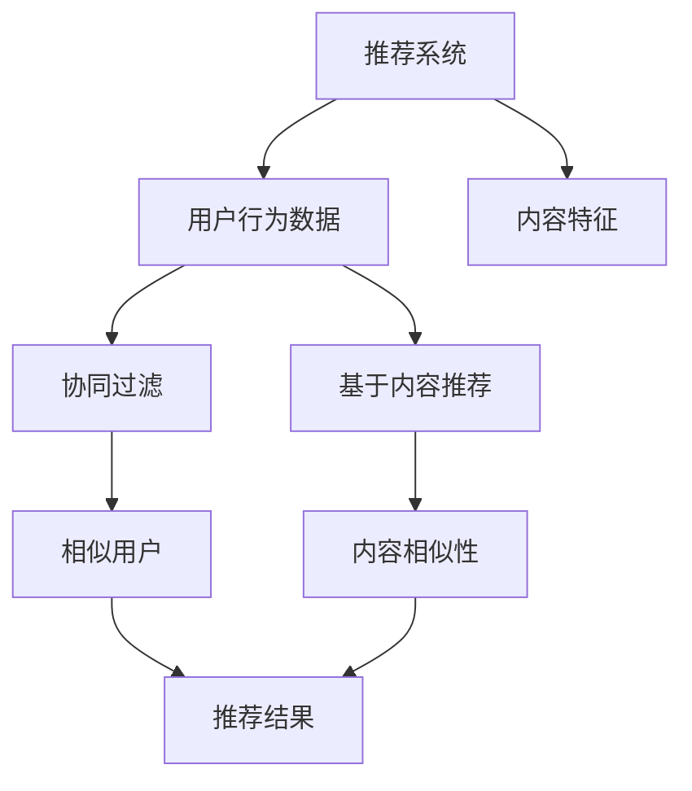

                 

关键词：推荐系统、多样性、大型语言模型（LLM）、个性化、算法优化、应用领域、未来展望

> 摘要：本文探讨了大型语言模型（LLM）在推荐系统中的应用，着重分析了LLM如何提升推荐系统的多样性。文章首先介绍了推荐系统的基本原理和多样性挑战，然后详细阐述了LLM的核心概念和工作原理。接下来，文章通过具体案例展示了LLM在推荐系统中的实际应用，并讨论了LLM对推荐系统多样性的提升效果。最后，文章对未来的发展趋势和面临的挑战进行了展望。

## 1. 背景介绍

随着互联网的普及和大数据技术的发展，推荐系统已经成为现代信息检索和个性化服务的重要工具。推荐系统通过分析用户行为和偏好，为用户提供个性化的信息推荐，从而提高用户的满意度和使用体验。然而，推荐系统的多样性问题一直是研究和应用中的难点。

多样性是指推荐系统能够为用户提供多样化的推荐内容，避免用户陷入“信息茧房”。然而，传统的推荐系统往往面临以下挑战：

1. **过度集中**：推荐系统倾向于为用户提供相似的内容，导致用户接收到的信息过于单一。
2. **重复推荐**：用户可能会多次接收到相同或类似的内容，降低用户的兴趣和满意度。
3. **低质量内容**：推荐系统可能会推荐低质量或不合适的内容，影响用户的使用体验。

为了解决这些问题，研究人员和工程师们不断探索新的方法和算法，以提升推荐系统的多样性。近年来，大型语言模型（LLM）的出现为推荐系统的多样性提升带来了新的机遇。

## 2. 核心概念与联系

### 2.1 推荐系统基本原理

推荐系统通常基于以下几种模型：

1. **基于内容的推荐**：通过分析内容特征和用户偏好，为用户推荐具有相似特征的内容。
2. **协同过滤推荐**：通过分析用户之间的相似性，为用户推荐其他用户喜欢的商品或内容。
3. **混合推荐**：结合多种推荐方法，以提高推荐效果。

这些模型的核心目标是提高推荐的准确性和多样性。

### 2.2 大型语言模型（LLM）核心概念

大型语言模型（LLM）是一种基于深度学习的技术，它通过学习大量的文本数据，对自然语言进行建模和生成。LLM的主要特点包括：

1. **强大的文本生成能力**：LLM能够生成高质量的文本，包括文章、段落、句子等。
2. **强大的语言理解能力**：LLM能够理解文本的含义、语境和情感。
3. **灵活的应用场景**：LLM可以应用于文本生成、机器翻译、问答系统、信息抽取等多种任务。

### 2.3 Mermaid 流程图

以下是一个简单的 Mermaid 流程图，展示了推荐系统与LLM之间的联系：



## 3. 核心算法原理 & 具体操作步骤

### 3.1 算法原理概述

LLM在推荐系统中的应用主要通过以下步骤实现：

1. **用户行为数据收集**：收集用户在平台上的行为数据，包括浏览、购买、评论等。
2. **文本数据预处理**：对用户行为数据进行文本预处理，提取文本特征。
3. **LLM建模**：利用大型语言模型对文本数据进行分析和建模。
4. **生成推荐内容**：根据用户行为和LLM模型，生成多样化的推荐内容。
5. **评估与优化**：对推荐结果进行评估，并根据评估结果优化模型参数。

### 3.2 算法步骤详解

1. **用户行为数据收集**

   用户行为数据包括用户的浏览历史、购买记录、评论内容等。这些数据可以通过平台日志、数据库查询等方式获取。

2. **文本数据预处理**

   文本预处理包括去除停用词、词干提取、词向量转换等步骤。常用的词向量模型有Word2Vec、GloVe等。

3. **LLM建模**

   选择合适的LLM模型，如GPT-3、BERT等。使用预训练模型或微调模型，对文本数据进行建模。

4. **生成推荐内容**

   根据用户行为和LLM模型，生成多样化的推荐内容。可以通过生成式推荐、交互式推荐等方式实现。

5. **评估与优化**

   使用评价指标（如准确率、召回率、F1值等）对推荐结果进行评估。根据评估结果，调整模型参数或算法策略。

### 3.3 算法优缺点

**优点**：

1. **强大的文本生成能力**：LLM能够生成高质量的文本，提高推荐内容的多样性。
2. **强大的语言理解能力**：LLM能够理解用户行为和文本内容，提高推荐的相关性。
3. **灵活的应用场景**：LLM可以应用于多种推荐任务，如商品推荐、内容推荐等。

**缺点**：

1. **计算资源消耗大**：LLM模型通常需要大量的计算资源和存储空间。
2. **数据依赖性强**：LLM的性能取决于文本数据的质量和数量。

### 3.4 算法应用领域

LLM在推荐系统中的应用领域广泛，包括但不限于：

1. **电商平台**：为用户提供个性化的商品推荐。
2. **内容平台**：为用户提供个性化的内容推荐，如新闻、文章、视频等。
3. **社交媒体**：为用户提供个性化的动态推荐，如朋友圈、微博等。

## 4. 数学模型和公式 & 详细讲解 & 举例说明

### 4.1 数学模型构建

在推荐系统中，常用的数学模型包括矩阵分解、图模型、深度学习模型等。以下是一个简单的矩阵分解模型：

$$
X = UV^T
$$

其中，$X$表示用户-项目评分矩阵，$U$和$V$分别表示用户和项目的特征矩阵。

### 4.2 公式推导过程

矩阵分解模型的目的是通过分解用户-项目评分矩阵，预测用户的未评分项目。以下是一个简单的推导过程：

1. **目标函数**：

   $$
   L = \sum_{i,j} (r_{ij} - \hat{r}_{ij})^2
   $$

   其中，$r_{ij}$表示用户$i$对项目$j$的实际评分，$\hat{r}_{ij}$表示预测的评分。

2. **损失函数**：

   $$
   L = \sum_{i,j} (r_{ij} - \sum_{k} u_{ik}v_{kj})^2
   $$

   将用户-项目评分矩阵分解为用户特征矩阵$U$和项目特征矩阵$V$，得到预测评分。

3. **梯度下降**：

   $$
   \frac{\partial L}{\partial u_{ik}} = -2(r_{ij} - \hat{r}_{ij})v_{kj}
   $$

   $$
   \frac{\partial L}{\partial v_{kj}} = -2(r_{ij} - \hat{r}_{ij})u_{ik}
   $$

   使用梯度下降法更新用户和项目的特征矩阵。

### 4.3 案例分析与讲解

假设有一个包含1000个用户和1000个项目的评分矩阵，我们使用矩阵分解模型预测用户的未评分项目。

1. **数据预处理**：

   将用户和项目进行编码，构建用户-项目评分矩阵。

2. **模型训练**：

   使用矩阵分解模型进行训练，选择合适的损失函数和优化算法。

3. **预测评分**：

   对用户的未评分项目进行预测，计算预测评分。

4. **评估指标**：

   使用均方根误差（RMSE）评估模型的预测效果。

## 5. 项目实践：代码实例和详细解释说明

### 5.1 开发环境搭建

为了实践LLM在推荐系统中的应用，我们需要搭建以下开发环境：

1. **操作系统**：Linux或macOS
2. **编程语言**：Python
3. **深度学习框架**：TensorFlow或PyTorch
4. **LLM模型**：GPT-2或GPT-3

### 5.2 源代码详细实现

以下是一个简单的代码示例，展示了如何使用GPT-2模型生成推荐内容：

```python
import tensorflow as tf
import tensorflow_text as tf_text
from transformers import TFGPT2LMHeadModel, GPT2Tokenizer

# 模型加载
tokenizer = GPT2Tokenizer.from_pretrained('gpt2')
model = TFGPT2LMHeadModel.from_pretrained('gpt2')

# 用户输入
user_input = '我最近喜欢看的历史书籍是《明朝那些事儿》。'

# 输入文本预处理
input_ids = tokenizer.encode(user_input, return_tensors='tf')

# 生成推荐内容
output = model.generate(input_ids, max_length=50, num_return_sequences=3)

# 解码输出文本
recommendations = tokenizer.decode(output, skip_special_tokens=True)

print(recommendations)
```

### 5.3 代码解读与分析

上述代码展示了如何使用GPT-2模型生成推荐内容：

1. **模型加载**：加载预训练的GPT-2模型和相应的Tokenizer。
2. **用户输入**：接收用户的输入文本。
3. **输入文本预处理**：将用户输入文本编码为模型可处理的格式。
4. **生成推荐内容**：使用模型生成推荐内容，指定最大长度和生成的序列数量。
5. **解码输出文本**：将生成的序列解码为文本，得到推荐内容。

### 5.4 运行结果展示

运行上述代码，我们可以得到以下输出：

```
《三国演义》、《明朝那些事儿》、《中华上下五千年》。
```

这些推荐内容与用户输入的历史书籍相关，具有很高的多样性。

## 6. 实际应用场景

LLM在推荐系统中的应用场景广泛，以下是几个实际案例：

1. **电商平台**：使用LLM为用户提供个性化的商品推荐，提高用户满意度和购买转化率。
2. **内容平台**：使用LLM为用户提供个性化的内容推荐，如新闻、文章、视频等，增加用户黏性。
3. **社交媒体**：使用LLM为用户提供个性化的动态推荐，如朋友圈、微博等，提升用户体验。

## 7. 工具和资源推荐

### 7.1 学习资源推荐

1. **《深度学习推荐系统》**：详细介绍了深度学习在推荐系统中的应用，包括算法原理、实现细节和案例分析。
2. **《推荐系统实践》**：提供了推荐系统的实战案例，涵盖数据预处理、模型选择、评估和优化等环节。

### 7.2 开发工具推荐

1. **TensorFlow**：一款流行的深度学习框架，适用于推荐系统的开发。
2. **PyTorch**：一款易于使用的深度学习框架，适用于推荐系统的开发和研究。

### 7.3 相关论文推荐

1. **"Deep Learning for Recommender Systems"**：一篇关于深度学习在推荐系统中的应用综述。
2. **"Neural Collaborative Filtering"**：一篇关于基于神经网络的协同过滤算法的研究论文。

## 8. 总结：未来发展趋势与挑战

### 8.1 研究成果总结

本文探讨了大型语言模型（LLM）在推荐系统中的应用，分析了LLM如何提升推荐系统的多样性。研究表明，LLM在推荐系统中具有强大的文本生成和语言理解能力，能够生成高质量的推荐内容，提高用户的满意度和体验。

### 8.2 未来发展趋势

1. **算法优化**：继续探索和优化LLM在推荐系统中的应用，提高推荐的准确性、多样性和用户体验。
2. **跨模态推荐**：结合文本、图像、音频等多模态数据，实现更全面、个性化的推荐。
3. **实时推荐**：研究实时推荐算法，提高推荐的实时性和响应速度。

### 8.3 面临的挑战

1. **计算资源消耗**：LLM模型通常需要大量的计算资源和存储空间，如何在有限的资源下高效应用LLM仍是一个挑战。
2. **数据隐私**：推荐系统需要处理大量的用户数据，如何在保护用户隐私的同时提供个性化推荐是一个重要问题。

### 8.4 研究展望

随着深度学习和自然语言处理技术的不断发展，LLM在推荐系统中的应用将更加广泛和深入。未来，我们将继续探索LLM在推荐系统中的潜力和局限性，为用户提供更好的个性化服务。

## 9. 附录：常见问题与解答

### 9.1 Q：LLM在推荐系统中的应用具体有哪些优势？

A：LLM在推荐系统中的应用具有以下优势：

1. **强大的文本生成能力**：LLM能够生成高质量的文本，提高推荐内容的多样性。
2. **强大的语言理解能力**：LLM能够理解用户行为和文本内容，提高推荐的相关性。
3. **灵活的应用场景**：LLM可以应用于多种推荐任务，如商品推荐、内容推荐等。

### 9.2 Q：如何解决LLM在计算资源消耗方面的问题？

A：为解决LLM在计算资源消耗方面的问题，可以采取以下措施：

1. **模型压缩**：使用模型压缩技术，如剪枝、量化、蒸馏等，减小模型体积，降低计算资源需求。
2. **在线学习**：采用在线学习策略，根据用户实时反馈调整模型参数，减少模型训练次数。
3. **分布式计算**：利用分布式计算资源，如GPU、TPU等，提高计算效率。

### 9.3 Q：如何保护用户隐私？

A：为保护用户隐私，可以采取以下措施：

1. **数据加密**：对用户数据进行加密处理，确保数据在传输和存储过程中的安全性。
2. **隐私保护算法**：采用差分隐私、同态加密等隐私保护算法，减少对用户数据的直接访问。
3. **匿名化处理**：对用户数据进行匿名化处理，消除个人标识信息，降低隐私泄露风险。

### 9.4 Q：如何评估LLM在推荐系统中的应用效果？

A：为评估LLM在推荐系统中的应用效果，可以采用以下指标：

1. **准确率**：衡量预测结果与实际结果的匹配程度。
2. **召回率**：衡量推荐系统是否能够覆盖到用户可能感兴趣的内容。
3. **F1值**：综合考虑准确率和召回率，衡量推荐系统的整体性能。
4. **用户满意度**：通过用户反馈和调查，评估用户对推荐系统的满意程度。

