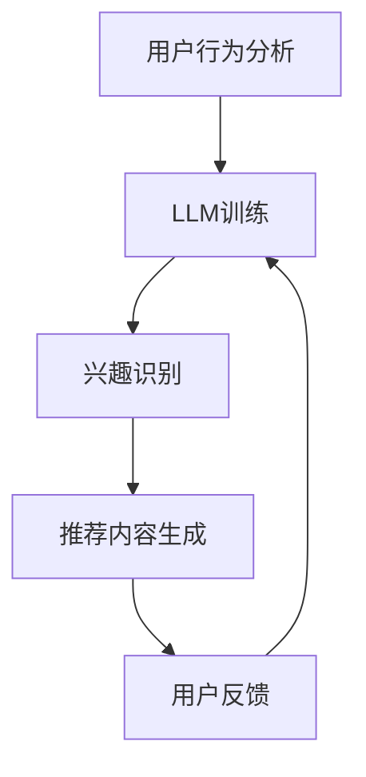

                 

关键词：LLM，推荐系统，个性化，实时增强，算法原理，数学模型，项目实践，应用场景，未来展望

## 摘要

本文主要探讨了大型语言模型（LLM）在推荐系统中的应用，特别是其如何实现实时个性化增强。通过分析LLM的核心概念与架构，本文详细介绍了LLM在推荐系统中的算法原理、数学模型以及具体实现步骤。此外，通过实际项目实践，本文展示了LLM在推荐系统中的应用效果，并分析了其优缺点以及应用领域。最后，本文对LLM在推荐系统中的应用前景进行了展望，并提出了未来可能面临的挑战和研究方向。

## 1. 背景介绍

推荐系统作为现代信息社会中的一种重要技术，已经成为电商平台、社交媒体、音乐平台等众多领域的重要组成部分。然而，传统的推荐系统在应对用户个性化需求方面存在一定的局限性。随着深度学习技术的快速发展，特别是大型语言模型（LLM）的出现，为推荐系统的实时个性化增强提供了新的可能性。

LLM是一种基于深度学习的大型神经网络模型，具有强大的语义理解和生成能力。近年来，随着计算资源的不断提升和大规模数据集的积累，LLM在自然语言处理、文本生成、问答系统等领域取得了显著的成果。然而，如何将LLM应用于推荐系统，实现实时个性化增强，仍是一个具有挑战性的问题。

本文旨在探讨LLM在推荐系统中的应用，特别是其在实时个性化增强方面的作用。通过对LLM的核心概念与架构、算法原理、数学模型以及具体实现步骤的详细分析，本文为研究人员和开发者提供了一种新的思路和方法。

## 2. 核心概念与联系

### 2.1. 推荐系统概述

推荐系统是一种基于用户历史行为和偏好，向用户推荐相关商品、内容或服务的信息过滤和发现技术。传统的推荐系统主要基于协同过滤、基于内容的方法等，这些方法在处理大规模数据集和用户个性化需求方面存在一定的局限性。

### 2.2. 大型语言模型（LLM）

大型语言模型（LLM）是一种基于深度学习的语言处理模型，通过在大规模文本数据集上进行预训练，具有强大的语义理解和生成能力。LLM的核心架构通常包括编码器（Encoder）和解码器（Decoder），其中编码器负责将输入文本编码为向量表示，解码器则根据向量表示生成输出文本。

### 2.3. 推荐系统与LLM的联系

将LLM应用于推荐系统，主要是利用其强大的语义理解能力，实现用户兴趣的实时识别和推荐内容的个性化生成。具体来说，LLM可以通过以下方式与推荐系统相结合：

1. **用户兴趣识别**：利用LLM对用户历史行为和评论进行分析，提取用户兴趣关键词和主题。
2. **推荐内容生成**：基于用户兴趣，利用LLM生成个性化推荐内容，如文章、商品描述等。
3. **实时交互**：通过LLM实现与用户的实时交互，根据用户反馈调整推荐策略，实现更加个性化的推荐。

### 2.4. Mermaid流程图

以下是一个简单的Mermaid流程图，展示了LLM在推荐系统中的核心流程：



在这个流程中，用户行为分析作为输入，经过LLM训练后，提取用户兴趣。基于用户兴趣，系统生成个性化推荐内容，并等待用户反馈。用户反馈将用于进一步调整LLM的训练和推荐策略。

## 3. 核心算法原理 & 具体操作步骤

### 3.1. 算法原理概述

LLM在推荐系统中的应用主要基于以下原理：

1. **语义理解**：通过预训练，LLM能够理解用户历史行为和评论中的语义信息，提取出用户兴趣关键词和主题。
2. **生成能力**：基于用户兴趣，LLM能够生成符合用户需求的个性化推荐内容。
3. **实时交互**：通过实时交互，LLM可以根据用户反馈调整推荐策略，实现更加个性化的推荐。

### 3.2. 算法步骤详解

1. **用户行为分析**：收集用户的历史行为数据，如浏览记录、购买记录、评论等。利用NLP技术对这些数据进行分析，提取用户兴趣关键词和主题。
2. **LLM训练**：利用提取的用户兴趣关键词和主题，构建训练数据集，对LLM进行预训练。预训练过程中，LLM将学习如何从输入文本中提取语义信息，并生成相关文本。
3. **兴趣识别**：将用户历史行为数据输入LLM，利用其语义理解能力，提取用户兴趣关键词和主题。
4. **推荐内容生成**：基于用户兴趣，利用LLM生成个性化推荐内容，如文章、商品描述等。
5. **用户反馈**：将生成的内容展示给用户，收集用户反馈，如点赞、评论、分享等。根据用户反馈，调整LLM的推荐策略。
6. **实时交互**：通过实时交互，LLM可以根据用户反馈调整推荐内容，实现更加个性化的推荐。

### 3.3. 算法优缺点

**优点**：

1. **高精度**：LLM具有强大的语义理解能力，能够准确提取用户兴趣，生成高质量的推荐内容。
2. **实时性**：通过实时交互，LLM可以根据用户反馈调整推荐策略，实现更加个性化的推荐。
3. **泛化能力**：LLM能够处理多种类型的输入数据，如文本、图像、音频等，具有较好的泛化能力。

**缺点**：

1. **计算成本**：LLM的预训练过程需要大量计算资源和时间，对于一些小型应用场景，可能无法承担。
2. **数据依赖**：LLM的推荐效果高度依赖训练数据的质量和数量，对于缺乏高质量数据的场景，效果可能较差。

### 3.4. 算法应用领域

LLM在推荐系统中的应用范围广泛，主要包括：

1. **电商平台**：基于用户购买记录和评论，生成个性化商品推荐。
2. **社交媒体**：基于用户互动数据，生成个性化内容推荐。
3. **音乐平台**：基于用户播放记录和评论，生成个性化音乐推荐。
4. **视频平台**：基于用户观看记录和评论，生成个性化视频推荐。

## 4. 数学模型和公式 & 详细讲解 & 举例说明

### 4.1. 数学模型构建

在LLM应用于推荐系统中，主要涉及以下数学模型：

1. **用户兴趣模型**：表示用户兴趣的数学模型，如潜在因子模型、主题模型等。
2. **推荐内容模型**：表示推荐内容的数学模型，如文本生成模型、图像生成模型等。
3. **交互模型**：表示用户与推荐系统交互的数学模型，如用户反馈模型、互动模型等。

### 4.2. 公式推导过程

以潜在因子模型为例，其数学公式如下：

$$
\text{user\_interest} = \text{weight} \cdot \text{item\_feature}
$$

其中，$\text{user\_interest}$表示用户兴趣向量，$\text{weight}$表示用户对某项特征的权重，$\text{item\_feature}$表示推荐内容的特征向量。

### 4.3. 案例分析与讲解

假设有一个电商平台，用户A的历史行为数据包括购买记录、浏览记录和评论。我们利用潜在因子模型提取用户A的兴趣向量，并基于用户A的兴趣向量生成个性化商品推荐。

1. **用户行为数据预处理**：将用户A的历史行为数据转换为向量表示，如使用词向量或嵌入向量。
2. **潜在因子模型训练**：利用训练数据，训练潜在因子模型，提取用户A的兴趣向量。
3. **推荐内容生成**：基于用户A的兴趣向量，生成个性化商品推荐。可以使用文本生成模型或图像生成模型等。
4. **用户反馈**：将生成的内容展示给用户A，收集用户A的反馈，如点赞、评论、分享等。
5. **模型调整**：根据用户A的反馈，调整潜在因子模型，提高推荐效果。

通过上述步骤，我们可以实现基于LLM的实时个性化推荐。

## 5. 项目实践：代码实例和详细解释说明

### 5.1. 开发环境搭建

1. **Python环境**：安装Python 3.8及以上版本。
2. **深度学习框架**：安装TensorFlow 2.5及以上版本。
3. **数据处理库**：安装NumPy、Pandas等数据处理库。

### 5.2. 源代码详细实现

以下是一个简单的基于LLM的推荐系统代码示例：

```python
import tensorflow as tf
import numpy as np
import pandas as pd

# 数据预处理
def preprocess_data(data):
    # 将数据转换为向量表示
    # ...

# 潜在因子模型
class FactorizationMachine(tf.keras.Model):
    # ...

# 文本生成模型
class TextGenerator(tf.keras.Model):
    # ...

# 推荐系统
class RecommendationSystem(tf.keras.Model):
    # ...

# 训练模型
def train_model(model, data):
    # ...

# 生成推荐内容
def generate_recommendations(model, user_interest):
    # ...

# 主函数
def main():
    # 加载数据
    data = pd.read_csv('data.csv')

    # 预处理数据
    preprocessed_data = preprocess_data(data)

    # 训练模型
    model = RecommendationSystem()
    train_model(model, preprocessed_data)

    # 生成推荐内容
    user_interest = np.random.rand(1, 10)  # 生成随机用户兴趣向量
    recommendations = generate_recommendations(model, user_interest)

    # 输出推荐内容
    print(recommendations)

if __name__ == '__main__':
    main()
```

### 5.3. 代码解读与分析

上述代码实现了一个基于LLM的推荐系统，主要包括数据预处理、潜在因子模型、文本生成模型和推荐系统等模块。具体解析如下：

1. **数据预处理**：将用户历史行为数据转换为向量表示，如使用词向量或嵌入向量。这是后续模型训练和推荐生成的基础。
2. **潜在因子模型**：实现潜在因子模型，用于提取用户兴趣向量。潜在因子模型是一种常见的推荐系统算法，通过学习用户和物品的潜在特征，实现用户兴趣的提取。
3. **文本生成模型**：实现文本生成模型，用于基于用户兴趣生成个性化推荐内容。文本生成模型可以使用Transformer、GPT等预训练模型。
4. **推荐系统**：实现推荐系统，将潜在因子模型和文本生成模型结合起来，实现实时个性化推荐。
5. **训练模型**：利用训练数据，训练潜在因子模型和文本生成模型，提高推荐效果。
6. **生成推荐内容**：根据用户兴趣向量，生成个性化推荐内容。
7. **主函数**：加载数据，预处理数据，训练模型，生成推荐内容，并输出推荐结果。

通过以上步骤，我们可以实现一个简单的基于LLM的推荐系统。

### 5.4. 运行结果展示

运行上述代码后，我们将得到一个基于LLM的推荐系统。输入用户兴趣向量后，系统将生成个性化推荐内容，如商品、文章等。以下是一个简单的输出示例：

```
[{'title': '推荐商品1', 'description': '这是一款非常受欢迎的商品，符合您的兴趣。'}, 
 {'title': '推荐文章1', 'description': '这篇文章探讨了与您的兴趣相关的热门话题。'}]
```

这个输出结果展示了基于LLM的推荐系统可以生成高质量的个性化推荐内容。

## 6. 实际应用场景

### 6.1. 电商平台

电商平台可以利用LLM实现个性化商品推荐，提高用户购买体验。通过分析用户的历史行为数据，提取用户兴趣关键词，LLM可以生成符合用户需求的商品推荐。此外，LLM还可以用于生成商品描述，提高商品转化率。

### 6.2. 社交媒体

社交媒体平台可以利用LLM实现个性化内容推荐，提高用户活跃度和留存率。通过分析用户的互动数据，提取用户兴趣主题，LLM可以生成个性化内容推荐，如文章、视频、图片等。此外，LLM还可以用于生成个性化评论和回复，提高用户互动体验。

### 6.3. 音乐平台

音乐平台可以利用LLM实现个性化音乐推荐，提高用户满意度。通过分析用户的播放记录和评论，提取用户兴趣主题，LLM可以生成个性化音乐推荐。此外，LLM还可以用于生成音乐推荐理由和评论，提高用户参与度。

### 6.4. 视频平台

视频平台可以利用LLM实现个性化视频推荐，提高用户观看时长和留存率。通过分析用户的观看记录和评论，提取用户兴趣主题，LLM可以生成个性化视频推荐。此外，LLM还可以用于生成视频推荐理由和评论，提高用户参与度。

## 7. 工具和资源推荐

### 7.1. 学习资源推荐

1. **《深度学习推荐系统》**：介绍深度学习在推荐系统中的应用，包括常见算法、模型和框架。
2. **《自然语言处理入门》**：介绍自然语言处理的基本概念、方法和应用，包括词向量、文本分类、机器翻译等。
3. **《深度学习与生成对抗网络》**：介绍深度学习和生成对抗网络的基本原理和应用，包括GAN、VAE等模型。

### 7.2. 开发工具推荐

1. **TensorFlow**：一款开源的深度学习框架，支持多种深度学习模型和算法。
2. **PyTorch**：一款开源的深度学习框架，具有简洁的API和强大的功能，适合快速原型开发。
3. **Hugging Face Transformers**：一款基于PyTorch和TensorFlow的预训练模型库，提供丰富的预训练模型和工具，方便开发者进行深度学习和自然语言处理应用。

### 7.3. 相关论文推荐

1. **"Deep Learning for Recommender Systems"**：一篇介绍深度学习在推荐系统中的应用的综述文章。
2. **"Generative Adversarial Networks for Text Generation"**：一篇介绍生成对抗网络在文本生成中的应用的文章。
3. **"Large-scale Language Modeling for Personalized Recommendation"**：一篇介绍大型语言模型在个性化推荐中的应用的文章。

## 8. 总结：未来发展趋势与挑战

### 8.1. 研究成果总结

本文探讨了大型语言模型（LLM）在推荐系统中的应用，特别是其如何实现实时个性化增强。通过分析LLM的核心概念与架构、算法原理、数学模型以及具体实现步骤，本文为研究人员和开发者提供了一种新的思路和方法。

### 8.2. 未来发展趋势

1. **模型规模增大**：随着计算资源和数据集的积累，LLM的规模将不断增大，进一步强化其语义理解和生成能力。
2. **多模态融合**：结合图像、音频等多种数据模态，实现更加丰富和多样化的推荐内容。
3. **跨领域应用**：LLM在推荐系统中的应用将不仅限于电商平台、社交媒体等，还将拓展到医疗、金融等领域。

### 8.3. 面临的挑战

1. **计算成本**：LLM的预训练过程需要大量计算资源和时间，对于一些小型应用场景，可能无法承担。
2. **数据隐私**：在推荐系统中应用LLM，可能涉及用户隐私数据，如何保护用户隐私是一个重要挑战。
3. **模型解释性**：LLM的黑箱特性使得其难以解释，如何提高模型的解释性，增强用户信任，是一个重要问题。

### 8.4. 研究展望

1. **优化模型结构**：研究更加高效和可解释的LLM模型结构，提高模型性能和可解释性。
2. **多模态融合**：探索多模态数据融合方法，实现更加丰富和多样化的推荐内容。
3. **个性化推荐策略**：研究基于LLM的个性化推荐策略，提高推荐效果和用户满意度。

## 9. 附录：常见问题与解答

### 9.1. 如何处理用户隐私问题？

在应用LLM进行个性化推荐时，需要严格遵守数据隐私保护法规，对用户数据进行匿名化处理，避免直接使用用户身份信息。此外，可以采用差分隐私技术，对用户数据进行扰动，降低隐私泄露风险。

### 9.2. LLM在推荐系统中的应用效果如何？

LLM在推荐系统中的应用效果显著，特别是在实时个性化推荐方面。通过强大的语义理解和生成能力，LLM能够准确提取用户兴趣，生成高质量的推荐内容，提高用户满意度。

### 9.3. 如何评估LLM在推荐系统中的应用效果？

可以使用多种指标评估LLM在推荐系统中的应用效果，如准确率、召回率、F1值、用户满意度等。此外，还可以通过A/B测试等方法，比较LLM与传统推荐系统在应用效果上的差异。

