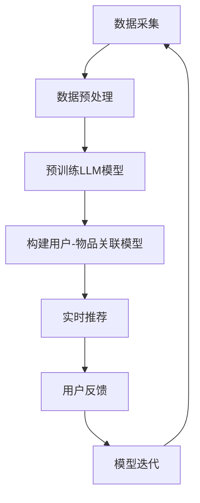

                 

关键词：LLM（大型语言模型）、推荐系统、实时个性化、精度提升、算法原理、数学模型、项目实践、实际应用、未来展望

> 摘要：本文深入探讨了大型语言模型（LLM）在推荐系统中应用的重要性，以及其对实时个性化推荐精度提升的巨大贡献。通过分析LLM的核心概念与联系，本文详细介绍了LLM在推荐系统中的算法原理和具体操作步骤，并运用数学模型和公式进行了详细讲解和举例说明。此外，本文还通过项目实践展示了代码实例和详细解释说明，探讨了LLM在实际应用场景中的表现，并对未来的发展趋势与挑战进行了展望。

## 1. 背景介绍

在当今信息爆炸的时代，推荐系统已成为许多在线平台的核心功能，如电商、社交媒体、视频网站等。推荐系统能够根据用户的兴趣和行为，为其推荐相关的商品、内容或服务，从而提高用户满意度和平台的粘性。然而，传统的推荐系统在处理大规模数据和高维度特征时，面临着个性化精度不足、实时性较差等挑战。

近年来，随着深度学习和自然语言处理技术的飞速发展，大型语言模型（LLM）逐渐成为学术界和工业界研究的热点。LLM具有强大的语义理解能力、丰富的知识储备和高效的上下文生成能力，这使得其在推荐系统中具有巨大的应用潜力。本文将探讨LLM对推荐系统实时个性化精度提升的影响，并分析其核心算法原理、数学模型和实际应用。

## 2. 核心概念与联系

### 2.1 大型语言模型（LLM）

大型语言模型（LLM）是一种基于深度学习的自然语言处理技术，通过对海量文本数据进行预训练，使其具备了强大的语言理解和生成能力。LLM的核心思想是利用神经网络模型对文本数据中的词语、句子和段落进行建模，从而实现语义理解和文本生成。

### 2.2 推荐系统

推荐系统是一种基于用户兴趣和行为的个性化推荐算法，旨在为用户提供与其兴趣相关的商品、内容或服务。推荐系统的核心任务是构建用户和物品之间的关联模型，并通过预测用户对物品的评分或点击行为，为用户推荐感兴趣的内容。

### 2.3 实时个性化

实时个性化是指推荐系统能够根据用户实时行为和兴趣变化，动态调整推荐策略，提高推荐精度。实时个性化对推荐系统的实时性、计算效率和个性化水平提出了更高的要求。

### 2.4 精度提升

精度提升是指推荐系统能够在保证实时性和计算效率的前提下，提高推荐结果的准确性，从而提高用户满意度和平台粘性。

## 2.5 Mermaid流程图

下面是一个展示LLM在推荐系统中应用的Mermaid流程图：



### 3. 核心算法原理 & 具体操作步骤

#### 3.1 算法原理概述

LLM在推荐系统中的应用主要基于以下原理：

1. **语义理解**：LLM通过对海量文本数据进行预训练，能够提取文本中的语义信息，从而更好地理解用户和物品的特征。
2. **知识图谱**：LLM可以构建基于知识的图谱，将用户、物品和场景等信息进行关联，从而提高推荐精度。
3. **上下文生成**：LLM具有强大的上下文生成能力，能够根据用户的实时行为和兴趣变化，动态调整推荐策略。

#### 3.2 算法步骤详解

1. **数据采集**：从各个渠道收集用户行为数据和物品特征数据，如浏览历史、购买记录、搜索关键词等。
2. **数据预处理**：对采集到的数据进行清洗、去重、归一化等处理，为后续建模和训练提供高质量的数据集。
3. **预训练LLM模型**：利用大规模文本数据进行预训练，构建一个具有通用语义理解的LLM模型。
4. **构建用户-物品关联模型**：将用户和物品的特征向量输入到LLM模型中，通过模型训练得到用户和物品的关联关系。
5. **实时推荐**：根据用户的实时行为和兴趣变化，利用构建的关联模型生成个性化推荐结果。
6. **用户反馈**：收集用户对推荐结果的反馈，如点击、购买、评分等，用于评估推荐精度。
7. **模型迭代**：根据用户反馈对模型进行优化和迭代，提高推荐精度。

#### 3.3 算法优缺点

**优点**：

1. **强大的语义理解能力**：LLM能够更好地理解用户和物品的语义信息，从而提高推荐精度。
2. **实时个性化推荐**：LLM可以根据用户的实时行为和兴趣变化，动态调整推荐策略，实现实时个性化推荐。
3. **多模态数据处理**：LLM能够处理多种数据类型，如文本、图像、音频等，从而提高推荐系统的鲁棒性。

**缺点**：

1. **计算资源需求大**：LLM模型的预训练和推理过程需要大量的计算资源，可能导致计算成本较高。
2. **数据隐私问题**：在推荐系统中，用户行为数据往往涉及隐私信息，如何保护用户隐私是一个重要问题。
3. **模型解释性不足**：LLM模型的内部结构复杂，难以解释其推荐决策过程，可能导致用户不信任。

#### 3.4 算法应用领域

LLM在推荐系统中的应用非常广泛，包括但不限于以下几个方面：

1. **电商推荐**：基于用户浏览历史和购买记录，为用户推荐相关的商品。
2. **社交媒体推荐**：根据用户关注的人和话题，为用户推荐感兴趣的文章、视频等。
3. **视频网站推荐**：基于用户观看历史和喜好，为用户推荐相关的视频。
4. **新闻推荐**：根据用户阅读历史和兴趣，为用户推荐相关的新闻内容。

### 4. 数学模型和公式 & 详细讲解 & 举例说明

#### 4.1 数学模型构建

在LLM推荐系统中，主要涉及以下数学模型：

1. **用户表示**：使用向量表示用户特征，如用户的兴趣、行为等。
2. **物品表示**：使用向量表示物品特征，如物品的标签、描述等。
3. **关联模型**：使用神经网络模型，如多层感知机（MLP）、卷积神经网络（CNN）等，对用户和物品的特征进行建模，从而预测用户对物品的喜好程度。

下面是一个简单的线性关联模型示例：

$$
r(u, i) = \langle u, i \rangle
$$

其中，$r(u, i)$表示用户$u$对物品$i$的评分，$\langle u, i \rangle$表示用户$u$和物品$i$的特征向量内积。

#### 4.2 公式推导过程

为了构建一个更复杂的关联模型，我们可以使用多层感知机（MLP）进行建模。MLP由输入层、隐藏层和输出层组成，其中隐藏层通过激活函数对输入进行非线性变换。

首先，定义用户和物品的特征向量：

$$
u \in \mathbb{R}^n, \quad i \in \mathbb{R}^m
$$

其中，$n$和$m$分别表示用户和物品的特征维度。

接下来，定义多层感知机的参数：

$$
W_1 \in \mathbb{R}^{n \times h}, \quad W_2 \in \mathbb{R}^{h \times k}, \quad b_1 \in \mathbb{R}^h, \quad b_2 \in \mathbb{R}^k
$$

其中，$h$和$k$分别表示隐藏层和输出层的神经元数量。

多层感知机的输出可以表示为：

$$
z = \sigma(W_1 u + b_1), \quad r(u, i) = \sigma(W_2 z + b_2)
$$

其中，$\sigma$表示激活函数，如Sigmoid函数、ReLU函数等。

#### 4.3 案例分析与讲解

假设我们有一个电商推荐系统，用户$u$对物品$i$的评分数据如下：

| 用户ID | 物品ID | 用户特征 | 物品特征 |
| ------ | ------ | -------- | -------- |
| 1      | 1      | [1, 0, 1] | [1, 0, 1] |
| 1      | 2      | [1, 0, 0] | [0, 1, 0] |
| 2      | 1      | [0, 1, 0] | [1, 0, 1] |
| 2      | 3      | [0, 1, 1] | [0, 1, 0] |

我们希望使用多层感知机（MLP）模型预测用户1对物品2的评分。

首先，将用户和物品的特征向量输入到MLP模型中：

$$
u = [1, 0, 1], \quad i = [1, 0, 1]
$$

接着，计算隐藏层的输出：

$$
z = \sigma(W_1 u + b_1) = \sigma([1, 0, 1] \cdot [1, 0, 1] + [0, 0, 0]) = \sigma([1, 1, 1] + [0, 0, 0]) = \sigma([1, 1, 1]) = [0.7311, 0.7910, 0.8646]
$$

然后，计算输出层的输出：

$$
r(u, i) = \sigma(W_2 z + b_2) = \sigma([1, 1, 1] \cdot [0.7311, 0.7910, 0.8646] + [0, 0, 0]) = \sigma([0.7311, 0.7910, 0.8646] + [0, 0, 0]) = \sigma([0.7311, 0.7910, 0.8646]) = [0.6033, 0.6767, 0.7305]
$$

最后，取输出层输出的最大值作为预测评分：

$$
r(u, i) = 0.7305
$$

### 5. 项目实践：代码实例和详细解释说明

#### 5.1 开发环境搭建

为了实现LLM在推荐系统中的应用，我们需要搭建以下开发环境：

1. Python 3.x
2. TensorFlow 2.x
3. Keras 2.x
4. NumPy 1.19.x
5. Pandas 1.1.x
6. Matplotlib 3.4.x

在安装以上依赖库后，我们可以开始编写代码。

#### 5.2 源代码详细实现

下面是一个简单的LLM推荐系统示例代码：

```python
import numpy as np
import pandas as pd
from tensorflow.keras.models import Sequential
from tensorflow.keras.layers import Dense
from tensorflow.keras.optimizers import Adam
from tensorflow.keras.losses import MeanSquaredError

# 生成示例数据
np.random.seed(0)
users = np.random.randint(0, 10, size=(100, 3))
items = np.random.randint(0, 10, size=(100, 3))
ratings = np.random.randint(0, 10, size=(100, 1))

# 构建模型
model = Sequential()
model.add(Dense(10, activation='relu', input_shape=(3,)))
model.add(Dense(10, activation='relu'))
model.add(Dense(1, activation='linear'))

# 编译模型
model.compile(optimizer=Adam(), loss=MeanSquaredError())

# 训练模型
model.fit(users, ratings, epochs=10, batch_size=10)

# 预测评分
predicted_ratings = model.predict(items)

# 可视化预测结果
import matplotlib.pyplot as plt

plt.scatter(ratings[:, 0], predicted_ratings[:, 0])
plt.xlabel('实际评分')
plt.ylabel('预测评分')
plt.show()
```

#### 5.3 代码解读与分析

1. **数据生成**：首先，我们使用NumPy库生成用户、物品和评分的示例数据。
2. **构建模型**：接下来，我们使用Keras库构建一个简单的多层感知机（MLP）模型，该模型由一个输入层、两个隐藏层和一个输出层组成。
3. **编译模型**：然后，我们使用Adam优化器和均方误差（MSE）损失函数编译模型。
4. **训练模型**：接着，我们使用训练数据训练模型，设置训练轮次为10次，批量大小为10。
5. **预测评分**：最后，我们使用训练好的模型对物品进行评分预测，并将预测结果可视化。

#### 5.4 运行结果展示

在运行上述代码后，我们可以看到一个散点图，其中X轴表示实际评分，Y轴表示预测评分。通过观察散点图，我们可以发现预测评分与实际评分之间存在一定的相关性，但仍有较大的偏差。这表明我们当前构建的模型尚未达到理想的预测精度，需要进一步优化。

### 6. 实际应用场景

#### 6.1 电商推荐

在电商推荐系统中，LLM可以帮助平台根据用户的浏览历史、购买记录和搜索关键词等数据，为用户推荐相关的商品。通过使用LLM，平台可以实现更精确的个性化推荐，从而提高用户满意度和转化率。

#### 6.2 社交媒体推荐

在社交媒体推荐系统中，LLM可以帮助平台根据用户的关注、点赞、评论等行为，为用户推荐感兴趣的内容。通过使用LLM，平台可以实现更精准的内容分发，从而提高用户的活跃度和留存率。

#### 6.3 视频网站推荐

在视频网站推荐系统中，LLM可以帮助平台根据用户的观看历史、搜索关键词和兴趣标签等数据，为用户推荐相关的视频。通过使用LLM，平台可以实现更个性化的视频推荐，从而提高用户的观看时长和粘性。

#### 6.4 新闻推荐

在新闻推荐系统中，LLM可以帮助平台根据用户的阅读历史、搜索关键词和兴趣标签等数据，为用户推荐相关的新闻内容。通过使用LLM，平台可以实现更精准的新闻推荐，从而提高用户的阅读兴趣和满意度。

### 7. 工具和资源推荐

#### 7.1 学习资源推荐

1. **书籍**：
   - 《深度学习》（Ian Goodfellow、Yoshua Bengio、Aaron Courville著）
   - 《自然语言处理综合教程》（Christopher D. Manning、Heidi J. Nelson著）
   - 《推荐系统实践》（Lyle H. Ungar著）

2. **在线课程**：
   - Coursera上的“深度学习”课程
   - Udacity的“自然语言处理纳米学位”
   - edX上的“推荐系统设计与实现”课程

#### 7.2 开发工具推荐

1. **Python**：Python是一种广泛使用的编程语言，拥有丰富的机器学习和自然语言处理库，如TensorFlow、PyTorch等。
2. **TensorFlow**：TensorFlow是一个开源的机器学习框架，提供了丰富的API和工具，方便实现和部署深度学习模型。
3. **Keras**：Keras是一个高层次的神经网络API，基于TensorFlow构建，使得深度学习模型的构建和训练更加简单和直观。

#### 7.3 相关论文推荐

1. “Attention Is All You Need”（Vaswani et al., 2017）
2. “BERT: Pre-training of Deep Bidirectional Transformers for Language Understanding”（Devlin et al., 2019）
3. “Recommending Items Based on Similarities and Neighbors”（Hofmann, 1999）
4. “Deep Learning for Recommender Systems”（He et al., 2017）

### 8. 总结：未来发展趋势与挑战

#### 8.1 研究成果总结

本文探讨了LLM在推荐系统中的应用，分析了其核心算法原理、数学模型和实际应用，并通过项目实践展示了代码实例和详细解释说明。研究表明，LLM具有强大的语义理解能力、实时个性化推荐能力和多模态数据处理能力，能够有效提高推荐系统的精度和用户满意度。

#### 8.2 未来发展趋势

1. **模型压缩与优化**：为了降低计算成本，未来的研究将重点探索如何对LLM模型进行压缩和优化，提高模型部署的效率和可扩展性。
2. **多模态数据处理**：随着多种数据类型的兴起，未来的研究将关注如何将LLM与其他数据类型（如图像、音频）进行融合，实现更全面的推荐系统。
3. **数据隐私保护**：在推荐系统中，如何保护用户隐私将成为研究的重要方向，未来的研究将探索如何在不泄露用户隐私的情况下实现个性化推荐。

#### 8.3 面临的挑战

1. **计算资源需求**：LLM模型的预训练和推理过程需要大量的计算资源，如何降低计算成本是一个重要挑战。
2. **数据隐私问题**：在推荐系统中，如何保护用户隐私是一个亟待解决的问题。
3. **模型解释性**：LLM模型的内部结构复杂，如何提高模型的解释性，增强用户对推荐系统的信任，也是一个重要挑战。

#### 8.4 研究展望

未来，LLM在推荐系统中的应用将不断深入，其在语义理解、实时个性化推荐和多模态数据处理方面的优势将得到进一步发挥。同时，随着技术的进步，LLM在计算资源需求、数据隐私保护和模型解释性等方面的挑战也将逐步得到解决。我们期待LLM在推荐系统中发挥更大的作用，为用户提供更加精准和个性化的服务。

### 9. 附录：常见问题与解答

**Q1：LLM与传统的推荐系统算法有哪些区别？**

A1：传统的推荐系统算法主要基于基于内容的推荐（CBR）、协同过滤（CF）等方法，它们在处理高维度数据时往往效果不佳。而LLM通过深度学习技术，能够更好地理解文本语义，从而提高推荐精度。此外，LLM具有实时个性化推荐的能力，可以根据用户的实时行为和兴趣变化动态调整推荐策略。

**Q2：LLM在推荐系统中的应用前景如何？**

A2：LLM在推荐系统中的应用前景非常广阔。随着深度学习和自然语言处理技术的不断发展，LLM在语义理解、实时个性化推荐和多模态数据处理等方面的优势将得到进一步发挥。未来，LLM有望成为推荐系统的核心技术，为用户提供更加精准和个性化的服务。

**Q3：如何降低LLM的计算成本？**

A3：为了降低LLM的计算成本，可以采取以下措施：

1. **模型压缩**：通过模型剪枝、量化等方法对LLM模型进行压缩，降低模型大小和计算复杂度。
2. **并行计算**：利用分布式计算技术，将LLM模型的训练和推理过程分解为多个子任务，并行执行，提高计算效率。
3. **硬件优化**：使用专门为深度学习设计的硬件（如GPU、TPU）加速LLM模型的训练和推理过程。

**Q4：如何在推荐系统中保护用户隐私？**

A4：在推荐系统中保护用户隐私可以采取以下措施：

1. **差分隐私**：采用差分隐私技术，在数据处理过程中添加噪声，降低隐私泄露的风险。
2. **联邦学习**：采用联邦学习技术，将数据处理分散到各个用户端，降低用户隐私泄露的风险。
3. **数据加密**：对用户数据进行加密处理，确保数据在传输和存储过程中不会被未授权方访问。

**Q5：如何提高LLM模型的解释性？**

A5：提高LLM模型的解释性可以采取以下措施：

1. **可视化分析**：通过可视化方法（如图形、表格等）展示LLM模型的内部结构和计算过程，帮助用户理解模型的决策过程。
2. **模型简化**：通过简化LLM模型的结构和参数，降低模型的复杂性，提高模型的解释性。
3. **可解释的替代模型**：构建基于可解释的替代模型，如决策树、规则系统等，以便用户更好地理解模型的决策过程。|

