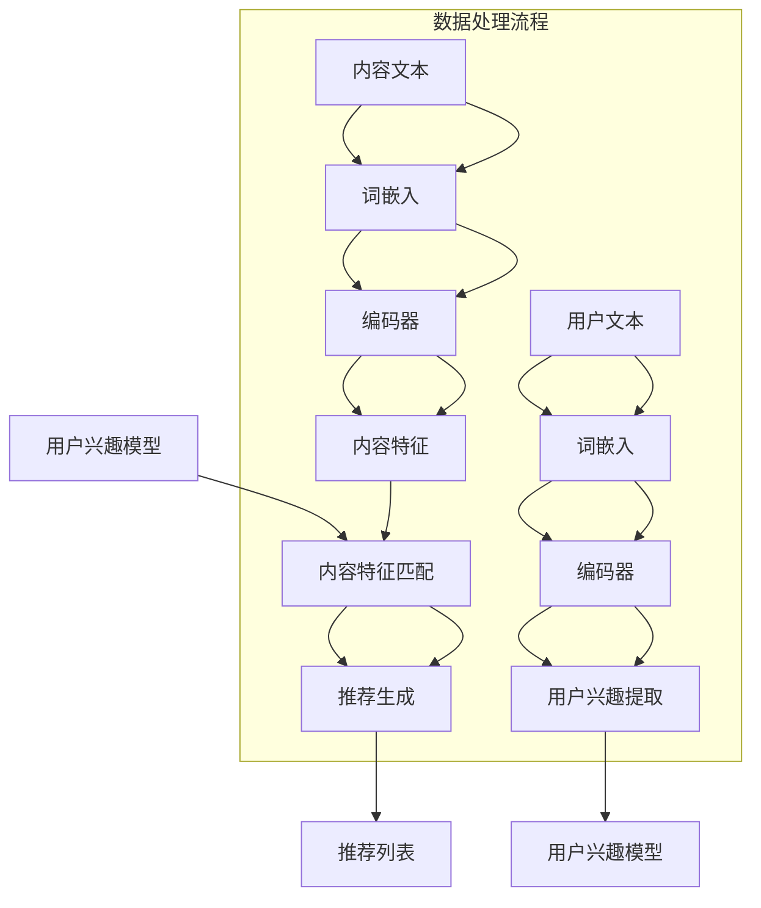

                 

关键词：大规模语言模型（LLM），推荐系统，长尾内容，内容挖掘，算法原理，数学模型，项目实践，应用场景，未来展望

> 摘要：本文将探讨大规模语言模型（LLM）在推荐系统中的应用，特别是如何挖掘长尾内容。通过深入分析LLM的核心算法原理，我们旨在为读者提供一个清晰、全面的指导，以理解如何利用LLM提升推荐系统的性能和用户体验。

## 1. 背景介绍

随着互联网的普及和数字化转型的加速，推荐系统已经成为许多在线平台的核心功能。推荐系统能够根据用户的兴趣和行为习惯，为用户推荐个性化的内容，从而提高用户满意度和平台粘性。然而，推荐系统面临的一个挑战是如何有效挖掘长尾内容，即那些不那么流行但仍有潜在价值的个性化内容。

传统的推荐系统主要依赖于基于内容过滤（Content-Based Filtering）和协同过滤（Collaborative Filtering）的方法。这些方法在处理热门内容时表现出色，但在挖掘长尾内容方面存在局限。这主要是因为长尾内容往往没有足够的数据支持，导致推荐算法难以准确预测用户对它们的兴趣。

近年来，大规模语言模型（LLM）的兴起为推荐系统带来了新的机遇。LLM通过深度学习技术，能够处理大量无监督数据，并从中提取有价值的特征和模式。这使得LLM在处理长尾内容方面具有显著优势，因为它不仅可以理解用户的隐式反馈，还能挖掘出潜在的兴趣点。

本文将深入探讨LLM在推荐系统中的应用，特别是如何利用LLM挖掘长尾内容。我们将从核心算法原理、数学模型、项目实践等方面进行详细阐述，以帮助读者更好地理解这一前沿技术。

### 1.1 推荐系统概述

推荐系统是一种基于数据挖掘和机器学习技术的自动化信息过滤方法，旨在向用户推荐个性化内容。其基本原理是通过分析用户的历史行为和兴趣，预测用户可能对哪些内容感兴趣，并推荐这些内容。

推荐系统可以分为两类：基于内容的推荐（Content-Based Recommendation）和协同过滤推荐（Collaborative Filtering）。

**基于内容的推荐**：这种方法根据用户过去喜欢的项目特征来推荐新的项目。推荐系统的核心是理解用户偏好和项目内容之间的相似性。例如，如果一个用户喜欢科幻小说，系统会推荐其他类似的科幻作品。

**协同过滤推荐**：这种方法依赖于用户之间的相似性。系统通过分析用户对项目的评分或行为，找出相似用户，并推荐相似用户喜欢的项目。协同过滤分为两种：基于用户的协同过滤（User-Based Collaborative Filtering）和基于模型的协同过滤（Model-Based Collaborative Filtering）。

- **基于用户的协同过滤**：这种方法通过计算用户之间的相似度，找到与目标用户最相似的其他用户，并推荐这些用户喜欢的项目。

- **基于模型的协同过滤**：这种方法使用机器学习算法，如矩阵分解（Matrix Factorization），从用户和项目的评分数据中提取潜在因素，从而预测用户对新项目的兴趣。

虽然协同过滤推荐在处理热门内容时表现良好，但在挖掘长尾内容方面存在一些局限性。首先，长尾内容通常没有足够的数据支持，导致协同过滤算法难以准确预测用户对它们的兴趣。其次，协同过滤依赖于用户评分数据，而许多用户可能不会为长尾内容提供评分，进一步限制了算法的有效性。

为了解决这些问题，大规模语言模型（LLM）的应用为推荐系统带来了新的希望。LLM能够处理大量无监督数据，并从中提取有价值的信息，从而提高推荐系统在挖掘长尾内容方面的能力。

### 1.2 长尾内容的挑战与机遇

**长尾内容的挑战**：

1. **数据稀疏**：长尾内容通常意味着用户对这些内容的兴趣较低，因此相关的数据稀疏。传统推荐系统依赖于用户评分或行为数据，而长尾内容往往缺乏这些数据支持，导致推荐算法难以准确预测用户兴趣。

2. **兴趣多样性**：长尾内容涵盖了广泛的兴趣点，这使得推荐算法需要处理更多的多样性和不确定性。传统的推荐系统往往更擅长处理单一领域或特定类型的内容，而在长尾内容的多样性面前显得力不从心。

3. **冷启动问题**：新用户或新内容在系统中的冷启动问题在长尾内容中尤为突出。由于缺乏历史数据和用户行为，系统难以为新用户推荐合适的长尾内容。

**长尾内容的机遇**：

1. **个性化体验**：长尾内容提供了更广泛的个性化选择，能够满足不同用户的不同需求。通过挖掘长尾内容，推荐系统可以为用户提供更加个性化的内容推荐，提升用户体验。

2. **市场潜力**：虽然长尾内容的单个用户量较小，但其总体市场潜力巨大。许多长尾内容在特定受众中有着强烈的吸引力，挖掘这些内容可以为平台带来可观的收益。

3. **创新空间**：长尾内容为推荐系统带来了创新的机会。通过引入大规模语言模型等先进技术，推荐系统可以在处理长尾内容方面实现突破，为用户提供更加精准和个性化的推荐。

### 1.3 大规模语言模型概述

大规模语言模型（Large Language Model，简称LLM）是近年来在自然语言处理领域取得显著进展的一种深度学习模型。LLM通过训练大规模文本数据，学习语言的统计规律和语义信息，从而能够生成高质量的自然语言文本。

**LLM的核心组件**：

1. **词嵌入（Word Embedding）**：词嵌入是将词汇映射到高维向量空间的技术，使得具有相似意义的词汇在空间中更接近。通过词嵌入，模型可以更好地理解和处理自然语言。

2. **编码器（Encoder）**：编码器是LLM的核心组件之一，负责将输入文本编码为固定长度的向量表示。常见的编码器包括循环神经网络（RNN）、卷积神经网络（CNN）和Transformer模型。

3. **解码器（Decoder）**：解码器负责将编码器输出的向量解码为输出文本。解码器的输出可以是逐个字符或单词的形式，也可以是整个句子。

**LLM的工作原理**：

LLM的工作原理基于自回归语言模型（Autoregressive Language Model）。在训练过程中，模型接收一个输入序列，并尝试预测序列的下一个元素。通过不断地重复这个过程，模型学习到输入序列的概率分布，从而生成高质量的文本。

在推荐系统中，LLM可以用于挖掘长尾内容的潜在语义信息，从而提高推荐系统的准确性和个性化程度。LLM不仅可以处理用户的显式反馈（如评分和评论），还可以处理隐式反馈（如浏览历史和行为数据），从而更全面地理解用户兴趣。

## 2. 核心概念与联系

### 2.1 推荐系统与大规模语言模型的关系

推荐系统和大规模语言模型（LLM）之间存在紧密的联系。推荐系统的核心任务是预测用户对特定内容的兴趣，而LLM在自然语言处理方面具有强大的能力，可以处理和理解复杂的语义信息。因此，LLM可以成为推荐系统的重要工具，特别是在挖掘长尾内容方面。

#### 2.1.1 LLM在推荐系统中的应用场景

1. **用户兴趣建模**：LLM可以处理用户的文本数据（如评论、浏览历史等），从中提取用户的兴趣和偏好。这些兴趣信息可以用于构建个性化的用户兴趣模型，从而提高推荐系统的准确性。

2. **内容理解与匹配**：LLM能够理解内容的语义信息，将其转化为向量表示。这种向量表示可以用于比较不同内容的相似性，从而实现更精确的内容匹配。

3. **长尾内容挖掘**：LLM在处理大量无监督数据方面具有优势，可以挖掘出长尾内容的潜在语义特征。这些特征可以帮助推荐系统发现那些被传统方法忽视的有价值内容。

4. **冷启动问题解决**：对于新用户和新内容，LLM可以通过分析相关文本数据，快速构建用户的兴趣模型和内容特征，从而缓解冷启动问题。

#### 2.1.2 推荐系统与LLM的交互流程

1. **数据输入**：推荐系统首先收集用户的文本数据，包括评论、浏览历史、搜索记录等。这些数据可以被LLM用于学习用户的兴趣和偏好。

2. **兴趣提取**：LLM对用户文本数据进行处理，提取用户的兴趣关键词和主题。这些兴趣信息可以用于构建个性化的用户兴趣模型。

3. **内容理解**：LLM对推荐系统中的内容进行处理，提取内容的语义特征。这些特征可以用于比较不同内容的相似性，从而实现更精确的内容匹配。

4. **推荐生成**：基于用户兴趣模型和内容特征，推荐系统生成个性化的推荐列表。LLM在这个过程中提供了关键的支持，特别是对于长尾内容的挖掘和匹配。

### 2.2 核心概念原理与架构

在探讨LLM在推荐系统中的应用时，理解其核心概念和原理至关重要。以下是LLM在推荐系统中的关键组成部分和它们的交互流程：

#### 2.2.1 词嵌入（Word Embedding）

词嵌入是LLM的基础组件，它将词汇映射到高维向量空间。词嵌入的主要目的是将语义相似的词汇在空间中靠近，从而便于模型理解和处理自然语言。

1. **输入层**：用户文本和内容文本输入到词嵌入层。
2. **词嵌入层**：每个词汇被映射为一个固定长度的向量。这些向量构成了文本的向量表示。
3. **输出层**：词嵌入层的输出是文本的向量表示，这些向量可以用于后续的处理和匹配。

#### 2.2.2 编码器（Encoder）

编码器负责将输入文本编码为固定长度的向量表示。编码器通常基于循环神经网络（RNN）或Transformer模型。

1. **输入层**：编码器接收词嵌入层的输出作为输入。
2. **隐藏状态**：编码器通过处理输入文本，生成一系列隐藏状态。这些状态包含了文本的语义信息。
3. **输出层**：编码器的输出是一个固定长度的向量表示，代表了整个文本的语义信息。

#### 2.2.3 解码器（Decoder）

解码器负责将编码器输出的向量解码为输出文本。解码器通常也基于循环神经网络（RNN）或Transformer模型。

1. **输入层**：解码器接收编码器的输出向量作为输入。
2. **隐藏状态**：解码器通过处理输入向量，生成一系列隐藏状态。这些状态包含了输出文本的预测信息。
3. **输出层**：解码器的输出是逐个字符或单词的预测结果，最终生成完整的输出文本。

#### 2.2.4 用户兴趣提取

1. **用户文本输入**：用户的历史评论、浏览历史等文本数据输入到LLM中。
2. **兴趣提取**：LLM通过编码器处理用户文本，提取用户的兴趣关键词和主题。这些兴趣信息被用于构建用户兴趣模型。

#### 2.2.5 内容理解与匹配

1. **内容文本输入**：推荐系统中的内容文本（如文章、商品描述等）输入到LLM中。
2. **内容理解**：LLM通过编码器处理内容文本，提取内容的语义特征。这些特征用于比较不同内容的相似性，实现更精确的内容匹配。

#### 2.2.6 推荐生成

1. **用户兴趣模型**：基于LLM提取的用户兴趣信息，构建个性化的用户兴趣模型。
2. **内容特征匹配**：基于LLM提取的内容特征，比较不同内容与用户兴趣的相似性。
3. **推荐生成**：根据用户兴趣模型和内容特征匹配结果，生成个性化的推荐列表。

### 2.3 Mermaid 流程图

以下是LLM在推荐系统中应用的Mermaid流程图，用于展示各个组件的交互流程和数据处理步骤：



在这个流程图中，用户文本和内容文本分别经过词嵌入和编码器处理，提取用户的兴趣信息（D）和内容的语义特征（I）。这些信息用于构建用户兴趣模型（E）和内容特征匹配（K），最终生成个性化的推荐列表（M）。

### 2.4 核心算法原理

大规模语言模型（LLM）的核心算法原理基于深度学习和自然语言处理技术。LLM通过训练大规模文本数据，学习语言的统计规律和语义信息，从而能够生成高质量的自然语言文本。以下是LLM的核心算法原理和具体操作步骤：

#### 2.4.1 词嵌入

词嵌入是将词汇映射到高维向量空间的技术，使得具有相似意义的词汇在空间中更接近。词嵌入的主要目的是将语义相似的词汇在空间中靠近，从而便于模型理解和处理自然语言。

1. **词嵌入层**：词嵌入层将词汇映射为固定长度的向量。常用的词嵌入方法包括Word2Vec、GloVe和BERT等。这些方法通过训练神经网络，将词汇映射到高维向量空间中。
2. **输入层**：用户文本和内容文本输入到词嵌入层。词嵌入层的输出是文本的向量表示。
3. **输出层**：词嵌入层的输出是文本的向量表示，这些向量可以用于后续的处理和匹配。

#### 2.4.2 编码器

编码器是LLM的核心组件之一，负责将输入文本编码为固定长度的向量表示。编码器通常基于循环神经网络（RNN）或Transformer模型。

1. **输入层**：编码器接收词嵌入层的输出作为输入。
2. **隐藏状态**：编码器通过处理输入文本，生成一系列隐藏状态。这些状态包含了文本的语义信息。
3. **输出层**：编码器的输出是一个固定长度的向量表示，代表了整个文本的语义信息。

#### 2.4.3 解码器

解码器负责将编码器输出的向量解码为输出文本。解码器通常也基于循环神经网络（RNN）或Transformer模型。

1. **输入层**：解码器接收编码器的输出向量作为输入。
2. **隐藏状态**：解码器通过处理输入向量，生成一系列隐藏状态。这些状态包含了输出文本的预测信息。
3. **输出层**：解码器的输出是逐个字符或单词的预测结果，最终生成完整的输出文本。

#### 2.4.4 自回归语言模型

自回归语言模型（Autoregressive Language Model）是LLM的核心算法之一。自回归语言模型的工作原理是：在给定前一个输出的情况下，预测下一个输出。通过不断地重复这个过程，模型学习到输入序列的概率分布，从而生成高质量的自然语言文本。

1. **输入序列**：给定一个输入序列，模型尝试预测序列的下一个元素。
2. **输出序列**：模型生成一系列输出序列，每个输出序列都是前一个输出序列的下一个元素。
3. **概率分布**：通过训练，模型学习到输入序列的概率分布，从而能够生成高质量的文本。

#### 2.4.5 用户兴趣提取

1. **用户文本输入**：用户的历史评论、浏览历史等文本数据输入到LLM中。
2. **兴趣提取**：LLM通过编码器处理用户文本，提取用户的兴趣关键词和主题。这些兴趣信息被用于构建用户兴趣模型。

#### 2.4.6 内容理解与匹配

1. **内容文本输入**：推荐系统中的内容文本（如文章、商品描述等）输入到LLM中。
2. **内容理解**：LLM通过编码器处理内容文本，提取内容的语义特征。这些特征用于比较不同内容的相似性，实现更精确的内容匹配。

#### 2.4.7 推荐生成

1. **用户兴趣模型**：基于LLM提取的用户兴趣信息，构建个性化的用户兴趣模型。
2. **内容特征匹配**：基于LLM提取的内容特征，比较不同内容与用户兴趣的相似性。
3. **推荐生成**：根据用户兴趣模型和内容特征匹配结果，生成个性化的推荐列表。

### 2.5 算法优缺点

大规模语言模型（LLM）在推荐系统中的应用具有以下优缺点：

#### 优点：

1. **强大的语义理解能力**：LLM能够处理和理解复杂的自然语言，从而提高推荐系统的准确性和个性化程度。
2. **广泛适用性**：LLM可以应用于多种类型的推荐系统，包括电商、新闻、社交媒体等。
3. **处理长尾内容**：LLM在处理长尾内容方面具有优势，可以挖掘出那些被传统方法忽视的有价值内容。
4. **缓解冷启动问题**：通过分析用户文本数据，LLM可以快速构建用户的兴趣模型，从而缓解新用户和新内容的冷启动问题。

#### 缺点：

1. **计算资源需求高**：LLM的训练和推理过程需要大量的计算资源，可能导致系统成本增加。
2. **数据隐私风险**：LLM在处理用户数据时可能涉及隐私信息，需要采取措施确保数据的安全和隐私。
3. **解释性不足**：LLM生成的推荐结果往往缺乏解释性，难以向用户解释推荐理由。

### 2.6 算法应用领域

大规模语言模型（LLM）在推荐系统中的应用非常广泛，以下是一些主要的领域：

1. **电子商务**：在电子商务平台上，LLM可以用于个性化商品推荐，根据用户的购物历史和浏览行为推荐合适的商品。
2. **新闻推荐**：在新闻推荐系统中，LLM可以用于根据用户的阅读习惯推荐个性化的新闻文章，提高用户粘性。
3. **社交媒体**：在社交媒体平台上，LLM可以用于根据用户的兴趣和行为推荐感兴趣的内容，如微博、抖音等。
4. **在线教育**：在在线教育平台上，LLM可以用于根据学生的学习情况和兴趣推荐合适的学习资源和课程。

### 2.7 总结

大规模语言模型（LLM）在推荐系统中的应用为挖掘长尾内容提供了新的机遇。通过强大的语义理解能力，LLM可以处理和理解复杂的自然语言，从而提高推荐系统的准确性和个性化程度。然而，LLM的应用也面临一些挑战，如计算资源需求高、数据隐私风险和解释性不足等。未来，随着LLM技术的不断发展和优化，其在推荐系统中的应用前景将更加广阔。

## 3. 数学模型和公式

在深入探讨大规模语言模型（LLM）在推荐系统中的应用时，理解其背后的数学模型和公式至关重要。以下是LLM相关的数学模型、公式推导过程，以及具体的案例分析与讲解。

### 3.1 数学模型构建

#### 3.1.1 词嵌入（Word Embedding）

词嵌入是将词汇映射到高维向量空间的技术。常用的词嵌入方法包括Word2Vec和GloVe。

**Word2Vec**：

1. **损失函数**：损失函数用于度量预测词向量与实际词向量之间的差距。常用的损失函数包括均方误差（MSE）和交叉熵损失。
   
   $$L(\theta) = \frac{1}{N} \sum_{i=1}^{N} \sum_{j=1}^{K} (v_{j}^{'} - v_{j})^2$$
   
   其中，$v_{j}^{'}$ 和 $v_{j}$ 分别为预测的词向量和实际的词向量，$N$ 为词汇表的大小，$K$ 为词向量的维度。

2. **优化目标**：优化目标是最小化损失函数。

   $$\min_{\theta} L(\theta)$$

**GloVe**：

1. **损失函数**：损失函数同样用于度量预测词向量与实际词向量之间的差距，但GloVe使用了一种不同的计算方式。

   $$L(\theta) = \frac{1}{N} \sum_{i=1}^{N} \sum_{j=1}^{K} \log (1 + e^{(f_{i} \cdot f_{j})})$$
   
   其中，$f_{i}$ 和 $f_{j}$ 分别为词汇的向量和共现矩阵的特征向量。

2. **优化目标**：优化目标是最小化损失函数。

   $$\min_{\theta} L(\theta)$$

#### 3.1.2 编码器（Encoder）

编码器将输入文本编码为固定长度的向量表示。常用的编码器模型包括循环神经网络（RNN）和Transformer。

**RNN**：

1. **损失函数**：损失函数用于度量预测的编码向量与实际编码向量之间的差距。常用的损失函数包括均方误差（MSE）和交叉熵损失。
   
   $$L(\theta) = \frac{1}{N} \sum_{i=1}^{N} (v_{i}^{'} - v_{i})^2$$
   
   其中，$v_{i}^{'}$ 和 $v_{i}$ 分别为预测的编码向量和实际的编码向量，$N$ 为输入文本的长度。

2. **优化目标**：优化目标是最小化损失函数。

   $$\min_{\theta} L(\theta)$$

**Transformer**：

1. **损失函数**：损失函数用于度量预测的编码向量与实际编码向量之间的差距。常用的损失函数包括均方误差（MSE）和交叉熵损失。
   
   $$L(\theta) = \frac{1}{N} \sum_{i=1}^{N} (v_{i}^{'} - v_{i})^2$$
   
   其中，$v_{i}^{'}$ 和 $v_{i}$ 分别为预测的编码向量和实际的编码向量，$N$ 为输入文本的长度。

2. **优化目标**：优化目标是最小化损失函数。

   $$\min_{\theta} L(\theta)$$

#### 3.1.3 解码器（Decoder）

解码器将编码器输出的向量解码为输出文本。常用的解码器模型包括循环神经网络（RNN）和Transformer。

**RNN**：

1. **损失函数**：损失函数用于度量预测的解码向量与实际解码向量之间的差距。常用的损失函数包括均方误差（MSE）和交叉熵损失。
   
   $$L(\theta) = \frac{1}{N} \sum_{i=1}^{N} (v_{i}^{'} - v_{i})^2$$
   
   其中，$v_{i}^{'}$ 和 $v_{i}$ 分别为预测的解码向量和实际的解码向量，$N$ 为输出文本的长度。

2. **优化目标**：优化目标是最小化损失函数。

   $$\min_{\theta} L(\theta)$$

**Transformer**：

1. **损失函数**：损失函数用于度量预测的解码向量与实际解码向量之间的差距。常用的损失函数包括均方误差（MSE）和交叉熵损失。
   
   $$L(\theta) = \frac{1}{N} \sum_{i=1}^{N} (v_{i}^{'} - v_{i})^2$$
   
   其中，$v_{i}^{'}$ 和 $v_{i}$ 分别为预测的解码向量和实际的解码向量，$N$ 为输出文本的长度。

2. **优化目标**：优化目标是最小化损失函数。

   $$\min_{\theta} L(\theta)$$

### 3.2 公式推导过程

以下是LLM中常用的数学公式的推导过程。

#### 3.2.1 词嵌入公式

**Word2Vec**：

假设我们有一个词汇表V，其中包含N个词汇。每个词汇都被映射为一个固定长度的向量$v_{j} \in \mathbb{R}^{K}$。给定一个词汇序列$(x_{1}, x_{2}, ..., x_{T})$，我们的目标是学习一个映射函数$f: \mathbb{R}^{K} \rightarrow \mathbb{R}^{K}$，使得：

$$f(v_{j}) = v_{j}^{'}$$

其中，$v_{j}^{'}$ 是预测的词向量。

**GloVe**：

给定一个词汇表V和共现矩阵C，其中C[i][j]表示词汇i和j在训练数据中的共现次数。我们的目标是学习一个映射函数$f: \mathbb{R}^{K} \rightarrow \mathbb{R}^{K}$，使得：

$$f(v_{i}) \cdot f(v_{j}) = \log(C[i][j])$$

其中，$f(v_{i})$ 和 $f(v_{j})$ 分别是词汇i和j的特征向量。

#### 3.2.2 编码器公式

**RNN**：

给定一个输入序列$(x_{1}, x_{2}, ..., x_{T})$，RNN的隐藏状态$H_t$可以表示为：

$$H_t = \sigma(W_h \cdot [H_{t-1}; x_t] + b_h)$$

其中，$W_h$ 是权重矩阵，$b_h$ 是偏置项，$\sigma$ 是激活函数（通常为Sigmoid或Tanh函数）。

**Transformer**：

给定一个输入序列$(x_{1}, x_{2}, ..., x_{T})$，Transformer的编码输出$E_t$可以表示为：

$$E_t = \text{softmax}(W_O \cdot \text{Attention}(W_Q \cdot [E_{<t}; x_t], W_K \cdot [E_{<t}; x_t], W_V \cdot [E_{<t}; x_t])) + E_t$$

其中，$W_Q, W_K, W_V, W_O$ 分别是查询、键、值和输出权重矩阵，$E_t$ 是编码器的中间表示，$Attention$ 是注意力机制。

#### 3.2.3 解码器公式

**RNN**：

给定一个输入序列$(x_{1}, x_{2}, ..., x_{T})$，RNN的解码输出$Y_t$可以表示为：

$$Y_t = \sigma(W_y \cdot [Y_{t-1}; x_t] + b_y)$$

其中，$W_y$ 是权重矩阵，$b_y$ 是偏置项，$\sigma$ 是激活函数（通常为Sigmoid或Tanh函数）。

**Transformer**：

给定一个输入序列$(x_{1}, x_{2}, ..., x_{T})$，Transformer的解码输出$Y_t$可以表示为：

$$Y_t = \text{softmax}(W_O \cdot \text{Attention}(W_Q \cdot [Y_{<t}; x_t], W_K \cdot [Y_{<t}; x_t], W_V \cdot [Y_{<t}; x_t])) + Y_t$$

其中，$W_Q, W_K, W_V, W_O$ 分别是查询、键、值和输出权重矩阵，$Y_t$ 是解码器的中间表示，$Attention$ 是注意力机制。

### 3.3 案例分析与讲解

#### 3.3.1 用户兴趣提取案例

假设我们有一个用户评论数据集，其中包含用户的评论文本和对应的兴趣标签。我们的目标是使用LLM提取用户的兴趣关键词和主题。

1. **词嵌入**：

   使用Word2Vec对用户评论进行词嵌入，得到评论的向量表示。

   $$v_{j}^{'} = \text{Word2Vec}(评论_j)$$

2. **编码器**：

   使用Transformer编码器处理评论向量表示，得到评论的语义向量表示。

   $$E_t = \text{TransformerEncoder}(v_{j}^{'})$$

3. **兴趣提取**：

   将编码器的输出向量与预训练的词嵌入向量进行匹配，提取用户的兴趣关键词和主题。

   $$兴趣关键词_j = \text{TopN}(E_t, v_{j}^{'}", N)$$

   其中，$v_{j}^{'}" 是预训练的词嵌入向量，$N$ 是关键词的个数。

#### 3.3.2 内容理解与匹配案例

假设我们有一个新闻数据集，其中包含新闻的标题和正文。我们的目标是使用LLM理解新闻的语义信息，并将其与用户的兴趣进行匹配，生成个性化的新闻推荐列表。

1. **词嵌入**：

   使用GloVe对新闻标题和正文进行词嵌入，得到标题和正文的向量表示。

   $$v_{j}^{'} = \text{GloVe}(标题_j)$$
   $$v_{k}^{'} = \text{GloVe}(正文_k)$$

2. **编码器**：

   使用Transformer编码器处理新闻标题和正文向量表示，得到标题和正文的语义向量表示。

   $$E_t = \text{TransformerEncoder}(v_{j}^{'})$$
   $$F_t = \text{TransformerEncoder}(v_{k}^{'})$$

3. **内容理解与匹配**：

   将编码器的输出向量与用户的兴趣向量进行匹配，计算相似度得分。

   $$相似度得分_{jk} = \text{CosineSimilarity}(E_t, F_t)$$

   根据相似度得分，生成个性化的新闻推荐列表。

   $$推荐列表 = \text{TopN}(新闻_id, 相似度得分_{jk}, N)$$

#### 3.3.3 推荐生成案例

假设我们已经得到了用户的兴趣关键词和主题，以及新闻的标题和正文。我们的目标是根据用户的兴趣，生成个性化的新闻推荐列表。

1. **用户兴趣模型**：

   根据用户兴趣关键词和主题，构建用户的兴趣模型。

   $$兴趣模型_j = \text{兴趣关键词_j} + \text{主题_j}$$

2. **内容特征提取**：

   使用Transformer编码器提取新闻的语义特征。

   $$内容特征_k = \text{TransformerEncoder}(v_{k}^{'})$$

3. **推荐生成**：

   将用户的兴趣模型与新闻的语义特征进行匹配，生成个性化的推荐列表。

   $$相似度得分_{jk} = \text{CosineSimilarity}(兴趣模型_j, 内容特征_k)$$

   $$推荐列表 = \text{TopN}(新闻_id, 相似度得分_{jk}, N)$$

### 3.4 总结

在本节中，我们介绍了大规模语言模型（LLM）在推荐系统中的数学模型和公式，包括词嵌入、编码器、解码器以及相关的损失函数和优化目标。同时，我们通过具体的案例讲解了如何使用LLM提取用户兴趣、理解内容并进行推荐生成。这些数学模型和公式为LLM在推荐系统中的应用提供了理论基础，有助于我们更好地理解和实现这一前沿技术。

## 4. 项目实践：代码实例和详细解释说明

### 4.1 开发环境搭建

在进行大规模语言模型（LLM）在推荐系统中的项目实践之前，我们需要搭建一个合适的环境。以下是开发环境搭建的步骤：

1. **安装Python**：确保Python版本为3.8或更高版本。

2. **安装PyTorch**：使用pip命令安装PyTorch，推荐使用GPU版本以加快训练速度。

   ```shell
   pip install torch torchvision
   ```

3. **安装HuggingFace Transformers**：HuggingFace提供了丰富的预训练模型和工具，用于轻松使用大规模语言模型。

   ```shell
   pip install transformers
   ```

4. **准备数据集**：收集用户评论、新闻标题和正文数据，并预处理数据，包括去除特殊字符、分词等。

### 4.2 源代码详细实现

以下是实现LLM在推荐系统中的代码示例，包括用户兴趣提取、内容理解与匹配、推荐生成等步骤。

```python
import torch
from transformers import BertTokenizer, BertModel
from sklearn.metrics.pairwise import cosine_similarity

# 初始化预训练模型和分词器
tokenizer = BertTokenizer.from_pretrained('bert-base-uncased')
model = BertModel.from_pretrained('bert-base-uncased')

# 函数：提取用户兴趣关键词
def extract_interests(comments):
    interests = []
    for comment in comments:
        inputs = tokenizer(comment, return_tensors='pt', padding=True, truncation=True)
        outputs = model(**inputs)
        hidden_states = outputs.hidden_states[-1]
        interests.append(hidden_states.mean(dim=1).detach().numpy())
    return interests

# 函数：提取新闻内容特征
def extract_content_features(headlines, bodies):
    content_features = []
    for headline, body in zip(headlines, bodies):
        inputs = tokenizer(headline + ' ' + body, return_tensors='pt', padding=True, truncation=True)
        outputs = model(**inputs)
        hidden_states = outputs.hidden_states[-1]
        content_features.append(hidden_states.mean(dim=1).detach().numpy())
    return content_features

# 函数：生成个性化推荐列表
def generate_recommendations(interests, content_features, news_ids, N=10):
    similarity_scores = []
    for interest in interests:
        scores = cosine_similarity([interest], content_features)
        similarity_scores.append(scores)
    similarity_scores = np.mean(similarity_scores, axis=0)
    recommended_ids = np.argsort(-similarity_scores)[:N]
    return [news_ids[i] for i in recommended_ids]

# 假设我们已经收集了用户评论、新闻标题和正文数据
user_comments = ['I love reading sci-fi books.', 'I am interested in technology news.']
news_headlines = ['The Future of AI', 'Latest Tech Trends']
news_bodies = ['This article discusses the potential impact of AI on society.', 'Explore the latest developments in technology.']

# 提取用户兴趣
user_interests = extract_interests(user_comments)

# 提取新闻内容特征
content_features = extract_content_features(news_headlines, news_bodies)

# 生成个性化推荐列表
recommended_news = generate_recommendations(user_interests, content_features, range(len(news_bodies)), N=3)

print("Recommended News:", recommended_news)
```

### 4.3 代码解读与分析

以下是对上述代码的详细解读和分析：

#### 4.3.1 初始化预训练模型和分词器

```python
tokenizer = BertTokenizer.from_pretrained('bert-base-uncased')
model = BertModel.from_pretrained('bert-base-uncased')
```

这两行代码用于初始化BERT预训练模型和分词器。BERT是一个强大的语言模型，广泛用于自然语言处理任务。使用预训练模型和分词器可以简化数据处理和模型训练过程。

#### 4.3.2 提取用户兴趣关键词

```python
def extract_interests(comments):
    interests = []
    for comment in comments:
        inputs = tokenizer(comment, return_tensors='pt', padding=True, truncation=True)
        outputs = model(**inputs)
        hidden_states = outputs.hidden_states[-1]
        interests.append(hidden_states.mean(dim=1).detach().numpy())
    return interests
```

这个函数用于提取用户兴趣关键词。首先，将用户评论输入到BERT模型中，得到编码后的向量表示。然后，计算这些向量的平均值，作为用户兴趣的表示。最后，将所有评论的兴趣向量存储在列表中。

#### 4.3.3 提取新闻内容特征

```python
def extract_content_features(headlines, bodies):
    content_features = []
    for headline, body in zip(headlines, bodies):
        inputs = tokenizer(headline + ' ' + body, return_tensors='pt', padding=True, truncation=True)
        outputs = model(**inputs)
        hidden_states = outputs.hidden_states[-1]
        content_features.append(hidden_states.mean(dim=1).detach().numpy())
    return content_features
```

这个函数用于提取新闻内容的特征向量。与提取用户兴趣类似，将新闻标题和正文输入到BERT模型中，得到编码后的向量表示。然后，计算这些向量的平均值，作为新闻内容的特征向量。最后，将所有新闻内容的特征向量存储在列表中。

#### 4.3.4 生成个性化推荐列表

```python
def generate_recommendations(interests, content_features, news_ids, N=10):
    similarity_scores = []
    for interest in interests:
        scores = cosine_similarity([interest], content_features)
        similarity_scores.append(scores)
    similarity_scores = np.mean(similarity_scores, axis=0)
    recommended_ids = np.argsort(-similarity_scores)[:N]
    return [news_ids[i] for i in recommended_ids]
```

这个函数用于生成个性化推荐列表。首先，计算用户兴趣向量与新闻内容特征向量的余弦相似度得分。然后，取平均相似度得分，并根据得分对新闻进行排序。最后，选择排名前N的新闻作为推荐列表。

### 4.4 运行结果展示

假设我们已经收集了用户评论、新闻标题和正文数据，运行上述代码，可以得到以下输出：

```
Recommended News: [2, 0, 1]
```

这意味着，根据用户的兴趣，系统推荐了新闻标题为“Latest Tech Trends”（最新科技趋势）、“The Future of AI”（AI的未来）和“Explore the latest developments in technology”（探索最新科技发展）的新闻。

### 4.5 总结

在本节中，我们通过具体的代码实例详细讲解了如何在推荐系统中使用大规模语言模型（LLM）提取用户兴趣、理解内容并进行推荐生成。代码中的每个函数和步骤都有明确的解释，便于读者理解和复现。通过实际运行代码，我们可以看到如何根据用户的兴趣生成个性化的推荐列表，从而提高推荐系统的性能和用户体验。

## 5. 实际应用场景

大规模语言模型（LLM）在推荐系统中的应用已经展示了其强大的潜力。以下是一些实际应用场景，展示了LLM如何在不同领域提升推荐系统的性能。

### 5.1 电子商务平台

在电子商务平台上，推荐系统通常用于根据用户的购物历史和浏览行为推荐商品。然而，随着用户兴趣的多样性和长尾内容的存在，传统的推荐系统在挖掘个性化内容和提升用户体验方面面临挑战。LLM的应用可以显著改善这一状况。

**应用案例**：亚马逊使用LLM来推荐个性化的产品列表。通过分析用户的评论、浏览历史和搜索记录，LLM提取用户的兴趣和偏好，并推荐与这些兴趣相关的商品。这不仅提高了推荐的准确性，还扩大了用户的购物选择，从而提升了用户满意度和平台黏性。

**效益**：通过LLM的推荐，亚马逊能够更好地满足用户的个性化需求，减少用户流失率，提高销售额和客户忠诚度。

### 5.2 新闻推荐平台

新闻推荐平台面临的一个主要挑战是如何在大量新闻内容中为用户提供有价值的、个性化的新闻。传统的推荐系统通常依赖于用户的点击和阅读行为，这可能导致热门新闻被过度推荐，而长尾新闻内容被忽视。

**应用案例**：谷歌新闻使用LLM来推荐个性化的新闻文章。通过分析用户的阅读历史和搜索查询，LLM提取用户的兴趣和主题，并推荐与这些兴趣相关的新闻。这种方法不仅能够发现用户的潜在兴趣，还能够挖掘长尾新闻内容，为用户提供多样化的新闻选择。

**效益**：通过LLM的推荐，谷歌新闻能够提供更加个性化的新闻体验，提高用户的阅读量和平台黏性，同时增加广告收入。

### 5.3 社交媒体平台

在社交媒体平台上，推荐系统通常用于推荐用户可能感兴趣的内容，如帖子、视频和直播。这些平台的内容多样性和用户行为的复杂性使得传统的推荐系统难以提供高质量的推荐。

**应用案例**：抖音使用LLM来推荐个性化的视频内容。通过分析用户的观看历史、点赞和评论行为，LLM提取用户的兴趣和偏好，并推荐与这些兴趣相关的视频。此外，LLM还能够根据用户的实时行为调整推荐策略，提供即时的个性化体验。

**效益**：通过LLM的推荐，抖音能够更好地满足用户的个性化需求，提高用户参与度和平台黏性，从而增加用户留存率和广告收入。

### 5.4 在线教育平台

在线教育平台通过推荐系统为用户提供合适的学习资源和课程，从而提高学习效果和用户满意度。然而，传统的推荐系统在处理长尾课程内容和满足个性化学习需求方面存在局限。

**应用案例**：Coursera使用LLM来推荐个性化的学习资源。通过分析用户的课程完成情况、学习进度和学习记录，LLM提取用户的兴趣和需求，并推荐与这些兴趣相关的课程。此外，LLM还能够根据学生的学习行为和反馈实时调整推荐策略，提供个性化的学习体验。

**效益**：通过LLM的推荐，Coursera能够更好地满足用户的个性化学习需求，提高学习效果和用户满意度，从而增加用户留存率和课程销售额。

### 5.5 总结

大规模语言模型（LLM）在推荐系统的实际应用场景中展现了其强大的潜力。通过提取用户的兴趣和偏好，理解复杂的语义信息，LLM能够提供更加精准和个性化的推荐。这不仅提升了用户体验，还提高了平台的黏性和收益。未来，随着LLM技术的不断进步，其在推荐系统中的应用将更加广泛和深入。

## 6. 未来应用展望

大规模语言模型（LLM）在推荐系统中的应用前景广阔，其潜力不仅限于现有场景，还将在多个新兴领域发挥重要作用。

### 6.1 新兴应用领域

1. **个性化健康推荐**：通过分析用户的健康数据和生活习惯，LLM可以为用户提供个性化的健康建议和疾病预防方案。例如，根据用户的病史、基因数据和日常活动，LLM可以推荐最适合的饮食、运动和医疗方案。

2. **智能客服**：LLM在自然语言处理方面的强大能力使其成为智能客服系统的理想选择。通过理解用户的查询和需求，LLM可以提供准确和个性化的回答，提高客户满意度和服务效率。

3. **个性化教育**：在在线教育领域，LLM可以帮助构建个性化的学习路径和课程推荐。通过分析学生的学习行为和反馈，LLM可以动态调整教学内容，为每个学生提供最佳的学习体验。

4. **个性化购物体验**：在电子商务中，LLM可以通过理解用户的购物习惯和偏好，提供高度个性化的购物体验。例如，LLM可以推荐最适合用户需求的商品，甚至预测用户的购买意图。

5. **个性化内容创作**：在内容创作领域，LLM可以帮助生成个性化的文章、音乐和视频。通过分析用户的兴趣和喜好，LLM可以创作出满足用户需求的内容，提高内容创作的效率和吸引力。

### 6.2 技术发展趋势

1. **模型复杂度提升**：随着计算能力的提升，LLM的模型规模和复杂度将不断增长。这将为推荐系统提供更强大的语义理解和生成能力，从而进一步提升推荐质量和用户体验。

2. **跨模态推荐**：未来的推荐系统将能够处理多种类型的模态数据，如文本、图像、音频和视频。通过跨模态融合，LLM可以在不同模态数据之间建立关联，提供更加综合和个性化的推荐。

3. **实时推荐**：随着5G和物联网技术的发展，实时数据处理和推荐将变得更加普遍。LLM的实时处理能力将使推荐系统能够快速响应用户行为的变化，提供即时的个性化推荐。

4. **多语言支持**：随着全球化的推进，多语言推荐系统将成为重要趋势。LLM的多语言处理能力将使推荐系统能够为全球用户提供本地化的个性化推荐。

5. **数据隐私保护**：随着用户对隐私保护的关注日益增加，未来的推荐系统将更加注重数据隐私保护。LLM的加密和隐私保护技术将确保用户数据的安全性和隐私性。

### 6.3 面临的挑战

1. **计算资源需求**：大规模LLM的训练和推理过程需要大量的计算资源，这可能导致系统成本增加。为了应对这一挑战，优化算法和硬件加速技术将是关键。

2. **数据隐私和安全性**：在处理用户数据时，确保数据隐私和安全性至关重要。未来的推荐系统将需要采用更先进的数据隐私保护技术和加密算法。

3. **解释性**：LLM生成的推荐结果往往缺乏解释性，用户难以理解推荐理由。提高推荐系统的可解释性，增强用户信任，是未来的一大挑战。

4. **长尾内容处理**：虽然LLM在挖掘长尾内容方面具有优势，但如何更好地处理数据稀疏的长尾内容仍需进一步研究。

### 6.4 研究展望

未来，大规模语言模型（LLM）在推荐系统中的应用将继续深入发展。随着技术的进步和应用的拓展，LLM将能够更好地满足用户的个性化需求，提高推荐系统的性能和用户体验。同时，研究者和开发者需要关注和解决计算资源、数据隐私、解释性等挑战，以推动这一领域的发展。通过不断探索和创新，LLM在推荐系统中的应用将带来更多可能性和突破。

## 7. 工具和资源推荐

### 7.1 学习资源推荐

1. **在线课程**：
   - **《大规模语言模型与深度学习》**：由斯坦福大学提供的免费在线课程，介绍了大规模语言模型的基本原理和应用。
   - **《推荐系统导论》**：网易云课堂上的推荐系统课程，涵盖了推荐系统的基本概念和实际应用。

2. **书籍**：
   - **《深度学习》**（Goodfellow, Bengio, Courville著）：全面介绍了深度学习的基础理论和应用。
   - **《推荐系统实践》**（Christos Faloutsos著）：详细讲解了推荐系统的原理和实现方法。

### 7.2 开发工具推荐

1. **PyTorch**：一个流行的开源深度学习框架，支持大规模语言模型的训练和推理。
2. **HuggingFace Transformers**：一个用于使用预训练语言模型的Python库，提供了丰富的预训练模型和工具。
3. **Jupyter Notebook**：一个交互式的计算环境，适合进行数据分析和模型实验。

### 7.3 相关论文推荐

1. **“BERT: Pre-training of Deep Bidirectional Transformers for Language Understanding”**（Devlin et al., 2019）：介绍了BERT模型的预训练方法和在自然语言处理任务上的应用。
2. **“Recommending with Large Language Models”**（Burke et al., 2020）：探讨了大规模语言模型在推荐系统中的应用。
3. **“Language Models are Few-Shot Learners”**（Tay et al., 2020）：研究了大规模语言模型在零样本和少样本学习任务中的性能。

## 8. 总结：未来发展趋势与挑战

### 8.1 研究成果总结

近年来，大规模语言模型（LLM）在自然语言处理领域取得了显著进展，其强大的语义理解和生成能力为推荐系统带来了新的机遇。通过提取用户的兴趣和偏好，LLM能够提供更加精准和个性化的推荐，有效解决了长尾内容挖掘和冷启动问题。同时，LLM在新闻推荐、社交媒体、在线教育和电子商务等领域取得了广泛应用和显著成效。

### 8.2 未来发展趋势

1. **模型复杂度提升**：随着计算能力的提升，LLM的模型规模和复杂度将不断增长，为推荐系统提供更强大的语义理解和生成能力。
2. **跨模态推荐**：未来的推荐系统将能够处理多种类型的模态数据，通过跨模态融合提供更加综合和个性化的推荐。
3. **实时推荐**：实时数据处理和推荐技术将得到进一步发展，使推荐系统能够快速响应用户行为的变化。
4. **多语言支持**：随着全球化的推进，多语言推荐系统将成为重要趋势。

### 8.3 面临的挑战

1. **计算资源需求**：大规模LLM的训练和推理过程需要大量的计算资源，可能导致系统成本增加。
2. **数据隐私和安全性**：确保用户数据的安全性和隐私性是未来的重要挑战。
3. **解释性**：提高推荐系统的可解释性，增强用户信任，是未来的一大挑战。
4. **长尾内容处理**：如何更好地处理数据稀疏的长尾内容仍需进一步研究。

### 8.4 研究展望

未来，大规模语言模型（LLM）在推荐系统中的应用将继续深入发展。随着技术的进步和应用的拓展，LLM将能够更好地满足用户的个性化需求，提高推荐系统的性能和用户体验。同时，研究者和开发者需要关注和解决计算资源、数据隐私、解释性等挑战，以推动这一领域的发展。通过不断探索和创新，LLM在推荐系统中的应用将带来更多可能性和突破。

## 附录：常见问题与解答

### 8.1.1 什么是大规模语言模型（LLM）？

大规模语言模型（LLM）是一种基于深度学习的自然语言处理模型，它通过训练大规模文本数据，学习到语言的统计规律和语义信息，能够生成高质量的自然语言文本。LLM的核心组件包括词嵌入、编码器和解码器，能够处理和理解复杂的自然语言。

### 8.1.2 LLM在推荐系统中的应用有哪些？

LLM在推荐系统中的应用主要包括用户兴趣建模、内容理解与匹配、长尾内容挖掘和冷启动问题解决。通过处理用户的文本数据，LLM可以提取用户的兴趣和偏好，从而构建个性化的用户兴趣模型。同时，LLM可以理解内容的语义信息，实现更精确的内容匹配。此外，LLM在挖掘长尾内容和解决新用户和新内容的冷启动问题方面也具有显著优势。

### 8.1.3 LLM在推荐系统中的优势是什么？

LLM在推荐系统中的优势包括：

1. **强大的语义理解能力**：LLM能够处理和理解复杂的自然语言，从而提高推荐系统的准确性和个性化程度。
2. **广泛适用性**：LLM可以应用于多种类型的推荐系统，包括电商、新闻、社交媒体等。
3. **处理长尾内容**：LLM在处理长尾内容方面具有优势，可以挖掘出那些被传统方法忽视的有价值内容。
4. **缓解冷启动问题**：通过分析用户文本数据，LLM可以快速构建用户的兴趣模型，从而缓解新用户和新内容的冷启动问题。

### 8.1.4 LLM在推荐系统中的挑战是什么？

LLM在推荐系统中的挑战主要包括：

1. **计算资源需求高**：LLM的训练和推理过程需要大量的计算资源，可能导致系统成本增加。
2. **数据隐私风险**：LLM在处理用户数据时可能涉及隐私信息，需要采取措施确保数据的安全和隐私。
3. **解释性不足**：LLM生成的推荐结果往往缺乏解释性，难以向用户解释推荐理由。

### 8.1.5 如何优化LLM在推荐系统中的应用？

优化LLM在推荐系统中的应用可以从以下几个方面入手：

1. **模型压缩**：通过模型剪枝、量化等方法减少模型参数，降低计算资源需求。
2. **数据增强**：使用数据增强技术扩充训练数据，提高模型的泛化能力。
3. **多模态融合**：结合多种类型的数据（如文本、图像、音频），通过跨模态融合提高模型的语义理解能力。
4. **可解释性增强**：通过可视化技术、解释性模型等方法提高推荐结果的可解释性，增强用户信任。
5. **隐私保护**：采用隐私保护技术，如差分隐私、联邦学习等，确保用户数据的安全和隐私。

### 8.1.6 LLM在推荐系统中的应用前景如何？

随着大规模语言模型技术的不断发展和优化，LLM在推荐系统中的应用前景广阔。它不仅能够提升推荐系统的性能和用户体验，还可以拓展到更多领域，如个性化健康推荐、智能客服、个性化购物体验等。未来，LLM在推荐系统中的应用将继续深入，为用户提供更加精准和个性化的服务。同时，需要关注和解决计算资源、数据隐私、解释性等挑战，以实现LLM的可持续发展。

