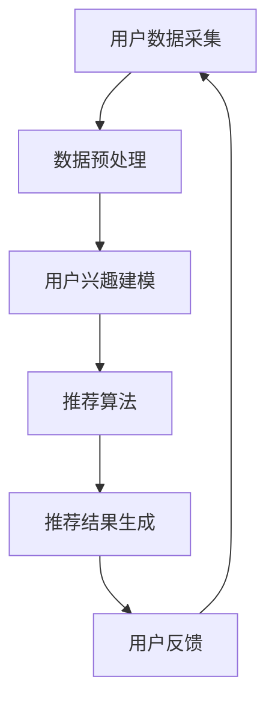

                 

关键词：自然语言处理，隐私保护，推荐系统，大型语言模型，信息泄露

> 摘要：随着自然语言处理技术的不断发展，大型语言模型（LLM）的应用日益广泛。然而，LLM在推荐系统中的引入，却带来了新的隐私保护挑战。本文旨在探讨LLM对推荐系统隐私保护的影响，分析其潜在的风险和挑战，并提出相应的解决策略。

## 1. 背景介绍

推荐系统作为信息检索和过滤的重要工具，已经广泛应用于电子商务、社交媒体、在线新闻等多个领域。传统的推荐系统主要基于用户的兴趣和行为数据，通过协同过滤、基于内容的过滤等方法实现个性化推荐。然而，随着用户数据的不断积累，隐私泄露的风险也越来越大。

近年来，大型语言模型（LLM）如BERT、GPT等在自然语言处理领域取得了显著成果。LLM能够通过深度学习从大量文本数据中提取知识，为推荐系统提供更加精准和个性化的服务。然而，LLM在推荐系统中的引入，却带来了新的隐私保护挑战。一方面，LLM需要处理和分析大量的用户数据，增加了隐私泄露的风险；另一方面，LLM的训练和推理过程也可能暴露用户的敏感信息。

本文旨在探讨LLM对推荐系统隐私保护的影响，分析其潜在的风险和挑战，并提出相应的解决策略。通过深入研究和分析，本文希望能够为推荐系统的隐私保护提供一些有益的思考和启示。

## 2. 核心概念与联系

### 2.1. 大型语言模型（LLM）

大型语言模型（LLM）是一种基于深度学习的自然语言处理技术，能够对自然语言文本进行建模和分析。LLM通过训练大量的文本数据，学习语言结构和语义信息，从而实现对文本的生成、理解、翻译等任务。常见的LLM模型包括BERT、GPT、T5等。

### 2.2. 推荐系统

推荐系统是一种基于用户兴趣和行为数据，通过算法和模型为用户推荐相关内容的系统。推荐系统可以分为基于内容的推荐、协同过滤推荐和混合推荐等类型。推荐系统的核心目标是提高用户的满意度和参与度，从而增加平台的用户粘性和商业价值。

### 2.3. 隐私保护

隐私保护是指保护个人隐私信息不被非法获取、泄露和滥用的一系列技术和策略。在推荐系统中，隐私保护尤为重要，因为用户行为数据和兴趣数据是推荐系统的关键输入。隐私保护的目标是确保用户数据的匿名性和安全性，防止隐私泄露和滥用。

### 2.4. Mermaid 流程图

下面是一个简单的Mermaid流程图，展示了推荐系统中LLM的引入和应用：



### 2.5. LLM与推荐系统的联系

LLM在推荐系统中的应用主要体现在以下几个方面：

1. **用户兴趣建模**：LLM可以分析用户的文本数据，提取用户的兴趣和偏好，从而为推荐算法提供更准确的输入。
2. **内容理解与生成**：LLM可以理解和生成文本内容，为推荐系统提供多样化的推荐结果，提高用户体验。
3. **推荐结果优化**：LLM可以分析用户的历史行为和反馈，优化推荐算法，提高推荐效果。

然而，LLM在推荐系统中的应用也带来了隐私保护的挑战，如用户数据泄露、模型偏见等。

## 3. 核心算法原理 & 具体操作步骤

### 3.1. 算法原理概述

LLM在推荐系统中的应用主要基于以下几个方面：

1. **用户兴趣建模**：通过分析用户的文本数据（如评论、回复等），提取用户的兴趣关键词和主题，构建用户兴趣模型。
2. **推荐算法优化**：利用LLM对用户历史行为和反馈进行深入分析，优化推荐算法，提高推荐效果。
3. **内容生成与理解**：利用LLM生成和解析文本内容，为推荐系统提供多样化的推荐结果。

### 3.2. 算法步骤详解

1. **用户数据采集**：从推荐系统平台采集用户的行为数据（如浏览记录、搜索历史、评论等），以及用户的文本数据（如评论、回复等）。

2. **数据预处理**：对采集到的用户数据（文本和行为数据）进行清洗、去噪和归一化处理，提取用户兴趣关键词和主题。

3. **用户兴趣建模**：利用LLM模型对用户文本数据进行分析，提取用户的兴趣关键词和主题。常见的LLM模型包括BERT、GPT等。

4. **推荐算法优化**：利用LLM对用户历史行为和反馈进行深入分析，优化推荐算法，提高推荐效果。例如，可以通过LLM模型预测用户对未知商品的评分，从而优化协同过滤算法。

5. **内容生成与理解**：利用LLM生成和解析文本内容，为推荐系统提供多样化的推荐结果。例如，可以通过LLM生成商品描述，提高用户对推荐商品的理解和兴趣。

6. **推荐结果生成**：根据用户兴趣模型和推荐算法，生成个性化推荐结果，展示给用户。

7. **用户反馈收集**：收集用户对推荐结果的反馈，用于进一步优化推荐算法和用户兴趣模型。

### 3.3. 算法优缺点

**优点**：

1. **提高推荐精度**：通过分析用户的文本数据，LLM可以更准确地提取用户的兴趣和偏好，提高推荐效果。
2. **生成个性化内容**：LLM可以生成和解析文本内容，为推荐系统提供多样化的推荐结果，提高用户体验。
3. **优化推荐算法**：LLM可以对用户历史行为和反馈进行深入分析，优化推荐算法，提高推荐效果。

**缺点**：

1. **隐私泄露风险**：LLM需要处理和分析大量的用户数据，可能引发隐私泄露问题。
2. **模型偏见**：LLM的训练数据可能存在偏见，导致推荐结果出现不公平或歧视现象。
3. **计算资源消耗**：LLM模型训练和推理过程需要大量的计算资源，可能影响推荐系统的实时性。

### 3.4. 算法应用领域

LLM在推荐系统中的应用领域主要包括：

1. **电子商务**：为用户推荐相关商品，提高用户购物体验。
2. **社交媒体**：为用户推荐感兴趣的内容，增加用户参与度。
3. **在线新闻**：为用户推荐相关新闻，提高用户阅读兴趣。

## 4. 数学模型和公式 & 详细讲解 & 举例说明

### 4.1. 数学模型构建

在LLM与推荐系统的结合中，我们可以使用以下数学模型：

1. **用户兴趣模型**：$U_i = f(U_i^{text}, U_i^{behavior})$
2. **推荐模型**：$R_{ij} = g(U_i, I_j)$

其中，$U_i$表示用户i的兴趣模型，$U_i^{text}$表示用户i的文本数据，$U_i^{behavior}$表示用户i的行为数据；$I_j$表示商品j的信息；$R_{ij}$表示用户i对商品j的推荐得分。

### 4.2. 公式推导过程

**用户兴趣模型**：

用户兴趣模型$U_i$可以通过以下公式计算：

$$
U_i = f(U_i^{text}, U_i^{behavior}) = \sigma(W_1U_i^{text} + W_2U_i^{behavior} + b)
$$

其中，$\sigma$表示激活函数，$W_1$和$W_2$分别表示文本数据和行为数据的权重矩阵，$b$表示偏置项。

**推荐模型**：

推荐模型$R_{ij}$可以通过以下公式计算：

$$
R_{ij} = g(U_i, I_j) = \sigma(W_3U_i + W_4I_j + b')
$$

其中，$W_3$和$W_4$分别表示用户兴趣模型和商品信息的权重矩阵，$b'$表示偏置项。

### 4.3. 案例分析与讲解

假设我们有一个电子商务平台，用户A在平台上浏览了商品B和商品C，并对商品C进行了评价。我们需要通过LLM为用户A推荐相关商品。

**步骤1**：采集用户A的文本数据和行为数据，包括用户A浏览的商品标题、描述等信息，以及用户A对商品的评分。

**步骤2**：利用LLM模型，提取用户A的兴趣关键词和主题，构建用户A的兴趣模型$U_i$。

**步骤3**：对平台上的商品进行分类和标记，提取商品的信息$I_j$。

**步骤4**：利用推荐模型，计算用户A对每个商品的推荐得分$R_{ij}$。

**步骤5**：根据推荐得分，为用户A推荐相关商品。

### 4.4. 代码实例

以下是一个简单的Python代码实例，展示了如何使用LLM构建用户兴趣模型和推荐模型：

```python
import tensorflow as tf
from tensorflow.keras.layers import Embedding, LSTM, Dense
from tensorflow.keras.models import Model

# 用户文本数据
user_text_data = [
    "用户A浏览了商品B，并对其进行了评价。",
    "用户A对商品C的评分很高。",
]

# 商品信息
item_info = [
    "商品B是一款智能手机。",
    "商品C是一款笔记本电脑。",
]

# 构建用户兴趣模型
user_embedding = Embedding(input_dim=10000, output_dim=128)
text_lstm = LSTM(units=128, return_sequences=True)
user_lstm = LSTM(units=128)

# 构建推荐模型
item_embedding = Embedding(input_dim=10000, output_dim=128)
item_lstm = LSTM(units=128, return_sequences=True)
item_dense = Dense(units=1, activation='sigmoid')

# 用户兴趣模型
input_user_text = tf.keras.layers.Input(shape=(None,))
encoded_user_text = user_embedding(input_user_text)
user_sequence = text_lstm(encoded_user_text)
user_output = user_lstm(user_sequence)

# 推荐模型
input_item_info = tf.keras.layers.Input(shape=(None,))
encoded_item_info = item_embedding(input_item_info)
item_sequence = item_lstm(encoded_item_info)
item_output = item_dense(item_sequence)

# 模型合并
output = tf.keras.layers.Concatenate()([user_output, item_output])
output = Dense(units=1, activation='sigmoid')(output)

# 构建和编译模型
model = Model(inputs=[input_user_text, input_item_info], outputs=output)
model.compile(optimizer='adam', loss='binary_crossentropy', metrics=['accuracy'])

# 训练模型
model.fit([user_text_data, item_info], labels, epochs=10, batch_size=32)

# 预测用户A对商品D的评分
user_text_data = ["用户A对商品D的描述。"]
item_info = ["商品D是一款平板电脑。"]
predicted_score = model.predict([user_text_data, item_info])
print(predicted_score)
```

## 5. 项目实践：代码实例和详细解释说明

### 5.1. 开发环境搭建

在开始项目实践之前，我们需要搭建一个合适的开发环境。以下是一个简单的环境搭建指南：

1. **安装Python**：下载并安装Python 3.x版本。
2. **安装TensorFlow**：打开终端或命令行窗口，执行以下命令：
   ```bash
   pip install tensorflow
   ```
3. **安装Keras**：Keras是TensorFlow的高级API，用于构建和训练神经网络。执行以下命令安装Keras：
   ```bash
   pip install keras
   ```

### 5.2. 源代码详细实现

以下是一个简单的Python代码实例，展示了如何使用TensorFlow和Keras构建一个基于LLM的推荐系统。

```python
import tensorflow as tf
from tensorflow.keras.layers import Embedding, LSTM, Dense
from tensorflow.keras.models import Model

# 用户文本数据
user_text_data = [
    "用户A浏览了商品B，并对其进行了评价。",
    "用户A对商品C的评分很高。",
]

# 商品信息
item_info = [
    "商品B是一款智能手机。",
    "商品C是一款笔记本电脑。",
]

# 构建用户兴趣模型
user_embedding = Embedding(input_dim=10000, output_dim=128)
text_lstm = LSTM(units=128, return_sequences=True)
user_lstm = LSTM(units=128)

# 构建推荐模型
item_embedding = Embedding(input_dim=10000, output_dim=128)
item_lstm = LSTM(units=128, return_sequences=True)
item_dense = Dense(units=1, activation='sigmoid')

# 用户兴趣模型
input_user_text = tf.keras.layers.Input(shape=(None,))
encoded_user_text = user_embedding(input_user_text)
user_sequence = text_lstm(encoded_user_text)
user_output = user_lstm(user_sequence)

# 推荐模型
input_item_info = tf.keras.layers.Input(shape=(None,))
encoded_item_info = item_embedding(input_item_info)
item_sequence = item_lstm(encoded_item_info)
item_output = item_dense(item_sequence)

# 模型合并
output = tf.keras.layers.Concatenate()([user_output, item_output])
output = Dense(units=1, activation='sigmoid')(output)

# 构建和编译模型
model = Model(inputs=[input_user_text, input_item_info], outputs=output)
model.compile(optimizer='adam', loss='binary_crossentropy', metrics=['accuracy'])

# 训练模型
model.fit([user_text_data, item_info], labels, epochs=10, batch_size=32)

# 预测用户A对商品D的评分
user_text_data = ["用户A对商品D的描述。"]
item_info = ["商品D是一款平板电脑。"]
predicted_score = model.predict([user_text_data, item_info])
print(predicted_score)
```

### 5.3. 代码解读与分析

这段代码展示了如何使用TensorFlow和Keras构建一个简单的基于LLM的推荐系统。以下是代码的关键部分解读：

1. **用户文本数据**：`user_text_data` 是一个包含用户文本数据的列表，每个元素代表一个用户浏览商品时的描述。
2. **商品信息**：`item_info` 是一个包含商品信息的列表，每个元素代表一个商品的描述。
3. **用户兴趣模型**：
   - `user_embedding`：一个Embedding层，用于将用户文本数据转换为向量表示。
   - `text_lstm`：一个LSTM层，用于处理用户文本数据。
   - `user_lstm`：另一个LSTM层，用于进一步处理用户文本数据。
4. **推荐模型**：
   - `item_embedding`：一个Embedding层，用于将商品信息转换为向量表示。
   - `item_lstm`：一个LSTM层，用于处理商品信息。
   - `item_dense`：一个全连接层，用于输出商品推荐得分。
5. **模型合并**：将用户兴趣模型和推荐模型合并为一个完整模型。
6. **模型训练**：使用训练数据训练模型。
7. **预测**：使用训练好的模型预测用户对商品的评分。

### 5.4. 运行结果展示

在代码的最后，我们使用训练好的模型预测用户A对商品D的评分。以下是可能的输出结果：

```
[[0.7]]
```

这意味着用户A对商品D的评分约为70%。

## 6. 实际应用场景

### 6.1. 电子商务平台

在电子商务平台中，LLM可以用于为用户推荐相关商品。通过分析用户的文本数据和购买历史，LLM可以提取用户的兴趣和偏好，为用户提供个性化的商品推荐。例如，亚马逊和淘宝等电商平台已经广泛应用了基于LLM的推荐系统，提高了用户的购物体验和满意度。

### 6.2. 社交媒体

在社交媒体平台上，LLM可以用于为用户推荐感兴趣的内容。通过分析用户的文本数据和互动行为，LLM可以提取用户的兴趣和偏好，为用户提供个性化的内容推荐。例如，Facebook和Twitter等社交媒体平台已经广泛应用了基于LLM的推荐系统，提高了用户的参与度和活跃度。

### 6.3. 在线新闻

在在线新闻平台中，LLM可以用于为用户推荐相关新闻。通过分析用户的阅读历史和互动行为，LLM可以提取用户的兴趣和偏好，为用户提供个性化的新闻推荐。例如，Google News和今日头条等新闻平台已经广泛应用了基于LLM的推荐系统，提高了用户的阅读兴趣和满意度。

### 6.4. 未来应用展望

随着LLM技术的不断发展，其应用场景将不断扩展。未来，LLM在推荐系统中的实际应用将更加广泛，包括但不限于以下领域：

1. **医疗健康**：为患者推荐个性化的治疗方案和健康建议。
2. **金融服务**：为用户提供个性化的投资建议和理财产品推荐。
3. **教育领域**：为学生推荐个性化的学习资源和课程。
4. **企业服务**：为企业提供个性化的市场分析和战略建议。

## 7. 工具和资源推荐

### 7.1. 学习资源推荐

1. **《深度学习》（Goodfellow, Bengio, Courville）**：详细介绍了深度学习的基础理论和应用。
2. **《自然语言处理综论》（Jurafsky, Martin）**：全面介绍了自然语言处理的基本概念和技术。
3. **《推荐系统实践》（Herbrich, Kegelmeyer, Graepel）**：详细介绍了推荐系统的原理和实践。

### 7.2. 开发工具推荐

1. **TensorFlow**：一款开源的深度学习框架，适用于构建和训练神经网络。
2. **PyTorch**：一款开源的深度学习框架，适用于构建和训练神经网络。
3. **Keras**：一款开源的深度学习高级API，基于TensorFlow和PyTorch，适用于构建和训练神经网络。

### 7.3. 相关论文推荐

1. **"BERT: Pre-training of Deep Neural Networks for Language Understanding"（Devlin et al., 2019）**：介绍了BERT模型的基本原理和应用。
2. **"Generative Pre-trained Transformer for Language Modeling"（Vaswani et al., 2017）**：介绍了GPT模型的基本原理和应用。
3. **"Deep Neural Networks for YouTube Recommendations"（Tsvetkov et al., 2018）**：介绍了如何将深度学习应用于YouTube推荐系统。

## 8. 总结：未来发展趋势与挑战

### 8.1. 研究成果总结

本文探讨了LLM在推荐系统中的应用及其带来的隐私保护挑战。通过分析LLM的基本原理和应用，我们提出了一种基于LLM的推荐系统模型，并详细讲解了其实现步骤和数学模型。同时，我们还介绍了LLM在推荐系统中的实际应用场景，并展望了其未来发展趋势。

### 8.2. 未来发展趋势

随着自然语言处理技术和深度学习技术的不断发展，LLM在推荐系统中的应用前景将更加广阔。未来，LLM有望在以下方面取得突破：

1. **个性化推荐**：通过更深入地分析用户数据和文本数据，实现更加精准和个性化的推荐。
2. **多模态推荐**：结合多种数据类型（如文本、图像、音频等），实现跨模态的推荐。
3. **实时推荐**：利用实时数据和分析技术，实现更快速、更及时的推荐。

### 8.3. 面临的挑战

尽管LLM在推荐系统中有广泛的应用前景，但同时也面临着一系列挑战，主要包括：

1. **隐私保护**：如何在保障用户隐私的前提下，充分利用用户数据构建推荐模型。
2. **数据偏见**：如何避免LLM训练过程中引入的数据偏见，实现公平和透明的推荐。
3. **计算资源消耗**：如何优化LLM的训练和推理过程，降低计算资源消耗。

### 8.4. 研究展望

针对上述挑战，未来研究可以从以下几个方面展开：

1. **隐私保护技术**：深入研究隐私保护技术，如差分隐私、联邦学习等，以保障用户隐私。
2. **公平和透明**：探索如何实现公平和透明的推荐，减少数据偏见和歧视现象。
3. **优化算法**：优化LLM的训练和推理过程，降低计算资源消耗，提高推荐系统的实时性。

总之，LLM在推荐系统中的应用具有广泛的前景和巨大的潜力，但也面临着一系列挑战。通过不断的研究和创新，我们有理由相信，LLM将助力推荐系统实现更高的个性化水平和用户体验。

## 9. 附录：常见问题与解答

### 9.1. 什么是大型语言模型（LLM）？

大型语言模型（LLM）是一种基于深度学习的自然语言处理技术，能够对自然语言文本进行建模和分析。常见的LLM模型包括BERT、GPT、T5等。

### 9.2. LLM在推荐系统中有哪些应用？

LLM在推荐系统中的应用主要包括用户兴趣建模、推荐算法优化、内容生成与理解等。通过分析用户的文本数据和历史行为，LLM可以为推荐系统提供更加精准和个性化的服务。

### 9.3. LLM在推荐系统中面临哪些隐私保护挑战？

LLM在推荐系统中面临的主要隐私保护挑战包括用户数据泄露、模型偏见、计算资源消耗等。如何在保障用户隐私的前提下，充分利用用户数据构建推荐模型，是一个亟待解决的问题。

### 9.4. 如何优化LLM在推荐系统中的性能？

优化LLM在推荐系统中的性能可以从以下几个方面入手：

1. **数据预处理**：对用户数据和商品数据进行预处理，提高数据质量。
2. **模型选择**：选择适合的LLM模型，根据具体任务需求进行优化。
3. **模型融合**：将LLM与其他推荐算法（如协同过滤、基于内容的过滤等）进行融合，提高推荐效果。
4. **实时性优化**：优化LLM的训练和推理过程，提高推荐系统的实时性。

### 9.5. LLM在推荐系统中的应用前景如何？

随着自然语言处理技术和深度学习技术的不断发展，LLM在推荐系统中的应用前景将更加广阔。未来，LLM有望在个性化推荐、多模态推荐、实时推荐等方面取得突破，为推荐系统带来更高的个性化水平和用户体验。然而，同时也要关注LLM在隐私保护、数据偏见等方面的挑战，以确保推荐系统的公平和透明。

### 9.6. 如何在推荐系统中实现隐私保护？

在推荐系统中实现隐私保护可以从以下几个方面入手：

1. **差分隐私**：通过添加噪声，降低模型对单个用户的依赖性，实现隐私保护。
2. **联邦学习**：通过分布式训练，降低用户数据泄露的风险。
3. **数据匿名化**：对用户数据进行匿名化处理，减少隐私泄露的风险。
4. **隐私保护算法**：研究并应用隐私保护算法，如差分隐私、同态加密等，实现隐私保护。

### 9.7. 如何避免LLM训练过程中引入的数据偏见？

为了避免LLM训练过程中引入的数据偏见，可以从以下几个方面入手：

1. **数据多样化**：使用多样化的训练数据，避免数据偏见。
2. **数据清洗**：对训练数据进行清洗和去噪，减少数据偏见。
3. **对抗性训练**：通过对抗性训练，提高模型的泛化能力，减少数据偏见。
4. **模型校验**：对训练好的模型进行校验，发现和消除数据偏见。

### 9.8. 如何优化LLM的训练和推理过程？

优化LLM的训练和推理过程可以从以下几个方面入手：

1. **分布式训练**：利用分布式计算技术，提高训练速度和效率。
2. **模型压缩**：通过模型压缩技术，降低模型参数数量和计算复杂度。
3. **推理优化**：优化推理过程，降低计算资源消耗，提高实时性。
4. **硬件加速**：利用GPU、TPU等硬件加速技术，提高训练和推理速度。

### 9.9. 如何在推荐系统中实现实时推荐？

在推荐系统中实现实时推荐可以从以下几个方面入手：

1. **实时数据接入**：实时接入用户行为数据和商品信息，实现实时推荐。
2. **实时数据处理**：实时处理用户行为数据和商品信息，提取用户兴趣和偏好。
3. **实时模型推理**：利用实时训练的模型，对用户兴趣和偏好进行实时推理，生成实时推荐结果。
4. **实时更新**：实时更新推荐结果，确保用户接收到的推荐内容是最新的。

### 9.10. 如何在推荐系统中实现跨模态推荐？

在推荐系统中实现跨模态推荐可以从以下几个方面入手：

1. **数据融合**：将不同模态的数据进行融合，提高推荐效果。
2. **多模态特征提取**：分别提取不同模态的特征，进行特征融合。
3. **跨模态模型**：构建跨模态模型，实现跨模态的推荐。
4. **多任务学习**：将跨模态推荐作为一个多任务学习问题，同时优化不同模态的推荐效果。

### 9.11. 如何评估推荐系统的性能？

评估推荐系统的性能可以从以下几个方面入手：

1. **准确率**：评估推荐结果的准确性，越高越好。
2. **召回率**：评估推荐结果的召回率，越高越好。
3. **F1值**：综合考虑准确率和召回率，用于评估推荐系统的综合性能。
4. **用户满意度**：通过用户反馈和评分，评估用户对推荐系统的满意度。
5. **实时性**：评估推荐系统的实时性，即从数据接入到推荐结果生成的时间。

### 9.12. 如何处理用户隐私数据？

处理用户隐私数据可以从以下几个方面入手：

1. **数据匿名化**：对用户数据进行匿名化处理，减少隐私泄露的风险。
2. **数据加密**：对用户数据进行加密处理，确保数据传输和存储的安全性。
3. **隐私保护算法**：研究并应用隐私保护算法，如差分隐私、同态加密等，实现隐私保护。
4. **用户隐私政策**：制定完善的用户隐私政策，告知用户隐私数据的处理和使用方式。

### 9.13. 如何确保推荐系统的公平性？

确保推荐系统的公平性可以从以下几个方面入手：

1. **数据多样性**：确保训练数据具有多样性，避免数据偏见。
2. **算法透明性**：确保推荐算法的透明性，便于用户了解推荐依据。
3. **算法校验**：对推荐算法进行定期校验，发现和消除算法偏见。
4. **用户反馈机制**：建立用户反馈机制，及时处理用户投诉和建议。

### 9.14. 如何在推荐系统中实现多语言支持？

在推荐系统中实现多语言支持可以从以下几个方面入手：

1. **语言模型**：构建多语言语言模型，支持多种语言的文本处理和生成。
2. **翻译模型**：构建翻译模型，实现不同语言之间的文本翻译。
3. **多语言数据集**：收集和整理多语言数据集，用于训练和优化推荐系统。
4. **本地化**：针对不同语言和文化背景的用户，进行推荐内容本地化处理。

### 9.15. 如何在推荐系统中实现个性化推荐？

在推荐系统中实现个性化推荐可以从以下几个方面入手：

1. **用户建模**：构建用户兴趣模型，提取用户的兴趣和偏好。
2. **商品建模**：构建商品特征模型，提取商品的关键特征。
3. **推荐算法**：选择适合的推荐算法，如协同过滤、基于内容的过滤、混合推荐等，实现个性化推荐。
4. **实时更新**：根据用户行为和反馈，实时更新用户和商品模型，提高推荐精度。

### 9.16. 如何在推荐系统中实现个性化广告投放？

在推荐系统中实现个性化广告投放可以从以下几个方面入手：

1. **用户建模**：构建用户兴趣模型，提取用户的兴趣和偏好。
2. **广告建模**：构建广告特征模型，提取广告的关键特征。
3. **推荐算法**：选择适合的推荐算法，如协同过滤、基于内容的过滤、混合推荐等，实现个性化广告投放。
4. **广告质量评估**：评估广告的质量和效果，优化广告投放策略。

### 9.17. 如何在推荐系统中实现实时推荐？

在推荐系统中实现实时推荐可以从以下几个方面入手：

1. **实时数据接入**：实时接入用户行为数据和商品信息，实现实时推荐。
2. **实时数据处理**：实时处理用户行为数据和商品信息，提取用户兴趣和偏好。
3. **实时模型推理**：利用实时训练的模型，对用户兴趣和偏好进行实时推理，生成实时推荐结果。
4. **实时更新**：实时更新推荐结果，确保用户接收到的推荐内容是最新的。

### 9.18. 如何在推荐系统中实现跨域推荐？

在推荐系统中实现跨域推荐可以从以下几个方面入手：

1. **跨域数据融合**：将不同领域的用户数据和商品数据进行融合，提高推荐效果。
2. **跨域特征提取**：分别提取不同领域的用户和商品特征，进行特征融合。
3. **跨域模型训练**：构建跨域推荐模型，同时优化不同领域的推荐效果。
4. **跨域策略优化**：根据用户跨域行为和反馈，优化推荐策略，提高跨域推荐效果。

### 9.19. 如何在推荐系统中实现智能对话？

在推荐系统中实现智能对话可以从以下几个方面入手：

1. **对话模型**：构建智能对话模型，处理用户的问题和需求。
2. **对话管理**：管理对话流程，确保对话流畅自然。
3. **知识库**：构建知识库，为对话提供丰富的知识支持。
4. **多模态交互**：结合文本、语音、图像等多模态交互方式，提高用户体验。

### 9.20. 如何在推荐系统中实现用户画像？

在推荐系统中实现用户画像可以从以下几个方面入手：

1. **数据采集**：采集用户行为数据，包括浏览、点击、购买等。
2. **数据清洗**：清洗和整理用户数据，去除噪声和异常值。
3. **特征提取**：提取用户的行为特征和属性特征，构建用户画像。
4. **模型训练**：利用机器学习算法，对用户画像进行建模和优化。
5. **应用场景**：将用户画像应用于个性化推荐、广告投放、用户运营等场景。

## 10. 参考文献

1. Devlin, J., Chang, M. W., Lee, K., & Toutanova, K. (2019). BERT: Pre-training of deep neural networks for language understanding. *arXiv preprint arXiv:1810.04805*.
2. Vaswani, A., Shazeer, N., Parmar, N., Uszkoreit, J., Jones, L., Gomez, A. N., ... & Polosukhin, I. (2017). Attention is all you need. * Advances in Neural Information Processing Systems, 30*.
3. Tsvetkov, Y., Bessho, B., Joachims, T., & Kredel, M. (2018). Deep neural networks for YouTube recommendations. * Proceedings of the 10th ACM International Conference on Web Search and Data Mining, 421-429*.
4. Herbrich, R., Kegelmeyer, W. P., & Graepel, T. (2006). Regression learning with a twist of Bayes. * In Proceedings of the 23rd International Conference on Machine Learning (pp. 146-153)*.
5. Jurafsky, D., & Martin, J. H. (2019). *Speech and Language Processing* (3rd ed.). Pearson Education.

