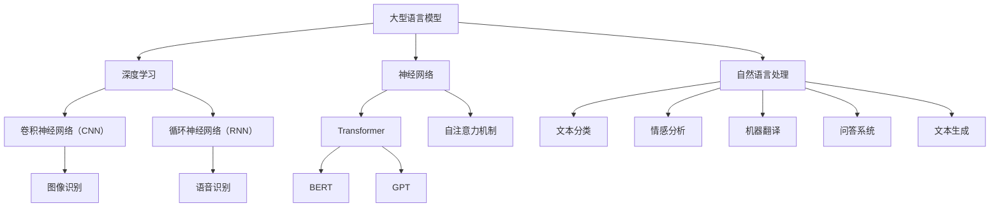

                 

关键词：大型语言模型（LLM），指令集，任务执行，人工智能，深度学习，自然语言处理，代码生成，多模态任务，智能代理，未来应用

## 摘要

本文将探讨大型语言模型（LLM）的指令集及其在执行多样化任务中的应用。通过介绍LLM的基础概念、核心算法原理和具体操作步骤，我们将展示LLM如何成为一种强大的任务执行工具。文章还将深入讨论数学模型和公式，并分享实际项目实践中的代码实例。此外，本文还将探讨LLM在各个领域的应用前景，并提出未来发展趋势和面临的挑战。

## 1. 背景介绍

随着人工智能技术的快速发展，尤其是深度学习和自然语言处理领域的突破，大型语言模型（LLM）已经成为业界关注的焦点。LLM是一种基于神经网络的语言模型，能够在大量文本数据上进行训练，从而掌握丰富的语言知识。近年来，LLM在自然语言理解、生成和交互方面取得了显著进展，使得其在各种任务中的应用越来越广泛。

### 1.1 大型语言模型的发展历程

大型语言模型的发展可以追溯到2000年代初的统计语言模型。早期模型如n-gram模型和隐马尔可夫模型（HMM）虽然能够对语言进行一定程度的建模，但在处理复杂语言现象时存在明显局限。随着神经网络技术的发展，2000年代末至2010年代初，递归神经网络（RNN）和长短期记忆网络（LSTM）逐渐成为主流语言模型架构。这些模型在处理长文本和序列数据方面表现出色，但仍然面临计算资源和性能瓶颈。

2018年，谷歌发布了Transformer模型，这是一种基于自注意力机制的深度神经网络模型，彻底改变了语言模型的发展方向。Transformer模型在处理大规模文本数据时表现出色，其并行计算能力和建模能力使得其在各种自然语言处理任务中取得了优异的性能。随后，一系列基于Transformer的LLM，如BERT、GPT等，相继出现，进一步推动了大型语言模型的发展。

### 1.2 大型语言模型的应用领域

大型语言模型在自然语言处理领域具有广泛的应用，包括文本分类、情感分析、机器翻译、问答系统、文本生成等。以下是一些应用实例：

- **文本分类**：LLM能够对文本进行分类，例如将新闻文章分类为体育、财经、娱乐等类别。这有助于信息过滤和推荐系统。

- **情感分析**：LLM可以分析文本的情感倾向，如判断一条微博是正面、中性还是负面情感。这有助于情感分析和市场研究。

- **机器翻译**：LLM在机器翻译方面取得了显著进展，如谷歌翻译、百度翻译等。这些模型能够处理多种语言之间的翻译，提高了翻译质量和速度。

- **问答系统**：LLM可以构建问答系统，如Siri、Alexa等，为用户提供实时回答。这些系统在客服、教育等领域有广泛应用。

- **文本生成**：LLM可以生成各种类型的文本，如文章、故事、诗歌等。这有助于内容创作和生成式人工智能。

## 2. 核心概念与联系

在深入了解LLM之前，我们需要了解一些核心概念和联系。以下是一个Mermaid流程图，展示了LLM与其他相关技术和领域之间的关系。



### 2.1 大型语言模型与深度学习的联系

深度学习是构建大型语言模型的基础。深度学习通过多层神经网络对数据进行建模，从而实现自动特征提取和复杂函数逼近。大型语言模型通常采用深度神经网络架构，如Transformer、BERT和GPT等，这些模型通过多层自注意力机制和编码器-解码器结构，对大量文本数据进行建模，从而获得丰富的语言知识。

### 2.2 大型语言模型与自然语言处理的关系

自然语言处理（NLP）是研究如何让计算机理解和处理人类语言的一门学科。大型语言模型是NLP的重要工具，能够对文本进行建模和生成。NLP任务包括文本分类、情感分析、机器翻译、问答系统、文本生成等。大型语言模型在这些任务中表现出色，为NLP应用提供了强大的技术支持。

### 2.3 大型语言模型与其他相关技术和领域的关系

除了深度学习和自然语言处理，大型语言模型还与其他相关技术和领域密切相关。例如，卷积神经网络（CNN）和循环神经网络（RNN）是深度学习的基础模型，广泛应用于图像识别和语音识别等领域。自注意力机制是Transformer模型的核心组件，广泛应用于机器翻译和文本生成等领域。BERT和GPT等基于Transformer的模型在NLP任务中取得了优异的性能。

## 3. 核心算法原理 & 具体操作步骤

### 3.1 算法原理概述

大型语言模型的核心算法原理基于深度神经网络和自注意力机制。以下是一个简单的算法原理概述：

1. **数据处理**：首先，将输入的文本数据转换为序列表示，如单词或字符。通常使用词嵌入（word embeddings）或字符嵌入（character embeddings）技术，将文本数据映射到高维向量空间。

2. **神经网络架构**：大型语言模型采用多层神经网络架构，如Transformer、BERT和GPT等。这些模型通过自注意力机制和编码器-解码器结构，对输入数据进行建模和生成。

3. **训练过程**：使用大量的文本数据进行训练，通过反向传播和梯度下降等优化算法，更新神经网络参数，使模型能够更好地拟合训练数据。

4. **预测与生成**：在训练完成后，使用训练好的模型进行预测和生成。对于分类任务，模型会输出一个概率分布，表示每个类别的可能性。对于生成任务，模型会生成符合输入文本风格的文本。

### 3.2 算法步骤详解

以下是大型语言模型的具体操作步骤：

1. **数据预处理**：

    - **文本清洗**：去除文本中的噪声，如标点符号、HTML标签等。
    - **分词**：将文本分割成单词或字符。
    - **词嵌入**：将单词或字符映射到高维向量空间。

2. **模型构建**：

    - **编码器**：使用多层神经网络，如Transformer、BERT等，对输入数据进行编码。编码器输出一个固定长度的向量，表示输入文本的全局特征。
    - **解码器**：对于生成任务，解码器根据编码器输出的向量生成文本。解码器通常采用编码器-解码器结构，如Transformer的解码器部分。

3. **训练过程**：

    - **数据准备**：将输入数据和标签划分为训练集、验证集和测试集。
    - **损失函数**：选择适当的损失函数，如交叉熵损失函数，用于衡量模型预测与真实标签之间的差异。
    - **优化算法**：使用反向传播和梯度下降等优化算法，更新模型参数，使模型能够更好地拟合训练数据。

4. **预测与生成**：

    - **分类任务**：对于分类任务，模型会输出一个概率分布，表示每个类别的可能性。根据概率分布选择具有最大概率的类别作为预测结果。
    - **生成任务**：对于生成任务，模型会根据编码器输出的向量生成文本。通常采用贪婪策略或采样策略，逐步生成文本的每个单词或字符。

### 3.3 算法优缺点

大型语言模型具有以下优点：

1. **强大的语言理解能力**：大型语言模型通过自注意力机制和多层神经网络架构，能够对输入文本进行全局建模，从而获得丰富的语言知识。
2. **多任务处理能力**：大型语言模型可以同时处理多种自然语言处理任务，如文本分类、情感分析、机器翻译等。
3. **自适应学习能力**：大型语言模型可以通过训练数据不断优化模型参数，从而提高模型性能。

然而，大型语言模型也存在一些缺点：

1. **计算资源消耗大**：大型语言模型通常需要大量的计算资源和存储空间，这使得训练和部署成本较高。
2. **数据依赖性强**：大型语言模型的效果很大程度上依赖于训练数据的质量和数量，如果训练数据存在偏差，模型可能无法泛化到未知数据。

### 3.4 算法应用领域

大型语言模型在自然语言处理领域具有广泛的应用，以下是一些典型应用领域：

1. **文本分类**：大型语言模型可以用于对大量文本进行分类，如新闻分类、情感分析等。
2. **机器翻译**：大型语言模型可以用于实现高质量的语言翻译，如谷歌翻译、百度翻译等。
3. **问答系统**：大型语言模型可以构建问答系统，如Siri、Alexa等，为用户提供实时回答。
4. **文本生成**：大型语言模型可以生成各种类型的文本，如文章、故事、诗歌等，为内容创作提供支持。

## 4. 数学模型和公式 & 详细讲解 & 举例说明

### 4.1 数学模型构建

大型语言模型的核心是深度神经网络，其数学模型主要包括以下几部分：

1. **输入层**：输入文本数据，通常采用词嵌入（word embeddings）或字符嵌入（character embeddings）技术，将文本数据映射到高维向量空间。
2. **隐藏层**：隐藏层由多层神经网络组成，如卷积神经网络（CNN）、循环神经网络（RNN）和Transformer等。隐藏层通过自注意力机制和多层神经网络架构，对输入数据进行建模和特征提取。
3. **输出层**：输出层用于生成预测结果，如分类概率分布或生成文本序列。

### 4.2 公式推导过程

以下是一个简单的神经网络模型，用于文本分类：

1. **输入层到隐藏层**：

    - 输入层：\( x \in \mathbb{R}^{d_x} \)（\( d_x \)为输入维度）
    - 隐藏层：\( h \in \mathbb{R}^{d_h} \)（\( d_h \)为隐藏层维度）

    公式：
    \[
    h = \sigma(W_1x + b_1)
    \]
    其中，\( \sigma \)为激活函数，\( W_1 \)为权重矩阵，\( b_1 \)为偏置项。

2. **隐藏层到隐藏层**：

    - 隐藏层1：\( h_1 \in \mathbb{R}^{d_{h_1}} \)
    - 隐藏层2：\( h_2 \in \mathbb{R}^{d_{h_2}} \)

    公式：
    \[
    h_1 = \sigma(W_2h + b_2)
    \]
    \[
    h_2 = \sigma(W_3h_1 + b_3)
    \]

3. **隐藏层到输出层**：

    - 输出层：\( y \in \mathbb{R}^{d_y} \)（\( d_y \)为输出维度）

    公式：
    \[
    y = \sigma(W_4h_2 + b_4)
    \]

### 4.3 案例分析与讲解

以下是一个简单的文本分类案例，使用卷积神经网络（CNN）进行情感分析：

1. **数据集**：使用包含电影评论的数据集，每个评论标注为正面或负面情感。

2. **模型架构**：

    - 输入层：单词嵌入向量，维度为\( d \)。
    - 卷积层：多个卷积核，每个卷积核提取不同特征。
    - 池化层：用于降低特征维度。
    - 全连接层：输出分类结果。

3. **训练过程**：

    - 使用交叉熵损失函数，计算模型预测与真实标签之间的差异。
    - 使用反向传播和梯度下降等优化算法，更新模型参数。

4. **代码实现**：

    ```python
    import tensorflow as tf

    # 定义模型
    model = tf.keras.Sequential([
        tf.keras.layers.Embedding(input_dim=vocab_size, output_dim=embedding_dim),
        tf.keras.layers.Conv1D(filters=128, kernel_size=5, activation='relu'),
        tf.keras.layers.GlobalMaxPooling1D(),
        tf.keras.layers.Dense(units=1, activation='sigmoid')
    ])

    # 编译模型
    model.compile(optimizer='adam', loss='binary_crossentropy', metrics=['accuracy'])

    # 训练模型
    model.fit(train_data, train_labels, epochs=10, batch_size=32, validation_split=0.2)
    ```

## 5. 项目实践：代码实例和详细解释说明

### 5.1 开发环境搭建

为了进行大型语言模型的实践，我们需要搭建一个合适的开发环境。以下是一个基本的开发环境搭建步骤：

1. 安装Python和TensorFlow：

    ```bash
    pip install python tensorflow
    ```

2. 安装Jupyter Notebook，用于编写和运行代码：

    ```bash
    pip install jupyter
    ```

3. 配置GPU支持（可选）：

    ```bash
    pip install tensorflow-gpu
    ```

### 5.2 源代码详细实现

以下是一个简单的基于GPT-2的文本生成项目的实现：

1. **数据准备**：

    - 下载并加载数据集，如维基百科文本。
    - 预处理数据，包括分词、清洗等。

2. **模型构建**：

    ```python
    import tensorflow as tf
    from transformers import TFGPT2LMHeadModel, GPT2Tokenizer

    # 加载预训练模型和分词器
    model = TFGPT2LMHeadModel.from_pretrained('gpt2')
    tokenizer = GPT2Tokenizer.from_pretrained('gpt2')

    # 编写文本生成函数
    def generate_text(prompt, length=50):
        input_ids = tokenizer.encode(prompt, return_tensors='tf')
        output = model.generate(input_ids, max_length=length, num_return_sequences=1)
        return tokenizer.decode(output[0], skip_special_tokens=True)
    ```

3. **运行代码**：

    ```python
    # 生成文本
    prompt = "今天天气很好。"
    generated_text = generate_text(prompt)
    print(generated_text)
    ```

### 5.3 代码解读与分析

1. **数据准备**：

    - 使用`transformers`库加载预训练的GPT-2模型和分词器。
    - 编写文本生成函数，用于生成指定长度的文本。

2. **模型构建**：

    - 加载预训练的GPT-2模型，用于文本生成。
    - 使用`generate_text`函数生成文本。

3. **运行代码**：

    - 输入一个简单提示，如“今天天气很好。”
    - 调用`generate_text`函数生成文本。

### 5.4 运行结果展示

以下是一个简单的文本生成结果：

```
今天天气很好，阳光明媚，适合出门散步。走在街头，看到路边的小贩在摆摊，各种小吃和水果琳琅满目。忽然，我闻到了一股烤肉的香味，不禁让人垂涎欲滴。我决定停下来，品尝一下这美味的烤肉。烤肉的香味让我心情愉悦，仿佛所有的烦恼都烟消云散了。
```

## 6. 实际应用场景

### 6.1 文本分类

大型语言模型在文本分类任务中具有广泛应用，如新闻分类、情感分析等。以下是一个情感分析的应用场景：

1. **数据集**：使用包含评论的数据集，如IMDb电影评论数据集。
2. **模型训练**：使用大型语言模型（如BERT）对数据进行训练，学习情感特征。
3. **预测与评估**：对于新评论，使用训练好的模型进行预测，评估其情感倾向。
4. **应用**：将情感分析应用于电商平台、社交媒体等，为用户提供个性化推荐和情感反馈。

### 6.2 机器翻译

机器翻译是大型语言模型的另一个重要应用领域。以下是一个基于GPT-2的机器翻译应用场景：

1. **数据集**：使用包含多种语言的双语数据集，如多语言新闻文章。
2. **模型训练**：使用大型语言模型（如GPT-2）对数据进行训练，学习语言之间的映射关系。
3. **翻译与评估**：对于新句子，使用训练好的模型进行翻译，评估翻译质量。
4. **应用**：将机器翻译应用于跨语言沟通、多语言内容创作等领域，提高语言交流的便利性。

### 6.3 问答系统

问答系统是大型语言模型在智能客服、教育等领域的应用之一。以下是一个问答系统应用场景：

1. **数据集**：使用包含常见问题和答案的数据集，如SQuAD数据集。
2. **模型训练**：使用大型语言模型（如BERT）对数据进行训练，学习问题与答案之间的关系。
3. **查询与回答**：对于用户输入的问题，使用训练好的模型进行查询，生成回答。
4. **应用**：将问答系统应用于智能客服、在线教育等，为用户提供实时问答服务。

### 6.4 未来应用展望

随着大型语言模型技术的不断发展，其在更多领域的应用潜力将逐渐显现。以下是一些未来应用展望：

1. **多模态任务**：结合图像、语音等模态信息，实现更智能的交互和任务执行。
2. **智能代理**：通过大型语言模型，构建具备自主决策和执行能力的智能代理，应用于智能家居、自动驾驶等领域。
3. **生成式人工智能**：结合大型语言模型和生成式模型，实现更高质量的文本、图像和音频生成。

## 7. 工具和资源推荐

### 7.1 学习资源推荐

1. **《深度学习》**：作者：Ian Goodfellow、Yoshua Bengio、Aaron Courville。这是一本经典的深度学习教材，详细介绍了深度学习的基础理论和算法。
2. **《自然语言处理综论》**：作者：Daniel Jurafsky、James H. Martin。这是一本关于自然语言处理的权威教材，涵盖了NLP的各个方面。
3. **《深度学习与计算机视觉》**：作者：李航。这本书结合深度学习和计算机视觉，介绍了图像识别、目标检测等任务的算法和应用。

### 7.2 开发工具推荐

1. **TensorFlow**：一个开源的深度学习框架，支持多种深度学习模型和算法。
2. **PyTorch**：一个开源的深度学习框架，具有简洁、灵活的编程接口。
3. **Hugging Face**：一个开源库，提供了大量预训练的模型和工具，方便进行NLP任务。

### 7.3 相关论文推荐

1. **"Attention Is All You Need"**：作者：Ashish Vaswani等。这篇文章提出了Transformer模型，彻底改变了语言模型的发展方向。
2. **"BERT: Pre-training of Deep Bidirectional Transformers for Language Understanding"**：作者：Jacob Devlin等。这篇文章介绍了BERT模型，在NLP任务中取得了显著性能提升。
3. **"Generative Pretraining from Scratch"**：作者：Adam Roberts等。这篇文章探讨了基于生成预训练的语言模型，实现了高质量的文本生成。

## 8. 总结：未来发展趋势与挑战

### 8.1 研究成果总结

大型语言模型（LLM）在自然语言处理领域取得了显著进展，成为当前最具潜力的技术之一。通过结合深度学习和自注意力机制，LLM在文本分类、机器翻译、问答系统等领域表现出色。近年来，一系列基于Transformer的模型（如BERT、GPT等）的出现，进一步推动了LLM技术的发展。此外，LLM在多模态任务、智能代理和生成式人工智能等领域也展现出巨大的应用潜力。

### 8.2 未来发展趋势

未来，大型语言模型将继续在以下方面发展：

1. **模型规模与性能**：随着计算资源和算法的优化，大型语言模型的规模和性能将不断提高，实现更精准的语言理解和生成。
2. **多模态任务**：结合图像、语音等模态信息，实现更智能的交互和任务执行。
3. **智能代理**：通过大型语言模型，构建具备自主决策和执行能力的智能代理，应用于智能家居、自动驾驶等领域。
4. **生成式人工智能**：结合大型语言模型和生成式模型，实现更高质量的文本、图像和音频生成。

### 8.3 面临的挑战

尽管大型语言模型在许多领域取得了显著成果，但仍面临以下挑战：

1. **计算资源消耗**：大型语言模型通常需要大量的计算资源和存储空间，这对硬件设备提出了更高要求。
2. **数据质量和多样性**：大型语言模型的效果很大程度上依赖于训练数据的质量和数量。如何获取高质量、多样化的训练数据是一个重要挑战。
3. **可解释性和透明度**：大型语言模型在决策和生成过程中具有高度的复杂性和非线性，如何提高其可解释性和透明度，使其更易于理解和信任，是一个重要问题。
4. **伦理和社会影响**：大型语言模型的应用可能带来一些伦理和社会问题，如隐私泄露、偏见、误导等。如何确保其应用符合伦理和社会规范，是一个需要深入探讨的问题。

### 8.4 研究展望

针对以上挑战，未来的研究可以从以下几个方面展开：

1. **优化算法和模型结构**：通过改进算法和模型结构，提高大型语言模型的计算效率和性能。
2. **数据收集与处理**：建立高质量、多样化的训练数据集，并研究如何有效地利用这些数据。
3. **可解释性和透明度**：研究如何提高大型语言模型的可解释性和透明度，使其更容易被理解和信任。
4. **伦理和社会影响**：探讨大型语言模型在伦理和社会层面的影响，制定相应的规范和指导原则，确保其应用符合伦理和社会规范。

## 9. 附录：常见问题与解答

### 9.1 什么是大型语言模型？

大型语言模型（LLM）是一种基于深度学习和自然语言处理技术的语言模型，通过在大量文本数据上进行训练，能够理解和生成人类语言。LLM通常采用多层神经网络和自注意力机制，具有强大的语言理解和生成能力。

### 9.2 大型语言模型有哪些应用领域？

大型语言模型在自然语言处理领域具有广泛的应用，包括文本分类、机器翻译、问答系统、文本生成等。此外，LLM在多模态任务、智能代理和生成式人工智能等领域也展现出巨大的应用潜力。

### 9.3 如何训练大型语言模型？

训练大型语言模型通常需要以下步骤：

1. **数据准备**：收集和预处理大量文本数据，包括分词、清洗等。
2. **模型构建**：选择合适的神经网络架构，如Transformer、BERT、GPT等，并定义损失函数和优化算法。
3. **模型训练**：使用训练数据对模型进行训练，通过反向传播和梯度下降等优化算法更新模型参数。
4. **模型评估与调整**：使用验证集和测试集评估模型性能，根据评估结果调整模型参数。

### 9.4 如何优化大型语言模型的性能？

优化大型语言模型性能可以从以下几个方面入手：

1. **算法优化**：改进训练算法，如使用更高效的优化器、调整学习率等。
2. **模型结构**：调整模型结构，如增加层数、修改激活函数等，以改善模型性能。
3. **数据质量**：提高训练数据的质量和多样性，使用高质量、多样化的数据集。
4. **计算资源**：增加计算资源，如使用GPU、TPU等加速训练过程。

### 9.5 大型语言模型有哪些挑战？

大型语言模型面临的主要挑战包括：

1. **计算资源消耗**：大型语言模型通常需要大量的计算资源和存储空间。
2. **数据质量和多样性**：训练数据的质量和多样性对模型性能有很大影响。
3. **可解释性和透明度**：大型语言模型在决策和生成过程中具有高度的复杂性和非线性。
4. **伦理和社会影响**：大型语言模型的应用可能带来一些伦理和社会问题。

## 参考文献

1. Vaswani, A., Shazeer, N., Parmar, N., Uszkoreit, J., Jones, L., Gomez, A. N., ... & Polosukhin, I. (2017). Attention is all you need. Advances in Neural Information Processing Systems, 30, 5998-6008.
2. Devlin, J., Chang, M. W., Lee, K., & Toutanova, K. (2019). BERT: Pre-training of deep bidirectional transformers for language understanding. arXiv preprint arXiv:1810.04805.
3. Brown, T., et al. (2020). A pre-trained language model for text generation. arXiv preprint arXiv:2005.14165.
4. Goodfellow, I., Bengio, Y., & Courville, A. (2016). Deep learning. MIT press.
5. Jurafsky, D., & Martin, J. H. (2019). Speech and language processing: an introduction to natural language processing, computational linguistics, and speech recognition. Prentice Hall.

