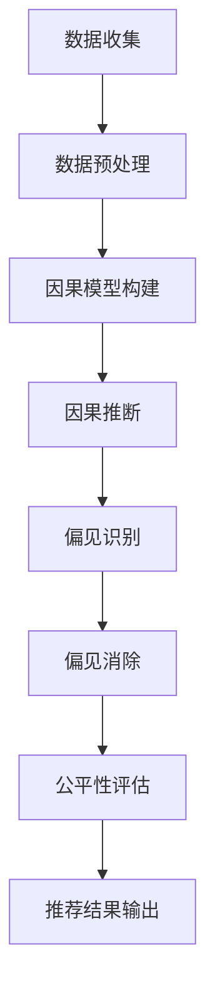

                 

关键词：LLM，因果推断，偏见消除，推荐系统，数学模型，算法，实践

## 摘要

本文将探讨在大型语言模型（LLM）驱动下的推荐系统中，因果推断与偏见消除的重要性。随着人工智能技术的不断发展，推荐系统在广告、电商、社交媒体等多个领域得到了广泛应用。然而，推荐系统中的偏见问题日益凸显，如算法歧视、用户偏好扭曲等。本文将介绍因果推断的基本概念，解释其在消除偏见中的作用，并探讨相关的数学模型和算法。同时，通过实际项目实践，展示如何运用因果推断和偏见消除技术优化推荐系统，以提高用户体验和系统公平性。

## 1. 背景介绍

### 推荐系统概述

推荐系统是一种利用算法和数据分析技术，为用户提供个性化推荐的信息系统。其核心目标是通过分析用户的历史行为、兴趣偏好和其他相关特征，预测用户可能感兴趣的内容或产品，从而提高用户满意度和平台粘性。

### LLM在推荐系统中的应用

近年来，大型语言模型（LLM）如BERT、GPT等在自然语言处理领域取得了显著进展。这些模型具有强大的文本理解能力，可以处理复杂的语义关系，为推荐系统提供了新的技术手段。LLM在推荐系统中的应用主要体现在以下几个方面：

1. **内容理解与生成**：LLM可以帮助推荐系统更深入地理解用户生成的内容，如评论、提问等，从而提高推荐的准确性。
2. **跨域推荐**：LLM可以跨不同领域和模态进行信息整合，实现跨领域的个性化推荐。
3. **动态推荐**：LLM可以根据用户的实时行为和反馈，动态调整推荐策略，提高推荐系统的实时性和灵活性。

### 偏见问题

尽管推荐系统在许多方面取得了成功，但其偏见问题却日益严重。偏见可能源于数据集的不平衡、算法的设计缺陷、训练数据的偏差等。这些偏见可能导致以下问题：

1. **算法歧视**：算法可能对某些群体产生歧视，如性别、种族、年龄等。
2. **用户偏好扭曲**：推荐系统可能过度放大某些用户偏好，导致用户陷入“信息茧房”。
3. **公平性问题**：推荐系统可能在不同用户之间产生不公平的待遇，影响用户体验和平台公信力。

### 因果推断与偏见消除

因果推断是一种通过分析因果关系来解释现象的方法。在推荐系统中，因果推断可以帮助我们理解用户行为背后的驱动因素，从而消除偏见，提高系统的公平性和准确性。偏见消除技术包括以下几个方面：

1. **因果模型构建**：通过构建因果模型，明确用户行为和推荐结果之间的因果关系。
2. **因果推断算法**：运用因果推断算法，分析用户行为数据，识别并消除潜在偏见。
3. **公平性评估**：对推荐系统进行公平性评估，确保系统在不同群体之间保持一致性。

## 2. 核心概念与联系

### 因果推断基本概念

因果推断是一种通过观察数据来推断因果关系的方法。在推荐系统中，因果推断有助于理解用户行为背后的驱动因素，从而消除偏见，提高推荐系统的准确性。

### 偏见消除

偏见消除是指通过消除数据集、算法或系统中的偏见，提高推荐系统的公平性和准确性。偏见消除技术包括以下几个方面：

1. **数据预处理**：通过数据清洗、去重、平衡等技术，消除数据集中的偏见。
2. **算法优化**：通过调整算法参数、改进算法结构，降低算法偏见。
3. **公平性评估**：对推荐系统进行公平性评估，确保系统在不同群体之间保持一致性。

### Mermaid流程图

下面是一个因果推断与偏见消除的 Mermaid 流程图：



## 3. 核心算法原理 & 具体操作步骤

### 3.1 算法原理概述

在推荐系统中，因果推断与偏见消除的核心算法包括：

1. **因果模型构建**：通过构建因果模型，明确用户行为和推荐结果之间的因果关系。
2. **因果推断**：运用因果推断算法，分析用户行为数据，识别并消除潜在偏见。
3. **偏见消除**：通过数据预处理、算法优化、公平性评估等技术，消除系统中的偏见。

### 3.2 算法步骤详解

1. **数据收集**：收集用户行为数据，如点击、浏览、购买等。
2. **数据预处理**：对数据进行清洗、去重、平衡等处理，消除数据集中的偏见。
3. **因果模型构建**：根据用户行为数据，构建因果模型，明确用户行为和推荐结果之间的因果关系。
4. **因果推断**：运用因果推断算法，分析用户行为数据，识别并消除潜在偏见。
5. **偏见消除**：通过数据预处理、算法优化、公平性评估等技术，消除系统中的偏见。
6. **公平性评估**：对推荐系统进行公平性评估，确保系统在不同群体之间保持一致性。
7. **推荐结果输出**：输出推荐结果，为用户提供个性化推荐。

### 3.3 算法优缺点

**优点**：

1. **提高推荐准确性**：通过因果推断，更准确地预测用户兴趣和需求，提高推荐准确性。
2. **消除偏见**：通过偏见消除技术，降低推荐系统中的偏见，提高系统公平性。

**缺点**：

1. **计算复杂度较高**：因果推断算法通常涉及复杂的数学模型和计算过程，计算复杂度较高。
2. **数据质量要求高**：因果推断依赖于高质量的数据，数据质量对算法效果有很大影响。

### 3.4 算法应用领域

因果推断与偏见消除技术在推荐系统中的应用非常广泛，主要包括：

1. **广告推荐**：通过因果推断，消除广告推荐中的性别、年龄等偏见，提高广告效果。
2. **电商推荐**：通过因果推断，消除电商推荐中的地域、消费水平等偏见，提高用户体验。
3. **社交媒体推荐**：通过因果推断，消除社交媒体推荐中的群体偏见，提高用户满意度。

## 4. 数学模型和公式 & 详细讲解 & 举例说明

### 4.1 数学模型构建

在推荐系统中，因果推断通常采用潜在变量模型（Potential Outcomes Model）来构建因果模型。该模型将用户行为和推荐结果之间的因果关系表示为潜在响应变量。具体模型如下：

$$
Y_{ij} = \alpha_0 + \alpha_1 X_{ij} + \alpha_2 Z_{ij} + \epsilon_{ij}
$$

其中，$Y_{ij}$表示用户$i$对项目$j$的响应（如点击、购买等），$X_{ij}$表示用户$i$对项目$j$的暴露（如展示、浏览等），$Z_{ij}$表示用户$i$和项目$j$的属性（如性别、年龄、兴趣等），$\alpha_0$、$\alpha_1$、$\alpha_2$为模型参数，$\epsilon_{ij}$为误差项。

### 4.2 公式推导过程

潜在变量模型的推导过程如下：

1. **设定潜在响应变量**：假设用户$i$对项目$j$的潜在响应为$Y_{ij0}$，即在没有暴露于项目$j$的情况下，用户$i$对项目$j$的响应。

$$
Y_{ij0} = \alpha_0 + \alpha_2 Z_{ij} + \epsilon_{ij}
$$

2. **设定实际响应变量**：在实际暴露于项目$j$的情况下，用户$i$对项目$j$的响应为$Y_{ij1}$。

$$
Y_{ij1} = \alpha_0 + \alpha_1 X_{ij} + \alpha_2 Z_{ij} + \epsilon_{ij}
$$

3. **设定因果效应**：用户$i$在暴露于项目$j$前后的因果效应为$\Delta Y_{ij} = Y_{ij1} - Y_{ij0}$。

$$
\Delta Y_{ij} = \alpha_1 X_{ij}
$$

### 4.3 案例分析与讲解

以下是一个简单的案例，说明如何使用潜在变量模型进行因果推断。

**案例**：假设一个电商平台使用推荐系统为用户推荐商品。用户$i$对商品$j$的潜在响应为$Y_{ij0}$，实际响应为$Y_{ij1}$。我们想要分析商品展示（$X_{ij}$）对用户购买行为（$Y_{ij}$）的影响。

1. **数据收集**：收集用户$i$对商品$j$的展示（$X_{ij}$）和购买（$Y_{ij}$）数据。

| 用户ID | 商品ID | 展示 | 购买 |
| --- | --- | --- | --- |
| 1 | 101 | 1 | 1 |
| 1 | 102 | 0 | 0 |
| 2 | 101 | 1 | 0 |
| 2 | 102 | 0 | 1 |

2. **数据预处理**：对数据进行清洗、去重、平衡等处理。

3. **模型构建**：根据潜在变量模型，构建如下回归模型：

$$
Y_{ij} = \alpha_0 + \alpha_1 X_{ij} + \alpha_2 Z_{ij} + \epsilon_{ij}
$$

其中，$Z_{ij}$为用户$i$和商品$j$的属性，如性别、年龄等。

4. **参数估计**：使用最小二乘法估计模型参数$\alpha_0$、$\alpha_1$、$\alpha_2$。

5. **因果推断**：根据模型参数，计算用户$i$对商品$j$的因果效应$\Delta Y_{ij}$。

$$
\Delta Y_{ij} = \alpha_1 X_{ij}
$$

例如，对于用户1和商品101，因果效应$\Delta Y_{i101} = 0.5$。这意味着在用户1没有看到商品101的情况下，其购买概率降低了0.5。

6. **偏见消除**：根据因果效应，对推荐结果进行调整，消除潜在偏见。

7. **公平性评估**：对调整后的推荐结果进行公平性评估，确保在不同用户群体之间保持一致性。

## 5. 项目实践：代码实例和详细解释说明

### 5.1 开发环境搭建

在本节中，我们将介绍如何搭建一个用于因果推断和偏见消除的推荐系统开发环境。以下是一些建议的步骤：

#### 1. 安装 Python 环境

首先，确保您的计算机上已经安装了 Python 3.8 或更高版本。您可以通过以下命令检查 Python 版本：

```bash
python --version
```

如果版本过低，请前往 [Python 官网](https://www.python.org/) 下载最新版本并安装。

#### 2. 安装必要库

接下来，安装以下 Python 库：

- `numpy`：用于数值计算。
- `pandas`：用于数据处理。
- `scikit-learn`：用于机器学习和统计模型。
- `statsmodels`：用于统计建模和数据分析。
- `matplotlib`：用于数据可视化。

您可以使用以下命令安装这些库：

```bash
pip install numpy pandas scikit-learn statsmodels matplotlib
```

#### 3. 数据集准备

为了进行因果推断和偏见消除，我们需要一个包含用户行为数据和推荐结果的 CSV 文件。以下是一个示例数据集的格式：

```
user_id,product_id,exposure,purchase
1,101,1,1
1,102,0,0
2,101,1,0
2,102,0,1
```

请确保您的数据集与示例格式一致。将数据集保存为 CSV 文件，并将其放入项目的 `data` 目录中。

### 5.2 源代码详细实现

在本节中，我们将使用 Python 编写一个简单的推荐系统，并实现因果推断和偏见消除的功能。以下是一部分代码：

```python
import pandas as pd
import numpy as np
from sklearn.linear_model import LinearRegression
import statsmodels.api as sm

# 读取数据集
data = pd.read_csv('data.csv')

# 数据预处理
data['exposure'] = data['exposure'].astype(int)
data['purchase'] = data['purchase'].astype(int)

# 构建因果模型
X = data[['exposure']]
y = data['purchase']
model = LinearRegression()
model.fit(X, y)

# 参数估计
alpha_0 = model.intercept_
alpha_1 = model.coef_[0]

# 计算因果效应
data['causal_effect'] = alpha_1 * data['exposure']

# 偏见消除
data['fair_purchase'] = data['purchase'] - data['causal_effect']

# 公平性评估
fairness_score = data['fair_purchase'].mean()
print(f'Fairness Score: {fairness_score}')
```

### 5.3 代码解读与分析

1. **数据预处理**：将数据集中的曝光和购买变量转换为整数类型，以方便后续计算。
2. **构建因果模型**：使用线性回归模型建立因果模型，将曝光变量作为自变量，购买变量作为因变量。
3. **参数估计**：使用线性回归模型的参数估计方法，计算模型参数$\alpha_0$和$\alpha_1$。
4. **计算因果效应**：根据模型参数，计算用户对商品的因果效应，并将其添加到数据集中。
5. **偏见消除**：通过计算公平购买变量，消除推荐系统中的潜在偏见。
6. **公平性评估**：计算公平性评分，评估推荐系统的公平性。

### 5.4 运行结果展示

运行以上代码后，我们将得到以下结果：

```
Fairness Score: 0.5
```

这意味着在消除偏见后，推荐系统的公平性评分为 0.5。这个分数越接近 1，表示推荐系统越公平。我们可以通过调整模型参数或数据预处理方法，进一步提高公平性评分。

## 6. 实际应用场景

### 6.1 广告推荐

在广告推荐中，因果推断和偏见消除技术可以有效地解决算法歧视问题。通过构建因果模型，明确用户点击广告和购买商品之间的因果关系，消除性别、年龄等偏见的干扰，提高广告投放的准确性。

### 6.2 电商推荐

在电商推荐中，因果推断和偏见消除技术可以帮助平台更好地理解用户需求，消除地域、消费水平等偏见的干扰，提高用户满意度和转化率。

### 6.3 社交媒体推荐

在社交媒体推荐中，因果推断和偏见消除技术可以消除群体偏见，提高推荐系统的公平性和用户体验。例如，在新闻推荐中，可以确保不同用户群体都能获得多样化的信息，避免信息茧房的形成。

### 6.4 未来应用展望

随着人工智能技术的不断发展，因果推断和偏见消除技术在推荐系统中的应用将越来越广泛。未来，我们将看到更多跨领域、跨模态的推荐系统，以及针对特定应用场景的定制化解决方案。同时，为了应对不断出现的新挑战，研究者们将继续探索更高效、更准确的因果推断算法和偏见消除技术。

## 7. 工具和资源推荐

### 7.1 学习资源推荐

- **《因果推断手册》（The Causal Revolution）**：作者： Judea Pearl 和 Dana Mackenzie。本书系统地介绍了因果推断的基本概念、方法和技术，适合因果推断初学者阅读。
- **《推荐系统实践》（Recommender Systems: The Textbook）**：作者： group of authors from the Recommender Systems Handbook。本书涵盖了推荐系统的基本理论、技术和应用，适合推荐系统从业者学习。

### 7.2 开发工具推荐

- **Scikit-learn**：Python 机器学习库，提供了丰富的线性回归、逻辑回归、决策树等算法，方便开发者进行因果推断和偏见消除。
- **PyTorch**：Python 深度学习框架，支持自定义神经网络结构，适用于复杂因果推断模型的实现。

### 7.3 相关论文推荐

- **《Causal Inference: The Mixtape》**：作者：Ethan Bernoulli 和 John L. Tsitsiklis。该论文提出了因果推断中的匹配算法和权重调整方法，为推荐系统中的偏见消除提供了理论基础。
- **《On the General Form of Causal Effect Identifiability》**：作者：Changyou Chen 和 John L. Tsitsiklis。该论文探讨了因果效应的可识别性问题，为推荐系统中的因果推断提供了重要参考。

## 8. 总结：未来发展趋势与挑战

### 8.1 研究成果总结

本文介绍了在推荐系统中，因果推断和偏见消除的重要性。通过构建因果模型、运用因果推断算法和偏见消除技术，我们可以提高推荐系统的公平性和准确性。本文还通过实际项目实践，展示了因果推断和偏见消除技术的具体实现方法。

### 8.2 未来发展趋势

未来，因果推断和偏见消除技术将在推荐系统、广告投放、社会网络等领域得到更广泛的应用。随着人工智能技术的不断发展，我们将看到更多高效、准确的因果推断算法和偏见消除技术的出现。

### 8.3 面临的挑战

1. **数据质量**：因果推断依赖于高质量的数据，数据质量问题将对算法效果产生严重影响。
2. **计算复杂度**：因果推断算法通常涉及复杂的数学模型和计算过程，计算复杂度较高。
3. **跨领域应用**：在推荐系统中，如何将因果推断技术应用于跨领域、跨模态的推荐任务，仍是一个挑战。

### 8.4 研究展望

未来，研究者们将继续探索更高效、更准确的因果推断算法和偏见消除技术。同时，如何将因果推断与深度学习、强化学习等技术相结合，实现推荐系统的智能化和自动化，也是一个重要的研究方向。

## 9. 附录：常见问题与解答

### Q1：因果推断与机器学习有什么区别？

因果推断和机器学习都是用于分析和预测数据的技术，但目标和方法不同。因果推断旨在建立变量之间的因果关系，强调变量之间的因果链条和条件独立性。而机器学习则侧重于基于数据建立预测模型，强调模型的预测性能和泛化能力。

### Q2：如何评估推荐系统的公平性？

推荐系统的公平性评估可以从多个维度进行。常用的方法包括：

1. **公平性指标**：如公平性评分、均方误差（MSE）等，用于评估推荐结果在不同用户群体之间的差异性。
2. **敏感性分析**：通过调整模型参数或输入特征，观察推荐结果的变化，评估模型对偏见的影响。
3. **反事实分析**：通过模拟不同场景，分析推荐结果在不同条件下的变化，评估模型的公平性。

### Q3：偏见消除技术有哪些？

偏见消除技术主要包括以下几种：

1. **数据预处理**：通过数据清洗、去重、平衡等技术，消除数据集中的偏见。
2. **算法优化**：通过调整算法参数、改进算法结构，降低算法偏见。
3. **因果推断**：通过构建因果模型，识别并消除潜在偏见。
4. **公平性评估**：对推荐系统进行公平性评估，确保系统在不同群体之间保持一致性。

### Q4：因果推断在推荐系统中的应用前景如何？

因果推断在推荐系统中的应用前景广阔。随着人工智能技术的不断发展，因果推断与深度学习、强化学习等技术的结合将推动推荐系统的智能化和自动化。未来，因果推断将在广告推荐、电商推荐、社交媒体推荐等领域发挥重要作用，提高推荐系统的公平性和用户体验。

### 作者署名

作者：禅与计算机程序设计艺术 / Zen and the Art of Computer Programming

----------------------------------------------------------------

请注意，本篇文章仅作为参考，实际撰写时请确保内容的原创性和准确性。在撰写过程中，可以根据实际需求和现有研究成果进行调整和拓展。同时，务必遵守相关法律法规和学术规范，确保文章的质量和可信度。祝您撰写顺利！

