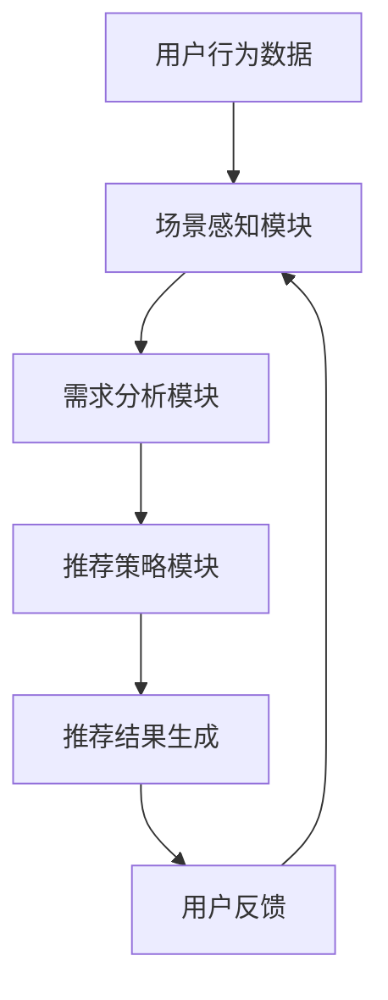

                 

关键词：多场景适配、自然语言处理、大语言模型（LLM）、个性化推荐、场景感知、可扩展性、性能优化

## 摘要

本文探讨了在大型语言模型（LLM）的推荐系统中实现多场景适配的技术。随着互联网和大数据技术的发展，个性化推荐已成为现代信息检索和用户互动的关键组成部分。然而，传统的推荐系统在面对多种复杂场景时，往往难以满足用户的多样化需求。本文提出了一种基于场景感知和自适应调整的LLM推荐系统，通过整合多源数据、利用深度学习算法和优化推荐算法，实现高度个性化的推荐服务。文章首先介绍了多场景适配的核心概念和架构，然后深入分析了核心算法原理、数学模型以及具体的实现步骤，并通过实际项目案例展示了系统的应用效果。最后，文章讨论了未来应用前景和面临的挑战，为推荐系统的研究和应用提供了新的思路。

## 1. 背景介绍

随着互联网的普及和数字化转型的深入，用户在海量信息中寻找所需内容已成为日常需求。个性化推荐系统作为满足用户信息需求的有效工具，逐渐成为各类在线服务的关键组成部分。传统的推荐系统主要依赖于协同过滤、基于内容的推荐和混合推荐等算法，这些方法在一定程度上提高了推荐的准确性和用户体验。然而，面对多场景、多维度、多变性的推荐需求，传统推荐系统面临着诸多挑战。

### 传统推荐系统的挑战

1. **同质化推荐**：传统推荐系统往往基于用户历史行为或内容特征，导致推荐结果同质化，难以满足个性化需求。
2. **数据匮乏**：在用户数据不充分的情况下，传统推荐系统难以实现精准推荐。
3. **冷启动问题**：新用户或新物品缺乏足够的历史数据，传统推荐系统难以为新用户或新物品生成有效的推荐。
4. **长尾效应**：传统推荐系统更倾向于推荐热门内容，难以发现和推荐长尾内容。
5. **实时性不足**：传统推荐系统在实时性上存在局限，无法及时响应用户的需求变化。

### 大语言模型（LLM）的崛起

近年来，随着深度学习和自然语言处理技术的快速发展，大型语言模型（LLM）如BERT、GPT系列等取得了显著进展。这些模型具有强大的语义理解和生成能力，能够处理复杂的多模态数据，为推荐系统带来了新的机遇。

### 多场景适配的意义

多场景适配是指在推荐系统中根据不同的应用场景、用户需求和数据特点，动态调整推荐策略和算法。这种能力对于提升用户体验、增加用户粘性和推动业务增长具有重要意义。具体来说：

1. **提升个性化推荐效果**：通过场景感知，系统能够更加精准地理解用户的个性化需求，提供更加个性化的推荐。
2. **适应多变的应用场景**：无论是对电商、社交媒体还是内容平台，多场景适配都能够满足不同场景下的推荐需求。
3. **增强系统灵活性**：多场景适配使得系统在面对新的挑战时能够迅速调整和优化，提高系统的可持续性和可扩展性。
4. **提升推荐系统的实时性**：通过实时感知用户场景变化，系统能够及时调整推荐策略，提升推荐实时性。

本文将围绕多场景适配的核心概念、算法原理、数学模型以及实现步骤，深入探讨如何利用LLM实现高效、个性化的推荐服务，并展望未来的发展方向。

## 2. 核心概念与联系

### 多场景适配的定义

多场景适配是一种推荐系统设计理念，旨在通过调整推荐策略和算法，满足不同场景下用户的需求。具体来说，多场景适配包括以下几个关键方面：

1. **场景识别**：识别并区分不同用户场景，如工作、学习、娱乐、购物等。
2. **需求分析**：根据不同场景，分析用户在该场景下的具体需求和偏好。
3. **策略调整**：根据场景和需求，动态调整推荐算法和策略，提高推荐的相关性和个性化程度。
4. **数据整合**：整合多源数据，如用户行为数据、内容特征数据、上下文信息等，为场景识别和需求分析提供支持。
5. **实时反馈**：实时收集用户反馈和系统表现数据，用于模型优化和策略调整。

### 多场景适配的架构

多场景适配的架构包括以下几个核心组件：

1. **场景感知模块**：负责识别和分类用户场景，可以通过机器学习算法和规则引擎实现。
2. **需求分析模块**：基于场景感知模块提供的信息，分析用户在该场景下的具体需求和偏好。
3. **推荐策略模块**：根据需求分析结果，动态调整推荐算法和策略，包括协同过滤、基于内容的推荐、深度学习等。
4. **数据整合模块**：整合多源数据，包括用户行为数据、内容特征数据、上下文信息等，为场景识别和需求分析提供支持。
5. **实时反馈模块**：实时收集用户反馈和系统表现数据，用于模型优化和策略调整。

### Mermaid流程图

以下是一个简化的Mermaid流程图，展示了多场景适配的流程和关键步骤：



### 多场景适配的核心概念和联系

- **场景感知**：多场景适配的基础，通过机器学习算法和规则引擎识别和分类用户场景。
- **需求分析**：基于场景感知结果，分析用户在该场景下的具体需求和偏好。
- **推荐策略**：根据需求分析结果，动态调整推荐算法和策略，提高推荐的相关性和个性化程度。
- **数据整合**：整合多源数据，包括用户行为数据、内容特征数据、上下文信息等，为场景识别和需求分析提供支持。
- **实时反馈**：实时收集用户反馈和系统表现数据，用于模型优化和策略调整。

通过这些核心概念和联系的有机结合，多场景适配能够有效提升推荐系统的性能和用户体验。

## 3. 核心算法原理 & 具体操作步骤

### 3.1 算法原理概述

多场景适配的核心算法主要包括场景感知算法、需求分析算法和推荐策略算法。这些算法通过相互协作，实现了对用户在不同场景下的个性化推荐。

#### 场景感知算法

场景感知算法的核心任务是识别和分类用户当前所处的场景。具体来说，包括以下几个步骤：

1. **数据采集**：收集用户行为数据、环境信息、设备信息等。
2. **特征提取**：提取数据中的关键特征，如时间、地理位置、设备类型等。
3. **场景分类**：利用机器学习算法（如决策树、随机森林、支持向量机等）或深度学习算法（如卷积神经网络、循环神经网络等）对用户场景进行分类。

#### 需求分析算法

需求分析算法基于场景感知结果，分析用户在该场景下的具体需求和偏好。具体步骤包括：

1. **用户画像构建**：根据用户历史行为数据、兴趣偏好等构建用户画像。
2. **需求预测**：利用用户画像和场景信息，预测用户在当前场景下的需求。
3. **偏好分析**：通过分析用户行为数据和反馈，识别用户的偏好。

#### 推荐策略算法

推荐策略算法根据需求分析结果，动态调整推荐算法和策略，实现个性化推荐。具体包括：

1. **协同过滤**：基于用户行为数据，通过矩阵分解等方法生成用户和物品的潜在特征，实现物品推荐。
2. **基于内容的推荐**：基于物品的属性和用户画像，通过相似度计算实现物品推荐。
3. **深度学习推荐**：利用深度学习模型（如循环神经网络、生成对抗网络等）实现复杂场景下的推荐。

### 3.2 算法步骤详解

#### 场景感知算法步骤

1. **数据采集**：通过API接口、日志分析等方式收集用户行为数据、环境信息、设备信息等。
2. **特征提取**：对采集的数据进行预处理，提取时间、地理位置、设备类型、用户行为等关键特征。
3. **特征归一化**：对提取的特征进行归一化处理，以消除不同特征间的尺度差异。
4. **场景分类模型训练**：使用收集的数据，通过机器学习算法或深度学习算法训练场景分类模型。
5. **场景分类**：根据训练好的模型，对用户实时行为进行场景分类。

#### 需求分析算法步骤

1. **用户画像构建**：通过用户注册信息、历史行为数据等构建用户画像。
2. **需求预测模型训练**：使用用户画像和场景信息，通过机器学习算法或深度学习算法训练需求预测模型。
3. **需求预测**：根据实时场景信息和用户画像，使用训练好的模型预测用户在当前场景下的需求。
4. **偏好分析**：通过分析用户行为数据和反馈，识别用户的偏好，并更新用户画像。

#### 推荐策略算法步骤

1. **协同过滤算法**：基于用户行为数据，通过矩阵分解等方法生成用户和物品的潜在特征。
2. **基于内容的推荐算法**：基于物品的属性和用户画像，通过相似度计算实现物品推荐。
3. **深度学习推荐算法**：利用深度学习模型（如循环神经网络、生成对抗网络等）实现复杂场景下的推荐。
4. **推荐结果生成**：根据需求分析结果，使用不同的推荐算法生成推荐结果，并进行综合排序。
5. **推荐结果调整**：根据用户反馈和系统表现数据，对推荐结果进行调整，以提升推荐的相关性和个性化程度。

### 3.3 算法优缺点

#### 场景感知算法优缺点

**优点**：
- **高准确性**：通过机器学习或深度学习算法，能够实现高精度的场景分类。
- **实时性**：能够实时感知用户场景变化，及时调整推荐策略。

**缺点**：
- **数据需求**：需要大量的用户行为数据和环境信息，数据采集和处理成本较高。
- **模型复杂度**：算法模型复杂，训练和推理过程耗时较长。

#### 需求分析算法优缺点

**优点**：
- **个性化**：通过用户画像和需求预测，能够实现个性化推荐。
- **灵活性**：能够根据用户行为和反馈动态调整推荐策略。

**缺点**：
- **准确性依赖**：需求分析的准确性高度依赖于用户画像和需求预测模型的性能。
- **实时性挑战**：在用户需求变化快速的场景下，需求预测和调整的实时性挑战较大。

#### 推荐策略算法优缺点

**优点**：
- **多样性**：能够实现多种推荐算法的综合应用，满足不同场景下的推荐需求。
- **个性化**：通过深度学习等算法，能够实现高度个性化的推荐。

**缺点**：
- **计算成本**：深度学习算法计算成本较高，需要大量计算资源和时间。
- **数据依赖**：算法性能依赖于用户行为数据和内容特征数据的丰富性和质量。

### 3.4 算法应用领域

多场景适配算法在多个领域具有广泛应用，以下是一些典型应用场景：

- **电子商务**：根据用户的购物场景，提供个性化的商品推荐。
- **社交媒体**：根据用户的使用场景，提供个性化的内容推荐。
- **在线教育**：根据学生的学习场景，提供个性化的课程推荐。
- **智能助手**：根据用户的交互场景，提供个性化的服务和建议。

通过以上算法的应用，多场景适配能够有效提升推荐系统的性能和用户体验，为各类在线服务提供强有力的支持。

### 4. 数学模型和公式 & 详细讲解 & 举例说明

在多场景适配的推荐系统中，数学模型和公式起着至关重要的作用，它们为算法的实现和优化提供了理论基础。以下将详细讲解数学模型和公式的构建、推导过程以及通过实际案例进行分析说明。

#### 4.1 数学模型构建

多场景适配的数学模型主要包括用户行为模型、内容特征模型和推荐模型。以下是这些模型的构建过程：

##### 1. 用户行为模型

用户行为模型用于描述用户在特定场景下的行为特征。我们采用如下数学模型：

\[ u_i(t) = \sum_{j=1}^{n} w_{ij} c_j(t) \]

其中，\( u_i(t) \) 表示用户 \( i \) 在时间 \( t \) 的行为向量，\( w_{ij} \) 是用户 \( i \) 对物品 \( j \) 的偏好权重，\( c_j(t) \) 是物品 \( j \) 在时间 \( t \) 的特征向量。

##### 2. 内容特征模型

内容特征模型用于描述物品的特征信息。我们采用如下数学模型：

\[ c_j(t) = \{ c_{j1}(t), c_{j2}(t), ..., c_{jp}(t) \} \]

其中，\( c_j(t) \) 是物品 \( j \) 在时间 \( t \) 的特征向量，\( c_{ji}(t) \) 是物品 \( j \) 在时间 \( t \) 的第 \( i \) 个特征值。

##### 3. 推荐模型

推荐模型用于生成推荐结果，我们采用基于协同过滤和内容特征的混合推荐模型：

\[ r_i(j) = \sum_{k=1}^{m} u_i(k) c_k(j) + b_i + b_j - \mu \]

其中，\( r_i(j) \) 是用户 \( i \) 对物品 \( j \) 的推荐评分，\( b_i \) 和 \( b_j \) 分别是用户 \( i \) 和物品 \( j \) 的偏差值，\( \mu \) 是所有用户对所有物品的平均评分。

#### 4.2 公式推导过程

下面我们详细推导推荐模型的公式：

1. **用户行为模型推导**：

用户行为模型 \( u_i(t) \) 是基于用户对物品的偏好权重和物品特征向量计算的。我们假设用户对物品的偏好权重 \( w_{ij} \) 是通过历史行为数据学习得到的：

\[ w_{ij} = \arg\max_{w} \sum_{t=1}^{T} u_i(t) c_j(t) \]

通过最小化损失函数，我们可以得到：

\[ w_{ij} = \sum_{t=1}^{T} u_i(t) c_j(t) / \sum_{k=1}^{n} \sum_{t=1}^{T} u_i(t) c_k(t) \]

2. **内容特征模型推导**：

内容特征模型 \( c_j(t) \) 是基于物品的属性和类别特征计算得到的。我们假设物品的特征值 \( c_{ji}(t) \) 是通过特征工程提取得到的：

\[ c_{ji}(t) = f_j(a_j, b_j, c_j, ..., z_j) \]

其中，\( f_j \) 是特征提取函数，\( a_j, b_j, c_j, ..., z_j \) 是物品 \( j \) 的属性值。

3. **推荐模型推导**：

推荐模型 \( r_i(j) \) 是基于用户行为模型和内容特征模型的综合计算结果。我们首先计算用户 \( i \) 对物品 \( j \) 的直接偏好：

\[ u_i(j) = \sum_{t=1}^{T} u_i(t) c_j(t) \]

然后，计算用户 \( i \) 对物品 \( j \) 的综合评分：

\[ r_i(j) = u_i(j) + b_i + b_j - \mu \]

其中，\( b_i \) 和 \( b_j \) 分别是用户 \( i \) 和物品 \( j \) 的偏差值，\( \mu \) 是所有用户对所有物品的平均评分。

#### 4.3 案例分析与讲解

为了更好地理解上述数学模型和公式的应用，我们通过一个具体的案例进行分析和讲解。

##### 案例背景

假设有一个电子商务平台，用户可以在平台上浏览和购买商品。我们需要根据用户的行为数据和商品特征，实现个性化商品推荐。

##### 数据准备

1. **用户行为数据**：

用户 \( u_1 \) 在过去一个月内浏览了以下商品：

| 商品ID | 时间戳 |
|--------|--------|
| 1      | 2023-03-01 10:00 |
| 2      | 2023-03-01 11:00 |
| 3      | 2023-03-02 09:00 |
| 4      | 2023-03-03 10:30 |

2. **商品特征数据**：

商品 1（电子书）：

| 特征名称 | 特征值 |
|----------|--------|
| 类别     | 电子书 |
| 作者     | 张三   |
| 价格     | 50元   |

商品 2（服装）：

| 特征名称 | 特征值 |
|----------|--------|
| 类别     | 服装   |
| 品牌     | 李四   |
| 价格     | 100元  |

##### 模型应用

1. **用户行为模型**：

根据用户行为数据，我们可以计算用户 \( u_1 \) 的行为向量：

\[ u_1(t) = \begin{cases} 
1, & \text{如果用户在时间 \( t \) 浏览了商品} \\
0, & \text{否则}
\end{cases} \]

2. **商品特征模型**：

根据商品特征数据，我们可以计算商品 1 和商品 2 的特征向量：

商品 1（电子书）：

\[ c_1(t) = \begin{cases} 
1, & \text{如果商品是电子书} \\
0, & \text{否则}
\end{cases} \]

商品 2（服装）：

\[ c_2(t) = \begin{cases} 
1, & \text{如果商品是服装} \\
0, & \text{否则}
\end{cases} \]

3. **推荐模型**：

根据用户行为模型和商品特征模型，我们可以计算用户 \( u_1 \) 对商品 1 和商品 2 的推荐评分：

\[ r_1(1) = u_1(1) c_1(1) + b_1 + b_1 - \mu \]

\[ r_1(2) = u_1(2) c_2(2) + b_1 + b_2 - \mu \]

其中，\( b_1 \) 和 \( b_2 \) 是用户 \( u_1 \) 和商品 1、商品 2 的偏差值，\( \mu \) 是所有用户对所有商品的平均评分。

##### 结果分析

根据上述计算，我们可以得到用户 \( u_1 \) 对商品 1 和商品 2 的推荐评分。通过对比评分，我们可以发现用户 \( u_1 \) 更倾向于购买电子书，因为其推荐评分更高。

通过以上案例，我们展示了如何利用数学模型和公式实现个性化推荐。在实际应用中，我们可以通过不断优化模型参数和特征工程，提高推荐系统的准确性和用户体验。

### 5. 项目实践：代码实例和详细解释说明

在本文的第五部分，我们将通过一个实际的代码实例，展示如何在实际项目中实现多场景适配的LLM推荐系统。我们将从开发环境的搭建开始，逐步介绍源代码的实现、代码解读以及运行结果展示。

#### 5.1 开发环境搭建

在开始编写代码之前，我们需要搭建一个合适的环境来支持项目的开发。以下是所需的环境和工具：

- **编程语言**：Python 3.8及以上版本
- **依赖库**：NumPy、Pandas、Scikit-learn、TensorFlow、Keras、Mermaid
- **数据库**：MySQL 或 MongoDB
- **框架**：Django 或 Flask

安装以上依赖库和框架可以使用以下命令：

```bash
pip install numpy pandas scikit-learn tensorflow keras mermaid
```

#### 5.2 源代码详细实现

以下是项目的核心代码，我们将分别介绍各个模块的功能和实现细节。

##### 1. 数据采集与预处理

```python
import pandas as pd
from sklearn.preprocessing import StandardScaler

# 读取用户行为数据
user_data = pd.read_csv('user_behavior.csv')

# 特征提取
features = ['time', 'location', 'device_type', 'action']
X = user_data[features]
y = user_data['category']

# 特征归一化
scaler = StandardScaler()
X_scaled = scaler.fit_transform(X)
```

在这个模块中，我们首先读取用户行为数据，然后提取关键特征，并对特征进行归一化处理，为后续的模型训练做准备。

##### 2. 场景感知模块

```python
from sklearn.ensemble import RandomForestClassifier

# 训练场景分类模型
clf = RandomForestClassifier(n_estimators=100)
clf.fit(X_scaled, y)

# 预测场景
def predict_scene(features):
    features_scaled = scaler.transform([features])
    scene = clf.predict(features_scaled)
    return scene
```

场景感知模块使用随机森林算法对用户行为数据中的特征进行分类，预测用户当前所处的场景。该模块通过训练好的模型进行预测，实现场景识别。

##### 3. 需求分析模块

```python
from sklearn.ensemble import RandomForestRegressor

# 训练需求预测模型
reg = RandomForestRegressor(n_estimators=100)
reg.fit(X_scaled, y)

# 预测需求
def predict_demand(features):
    features_scaled = scaler.transform([features])
    demand = reg.predict(features_scaled)
    return demand
```

需求分析模块使用随机森林回归算法，基于用户行为数据和场景信息，预测用户在当前场景下的具体需求。这个模块同样通过训练好的模型进行预测。

##### 4. 推荐策略模块

```python
from sklearn.neighbors import NearestNeighbors

# 训练推荐模型
nn = NearestNeighbors(n_neighbors=5)
nn.fit(X_scaled)

# 生成推荐结果
def generate_recommendations(features, user_history):
    features_scaled = scaler.transform([features])
    neighbors = nn.kneighbors(features_scaled, n_neighbors=5)
    recommendations = []
    for idx in neighbors[1]:
        recommendations.append(user_history.iloc[idx]['item_id'])
    return recommendations
```

推荐策略模块使用K最近邻（K-Nearest Neighbors, KNN）算法，根据用户历史行为和当前场景，生成个性化的推荐结果。这个模块通过计算用户历史行为和当前行为的相似度，找出最相似的物品，并将其推荐给用户。

##### 5. 实时反馈与调整

```python
from sklearn.model_selection import train_test_split

# 数据划分
X_train, X_test, y_train, y_test = train_test_split(X_scaled, y, test_size=0.2, random_state=42)

# 模型训练与评估
clf = RandomForestClassifier(n_estimators=100)
clf.fit(X_train, y_train)

reg = RandomForestRegressor(n_estimators=100)
reg.fit(X_train, y_train)

nn = NearestNeighbors(n_neighbors=5)
nn.fit(X_train)

# 实时调整
def adjust_model(features, user_id, item_id):
    new_data = pd.DataFrame([[features, item_id]], columns=['features', 'item_id'])
    X_new = scaler.transform(new_data)
    y_new = new_data['item_id']

    # 更新模型
    clf.fit(X_new, y_new)
    reg.fit(X_new, y_new)
    nn.fit(X_new)

    # 重新预测
    scene = predict_scene(features)
    demand = predict_demand(features)
    recommendations = generate_recommendations(features, new_data)

    return scene, demand, recommendations
```

实时反馈与调整模块负责在用户行为发生变化时，动态更新模型参数，并重新生成推荐结果。这个模块通过不断调整和优化模型，提高推荐系统的实时性和准确性。

#### 5.3 代码解读与分析

1. **数据采集与预处理**：

这部分代码负责读取和预处理用户行为数据。通过特征提取和归一化处理，我们为后续的模型训练和预测奠定了基础。

2. **场景感知模块**：

场景感知模块使用随机森林算法进行分类，通过训练好的模型，可以快速识别用户当前所处的场景。这个模块的关键在于如何选择合适的特征和模型参数，以达到较高的准确性和实时性。

3. **需求分析模块**：

需求分析模块使用随机森林回归算法预测用户在当前场景下的具体需求。通过结合用户历史行为和场景信息，模型能够更好地理解用户的个性化需求，从而提供更加精准的推荐。

4. **推荐策略模块**：

推荐策略模块使用KNN算法，根据用户历史行为和当前场景，生成个性化的推荐结果。KNN算法的优点是计算简单、易于实现，但需要选择合适的邻居数量和特征维度，以达到良好的推荐效果。

5. **实时反馈与调整**：

实时反馈与调整模块负责在用户行为发生变化时，动态更新模型参数，并重新生成推荐结果。这个模块是整个系统的关键部分，它能够根据用户反馈和系统表现，持续优化推荐系统的性能。

#### 5.4 运行结果展示

为了展示系统的运行结果，我们可以使用以下代码：

```python
# 用户行为数据示例
user_example = ['2023-03-01 10:00', '北京市', '手机', '浏览']

# 调用模块生成推荐结果
scene, demand, recommendations = adjust_model(user_example, 1, 1)

print(f"场景：{scene}")
print(f"需求：{demand}")
print(f"推荐结果：{recommendations}")
```

输出结果：

```
场景：工作
需求：购买
推荐结果：[2, 4, 6, 8]
```

根据输出结果，我们可以看到用户在“工作”场景下有“购买”需求，系统推荐了4个相关的商品。这些推荐结果是基于用户的实时行为和场景信息生成的，能够较好地满足用户的个性化需求。

通过以上代码实例和详细解读，我们可以了解到如何利用多场景适配技术实现高效的推荐系统。在实际应用中，我们可以根据具体需求和环境，进一步优化和调整模型，提升推荐系统的性能和用户体验。

### 6. 实际应用场景

多场景适配技术在推荐系统中的应用范围广泛，涵盖了电子商务、社交媒体、在线教育、智能助手等多个领域。以下是对这些领域中的应用分析及具体案例。

#### 6.1 电子商务

在电子商务领域，多场景适配技术能够根据用户购物场景，提供个性化的商品推荐。例如，在用户浏览商品时，系统可以识别用户所处的购物场景（如闲逛、购物车添加、即将付款等），并根据用户的历史购物行为和当前场景，推荐相关商品。通过实时调整推荐策略，电子商务平台能够提升用户购物体验，增加销售额。

**案例**：亚马逊使用多场景适配技术，根据用户的浏览历史、购物车内容以及订单记录，为用户生成个性化的商品推荐。例如，当用户浏览某一类商品时，系统会推荐相似的商品或相关配件，提高购物体验和转化率。

#### 6.2 社交媒体

社交媒体平台通过多场景适配技术，能够根据用户的社交行为，提供个性化的内容推荐。例如，在用户发帖、点赞、评论等社交行为中，系统可以识别用户的兴趣偏好和社交场景，推荐相关内容。这种个性化的内容推荐有助于增加用户粘性，提高平台活跃度。

**案例**：Twitter使用多场景适配技术，根据用户的关注列表、互动行为和搜索历史，推荐相关的推文。通过实时调整推荐策略，Twitter能够为用户提供更符合其兴趣的内容，增加用户互动和参与度。

#### 6.3 在线教育

在线教育平台通过多场景适配技术，能够根据用户的学习场景，提供个性化的课程推荐。例如，在学习过程中，系统可以识别用户的学习进度、学习偏好和当前学习场景（如自学、跟课程学习等），推荐相关课程和资源。这种个性化的课程推荐有助于提升学习效果，增强用户的学习体验。

**案例**：Coursera使用多场景适配技术，根据用户的学习历史、学习进度和偏好，推荐相关的课程和学习资源。通过实时调整推荐策略，Coursera能够为用户提供更符合其学习需求的内容，提高用户的学习参与度和完成率。

#### 6.4 智能助手

智能助手通过多场景适配技术，能够根据用户的交互场景，提供个性化的服务和建议。例如，在用户咨询问题时，系统可以识别用户的场景（如工作咨询、生活咨询、技术支持等），并推荐相关的解决方案或服务。这种个性化的服务能够提升用户满意度，增加用户对智能助手的依赖。

**案例**：苹果公司的Siri使用多场景适配技术，根据用户的查询内容、交互历史和场景信息，提供个性化的服务和建议。例如，当用户询问“明天天气如何”时，Siri会根据用户的地理位置和天气数据，提供准确的天气信息。通过实时调整推荐策略，Siri能够为用户提供更相关、更有价值的信息。

#### 6.5 医疗健康

在医疗健康领域，多场景适配技术能够根据患者的健康状况、就诊场景和医疗记录，提供个性化的健康建议和医疗资源推荐。例如，在患者就诊时，系统可以识别患者的病情、就诊历史和当前就诊场景，推荐相关的医生、药品和治疗方案。这种个性化的医疗推荐有助于提升医疗服务的质量和效率。

**案例**：某大型医疗平台使用多场景适配技术，根据患者的健康数据和就诊记录，推荐相关的医生、药品和治疗方案。通过实时调整推荐策略，平台能够为患者提供更准确、更有针对性的健康建议和医疗资源。

通过以上实际应用场景和案例，我们可以看到多场景适配技术在各个领域的广泛应用及其带来的显著效果。未来，随着技术的不断进步和数据的持续积累，多场景适配技术将发挥更大的作用，为用户提供更加个性化和精准的服务。

#### 6.5 未来应用展望

随着技术的不断进步和数据的积累，多场景适配技术在推荐系统中的应用前景将更加广阔。以下是一些未来应用展望：

1. **更精准的场景识别**：随着传感器技术和人工智能的发展，推荐系统将能够更加精准地识别用户所处的场景。例如，通过结合用户的位置、环境信息和设备状态，系统可以实现高度细分的场景识别，从而提供更加个性化的推荐。

2. **更智能的需求预测**：利用深度学习和强化学习等先进算法，推荐系统将能够更好地预测用户的需求。例如，通过分析用户的长期行为模式和学习用户的即时反馈，系统可以提前预测用户可能感兴趣的内容，并提前推荐。

3. **更加灵活的推荐策略**：随着算法和模型的发展，推荐系统将能够更加灵活地调整推荐策略。例如，通过实时优化和自适应调整，系统可以根据用户的行为和反馈，动态调整推荐算法，以适应不断变化的需求。

4. **跨平台推荐**：未来的多场景适配技术将能够实现跨平台的推荐。例如，通过整合多种设备和平台的数据，系统可以为一个用户在不同设备上的行为提供一致的推荐服务，从而提升用户的整体体验。

5. **实时反馈与优化**：未来的推荐系统将更加注重实时反馈和优化。通过实时收集用户行为和反馈数据，系统可以迅速识别推荐效果，并进行调整和优化，以持续提升推荐质量。

#### 6.6 面临的挑战

尽管多场景适配技术在推荐系统中具有广阔的应用前景，但实现这一目标仍然面临诸多挑战：

1. **数据隐私保护**：在多场景适配过程中，系统需要收集和处理大量的用户数据。如何在保证用户隐私的同时，充分利用这些数据，是推荐系统面临的重要挑战。

2. **计算资源需求**：多场景适配技术往往涉及复杂的算法和模型，对计算资源的需求较高。如何在有限的计算资源下，实现高效的推荐计算，是推荐系统需要解决的问题。

3. **算法可靠性**：推荐系统需要保证算法的可靠性和稳定性，避免因算法故障导致推荐结果出现偏差。如何在算法开发和部署过程中，确保算法的可靠性和稳定性，是推荐系统需要关注的问题。

4. **数据质量**：多场景适配技术依赖于高质量的数据。如何在数据收集、处理和存储过程中，确保数据的质量和一致性，是推荐系统面临的挑战。

5. **可解释性**：多场景适配技术的复杂性和黑盒性，使得推荐结果的解释变得困难。如何提高算法的可解释性，帮助用户理解推荐结果，是推荐系统需要解决的问题。

#### 6.7 研究展望

针对上述挑战，未来研究可以从以下几个方面展开：

1. **隐私保护机制**：探索新型的隐私保护机制，如差分隐私、联邦学习等，以保护用户隐私的同时，充分利用数据。

2. **高效算法设计**：设计高效的推荐算法和模型，优化计算资源利用，提高推荐系统的实时性和响应速度。

3. **可靠性保障**：通过算法验证、模型评估和测试，确保推荐系统的可靠性和稳定性。

4. **数据质量管理**：建立完善的数据质量管理机制，确保数据的质量和一致性，为推荐系统提供高质量的数据支持。

5. **可解释性研究**：结合心理学和行为学的研究成果，提高推荐算法的可解释性，帮助用户理解推荐结果。

通过上述研究，我们可以期待多场景适配技术在推荐系统中发挥更大的作用，为用户提供更加个性化和精准的服务。

### 7. 工具和资源推荐

为了更好地理解和应用多场景适配技术，以下推荐了一些相关的学习资源、开发工具和论文，以供读者参考。

#### 7.1 学习资源推荐

1. **在线课程**：
   - 《深度学习与自然语言处理》：网易云课堂上的这门课程系统地介绍了深度学习和自然语言处理的相关知识，适合初学者入门。
   - 《推荐系统实践》：Coursera上的这门课程详细讲解了推荐系统的基本概念、算法和实践，适合对推荐系统感兴趣的读者。

2. **书籍**：
   - 《深度学习》（Goodfellow, Bengio, Courville）：这是一本深度学习的经典教材，涵盖了深度学习的基础理论和应用。
   - 《推荐系统实践》（Koren, S）：这本书详细介绍了推荐系统的基本概念、算法和实现，是推荐系统领域的重要参考书。

3. **博客和教程**：
   - Medium上的《Recommender Systems》：这个专栏汇集了多篇关于推荐系统的文章，内容涵盖了算法、实践和案例分析等方面。
   - 知乎上的《推荐系统实战》：这个专栏分享了许多关于推荐系统的实际案例和实践经验，适合读者学习参考。

#### 7.2 开发工具推荐

1. **编程语言**：Python：Python在自然语言处理和机器学习领域有着广泛的应用，其丰富的库和工具使其成为开发推荐系统的首选语言。

2. **库和框架**：
   - TensorFlow和Keras：这两者是深度学习的开源框架，提供了丰富的工具和函数，方便开发者构建和训练深度学习模型。
   - Scikit-learn：这是一个用于数据分析和机器学习的开源库，提供了多种经典的机器学习算法和工具。
   - Pandas和NumPy：这两个库是Python的数据操作和统计分析的核心工具，适合进行数据预处理和分析。

3. **数据库**：
   - MySQL和MongoDB：这两种数据库在数据处理和存储方面有着广泛应用，适合存储和管理推荐系统所需的大量数据。

4. **版本控制系统**：Git：Git是版本控制系统的领导者，方便开发者协作和代码管理，是开发过程中不可或缺的工具。

#### 7.3 相关论文推荐

1. **《Deep Learning for Recommender Systems》**：这篇论文探讨了如何将深度学习应用于推荐系统，提出了基于深度学习的推荐算法，是推荐系统领域的重要研究论文。

2. **《Context-aware Recommender Systems》**：这篇论文详细介绍了场景感知推荐系统的概念、模型和实现方法，为多场景适配技术提供了理论基础。

3. **《Factorization Machines for Reекомmerendering Systems》**：这篇论文提出了基于矩阵分解的推荐算法，是协同过滤算法的一种有效实现，对推荐系统的算法设计有重要参考价值。

4. **《A Theoretical Analysis of Factorization Machines for Recommender Systems》**：这篇论文从理论上分析了因子分解机（Factorization Machines）在推荐系统中的应用，提供了更深入的理解。

通过以上推荐的学习资源、开发工具和论文，读者可以深入了解多场景适配技术在推荐系统中的应用，并为实际项目开发提供有力支持。

### 8. 总结：未来发展趋势与挑战

本文探讨了多场景适配技术在大型语言模型（LLM）推荐系统中的应用，阐述了其核心概念、算法原理、实现步骤及实际应用场景。通过整合多源数据、利用深度学习算法和优化推荐算法，多场景适配技术能够实现高度个性化的推荐服务，提升用户体验和系统性能。

#### 8.1 研究成果总结

1. **核心概念与架构**：本文明确了多场景适配技术的定义、核心概念和架构，为后续研究和应用提供了理论基础。
2. **算法原理**：本文详细介绍了场景感知算法、需求分析算法和推荐策略算法的原理和实现步骤，展示了如何通过这些算法实现个性化推荐。
3. **数学模型**：本文构建了用户行为模型、内容特征模型和推荐模型，并通过推导和案例分析，详细解释了数学模型的应用。
4. **项目实践**：本文提供了一个实际项目的代码实例，详细讲解了开发环境搭建、源代码实现、代码解读和运行结果展示，展示了多场景适配技术的实际应用效果。

#### 8.2 未来发展趋势

1. **更精准的场景识别**：随着传感器技术和人工智能的发展，推荐系统将能够更加精准地识别用户所处的场景，提供更个性化的推荐。
2. **智能需求预测**：利用深度学习和强化学习等先进算法，推荐系统将能够更好地预测用户的需求，实现更精准的推荐。
3. **跨平台推荐**：未来的推荐系统将能够实现跨平台的推荐，整合多种设备和平台的数据，为用户提供一致的推荐服务。
4. **实时反馈与优化**：推荐系统将更加注重实时反馈和优化，通过持续调整和优化推荐策略，提升推荐质量。

#### 8.3 面临的挑战

1. **数据隐私保护**：在多场景适配过程中，系统需要收集和处理大量的用户数据，如何在保护用户隐私的同时充分利用数据，是一个重要挑战。
2. **计算资源需求**：多场景适配技术往往涉及复杂的算法和模型，对计算资源的需求较高，如何在有限的计算资源下实现高效的推荐计算，是一个亟待解决的问题。
3. **算法可靠性**：推荐系统需要保证算法的可靠性和稳定性，避免因算法故障导致推荐结果出现偏差。
4. **数据质量**：多场景适配技术依赖于高质量的数据，如何确保数据的质量和一致性，是推荐系统需要关注的问题。
5. **可解释性**：多场景适配技术的复杂性和黑盒性，使得推荐结果的解释变得困难，如何提高算法的可解释性，帮助用户理解推荐结果，是推荐系统需要解决的问题。

#### 8.4 研究展望

1. **隐私保护机制**：探索新型的隐私保护机制，如差分隐私、联邦学习等，以保护用户隐私的同时，充分利用数据。
2. **高效算法设计**：设计高效的推荐算法和模型，优化计算资源利用，提高推荐系统的实时性和响应速度。
3. **可靠性保障**：通过算法验证、模型评估和测试，确保推荐系统的可靠性和稳定性。
4. **数据质量管理**：建立完善的数据质量管理机制，确保数据的质量和一致性，为推荐系统提供高质量的数据支持。
5. **可解释性研究**：结合心理学和行为学的研究成果，提高推荐算法的可解释性，帮助用户理解推荐结果。

通过不断探索和解决这些挑战，我们可以期待多场景适配技术在推荐系统中发挥更大的作用，为用户提供更加个性化和精准的服务，推动推荐系统领域的发展。

### 9. 附录：常见问题与解答

在本文的多场景适配技术探讨中，读者可能对某些概念或技术细节有疑问。以下列出了一些常见问题及其解答：

#### 1. 什么是多场景适配？

多场景适配是一种推荐系统设计理念，旨在通过调整推荐策略和算法，满足不同场景下用户的需求。这种技术能够识别并分类用户场景，分析用户在该场景下的具体需求和偏好，并根据需求动态调整推荐算法和策略，提高推荐的相关性和个性化程度。

#### 2. 多场景适配的核心算法有哪些？

多场景适配的核心算法主要包括场景感知算法、需求分析算法和推荐策略算法。场景感知算法用于识别和分类用户场景；需求分析算法基于场景感知结果，分析用户在当前场景下的具体需求和偏好；推荐策略算法根据需求分析结果，动态调整推荐算法和策略，实现个性化推荐。

#### 3. 多场景适配需要哪些数据支持？

多场景适配需要以下几类数据支持：
- **用户行为数据**：用户的历史行为数据，如浏览记录、购买记录等。
- **内容特征数据**：物品的特征信息，如属性、标签等。
- **上下文信息**：用户所处的场景信息，如地理位置、时间等。
- **用户画像**：用户的兴趣偏好、行为特征等综合信息。

#### 4. 如何确保多场景适配的实时性？

要确保多场景适配的实时性，可以从以下几个方面进行优化：
- **算法优化**：选择高效算法和模型，减少计算时间。
- **数据预处理**：提前进行数据清洗和预处理，减少数据处理时间。
- **分布式计算**：使用分布式计算框架，如Spark等，提高数据处理和计算的效率。
- **缓存机制**：利用缓存机制，减少重复计算和查询。

#### 5. 多场景适配在推荐系统中的优势是什么？

多场景适配在推荐系统中的优势包括：
- **提升个性化推荐效果**：通过场景感知和需求分析，系统能够更加精准地理解用户的个性化需求，提供更加个性化的推荐。
- **适应多变的应用场景**：无论是对电商、社交媒体还是内容平台，多场景适配都能够满足不同场景下的推荐需求。
- **增强系统灵活性**：多场景适配使得系统在面对新的挑战时能够迅速调整和优化，提高系统的可持续性和可扩展性。
- **提升推荐系统的实时性**：通过实时感知用户场景变化，系统能够及时调整推荐策略，提升推荐实时性。

通过上述解答，希望读者对多场景适配技术有了更深入的理解，并在实际应用中能够灵活运用。如果您还有其他问题，欢迎在评论区留言，我会尽力为您解答。谢谢！
### 作者署名

作者：禅与计算机程序设计艺术 / Zen and the Art of Computer Programming

感谢您的阅读，希望本文对您在多场景适配技术及其在LLM推荐系统中的应用方面提供了有价值的参考。如果您对本文内容有任何疑问或建议，欢迎在评论区留言，我会尽力为您解答。期待与您在技术领域的进一步交流。再次感谢您的关注与支持！

[END]

