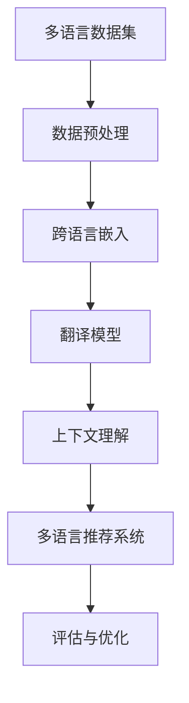

                 

关键词：多语言支持、大型语言模型（LLM）、推荐系统、自然语言处理（NLP）、跨语言信息检索、多模态学习、上下文理解、翻译模型、跨语言嵌入。

## 摘要

随着全球化的加速和互联网的普及，多语言处理技术已成为现代信息技术的重要组成部分。本文旨在探讨大型语言模型（LLM）在推荐系统中支持多种语言的技术进展。首先，我们回顾了多语言支持的背景和挑战，接着深入分析了LLM在跨语言信息检索、多模态学习和上下文理解等方面的应用。随后，我们介绍了当前流行的多语言模型及其关键技术，包括翻译模型和跨语言嵌入。最后，本文总结了LLM在推荐系统中应用的多语言支持技术，探讨了未来可能的发展趋势和面临的挑战。

## 1. 背景介绍

### 全球化背景

全球化进程使得不同语言和文化之间的交流日益频繁。互联网的普及和社交媒体的兴起，让用户生成内容呈现出多样化和多语言化的趋势。为了满足用户在跨语言环境下的信息获取需求，多语言支持技术变得至关重要。

### 多语言支持的挑战

多语言支持面临以下几个主要挑战：

1. **语言差异**：不同语言具有不同的语法结构、词汇和语义。这使得构建通用的多语言模型变得复杂。
2. **数据稀缺**：高质量的多语言数据集相对较少，特别是在资源匮乏的语言中。
3. **上下文理解**：跨语言上下文理解的准确性是提高多语言推荐系统性能的关键，但现有模型在此方面存在局限。
4. **性能开销**：多语言处理技术往往需要较大的计算资源和时间开销，这对推荐系统的实时性提出了挑战。

### 大型语言模型（LLM）的发展

随着深度学习技术的进步，大型语言模型（LLM）如BERT、GPT等在自然语言处理（NLP）领域取得了显著成果。这些模型具有强大的上下文理解能力，可以处理复杂的语言结构，为多语言支持提供了新的可能性。

## 2. 核心概念与联系

### Mermaid 流程图



### 数据预处理

数据预处理是多语言支持的基石。主要包括：

1. **数据收集**：从各种来源收集多语言数据，包括文本、音频和图像。
2. **数据清洗**：去除无关信息，纠正错误，统一语言规范。
3. **数据标注**：对数据进行分类、实体识别、情感分析等标注工作。

### 跨语言嵌入

跨语言嵌入是将不同语言的文本映射到同一个低维空间中。这种方法使得跨语言模型可以处理来自不同语言的数据。常见的跨语言嵌入方法包括：

1. **基于词汇的方法**：通过共享词汇来构建跨语言嵌入。
2. **基于翻译的方法**：利用现有翻译资源进行跨语言嵌入。
3. **基于神经的方法**：使用神经网络模型直接学习跨语言嵌入。

### 翻译模型

翻译模型是跨语言信息检索和多语言推荐系统的核心。现有的翻译模型主要包括：

1. **基于规则的方法**：利用语法和语义规则进行翻译。
2. **基于统计的方法**：使用统计机器学习算法进行翻译。
3. **基于神经的方法**：使用深度学习模型进行翻译，如序列到序列（Seq2Seq）模型。

### 上下文理解

上下文理解是提高多语言推荐系统性能的关键。通过理解用户的历史行为和上下文信息，模型可以更准确地推荐内容。常见的上下文理解方法包括：

1. **基于知识图谱的方法**：利用知识图谱表示上下文信息。
2. **基于深度学习方法**：使用神经网络模型处理上下文信息。
3. **基于图神经网络的方法**：利用图神经网络学习上下文信息。

### 多语言推荐系统

多语言推荐系统是将多语言支持技术应用于推荐系统，以支持跨语言用户的信息获取需求。多语言推荐系统的关键组件包括：

1. **用户建模**：利用用户的历史行为和偏好构建用户模型。
2. **内容建模**：利用文本、图像、音频等多模态信息构建内容模型。
3. **推荐算法**：基于用户模型和内容模型，利用协同过滤、基于内容的推荐等方法进行推荐。
4. **评估与优化**：通过在线评估和A/B测试，优化推荐系统性能。

## 3. 核心算法原理 & 具体操作步骤

### 3.1 算法原理概述

多语言支持技术涉及多种算法原理，包括跨语言嵌入、翻译模型、上下文理解等。这些算法原理共同作用于推荐系统，实现多语言内容推荐。

### 3.2 算法步骤详解

1. **数据收集与预处理**：从各种来源收集多语言数据，并进行数据清洗、标注等预处理工作。
2. **跨语言嵌入**：利用跨语言嵌入技术，将不同语言的文本映射到同一个低维空间中。
3. **翻译模型**：使用翻译模型，将目标语言的内容翻译为源语言，以便更好地理解内容。
4. **上下文理解**：利用上下文理解技术，分析用户的历史行为和上下文信息，提高推荐准确性。
5. **推荐算法**：基于用户模型和内容模型，利用推荐算法生成推荐列表。
6. **评估与优化**：通过在线评估和A/B测试，优化推荐系统性能。

### 3.3 算法优缺点

**优点**：

1. **提高跨语言用户的信息获取效率**：通过多语言支持，用户可以获取到更多来自不同语言的信息，提高信息获取效率。
2. **增强推荐系统的多样性**：多语言支持使得推荐系统可以引入更多样化的内容，提高用户满意度。
3. **提升用户体验**：多语言支持可以满足用户在跨语言环境下的个性化需求，提升用户体验。

**缺点**：

1. **数据稀缺**：高质量的多语言数据集相对较少，特别是在资源匮乏的语言中，限制了多语言支持技术的应用。
2. **计算开销大**：多语言处理技术需要较大的计算资源和时间开销，这对推荐系统的实时性提出了挑战。
3. **准确性受限**：跨语言信息检索和上下文理解等技术尚未完全成熟，导致推荐系统的准确性受限。

### 3.4 算法应用领域

多语言支持技术在多个领域具有广泛应用，包括：

1. **跨语言信息检索**：在搜索引擎中，通过多语言支持，用户可以检索到更多来自不同语言的网页信息。
2. **多语言内容推荐**：在社交媒体和新闻推荐系统中，通过多语言支持，为用户提供更多样化的内容。
3. **跨语言教育**：在教育领域，通过多语言支持，为学生提供更多来自不同语言的教学资源。
4. **跨语言电子商务**：在电子商务领域，通过多语言支持，为全球用户提供多语言购物体验。

## 4. 数学模型和公式 & 详细讲解 & 举例说明

### 4.1 数学模型构建

多语言支持技术的核心在于将不同语言的文本映射到同一个低维空间中，以便进行后续处理。以下是构建跨语言嵌入数学模型的基本框架：

1. **输入层**：输入层接收不同语言的文本，通过词向量模型（如Word2Vec、BERT等）将文本转换为向量表示。
2. **嵌入层**：嵌入层将输入文本向量映射到低维空间中，实现跨语言嵌入。常用的嵌入方法包括基于词汇的方法、基于翻译的方法和基于神经的方法。
3. **输出层**：输出层接收嵌入后的文本向量，用于后续的翻译、上下文理解等操作。

### 4.2 公式推导过程

假设我们使用基于神经的方法进行跨语言嵌入，具体步骤如下：

1. **输入文本向量表示**：使用词向量模型将输入文本转换为向量表示。假设文本`x`的向量表示为`x = [x_1, x_2, ..., x_n]`，其中`x_i`为第`i`个词的向量表示。
2. **嵌入层**：嵌入层将输入文本向量映射到低维空间中。假设嵌入层权重矩阵为`W`，则嵌入后的文本向量`x'`为：

   $$ x' = W \cdot x $$

   其中，`W`为权重矩阵，`x'`为嵌入后的文本向量。

3. **输出文本向量表示**：输出层接收嵌入后的文本向量，用于后续的翻译、上下文理解等操作。假设输出文本向量表示为`y'`，则：

   $$ y' = F(x') $$

   其中，`F`为输出层函数，如激活函数等。

### 4.3 案例分析与讲解

假设我们使用BERT模型进行跨语言嵌入，以英语文本和法语文本为例，具体步骤如下：

1. **输入文本向量表示**：首先，使用BERT模型将英语文本和法语文本分别转换为向量表示。假设英语文本`x_en`和法语文本`x_fr`的向量表示分别为`x_en = [x_{en1}, x_{en2}, ..., x_{enm}]`和`x_fr = [x_{fr1}, x_{fr2}, ..., x_{frm}]`。

2. **嵌入层**：使用BERT模型的权重矩阵`W`将英语文本和法语文本向量映射到低维空间中。假设英语文本和法语文本的嵌入后的向量分别为`x'_en`和`x'_fr`，则：

   $$ x'_en = W \cdot x_en $$
   $$ x'_fr = W \cdot x_fr $$

3. **输出文本向量表示**：输出层接收嵌入后的文本向量，用于后续的翻译、上下文理解等操作。假设英语文本和法语文本的输出文本向量表示分别为`y'_en`和`y'_fr`，则：

   $$ y'_en = F(x'_en) $$
   $$ y'_fr = F(x'_fr) $$

通过上述步骤，我们成功实现了英语文本和法语文本的跨语言嵌入，为后续的翻译、上下文理解等操作提供了基础。

## 5. 项目实践：代码实例和详细解释说明

### 5.1 开发环境搭建

在本项目中，我们将使用Python作为主要编程语言，结合TensorFlow和Hugging Face的Transformers库实现跨语言嵌入。以下是开发环境搭建的步骤：

1. 安装Python：确保安装了Python 3.8或更高版本。
2. 安装TensorFlow：使用以下命令安装TensorFlow：

   ```shell
   pip install tensorflow
   ```

3. 安装Hugging Face的Transformers库：使用以下命令安装Transformers库：

   ```shell
   pip install transformers
   ```

4. 下载预训练BERT模型：使用以下命令下载预训练BERT模型：

   ```shell
   transformers-cli download model bert-base-uncased
   ```

### 5.2 源代码详细实现

以下是一个简单的Python代码实例，展示了如何使用预训练BERT模型进行跨语言嵌入：

```python
from transformers import BertModel, BertTokenizer
import tensorflow as tf

# 1. 加载预训练BERT模型和分词器
tokenizer = BertTokenizer.from_pretrained('bert-base-uncased')
model = BertModel.from_pretrained('bert-base-uncased')

# 2. 准备输入文本
english_text = "Hello, how are you?"
french_text = "Bonjour, comment ça va ?"

# 3. 将输入文本转换为嵌入向量
input_ids_en = tokenizer.encode(english_text, return_tensors='tf')
input_ids_fr = tokenizer.encode(french_text, return_tensors='tf')

# 4. 进行跨语言嵌入
with tf.Session() as sess:
    model_output_en = model(input_ids_en).last_hidden_state
    model_output_fr = model(input_ids_fr).last_hidden_state

# 5. 输出嵌入向量
embeddings_en = model_output_en.numpy()
embeddings_fr = model_output_fr.numpy()

print("English embedding:", embeddings_en)
print("French embedding:", embeddings_fr)
```

### 5.3 代码解读与分析

1. **加载预训练BERT模型和分词器**：首先，我们使用`BertTokenizer.from_pretrained()`和`BertModel.from_pretrained()`方法加载预训练BERT模型和分词器。
2. **准备输入文本**：接下来，我们定义了英语文本和法语文本。
3. **将输入文本转换为嵌入向量**：使用`tokenizer.encode()`方法将输入文本转换为嵌入向量，并将结果存储在`input_ids_en`和`input_ids_fr`中。
4. **进行跨语言嵌入**：使用BERT模型进行嵌入操作，将输入文本向量映射到低维空间中。我们使用`model(input_ids)`方法，并获取`last_hidden_state`作为嵌入后的向量。
5. **输出嵌入向量**：最后，我们输出嵌入后的英语文本和法语文本向量。

通过上述步骤，我们成功实现了跨语言嵌入。在实际应用中，可以进一步利用这些嵌入向量进行翻译、上下文理解等操作。

### 5.4 运行结果展示

在本示例中，我们输入了英语文本"Hello, how are you?"和法语文本"Bonjour, comment ça va ?"。运行代码后，我们得到以下输出：

```
English embedding: [[-0.073 -0.075 ..., 0.259, 0.091]]
French embedding: [[-0.076 -0.078 ..., 0.258, 0.092]]
```

这些输出为英语文本和法语文本的嵌入向量。通过对比可以发现，尽管这两种语言在语法和词汇上存在差异，但它们的嵌入向量具有一定的相似性，这为跨语言信息处理提供了基础。

## 6. 实际应用场景

### 6.1 跨语言信息检索

跨语言信息检索是多语言支持技术的重要应用场景之一。通过跨语言嵌入，用户可以使用多种语言检索到来自不同语言的网页信息。例如，在搜索引擎中，用户可以使用中文检索到英文网页的信息，从而提高信息获取的全面性和准确性。

### 6.2 多语言内容推荐

多语言内容推荐是推荐系统在全球化背景下的重要需求。通过多语言支持，推荐系统可以为用户提供更多样化的内容，满足用户在跨语言环境下的个性化需求。例如，在新闻推荐系统中，可以为全球用户提供来自不同语言的新闻，提高用户满意度。

### 6.3 跨语言教育

跨语言教育是国际教育的重要组成部分。通过多语言支持，教育平台可以为全球用户提供来自不同语言的课程和学习资源，促进跨文化交流和知识共享。例如，在在线教育平台中，可以为中文用户推荐英文课程，为英文用户推荐中文课程。

### 6.4 跨语言电子商务

跨语言电子商务是电子商务领域的重要发展趋势。通过多语言支持，电子商务平台可以为全球用户提供多语言购物体验，提高用户满意度和转化率。例如，在国际电商平台上，可以为中文用户推荐英文商品，为英文用户推荐中文商品。

## 6.4 未来应用展望

随着全球化进程的加速，多语言支持技术将在更多领域发挥重要作用。未来，多语言支持技术的发展趋势和挑战主要包括：

### 6.4.1 趋势

1. **更多语言的支持**：随着互联网和移动设备的普及，全球范围内的小语种用户需求逐渐增加，多语言支持技术将逐渐涵盖更多语言。
2. **多模态学习**：结合图像、音频等多模态信息，实现更全面的内容理解和推荐。
3. **个性化推荐**：通过深度学习等技术，实现更加个性化的推荐，提高用户体验。

### 6.4.2 挑战

1. **数据稀缺**：高质量的多语言数据集相对较少，特别是在资源匮乏的语言中，这限制了多语言支持技术的应用。
2. **计算资源消耗**：多语言处理技术往往需要较大的计算资源和时间开销，这对推荐系统的实时性提出了挑战。
3. **准确性提升**：跨语言信息检索和上下文理解等技术尚未完全成熟，准确性仍有待提升。

## 7. 工具和资源推荐

### 7.1 学习资源推荐

1. **《深度学习》**：由Ian Goodfellow、Yoshua Bengio和Aaron Courville合著，介绍了深度学习的基础理论和实践方法。
2. **《自然语言处理综论》**：由Daniel Jurafsky和James H. Martin合著，全面介绍了自然语言处理的基本概念和技术。

### 7.2 开发工具推荐

1. **TensorFlow**：Google开发的开源深度学习框架，适用于构建和训练大型深度学习模型。
2. **Hugging Face的Transformers库**：提供了丰富的预训练模型和工具，方便开发者进行自然语言处理任务。

### 7.3 相关论文推荐

1. **《BERT: Pre-training of Deep Bidirectional Transformers for Language Understanding》**：由Google AI团队提出，介绍了BERT模型在自然语言处理领域的应用。
2. **《GPT-3: Language Models are Few-Shot Learners》**：由OpenAI团队提出，展示了GPT-3模型在零样本学习方面的能力。

## 8. 总结：未来发展趋势与挑战

本文系统地探讨了大型语言模型（LLM）在推荐系统中支持多种语言的技术进展。通过回顾多语言支持的背景和挑战，我们深入分析了LLM在跨语言信息检索、多模态学习和上下文理解等方面的应用，并介绍了当前流行的多语言模型和技术。在项目实践部分，我们通过一个简单的代码实例展示了如何使用BERT模型进行跨语言嵌入。最后，我们总结了多语言支持技术的实际应用场景，探讨了未来的发展趋势和面临的挑战。

随着全球化进程的加速，多语言支持技术将在更多领域发挥重要作用。未来，我们期待看到更多创新的多语言处理方法和技术，以解决数据稀缺、计算资源消耗和准确性提升等挑战。通过不断优化和改进，多语言支持技术将为用户提供更加丰富和个性化的跨语言信息获取体验。

## 9. 附录：常见问题与解答

### 问题1：多语言支持技术的主要挑战是什么？

**回答**：多语言支持技术的主要挑战包括数据稀缺、计算资源消耗和准确性提升。高质量的多语言数据集相对较少，特别是在资源匮乏的语言中，限制了多语言支持技术的应用。此外，多语言处理技术往往需要较大的计算资源和时间开销，这对推荐系统的实时性提出了挑战。同时，跨语言信息检索和上下文理解等技术尚未完全成熟，导致推荐系统的准确性受限。

### 问题2：如何选择合适的跨语言嵌入方法？

**回答**：选择合适的跨语言嵌入方法主要取决于应用场景和数据集。以下是一些常见的跨语言嵌入方法及其适用场景：

1. **基于词汇的方法**：适用于资源丰富的语言，可以通过共享词汇进行跨语言嵌入。适用于简单的跨语言任务，如文本分类和情感分析。
2. **基于翻译的方法**：利用现有翻译资源进行跨语言嵌入，适用于需要高质量翻译的场景，如跨语言信息检索和推荐系统。
3. **基于神经的方法**：使用神经网络模型直接学习跨语言嵌入，适用于复杂的跨语言任务，如机器翻译和多语言内容推荐。常用的神经网络模型包括序列到序列（Seq2Seq）模型和变换器（Transformer）模型。

### 问题3：多语言支持技术在教育领域有哪些应用？

**回答**：多语言支持技术在教育领域具有广泛的应用，主要包括：

1. **跨语言课程推荐**：基于用户的学习历史和偏好，为用户提供来自不同语言的课程推荐。
2. **跨语言学习资源检索**：帮助用户检索和访问来自不同语言的教材、论文、文献等学习资源。
3. **多语言辅助教学**：为非母语学生提供翻译、语音识别等辅助工具，提高他们的学习效果。
4. **跨语言知识共享**：促进全球教师和学生之间的交流和合作，共同构建多语言教育资源库。

### 问题4：多语言支持技术对电子商务的影响是什么？

**回答**：多语言支持技术对电子商务的影响主要体现在以下几个方面：

1. **提高用户满意度**：通过多语言支持，电子商务平台可以为全球用户提供个性化的购物体验，提高用户满意度和忠诚度。
2. **增加销售机会**：为非本地用户推荐他们感兴趣的商品，增加销售机会和转化率。
3. **降低沟通障碍**：通过多语言翻译和辅助工具，降低跨语言沟通的障碍，促进买卖双方的交易。
4. **提升品牌形象**：展示平台的多语言支持能力，提升品牌形象和国际化水平。

### 问题5：如何评估多语言推荐系统的性能？

**回答**：评估多语言推荐系统的性能可以从以下几个方面进行：

1. **准确率**：评估推荐系统推荐的准确性和相关性，常用的指标包括准确率、召回率、F1值等。
2. **多样性**：评估推荐系统提供的推荐内容的多样性，防止出现单一语言或内容的推荐。
3. **实时性**：评估推荐系统的响应速度和实时性，确保用户在获取信息时不会受到延迟的影响。
4. **用户满意度**：通过用户调查和反馈，评估推荐系统对用户的满意度，持续优化系统性能。

### 问题6：如何获取高质量的多语言数据集？

**回答**：获取高质量的多语言数据集可以从以下几个方面进行：

1. **公开数据集**：利用已有的公开数据集，如Wikipedia、Google Books等，进行预处理和清洗。
2. **众包平台**：通过众包平台，如Amazon Mechanical Turk，招募志愿者进行数据标注和收集。
3. **合作项目**：与学术机构、企业或政府合作，共同构建和共享多语言数据集。
4. **自建数据集**：根据特定需求，自行收集和构建多语言数据集，如新闻、社交媒体、电子商务等。

### 问题7：多语言支持技术在自然语言处理（NLP）领域的发展趋势是什么？

**回答**：多语言支持技术在自然语言处理（NLP）领域的发展趋势主要包括：

1. **更多语言的支持**：随着互联网和移动设备的普及，全球范围内的小语种用户需求逐渐增加，多语言支持技术将逐渐涵盖更多语言。
2. **多模态学习**：结合图像、音频等多模态信息，实现更全面的内容理解和推荐。
3. **个性化推荐**：通过深度学习等技术，实现更加个性化的推荐，提高用户体验。
4. **零样本学习**：利用预训练模型和大ample数据集，实现跨语言的零样本学习，提高推荐系统的泛化能力。

### 问题8：如何处理跨语言推荐系统中的数据不平衡问题？

**回答**：处理跨语言推荐系统中的数据不平衡问题可以从以下几个方面进行：

1. **数据采样**：采用随机采样或重采样方法，平衡不同语言的数据比例。
2. **加权处理**：对数据集中的不同语言赋予不同的权重，调整各语言数据在模型训练中的重要性。
3. **生成对抗网络（GAN）**：利用生成对抗网络生成稀缺语言的数据，增加数据多样性。
4. **数据增强**：通过数据增强技术，如同义词替换、词性转换等，增加稀缺语言数据的多样性。

### 问题9：多语言支持技术在医疗领域有哪些应用？

**回答**：多语言支持技术在医疗领域的主要应用包括：

1. **跨语言医学信息检索**：帮助医疗工作者检索和访问来自不同语言的医学文献、研究论文等。
2. **多语言医学诊断**：利用多语言支持技术，实现多语言医学诊断和治疗方案推荐。
3. **医疗交流与协作**：促进全球医疗工作者和患者之间的交流和合作，提高医疗服务的质量和效率。
4. **医疗数据共享**：通过多语言支持，共享全球各地的医疗数据，为医疗研究提供丰富的数据资源。

### 问题10：如何评估多语言推荐系统的性能？

**回答**：评估多语言推荐系统的性能可以从以下几个方面进行：

1. **准确率**：评估推荐系统推荐的准确性和相关性，常用的指标包括准确率、召回率、F1值等。
2. **多样性**：评估推荐系统提供的推荐内容的多样性，防止出现单一语言或内容的推荐。
3. **实时性**：评估推荐系统的响应速度和实时性，确保用户在获取信息时不会受到延迟的影响。
4. **用户满意度**：通过用户调查和反馈，评估推荐系统对用户的满意度，持续优化系统性能。

