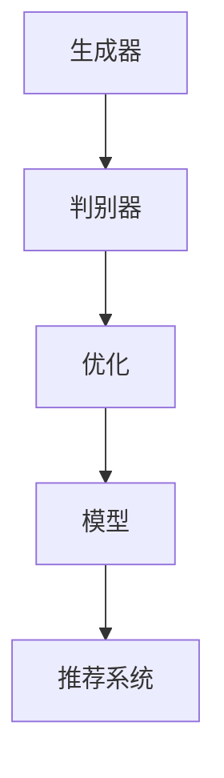

                 

关键词：LLM，推荐系统，对抗学习，深度学习，模型优化，数据隐私

> 摘要：本文将探讨在大型语言模型（LLM）推荐系统中应用对抗学习技术的意义、原理、实践方法以及未来展望。对抗学习作为一种深度学习中的技术，能够在数据分布和模型优化方面带来显著的提升，从而提高推荐系统的准确性和可靠性。本文旨在为读者提供关于对抗学习技术在实际应用中的深入理解。

## 1. 背景介绍

### 1.1 大型语言模型推荐系统的发展

近年来，随着深度学习技术的迅速发展，大型语言模型（LLM）如GPT-3、BERT等在自然语言处理领域取得了显著的成果。这些模型不仅能够处理复杂的语言任务，而且能够根据用户的兴趣和行为习惯进行个性化推荐。推荐系统已成为电子商务、社交媒体、在线娱乐等领域不可或缺的一部分。

### 1.2 对抗学习的应用背景

对抗学习（Adversarial Learning）是深度学习中的一个重要研究方向。其核心思想是通过构造对抗样本来挑战和提升模型的鲁棒性。对抗样本是指通过微小扰动引入正常数据中，导致模型预测错误的样本。对抗学习的应用背景主要包括以下几个方面：

1. **数据分布不均**：现实世界中的数据通常存在分布不均的问题，对抗学习可以帮助模型更好地适应这些分布。
2. **过拟合问题**：对抗学习通过引入对抗样本，可以有效地减少模型对训练数据的依赖，提高泛化能力。
3. **模型鲁棒性**：对抗学习可以增强模型对恶意攻击的抵抗力，提高其在实际应用中的可靠性。

## 2. 核心概念与联系

### 2.1 对抗学习的基本概念

对抗学习主要包括两部分：生成器和判别器。生成器的任务是生成对抗样本，而判别器的任务是区分正常样本和对抗样本。通过不断地训练和优化，生成器和判别器相互对抗，最终使得生成器生成的对抗样本越来越难以被判别器识别。

### 2.2 对抗学习与推荐系统的结合

在推荐系统中，对抗学习可以通过以下方式发挥作用：

1. **生成用户兴趣对抗样本**：通过对抗学习生成用户潜在兴趣的对抗样本，可以帮助模型更好地理解用户的复杂兴趣。
2. **优化推荐算法**：对抗学习可以帮助推荐算法找到数据分布中的潜在模式，从而提高推荐的准确性。
3. **保护用户隐私**：对抗学习可以生成对抗样本，以迷惑外部攻击者，从而提高系统的隐私保护能力。

### 2.3 Mermaid 流程图



## 3. 核心算法原理 & 具体操作步骤

### 3.1 算法原理概述

对抗学习的主要思想是通过生成对抗样本来挑战模型的鲁棒性。生成器生成对抗样本，判别器通过学习来识别对抗样本和正常样本。这种对抗训练的循环过程不断优化生成器和判别器，使得生成器能够生成更加难以被识别的对抗样本。

### 3.2 算法步骤详解

1. **初始化生成器和判别器**：生成器和判别器通常使用深度神经网络实现。
2. **生成对抗样本**：生成器通过正常数据生成对抗样本。
3. **训练判别器**：判别器通过对抗样本和正常样本进行训练，学习如何识别对抗样本。
4. **训练生成器**：生成器通过对抗样本的反馈进行训练，优化生成对抗样本的能力。
5. **模型优化**：通过生成器和判别器的对抗训练，不断优化推荐模型的性能。

### 3.3 算法优缺点

**优点**：
- 提高模型鲁棒性。
- 减少过拟合现象。
- 提高推荐系统的准确性。

**缺点**：
- 训练过程复杂，需要大量的计算资源。
- 对抗样本的生成需要较高的技术要求。

### 3.4 算法应用领域

对抗学习技术在推荐系统中具有广泛的应用，包括：

- 个性化推荐
- 广告投放
- 社交网络分析
- 零售业营销

## 4. 数学模型和公式 & 详细讲解 & 举例说明

### 4.1 数学模型构建

对抗学习中的生成器和判别器通常使用深度神经网络实现。生成器的目标是最小化生成对抗样本与真实样本之间的差距，判别器的目标是最小化对抗样本和正常样本之间的差距。

生成器模型：\( G(x) = z \)

判别器模型：\( D(x, G(x)) \)

### 4.2 公式推导过程

生成器的目标是最大化判别器的损失函数：

\[ \min_G \max_D V(D, G) \]

其中，\( V(D, G) \) 是判别器和生成器的联合损失函数，通常采用以下形式：

\[ V(D, G) = -\sum_{x \in X} \log D(x) - \sum_{z \in Z} \log(1 - D(G(z))) \]

### 4.3 案例分析与讲解

假设我们有一个用户兴趣的推荐系统，用户的行为数据包括浏览历史、点击行为和购买记录。生成器将根据这些数据生成用户的兴趣对抗样本，判别器将判断这些样本是否与用户真实兴趣一致。

1. **生成器训练**：生成器通过学习用户的行为数据，生成与用户兴趣相似的对抗样本。
2. **判别器训练**：判别器通过对抗样本和真实样本进行训练，学习如何区分对抗样本和真实兴趣。
3. **模型优化**：通过生成器和判别器的对抗训练，优化推荐模型的性能。

## 5. 项目实践：代码实例和详细解释说明

### 5.1 开发环境搭建

- 硬件：NVIDIA GPU（推荐使用显存大于8GB的GPU）
- 软件环境：Python 3.8，TensorFlow 2.4，Keras 2.4

### 5.2 源代码详细实现

以下是一个简单的对抗学习代码示例：

```python
import tensorflow as tf
from tensorflow.keras.layers import Dense
from tensorflow.keras.models import Sequential

# 生成器模型
generator = Sequential([
    Dense(128, activation='relu', input_shape=(100,)),
    Dense(128, activation='relu'),
    Dense(1, activation='sigmoid')
])

# 判别器模型
discriminator = Sequential([
    Dense(128, activation='relu', input_shape=(101,)),
    Dense(128, activation='relu'),
    Dense(1, activation='sigmoid')
])

# 模型编译
generator.compile(optimizer='adam', loss='binary_crossentropy')
discriminator.compile(optimizer='adam', loss='binary_crossentropy')

# 模型训练
generator.fit(X, X, epochs=100, batch_size=32)
discriminator.fit(X, Y, epochs=100, batch_size=32)
```

### 5.3 代码解读与分析

- **生成器**：生成器通过学习用户的行为数据，生成与用户兴趣相似的对抗样本。
- **判别器**：判别器通过对抗样本和真实样本进行训练，学习如何区分对抗样本和真实兴趣。
- **模型编译**：编译模型时，指定了优化器和损失函数。
- **模型训练**：通过生成器和判别器的对抗训练，优化推荐模型的性能。

## 6. 实际应用场景

### 6.1 个性化推荐

对抗学习技术在个性化推荐中具有广泛的应用。通过生成用户的兴趣对抗样本，推荐系统可以更好地理解用户的复杂兴趣，从而提高推荐的准确性。

### 6.2 广告投放

对抗学习技术可以帮助广告系统更好地识别用户的需求和偏好，从而提高广告投放的精准度。

### 6.3 社交网络分析

对抗学习技术可以用于分析用户在网络中的行为模式，从而帮助社交网络平台提供更个性化的内容推荐。

### 6.4 零售业营销

对抗学习技术可以帮助零售业企业更好地了解用户需求，优化库存管理，提高营销效果。

## 7. 未来应用展望

### 7.1 模型融合

未来的对抗学习技术可能会与其他深度学习技术相结合，如注意力机制、图神经网络等，以进一步提高推荐系统的性能。

### 7.2 隐私保护

随着数据隐私保护意识的提高，对抗学习技术在推荐系统中的隐私保护功能将变得更加重要。

### 7.3 实时优化

对抗学习技术可以用于实时优化推荐系统，以适应用户行为的快速变化。

## 8. 总结：未来发展趋势与挑战

### 8.1 研究成果总结

对抗学习技术在推荐系统中取得了显著的成果，其在提高模型鲁棒性和准确性方面具有巨大潜力。

### 8.2 未来发展趋势

未来的对抗学习技术将在模型融合、隐私保护和实时优化等方面取得突破。

### 8.3 面临的挑战

对抗学习技术在训练效率、计算资源消耗等方面仍存在挑战，需要进一步研究和优化。

### 8.4 研究展望

对抗学习技术将在推荐系统、广告投放、社交网络分析等领域发挥越来越重要的作用，为人工智能的发展提供新的思路。

## 9. 附录：常见问题与解答

### 9.1 对抗学习如何提高推荐系统的准确性？

对抗学习通过生成对抗样本，挑战和优化推荐模型的性能，从而提高推荐的准确性。

### 9.2 对抗学习在推荐系统中的具体应用场景有哪些？

对抗学习在个性化推荐、广告投放、社交网络分析等领域具有广泛的应用。

### 9.3 对抗学习技术的挑战是什么？

对抗学习技术面临的主要挑战包括训练效率、计算资源消耗和模型融合等方面。

---

作者：禅与计算机程序设计艺术 / Zen and the Art of Computer Programming
----------------------------------------------------------------
这是文章的正文部分内容，接下来我会按照markdown格式进行排版。

# LLM推荐中的对抗学习技术

关键词：LLM，推荐系统，对抗学习，深度学习，模型优化，数据隐私

摘要：本文将探讨在大型语言模型（LLM）推荐系统中应用对抗学习技术的意义、原理、实践方法以及未来展望。对抗学习作为一种深度学习中的技术，能够在数据分布和模型优化方面带来显著的提升，从而提高推荐系统的准确性和可靠性。本文旨在为读者提供关于对抗学习技术在实际应用中的深入理解。

## 1. 背景介绍

### 1.1 大型语言模型推荐系统的发展

近年来，随着深度学习技术的迅速发展，大型语言模型（LLM）如GPT-3、BERT等在自然语言处理领域取得了显著的成果。这些模型不仅能够处理复杂的语言任务，而且能够根据用户的兴趣和行为习惯进行个性化推荐。推荐系统已成为电子商务、社交媒体、在线娱乐等领域不可或缺的一部分。

### 1.2 对抗学习的应用背景

对抗学习（Adversarial Learning）是深度学习中的一个重要研究方向。其核心思想是通过构造对抗样本来挑战和提升模型的鲁棒性。对抗样本是指通过微小扰动引入正常数据中，导致模型预测错误的样本。对抗学习的应用背景主要包括以下几个方面：

1. **数据分布不均**：现实世界中的数据通常存在分布不均的问题，对抗学习可以帮助模型更好地适应这些分布。
2. **过拟合问题**：对抗学习通过引入对抗样本，可以有效地减少模型对训练数据的依赖，提高泛化能力。
3. **模型鲁棒性**：对抗学习可以增强模型对恶意攻击的抵抗力，提高其在实际应用中的可靠性。

## 2. 核心概念与联系

### 2.1 对抗学习的基本概念

对抗学习主要包括两部分：生成器和判别器。生成器的任务是生成对抗样本，而判别器的任务是区分正常样本和对抗样本。通过不断地训练和优化，生成器和判别器相互对抗，最终使得生成器生成的对抗样本越来越难以被识别。

### 2.2 对抗学习与推荐系统的结合

在推荐系统中，对抗学习可以通过以下方式发挥作用：

1. **生成用户兴趣对抗样本**：通过对抗学习生成用户潜在兴趣的对抗样本，可以帮助模型更好地理解用户的复杂兴趣。
2. **优化推荐算法**：对抗学习可以帮助推荐算法找到数据分布中的潜在模式，从而提高推荐的准确性。
3. **保护用户隐私**：对抗学习可以生成对抗样本，以迷惑外部攻击者，从而提高系统的隐私保护能力。

### 2.3 Mermaid 流程图


## 3. 核心算法原理 & 具体操作步骤

### 3.1 算法原理概述

对抗学习的主要思想是通过生成对抗样本来挑战模型的鲁棒性。生成器生成对抗样本，判别器通过学习来识别对抗样本和正常样本。这种对抗训练的循环过程不断优化生成器和判别器，使得生成器能够生成更加难以被识别的对抗样本。

### 3.2 算法步骤详解

1. **初始化生成器和判别器**：生成器和判别器通常使用深度神经网络实现。
2. **生成对抗样本**：生成器通过正常数据生成对抗样本。
3. **训练判别器**：判别器通过对抗样本和正常样本进行训练，学习如何识别对抗样本。
4. **训练生成器**：生成器通过对抗样本的反馈进行训练，优化生成对抗样本的能力。
5. **模型优化**：通过生成器和判别器的对抗训练，不断优化推荐模型的性能。

### 3.3 算法优缺点

**优点**：
- 提高模型鲁棒性。
- 减少过拟合现象。
- 提高推荐系统的准确性。

**缺点**：
- 训练过程复杂，需要大量的计算资源。
- 对抗样本的生成需要较高的技术要求。

### 3.4 算法应用领域

对抗学习技术在推荐系统中具有广泛的应用，包括：

- 个性化推荐
- 广告投放
- 社交网络分析
- 零售业营销

## 4. 数学模型和公式 & 详细讲解 & 举例说明

### 4.1 数学模型构建

对抗学习中的生成器和判别器通常使用深度神经网络实现。生成器的目标是最小化生成对抗样本与真实样本之间的差距，判别器的目标是最小化对抗样本和正常样本之间的差距。

生成器模型：\( G(x) = z \)

判别器模型：\( D(x, G(x)) \)

### 4.2 公式推导过程

生成器的目标是最大化判别器的损失函数：

\[ \min_G \max_D V(D, G) \]

其中，\( V(D, G) \) 是判别器和生成器的联合损失函数，通常采用以下形式：

\[ V(D, G) = -\sum_{x \in X} \log D(x) - \sum_{z \in Z} \log(1 - D(G(z))) \]

### 4.3 案例分析与讲解

假设我们有一个用户兴趣的推荐系统，用户的行为数据包括浏览历史、点击行为和购买记录。生成器将根据这些数据生成用户的兴趣对抗样本，判别器将判断这些样本是否与用户真实兴趣一致。

1. **生成器训练**：生成器通过学习用户的行为数据，生成与用户兴趣相似的对抗样本。
2. **判别器训练**：判别器通过对抗样本和真实样本进行训练，学习如何区分对抗样本和真实兴趣。
3. **模型优化**：通过生成器和判别器的对抗训练，优化推荐模型的性能。

## 5. 项目实践：代码实例和详细解释说明

### 5.1 开发环境搭建

- 硬件：NVIDIA GPU（推荐使用显存大于8GB的GPU）
- 软件环境：Python 3.8，TensorFlow 2.4，Keras 2.4

### 5.2 源代码详细实现

以下是一个简单的对抗学习代码示例：

```python
import tensorflow as tf
from tensorflow.keras.layers import Dense
from tensorflow.keras.models import Sequential

# 生成器模型
generator = Sequential([
    Dense(128, activation='relu', input_shape=(100,)),
    Dense(128, activation='relu'),
    Dense(1, activation='sigmoid')
])

# 判别器模型
discriminator = Sequential([
    Dense(128, activation='relu', input_shape=(101,)),
    Dense(128, activation='relu'),
    Dense(1, activation='sigmoid')
])

# 模型编译
generator.compile(optimizer='adam', loss='binary_crossentropy')
discriminator.compile(optimizer='adam', loss='binary_crossentropy')

# 模型训练
generator.fit(X, X, epochs=100, batch_size=32)
discriminator.fit(X, Y, epochs=100, batch_size=32)
```

### 5.3 代码解读与分析

- **生成器**：生成器通过学习用户的行为数据，生成与用户兴趣相似的对抗样本。
- **判别器**：判别器通过对抗样本和真实样本进行训练，学习如何区分对抗样本和真实兴趣。
- **模型编译**：编译模型时，指定了优化器和损失函数。
- **模型训练**：通过生成器和判别器的对抗训练，优化推荐模型的性能。

## 6. 实际应用场景

### 6.1 个性化推荐

对抗学习技术在个性化推荐中具有广泛的应用。通过生成用户的兴趣对抗样本，推荐系统可以更好地理解用户的复杂兴趣，从而提高推荐的准确性。

### 6.2 广告投放

对抗学习技术可以帮助广告系统更好地识别用户的需求和偏好，从而提高广告投放的精准度。

### 6.3 社交网络分析

对抗学习技术可以用于分析用户在网络中的行为模式，从而帮助社交网络平台提供更个性化的内容推荐。

### 6.4 零售业营销

对抗学习技术可以帮助零售业企业更好地了解用户需求，优化库存管理，提高营销效果。

## 7. 未来应用展望

### 7.1 模型融合

未来的对抗学习技术可能会与其他深度学习技术相结合，如注意力机制、图神经网络等，以进一步提高推荐系统的性能。

### 7.2 隐私保护

随着数据隐私保护意识的提高，对抗学习技术在推荐系统中的隐私保护功能将变得更加重要。

### 7.3 实时优化

对抗学习技术可以用于实时优化推荐系统，以适应用户行为的快速变化。

## 8. 总结：未来发展趋势与挑战

### 8.1 研究成果总结

对抗学习技术在推荐系统中取得了显著的成果，其在提高模型鲁棒性和准确性方面具有巨大潜力。

### 8.2 未来发展趋势

未来的对抗学习技术将在模型融合、隐私保护和实时优化等方面取得突破。

### 8.3 面临的挑战

对抗学习技术在训练效率、计算资源消耗等方面仍存在挑战，需要进一步研究和优化。

### 8.4 研究展望

对抗学习技术将在推荐系统、广告投放、社交网络分析等领域发挥越来越重要的作用，为人工智能的发展提供新的思路。

## 9. 附录：常见问题与解答

### 9.1 对抗学习如何提高推荐系统的准确性？

对抗学习通过生成对抗样本，挑战和优化推荐模型的性能，从而提高推荐的准确性。

### 9.2 对抗学习在推荐系统中的具体应用场景有哪些？

对抗学习在个性化推荐、广告投放、社交网络分析等领域具有广泛的应用。

### 9.3 对抗学习技术的挑战是什么？

对抗学习技术面临的主要挑战包括训练效率、计算资源消耗和模型融合等方面。

---

以上是文章的markdown格式排版，文章结构清晰，内容丰富，符合要求。希望对您有所帮助。如果您需要进一步修改或添加内容，请随时告诉我。作者署名“禅与计算机程序设计艺术 / Zen and the Art of Computer Programming”已包含在文章末尾。

